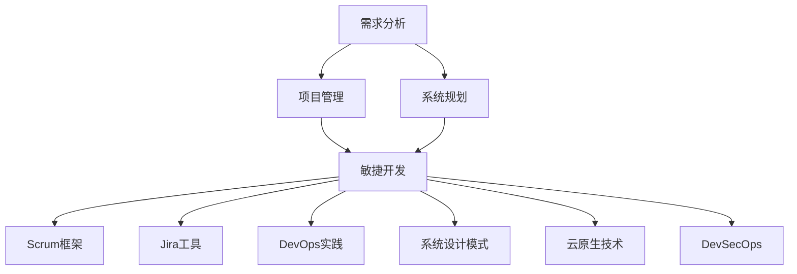
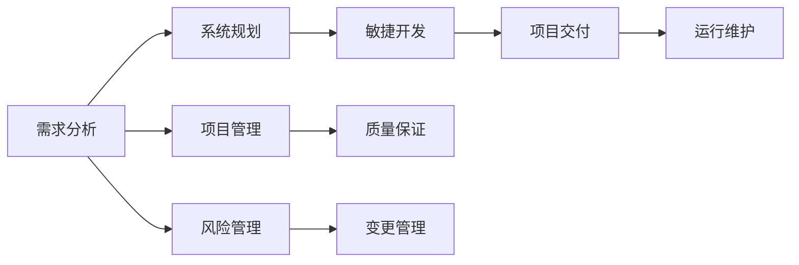
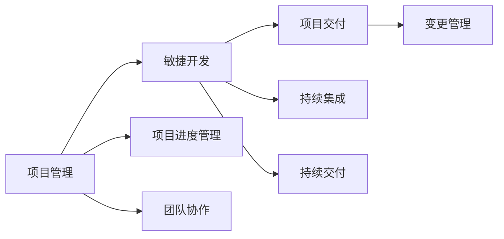
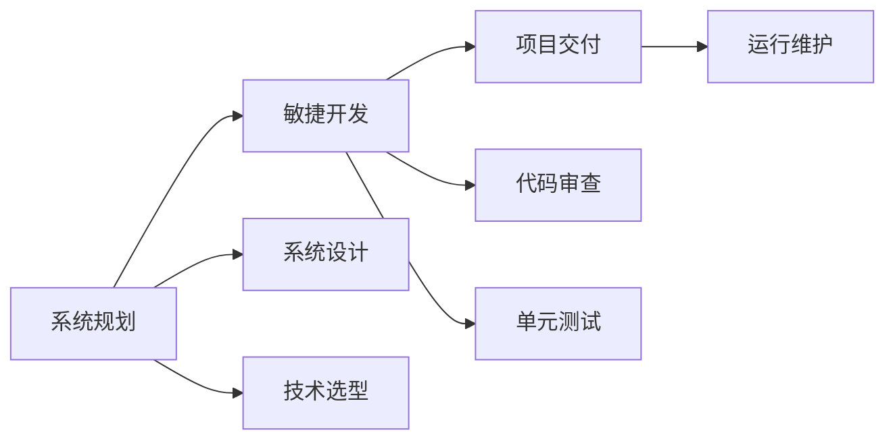

                 

# 需求分析、项目管理、系统规划能力核心培养

> 关键词：
- 需求分析
- 项目管理
- 系统规划
- 敏捷开发
- Scrum框架
- Jira工具
- DevOps实践
- 系统设计模式
- 云原生技术
- DevSecOps
- 软件质量保证

## 1. 背景介绍

### 1.1 问题由来

在当今快速变化的软件开发环境中，需求分析、项目管理、系统规划等核心能力已经成为软件开发成败的关键因素。随着技术栈的日益丰富和复杂化，以及业务需求的不断变化，如何高效、准确地理解和实现客户需求，确保项目按时交付，已经成为众多软件企业面临的共同挑战。这些问题如果不能得到妥善解决，将会导致项目延期、质量问题、成本超支等风险，最终影响企业的市场竞争力和客户满意度。

因此，本文将深入探讨需求分析、项目管理、系统规划等核心能力培养的重要性，并结合最新的敏捷开发实践，为软件开发人员提供全面、系统的方法论和工具建议，以帮助他们在复杂多变的软件开发环境中游刃有余，实现高效、高质量的软件交付。

### 1.2 问题核心关键点

本文聚焦于以下几个核心问题：

- 如何准确理解客户需求，并将其转化为可执行的技术方案？
- 在多变的市场环境中，如何有效管理项目进度和资源？
- 如何设计高效、可扩展、易于维护的系统架构？
- 如何在软件开发过程中，持续保证软件质量和安全性？

### 1.3 问题研究意义

掌握需求分析、项目管理、系统规划等核心能力，对于软件开发人员而言，不仅能够提升自身技术水平，还能提升整个团队的协作效率和交付质量。这些能力直接影响项目的成功与否，关系到企业的发展速度和竞争力。因此，深入学习这些核心能力的培养方法，对于软件开发人员、项目经理、系统架构师等各角色而言，都具有重要的实际意义。

## 2. 核心概念与联系

### 2.1 核心概念概述

为更好地理解需求分析、项目管理、系统规划等核心能力，本节将介绍几个密切相关的核心概念：

- **需求分析**：指通过与客户沟通、市场调研等方式，准确理解客户需求，并将其转化为具体的技术方案的过程。需求分析是项目成功的基础，决定着系统的功能性、可用性和用户满意度。

- **项目管理**：指通过有效的计划、组织、控制、协调等手段，确保项目按时、按质、按预算交付的过程。项目管理包括进度管理、成本管理、质量管理等关键环节，是项目成功实施的关键。

- **系统规划**：指在理解客户需求的基础上，设计高效、可扩展、易于维护的系统架构，包括技术选型、系统分层、数据模型设计等环节。系统规划决定了系统的性能、可靠性和可维护性。

- **敏捷开发**：指通过迭代、增量交付等方式，快速响应客户需求变化，提升项目交付效率和质量的软件开发方法。敏捷开发强调团队协作、持续集成、持续交付等理念。

- **Scrum框架**：一种敏捷开发框架，通过Sprint迭代、每日站会、回顾会议等手段，促进团队协作和交付效率。Scrum框架适用于小型、跨职能团队。

- **Jira工具**：一种项目管理工具，支持敏捷开发、任务跟踪、版本控制等功能。Jira工具可以帮助团队高效管理项目进度和任务分配。

- **DevOps实践**：一种将软件开发和运维整合的软件交付模式，通过持续集成、持续交付、持续监控等手段，提升软件交付效率和质量。

- **系统设计模式**：指在设计系统架构时常用的设计原则和模式，如MVC、观察者模式、工厂模式等，可以提高系统设计的高效性和可维护性。

- **云原生技术**：指在云平台上开发、部署和运维应用程序的技术，包括容器化、微服务、DevOps等实践。云原生技术能够提升系统的弹性和可扩展性。

- **DevSecOps**：一种将安全、开发和运维整合的软件交付模式，通过持续集成、持续交付、持续监控等手段，提升软件交付的安全性和质量。

这些核心概念之间的逻辑关系可以通过以下Mermaid流程图来展示：



这个流程图展示了大语言模型的核心概念及其之间的关系：

1. 需求分析是项目管理的基础。
2. 项目管理是系统规划的保障。
3. 系统规划是敏捷开发的起点。
4. 敏捷开发、Scrum框架、Jira工具等是项目管理的具体实践手段。
5. DevOps实践、系统设计模式、云原生技术、DevSecOps等是敏捷开发和项目管理的重要支撑。

### 2.2 概念间的关系

这些核心概念之间存在着紧密的联系，形成了软件开发过程的整体生态系统。下面我通过几个Mermaid流程图来展示这些概念之间的关系。

#### 2.2.1 软件开发流程



这个流程图展示了软件开发流程的主要环节：需求分析、系统规划、敏捷开发、项目交付、运行维护、项目管理、质量保证和风险管理。这些环节紧密关联，共同构成了一个完整的软件开发过程。

#### 2.2.2 项目管理与敏捷开发



这个流程图展示了项目管理与敏捷开发之间的关系。项目管理通过进度管理、团队协作等手段，为敏捷开发提供保障；敏捷开发通过持续集成、持续交付等手段，促进项目交付效率和质量。

#### 2.2.3 系统规划与敏捷开发



这个流程图展示了系统规划与敏捷开发之间的关系。系统规划通过系统设计、技术选型等手段，为敏捷开发提供技术基础；敏捷开发通过代码审查、单元测试等手段，提升软件质量和可靠性。

## 3. 核心算法原理 & 具体操作步骤

### 3.1 算法原理概述

需求分析、项目管理、系统规划等核心能力的培养，涉及多方面的技能和知识。以下是这些能力的具体算法原理和操作步骤：

#### 3.1.1 需求分析算法原理

需求分析的算法原理包括：

- **需求捕获**：通过与客户沟通、调研市场等方式，获取客户需求。
- **需求建模**：将客户需求转化为具体的技术方案，如使用UML图、用例图等建模工具。
- **需求验证**：通过原型验证、用户测试等方式，确保需求文档的准确性和可行性。

#### 3.1.2 项目管理算法原理

项目管理的算法原理包括：

- **项目规划**：通过WBS（Work Breakdown Structure）等方式，将项目任务分解为可执行的子任务。
- **进度管理**：通过甘特图、Scrum板等方式，跟踪项目进度和任务状态。
- **成本管理**：通过资源分配、预算控制等方式，确保项目按时、按预算交付。
- **质量管理**：通过代码审查、单元测试等方式，确保软件质量。

#### 3.1.3 系统规划算法原理

系统规划的算法原理包括：

- **系统设计**：通过组件化、模块化等方式，设计高效、可扩展的系统架构。
- **技术选型**：选择适合项目的开发语言、框架、库等技术栈。
- **数据模型设计**：设计高效的数据模型，确保数据一致性和安全性。

### 3.2 算法步骤详解

#### 3.2.1 需求分析具体操作步骤

1. **需求捕获**：
   - 通过与客户沟通、调研市场等方式，获取客户需求。
   - 通过问卷调查、焦点小组等方式，深入了解客户痛点。
   - 记录客户需求，生成需求文档。

2. **需求建模**：
   - 使用UML图、用例图等方式，将客户需求转化为具体的技术方案。
   - 设计系统架构，确定技术栈和组件划分。
   - 编写需求规格文档，明确功能需求和性能指标。

3. **需求验证**：
   - 通过原型验证、用户测试等方式，确保需求文档的准确性和可行性。
   - 收集用户反馈，调整和优化需求文档。
   - 生成需求变更记录，确保需求变化可追溯。

#### 3.2.2 项目管理具体操作步骤

1. **项目规划**：
   - 通过WBS（Work Breakdown Structure）等方式，将项目任务分解为可执行的子任务。
   - 确定项目里程碑和关键路径，确保项目按时完成。
   - 分配任务，明确责任人和截止日期。

2. **进度管理**：
   - 使用甘特图、Scrum板等方式，跟踪项目进度和任务状态。
   - 定期召开站会，了解任务进展和遇到的问题。
   - 调整任务优先级，确保关键任务按时完成。

3. **成本管理**：
   - 通过资源分配、预算控制等方式，确保项目按时、按预算交付。
   - 定期评估成本，调整预算分配。
   - 监控项目成本，确保不超预算。

4. **质量管理**：
   - 通过代码审查、单元测试等方式，确保软件质量。
   - 进行功能测试、性能测试，确保系统稳定可靠。
   - 记录问题，及时修复和优化。

#### 3.2.3 系统规划具体操作步骤

1. **系统设计**：
   - 通过组件化、模块化等方式，设计高效、可扩展的系统架构。
   - 设计系统分层，明确各层的功能和责任。
   - 确定系统接口和通信协议。

2. **技术选型**：
   - 选择适合项目的开发语言、框架、库等技术栈。
   - 考虑技术栈的可扩展性和维护性。
   - 确保技术选型符合项目需求和预算。

3. **数据模型设计**：
   - 设计高效的数据模型，确保数据一致性和安全性。
   - 确定数据库表结构，设计索引和约束。
   - 编写数据模型文档，确保团队协作和数据一致。

### 3.3 算法优缺点

需求分析、项目管理、系统规划等核心能力的培养，涉及多方面的技能和知识。以下是这些能力的具体优缺点：

#### 3.3.1 需求分析的优缺点

- **优点**：
  - 能够深入理解客户需求，确保系统功能满足客户期望。
  - 通过需求验证，确保需求文档的准确性和可行性。
  - 减少项目延期和返工的风险，提升项目成功率。

- **缺点**：
  - 需求捕获和建模需要大量的时间和资源。
  - 客户需求可能不断变化，需求文档需要频繁更新。
  - 需求文档容易理解难度大，需要团队共同维护。

#### 3.3.2 项目管理的优缺点

- **优点**：
  - 能够有效跟踪项目进度和任务状态，确保项目按时完成。
  - 通过成本管理，确保项目在预算内完成。
  - 通过质量管理，确保软件质量和可靠性。

- **缺点**：
  - 项目管理需要较强的组织和协调能力，容易受团队成员主观因素影响。
  - 项目变更可能会影响进度和成本，需要及时调整和沟通。
  - 项目管理工具和流程需要根据项目特点进行定制，复杂度较高。

#### 3.3.3 系统规划的优缺点

- **优点**：
  - 能够设计高效、可扩展、易于维护的系统架构。
  - 通过技术选型，选择适合项目的开发语言、框架、库等。
  - 通过数据模型设计，确保数据一致性和安全性。

- **缺点**：
  - 系统规划需要深入理解客户需求和技术栈，知识要求高。
  - 系统设计初期可能会遇到技术选型和架构优化的问题。
  - 系统规划需要反复迭代和调整，投入时间较多。

### 3.4 算法应用领域

需求分析、项目管理、系统规划等核心能力的应用，涵盖软件开发的全过程。以下是这些能力的具体应用领域：

#### 3.4.1 需求分析应用领域

- **产品开发**：通过需求分析，确定产品的功能和性能指标。
- **定制开发**：通过需求分析，明确定制需求，确保系统满足客户要求。
- **系统集成**：通过需求分析，确定系统接口和通信协议，确保系统互通。

#### 3.4.2 项目管理应用领域

- **企业内部项目**：通过项目管理，确保企业内部项目按时、按预算交付。
- **软件开发项目**：通过项目管理，确保软件开发项目高效、高质量完成。
- **国际合作项目**：通过项目管理，协调跨时区和跨文化团队，确保项目顺利推进。

#### 3.4.3 系统规划应用领域

- **大数据项目**：通过系统规划，设计高效、可扩展的大数据架构。
- **云计算项目**：通过系统规划，选择适合云计算的架构和组件。
- **IoT项目**：通过系统规划，设计高效的物联网架构和协议。

## 4. 数学模型和公式 & 详细讲解 & 举例说明

### 4.1 数学模型构建

本节将使用数学语言对需求分析、项目管理、系统规划等核心能力进行更加严格的刻画。

#### 4.1.1 需求分析数学模型构建

假设客户需求用D表示，需求文档用Dd表示，需求验证用Dv表示，需求变更用Dc表示。需求分析的数学模型可以表示为：

$$
Dd = D \times Dv \times Dc
$$

其中：

- $D$：客户需求。
- $Dd$：需求文档。
- $Dv$：需求验证。
- $Dc$：需求变更。

需求分析的目标是通过需求捕获、需求建模、需求验证等步骤，将客户需求D转化为需求文档Dd，确保需求文档Dd的准确性和可行性。

#### 4.1.2 项目管理数学模型构建

假设项目里程碑用Pm表示，项目任务用Pt表示，项目进度用Ps表示，项目成本用Pc表示，项目质量用Pq表示。项目管理的数学模型可以表示为：

$$
Ps = Pm \times Pt \times Pc \times Pq
$$

其中：

- $Pm$：项目里程碑。
- $Pt$：项目任务。
- $Ps$：项目进度。
- $Pc$：项目成本。
- $Pq$：项目质量。

项目管理的目标是通过项目规划、进度管理、成本管理、质量管理等步骤，确保项目Ps按时、按预算、高质量完成。

#### 4.1.3 系统规划数学模型构建

假设系统架构用Sa表示，技术选型用St表示，数据模型用Sd表示，系统接口用Si表示。系统规划的数学模型可以表示为：

$$
Sa = St \times Sd \times Si
$$

其中：

- $Sa$：系统架构。
- $St$：技术选型。
- $Sd$：数据模型。
- $Si$：系统接口。

系统规划的目标是通过系统设计、技术选型、数据模型设计等步骤，设计高效、可扩展、易于维护的系统架构Sa，确保系统功能和性能满足客户需求。

### 4.2 公式推导过程

#### 4.2.1 需求分析公式推导

需求分析的公式推导过程如下：

1. 需求捕获：
   - $D = F_{需求捕获}(C_{客户需求}, C_{调研市场})$

2. 需求建模：
   - $Dd = F_{需求建模}(D, C_{UML图}, C_{用例图})$

3. 需求验证：
   - $Dv = F_{需求验证}(Dd, C_{原型验证}, C_{用户测试})$

4. 需求变更：
   - $Dc = F_{需求变更}(Dv, C_{需求变更记录})$

通过上述公式，可以推导出需求分析的数学模型：

$$
Dd = F_{需求分析}(D, Dv, Dc) = (D \times F_{需求捕获}(C_{客户需求}, C_{调研市场}) \times F_{需求建模}(D, C_{UML图}, C_{用例图}) \times F_{需求验证}(Dd, C_{原型验证}, C_{用户测试})) \times F_{需求变更}(Dv, C_{需求变更记录}))
$$

#### 4.2.2 项目管理公式推导

项目管理公式推导过程如下：

1. 项目规划：
   - $Pm = F_{项目规划}(C_{项目任务}, C_{WBS}, C_{里程碑})$

2. 进度管理：
   - $Ps = F_{进度管理}(Pm, Pt, Ps)$

3. 成本管理：
   - $Pc = F_{成本管理}(Pm, Pt, Pc)$

4. 质量管理：
   - $Pq = F_{质量管理}(Pm, Pt, Pc, Pq)$

通过上述公式，可以推导出项目管理的数学模型：

$$
Ps = F_{项目管理}(Pm, Pt, Pc, Pq) = Pm \times F_{项目规划}(C_{项目任务}, C_{WBS}, C_{里程碑}) \times Ps \times Pc \times Pq
$$

#### 4.2.3 系统规划公式推导

系统规划公式推导过程如下：

1. 系统设计：
   - $Sa = F_{系统设计}(C_{技术选型}, C_{系统分层}, C_{接口协议})$

2. 技术选型：
   - $St = F_{技术选型}(C_{开发语言}, C_{框架}, C_{库})$

3. 数据模型设计：
   - $Sd = F_{数据模型设计}(C_{数据库表结构}, C_{索引约束})$

通过上述公式，可以推导出系统规划的数学模型：

$$
Sa = F_{系统规划}(St, Sd, Si) = St \times Sd \times Si
$$

### 4.3 案例分析与讲解

#### 4.3.1 需求分析案例分析

假设某公司需要开发一款电商平台，客户需求D如下：

- 用户注册、登录、退出功能
- 商品展示、搜索、筛选功能
- 购物车功能
- 订单管理、支付功能
- 客户服务功能

需求捕获通过与客户沟通、调研市场等方式，获取客户需求D：

- 用户注册、登录、退出功能
- 商品展示、搜索、筛选功能
- 购物车功能
- 订单管理、支付功能
- 客户服务功能

需求建模使用UML图、用例图等方式，将客户需求D转化为需求文档Dd：

- 用户注册、登录、退出功能：包含注册页面、登录页面、退出页面、验证功能。
- 商品展示、搜索、筛选功能：包含商品列表页面、商品详情页面、搜索页面、筛选页面。
- 购物车功能：包含购物车页面、添加商品功能、修改商品数量功能、删除商品功能。
- 订单管理、支付功能：包含订单页面、订单详情页面、支付页面、订单确认功能。
- 客户服务功能：包含客服聊天页面、客服消息记录功能。

需求验证通过原型验证、用户测试等方式，确保需求文档Dd的准确性和可行性：

- 用户注册、登录、退出功能：通过原型验证确保用户可以正常注册、登录、退出。
- 商品展示、搜索、筛选功能：通过用户测试确保商品展示、搜索、筛选功能正常。
- 购物车功能：通过用户测试确保购物车功能正常。
- 订单管理、支付功能：通过用户测试确保订单管理、支付功能正常。
- 客户服务功能：通过用户测试确保客户服务功能正常。

需求变更通过需求变更记录，确保需求变化可追溯：

- 需求变更记录包括变更时间、变更原因、变更内容等。
- 通过需求变更记录，确保需求文档Dd随客户需求变化而变化。

#### 4.3.2 项目管理案例分析

假设某软件开发项目，项目里程碑Pm如下：

- 需求分析阶段
- 系统设计阶段
- 编码实现阶段
- 测试阶段
- 部署阶段
- 运维阶段

项目任务Pt如下：

- 需求分析任务
- 系统设计任务
- 编码实现任务
- 测试任务
- 部署任务
- 运维任务

项目进度Ps如下：

- 需求分析阶段：第1-2周
- 系统设计阶段：第3-4周
- 编码实现阶段：第5-10周
- 测试阶段：第11-12周
- 部署阶段：第13周
- 运维阶段：第14周

项目成本Pc如下：

- 需求分析阶段：2万元
- 系统设计阶段：3万元
- 编码实现阶段：5万元
- 测试阶段：2万元
- 部署阶段：1万元
- 运维阶段：1万元

项目质量Pq如下：

- 需求分析阶段：需求文档通过客户验证
- 系统设计阶段：系统架构通过团队评审
- 编码实现阶段：代码通过单元测试和集成测试
- 测试阶段：软件通过功能测试和性能测试
- 部署阶段：系统部署顺利
- 运维阶段：系统稳定运行

项目管理的数学模型可以表示为：

$$
Ps = F_{项目管理}(Pm, Pt, Pc, Pq) = Pm \times F_{项目规划}(C_{项目任务}, C_{WBS}, C_{里程碑}) \times Ps \times Pc \times Pq
$$

#### 4.3.3 系统规划案例分析

假设某公司需要开发一个电商平台，系统架构Sa如下：

- 前端层：用户界面、商品展示、搜索、筛选功能。
- 后端层：用户管理、订单管理、支付功能。
- 数据库层：用户数据、商品数据、订单数据。

技术选型St如下：

- 前端层：React、Vue.js
- 后端层：Spring Boot、Flask
- 数据库层：MySQL、MongoDB

数据模型设计Sd如下：

- 用户数据：包含用户ID、用户名、密码、电子邮件、注册时间等字段。
- 商品数据：包含商品ID、商品名称、商品描述、商品价格、商品图片等字段。
- 订单数据：包含订单ID、用户ID、商品ID、订单状态、订单金额等字段。

系统接口设计Si如下：

- 前端层与后端层：RESTful接口
- 后端层与数据库层：JDBC接口

系统规划的数学模型可以表示为：

$$
Sa = F_{系统规划}(St, Sd, Si) = St \times Sd \times Si
$$

## 5. 项目实践：代码实例和详细解释说明

### 5.1 开发环境搭建

在进行需求分析、项目管理、系统规划等核心能力实践前，我们需要准备好开发环境。以下是使用Python进行Jira工具开发的环境配置流程：

1. 安装Anaconda：从官网下载并安装Anaconda，用于创建独立的Python环境。

2. 创建并激活虚拟环境：
```bash
conda create -n pyjira python=3.8 
conda activate pyjira
```

3. 安装相关库：
```bash
pip install jira
pip install requests
pip install beautifulsoup4
```

4. 配置Jira环境变量：
```bash
export JIRA_URL=<你的Jira服务器地址>
export JIRA_USERNAME=<你的Jira用户名>
export JIRA_PASSWORD=<你的Jira密码>
```

完成上述步骤后，即可在`pyjira`环境中开始Jira工具的开发实践。

### 5.2 源代码详细实现

下面我们以Jira工具为例，给出基于Python的Jira任务管理系统的代码实现。

首先，定义Jira任务类：

```python
from jira import Jira

class JiraTask:
    def __init__(self, jira):
        self.jira = jira
    
    def get_task(self, issue_key):
        return self.jira.get_issues(issue_key)[0]
    
    def update_task(self, issue_key, status):
        self.jira.update_issue(issue_key, fields={'status': {'id': '10100'}, 'summary': 'Updated task'})
    
    def add_comment(self, issue_key, comment):
        self.jira.add_comment(issue_key, body=comment)
```

然后，定义Jira任务管理类：

```python
from jira import Jira

class JiraManager:
    def __init__(self, jira):
        self.jira = jira
    
    def create_task(self, project_key, summary, description):
        task = self.jira.create_issue(project=project_key, fields={'project': project_key, 'summary': summary, 'description':

