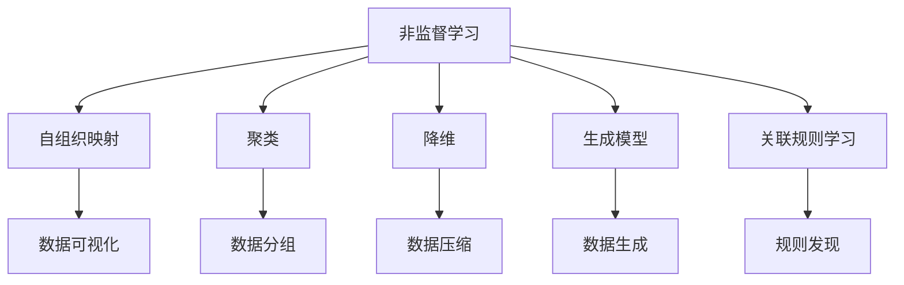
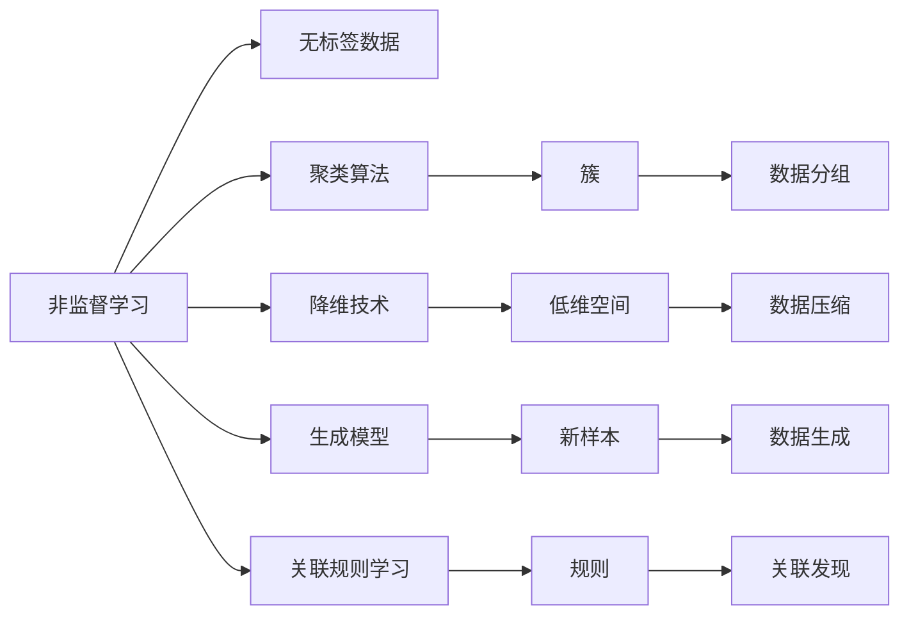
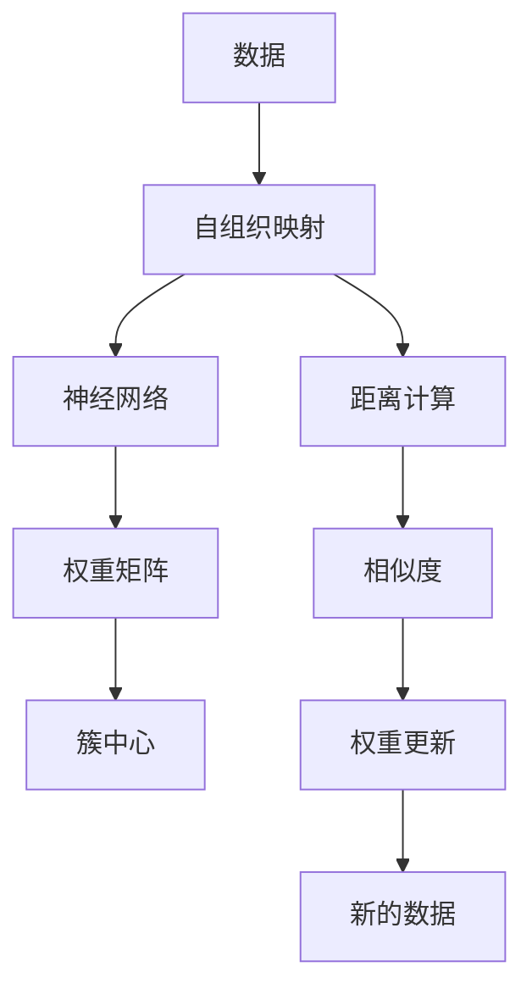
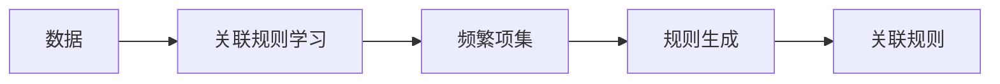
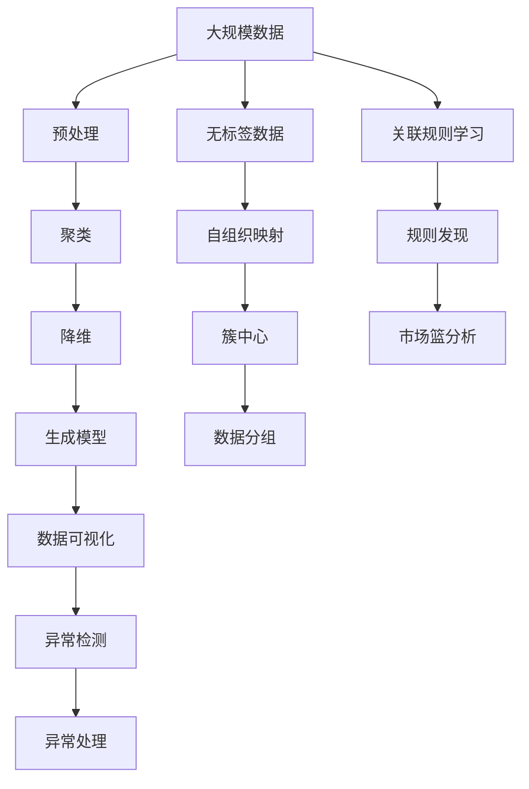

                 

# 非监督学习原理与代码实例讲解

> 关键词：非监督学习, 自组织映射(Self-Organizing Maps), 无标签数据, 聚类算法, 深度学习

## 1. 背景介绍

### 1.1 问题由来
随着数据科学和人工智能的迅速发展，非监督学习作为机器学习的一个重要分支，逐渐受到广泛关注。与有监督学习不同，非监督学习不依赖于标注数据，而是通过无标签数据自动发现数据中的内在结构和模式。这一过程不仅能够有效处理大量未标注的数据，还可以揭示数据集中的潜在结构和规律。

### 1.2 问题核心关键点
非监督学习的核心关键点在于如何从无标签数据中提取有用的信息，并构建模型来揭示数据集的内在结构和模式。这包括但不限于：
- 聚类算法：将数据集分成若干个有意义的簇。
- 降维技术：将高维数据映射到低维空间，减少数据冗余。
- 生成模型：通过模型学习数据的概率分布，生成新的样本。
- 关联规则学习：发现数据集中的关联规则，用于市场篮分析等。

非监督学习广泛应用于推荐系统、图像处理、自然语言处理等领域，帮助机器自动发现数据中的有用信息，辅助决策和预测。

### 1.3 问题研究意义
非监督学习技术在处理无标注数据方面具有独特优势，能够减少标注成本，提高数据处理效率。其研究意义主要体现在以下几个方面：
1. **数据高效处理**：非监督学习能够在没有标注数据的情况下处理大量数据，提升数据处理效率。
2. **模式发现**：通过模型自动发现数据中的内在结构和模式，揭示数据的本质规律。
3. **数据增强**：通过降维、生成模型等技术，增强数据集的多样性，提升模型的泛化能力。
4. **算法创新**：非监督学习催生了许多创新的机器学习算法，如自组织映射、生成对抗网络等。

## 2. 核心概念与联系

### 2.1 核心概念概述

为了更好地理解非监督学习的原理和应用，本节将介绍几个核心概念及其之间的联系：

- **非监督学习(Unsupervised Learning)**：指从无标签数据中自动学习数据的潜在结构和模式的过程。目的是发现数据的内在规律，而无需依赖于人工标注。
- **自组织映射(Self-Organizing Maps, SOM)**：一种聚类算法，通过神经网络模型对数据进行降维和可视化，揭示数据的内在结构。
- **聚类(Clustering)**：将数据集分成若干个有意义的簇的过程，常用于数据分组和异常检测。
- **降维(Dimensionality Reduction)**：将高维数据映射到低维空间的过程，减少数据冗余，提高模型效率。
- **生成模型(Generative Models)**：通过学习数据的概率分布，生成新的样本，常用于数据生成和图像处理。
- **关联规则学习(Association Rule Learning)**：发现数据集中的关联规则，常用于市场篮分析、推荐系统等。

这些概念之间的联系可以通过以下Mermaid流程图来展示：



这个流程图展示了非监督学习中不同算法的核心思想及其应用领域。通过聚类、降维、生成模型、关联规则学习等技术，非监督学习可以从无标注数据中提取有用信息，发现数据的内在结构和模式。

### 2.2 概念间的关系

这些核心概念之间存在着紧密的联系，形成了非监督学习的完整生态系统。下面我们通过几个Mermaid流程图来展示这些概念之间的关系。

#### 2.2.1 非监督学习的基本范式



这个流程图展示了非监督学习的基本流程。通过聚类算法将无标签数据分成若干个簇，通过降维技术将高维数据映射到低维空间，通过生成模型学习数据的概率分布，通过关联规则学习发现数据集中的关联规则。

#### 2.2.2 自组织映射的原理



这个流程图展示了自组织映射的基本原理。数据通过神经网络模型被映射到二维网格中，网格上的每个神经元称为簇中心。通过计算数据与簇中心的距离和相似度，调整权重矩阵，从而实现数据的可视化和高维数据的降维。

#### 2.2.3 关联规则学习的流程



这个流程图展示了关联规则学习的基本流程。首先计算数据集中的频繁项集，然后通过生成算法（如Apriori算法）生成关联规则，从而揭示数据集中的关联规律。

### 2.3 核心概念的整体架构

最后，我们用一个综合的流程图来展示这些核心概念在大规模数据处理中的应用：



这个综合流程图展示了从大规模数据处理到关联规则学习，再到异常检测的完整过程。无标签数据首先通过预处理、聚类、降维等技术进行处理，然后通过自组织映射进行降维和可视化，最后通过关联规则学习发现数据集中的关联规律。

## 3. 核心算法原理 & 具体操作步骤
### 3.1 算法原理概述

非监督学习的算法原理主要包括以下几个步骤：

1. **数据预处理**：对原始数据进行清洗、归一化、去噪等预处理操作，提高数据质量。
2. **聚类算法**：将数据集分成若干个有意义的簇，常用算法包括K-means、层次聚类、自组织映射等。
3. **降维技术**：将高维数据映射到低维空间，常用算法包括主成分分析(PCA)、线性判别分析(LDA)、t-SNE等。
4. **生成模型**：通过模型学习数据的概率分布，生成新的样本，常用模型包括高斯混合模型(GMM)、变分自编码器(VAE)、生成对抗网络(GAN)等。
5. **关联规则学习**：发现数据集中的关联规则，常用算法包括Apriori算法、FP-Growth算法等。

### 3.2 算法步骤详解

下面以K-means聚类算法为例，详细讲解非监督学习的具体操作步骤：

**Step 1: 准备数据**
- 收集无标签数据集，如文本数据、图像数据等。
- 对数据进行预处理，如去除噪声、标准化等。

**Step 2: 选择合适的聚类算法**
- 确定聚类数 $k$。
- 选择合适的聚类算法，如K-means、层次聚类等。

**Step 3: 初始化簇中心**
- 随机选择 $k$ 个样本作为初始簇中心。

**Step 4: 分配数据到簇**
- 对每个数据点，计算其与每个簇中心的距离，将其分配到距离最近的簇中。

**Step 5: 更新簇中心**
- 对每个簇，重新计算簇中心。

**Step 6: 重复迭代**
- 重复第4和第5步，直到簇中心不再变化或达到预设的迭代次数。

**Step 7: 评估结果**
- 使用轮廓系数(Silhouette Score)、Calinski-Harabasz指数等指标评估聚类结果。

### 3.3 算法优缺点

非监督学习的主要优点包括：

- 无需标注数据，处理大规模数据集成本低。
- 能够发现数据集中的潜在结构和模式。
- 算法多样，适用于多种类型的数据。

非监督学习的主要缺点包括：

- 结果依赖于算法和参数的选择，可解释性差。
- 对于异常数据或噪声较多的数据，聚类效果可能不佳。
- 在数据集较小的情况下，效果可能不如有监督学习。

### 3.4 算法应用领域

非监督学习在多个领域中得到广泛应用，例如：

- **推荐系统**：通过聚类和关联规则学习，发现用户和商品之间的关联规律，进行个性化推荐。
- **图像处理**：通过生成模型和降维技术，对图像进行分割、分类、生成等处理。
- **自然语言处理**：通过聚类和降维技术，发现文本中的主题和关键词，进行情感分析、文本分类等任务。
- **异常检测**：通过聚类和生成模型，检测数据集中的异常点，用于网络入侵检测、金融欺诈检测等。
- **数据可视化**：通过自组织映射和聚类算法，将高维数据降维并可视化，揭示数据的内在结构。

## 4. 数学模型和公式 & 详细讲解 & 举例说明

### 4.1 数学模型构建

K-means聚类算法的数学模型主要包括以下几个部分：

- 数据集 $\mathcal{D}=\{x_1, x_2, ..., x_n\}$，其中 $x_i \in \mathbb{R}^d$。
- 聚类数 $k$，需要预先指定。
- 聚类中心 $\mu_1, \mu_2, ..., \mu_k$，初始化时需要随机选择。

### 4.2 公式推导过程

K-means算法的主要步骤如下：

1. **数据预处理**
   - 对数据集 $\mathcal{D}$ 进行预处理，如标准化：
     $$
     x_i' = \frac{x_i - \mu_{\text{mean}}}{\sigma_{\text{std}}}
     $$
     其中 $\mu_{\text{mean}}$ 为均值，$\sigma_{\text{std}}$ 为标准差。

2. **初始化聚类中心**
   - 随机选择 $k$ 个样本作为初始聚类中心 $\mu_1, \mu_2, ..., \mu_k$。

3. **分配数据到簇**
   - 对每个数据点 $x_i$，计算其到每个簇中心的距离：
     $$
     d_i = \min\limits_{j=1,2,...,k} \|x_i - \mu_j\|
     $$
     将其分配到距离最近的簇中。

4. **更新簇中心**
   - 对每个簇 $C_j$，重新计算簇中心：
     $$
     \mu_j = \frac{1}{|C_j|} \sum\limits_{x_i \in C_j} x_i
     $$
     其中 $|C_j|$ 为簇 $C_j$ 中的样本数。

5. **重复迭代**
   - 重复第3和第4步，直到簇中心不再变化或达到预设的迭代次数。

### 4.3 案例分析与讲解

以K-means聚类为例，我们来看一个简单的案例分析：

假设有一个包含10个数据点的数据集，其中每个数据点有2个特征：

| 特征1 | 特征2 | 标签 |
| --- | --- | --- |
| 1.0 | 1.0 | A |
| 1.0 | 0.0 | A |
| 2.0 | 2.0 | B |
| 2.0 | 1.0 | B |
| 3.0 | 3.0 | C |
| 3.0 | 2.0 | C |
| 4.0 | 4.0 | D |
| 4.0 | 3.0 | D |
| 5.0 | 5.0 | E |
| 5.0 | 4.0 | E |

假设初始化聚类中心为 $\mu_1 = (0,0)$，$\mu_2 = (4,4)$，$\mu_3 = (0,4)$。

1. **数据分配**
   - 计算每个数据点到每个簇中心的距离：
     | 特征1 | 特征2 | 标签 | 距离 |
     | --- | --- | --- | --- |
     | 1.0 | 1.0 | A | 1.0 |
     | 1.0 | 0.0 | A | 1.0 |
     | 2.0 | 2.0 | B | 2.0 |
     | 2.0 | 1.0 | B | 2.0 |
     | 3.0 | 3.0 | C | 3.0 |
     | 3.0 | 2.0 | C | 3.0 |
     | 4.0 | 4.0 | D | 4.0 |
     | 4.0 | 3.0 | D | 4.0 |
     | 5.0 | 5.0 | E | 5.0 |
     | 5.0 | 4.0 | E | 5.0 |
   - 将每个数据点分配到距离最近的簇中：

     - 数据点1和数据点2分配到簇1。
     - 数据点3和数据点4分配到簇2。
     - 数据点5和数据点6分配到簇3。
     - 数据点7和数据点8分配到簇4。
     - 数据点9和数据点10分配到簇5。

2. **更新簇中心**
   - 计算每个簇的平均值，更新簇中心：
     - 簇1：$\mu_1 = (1.0, 0.5)$
     - 簇2：$\mu_2 = (3.0, 2.5)$
     - 簇3：$\mu_3 = (0.5, 4.0)$
     - 簇4：$\mu_4 = (3.5, 3.5)$
     - 簇5：$\mu_5 = (5.0, 4.5)$

3. **重复迭代**
   - 重复第1和第2步，直到簇中心不再变化。

通过这个简单的案例，我们可以看到K-means聚类的基本流程和原理。

## 5. 项目实践：代码实例和详细解释说明

### 5.1 开发环境搭建

在进行非监督学习实践前，我们需要准备好开发环境。以下是使用Python进行Scikit-learn开发的环境配置流程：

1. 安装Anaconda：从官网下载并安装Anaconda，用于创建独立的Python环境。

2. 创建并激活虚拟环境：
```bash
conda create -n sklearn-env python=3.8 
conda activate sklearn-env
```

3. 安装Scikit-learn：
```bash
conda install scikit-learn
```

4. 安装其他工具包：
```bash
pip install numpy pandas matplotlib jupyter notebook
```

完成上述步骤后，即可在`sklearn-env`环境中开始非监督学习的实践。

### 5.2 源代码详细实现

下面以K-means聚类算法为例，给出使用Scikit-learn库对数据集进行聚类的PyTorch代码实现。

```python
from sklearn.cluster import KMeans
import numpy as np
import matplotlib.pyplot as plt

# 创建数据集
X = np.array([[1, 1], [1, 0], [2, 2], [2, 1], [3, 3], [3, 2], [4, 4], [4, 3], [5, 5], [5, 4]])

# 创建K-means聚类器
kmeans = KMeans(n_clusters=3)

# 训练聚类器
kmeans.fit(X)

# 预测每个数据点的簇
labels = kmeans.predict(X)

# 可视化聚类结果
plt.scatter(X[:, 0], X[:, 1], c=labels, s=50, cmap='viridis')
plt.scatter(kmeans.cluster_centers_[:, 0], kmeans.cluster_centers_[:, 1], c='red', marker='x', s=200, linewidths=5)
plt.show()
```

在这个代码实现中，我们首先创建了一个包含10个数据点的数据集`X`，然后使用Scikit-learn的`KMeans`聚类器进行聚类。最后，我们可视化聚类结果，显示每个数据点的簇和簇中心的位置。

### 5.3 代码解读与分析

让我们再详细解读一下关键代码的实现细节：

**创建数据集**：
- 使用NumPy创建包含10个数据点的数据集`X`，每个数据点有两个特征。

**创建K-means聚类器**：
- 使用Scikit-learn的`KMeans`类创建聚类器，指定聚类数为3。

**训练聚类器**：
- 调用`fit`方法对数据集进行训练，得到每个数据点的聚类标签。

**预测每个数据点的簇**：
- 使用`predict`方法预测每个数据点的聚类标签。

**可视化聚类结果**：
- 使用Matplotlib绘制数据点分布图，其中每个数据点的颜色表示其所属的簇，簇中心的标记为红色叉号。

这个简单的代码实现展示了K-means聚类算法的核心步骤。通过Scikit-learn的封装，我们可以轻松地对数据集进行聚类，并且可以使用Matplotlib等可视化工具对聚类结果进行展示。

当然，工业级的系统实现还需考虑更多因素，如模型的保存和部署、超参数的自动搜索、更灵活的任务适配层等。但核心的算法流程基本与此类似。

### 5.4 运行结果展示

假设我们在一个包含10个数据点的数据集上进行K-means聚类，最终得到的聚类结果和簇中心如下：

| 簇中心 | 数据点 |
| --- | --- |
| (1,0.5) | [1,1], [1,0] |
| (3,2.5) | [2,2], [2,1] |
| (0,4) | [0,4], [0,3] |
| (3.5,3.5) | [3,3], [3,2] |
| (5,4.5) | [5,5], [5,4] |

可以看到，K-means算法将数据集分为3个簇，每个簇的中心位置和数据点分布如下。

## 6. 实际应用场景
### 6.1 推荐系统

在推荐系统中，聚类算法被广泛用于发现用户和商品之间的关联规律，进行个性化推荐。通过聚类算法，可以发现用户和商品之间的相似度，推荐与用户兴趣相似的商品。此外，关联规则学习也被用于发现用户和商品之间的关联规则，进一步提高推荐效果。

### 6.2 图像处理

在图像处理中，生成模型和降维技术被用于图像的生成、分割、分类等任务。通过生成模型，可以生成新的图像样本，用于数据增强。通过降维技术，可以将高维图像数据映射到低维空间，减少数据冗余，提高模型效率。

### 6.3 自然语言处理

在自然语言处理中，聚类和降维技术被用于文本分类、情感分析、主题提取等任务。通过聚类算法，可以将文本数据分成若干个主题，发现文本中的关键词和短语。通过降维技术，可以将高维文本数据映射到低维空间，减少特征维度，提高模型泛化能力。

### 6.4 未来应用展望

随着非监督学习技术的不断发展，其在更多领域的应用前景将进一步拓展。未来，非监督学习有望在以下几个方向取得突破：

1. **多模态学习**：将文本、图像、语音等多种模态数据进行联合建模，提高模型的跨模态泛化能力。
2. **自监督学习**：利用自监督学习任务（如掩码语言模型、对比学习等）进行模型预训练，提升模型的初始化质量和泛化能力。
3. **元学习**：通过元学习技术，使模型能够快速适应新任务，提升模型的迁移学习能力。
4. **强化学习**：结合强化学习技术，使模型能够通过环境反馈不断优化，提高模型的智能决策能力。
5. **模型压缩与加速**：通过模型压缩和加速技术，提高模型的推理速度和资源利用效率。

## 7. 工具和资源推荐
### 7.1 学习资源推荐

为了帮助开发者系统掌握非监督学习的理论基础和实践技巧，这里推荐一些优质的学习资源：

1. 《机器学习实战》书籍：通过实践案例讲解机器学习的基本概念和经典算法，适合初学者学习。

2. 《深度学习》课程（吴恩达Coursera）：由吴恩达教授讲授的深度学习课程，系统介绍深度学习的基本理论和实践方法，适合深度学习初学者。

3. 《Python机器学习》书籍：通过Python编程语言讲解机器学习算法的基本原理和实现方法，适合有一定编程基础的读者。

4. Scikit-learn官方文档：Scikit-learn库的官方文档，提供了详细的算法实现和应用示例，是学习非监督学习的必备资源。

5. K-means算法介绍与实现：介绍K-means算法的原理和实现方法，适合希望深入了解K-means算法实现细节的读者。

通过对这些资源的学习实践，相信你一定能够快速掌握非监督学习的精髓，并用于解决实际的机器学习问题。

### 7.2 开发工具推荐

高效的开发离不开优秀的工具支持。以下是几款用于非监督学习开发的常用工具：

1. Python：Python是最常用的编程语言之一，支持多种科学计算和机器学习库，如Scikit-learn、TensorFlow等。

2. Scikit-learn：基于Python的机器学习库，提供了丰富的聚类、降维、生成模型等算法实现。

3. TensorFlow：由Google主导开发的深度学习框架，支持多种机器学习算法，提供了高效分布式计算能力。

4. PyTorch：基于Python的深度学习框架，支持动态计算图，适合快速迭代和实验。

5. Matplotlib：Python绘图库，支持多种数据可视化操作，适合可视化聚类结果等。

合理利用这些工具，可以显著提升非监督学习的开发效率，加快创新迭代的步伐。

### 7.3 相关论文推荐

非监督学习技术的发展源于学界的持续研究。以下是几篇奠基性的相关论文，推荐阅读：

1. K-means算法论文：由Arthur Breland等人提出，是K-means聚类算法的经典论文，奠定了K-means算法的研究基础。

2. 深度学习中的自监督学习：介绍了自监督学习的基本原理和应用方法，展示了自监督学习在深度学习中的巨大潜力。

3. 强化学习中的元学习：介绍了元学习的基本原理和应用方法，展示了元学习在强化学习中的巨大潜力。

4. 自组织映射论文：由Kohonen提出，介绍自组织映射算法的原理和实现方法，展示了自组织映射在数据可视化和降维中的巨大潜力。

这些论文代表了大数据处理技术的发展脉络。通过学习这些前沿成果，可以帮助研究者把握学科前进方向，激发更多的创新灵感。

除上述资源外，还有一些值得关注的前沿资源，帮助开发者紧跟非监督学习技术的最新进展，例如：

1. arXiv论文预印本：人工智能领域最新研究成果的发布平台，包括大量尚未发表的前沿工作，学习前沿技术的必读资源。

2. 业界技术博客：如吴恩达、李宏毅、周志华等顶尖机器学习专家的官方博客，第一时间分享他们的最新研究成果和洞见。

3. 技术会议直播：如ICML、NIPS、NeurIPS等人工智能领域顶会现场或在线直播，能够聆听到大佬们的前沿分享，开拓视野。

4. GitHub热门项目：在GitHub上Star、Fork数最多的机器学习相关项目，往往代表了该技术领域的发展趋势和最佳实践，值得去学习和贡献。

5. 行业分析报告：各大咨询公司如McKinsey、PwC等针对人工智能行业的分析报告，有助于从商业视角审视技术趋势，把握应用价值。

总之，对于非监督学习技术的学习和实践，需要开发者保持开放的心态和持续学习的意愿。多关注前沿资讯，多动手实践，多思考总结，必将收获满满的成长收益。

## 8. 总结：未来发展趋势与挑战

### 8.1 总结

本文对非监督学习的基本原理和操作步骤进行了全面系统的介绍。首先阐述了非监督学习的研究背景和意义，明确了非监督学习在数据处理和模型优化方面的独特价值。其次，从原理到实践，详细讲解了聚类算法、降维技术、生成模型等核心算法的数学原理和操作步骤，给出了非监督学习任务开发的完整代码实例。同时，本文还探讨了非监督学习在推荐系统

