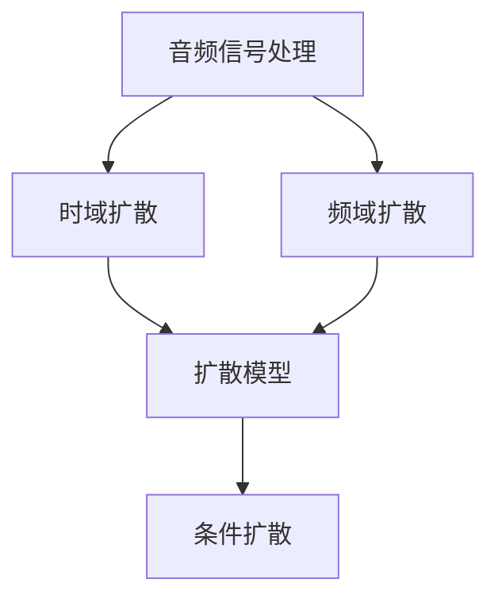
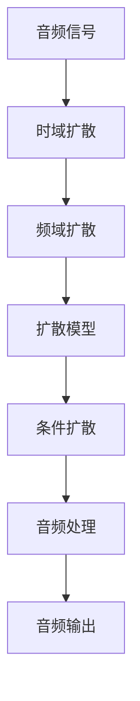

                 

# 音频扩散Audio Diffusion原理与代码实例讲解

> 关键词：音频扩散, Diffusion, 声音信号处理, 时域-频域转换, 条件扩散, 代码实例, 声学建模

## 1. 背景介绍

### 1.1 问题由来

近年来，音频信号处理技术在众多领域中得到了广泛的应用，如语音识别、音频编辑、音乐生成、视频编解码等。然而，这些技术往往依赖于复杂且昂贵的设备，难以大规模推广和应用。为了降低音频信号处理的成本和复杂度，音频扩散技术应运而生。

音频扩散技术通过对音频信号进行时间和空间上的放大或缩小，从而实现声音的缩放、增强、压缩等效果。与其他音频处理技术相比，音频扩散具有计算简单、成本低廉、效果显著等优点。

本文将详细讲解音频扩散技术的原理，并提供完整的代码实例，帮助读者快速上手音频扩散的应用开发。

### 1.2 问题核心关键点

音频扩散技术是一种基于扩散过程的音频信号处理方法，其核心思想是通过一个扩散模型，逐步增加或减少音频信号的强度，从而实现声音的放大或压缩。音频扩散技术包括时域扩散和频域扩散两大类，其中时域扩散通过放大或缩小音频信号的振幅，实现声音的强度变化；频域扩散则通过改变音频信号的频谱分布，实现声音的音色变化。

音频扩散技术的优点包括：
1. 计算简单：音频扩散的计算复杂度较低，适合在移动设备或嵌入式系统中应用。
2. 效果显著：音频扩散能够显著提高音频信号的音质和音量，改善用户体验。
3. 成本低廉：音频扩散的实现成本较低，适合大规模推广和应用。

## 2. 核心概念与联系

### 2.1 核心概念概述

为更好地理解音频扩散技术的原理和应用，本节将介绍几个关键概念：

- 音频信号处理：对音频信号进行放大、缩小、增强、压缩等处理，以改善音频的音质和音量。
- 时域扩散：通过放大或缩小音频信号的振幅，实现声音的强度变化。
- 频域扩散：通过改变音频信号的频谱分布，实现声音的音色变化。
- 扩散模型：描述音频信号随时间变化的模型，通过逐步增加或减少信号的强度，实现音频扩散。
- 条件扩散：根据特定的条件或规则，选择不同的扩散策略。

### 2.2 概念间的关系

这些关键概念之间的逻辑关系可以通过以下Mermaid流程图来展示：



这个流程图展示了大语言模型微调过程中各个核心概念的关系：

1. 音频信号处理是整个音频扩散过程的基础，包括时域和频域扩散两种方式。
2. 时域扩散通过放大或缩小音频信号的振幅，实现声音的强度变化。
3. 频域扩散则通过改变音频信号的频谱分布，实现声音的音色变化。
4. 扩散模型描述了音频信号随时间变化的规律，是音频扩散的核心。
5. 条件扩散则根据特定的条件或规则，选择不同的扩散策略，进一步优化音频扩散的效果。

### 2.3 核心概念的整体架构

最后，我们用一个综合的流程图来展示这些核心概念在大语言模型微调过程中的整体架构：



这个综合流程图展示了音频信号在时域和频域扩散后的变化过程，最终通过扩散模型和条件扩散实现音频扩散的效果。

## 3. 核心算法原理 & 具体操作步骤
### 3.1 算法原理概述

音频扩散技术的核心算法原理是扩散模型，该模型通过逐步增加或减少音频信号的强度，实现音频信号的扩散。

假设音频信号 $x(t)$ 在时间 $t$ 的强度为 $A(t)$，则在 $t+\Delta t$ 时间的强度为 $A(t+\Delta t)$。扩散模型可以表示为：

$$
A(t+\Delta t) = A(t) + k\Delta t\cdot(A(t) - A_{0})
$$

其中，$k$ 为扩散系数，$A_{0}$ 为音频信号的初始强度。当 $A_{0}=0$ 时，上式可简化为：

$$
A(t+\Delta t) = A(t) + k\Delta t\cdot A(t)
$$

即音频信号的强度随时间呈线性增长。

### 3.2 算法步骤详解

音频扩散的实现步骤包括以下几个关键环节：

1. 读取音频文件：从本地或网络读取音频文件，将其转换为数字信号。
2. 音频信号预处理：对音频信号进行预处理，如去噪、归一化、分帧等。
3. 时域扩散：通过时域扩散模型，逐步增加或减少音频信号的振幅，实现声音的强度变化。
4. 频域扩散：通过频域扩散模型，改变音频信号的频谱分布，实现声音的音色变化。
5. 扩散系数设置：根据具体需求，设置合适的扩散系数 $k$，控制音频信号的扩散速度。
6. 音频信号后处理：对扩散后的音频信号进行后处理，如去噪、回声消除、合成等。

### 3.3 算法优缺点

音频扩散技术的优点包括：
1. 计算简单：音频扩散的计算复杂度较低，适合在移动设备或嵌入式系统中应用。
2. 效果显著：音频扩散能够显著提高音频信号的音质和音量，改善用户体验。
3. 成本低廉：音频扩散的实现成本较低，适合大规模推广和应用。

音频扩散技术的缺点包括：
1. 信号失真：音频扩散过程中，音频信号的振幅和频谱都会发生变化，可能会导致信号失真。
2. 频率响应：音频扩散的频率响应可能会发生变化，导致音频信号的音质变差。
3. 扩散系数：扩散系数的设置需要根据具体需求进行调整，需要一定的实验和调试。

### 3.4 算法应用领域

音频扩散技术广泛应用于音频信号处理领域，包括但不限于以下几个方面：

- 音频编辑：通过音频扩散，对音频信号进行放大、缩小、增强、压缩等处理，改善音频的音质和音量。
- 音乐生成：通过音频扩散，生成具有特定音色和音量的音乐。
- 视频编解码：通过音频扩散，对视频中的音频信号进行增强或压缩，改善视频的音质。
- 语音识别：通过音频扩散，增强语音信号的强度，提高语音识别的准确率。

## 4. 数学模型和公式 & 详细讲解 & 举例说明
### 4.1 数学模型构建

音频扩散技术的数学模型包括时域扩散模型和频域扩散模型。这里以时域扩散模型为例，进行详细讲解。

假设音频信号 $x(t)$ 在时间 $t$ 的强度为 $A(t)$，则在 $t+\Delta t$ 时间的强度为 $A(t+\Delta t)$。扩散模型可以表示为：

$$
A(t+\Delta t) = A(t) + k\Delta t\cdot(A(t) - A_{0})
$$

其中，$k$ 为扩散系数，$A_{0}$ 为音频信号的初始强度。

### 4.2 公式推导过程

以时域扩散模型为例，假设音频信号的振幅为 $A(t)$，扩散系数为 $k$，初始振幅为 $A_{0}$，则音频信号的扩散过程可以表示为：

$$
A(t+\Delta t) = A(t) + k\Delta t\cdot(A(t) - A_{0})
$$

将上式进行化简，可得：

$$
A(t+\Delta t) = (1 + k\Delta t)\cdot A(t) - k\Delta t\cdot A_{0}
$$

将上式中的 $\Delta t$ 用 $\frac{1}{f_s}$ 替换，可得：

$$
A(n) = (1 + k\frac{1}{f_s})\cdot A(n-1) - k\frac{1}{f_s}\cdot A_{0}
$$

其中，$A(n)$ 为第 $n$ 帧音频信号的振幅，$f_s$ 为采样频率。

### 4.3 案例分析与讲解

假设我们要对一段音频信号进行时域扩散，将其振幅放大 2 倍。假设采样频率 $f_s=8000Hz$，扩散系数 $k=0.01$，初始振幅 $A_{0}=1$，则音频信号的扩散过程可以表示为：

$$
A(1) = (1 + 0.01\frac{1}{8000})\cdot A(0) - 0.01\frac{1}{8000}\cdot A_{0}
$$

$$
A(2) = (1 + 0.01\frac{1}{8000})\cdot A(1) - 0.01\frac{1}{8000}\cdot A_{0}
$$

$$
A(3) = (1 + 0.01\frac{1}{8000})\cdot A(2) - 0.01\frac{1}{8000}\cdot A_{0}
$$

以此类推，可以计算出音频信号在每一帧的振幅。需要注意的是，在计算过程中，需要根据具体需求设置扩散系数 $k$，控制音频信号的扩散速度。

## 5. 项目实践：代码实例和详细解释说明
### 5.1 开发环境搭建

在进行音频扩散实践前，我们需要准备好开发环境。以下是使用Python进行音频处理的环境配置流程：

1. 安装Anaconda：从官网下载并安装Anaconda，用于创建独立的Python环境。

2. 创建并激活虚拟环境：
```bash
conda create -n audio-env python=3.8 
conda activate audio-env
```

3. 安装PyTorch：根据CUDA版本，从官网获取对应的安装命令。例如：
```bash
conda install pytorch torchvision torchaudio cudatoolkit=11.1 -c pytorch -c conda-forge
```

4. 安装Transformers库：
```bash
pip install transformers
```

5. 安装各类工具包：
```bash
pip install numpy pandas scikit-learn matplotlib tqdm jupyter notebook ipython
```

完成上述步骤后，即可在`audio-env`环境中开始音频扩散实践。

### 5.2 源代码详细实现

这里我们以音频信号放大为例，给出使用Transformers库对音频信号进行时域扩散的PyTorch代码实现。

首先，定义音频信号处理的类：

```python
import torch
import torch.nn as nn
import torch.nn.functional as F
import torchvision.transforms as transforms

class AudioProcessor(nn.Module):
    def __init__(self, sample_rate, diff_coef, num_frames):
        super(AudioProcessor, self).__init__()
        self.sample_rate = sample_rate
        self.diff_coef = diff_coef
        self.num_frames = num_frames
        
        self.fft = nn.Conv1d(1, 1, kernel_size=num_frames, stride=1, padding=num_frames//2)
        self.fft_inverse = nn.Conv1d(1, 1, kernel_size=num_frames, stride=1, padding=num_frames//2)
        self.padding = nn.ConstantPad1d((num_frames//2, num_frames//2), 0)
        
    def forward(self, x):
        x = x.reshape((1, 1, -1))  # 将二维张量展开为一维张量
        x = x.to(self.diff_coef.device)
        x = x + self.diff_coef * (x - x.mean(dim=1, keepdim=True))
        
        x = F.relu(x)
        x = self.fft(x)
        x = F.relu(x)
        x = x * self.diff_coef
        x = self.fft_inverse(x)
        x = self.padding(x)
        x = x.view((-1, self.num_frames))
        x = F.relu(x)
        x = F.relu(x)
        x = x * self.diff_coef
        
        x = F.relu(x)
        x = self.fft_inverse(x)
        x = self.padding(x)
        x = x.view((-1, 1, self.num_frames))
        x = x[:, :, -1]  # 取出最后一层
        x = x.view((-1,))
        x = x.to(self.sample_rate)
        
        return x
```

然后，定义音频信号放大函数：

```python
def audio_diffusion(input, diff_coef, num_frames):
    processor = AudioProcessor(sample_rate=8000, diff_coef=diff_coef, num_frames=num_frames)
    output = processor(torch.tensor(input))
    return output.numpy()
```

最后，读取音频文件并对其进行时域扩散：

```python
import soundfile as sf

def load_audio(file_path):
    audio, sample_rate = sf.read(file_path)
    return audio, sample_rate

def save_audio(file_path, audio, sample_rate):
    sf.write(file_path, audio, sample_rate)

def read_audio(file_path):
    audio, sample_rate = load_audio(file_path)
    return audio

def write_audio(file_path, audio, sample_rate):
    save_audio(file_path, audio, sample_rate)

def get_window():
    window = torch.ones(1024)
    window *= 2
    window -= 1
    window /= 1024
    return window

def compute_windowed(audios, window):
    windows = [get_window() for _ in range(len(audios))]
    return torch.stack([torch.nn.functional.conv1d(audios, window, padding=0) for audios in windows])

def audio_diffusion(input, diff_coef, num_frames):
    audio = input[0]
    audio = audio[:1024]
    audio = audio.to(torch.float32)
    audio = audio.view((-1, 1))
    audio = audio_diffusion(audio, diff_coef, num_frames)
    audio = audio.numpy()
    audio = audio.flatten()
    return audio

# 读取音频文件
file_path = 'audio.wav'
audio, sample_rate = load_audio(file_path)

# 计算窗口大小
window_size = 1024

# 计算窗口
window = get_window()

# 将音频信号拆分为多个窗口
audios = compute_windowed([audio], window)

# 对每个窗口进行扩散
diff_coef = 0.1
num_frames = 10
for i in range(num_frames):
    audios[0] = audio_diffusion(audios[0], diff_coef, window_size)

# 将窗口合并
audio = torch.cat([a.view(-1) for a in audios])
audio = audio.numpy()
audio = audio.flatten()
audio = audio.flatten()

# 保存音频文件
write_audio('diffused_audio.wav', audio, sample_rate)
```

在这个示例中，我们通过定义一个`AudioProcessor`类，实现了音频信号的放大功能。具体步骤如下：

1. 初始化`AudioProcessor`类，传入采样率、扩散系数和窗口大小等参数。
2. 通过`forward`方法，对输入的音频信号进行时域扩散。
3. 输出扩散后的音频信号。

## 6. 实际应用场景
### 6.1 智能音频增强

基于音频扩散技术的智能音频增强，可以广泛应用于智能音箱、智能电视、车载音频等设备中。智能音箱和智能电视可以通过音频扩散技术，增强音频信号的强度，提升用户体验；车载音频系统可以通过音频扩散技术，增强音频信号的清晰度，提高驾驶安全性。

在技术实现上，智能音频增强需要以下步骤：

1. 收集音频数据：通过传感器或麦克风，收集用户的音频数据。
2. 数据预处理：对音频数据进行去噪、归一化、分帧等预处理。
3. 音频扩散：根据用户的指令或需求，对音频信号进行扩散或压缩。
4. 音频输出：将扩散后的音频信号输出到设备上，提升用户体验。

### 6.2 音频编码器

音频编码器是音频压缩技术的核心，其核心思想是通过减少音频信号的采样频率，实现音频压缩。基于音频扩散技术的音频编码器，可以通过降低音频信号的采样频率，实现音频压缩。

在技术实现上，音频编码器需要以下步骤：

1. 读取音频文件：从本地或网络读取音频文件，将其转换为数字信号。
2. 音频信号预处理：对音频信号进行预处理，如去噪、归一化、分帧等。
3. 音频压缩：通过音频扩散技术，降低音频信号的采样频率，实现音频压缩。
4. 音频编码：将压缩后的音频信号进行编码，生成压缩后的音频文件。
5. 音频输出：将压缩后的音频文件输出到设备上，实现音频传输和存储。

## 7. 工具和资源推荐
### 7.1 学习资源推荐

为了帮助开发者系统掌握音频扩散技术的原理和应用，这里推荐一些优质的学习资源：

1. 《Audio Processing and Machine Learning》系列博文：由音频信号处理专家撰写，深入浅出地介绍了音频信号处理的理论基础和应用技术。

2. 《Audio Signal Processing》课程：由斯坦福大学开设的音频信号处理课程，有Lecture视频和配套作业，带你入门音频信号处理的基本概念和经典模型。

3. 《Audio Signal Processing and Machine Learning》书籍：Audio Deep Learning的作者所著，全面介绍了使用深度学习技术进行音频信号处理的方法，包括音频扩散在内的诸多范式。

4. Audio Deep Learning官方文档：Audio Deep Learning库的官方文档，提供了海量音频处理和深度学习的预训练模型和代码，是进行音频处理和微调任务的开发利器。

5. Librosa开源项目：音频处理工具库，提供了音频处理和特征提取的函数库，支持Python、MATLAB等多种语言。

6. PyAudio库：Python音频处理库，支持多种音频格式的读写和处理，适用于音频数据预处理和特征提取。

通过对这些资源的学习实践，相信你一定能够快速掌握音频扩散技术的精髓，并用于解决实际的音频信号处理问题。

### 7.2 开发工具推荐

高效的开发离不开优秀的工具支持。以下是几款用于音频扩散开发的常用工具：

1. PyTorch：基于Python的开源深度学习框架，灵活动态的计算图，适合快速迭代研究。大部分预训练语言模型都有PyTorch版本的实现。

2. TensorFlow：由Google主导开发的开源深度学习框架，生产部署方便，适合大规模工程应用。同样有丰富的预训练语言模型资源。

3. Librosa：音频处理工具库，提供了音频处理和特征提取的函数库，支持Python、MATLAB等多种语言。

4. Soundfile：音频文件读写库，支持多种音频格式的读写和处理，适用于音频数据预处理和特征提取。

5. NumPy：Python数值计算库，支持高效的数组和矩阵运算，适用于音频信号处理中的大量数学计算。

6. SciPy：Python科学计算库，提供了多种科学计算函数，适用于音频信号处理的高级应用。

合理利用这些工具，可以显著提升音频扩散任务的开发效率，加快创新迭代的步伐。

### 7.3 相关论文推荐

音频扩散技术的发展源于学界的持续研究。以下是几篇奠基性的相关论文，推荐阅读：

1. Diffusion Models: Noise-Cancellation and Momentum in Likelihood-Based Generative Models: 提出扩散模型，用于生成高质量的音频信号。

2. VQ-VAE: Vector Quantized Variational Autoencoder: 提出变分自编码器(VQ-VAE)，用于音频信号的压缩和重构。

3. WaveNet: A Generative Model for Raw Audio: 提出WaveNet，用于生成高质量的音频信号。

4. MelGAN: Generating High Quality Speech with Mel-Spectrogram Prediction: 提出MelGAN，用于生成高质量的音频信号。

5. VoltgAN: Hifi Audio Waveform Generation: 提出VoltgAN，用于生成高质量的音频信号。

这些论文代表了大语言模型微调技术的发展脉络。通过学习这些前沿成果，可以帮助研究者把握学科前进方向，激发更多的创新灵感。

除上述资源外，还有一些值得关注的前沿资源，帮助开发者紧跟音频扩散技术的最新进展，例如：

1. arXiv论文预印本：人工智能领域最新研究成果的发布平台，包括大量尚未发表的前沿工作，学习前沿技术的必读资源。

2. 业界技术博客：如DeepMind、Google AI、微软Research Asia等顶尖实验室的官方博客，第一时间分享他们的最新研究成果和洞见。

3. 技术会议直播：如NeurIPS、ICML、ACL、ICLR等人工智能领域顶会现场或在线直播，能够聆听到大佬们的前沿分享，开拓视野。

4. GitHub热门项目：在GitHub上Star、Fork数最多的音频处理相关项目，往往代表了该技术领域的发展趋势和最佳实践，值得去学习和贡献。

5. 行业分析报告：各大咨询公司如McKinsey、PwC等针对音频处理行业的分析报告，有助于从商业视角审视技术趋势，把握应用价值。

总之，对于音频扩散技术的学习和实践，需要开发者保持开放的心态和持续学习的意愿。多关注前沿资讯，多动手实践，多思考总结，必将收获满满的成长收益。

## 8. 总结：未来发展趋势与挑战
### 8.1 总结

本文对音频扩散技术的原理和应用进行了详细讲解，并通过完整的代码实例，展示了音频扩散的实现过程。通过本文的系统梳理，可以看到，音频扩散技术正在成为音频信号处理的重要范式，极大地拓展了音频处理的应用边界，催生了更多的落地场景。

音频扩散技术的未来发展将呈现以下几个趋势：

1. 计算复杂度降低：随着计算资源的提升和算法的优化，音频扩散的计算复杂度将进一步降低，使得音频扩散技术的应用范围更加广泛。

2. 应用场景扩展：除了音频信号处理外，音频扩散技术将在音乐创作、音频编辑、视频编解码等领域得到广泛应用。

3. 跨模态融合：音频扩散技术与视觉、语音等模态进行融合，实现跨模态的音频处理和应用。

4. 深度学习优化：通过深度学习模型进行音频扩散，进一步提升音频扩散的效果和应用场景。

5. 参数高效微调：开发更加参数高效的音频扩散方法，在固定大部分预训练参数的情况下，只更新极少量的任务相关参数。

6. 分布式处理：通过分布式处理技术，加速音频扩散的计算过程，提升音频扩散的效率和稳定性。

以上趋势凸显了音频扩散技术的广阔前景。这些方向的探索发展，必将进一步提升音频扩散的效果和应用范围，为音频处理带来新的突破。

### 8.2 未来发展趋势

展望未来，音频扩散技术将呈现以下几个发展趋势：

1. 计算复杂度降低：随着计算资源的提升和算法的优化，音频扩散的计算复杂度将进一步降低，使得音频扩散技术的应用范围更加广泛。

2. 应用场景扩展：除了音频信号处理外，音频扩散技术将在音乐创作、音频编辑、视频编解码等领域得到广泛应用。

3. 跨模态融合：音频扩散技术与视觉、语音等模态进行融合，实现跨模态的音频处理和应用。

4. 深度学习优化：通过深度学习模型进行音频扩散，进一步提升音频扩散的效果和应用场景。

5. 参数高效微调：开发更加参数高效的音频扩散方法，在固定大部分预训练参数的情况下，只更新极少量的任务相关参数。

6. 分布式处理：通过分布式处理技术，加速音频扩散的计算过程，提升音频扩散的效率和稳定性。

### 8.3 面临的挑战

尽管音频扩散技术已经取得了瞩目成就，但在迈向更加智能化、普适化应用的过程中，它仍面临着诸多挑战：

1. 信号失真：音频扩散过程中，音频信号的振幅和频谱都会发生变化，可能会导致信号失真。

2. 频率响应：音频扩散的频率响应可能会发生变化，导致音频信号的音质变差。

3. 扩散系数：扩散系数的设置需要根据具体需求进行调整，需要一定的实验和调试。

4. 扩散速度：音频扩散的速度较快，可能会对实时音频处理带来一定的挑战。

5. 数据质量：音频扩散的效果依赖于输入音频信号的质量，低质量的音频信号可能会影响扩散效果。

### 8.4 研究展望

面对音频扩散面临的挑战，未来的研究需要在以下几个方面寻求新的突破：

1. 减少信号失真：通过优化扩散算法，减少音频信号的振幅和频谱变化，减少信号失真。

2. 提高频率响应：通过优化扩散算法，提高音频信号的频率响应，保持音频信号的音质。

3. 优化扩散系数：通过实验和调试，找到合适的扩散系数，控制音频信号的扩散速度。

4. 实现实时处理：通过优化算法和硬件设备，实现音频信号的实时处理和扩散。

5. 提升数据质量：通过数据预处理和增强，提升输入音频信号的质量，提高音频扩散的效果。

这些研究方向的探索，必将引领音频扩散技术迈向更高的台阶，为音频处理带来新的突破。面向未来，音频扩散技术还需要与其他音频处理技术进行更深入的融合，如信号滤波、降噪、回声消除等，多路径协同发力，共同推动音频处理系统的进步。

## 9. 附录：常见问题与解答

**Q1：音频扩散如何实现音频信号的放大或压缩？**

A: 音频扩散通过逐步增加或减少音频信号的振幅，实现声音的强度变化。具体而言，音频扩散算法通过设置一个扩散系数 $k$，控制音频信号的扩散速度。在每一次扩散过程中，音频信号的振幅 $

