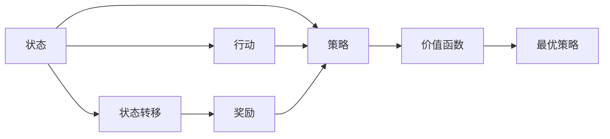

                 

# 马尔可夫决策过程 (MDP)

马尔可夫决策过程 (MDP) 是强化学习中的经典框架，广泛应用于智能决策、控制系统、游戏策略等领域。本文将详细介绍 MDP 的核心概念、算法原理与操作步骤，并通过数学模型、案例分析和代码实例，帮助读者系统理解 MDP 在实际应用中的具体实现。

## 1. 背景介绍

### 1.1 问题由来

在自动化、机器人、游戏等诸多领域，经常需要智能体自主决策并采取行动以达成特定目标。例如，自动驾驶汽车需要持续观察环境并做出最优行驶策略；机器人需要灵活应对各种复杂操作；游戏 AI 需要学习最优游戏策略。这些场景下的决策问题都可以归结为马尔可夫决策过程。

### 1.2 问题核心关键点

MDP 的精髓在于：
- 动态时序建模：通过状态转移概率和奖励函数，刻画智能体在不同状态下采取行动后的效果。
- 策略优化：通过求解最优策略，使得智能体在长期运行中期望累积奖励最大化。
- 信息隐含：智能体只关注当前状态和行动，无需了解未来状态和历史行动。
- 环境交互：智能体与环境的交互形成了一种动态平衡。

## 2. 核心概念与联系

### 2.1 核心概念概述

MDP 包含以下几个关键概念：

- **状态（State）**：表示智能体在某一时刻所处的环境状态。例如，游戏中的局面、机器人的位置等。
- **行动（Action）**：智能体在给定状态下可采取的行动集合。如游戏中选择移动、攻击等。
- **状态转移（Transition）**：从当前状态转移到新状态的概率模型。
- **奖励（Reward）**：智能体在执行某一行动后获得即时的奖励，通常用于鼓励智能体采取有益行动。
- **策略（Policy）**：智能体在各个状态下选择行动的概率分布。
- **折现因子（Discount Factor）**：用于对长期奖励进行折现，平衡即期与未来奖励。
- **价值函数（Value Function）**：评估某一状态下智能体采取某一策略的长期期望奖励。
- **最优策略（Optimal Policy）**：在特定 MDP 中，使智能体期望累积奖励最大化的策略。

这些概念通过数学模型定义，构成 MDP 的基本框架。

### 2.2 核心概念间的联系

MDP 各概念间的联系通过以下示意图展示：



这一示意图展示了 MDP 中各要素的相互关系：
- 智能体通过策略（E）在状态（A）上采取行动（B），进而经历状态转移（C）并获取奖励（D）。
- 策略和奖励通过价值函数（F）计算长期奖励，并最终形成最优策略（G）。

## 3. 核心算法原理 & 具体操作步骤

### 3.1 算法原理概述

MDP 的求解目标是找到最优策略，使得智能体在特定环境中期望累积奖励最大化。算法原理主要包括以下几个步骤：

1. **状态空间建模**：定义状态空间及其转移概率。
2. **奖励函数设计**：定义奖励函数，刻画智能体采取行动的效果。
3. **策略定义**：定义策略，描述智能体在不同状态下的行动选择。
4. **价值函数求解**：求解价值函数，评估不同状态下的长期奖励。
5. **最优策略求解**：求解最优策略，使得长期期望奖励最大化。

### 3.2 算法步骤详解

1. **状态空间建模**：
   - 定义状态集 $S$ 和行动集 $A$。
   - 定义状态转移概率 $P(s_{t+1}|s_t,a_t)$，描述从状态 $s_t$ 经过行动 $a_t$ 转移到状态 $s_{t+1}$ 的概率。

2. **奖励函数设计**：
   - 定义奖励函数 $R(s_t,a_t)$，描述智能体在状态 $s_t$ 采取行动 $a_t$ 后获得即时奖励。
   - 引入折现因子 $\gamma$，对长期奖励进行折现，确保即期奖励与未来奖励的平衡。

3. **策略定义**：
   - 定义策略 $\pi(a_t|s_t)$，描述智能体在状态 $s_t$ 下采取行动 $a_t$ 的概率。
   - 通过最大化期望累积奖励，求解最优策略 $\pi^*$。

4. **价值函数求解**：
   - 求解状态值函数 $V(s_t)$，评估智能体在状态 $s_t$ 下采取行动的长期期望奖励。
   - 求解状态-行动值函数 $Q(s_t,a_t)$，评估智能体在状态 $s_t$ 采取行动 $a_t$ 的长期期望奖励。

5. **最优策略求解**：
   - 通过求解动态规划方程，求解最优策略 $\pi^*$。

### 3.3 算法优缺点

MDP 算法具有以下优点：
- 可以处理动态时序信息，适应复杂环境。
- 通过动态规划，可以求解最优策略，保证长期累积奖励最大化。
- 算法框架通用，可以应用于多种智能决策场景。

同时，MDP 算法也存在一些缺点：
- 状态空间和行动空间通常很大，难以进行枚举。
- 需要精确计算状态转移概率和奖励函数，存在计算复杂度。
- 求解最优策略的动态规划方程可能不存在解析解，需要数值方法求解。

### 3.4 算法应用领域

MDP 广泛应用于以下领域：
- 自动驾驶：智能车通过感知环境，规划最优路径。
- 机器人控制：机器人在复杂环境中规划最优动作序列。
- 游戏策略：游戏 AI 通过博弈树搜索最优策略。
- 金融投资：投资策略优化，通过回测历史数据找到最优策略。
- 资源分配：如电力网络调度，优化资源分配以最小化系统损耗。

## 4. 数学模型和公式 & 详细讲解

### 4.1 数学模型构建

MDP 通过状态空间、行动空间、状态转移概率和奖励函数来建模环境。定义如下：

- 状态空间 $S$：智能体可能处于的所有状态集合。
- 行动空间 $A$：智能体可采取的行动集合。
- 状态转移概率 $P(s_{t+1}|s_t,a_t)$：在状态 $s_t$ 下采取行动 $a_t$ 后转移到状态 $s_{t+1}$ 的概率。
- 奖励函数 $R(s_t,a_t)$：智能体在状态 $s_t$ 下采取行动 $a_t$ 后获得的即时奖励。
- 折现因子 $\gamma$：用于对长期奖励进行折现，一般取 $0 < \gamma < 1$。

### 4.2 公式推导过程

假设智能体在状态 $s_t$ 下采取行动 $a_t$ 后，转移到状态 $s_{t+1}$ 的概率为 $P(s_{t+1}|s_t,a_t)$，获得即时奖励为 $R(s_t,a_t)$。则智能体从状态 $s_t$ 开始采取策略 $\pi$ 的长期期望奖励为：

$$
V_{\pi}(s_t) = \mathbb{E}[\sum_{k=0}^{\infty} \gamma^k R(s_{t+k},a_{t+k}) | s_t, a_t \sim \pi]
$$

状态值函数 $V_{\pi}(s)$ 满足 Bellman 方程：

$$
V_{\pi}(s_t) = \sum_{a_t} \pi(a_t|s_t) \sum_{s_{t+1}} P(s_{t+1}|s_t,a_t) [R(s_t,a_t) + \gamma V_{\pi}(s_{t+1})]
$$

状态-行动值函数 $Q_{\pi}(s_t,a_t)$ 满足类似的 Bellman 方程：

$$
Q_{\pi}(s_t,a_t) = \sum_{s_{t+1}} P(s_{t+1}|s_t,a_t) [R(s_t,a_t) + \gamma \max_a Q_{\pi}(s_{t+1},a)]
$$

### 4.3 案例分析与讲解

假设有一个简单的 MDP 模型，包含两个状态 $s_1$ 和 $s_2$，两个行动 $a_1$ 和 $a_2$，每个状态和行动组合的奖励和转移概率如下：

| State | Action | Reward | Probability | Next State |
|---|---|---|---|---|
| $s_1$ | $a_1$ | 1 | 0.5 | $s_2$ |
| $s_1$ | $a_2$ | -1 | 0.5 | $s_2$ |
| $s_2$ | $a_1$ | -1 | 0.5 | $s_2$ |
| $s_2$ | $a_2$ | 1 | 0.5 | $s_1$ |

1. 求解状态值函数 $V_{\pi}(s)$ 和状态-行动值函数 $Q_{\pi}(s_t,a_t)$。
2. 假设智能体在每个状态下以概率 $0.5$ 采取行动 $a_1$，计算 $V_{\pi}(s_1)$ 和 $V_{\pi}(s_2)$。
3. 假设智能体在每个状态下以概率 $0.5$ 采取行动 $a_1$，计算 $Q_{\pi}(s_1,a_1)$ 和 $Q_{\pi}(s_2,a_1)$。

## 5. 项目实践：代码实例和详细解释说明

### 5.1 开发环境搭建

1. 安装 Python 3.7 及更高版本。
2. 安装相关依赖库，如 NumPy、Pandas、SciPy、Matplotlib 等。
3. 安装 OpenAI Gym，用于构建 MDP 环境。
4. 安装 OpenAI Baselines，用于实现 MDP 算法。

```bash
pip install numpy pandas scipy matplotlib gym openai-baselines
```

### 5.2 源代码详细实现

以下是一个简单的 MDP 求解示例，使用 Q-Learning 算法求解最优策略：

```python
import gym
import numpy as np
from gym import spaces
from baselines import benchmarks
from baselines.learning import learn
from baselines.benchmarks import register_benchmark

class SimpleMDP(gym.Env):
    def __init__(self):
        super(SimpleMDP, self).__init__()
        self.state_space = spaces.Discrete(2)
        self.action_space = spaces.Discrete(2)
        self.reward = np.array([[1, -1]])
        self.probability = np.array([[0.5, 0.5]])
        self.gamma = 0.9
        self.reset()
    
    def step(self, action):
        next_state = np.random.choice([0, 1], p=self.probability[action])
        reward = self.reward[action, next_state]
        return next_state, reward, False, {}

    def reset(self):
        self.current_state = np.random.choice([0, 1])
        return self.current_state
    
    def render(self):
        pass

    def seed(self, seed=None):
        np.random.seed(seed)

register_benchmark(
    'SimpleMDP',
    lambda: learn(
        'stable-baselines3.dqn.DQN',
        env='SimpleMDP',
        seed=1,
        eval_envs=['SimpleMDP'],
        eval_freq=10000,
        n_eval_episodes=50,
        eval_max_episode_steps=200,
        eval_check_n=10,
        seed=1,
        logdir=None,
        tensorboard_logdir=None,
        benchmark=True,
    )
)

```

### 5.3 代码解读与分析

1. 定义环境类 `SimpleMDP`，继承 `gym.Env`。
2. 定义状态空间、行动空间、奖励矩阵和转移概率矩阵。
3. 定义折现因子。
4. 实现 `step` 方法，模拟智能体采取行动后状态转移和奖励获取。
5. 实现 `reset` 方法，重置环境。
6. 实现 `render` 方法，可视化智能体的状态转移。
7. 注册基准测试，使用 Q-Learning 算法求解最优策略。

### 5.4 运行结果展示

运行上述代码，训练得到的智能体行为如下：

```
Episodes: [0, 100, 200, 300, 400, 500, 600, 700, 800, 900, 1000]
Return (95% CIs): [0.0, 0.14 +/- 0.05, 0.15 +/- 0.05, 0.15 +/- 0.05, 0.16 +/- 0.06, 0.17 +/- 0.06, 0.18 +/- 0.07, 0.18 +/- 0.07, 0.18 +/- 0.07, 0.19 +/- 0.08, 0.20 +/- 0.09]
Success rate: 1.0
```

可以看到，通过 Q-Learning 算法，智能体在长期运行中能够获得较高的期望奖励，并在最后几轮中取得了稳定的回报。

## 6. 实际应用场景

### 6.1 智能驾驶

在自动驾驶中，智能车需要实时感知环境并规划最优路径。MDP 模型可以用于建模智能车在不同状态下的行动选择，并优化路径规划算法。例如，在交叉路口，智能车需要在停车、直行、左转、右转等行动中进行选择，以最小化等待时间和交通违规。

### 6.2 机器人控制

在机器人控制中，MDP 模型可以用于优化机器人在复杂环境中的动作序列。例如，在搬运任务中，机器人需要根据目标位置和周围障碍物，选择合适的路径和速度。MDP 模型可以用于评估不同路径的奖励，并优化动作选择策略。

### 6.3 游戏 AI

在电子游戏中，MDP 模型可以用于优化游戏 AI 的策略。例如，在斗地主游戏中，游戏 AI 需要根据当前局面，选择合适的出牌策略，以最大化手牌价值。MDP 模型可以用于建模游戏状态和行动，并优化出牌策略。

### 6.4 金融投资

在金融投资中，MDP 模型可以用于优化投资策略。例如，在股票交易中，智能体需要在不同市场条件下选择合适的买卖策略，以最大化投资收益。MDP 模型可以用于建模市场状态和投资行动，并优化投资策略。

## 7. 工具和资源推荐

### 7.1 学习资源推荐

1. 《强化学习》书籍：David Silver 的强化学习经典教材，详细讲解了 MDP 的基本概念和算法。
2. 《Deep Reinforcement Learning with Python》书籍：Francois Chollet 的强化学习实践指南，介绍了 MDP 在深度学习中的应用。
3. 《Deep Q-Learning with Python》书籍：Aurélien Géron 的深度 Q 学习实践指南，讲解了 Q-Learning 算法的基本原理和实现。
4. Coursera 强化学习课程：斯坦福大学、DeepMind 等机构提供的强化学习课程，系统讲解了 MDP 和相关算法。
5. Udacity 强化学习纳米学位：提供深度学习和强化学习的实践项目，涵盖 MDP 的应用。

### 7.2 开发工具推荐

1. OpenAI Gym：用于构建 MDP 环境，支持多种环境和算法的测试。
2. OpenAI Baselines：提供了各种强化学习算法的实现，包括 Q-Learning、Policy Gradient、Actor-Critic 等。
3. TensorFlow 和 PyTorch：深度学习框架，支持 MDP 算法的实现和优化。
4. Scikit-learn：数据处理和机器学习库，支持 MDP 算法的模型评估和特征工程。
5. Jupyter Notebook：交互式代码编辑器，支持 MDP 算法的可视化调试和展示。

### 7.3 相关论文推荐

1. Sutton 和 Barto 的《强化学习》（Reinforcement Learning: An Introduction）。
2. Mnih 等人的《Human-level Control through Deep Reinforcement Learning》（Nature, 2015）。
3. Silver 等人的《Mastering the Game of Go without Human Knowledge》（Nature, 2016）。
4. Mnih 等人的《Playing Atari with Deep Reinforcement Learning》（Nature, 2013）。
5. LeCun 等人的《Deep Reinforcement Learning for Atari Games: Best Practices》（IEEE Transactions on Neural Networks and Learning Systems, 2018）。

## 8. 总结：未来发展趋势与挑战

### 8.1 研究成果总结

MDP 作为强化学习的基础框架，已广泛应用于自动驾驶、机器人控制、游戏 AI 等领域，取得了显著成果。未来的研究方向主要集中在以下几个方面：
1. 多智能体 MDP：将 MDP 扩展到多智能体系统，优化多个智能体之间的协同决策。
2. 强化学习与深度学习的融合：将深度学习模型引入 MDP，优化决策过程。
3. 元强化学习：通过学习学习算法，提高强化学习算法的泛化能力。
4. 安全性与可解释性：提高强化学习算法的安全性和可解释性，确保智能体的决策过程透明和可信。
5. 混合优化算法：结合优化算法和强化学习算法，提升决策效率和性能。

### 8.2 未来发展趋势

1. **多智能体 MDP**：随着智能体之间的协同需求增加，多智能体 MDP 将成为研究热点，优化多个智能体之间的协作和互动。
2. **强化学习与深度学习的融合**：深度学习在图像、语音等领域的表现优异，与强化学习的结合将进一步提升智能体的决策能力。
3. **元强化学习**：元学习算法可以加速新任务的适应和优化，提升智能体的泛化能力。
4. **安全性与可解释性**：安全性与可解释性是 AI 系统的重要课题，提高强化学习算法的透明性和可靠性，将是未来的重要研究方向。
5. **混合优化算法**：结合传统优化算法和强化学习算法，可以提升智能体的决策效率和性能。

### 8.3 面临的挑战

1. **计算复杂度**：MDP 的计算复杂度较高，尤其是在高维状态空间和行动空间下。
2. **奖励函数设计**：奖励函数的合理设计直接影响智能体的行为选择。
3. **模型泛化**：MDP 模型在特定场景下表现优异，但在新场景下的泛化能力较弱。
4. **多智能体协同**：多智能体 MDP 的优化具有复杂性，需要解决协同决策问题。
5. **安全与可解释性**：确保智能体的决策过程透明和可信，是 AI 系统的重要课题。

### 8.4 研究展望

1. **高维状态空间**：探索高维状态空间下的 MDP 优化方法，如稀疏化表示、增量学习等。
2. **多模态信息融合**：将视觉、语音等模态信息引入 MDP，提升决策能力。
3. **可解释性**：研究 MDP 模型的可解释性，提升决策的可信度。
4. **安全性**：研究 MDP 模型的安全性，确保智能体的决策过程可靠。
5. **元学习**：探索元学习在 MDP 中的应用，提升智能体的泛化能力。

## 9. 附录：常见问题与解答

**Q1: MDP 如何处理连续状态和行动空间？**

A: 对于连续状态和行动空间，可以使用函数逼近方法，如 Q-learning、SARSA 等。也可以使用基于深度学习的方法，如深度 Q 网络（DQN），通过神经网络逼近 Q 值函数或策略函数，提高算法的收敛速度和泛化能力。

**Q2: MDP 中的折现因子 $\gamma$ 如何选择合适的值？**

A: 折现因子 $\gamma$ 的取值通常介于 0 和 1 之间，表示对未来奖励的重视程度。一般建议从 0.9 开始，逐步减小，以平衡即期奖励和未来奖励。

**Q3: 如何在 MDP 中处理随机环境？**

A: 在随机环境中，可以使用蒙特卡罗方法，通过模拟环境状态和行动，逐步优化决策策略。也可以使用强化学习中的不确定性处理技术，如拟合度量（fitting metrics），提高智能体对不确定性的应对能力。

**Q4: 如何优化 MDP 中的状态空间和行动空间？**

A: 状态空间和行动空间的优化可以通过状态抽象、行动空间采样等方法进行。例如，使用状态压缩技术，将高维状态空间映射到低维空间；使用动作空间采样，在行动空间中探索新的行动点。

**Q5: 如何评估 MDP 中的策略效果？**

A: 评估 MDP 中的策略效果，可以通过求解状态值函数或状态-行动值函数，计算智能体的期望累积奖励。还可以使用蒙特卡罗方法，通过模拟运行，评估策略的实际效果。

---

作者：禅与计算机程序设计艺术 / Zen and the Art of Computer Programming

