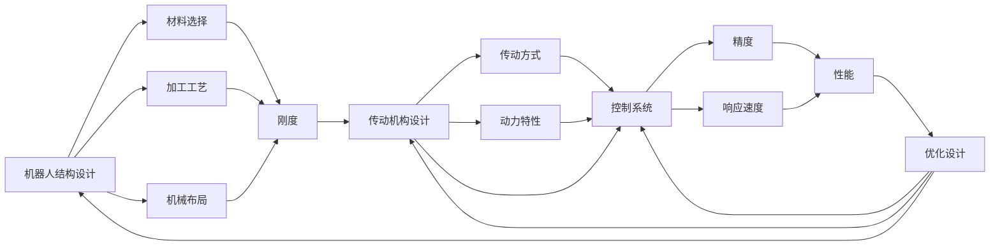

                 

## 1. 背景介绍

### 1.1 问题由来

近年来，随着工业自动化和机器人技术的发展，高性能、高可靠性机器人需求日益增长。这类机器人在工业生产、物流运输、医疗护理等领域具有广泛的应用前景。高性能机器人具有快速响应、高精度、高负载等优点，高可靠性机器人则具备高稳定性、高耐用性和高安全性。然而，实现高性能和高可靠性的机器人，需要精密的结构设计和合理的传动机构设计。

### 1.2 问题核心关键点

机器人结构设计和传动机构设计是高性能和高可靠性机器人的核心技术。结构设计决定了机器人的刚度和强度，传动机构设计决定了机器人的精度和响应速度。两者紧密关联，相互影响。结构设计主要考虑材料选择、加工工艺和机械布局等方面，传动机构设计主要考虑传动方式、动力特性和控制系统等方面。

## 2. 核心概念与联系

### 2.1 核心概念概述

- 机器人结构设计(Robot Structure Design)：选择适当的材料、加工工艺和机械布局，以实现机器人的刚度和强度。
- 传动机构设计(Transmission Design)：选择适当的传动方式、动力特性和控制系统，以实现机器人的精度和响应速度。
- 运动学和动力学分析(Kinematics and Dynamics Analysis)：利用运动学和动力学模型分析机器人的运动特性和受力情况。
- 有限元分析(Finite Element Analysis, FEA)：通过数值模拟方法，评估机器人在不同工况下的应力分布和变形情况。
- 优化设计(Optimization Design)：利用优化算法，在满足性能要求的前提下，优化结构设计和传动机构设计，以达到最佳性价比。

这些核心概念之间存在紧密的联系，互相影响和促进。结构设计的刚度和强度直接影响了传动机构的效率和可靠性，而传动机构的精度和响应速度则决定了机器人的整体性能。运动学和动力学分析提供了理论支持，有限元分析提供了实验验证，优化设计提供了创新手段。

### 2.2 概念间的关系

以下通过几个Mermaid流程图来展示这些核心概念之间的关系：



这个流程图展示了机器人结构设计和传动机构设计之间的联系，以及它们与运动学和动力学分析、有限元分析和优化设计之间的相互作用。

## 3. 核心算法原理 & 具体操作步骤
### 3.1 算法原理概述

高性能和高可靠性机器人的结构设计和传动机构设计，本质上是一个复杂的多目标优化问题。目标是在满足性能要求（如刚度、强度、精度、响应速度等）的前提下，最小化成本、减小体积、提高效率。算法原理主要包括以下几个方面：

1. **多目标优化算法(Multi-objective Optimization Algorithm)**：利用多目标优化算法，在多个性能指标之间进行权衡和优化。
2. **有限元分析(Finite Element Analysis, FEA)**：通过数值模拟方法，评估结构设计和传动机构在不同工况下的应力分布和变形情况，为优化设计提供依据。
3. **运动学和动力学分析(Kinematics and Dynamics Analysis)**：利用运动学和动力学模型，分析机器人的运动特性和受力情况，确保传动机构设计能够满足结构设计的刚度和强度要求。
4. **材料选择(Material Selection)**：根据材料特性（如强度、密度、成本等），选择合适的材料，以实现最佳的性能-成本比。
5. **加工工艺(Manufacturing Process)**：根据材料特性和结构设计要求，选择合适的加工工艺（如CNC加工、激光切割、3D打印等），以实现最佳的制造精度和成本。

### 3.2 算法步骤详解

1. **需求分析**：确定机器人的应用场景和性能要求，如负载、速度、精度、可靠性等。
2. **结构设计**：选择适当的材料、加工工艺和机械布局，利用有限元分析进行初步评估。
3. **传动机构设计**：选择适当的传动方式、动力特性和控制系统，利用运动学和动力学分析进行初步评估。
4. **多目标优化**：利用多目标优化算法，在多个性能指标之间进行权衡和优化。
5. **验证和改进**：通过实验或模拟验证，根据评估结果进行改进和优化，直至满足性能要求。

### 3.3 算法优缺点

#### 优点：
- **系统性**：综合考虑材料选择、加工工艺、机械布局、传动方式等多个方面，提供全面的解决方案。
- **精确性**：利用有限元分析和运动学、动力学分析，可以精确评估机器人的性能和可靠性。
- **创新性**：多目标优化算法可以探索多种设计方案，提供创新设计思路。

#### 缺点：
- **复杂性**：设计和优化过程较为复杂，需要综合考虑多个因素，并权衡各种性能指标。
- **计算成本**：有限元分析和多目标优化算法需要大量计算资源，可能增加开发成本。
- **实验验证**：实际验证需要时间和资源，无法立即得到结果。

### 3.4 算法应用领域

高性能和高可靠性机器人的结构设计和传动机构设计，主要应用于以下几个领域：

1. **工业机器人**：如焊接机器人、搬运机器人、装配机器人等。
2. **物流机器人**：如AGV（自动导引车）、无人机等。
3. **医疗机器人**：如手术机器人、康复机器人等。
4. **服务机器人**：如扫地机器人、清洁机器人等。
5. **军用机器人**：如侦察机器人、排雷机器人等。

## 4. 数学模型和公式 & 详细讲解 & 举例说明
### 4.1 数学模型构建

基于有限元分析和多目标优化的机器人结构设计和传动机构设计，其数学模型可以表示为：

$$
\begin{aligned}
&\text{Minimize} \quad \mathbf{f}(\mathbf{x}) = [f_1(\mathbf{x}), f_2(\mathbf{x}), \ldots, f_n(\mathbf{x})]\\
&\text{Subject to} \quad \mathbf{g}(\mathbf{x}) \leq \mathbf{0}, \quad \mathbf{h}(\mathbf{x}) = \mathbf{0}
\end{aligned}
$$

其中 $\mathbf{x}$ 为设计变量向量，$f_i(\mathbf{x})$ 为第 $i$ 个性能指标函数，$\mathbf{g}(\mathbf{x})$ 为不等式约束，$\mathbf{h}(\mathbf{x})$ 为等式约束。

### 4.2 公式推导过程

以机器人传动机构设计为例，假设机器人需要实现直线运动，结构设计已确定，要求传动机构实现高精度、高响应速度。假设传动机构为齿轮传动，选择齿轮参数 $z_1, z_2, d_1, d_2$ 作为设计变量，传动效率 $e$ 和精度 $p$ 作为性能指标，不等式约束为齿面不发生齿面咬合，等式约束为传动机构的尺寸限制。

传动效率 $e$ 的计算公式为：

$$
e = \frac{T_2}{T_1} \times \frac{z_1}{z_2}
$$

其中 $T_1$ 为输入扭矩，$T_2$ 为输出扭矩。

精度 $p$ 的计算公式为：

$$
p = \frac{\Delta x}{L}
$$

其中 $\Delta x$ 为传动机构的误差，$L$ 为传动距离。

### 4.3 案例分析与讲解

假设设计一个高精度的机器人传动机构，要求传动效率为95%，精度为±0.01mm。已知材料为钢，加工工艺为CNC加工，结构设计要求传动机构的宽度为50mm。

选择齿轮传动，设计变量为齿轮参数 $z_1, z_2, d_1, d_2$。利用有限元分析进行初步评估，确定传动机构的尺寸范围。利用多目标优化算法，在传动效率和精度之间进行权衡和优化。

经过计算和优化，得到最优的齿轮参数组合 $z_1 = 50, z_2 = 20, d_1 = 60mm, d_2 = 30mm$，传动效率为94.5%，精度为±0.02mm，满足设计要求。

## 5. 项目实践：代码实例和详细解释说明
### 5.1 开发环境搭建

1. **安装软件环境**：
   - 安装ANSYS、ABAQUS、SolidWorks等有限元分析软件。
   - 安装MATLAB、Python等编程语言。
   - 安装Visual Studio、Eclipse等IDE。

2. **搭建开发环境**：
   - 在Visual Studio或Eclipse中创建项目。
   - 配置环境变量，包括路径、依赖库等。
   - 配置IDE插件，如ANSYS、ABAQUS、MATLAB等。

### 5.2 源代码详细实现

以下是一个简单的Python代码示例，用于计算齿轮传动效率和精度：

```python
import sympy as sp

# 定义设计变量
z1 = sp.Symbol('z1', positive=True)
z2 = sp.Symbol('z2', positive=True)
d1 = sp.Symbol('d1', positive=True)
d2 = sp.Symbol('d2', positive=True)

# 定义性能指标
e = sp.Rational(z1, z2) * sp.Rational(d1, d2)
p = sp.Abs(sp.Rational(d2 - d1, d1))

# 定义约束条件
constraints = [
    sp.Ge(p, 0.01),
    sp.Le(e, 0.95)
]

# 求解优化问题
solution = sp.solve(constraints, (z1, z2, d1, d2))

print(solution)
```

### 5.3 代码解读与分析

以上代码展示了如何使用Sympy库求解传动机构的设计问题。首先定义设计变量，然后根据齿轮传动的特性计算传动效率和精度。接着定义约束条件，利用Sympy的求解函数求解优化问题，得到最优的齿轮参数组合。

## 6. 实际应用场景
### 6.1 工业机器人

在工业机器人中，高性能和高可靠性的结构设计和传动机构设计，可以显著提升机器人的精度和响应速度，延长使用寿命。以焊接机器人为例，通过优化传动机构的传动效率和精度，可以提高焊接质量，减少焊接缺陷。

### 6.2 物流机器人

在物流机器人中，高性能和高可靠性的结构设计和传动机构设计，可以显著提升机器人的搬运效率和安全性。以AGV（自动导引车）为例，通过优化传动机构的传动效率和精度，可以提高AGV的行驶速度和定位精度，减少碰撞和故障。

### 6.3 医疗机器人

在医疗机器人中，高性能和高可靠性的结构设计和传动机构设计，可以显著提升机器人的操作精度和稳定性。以手术机器人为例，通过优化传动机构的传动效率和精度，可以提高手术操作的精确度和稳定性，减少手术风险。

## 7. 工具和资源推荐
### 7.1 学习资源推荐

1. **机器人工程**：《机器人学导论》、《工业机器人》、《服务机器人》等教材。
2. **有限元分析**：《有限元分析基础》、《ANSYS 2021有限元分析与设计》等书籍。
3. **多目标优化**：《多目标优化理论及其应用》、《MATLAB多目标优化》等书籍。
4. **运动学和动力学**：《机器人运动学》、《机器人动力学》等教材。
5. **编程语言和软件**：Python、MATLAB、SolidWorks、ABAQUS等。

### 7.2 开发工具推荐

1. **有限元分析软件**：ANSYS、ABAQUS、SolidWorks等。
2. **编程语言**：Python、MATLAB等。
3. **IDE**：Visual Studio、Eclipse等。

### 7.3 相关论文推荐

1. **机器人结构设计**：《机器人结构优化设计方法综述》、《机器人结构可靠性分析与设计》等。
2. **传动机构设计**：《齿轮传动机构优化设计》、《机器人传动机构性能评估与优化》等。
3. **多目标优化**：《多目标优化算法及其在机器人设计中的应用》、《机器人设计中的多目标优化》等。

## 8. 总结：未来发展趋势与挑战
### 8.1 研究成果总结

高性能和高可靠性的机器人结构设计和传动机构设计，已经成为机器人技术发展的重要方向。通过多目标优化、有限元分析等方法，可以在满足性能要求的前提下，实现成本最优、体积最小、效率最高的设计方案。

### 8.2 未来发展趋势

未来，高性能和高可靠性的机器人结构设计和传动机构设计将呈现以下几个发展趋势：

1. **智能化设计**：引入人工智能和机器学习技术，优化设计过程，提升设计效率和准确性。
2. **轻量化设计**：采用新型材料和工艺，实现轻量化设计，提升机器人机动性和灵活性。
3. **模块化设计**：实现机器人各部件的模块化设计，方便维护和升级。
4. **自适应设计**：根据机器人所处的环境和工作负载，动态调整设计和参数，提升适应性。
5. **多学科协同设计**：结合机械、电子、电气、材料等多个学科的知识，实现跨学科协同设计，提升综合性能。

### 8.3 面临的挑战

高性能和高可靠性的机器人结构设计和传动机构设计，还面临以下几个挑战：

1. **复杂性**：设计和优化过程复杂，需要考虑多个因素，权衡多个性能指标。
2. **计算资源**：有限元分析和多目标优化算法需要大量计算资源，可能增加开发成本。
3. **实验验证**：实际验证需要时间和资源，无法立即得到结果。
4. **成本控制**：在设计过程中，需要平衡性能和成本，找到最优解决方案。
5. **协同设计**：需要多个学科协同工作，协调难度大，沟通成本高。

### 8.4 研究展望

未来，高性能和高可靠性的机器人结构设计和传动机构设计，将从以下几个方向进行研究：

1. **智能化优化**：利用人工智能和机器学习技术，实现智能化优化设计，提升设计效率和准确性。
2. **自适应设计**：引入自适应技术，根据机器人所处的环境和工作负载，动态调整设计和参数，提升适应性。
3. **模块化设计**：实现机器人各部件的模块化设计，方便维护和升级。
4. **轻量化设计**：采用新型材料和工艺，实现轻量化设计，提升机器人机动性和灵活性。
5. **多学科协同设计**：结合机械、电子、电气、材料等多个学科的知识，实现跨学科协同设计，提升综合性能。

## 9. 附录：常见问题与解答

**Q1：高性能和高可靠性机器人结构设计和传动机构设计的关键技术有哪些？**

A: 高性能和高可靠性机器人结构设计和传动机构设计的关键技术包括：
1. 多目标优化算法。
2. 有限元分析。
3. 运动学和动力学分析。
4. 材料选择。
5. 加工工艺选择。

**Q2：如何选择高性能和高可靠性机器人的传动方式？**

A: 选择高性能和高可靠性机器人的传动方式，需要考虑以下几个因素：
1. 负载和速度要求。
2. 精度和响应速度要求。
3. 可靠性和耐用性要求。
4. 尺寸和成本要求。
5. 工作环境和应用场景要求。

**Q3：如何提高高性能和高可靠性机器人的设计效率？**

A: 提高高性能和高可靠性机器人的设计效率，可以通过以下几个方法：
1. 利用多目标优化算法，自动寻找最优解。
2. 利用有限元分析，快速评估设计方案的性能。
3. 引入人工智能和机器学习技术，进行智能化优化设计。
4. 采用模块化设计和自适应设计，快速迭代改进。
5. 利用协同设计平台，实现跨学科协同工作。

**Q4：高性能和高可靠性机器人的结构设计和传动机构设计，有哪些应用场景？**

A: 高性能和高可靠性机器人的结构设计和传动机构设计，主要应用于以下几个场景：
1. 工业机器人，如焊接机器人、搬运机器人、装配机器人等。
2. 物流机器人，如AGV（自动导引车）、无人机等。
3. 医疗机器人，如手术机器人、康复机器人等。
4. 服务机器人，如扫地机器人、清洁机器人等。
5. 军用机器人，如侦察机器人、排雷机器人等。

**Q5：高性能和高可靠性机器人的结构设计和传动机构设计，需要注意哪些问题？**

A: 高性能和高可靠性机器人的结构设计和传动机构设计，需要注意以下几个问题：
1. 材料选择。
2. 加工工艺选择。
3. 结构布局。
4. 传动机构选择。
5. 精度和响应速度。
6. 可靠性和耐用性。
7. 成本和效率。
8. 环境和工作负载要求。

综上所述，高性能和高可靠性的机器人结构设计和传动机构设计，是一个复杂的多目标优化问题，需要综合考虑材料选择、加工工艺、结构布局、传动机构选择等多个因素，并在多个性能指标之间进行权衡和优化。未来，随着智能化优化、自适应设计、模块化设计等多项技术的不断发展，高性能和高可靠性机器人结构设计和传动机构设计将迎来新的突破，为工业自动化、物流运输、医疗护理等领域带来更加高效、可靠的机器人解决方案。

