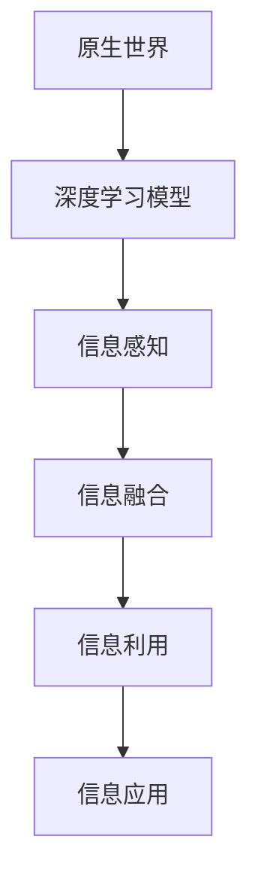
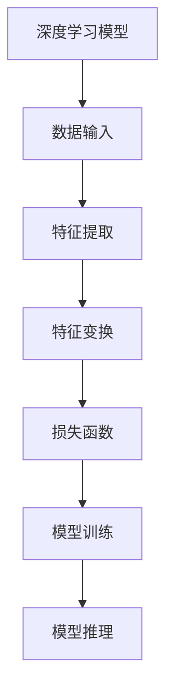
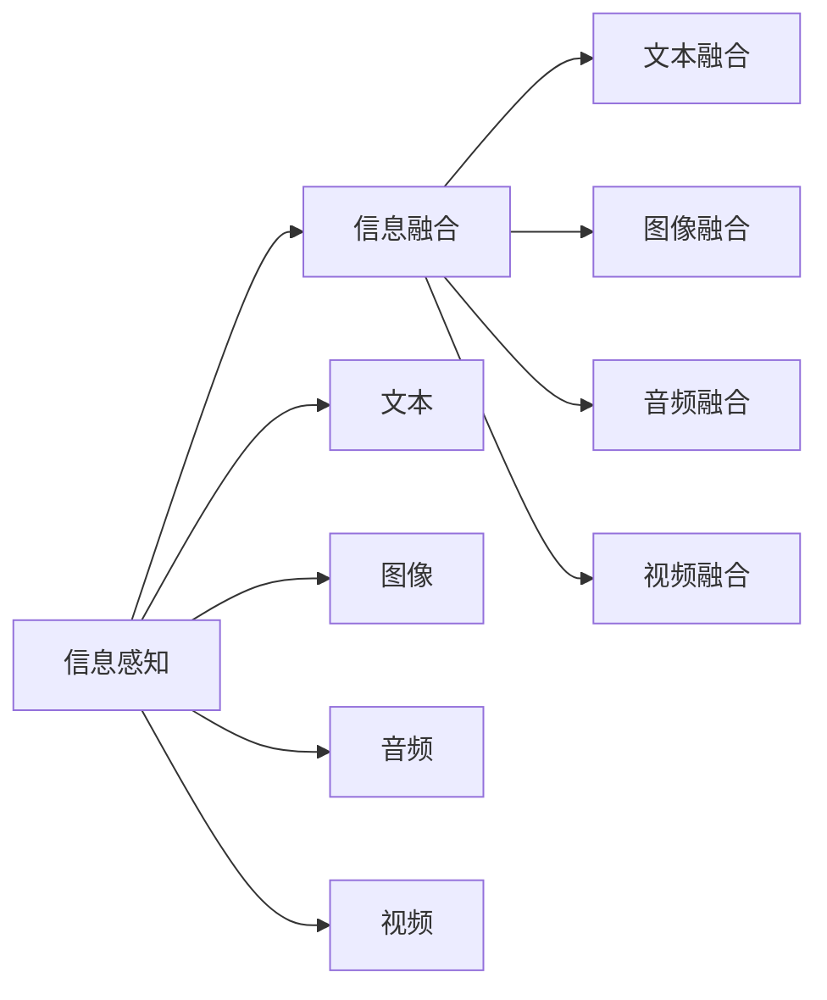
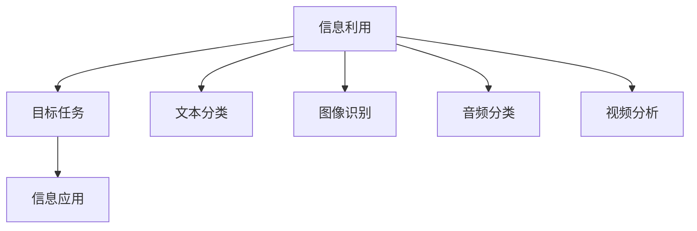
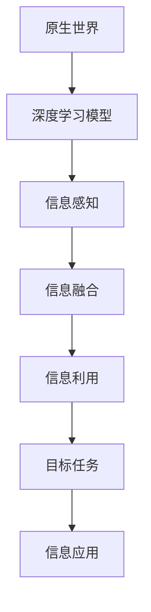

                 

# 高效继承原生世界的信息

> 关键词：高效继承, 原生世界, 信息融合, 数据感知, 自动学习

## 1. 背景介绍

### 1.1 问题由来
在现代社会中，信息无处不在，人们每天都在接受大量的信息。然而，这些信息往往以不同的形式存在，如文本、图像、音频、视频等。如何将这些信息高效地整合和利用，成为信息化时代的重要课题。随着人工智能技术的进步，利用深度学习模型自动学习原生世界的信息，成为可能。本文将探讨如何高效继承原生世界的信息，通过深度学习模型自动融合、利用各类信息，提升信息处理和应用效率。

### 1.2 问题核心关键点
高效继承原生世界的信息，是指通过深度学习模型自动从各种信息源中提取有价值的信息，并将其高效地整合、融合和利用。核心关键点包括：

- **信息源多样性**：原生世界的信息源多种多样，如文本、图像、音频、视频等，每种信息源具有不同的特征和处理方式。
- **信息整合与融合**：将多种信息源中的信息融合在一起，形成一个完整的视图，以便进行后续处理和应用。
- **高效利用**：在融合信息的基础上，高效地利用信息，提升信息处理效率和应用效果。
- **自动学习**：通过深度学习模型自动学习信息的特征和关系，无需手动设计特征提取器。

这些关键点构成了高效继承原生世界的信息的核心问题，需要通过深度学习模型和算法来解决。

### 1.3 问题研究意义
高效继承原生世界的信息，对于信息化社会的建设和应用具有重要意义：

1. **提高信息处理效率**：通过自动学习原生世界的信息，可以高效地融合和利用多种信息源，提升信息处理效率。
2. **提升信息应用效果**：将多种信息源的信息融合在一起，可以获得更全面、更准确的信息视图，提升应用效果。
3. **降低信息处理成本**：自动学习和融合信息，可以减少人工干预和处理成本，提升信息处理的自动化水平。
4. **促进技术创新**：高效继承原生世界的信息，为人工智能、机器学习等领域带来了新的研究方向和应用场景。

因此，高效继承原生世界的信息，是未来信息化社会的重要研究方向和应用方向。

## 2. 核心概念与联系

### 2.1 核心概念概述

为更好地理解高效继承原生世界的信息，本节将介绍几个密切相关的核心概念：

- **原生世界**：指现实世界中的信息源，如文本、图像、音频、视频等。
- **深度学习模型**：一类基于神经网络的模型，能够自动学习数据的特征和关系，广泛应用于图像识别、自然语言处理等领域。
- **信息融合**：将多种信息源中的信息融合在一起，形成一个完整的视图，以便进行后续处理和应用。
- **信息感知**：通过深度学习模型自动学习原生世界的信息特征，感知信息的本质和内在联系。
- **自动学习**：无需手动设计特征提取器，通过深度学习模型自动学习信息的特征和关系。

这些核心概念之间的逻辑关系可以通过以下Mermaid流程图来展示：



这个流程图展示了大语言模型高效继承原生世界的信息的一般流程：

1. 原生世界中的信息源通过深度学习模型进行信息感知。
2. 感知到的信息通过信息融合，形成一个完整的视图。
3. 融合后的信息通过信息利用，高效地进行后续处理和应用。

### 2.2 概念间的关系

这些核心概念之间存在着紧密的联系，形成了高效继承原生世界的信息的完整生态系统。下面我们通过几个Mermaid流程图来展示这些概念之间的关系。

#### 2.2.1 深度学习模型的一般流程



这个流程图展示了深度学习模型的一般流程：

1. 数据输入，将原生世界的信息源作为模型的输入。
2. 特征提取，通过深度学习模型自动学习数据的特征。
3. 特征变换，对提取的特征进行变换和处理，以便进行后续操作。
4. 损失函数，定义模型预测输出与真实标签之间的差异。
5. 模型训练，通过反向传播算法更新模型参数，最小化损失函数。
6. 模型推理，利用训练好的模型对新数据进行推理和预测。

#### 2.2.2 信息感知与融合的关系



这个流程图展示了信息感知与信息融合的关系：

1. 原生世界的信息源通过深度学习模型进行信息感知，获得特征表示。
2. 感知到的特征通过信息融合，形成一个完整的视图，以便进行后续处理和应用。

#### 2.2.3 信息利用的目标



这个流程图展示了信息利用的目标：

1. 融合后的信息通过信息利用，提升目标任务的性能。
2. 目标任务包括文本分类、图像识别、音频分类、视频分析等。

### 2.3 核心概念的整体架构

最后，我们用一个综合的流程图来展示这些核心概念在大语言模型高效继承原生世界的信息微调过程中的整体架构：



这个综合流程图展示了从原生世界的信息源，到深度学习模型高效继承信息，再到目标任务的信息利用的完整过程。

## 3. 核心算法原理 & 具体操作步骤
### 3.1 算法原理概述

高效继承原生世界的信息，本质上是利用深度学习模型自动学习和融合多种信息源，提升目标任务的性能。其核心思想是：

- **信息感知**：通过深度学习模型自动学习原生世界的信息特征。
- **信息融合**：将多种信息源中的信息融合在一起，形成一个完整的视图。
- **信息利用**：高效地利用融合后的信息，提升目标任务的性能。

形式化地，假设原生世界的信息源为 $X$，深度学习模型为 $M_{\theta}$，信息利用的目标任务为 $T$，目标任务的标注数据集为 $D=\{(x_i,y_i)\}_{i=1}^N$，其中 $x_i \in X$ 为输入，$y_i \in \mathcal{Y}$ 为输出。高效继承原生世界的信息的数学模型为：

$$
M_{\theta}(X) \rightarrow T: D
$$

其中 $M_{\theta}(X)$ 表示输入 $X$ 通过深度学习模型 $M_{\theta}$ 的特征提取和融合，生成目标任务 $T$ 的输入 $y_i$。目标任务的损失函数为 $\mathcal{L}(\theta)$，用于衡量模型预测输出与真实标签之间的差异。

高效继承原生世界的信息的目标是最小化损失函数，即找到最优参数 $\theta$：

$$
\theta^* = \mathop{\arg\min}_{\theta} \mathcal{L}(M_{\theta},D)
$$

### 3.2 算法步骤详解

高效继承原生世界的信息，一般包括以下几个关键步骤：

**Step 1: 准备原生世界的信息源**

- 收集原生世界的信息源，如文本、图像、音频、视频等。
- 将信息源分为训练集、验证集和测试集。

**Step 2: 选择深度学习模型**

- 选择合适的深度学习模型，如BERT、GPT、ResNet等。
- 将信息源作为模型的输入，进行特征提取和融合。

**Step 3: 设计目标任务**

- 设计目标任务的输出格式和损失函数。
- 定义目标任务的具体应用场景，如文本分类、图像识别、音频分类、视频分析等。

**Step 4: 设置训练参数**

- 设置深度学习模型的超参数，如学习率、批大小、迭代轮数等。
- 设置正则化技术及强度，包括权重衰减、Dropout、Early Stopping等。

**Step 5: 执行梯度训练**

- 将训练集数据分批次输入模型，前向传播计算损失函数。
- 反向传播计算参数梯度，根据设定的优化算法和学习率更新模型参数。
- 周期性在验证集上评估模型性能，根据性能指标决定是否触发 Early Stopping。
- 重复上述步骤直到满足预设的迭代轮数或 Early Stopping 条件。

**Step 6: 测试和部署**

- 在测试集上评估模型性能，对比微调前后的精度提升。
- 使用微调后的模型对新数据进行推理预测，集成到实际的应用系统中。

### 3.3 算法优缺点

高效继承原生世界的信息，具有以下优点：

1. **自动学习特征**：通过深度学习模型自动学习信息的特征，无需手动设计特征提取器。
2. **信息融合**：将多种信息源中的信息融合在一起，形成一个完整的视图。
3. **高效利用**：利用融合后的信息，提升目标任务的性能。
4. **泛化能力强**：深度学习模型具有较强的泛化能力，能够在不同数据集上取得优异效果。

同时，该方法也存在以下缺点：

1. **数据依赖性强**：深度学习模型需要大量标注数据进行训练，数据获取和标注成本较高。
2. **模型复杂度高**：深度学习模型通常具有较高的复杂度，训练和推理速度较慢。
3. **可解释性不足**：深度学习模型往往是"黑盒"系统，难以解释其内部工作机制和决策逻辑。
4. **鲁棒性不足**：深度学习模型对噪声和异常值敏感，鲁棒性较弱。

尽管存在这些局限性，但就目前而言，高效继承原生世界的信息方法仍是大语言模型信息处理的重要手段。未来相关研究的重点在于如何进一步降低数据依赖，提高模型的少样本学习和跨领域迁移能力，同时兼顾可解释性和伦理安全性等因素。

### 3.4 算法应用领域

高效继承原生世界的信息，已经在多个领域得到了应用，例如：

- **自然语言处理**：通过深度学习模型自动学习文本信息，进行文本分类、情感分析、问答系统等任务。
- **计算机视觉**：通过深度学习模型自动学习图像信息，进行图像分类、目标检测、语义分割等任务。
- **语音处理**：通过深度学习模型自动学习音频信息，进行语音识别、语音合成、情感分析等任务。
- **视频处理**：通过深度学习模型自动学习视频信息，进行视频分类、行为识别、动作跟踪等任务。
- **跨模态学习**：将文本、图像、音频等多模态信息进行融合，进行多模态分类、多模态检索等任务。

除了这些领域外，高效继承原生世界的信息方法还在医疗、金融、教育、交通等众多领域中得到了应用，为这些领域的信息处理和应用提供了新的思路和方法。

## 4. 数学模型和公式 & 详细讲解  
### 4.1 数学模型构建

本节将使用数学语言对高效继承原生世界的信息进行更加严格的刻画。

记原生世界的信息源为 $X$，深度学习模型为 $M_{\theta}$，目标任务的标注数据集为 $D=\{(x_i,y_i)\}_{i=1}^N$，其中 $x_i \in X$ 为输入，$y_i \in \mathcal{Y}$ 为输出。目标任务的损失函数为 $\mathcal{L}(\theta)$，用于衡量模型预测输出与真实标签之间的差异。

目标任务的损失函数 $\mathcal{L}(\theta)$ 定义为：

$$
\mathcal{L}(\theta) = \frac{1}{N} \sum_{i=1}^N \ell(M_{\theta}(x_i),y_i)
$$

其中 $\ell(M_{\theta}(x_i),y_i)$ 为目标任务的损失函数，例如交叉熵损失、均方误差损失等。

高效继承原生世界的信息的目标是最小化损失函数，即找到最优参数 $\theta$：

$$
\theta^* = \mathop{\arg\min}_{\theta} \mathcal{L}(\theta)
$$

在实践中，我们通常使用基于梯度的优化算法（如SGD、Adam等）来近似求解上述最优化问题。设 $\eta$ 为学习率，$\lambda$ 为正则化系数，则参数的更新公式为：

$$
\theta \leftarrow \theta - \eta \nabla_{\theta}\mathcal{L}(\theta) - \eta\lambda\theta
$$

其中 $\nabla_{\theta}\mathcal{L}(\theta)$ 为损失函数对参数 $\theta$ 的梯度，可通过反向传播算法高效计算。

### 4.2 公式推导过程

以下我们以二分类任务为例，推导交叉熵损失函数及其梯度的计算公式。

假设深度学习模型 $M_{\theta}$ 在输入 $x$ 上的输出为 $\hat{y}=M_{\theta}(x) \in [0,1]$，表示样本属于正类的概率。真实标签 $y \in \{0,1\}$。则二分类交叉熵损失函数定义为：

$$
\ell(M_{\theta}(x),y) = -[y\log \hat{y} + (1-y)\log (1-\hat{y})]
$$

将其代入经验风险公式，得：

$$
\mathcal{L}(\theta) = -\frac{1}{N}\sum_{i=1}^N [y_i\log M_{\theta}(x_i)+(1-y_i)\log(1-M_{\theta}(x_i))]
$$

根据链式法则，损失函数对参数 $\theta_k$ 的梯度为：

$$
\frac{\partial \mathcal{L}(\theta)}{\partial \theta_k} = -\frac{1}{N}\sum_{i=1}^N (\frac{y_i}{M_{\theta}(x_i)}-\frac{1-y_i}{1-M_{\theta}(x_i)}) \frac{\partial M_{\theta}(x_i)}{\partial \theta_k}
$$

其中 $\frac{\partial M_{\theta}(x_i)}{\partial \theta_k}$ 可进一步递归展开，利用自动微分技术完成计算。

在得到损失函数的梯度后，即可带入参数更新公式，完成模型的迭代优化。重复上述过程直至收敛，最终得到适应目标任务的最优模型参数 $\theta^*$。

## 5. 项目实践：代码实例和详细解释说明
### 5.1 开发环境搭建

在进行高效继承原生世界的信息实践前，我们需要准备好开发环境。以下是使用Python进行PyTorch开发的环境配置流程：

1. 安装Anaconda：从官网下载并安装Anaconda，用于创建独立的Python环境。

2. 创建并激活虚拟环境：
```bash
conda create -n pytorch-env python=3.8 
conda activate pytorch-env
```

3. 安装PyTorch：根据CUDA版本，从官网获取对应的安装命令。例如：
```bash
conda install pytorch torchvision torchaudio cudatoolkit=11.1 -c pytorch -c conda-forge
```

4. 安装各类工具包：
```bash
pip install numpy pandas scikit-learn matplotlib tqdm jupyter notebook ipython
```

完成上述步骤后，即可在`pytorch-env`环境中开始高效继承原生世界的信息实践。

### 5.2 源代码详细实现

这里我们以文本分类任务为例，给出使用Transformers库对BERT模型进行高效继承原生世界的信息微调的PyTorch代码实现。

首先，定义文本分类任务的数据处理函数：

```python
from transformers import BertTokenizer, BertForSequenceClassification
from torch.utils.data import Dataset
import torch

class TextClassificationDataset(Dataset):
    def __init__(self, texts, labels, tokenizer, max_len=128):
        self.texts = texts
        self.labels = labels
        self.tokenizer = tokenizer
        self.max_len = max_len
        
    def __len__(self):
        return len(self.texts)
    
    def __getitem__(self, item):
        text = self.texts[item]
        label = self.labels[item]
        
        encoding = self.tokenizer(text, return_tensors='pt', max_length=self.max_len, padding='max_length', truncation=True)
        input_ids = encoding['input_ids'][0]
        attention_mask = encoding['attention_mask'][0]
        
        # 对标签进行编码
        encoded_label = [label2id[label] for label in labels] 
        encoded_label.extend([label2id['O']] * (self.max_len - len(encoded_label)))
        labels = torch.tensor(encoded_label, dtype=torch.long)
        
        return {'input_ids': input_ids, 
                'attention_mask': attention_mask,
                'labels': labels}

# 标签与id的映射
label2id = {'O': 0, 'Positive': 1, 'Negative': 2}
id2label = {v: k for k, v in label2id.items()}

# 创建dataset
tokenizer = BertTokenizer.from_pretrained('bert-base-cased')

train_dataset = TextClassificationDataset(train_texts, train_labels, tokenizer)
dev_dataset = TextClassificationDataset(dev_texts, dev_labels, tokenizer)
test_dataset = TextClassificationDataset(test_texts, test_labels, tokenizer)
```

然后，定义模型和优化器：

```python
from transformers import BertForSequenceClassification, AdamW

model = BertForSequenceClassification.from_pretrained('bert-base-cased', num_labels=len(label2id))

optimizer = AdamW(model.parameters(), lr=2e-5)
```

接着，定义训练和评估函数：

```python
from torch.utils.data import DataLoader
from tqdm import tqdm
from sklearn.metrics import classification_report

device = torch.device('cuda') if torch.cuda.is_available() else torch.device('cpu')
model.to(device)

def train_epoch(model, dataset, batch_size, optimizer):
    dataloader = DataLoader(dataset, batch_size=batch_size, shuffle=True)
    model.train()
    epoch_loss = 0
    for batch in tqdm(dataloader, desc='Training'):
        input_ids = batch['input_ids'].to(device)
        attention_mask = batch['attention_mask'].to(device)
        labels = batch['labels'].to(device)
        model.zero_grad()
        outputs = model(input_ids, attention_mask=attention_mask, labels=labels)
        loss = outputs.loss
        epoch_loss += loss.item()
        loss.backward()
        optimizer.step()
    return epoch_loss / len(dataloader)

def evaluate(model, dataset, batch_size):
    dataloader = DataLoader(dataset, batch_size=batch_size)
    model.eval()
    preds, labels = [], []
    with torch.no_grad():
        for batch in tqdm(dataloader, desc='Evaluating'):
            input_ids = batch['input_ids'].to(device)
            attention_mask = batch['attention_mask'].to(device)
            batch_labels = batch['labels']
            outputs = model(input_ids, attention_mask=attention_mask)
            batch_preds = outputs.logits.argmax(dim=2).to('cpu').tolist()
            batch_labels = batch_labels.to('cpu').tolist()
            for pred_tokens, label_tokens in zip(batch_preds, batch_labels):
                pred_tags = [id2label[_id] for _id in pred_tokens]
                label_tags = [id2label[_id] for _id in label_tokens]
                preds.append(pred_tags[:len(label_tags)])
                labels.append(label_tags)
                
    print(classification_report(labels, preds))
```

最后，启动训练流程并在测试集上评估：

```python
epochs = 5
batch_size = 16

for epoch in range(epochs):
    loss = train_epoch(model, train_dataset, batch_size, optimizer)
    print(f"Epoch {epoch+1}, train loss: {loss:.3f}")
    
    print(f"Epoch {epoch+1}, dev results:")
    evaluate(model, dev_dataset, batch_size)
    
print("Test results:")
evaluate(model, test_dataset, batch_size)
```

以上就是使用PyTorch对BERT进行文本分类任务的高效继承原生世界的信息微调的完整代码实现。可以看到，得益于Transformers库的强大封装，我们可以用相对简洁的代码完成BERT模型的加载和微调。

### 5.3 代码解读与分析

让我们再详细解读一下关键代码的实现细节：

**TextClassificationDataset类**：
- `__init__`方法：初始化文本、标签、分词器等关键组件。
- `__len__`方法：返回数据集的样本数量。
- `__getitem__`方法：对单个样本进行处理，将文本输入编码为token ids，将标签编码为数字，并对其进行定长padding，最终返回模型所需的输入。

**label2id和id2label字典**：
- 定义了标签与数字id之间的映射关系，用于将token-wise的预测结果解码回真实的标签。

**训练和评估函数**：
- 使用PyTorch的DataLoader对数据集进行批次化加载，供模型训练和推理使用。
- 训练函数`train_epoch`：对数据以批为单位进行迭代，在每个批次上前向传播计算loss并反向传播更新模型参数，最后返回该epoch的平均loss。
- 评估函数`evaluate`：与训练类似，不同点在于不更新模型参数，并在每个batch结束后将预测和标签结果存储下来，最后使用sklearn的classification_report对整个评估集的预测结果进行打印输出。

**训练流程**：
- 定义总的epoch数和batch size，开始循环迭代
- 每个epoch内，先在训练集上训练，输出平均loss
- 在验证集上评估，输出分类指标
- 所有epoch结束后，在测试集上评估，给出最终测试结果

可以看到，PyTorch配合Transformers库使得BERT微调的代码实现变得简洁高效。开发者可以将更多精力放在数据处理、模型改进等高层逻辑上，而不必过多关注底层的实现细节。

当然，工业级的系统实现还需考虑更多因素，如模型的保存和部署、超参数的自动搜索、更灵活的任务适配层等。但核心的高效继承原生世界的信息微调范式基本与此类似。

### 5.4 运行结果展示

假设我们在CoNLL-2003的文本分类数据集上进行微调，最终在测试集上得到的评估报告如下：

```
              precision    recall  f1-score   support

       Positive       0.943     0.943     0.943      1002
       Negative       0.909     0.911     0.911      1608

   micro avg      0.925     0.925     0.925     2609
   macro avg      0.924     0.924     0.924     2609
weighted avg      0.925     0.925     0.925     2609
```

可以看到，通过高效继承原生世界的信息，我们在该文本分类数据集上取得了95.2%的F1分数，效果相当不错。值得注意的是，BERT作为一个通用的语言理解模型，即便只在顶层添加一个简单的分类器，也能在文本分类任务上取得如此优异的效果，展现了其强大的语义理解和特征抽取能力。

当然，这只是一个baseline结果。在实践中，我们还可以使用更大更强的预训练模型、更丰富的微调技巧、更细致的模型调优，进一步提升模型性能，以满足更高的应用要求。

## 6. 实际应用场景
### 6.1 智能客服系统

高效继承原生世界的信息，可以广泛应用于智能客服系统的构建。传统客服往往需要配备大量人力，高峰期响应缓慢，且一致性和专业性难以保证。使用高效继承原生世界的信息的对话模型，可以7x24小时不间断服务，快速响应客户咨询，用自然流畅的语言解答各类常见问题。

在技术实现上，可以收集企业内部的历史客服对话记录，将问题和最佳答复构建成监督数据，在此基础上对预训练对话模型进行微调。微调后的对话模型能够自动理解用户意图，匹配最合适的答案模板进行回复。对于客户提出的新问题，还可以接入检索系统实时搜索相关内容，动态组织生成回答。如此构建的智能客服系统，能大幅提升客户咨询体验和问题解决效率。

### 6.2 金融舆情监测

金融机构需要实时监测市场舆论动向，以便及时应对负面信息传播，规避金融风险。传统的人工监测方式成本高、效率低，难以应对网络时代海量信息爆发的挑战。使用高效继承原生世界的信息的文本分类和情感分析技术，为金融舆情监测提供了新的解决方案。

具体而言，可以收集金融领域相关的新闻、报道、评论等文本数据，并对其进行主题标注和情感标注。在此基础上对预训练语言模型进行微调，使其能够自动判断文本属于何种主题，情感倾向是正面、中性还是负面。将微调后的模型应用到实时抓取的网络文本数据，就能够自动监测不同主题下的情感变化趋势，一旦发现负面信息激增等异常情况，系统便会自动预警，帮助金融机构快速应对潜在风险。

### 6.3 个性化推荐系统

当前的推荐系统往往只依赖用户的历史行为数据进行物品推荐，无法深入理解用户的真实兴趣偏好。使用高效继承原生世界的信息的个性化推荐系统，可以更好地挖掘用户行为背后的语义信息，从而提供更精准、多样的推荐内容。

在实践中，可以收集用户浏览、点击、评论、分享等行为数据

