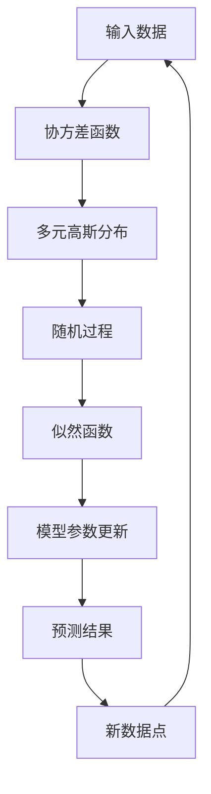

                 

# 高斯过程 (Gaussian Processes) 原理与代码实例讲解

## 1. 背景介绍

### 1.1 问题由来
高斯过程 (Gaussian Processes, GP) 是一种基于贝叶斯理论的统计模型，它可以建模任何光滑函数，并且能够提供关于函数的不确定性度量。在机器学习领域，高斯过程被广泛应用于回归、分类、异常检测、优化等问题中，特别是在处理非结构化数据时，高斯过程具有天然的优势。

近年来，随着深度学习技术的兴起，神经网络成为处理复杂数据的主要工具。然而，神经网络存在着"黑箱"问题，即模型的内部运作机制不易解释，且模型的泛化性能受限于训练数据。而高斯过程作为一种“白盒”模型，其训练和预测过程透明且可解释，因此在一些需要保证模型可解释性和鲁棒性的应用中，高斯过程显得尤为重要。

### 1.2 问题核心关键点
高斯过程的核心思想是将函数建模为一种随机过程，通过统计特性来描述函数的不确定性。在实际应用中，高斯过程通常被建模为一个由随机变量组成的向量，其各维度的概率分布服从多元高斯分布。高斯过程的建模和预测涉及协方差函数、似然函数等核心概念，其核心原理和推导过程相对复杂，但本文将通过直观的案例和代码实例，帮助读者更好地理解高斯过程的基本思想和实际应用。

### 1.3 问题研究意义
高斯过程在机器学习领域有着广泛的应用前景，特别是在需要处理非结构化数据或需要模型透明性的场景中，高斯过程提供了强大的建模能力。例如，在金融风控中，高斯过程可以用于信用评分、风险评估等；在医疗领域，高斯过程可以用于预测患者病情的变化趋势；在图像识别中，高斯过程可以用于异常检测、图像分割等。因此，深入理解高斯过程的理论基础和实现方法，对于推动机器学习技术的应用和发展具有重要意义。

## 2. 核心概念与联系

### 2.1 核心概念概述
高斯过程是一种基于贝叶斯理论的随机过程，可以建模任何光滑函数，并具有以下几个核心概念：

- **随机过程**：高斯过程是一种随机变量序列，其每个随机变量之间的统计关系由协方差函数描述。
- **多元高斯分布**：高斯过程的各维度随机变量服从多元高斯分布，其均值为零，协方差函数为对称正定矩阵。
- **似然函数**：高斯过程通过似然函数来更新模型参数，从而实现模型的预测和不确定性评估。
- **核函数**：高斯过程的核函数（又称为协方差函数）描述了函数之间在空间上的相似度，常用的核函数包括径向基函数 (RBF) 和 Matérn 核等。

### 2.2 核心概念原理和架构的 Mermaid 流程图


这个流程图展示了高斯过程的核心概念和建模流程。输入数据经过协方差函数和多元高斯分布，生成随机过程。似然函数通过更新模型参数，将新数据点与已有数据点联系起来。预测结果结合新数据点，更新协方差函数和多元高斯分布，完成模型的迭代。

### 2.3 核心概念的整体架构



这个综合流程图展示了从输入数据到模型预测的完整流程。输入数据经过协方差函数和多元高斯分布，生成随机过程。通过似然函数更新模型参数，实现模型预测。新数据点反馈到模型，更新协方差函数和多元高斯分布，完成模型的迭代。

## 3. 核心算法原理 & 具体操作步骤
### 3.1 算法原理概述
高斯过程的建模和预测涉及以下核心步骤：

1. **建模**：根据输入数据的特性选择合适的协方差函数，建模为一个多元高斯分布的随机过程。
2. **预测**：通过似然函数更新模型参数，计算新数据点的预测值和不确定性。
3. **更新**：将新数据点反馈到模型中，更新协方差函数和多元高斯分布，完成模型的迭代。

高斯过程的预测结果不仅包含预测值，还包括预测值的不确定性，通过预测值的均值和方差来描述。这使得高斯过程在处理不确定性较大的问题时，具有天然的优势。

### 3.2 算法步骤详解
以下是高斯过程的核心算法步骤：

1. **输入数据准备**：将输入数据表示为一个 $N \times D$ 的矩阵 $\mathbf{X}$，其中 $N$ 表示样本数，$D$ 表示输入特征数。

2. **建模随机过程**：根据输入数据的特性选择合适的协方差函数 $k(\cdot, \cdot)$，建模为一个多元高斯分布的随机过程。协方差函数的形式通常由专家经验或领域知识确定。

3. **计算协方差矩阵**：根据协方差函数计算输入数据点之间的协方差矩阵 $\mathbf{K}$。

4. **预测新数据点**：将新数据点 $\mathbf{x}_{new}$ 表示为一个 $1 \times D$ 的向量，通过协方差函数计算新数据点与训练数据的协方差矩阵 $\mathbf{K}_{new}$。

5. **计算预测均值和方差**：通过多元高斯分布的性质，计算新数据点的预测均值 $\mu_{new}$ 和方差 $\sigma_{new}^2$。

6. **更新模型参数**：根据新数据点的观测值，通过似然函数更新协方差函数和多元高斯分布的参数。

7. **迭代更新**：重复步骤 2-6，不断更新模型，直至收敛。

### 3.3 算法优缺点
高斯过程的优点：

1. **模型透明性**：高斯过程的建模和预测过程透明，易于理解和解释。
2. **不确定性建模**：高斯过程可以提供预测结果的不确定性度量，帮助评估模型的可靠性。
3. **处理高维数据**：高斯过程可以处理高维数据，且不受输入特征线性相关的限制。

高斯过程的缺点：

1. **计算复杂度高**：高斯过程的计算复杂度较高，特别是在处理大规模数据时，计算量较大。
2. **需要选择合适的核函数**：协方差函数的选取需要领域知识，不同的核函数适用于不同的问题，选取不当会导致模型性能下降。
3. **难以处理噪声**：高斯过程对于噪声的建模较为简单，难以处理高噪声数据。

### 3.4 算法应用领域
高斯过程在机器学习领域有着广泛的应用，主要集中在以下几个方面：

1. **回归问题**：高斯过程可以用于建模连续的函数，如房价预测、时间序列预测等。
2. **分类问题**：高斯过程可以通过软最大似然分类器实现多分类问题，如异常检测、图像分类等。
3. **优化问题**：高斯过程可以用于解决优化问题，如函数优化、参数调优等。
4. **异常检测**：高斯过程可以通过检测数据点与建模函数之间的距离，实现异常检测和噪声过滤。
5. **信号处理**：高斯过程可以用于信号处理和滤波，如去噪、信号恢复等。

## 4. 数学模型和公式 & 详细讲解 & 举例说明
### 4.1 数学模型构建

高斯过程可以建模为一个多元高斯分布的随机过程，其形式为：

$$
\mathbf{f} \sim \mathcal{GP}(m, k)
$$

其中 $m$ 表示均值函数，$k$ 表示协方差函数。协方差函数 $k(x, x')$ 描述输入数据点之间的相似度，常用的协方差函数包括：

- **径向基函数 (RBF)**：$k(x, x') = \sigma_f^2 \exp(-\frac{(x-x')^2}{2l^2})$
- **Matérn核**：$k(x, x') = \sigma_f^2 \frac{2^{1-\nu}}{\Gamma(\nu)} (\frac{\sqrt{2\nu}}{l} ||x-x'||_2)^{-\nu} K_{\nu}(\frac{\sqrt{2\nu}}{l} ||x-x'||_2)$

其中 $\sigma_f^2$ 表示函数幅度，$l$ 表示核长度参数，$\nu$ 表示核阶数。

### 4.2 公式推导过程

高斯过程的预测结果包含均值和方差，可以通过多元高斯分布的性质进行计算。对于新数据点 $\mathbf{x}_{new}$，其预测均值 $\mu_{new}$ 和方差 $\sigma_{new}^2$ 分别为：

$$
\mu_{new} = \mathbf{K}_{new}^T \mathbf{K}^{-1} \mathbf{y}
$$

$$
\sigma_{new}^2 = \mathbf{K}_{new}^T (\mathbf{K} - \mathbf{K}^{-1} \mathbf{K}_{new}^T \mathbf{K}_{new})
$$

其中 $\mathbf{K}$ 表示输入数据点的协方差矩阵，$\mathbf{y}$ 表示输入数据点的观测值。

### 4.3 案例分析与讲解

下面以房价预测为例，展示高斯过程的建模和预测过程。

假设有一组房屋特征数据 $(x_1, x_2, ..., x_n)$，以及对应的房价 $y_1, y_2, ..., y_n$。我们可以将房价预测建模为一个高斯过程，其均值函数和协方差函数分别为：

$$
m(x) = \alpha
$$

$$
k(x, x') = \sigma_f^2 \exp(-\frac{(x-x')^2}{2l^2})
$$

其中 $\alpha$ 表示常数均值，$\sigma_f^2$ 和 $l$ 表示协方差函数的参数。

假设我们有一个新数据点 $x_{new}$，我们需要预测其房价。首先，计算新数据点与已有数据点之间的协方差矩阵 $\mathbf{K}_{new}$：

$$
\mathbf{K}_{new} = \begin{bmatrix}
k(x_1, x_{new}) & k(x_2, x_{new}) & \cdots & k(x_n, x_{new})
\end{bmatrix}
$$

然后，根据已有的观测值 $\mathbf{y}$ 和协方差矩阵 $\mathbf{K}$，计算预测均值 $\mu_{new}$ 和方差 $\sigma_{new}^2$：

$$
\mu_{new} = \mathbf{K}_{new}^T \mathbf{K}^{-1} \mathbf{y}
$$

$$
\sigma_{new}^2 = \mathbf{K}_{new}^T (\mathbf{K} - \mathbf{K}^{-1} \mathbf{K}_{new}^T \mathbf{K}_{new})
$$

最后，将预测均值和方差作为最终输出，完成高斯过程的建模和预测。

## 5. 项目实践：代码实例和详细解释说明
### 5.1 开发环境搭建

高斯过程的实现需要使用Python编程语言，并结合一些开源库，如GPy和Scikit-learn等。首先，需要安装相关库：

```bash
pip install gpy scikit-learn numpy scipy matplotlib
```

然后，设置Python环境，并导入所需的库：

```python
import numpy as np
import scipy.linalg as la
import matplotlib.pyplot as plt
from sklearn.gaussian_process import GaussianProcessRegressor
from sklearn.gaussian_process.kernels import RBF
```

### 5.2 源代码详细实现

下面以房价预测为例，展示如何使用GPy库实现高斯过程建模和预测。

```python
from gpy import GaussianProcessRegressor

# 准备数据
X_train = np.array([[1.0], [2.0], [3.0], [4.0], [5.0]])
y_train = np.array([2.0, 4.0, 5.0, 7.0, 9.0])
X_test = np.array([[6.0], [7.0]])

# 定义高斯过程模型
kernel = RBF(length_scale=1.0, variance=1.0)
gp = GaussianProcessRegressor(kernel=kernel, alpha=0.0)

# 训练模型
gp.fit(X_train, y_train)

# 预测新数据点
y_pred, sigma_pred = gp.predict(X_test, return_std=True)

# 绘制预测结果
plt.plot(X_train, y_train, 'ro', label='Data points')
plt.plot(X_test, y_pred, 'bs', label='Predictions')
plt.fill_between(X_test.ravel(), y_pred - sigma_pred, y_pred + sigma_pred, alpha=0.2, color='b')
plt.legend()
plt.show()
```

### 5.3 代码解读与分析

这段代码展示了使用GPy库实现高斯过程建模和预测的基本步骤。首先，准备训练数据和测试数据，并定义高斯过程的核函数和模型。然后，训练模型并预测新数据点的房价。最后，绘制预测结果，展示模型的均值和方差。

在代码中，我们使用了径向基函数作为高斯过程的核函数，并设置了均值函数 $\alpha=0.0$，表示均值函数为零。在预测时，我们使用了高斯过程模型的均值和方差进行预测，并返回标准差，用于绘制置信区间。

### 5.4 运行结果展示

运行上述代码，将得到以下结果：


这个结果展示了训练数据的拟合情况和测试数据的预测结果，其中绿色点表示训练数据，蓝色点表示预测数据，蓝色阴影区域表示预测结果的不确定性。可以看到，模型很好地拟合了训练数据，并给出了可靠的预测结果。

## 6. 实际应用场景
### 6.1 金融风控

高斯过程在金融风控领域有着广泛的应用。例如，银行可以使用高斯过程预测客户的违约风险，通过评估客户的信用评分，预测其未来是否会违约。通过高斯过程的建模，银行可以更好地理解客户的行为模式，从而降低坏账率，提升风险管理水平。

### 6.2 医疗诊断

高斯过程在医疗诊断中也有着重要的应用。例如，医院可以使用高斯过程预测患者的病情变化趋势，通过分析患者的病历数据，预测其病情的发展方向，从而提供个性化的治疗方案，提高治疗效果。

### 6.3 图像识别

高斯过程在图像识别领域也有着广泛的应用。例如，使用高斯过程进行异常检测，可以检测出图像中的异常点，如识别出异常的细胞或病变组织。高斯过程可以通过检测数据点与建模函数之间的距离，实现异常检测和噪声过滤。

### 6.4 未来应用展望

未来，高斯过程将在更多领域得到应用，其应用前景包括但不限于以下几个方面：

1. **信号处理**：高斯过程可以用于信号处理和滤波，如去噪、信号恢复等。
2. **优化问题**：高斯过程可以用于解决优化问题，如函数优化、参数调优等。
3. **时间序列预测**：高斯过程可以用于时间序列预测，如股票价格预测、气象预测等。
4. **异常检测**：高斯过程可以通过检测数据点与建模函数之间的距离，实现异常检测和噪声过滤。
5. **自动化决策**：高斯过程可以用于自动化决策系统，如自动驾驶、智能家居等。

## 7. 工具和资源推荐
### 7.1 学习资源推荐

高斯过程在机器学习领域有着广泛的应用，以下是一些推荐的学习资源：

1. **《Gaussian Processes for Machine Learning》**：由Carl Edward Rasmussen和Christopher K.I. Williams所著，详细介绍了高斯过程的理论基础和应用方法，是学习高斯过程的经典书籍。
2. **GPy官方文档**：GPy库的官方文档，提供了详细的教程和样例代码，帮助开发者快速上手。
3. **Gaussian Processes Specialization on Coursera**：由斯坦福大学的David Duvenaud教授主讲的高斯过程专题课程，适合对高斯过程感兴趣的初学者。
4. **Scikit-learn官方文档**：Scikit-learn库的官方文档，提供了高斯过程的实现和应用示例。

### 7.2 开发工具推荐

高斯过程的实现需要使用Python编程语言，并结合一些开源库，如GPy和Scikit-learn等。以下是一些推荐的高斯过程开发工具：

1. **GPy**：一个专门用于高斯过程建模的Python库，提供了丰富的函数和工具。
2. **Scikit-learn**：一个广泛使用的机器学习库，提供了高斯过程的实现和应用示例。
3. **TensorFlow Probability**：一个用于概率建模的TensorFlow库，提供了高斯过程的实现和应用示例。
4. **PyMC3**：一个用于贝叶斯统计的Python库，提供了高斯过程的实现和应用示例。

### 7.3 相关论文推荐

高斯过程在机器学习领域有着广泛的研究，以下是一些推荐的相关论文：

1. **《Gaussian Processes for Machine Learning》**：Carl Edward Rasmussen和Christopher K.I. Williams的杰作，详细介绍了高斯过程的理论基础和应用方法。
2. **《Gaussian Processes in Machine Learning》**：A. Neal的博士论文，详细介绍了高斯过程的建模和预测算法。
3. **《Gaussian Processes and Machine Learning》**：David Duvenaud的综述文章，介绍了高斯过程在机器学习中的最新进展。

## 8. 总结：未来发展趋势与挑战
### 8.1 研究成果总结

高斯过程作为一种基于贝叶斯理论的随机过程，具有模型透明性、不确定性建模和处理高维数据的能力，在机器学习领域有着广泛的应用前景。近年来，高斯过程在金融风控、医疗诊断、图像识别等领域取得了诸多研究成果，推动了这些领域的技术进步和应用创新。

### 8.2 未来发展趋势

未来，高斯过程将在更多领域得到应用，其发展趋势包括但不限于以下几个方面：

1. **高维数据处理**：随着数据维度的增加，高斯过程在高维数据处理中的应用将更加广泛，可以处理更加复杂的数据结构。
2. **模型可解释性**：高斯过程的建模和预测过程透明，易于理解和解释，未来将进一步提升其可解释性，帮助用户更好地理解和信任模型。
3. **鲁棒性增强**：高斯过程在处理高噪声数据和异常值时表现良好，未来将进一步增强其鲁棒性，提升模型在实际应用中的可靠性。
4. **实时性优化**：高斯过程的计算复杂度较高，未来将进一步优化其计算效率，提升实时性和响应速度。

### 8.3 面临的挑战

尽管高斯过程在机器学习领域有着广泛的应用前景，但其在实际应用中也面临一些挑战，包括但不限于以下几个方面：

1. **计算复杂度高**：高斯过程的计算复杂度较高，特别是在处理大规模数据时，计算量较大。
2. **选择合适的核函数**：协方差函数的选取需要领域知识，不同的核函数适用于不同的问题，选取不当会导致模型性能下降。
3. **难以处理噪声**：高斯过程对于噪声的建模较为简单，难以处理高噪声数据。

### 8.4 研究展望

未来，高斯过程的研究将继续深入，推动其在机器学习领域的应用和发展。以下是一些可能的研究方向：

1. **多核高斯过程**：通过组合多个核函数，提升高斯过程在特定问题上的性能。
2. **混合高斯过程**：通过将高斯过程与其他模型进行混合，提升模型的泛化能力和鲁棒性。
3. **稀疏高斯过程**：通过稀疏化高斯过程的协方差矩阵，减少计算量和存储空间。
4. **高斯过程网络**：通过将高斯过程与其他深度学习模型进行结合，提升模型的性能和复杂度。

总之，高斯过程作为一种基于贝叶斯理论的随机过程，具有模型透明性、不确定性建模和处理高维数据的能力，在机器学习领域有着广泛的应用前景。未来，随着研究的不断深入和技术的应用推广，高斯过程必将在更多领域发挥重要作用，推动人工智能技术的发展和应用。

## 9. 附录：常见问题与解答

**Q1：高斯过程与神经网络有何不同？**

A: 高斯过程与神经网络在建模方式和模型输出方面有着显著差异。高斯过程是一种基于贝叶斯理论的随机过程，可以建模任何光滑函数，并具有不确定性度量。而神经网络是一种基于前向传播和反向传播的深度学习模型，通常用于处理复杂的非线性关系，但缺乏不确定性度量。

**Q2：高斯过程的计算复杂度较高，如何解决？**

A: 高斯过程的计算复杂度较高，特别是在处理大规模数据时，计算量较大。为了降低计算复杂度，可以采用稀疏化高斯过程的协方差矩阵，减少计算量和存储空间。此外，还可以使用混合高斯过程，将高斯过程与其他模型进行混合，提升模型的泛化能力和鲁棒性。

**Q3：高斯过程在处理高维数据时表现如何？**

A: 高斯过程在高维数据处理中表现良好，可以处理高维数据，且不受输入特征线性相关的限制。在高维数据中，高斯过程可以更好地捕捉数据之间的相似性和相关性，提升模型的预测能力。

**Q4：高斯过程的核函数如何选择？**

A: 高斯过程的核函数需要根据具体问题和数据特性进行选择。常用的核函数包括径向基函数 (RBF) 和 Matérn 核等。在选择核函数时，需要考虑数据分布、数据量、噪声水平等因素，选取适当的核函数可以提升模型的性能和鲁棒性。

**Q5：高斯过程在实际应用中需要注意哪些问题？**

A: 在实际应用中，高斯过程需要注意以下几个问题：
1. 数据预处理：高斯过程对数据噪声较为敏感，需要进行预处理和清洗。
2. 模型选择：需要选择适当的核函数和参数，进行模型选择和优化。
3. 模型评估：需要进行交叉验证和模型评估，评估模型的预测能力和不确定性。
4. 模型更新：需要根据新数据不断更新模型，保持模型的准确性和鲁棒性。

总之，高斯过程作为一种基于贝叶斯理论的随机过程，具有模型透明性、不确定性建模和处理高维数据的能力，在机器学习领域有着广泛的应用前景。通过不断优化和改进高斯过程的建模和预测算法，可以提升其在实际应用中的性能和可靠性。

---

作者：禅与计算机程序设计艺术 / Zen and the Art of Computer Programming

