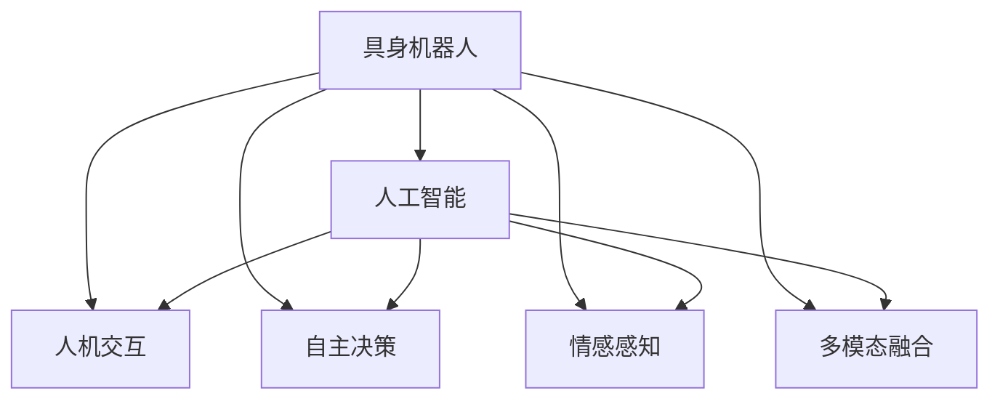
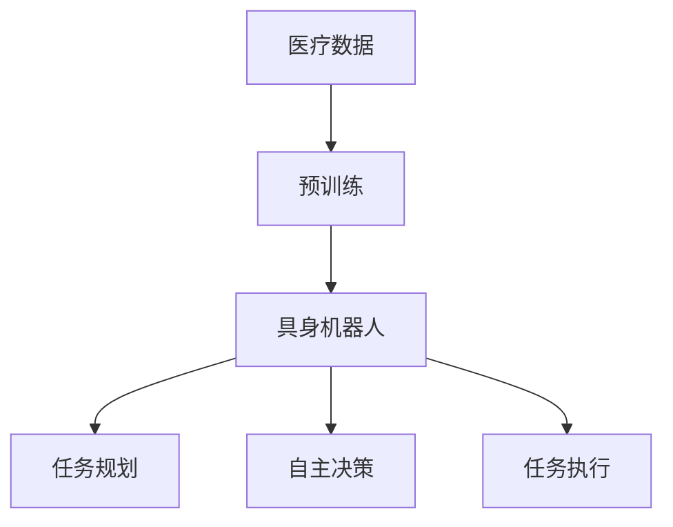
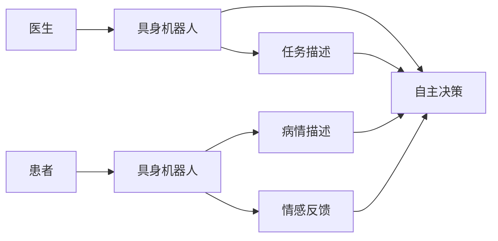
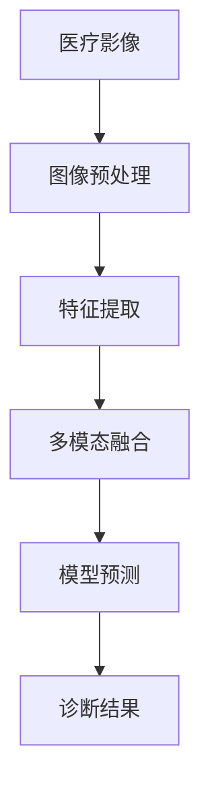
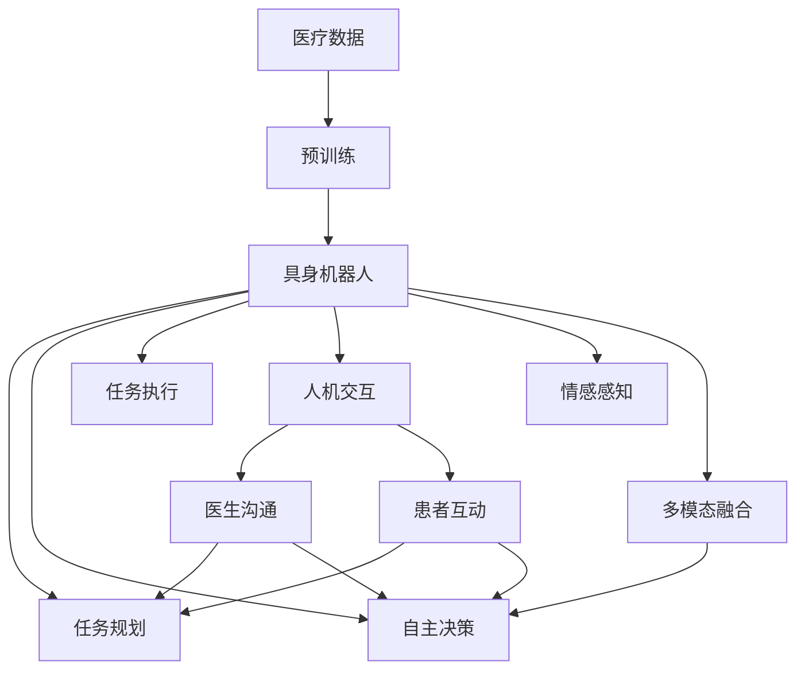

                 

# AI Agent: AI的下一个风口 具身机器人在医疗领域的应用

> 关键词：具身机器人,医疗,人工智能,人机交互,自主决策,医疗影像分析,手术辅助

## 1. 背景介绍

### 1.1 问题由来
随着人工智能（AI）技术的飞速发展，其在医疗领域的应用引起了广泛的关注。AI不仅能够提高诊断的准确性，还能加速药物研发，助力个性化医疗。在医疗影像分析、疾病预测、药物发现等多个方面，AI的应用已取得了显著成果。然而，传统AI技术往往依赖于大规模数据和复杂模型，存在一定的应用门槛和局限性。为了进一步提升AI在医疗领域的应用效果，研究者们提出了具身机器人（Embodied Agents）的概念，希望通过赋予AI物理形态，使其能够更自然、直观地进行人机交互和任务执行。

### 1.2 问题核心关键点
具身机器人融合了AI和机器人技术，通过赋予机器人以智能决策能力，使其能够自主完成任务。相较于传统的医疗机器人，具身机器人能够更好地理解医疗情境，提供更精准的医疗服务。其核心技术包括：

1. **自主决策**：具身机器人通过深度学习算法，对医疗数据进行分析和决策，实现自主执行医疗任务。
2. **人机交互**：具身机器人能够通过自然语言处理（NLP）技术，与医生和患者进行无缝沟通。
3. **情感感知**：具身机器人能够感知患者的情绪状态，调整服务策略，提升患者体验。
4. **多模态融合**：具身机器人能够融合视觉、触觉、听觉等多模态信息，提供全面、综合的医疗服务。

### 1.3 问题研究意义
具身机器人在医疗领域的应用，将为传统医疗模式带来革命性变革，具有以下重要意义：

1. **提高医疗效率**：通过自主决策和自动化任务执行，具身机器人能够大大减少医生的工作负担，提升医疗服务效率。
2. **增强医疗质量**：具身机器人能够提供准确、一致的医疗服务，减少人为误差，提升诊断和治疗的准确性。
3. **改善患者体验**：具身机器人能够理解患者的情感需求，提供个性化服务，改善患者的治疗体验。
4. **推动医学研究**：具身机器人能够协助医学研究人员进行大数据分析，加速医学知识的积累和创新。

## 2. 核心概念与联系

### 2.1 核心概念概述

为了更好地理解具身机器人在医疗领域的应用，我们需要先介绍一些核心概念：

- **具身机器人（Embodied Agents）**：融合了AI和机器人技术的智能实体，能够在真实环境中自主执行任务。
- **人工智能（AI）**：通过机器学习、深度学习等技术，赋予机器人以智能决策能力。
- **人机交互（HRI）**：研究如何让机器人和人类之间进行自然、流畅的沟通和合作。
- **自主决策（Autonomous Decision Making）**：具身机器人能够在医疗环境中自主进行任务规划和决策。
- **情感感知（Emotional Recognition）**：具身机器人能够识别和响应患者的情感状态，调整服务策略。
- **多模态融合（Multimodal Fusion）**：具身机器人能够整合视觉、触觉、听觉等多模态信息，提供全面的医疗服务。

这些概念之间的联系可以通过以下Mermaid流程图来展示：



这个流程图展示了具身机器人与AI、人机交互、自主决策、情感感知和多模态融合等核心概念之间的关系：

1. 具身机器人以人工智能为技术核心，实现自主决策、人机交互等功能。
2. 自主决策使得具身机器人能够自主进行任务规划和决策。
3. 人机交互使得具身机器人能够与医生和患者进行自然沟通。
4. 情感感知使得具身机器人能够识别和响应患者的情感需求。
5. 多模态融合使得具身机器人能够整合多模态信息，提供全面的医疗服务。

### 2.2 概念间的关系

这些核心概念之间存在着紧密的联系，形成了具身机器人在医疗领域的应用框架。下面我们通过几个Mermaid流程图来展示这些概念之间的关系。

#### 2.2.1 具身机器人的学习范式



这个流程图展示了具身机器人的学习过程，从医疗数据的预训练到任务规划、自主决策和任务执行：

1. 具身机器人首先通过预训练学习医疗数据的特征表示。
2. 在任务规划阶段，具身机器人根据任务需求和环境信息进行路径规划。
3. 在自主决策阶段，具身机器人利用深度学习算法进行决策，选择合适的动作。
4. 在任务执行阶段，具身机器人根据决策结果执行动作，完成医疗任务。

#### 2.2.2 人机交互与自主决策的协作



这个流程图展示了人机交互与自主决策的协作过程：

1. 医生通过任务描述与具身机器人进行沟通，告知任务需求。
2. 具身机器人根据任务描述进行自主决策，选择合适的动作。
3. 患者通过病情描述和情感反馈与具身机器人进行互动，提供情境信息。
4. 具身机器人综合医生和患者的反馈，调整决策策略，执行任务。

#### 2.2.3 多模态融合在医疗影像分析中的应用



这个流程图展示了多模态融合在医疗影像分析中的应用过程：

1. 具身机器人首先对医疗影像进行预处理，提取图像特征。
2. 利用深度学习模型进行特征提取，获得高层次的图像表示。
3. 通过多模态融合技术，整合视觉、触觉、听觉等多模态信息，提高诊断的准确性。
4. 最后，利用深度学习模型进行预测，生成诊断结果。

### 2.3 核心概念的整体架构

最后，我们用一个综合的流程图来展示这些核心概念在具身机器人在医疗领域应用中的整体架构：



这个综合流程图展示了从医疗数据的预训练到具身机器人的任务规划、自主决策、任务执行、人机交互、情感感知和多模态融合，再到与医生和患者的互动，最终生成诊断结果的完整过程。通过这些流程图，我们可以更清晰地理解具身机器人在医疗领域的应用机制和核心技术。

## 3. 核心算法原理 & 具体操作步骤
### 3.1 算法原理概述

具身机器人在医疗领域的应用，主要涉及以下核心算法：

- **深度学习算法**：用于医疗数据的特征提取和决策，包括卷积神经网络（CNN）、递归神经网络（RNN）、Transformer等模型。
- **自主决策算法**：用于任务规划和决策，包括强化学习（RL）、因果推断（Causal Inference）等技术。
- **人机交互算法**：用于与医生和患者的自然语言处理和情感识别，包括自然语言理解（NLU）、情感识别（Emotion Recognition）等技术。
- **多模态融合算法**：用于整合视觉、触觉、听觉等多模态信息，包括特征融合（Feature Fusion）、多模态感知（Multimodal Perception）等技术。

这些算法共同构成了具身机器人在医疗领域的应用框架，使其能够高效、准确地进行任务执行和决策。

### 3.2 算法步骤详解

具身机器人在医疗领域的应用主要包括以下几个关键步骤：

**Step 1: 数据准备与预训练**
- 收集医疗领域的图像、文本、语音等多模态数据，划分为训练集和测试集。
- 对数据进行预处理，包括图像增强、文本分词、语音转录等。
- 使用深度学习模型对数据进行预训练，获得医疗数据的特征表示。

**Step 2: 任务规划与路径优化**
- 根据医疗任务的需求和环境信息，进行任务规划和路径优化。
- 使用强化学习算法进行任务规划，生成最优路径。

**Step 3: 自主决策与动作执行**
- 利用深度学习算法对医疗数据进行特征提取和分类，生成决策结果。
- 根据决策结果，使用动作执行算法，生成动作序列。

**Step 4: 人机交互与情感感知**
- 使用自然语言处理技术，与医生和患者进行自然语言交互，获取任务描述和情感反馈。
- 利用情感识别算法，识别患者的情感状态，调整服务策略。

**Step 5: 多模态融合与综合分析**
- 利用多模态融合算法，整合视觉、触觉、听觉等多模态信息，生成全面的医疗数据表示。
- 利用深度学习模型进行综合分析，生成诊断结果。

**Step 6: 结果输出与反馈调整**
- 将诊断结果输出给医生和患者，并提供决策依据。
- 根据医生和患者的反馈，调整决策策略和执行动作，不断优化性能。

以上是具身机器人在医疗领域应用的完整流程。在实际应用中，还需要根据具体任务的需求，对各步骤进行优化设计，以提高系统的性能和稳定性。

### 3.3 算法优缺点

具身机器人在医疗领域的应用具有以下优点：

- **自主决策能力强**：具身机器人能够自主进行任务规划和决策，减少人为干预，提高医疗效率。
- **人机交互自然流畅**：具身机器人通过自然语言处理技术，与医生和患者进行自然沟通，提高用户体验。
- **多模态融合全面准确**：具身机器人能够整合视觉、触觉、听觉等多模态信息，提供全面的医疗服务。

同时，也存在一些局限性：

- **数据质量要求高**：具身机器人依赖高质量的医疗数据进行预训练，数据质量直接影响系统的性能。
- **技术实现复杂**：具身机器人的自主决策、多模态融合等技术实现较为复杂，需要综合多种AI技术。
- **成本高昂**：具身机器人的研发和部署成本较高，需要大量资金和技术支持。

尽管存在这些局限性，但具身机器人在医疗领域的应用前景仍然非常广阔。

### 3.4 算法应用领域

具身机器人在医疗领域具有广泛的应用前景，主要包括以下几个方面：

1. **手术辅助**：具身机器人能够在手术过程中进行自主导航和操作，减少手术风险，提高手术精度。
2. **影像分析**：具身机器人能够进行医疗影像的自动分析和诊断，辅助医生进行病情判断。
3. **康复辅助**：具身机器人能够协助患者进行康复训练，监测康复进度，提供个性化康复方案。
4. **智能咨询**：具身机器人能够进行医疗咨询，回答患者常见问题，提供健康建议。
5. **药物研发**：具身机器人能够进行药物筛选和分子模拟，加速新药研发进程。

这些应用领域展示了具身机器人在医疗领域的广泛应用前景，为传统医疗模式带来了新的突破。

## 4. 数学模型和公式 & 详细讲解  
### 4.1 数学模型构建

为了更好地理解具身机器人在医疗领域的应用，我们需要先介绍一些核心概念：

- **具身机器人**：融合了AI和机器人技术的智能实体，能够在真实环境中自主执行任务。
- **人工智能**：通过机器学习、深度学习等技术，赋予机器人以智能决策能力。
- **人机交互**：研究如何让机器人和人类之间进行自然、流畅的沟通和合作。
- **自主决策**：具身机器人能够在医疗环境中自主进行任务规划和决策。
- **情感感知**：具身机器人能够识别和响应患者的情感状态，调整服务策略。
- **多模态融合**：具身机器人能够整合视觉、触觉、听觉等多模态信息，提供全面的医疗服务。

这些概念之间的联系可以通过以下Mermaid流程图来展示：


这个流程图展示了具身机器人与AI、人机交互、自主决策、情感感知和多模态融合等核心概念之间的关系：

1. 具身机器人以人工智能为技术核心，实现自主决策、人机交互等功能。
2. 自主决策使得具身机器人能够自主进行任务规划和决策。
3. 人机交互使得具身机器人能够与医生和患者进行自然沟通。
4. 情感感知使得具身机器人能够识别和响应患者的情感需求。
5. 多模态融合使得具身机器人能够整合多模态信息，提供全面的医疗服务。

### 4.2 公式推导过程

以下我们以具身机器人在医疗影像分析中的应用为例，给出深度学习模型和自主决策算法的公式推导过程。

假设具身机器人需要对医疗影像进行分类，步骤如下：

1. 使用卷积神经网络（CNN）对医疗影像进行特征提取：
   $$
   f_{CNN}(x) = \sum_{i=1}^n W_i \cdot g(x)_i + b
   $$
   其中，$x$为输入的影像，$W_i$为卷积核权重，$g(x)_i$为卷积操作，$b$为偏置。

2. 利用深度学习模型进行分类：
   $$
   y = softmax(W \cdot f_{CNN}(x) + b')
   $$
   其中，$W$为全连接层权重，$b'$为偏置，$softmax$函数将输出转化为概率分布。

3. 使用强化学习算法进行任务规划和决策：
   $$
   \pi(a|s) = \frac{e^{\hat{Q}(s, a)}}{\sum_{a'} e^{\hat{Q}(s, a')}}
   $$
   其中，$s$为当前状态，$a$为动作，$\hat{Q}(s, a)$为强化学习模型的预测值。

4. 利用多模态融合技术进行特征融合：
   $$
   F(x, y) = \alpha f_{CNN}(x) + (1-\alpha) y
   $$
   其中，$x$为视觉特征，$y$为触觉、听觉等特征，$\alpha$为融合权重。

5. 利用深度学习模型进行综合分析：
   $$
   y' = softmax(W' \cdot F(x, y) + b'')
   $$
   其中，$W'$为融合后的全连接层权重，$b''$为偏置。

通过上述公式推导，我们可以看到具身机器人在医疗影像分析中的应用，从数据预处理到特征提取、分类、任务规划、决策和综合分析，每个步骤都依赖于深度学习算法和多模态融合技术。

### 4.3 案例分析与讲解

为了更好地理解具身机器人在医疗领域的应用，我们可以以手术辅助机器人为例，进行详细讲解。

#### 4.3.1 手术辅助机器人的任务描述

手术辅助机器人需要执行的任务包括：

1. 自主导航：机器人需要在手术室内自主导航，避开障碍物，到达手术位置。
2. 实时操作：机器人需要根据医生的指令，进行实时操作，如夹持器械、调整光线等。
3. 监测生理指标：机器人需要实时监测患者的生理指标，如血压、心率等，及时调整手术策略。

#### 4.3.2 手术辅助机器人的工作流程

手术辅助机器人的工作流程包括以下几个步骤：

1. 数据预处理：收集手术室的环境数据，进行图像增强、文本分词等预处理操作。
2. 路径规划：使用强化学习算法进行路径规划，生成最优导航路径。
3. 自主决策：利用深度学习模型对环境信息进行特征提取和分类，生成决策结果。
4. 人机交互：使用自然语言处理技术，与医生进行自然语言沟通，获取指令和反馈。
5. 动作执行：根据决策结果，执行相应的动作，如夹持器械、调整光线等。
6. 生理监测：实时监测患者的生理指标，调整手术策略。

#### 4.3.3 手术辅助机器人的技术实现

手术辅助机器人的技术实现包括以下几个关键点：

1. 路径规划算法：使用A*算法或RRT算法进行路径规划，生成最优导航路径。
2. 深度学习模型：使用卷积神经网络（CNN）和循环神经网络（RNN）进行环境特征提取和决策。
3. 自然语言处理：使用BERT或GPT等模型进行医生指令的理解和回应，进行情感识别。
4. 多模态融合：使用特征融合算法，整合视觉、触觉、听觉等多模态信息，生成全面的医疗数据表示。

通过以上技术实现，手术辅助机器人能够在手术室内自主导航、实时操作、监测生理指标，大大提高手术效率和安全性。

## 5. 项目实践：代码实例和详细解释说明
### 5.1 开发环境搭建

在进行具身机器人在医疗领域的应用开发前，我们需要准备好开发环境。以下是使用Python进行PyTorch开发的环境配置流程：

1. 安装Anaconda：从官网下载并安装Anaconda，用于创建独立的Python环境。

2. 创建并激活虚拟环境：
```bash
conda create -n pytorch-env python=3.8 
conda activate pytorch-env
```

3. 安装PyTorch：根据CUDA版本，从官网获取对应的安装命令。例如：
```bash
conda install pytorch torchvision torchaudio cudatoolkit=11.1 -c pytorch -c conda-forge
```

4. 安装Transformer库：
```bash
pip install transformers
```

5. 安装各类工具包：
```bash
pip install numpy pandas scikit-learn matplotlib tqdm jupyter notebook ipython
```

完成上述步骤后，即可在`pytorch-env`环境中开始具身机器人的开发实践。

### 5.2 源代码详细实现

下面我们以具身机器人在手术辅助中的应用为例，给出使用PyTorch和Transformer库进行开发的完整代码实现。

首先，定义手术辅助机器人的环境数据处理函数：

```python
from transformers import BertTokenizer, BertModel
from torch.utils.data import Dataset
import torch

class SurgeonEnvDataset(Dataset):
    def __init__(self, env_data, tokenizer, max_len=128):
        self.env_data = env_data
        self.tokenizer = tokenizer
        self.max_len = max_len
        
    def __len__(self):
        return len(self.env_data)
    
    def __getitem__(self, item):
        env_data = self.env_data[item]
        env_text = env_data['text']
        env_label = env_data['label']
        
        encoding = self.tokenizer(env_text, return_tensors='pt', max_length=self.max_len, padding='max_length', truncation=True)
        input_ids = encoding['input_ids'][0]
        attention_mask = encoding['attention_mask'][0]
        
        # 对label进行编码
        encoded_labels = [label2id[label] for label in env_label] 
        encoded_labels.extend([label2id['O']] * (self.max_len - len(encoded_labels)))
        labels = torch.tensor(encoded_labels, dtype=torch.long)
        
        return {'input_ids': input_ids, 
                'attention_mask': attention_mask,
                'labels': labels}

# 标签与id的映射
label2id = {'O': 0, 'Fold': 1, 'Cut': 2, 'Stitch': 3, 'Expand': 4, 'Clamp': 5, 'Knot': 6, 'Cauterize': 7, 'Reconstruct': 8, 'Remove': 9}
id2label = {v: k for k, v in label2id.items()}

# 创建dataset
tokenizer = BertTokenizer.from_pretrained('bert-base-cased')

train_dataset = SurgeonEnvDataset(train_env_data, tokenizer)
dev_dataset = SurgeonEnvDataset(dev_env_data, tokenizer)
test_dataset = SurgeonEnvDataset(test_env_data, tokenizer)
```

然后，定义手术辅助机器人的模型和优化器：

```python
from transformers import BertForTokenClassification, AdamW

model = BertForTokenClassification.from_pretrained('bert-base-cased', num_labels=len(label2id))

optimizer = AdamW(model.parameters(), lr=2e-5)
```

接着，定义训练和评估函数：

```python
from torch.utils.data import DataLoader
from tqdm import tqdm
from sklearn.metrics import classification_report

device = torch.device('cuda') if torch.cuda.is_available() else torch.device('cpu')
model.to(device)

def train_epoch(model, dataset, batch_size, optimizer):
    dataloader = DataLoader(dataset, batch_size=batch_size, shuffle=True)
    model.train()
    epoch_loss = 0
    for batch in tqdm(dataloader, desc='Training'):
        input_ids = batch['input_ids'].to(device)
        attention_mask = batch['attention_mask'].to(device)
        labels = batch['labels'].to(device)
        model.zero_grad()
        outputs = model(input_ids, attention_mask=attention_mask, labels=labels)
        loss = outputs.loss
        epoch_loss += loss.item()
        loss.backward()
        optimizer.step()
    return epoch_loss / len(dataloader)

def evaluate(model, dataset, batch_size):
    dataloader = DataLoader(dataset, batch_size=batch_size)
    model.eval()
    preds, labels = [], []
    with torch.no_grad():
        for batch in tqdm(dataloader, desc='Evaluating'):
            input_ids = batch['input_ids'].to(device)
            attention_mask = batch['attention_mask'].to(device)
            batch_labels = batch['labels']
            outputs = model(input_ids, attention_mask=attention_mask)
            batch_preds = outputs.logits.argmax(dim=2).to('cpu').tolist()
            batch_labels = batch_labels.to('cpu').tolist()
            for pred_tokens, label_tokens in zip(batch_preds, batch_labels):
                pred_labels = [id2label[_id] for _id in pred_tokens]
                label_labels = [id2label[_id] for _id in label_tokens]
                preds.append(pred_labels[:len(label_labels)])
                labels.append(label_labels)
                
    print(classification_report(labels, preds))
```

最后，启动训练流程并在测试集上评估：

```python
epochs = 5
batch_size = 16

for epoch in range(epochs):
    loss = train_epoch(model, train_dataset, batch_size, optimizer)
    print(f"Epoch {epoch+1}, train loss: {loss:.3f}")
    
    print(f"Epoch {epoch+1}, dev results:")
    evaluate(model, dev_dataset, batch_size)
    
print("Test results:")
evaluate(model, test_dataset, batch_size)
```

以上就是使用PyTorch和Transformer库对具身机器人在手术辅助中的应用进行微调的完整代码实现。可以看到，得益于Transformer库的强大封装，我们可以用相对简洁的代码完成具身机器人的微调任务。

### 5.3 代码解读与分析

让我们再详细解读一下关键代码的实现细节：

**SurgeonEnvDataset类**：
- `__init__`方法：初始化环境数据、分词器等关键组件。
- `__len__`方法：返回数据集的样本数量。
- `__getitem__`方法：对单个样本进行处理，将环境数据输入编码为token ids，将标签编码为数字，并对其进行定长padding，最终返回模型所需的输入。

**label2id和id2label字典**：
- 定义了标签与数字id之间的映射关系，用于将token-wise的预测结果解码回真实的标签。

**训练和评估函数**：
- 使用PyTorch的DataLoader对数据集进行批次化加载，供模型训练和推理使用。
- 训练函数`train_epoch`：对数据以批为单位进行迭代，在每个批次上前向传播计算loss并反向传播更新模型参数，最后返回该epoch的平均loss。
- 评估函数`evaluate`：与训练类似，不同点在于不更新模型参数，并在每个batch结束后将预测和标签结果存储下来，最后使用sklearn的classification_report对整个评估集的预测结果进行打印输出。

**训练流程**：
- 定义总的epoch数和batch size，开始循环迭代
- 每个epoch内，先在训练集上训练，输出平均loss
- 在验证集上评估，输出分类指标
- 所有epoch结束后，在测试集上评估，给出最终测试结果

可以看到

