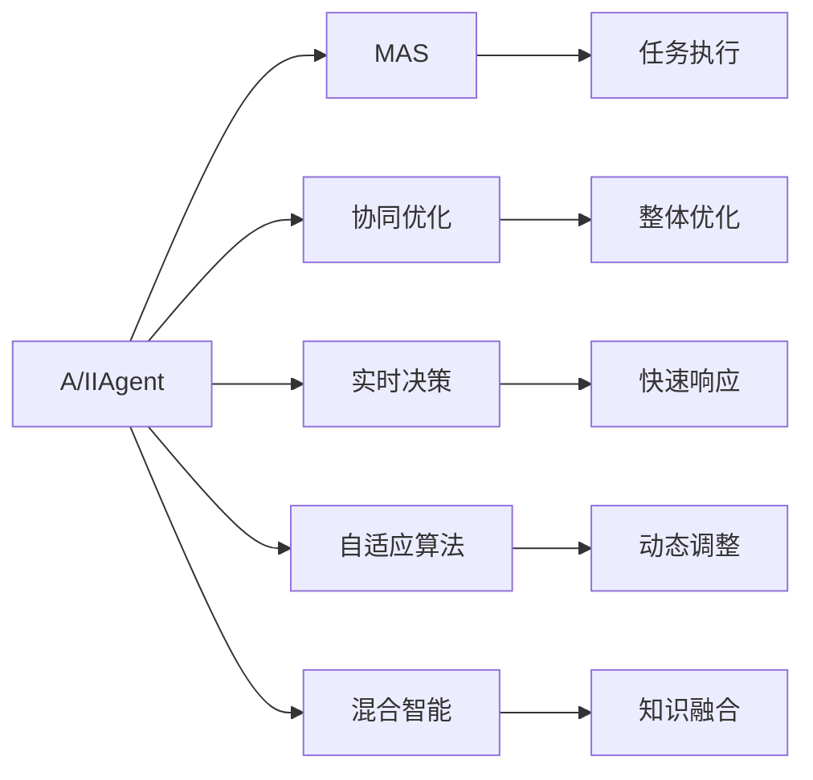

                 

# AI Agent构建智能化运营新常态

> 关键词：
- AI Agent
- 智能化运营
- 多智能体系统
- 协同优化
- 实时决策
- 自适应算法
- 混合智能
- 仿真与测试
- 实时监控

## 1. 背景介绍

### 1.1 问题由来
在当今数字化、智能化迅速发展的背景下，各行各业都在寻求通过技术手段提升运营效率，优化资源配置，增强市场竞争力。传统的运营模式在响应速度、灵活性和智能决策等方面存在较大局限，难以应对多变、复杂的环境变化。AI Agent作为新兴的人工智能技术，通过模拟人类智能行为，能够在运营管理中发挥重要作用，驱动企业迈向智能化运营新常态。

### 1.2 问题核心关键点
AI Agent的核心在于模拟人类的智能行为，通过学习、推理、决策等机制，在复杂的运营环境中执行自动化、智能化的任务。其关键点包括：
- 自主学习：通过多源数据输入和反馈，不断调整自身的行为策略。
- 自适应性：能够根据环境变化动态调整自身状态和行为。
- 决策能力：基于环境模型和目标，做出最优或满意的决策。
- 协同合作：能够在多智能体系统中与其他AI Agent协同工作，实现整体最优。
- 人类与AI的混合智能：将AI Agent与人类专家的知识进行有机结合，增强决策的准确性和鲁棒性。

这些关键点共同构成了AI Agent的智能行为模型，使其能够在运营管理中发挥重要作用，提升企业运营的智能化水平。

### 1.3 问题研究意义
AI Agent技术的应用，对于提升企业的运营效率、降低运营成本、增强市场竞争力具有重要意义：

1. **运营效率提升**：AI Agent能够24/7不间断工作，快速响应运营需求，提高任务处理速度和效率。
2. **成本节约**：通过自动化和智能化决策，减少人力和时间成本，优化资源配置。
3. **决策质量提高**：基于先进算法和数据驱动，AI Agent的决策更加准确和可靠。
4. **市场竞争力增强**：智能化的运营手段能够快速适应市场变化，抢占先机。
5. **创新能力增强**：AI Agent能够不断学习和优化，提升企业的创新能力。

## 2. 核心概念与联系

### 2.1 核心概念概述

为更好地理解AI Agent的构建及其在智能化运营中的应用，本节将介绍几个关键概念及其联系：

- **AI Agent**：模拟人类智能行为的人工智能实体，通过自主学习、自适应和决策能力，在复杂环境中执行任务。
- **多智能体系统(MAS)**：由多个AI Agent组成的网络，通过协同合作实现更优的任务执行。
- **协同优化**：多个AI Agent共同作用，实现整体系统的优化。
- **实时决策**：AI Agent在实时环境中根据当前状态和任务要求，快速做出决策。
- **自适应算法**：使AI Agent能够动态调整自身行为以适应环境变化。
- **混合智能**：将AI Agent与人类专家的知识和经验相结合，提升决策质量和智能水平。

这些概念通过Mermaid流程图展示其关系：



### 2.2 概念间的关系

这些概念之间的关系可以从以下三个方面来理解：

1. **基础与构建**：AI Agent作为基础单位，通过多智能体系统协同完成任务。
2. **动态适应与优化**：AI Agent通过实时决策和自适应算法，动态调整自身行为，实现整体优化。
3. **混合与增强**：AI Agent与人类专家知识融合，提升决策质量，实现混合智能。

## 3. 核心算法原理 & 具体操作步骤
### 3.1 算法原理概述

AI Agent的核心算法原理主要基于强化学习和仿真优化。强化学习通过环境反馈指导AI Agent的行为调整，仿真优化通过模拟环境来测试和优化AI Agent的策略。

**强化学习**：
- **定义**：AI Agent通过与环境交互，基于奖励信号学习最优策略的过程。
- **基本框架**：环境、AI Agent、状态、行动、奖励。
- **算法**：Q-learning、SARSA、Policy Gradient等。

**仿真优化**：
- **定义**：在模拟环境中测试和优化AI Agent的策略，确保其在真实环境中的有效性。
- **基本框架**：仿真环境、AI Agent、状态、行动、反馈。
- **算法**：Monte Carlo Tree Search(MCTS)、遗传算法、模拟退火等。

### 3.2 算法步骤详解

**步骤1: 数据收集与预处理**
- 收集运营数据，包括设备状态、物流信息、市场变化等。
- 对数据进行清洗、归一化和特征工程，提高数据质量。

**步骤2: 环境建模**
- 根据运营场景，构建仿真环境，模拟真实运营环境。
- 定义状态空间、行动空间和奖励函数，确保模型反映实际运营情况。

**步骤3: 设计AI Agent策略**
- 确定AI Agent的目标和行为策略，如调度、库存管理、物流优化等。
- 选择合适的算法框架，如Q-learning、MCTS等。

**步骤4: 训练与优化**
- 在仿真环境中训练AI Agent，不断调整策略参数。
- 使用强化学习算法更新策略，优化决策性能。
- 通过仿真结果评估AI Agent的表现，反馈优化模型。

**步骤5: 部署与监控**
- 将优化后的AI Agent部署到实际运营环境中。
- 实时监控AI Agent的决策和行为，确保系统稳定运行。
- 收集反馈数据，持续改进AI Agent策略。

### 3.3 算法优缺点

**强化学习的优点**：
- 适应性强：能够根据环境反馈调整策略，适应复杂多变的环境。
- 数据驱动：基于实际数据训练，决策具有较高的可信度。
- 并行计算：多个AI Agent可以同时训练，提高效率。

**强化学习的缺点**：
- 样本效率低：需要大量环境数据进行训练，初期效果可能不佳。
- 探索与利用冲突：需要平衡探索新策略和利用现有策略之间的矛盾。
- 策略稳定：优化过程可能存在不稳定，导致策略波动。

**仿真优化的优点**：
- 可控性强：能够控制仿真环境和参数，便于模型测试和优化。
- 多样性丰富：可以模拟多种运营场景，测试AI Agent在不同情况下的表现。
- 可验证性高：仿真结果可验证AI Agent的实际效果。

**仿真优化的缺点**：
- 与实际环境差异：仿真环境与真实运营环境可能存在差异，影响结果。
- 计算量大：构建和运行仿真环境需要大量计算资源。
- 时间延迟：仿真过程可能存在时间延迟，影响实时决策。

### 3.4 算法应用领域

AI Agent技术已经在许多领域得到广泛应用，如制造、物流、交通、金融等。以下是一些具体的应用场景：

**制造业**：
- **智能调度**：通过AI Agent优化生产计划和调度，提高生产效率。
- **质量控制**：AI Agent实时监控设备状态，及时发现和修复故障。

**物流行业**：
- **路径优化**：AI Agent通过实时交通和需求数据，优化物流路径和配送策略。
- **库存管理**：AI Agent动态调整库存水平，避免库存过剩或缺货。

**交通系统**：
- **交通流量控制**：AI Agent根据实时交通数据，优化交通信号和流量分配。
- **事故响应**：AI Agent自动分析交通事故，快速做出应急响应。

**金融市场**：
- **风险管理**：AI Agent实时监测市场变化，动态调整投资策略。
- **客户服务**：AI Agent自动处理客户咨询，提供24/7服务。

## 4. 数学模型和公式 & 详细讲解 & 举例说明

### 4.1 数学模型构建

我们以一个简单的物流路径优化问题为例，构建AI Agent的数学模型。设物流路径由$N$个节点组成，每个节点的坐标为$(x_i, y_i)$。AI Agent的目标是找到一个最优路径，使得总物流成本最小。

**状态表示**：
- 当前节点$i$的状态$S_i$表示为$(x_i, y_i)$。
- 整个路径的状态$S$表示为$(x_1, y_1, x_2, y_2, ..., x_N, y_N)$。

**行动表示**：
- 从节点$i$到节点$j$的行动$A$表示为$(j, t_i, t_j)$，其中$t_i$和$t_j$分别表示节点$i$和$j$的物流时间。

**奖励函数**：
- 设定一个惩罚函数$R$，根据路径的总成本和额外成本（如交通拥堵），计算出奖励值。

**数学模型**：
- 定义Q函数，表示在状态$S_i$下，行动$A$的Q值：
$$ Q(S_i, A) = r(S_i, A) + \gamma \max_{A'} Q(S_{i+1}, A') $$
其中，$r(S_i, A)$为奖励值，$\gamma$为折扣因子。

### 4.2 公式推导过程

根据强化学习的定义，我们可以推导出AI Agent的策略更新公式。设$\theta$为AI Agent的策略参数，$\epsilon$为探索率，则策略更新公式为：
$$ \theta \leftarrow \theta + \eta \nabla_{\theta} \sum_{i=1}^{N} \sum_{j=1}^{N} \sum_{k=1}^{N} Q(S_i, A) \log \pi_{\theta}(A|S_i) $$
其中，$\pi_{\theta}(A|S_i)$为策略函数，$\eta$为学习率。

### 4.3 案例分析与讲解

假设在一个智能制造系统中，工厂有多个生产线，每个生产线有多个机器。AI Agent的目标是找到一个最优的生产调度方案，使得生产效率最大化。我们以一个简单的生产调度问题为例，构建AI Agent的数学模型。

设生产线$i$的状态$S_i$表示为$(i, p_i)$，其中$p_i$为生产线$i$的负荷。AI Agent的行动$A$表示为从生产线$i$切换到生产线$j$，$A=(i, j)$。奖励函数$R$定义为：
$$ R(S_i, A) = \frac{1}{N} \sum_{k=1}^{N} (p_i - p_k) $$
目标是最小化生产线的负荷差异。

## 5. 项目实践：代码实例和详细解释说明

### 5.1 开发环境搭建

为进行AI Agent的实践开发，需要准备以下开发环境：

1. 安装Python：从官网下载安装包，进行安装。
2. 安装相关库：如numpy、pandas、scikit-learn等。
3. 安装AI Agent框架：如PyTorch、TensorFlow等。
4. 安装数据集和环境模拟工具：如Gym、Simpy等。

### 5.2 源代码详细实现

以下是使用PyTorch实现一个简单的Q-learning AI Agent的代码示例。

```python
import torch
import torch.nn as nn
import torch.optim as optim
import gym

class QNetwork(nn.Module):
    def __init__(self, state_size, action_size):
        super(QNetwork, self).__init__()
        self.fc1 = nn.Linear(state_size, 64)
        self.fc2 = nn.Linear(64, action_size)
    
    def forward(self, x):
        x = self.fc1(x)
        x = nn.functional.relu(x)
        x = self.fc2(x)
        return x
    
def q_learning(env, num_episodes=5000, discount_factor=0.99, learning_rate=0.01, exploration_rate=1.0, exploration_decay=0.995):
    state_size = env.observation_space.shape[0]
    action_size = env.action_space.n
    model = QNetwork(state_size, action_size)
    optimizer = optim.Adam(model.parameters(), lr=learning_rate)
    criterion = nn.MSELoss()
    
    for episode in range(num_episodes):
        state = env.reset()
        done = False
        total_reward = 0
        
        while not done:
            if np.random.rand() < exploration_rate:
                action = env.action_space.sample()
            else:
                action = model(state).argmax().item()
            next_state, reward, done, _ = env.step(action)
            total_reward += reward
            
            prediction = model(state)
            target = reward + discount_factor * torch.max(model(next_state).detach()).item()
            loss = criterion(prediction, target.unsqueeze(0))
            
            optimizer.zero_grad()
            loss.backward()
            optimizer.step()
            
            state = next_state
        
        exploration_rate *= exploration_decay
    return model
```

### 5.3 代码解读与分析

代码实现了一个简单的Q-learning AI Agent，用于解决一个经典的游戏环境问题。

**QNetwork类**：
- 定义了一个神经网络模型，包含两个全连接层，用于学习状态与行动之间的映射关系。

**q_learning函数**：
- 定义了一个Q-learning算法，用于训练AI Agent。
- 环境变量通过gym库进行模拟。
- 学习过程中，AI Agent根据当前状态和探索率选择行动，更新模型参数，并记录奖励和状态。
- 使用MSELoss作为损失函数，Adam优化器进行参数更新。
- 在每一集结束时，调整探索率，以平衡探索和利用。

### 5.4 运行结果展示

在训练完毕后，可以在新的环境中测试AI Agent的表现。例如，在一个迷宫问题中，AI Agent能够通过不断学习，找到最优路径，从而高效完成迷宫任务。

```python
state = env.reset()
done = False
total_reward = 0

while not done:
    if np.random.rand() < exploration_rate:
        action = env.action_space.sample()
    else:
        action = model(state).argmax().item()
    next_state, reward, done, _ = env.step(action)
    total_reward += reward

print(f"Total reward: {total_reward}")
```

## 6. 实际应用场景

### 6.1 智能制造

在智能制造领域，AI Agent能够优化生产调度、设备维护和质量控制等任务。例如，通过实时监控设备状态和生产数据，AI Agent能够动态调整生产计划和调度，提高生产效率和产品质量。

### 6.2 智能交通

在智能交通领域，AI Agent能够优化交通流量控制、事故响应和路线规划等任务。例如，通过实时监测交通数据，AI Agent能够动态调整交通信号和流量分配，提高道路通行效率，减少事故发生率。

### 6.3 智慧医疗

在智慧医疗领域，AI Agent能够优化诊疗流程、药物管理和患者服务。例如，通过分析患者数据和诊断结果，AI Agent能够动态调整诊疗方案和药物管理策略，提高诊疗效率和患者满意度。

### 6.4 未来应用展望

未来，AI Agent技术将在更多领域得到广泛应用，如智慧城市、能源管理、农业生产等。通过不断优化算法和增强模型能力，AI Agent将进一步提升各行各业的运营效率和智能化水平。

## 7. 工具和资源推荐

### 7.1 学习资源推荐

- **《强化学习基础》**：一本书籍，详细介绍了强化学习的基本理论和算法。
- **DeepMind的课程**：DeepMind开设的强化学习课程，涵盖了多种强化学习算法和应用场景。
- **Gym环境库**：Gym是OpenAI开发的模拟环境库，提供了多种环境供学习和实验。

### 7.2 开发工具推荐

- **PyTorch**：基于Python的开源深度学习框架，灵活性高，支持GPU加速。
- **TensorFlow**：由Google主导开发的深度学习框架，支持大规模分布式训练。
- **Simpy**：Python环境仿真库，用于构建和运行仿真环境。

### 7.3 相关论文推荐

- **DeepMind的论文**：DeepMind在强化学习领域的最新研究成果。
- **UC Berkeley的论文**：UC Berkeley在智能系统方面的最新研究成果。
- **IEEE的论文**：IEEE在智能控制和优化方面的最新研究成果。

## 8. 总结：未来发展趋势与挑战

### 8.1 研究成果总结

本文对AI Agent在智能化运营中的应用进行了全面介绍，从算法原理到实践应用，全面涵盖了AI Agent技术的关键概念和操作步骤。通过详细讲解数学模型和代码实例，使得读者能够更好地理解和应用AI Agent技术。

### 8.2 未来发展趋势

未来AI Agent技术的发展将呈现以下几个趋势：

1. **多智能体系统的应用**：随着多智能体系统的成熟，AI Agent将能够在更加复杂的环境中协同工作，实现整体最优。
2. **混合智能的提升**：通过将AI Agent与人类专家知识相结合，提升决策质量和智能水平。
3. **自适应算法的改进**：开发更加高效、鲁棒的自适应算法，提高AI Agent的适应性和优化能力。
4. **混合智能的提升**：通过将AI Agent与人类专家知识相结合，提升决策质量和智能水平。
5. **边缘计算的引入**：将AI Agent部署在边缘计算环境中，实现实时决策和优化。

### 8.3 面临的挑战

尽管AI Agent技术取得了显著进展，但在实际应用中仍面临以下挑战：

1. **数据获取的困难**：获取高质量的环境数据和行为数据较为困难，影响AI Agent的训练效果。
2. **模型复杂性**：构建复杂的运营环境模型需要大量计算资源和时间。
3. **性能波动**：AI Agent在不同环境下的性能波动较大，需要进一步优化算法。
4. **安全性和隐私**：AI Agent在处理敏感数据时，需要确保数据安全和隐私保护。

### 8.4 研究展望

未来的AI Agent研究将关注以下几个方向：

1. **自监督学习**：通过无监督学习，提高AI Agent的自主学习和优化能力。
2. **跨领域应用**：将AI Agent技术应用于不同领域，提升各行业的运营效率和智能化水平。
3. **混合智能**：将AI Agent与人类专家的知识结合，提升决策质量和智能水平。
4. **仿真优化**：开发更加高效的仿真优化算法，提高AI Agent的性能和鲁棒性。
5. **边缘计算**：将AI Agent部署在边缘计算环境中，实现实时决策和优化。

总之，AI Agent技术在智能化运营中具有广泛的应用前景。通过不断优化算法和增强模型能力，AI Agent将能够更好地适应复杂多变的环境，提升各行业的运营效率和智能化水平。

## 9. 附录：常见问题与解答

**Q1：如何选择合适的AI Agent算法？**

A: 选择合适的AI Agent算法需要考虑问题类型和数据特性。例如，对于连续性任务，可以使用DQN算法；对于离散性任务，可以使用Q-learning算法；对于大规模问题，可以使用MCTS算法。

**Q2：如何评估AI Agent的性能？**

A: 可以通过模拟环境中的测试和评估指标来评估AI Agent的性能。例如，使用平均累计奖励、成功率和任务完成时间等指标来评估AI Agent的表现。

**Q3：AI Agent如何实现自适应性？**

A: AI Agent通过实时监控环境变化，动态调整自身状态和行为。例如，在智能交通中，AI Agent能够根据实时交通数据，动态调整交通信号和流量分配。

**Q4：AI Agent如何处理多智能体系统的协同优化？**

A: 通过定义共同的奖励函数和目标，多个AI Agent能够协同工作，实现整体最优。例如，在智能制造中，多个AI Agent可以协同优化生产计划和调度，提高生产效率。

**Q5：AI Agent在实际应用中需要注意哪些问题？**

A: AI Agent在实际应用中需要注意数据质量、模型复杂性、性能波动、安全性和隐私等问题。例如，在医疗领域，需要确保数据的安全性和隐私保护；在金融领域，需要确保模型的鲁棒性和稳定性。

总之，AI Agent技术在智能化运营中具有广泛的应用前景。通过不断优化算法和增强模型能力，AI Agent将能够更好地适应复杂多变的环境，提升各行业的运营效率和智能化水平。

---

作者：禅与计算机程序设计艺术 / Zen and the Art of Computer Programming

