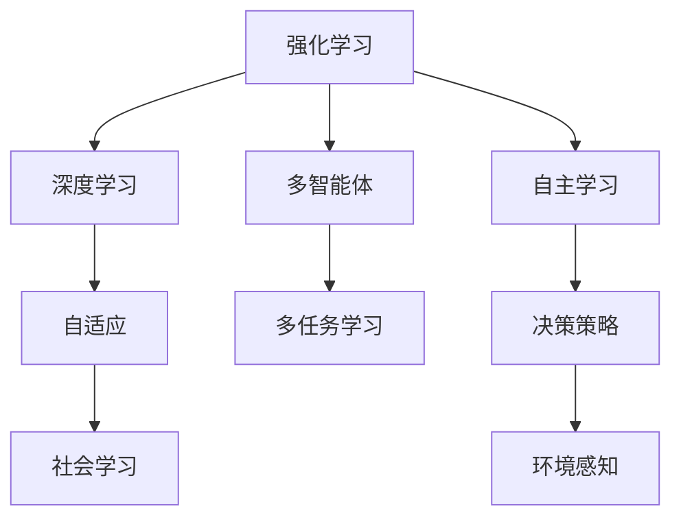

                 

# AI Agent核心技术的探索

> 关键词：AI Agent, 强化学习, 深度学习, 多智能体, 自适应, 社会学习, 多任务学习

## 1. 背景介绍

### 1.1 问题由来

近年来，随着深度学习技术的发展，人工智能(AI)代理(Agent)的研发进入了一个新的阶段。AI代理不再仅仅是一系列任务的自动化执行者，而是逐步演变为具备感知、理解、推理、决策能力的复杂系统。这种转变主要得益于深度学习和强化学习技术的进步，尤其是深度强化学习在NLP、游戏、机器人等领域的应用。

AI代理的应用场景已经从工业自动化扩展到了医疗、金融、教育、城市管理等多个垂直领域。如何设计出高性能、可扩展的AI代理，使其能够自主学习、适应复杂环境，成为了一个重要的研究课题。

### 1.2 问题核心关键点

AI代理的核心在于其具备的学习和适应能力。代理通过与环境的交互，从各种传感器和输入数据中学习，不断地优化自身的行为策略，以最大化预定义的目标函数。

关键点包括：
1. **学习框架**：代理如何从经验中提取知识。
2. **决策策略**：代理在面对不同状态和行动时如何选择。
3. **环境感知**：代理如何理解环境并提供反馈。
4. **模型优化**：代理如何更新自身的模型以适应新的环境。

这些核心点相互关联，共同构成了AI代理的完整架构。

### 1.3 问题研究意义

设计高效、自主的AI代理对于提升自动化系统的智能化水平具有重要意义：
1. **提升效率**：AI代理能够自动化地执行重复性、规则性任务，显著提升工作效率。
2. **优化决策**：通过学习，AI代理可以不断优化决策过程，提高决策质量。
3. **自适应性**：代理能够适应不断变化的环境，灵活应对各种突发情况。
4. **创新能力**：代理通过不断探索，可能发现新方法和新策略，推动技术进步。
5. **人性化交互**：AI代理可以与人类用户进行自然的交互，提升用户体验。

总之，AI代理的核心技术不仅具有理论研究价值，更具有广泛的应用前景，对于推动智能化社会的发展具有重要意义。

## 2. 核心概念与联系

### 2.1 核心概念概述

为更好地理解AI代理的核心技术，本节将介绍几个关键概念及其相互关系：

- **强化学习(Reinforcement Learning, RL)**：一种通过与环境的交互，学习最优策略的机器学习方法。代理通过执行行动并接收环境反馈，调整自身的行为策略，以最大化长期奖励。

- **深度学习(Deep Learning, DL)**：一种基于多层神经网络的机器学习方法，可以自动提取数据的特征表示，在图像、语音、自然语言处理等领域取得显著成效。

- **多智能体(Multi-Agent System,MAS)**：由多个代理组成，各自具备独立的目标和行动空间，通过协调和合作完成任务的系统。

- **自适应(Adaptability)**：代理能够根据环境变化，动态调整自身行为和策略的能力。

- **社会学习(Social Learning)**：代理通过观察和学习其他代理的行为，改进自身的策略和能力。

- **多任务学习(Multi-task Learning)**：代理能够同时学习并执行多个任务，提升资源利用率和任务完成效率。

这些核心概念共同构成了AI代理的完整框架，使其能够在复杂的动态环境中实现自主学习和适应。

### 2.2 概念间的关系

这些核心概念之间的逻辑关系可以通过以下Mermaid流程图来展示：



这个流程图展示了AI代理的核心概念及其相互关系：

1. 强化学习是AI代理学习的基础，通过与环境的交互，学习最优策略。
2. 深度学习为代理提供了强大的特征提取能力，支持代理对复杂数据的理解和处理。
3. 多智能体系统使代理能够协作完成任务，提升整体效率。
4. 自适应使代理能够动态调整策略，应对环境变化。
5. 社会学习使代理能够从其他代理的学习中获益，优化自身策略。
6. 多任务学习使代理能够同时处理多个任务，提升资源利用率。
7. 自主学习是代理的核心能力，代理通过与环境的交互，不断优化自身策略。
8. 决策策略和环境感知是代理行动的基础，代理需要根据当前状态和目标，选择最佳行动。

通过这些概念的相互结合，AI代理能够实现自主学习、适应、协作和优化，成为高效、智能的决策者。

## 3. 核心算法原理 & 具体操作步骤
### 3.1 算法原理概述

AI代理的核心算法是强化学习，其核心思想是代理通过与环境的交互，学习最优策略，以最大化长期奖励。强化学习包含四个要素：状态(S)、行动(A)、奖励(R)和策略(π)。代理在当前状态(S)下，根据策略(π)选择行动(A)，环境根据代理的行动(A)和当前状态(S)给予奖励(R)，代理根据奖励(R)和状态(S)更新策略(π)。

AI代理的学习框架主要包括以下几个步骤：

1. **状态感知**：代理从传感器获取环境数据，构建环境状态表示。
2. **策略选择**：代理根据当前状态和目标，选择最优行动。
3. **行动执行**：代理在环境中执行行动，并观察环境变化。
4. **状态更新**：代理根据新的环境状态，调整自身策略。
5. **奖励反馈**：代理根据行动的奖励，更新策略，优化行为。

这些步骤通过不断的迭代优化，使代理能够逐步接近最优策略。

### 3.2 算法步骤详解

#### 3.2.1 状态感知

代理需要从传感器获取环境数据，构建状态表示。状态表示可以是高维的，如RGB图像、文本描述等，也可以是通过特征提取得到的低维向量。状态感知通常依赖于深度学习模型，如卷积神经网络(CNN)、循环神经网络(RNN)、变分自编码器(VAE)等。

#### 3.2.2 策略选择

代理需要根据当前状态和目标，选择最优行动。策略选择通常依赖于价值函数和策略网络。价值函数用于评估当前状态的长期奖励，策略网络用于根据状态输出行动的概率分布。常用的策略选择方法包括Q-learning、SARSA、Actor-Critic等。

#### 3.2.3 行动执行

代理在环境中执行行动，并观察环境变化。行动执行通常依赖于模型预测和执行器。模型预测代理的行动，执行器将行动转化为具体的操作。

#### 3.2.4 状态更新

代理根据新的环境状态，调整自身策略。状态更新通常依赖于模型的参数更新，如反向传播算法。参数更新可以使代理根据新的经验不断优化策略。

#### 3.2.5 奖励反馈

代理根据行动的奖励，更新策略，优化行为。奖励反馈通常依赖于奖励函数和优化算法。奖励函数用于评估行动的好坏，优化算法用于调整策略参数，以最大化长期奖励。

### 3.3 算法优缺点

强化学习的优点包括：
1. 能够处理非结构化数据，如文本、图像等。
2. 可以处理动态变化的环境，适应性强。
3. 能够实现多智能体的协作和竞争，提升整体效率。

强化学习的缺点包括：
1. 需要大量的训练数据和计算资源，训练时间较长。
2. 存在局部最优解问题，难以找到全局最优策略。
3. 策略选择和更新依赖于奖励函数的设计，可能存在奖励设计不当的问题。

### 3.4 算法应用领域

强化学习在多个领域都有广泛应用，例如：

- **游戏AI**：如AlphaGo、Dota2 AI等，通过强化学习实现高效的决策和策略优化。
- **机器人控制**：如移动机器人、无人机等，通过强化学习实现路径规划、动作控制等。
- **自动驾驶**：如自动驾驶汽车、无人机等，通过强化学习实现智能决策和避障策略。
- **自然语言处理**：如对话系统、机器翻译等，通过强化学习实现语义理解和生成。
- **工业自动化**：如生产调度、故障诊断等，通过强化学习实现高效的生产管理和维护。

强化学习在实际应用中取得了显著的成效，展现了其在复杂环境下的强大适应能力。

## 4. 数学模型和公式 & 详细讲解 & 举例说明

### 4.1 数学模型构建

强化学习模型通常由状态、行动、奖励和策略组成。设状态集合为 $S$，行动集合为 $A$，奖励函数为 $R:S \times A \rightarrow [0,1]$，策略函数为 $\pi:S \times A \rightarrow [0,1]$。代理在当前状态 $s_t$ 下，选择行动 $a_t$，环境根据行动和状态给予奖励 $r_{t+1}$，并更新状态为 $s_{t+1}$。代理的长期奖励为 $G_t=\sum_{i=t}^{\infty} \gamma^{i-t} r_i$，其中 $\gamma$ 为折扣因子。代理的目标是最大化长期奖励 $G_t$。

### 4.2 公式推导过程

强化学习的核心目标是最大化长期奖励，即求解最优策略 $\pi^*$。常用的方法包括Q-learning、SARSA、Actor-Critic等。

以Q-learning为例，其核心思想是通过迭代更新Q值表，找到最优策略。设状态-行动对的Q值表为 $Q(s,a)$，代理在当前状态 $s_t$ 下选择行动 $a_t$，根据奖励 $r_{t+1}$ 和状态 $s_{t+1}$ 更新Q值，即：
$$
Q(s_t,a_t) \leftarrow Q(s_t,a_t) + \alpha(r_{t+1} + \gamma \max_{a} Q(s_{t+1},a) - Q(s_t,a_t))
$$
其中 $\alpha$ 为学习率。通过不断的迭代更新，Q值表中的Q值会逐渐趋近于最优值。代理的行动策略可以通过Q值表选择行动，即：
$$
a_t \sim \pi(a_t | s_t) = \arg\max_a Q(s_t,a)
$$

### 4.3 案例分析与讲解

以AlphaGo为例，探讨强化学习在游戏AI中的应用。AlphaGo通过深度神经网络构建策略网络和价值网络，在围棋游戏中学习最优策略。具体步骤如下：

1. **策略网络**：代理通过深度神经网络预测当前状态的下一步行动，策略网络包括卷积神经网络(CNN)和长短期记忆网络(LSTM)。
2. **价值网络**：代理通过深度神经网络评估当前状态的长期奖励，价值网络包括多层感知器(MLP)和卷积神经网络(CNN)。
3. **策略选择**：代理根据策略网络输出概率分布，选择最优行动。
4. **行动执行**：代理在围棋棋盘上执行下一步行动。
5. **状态更新**：代理根据新的棋盘状态，更新策略网络和价值网络。
6. **奖励反馈**：代理根据游戏结果，更新策略网络和价值网络，优化策略。

AlphaGo通过不断学习和优化策略，在围棋游戏中战胜了世界冠军李世石，展现了强化学习在游戏AI中的巨大潜力。

## 5. 项目实践：代码实例和详细解释说明

### 5.1 开发环境搭建

在进行AI代理开发前，我们需要准备好开发环境。以下是使用Python进行TensorFlow开发的环境配置流程：

1. 安装Anaconda：从官网下载并安装Anaconda，用于创建独立的Python环境。

2. 创建并激活虚拟环境：
```bash
conda create -n tf-env python=3.8 
conda activate tf-env
```

3. 安装TensorFlow：根据CUDA版本，从官网获取对应的安装命令。例如：
```bash
conda install tensorflow -c conda-forge
```

4. 安装各类工具包：
```bash
pip install numpy pandas scikit-learn matplotlib tqdm jupyter notebook ipython
```

完成上述步骤后，即可在`tf-env`环境中开始AI代理的开发。

### 5.2 源代码详细实现

这里我们以AlphaGo为例，给出使用TensorFlow对深度强化学习模型进行开发的PyTorch代码实现。

首先，定义AlphaGo的策略网络：

```python
import tensorflow as tf

class AlphaGoPolicyNetwork(tf.keras.Model):
    def __init__(self, input_shape, num_actions, learning_rate=0.001):
        super(AlphaGoPolicyNetwork, self).__init__()
        self.input_shape = input_shape
        self.num_actions = num_actions
        self.conv1 = tf.keras.layers.Conv2D(32, 3, activation='relu')
        self.conv2 = tf.keras.layers.Conv2D(64, 3, activation='relu')
        self.fc1 = tf.keras.layers.Dense(256, activation='relu')
        self.fc2 = tf.keras.layers.Dense(num_actions, activation='softmax')
        self.learning_rate = learning_rate
    
    def call(self, inputs):
        x = tf.keras.layers.Flatten()(inputs)
        x = self.conv1(x)
        x = self.conv2(x)
        x = self.fc1(x)
        x = self.fc2(x)
        return x
```

然后，定义AlphaGo的价值网络：

```python
class AlphaGoValueNetwork(tf.keras.Model):
    def __init__(self, input_shape, num_actions, learning_rate=0.001):
        super(AlphaGoValueNetwork, self).__init__()
        self.input_shape = input_shape
        self.num_actions = num_actions
        self.conv1 = tf.keras.layers.Conv2D(32, 3, activation='relu')
        self.conv2 = tf.keras.layers.Conv2D(64, 3, activation='relu')
        self.fc1 = tf.keras.layers.Dense(256, activation='relu')
        self.fc2 = tf.keras.layers.Dense(1, activation='sigmoid')
        self.learning_rate = learning_rate
    
    def call(self, inputs):
        x = tf.keras.layers.Flatten()(inputs)
        x = self.conv1(x)
        x = self.conv2(x)
        x = self.fc1(x)
        x = self.fc2(x)
        return x
```

接着，定义AlphaGo的训练函数：

```python
def train_alpha_go(model, data, epochs):
    for epoch in range(epochs):
        for state, action in data:
            with tf.GradientTape() as tape:
                logits = model(state)
                value = model(state)
                loss = tf.losses.mean_squared_error(tf.constant([0.5]), value)
            gradients = tape.gradient(loss, model.trainable_variables)
            optimizer.apply_gradients(zip(gradients, model.trainable_variables))
```

最后，启动AlphaGo训练流程：

```python
epochs = 1000
data = # 加载训练数据

policy_model = AlphaGoPolicyNetwork(input_shape, num_actions)
value_model = AlphaGoValueNetwork(input_shape, num_actions)
optimizer = tf.keras.optimizers.Adam(learning_rate=0.001)

train_alpha_go(policy_model, data, epochs)

# 加载预训练模型
policy_model = tf.keras.models.load_model('policy_model.h5')
value_model = tf.keras.models.load_model('value_model.h5')
```

以上就是使用TensorFlow对AlphaGo进行深度强化学习训练的完整代码实现。可以看到，TensorFlow提供了丰富的深度学习组件，可以方便地构建和训练神经网络模型。

### 5.3 代码解读与分析

让我们再详细解读一下关键代码的实现细节：

**AlphaGoPolicyNetwork类**：
- `__init__`方法：初始化网络结构，包括卷积层、全连接层等。
- `call`方法：定义前向传播过程，返回模型输出。

**AlphaGoValueNetwork类**：
- `__init__`方法：初始化网络结构，包括卷积层、全连接层等。
- `call`方法：定义前向传播过程，返回模型输出。

**train_alpha_go函数**：
- 定义训练过程，循环迭代，遍历训练数据集，对每个样本进行前向传播和反向传播。
- 使用梯度下降算法更新模型参数，最小化损失函数。

在实际应用中，AlphaGo的策略网络用于选择行动，价值网络用于评估状态的长期奖励。在训练过程中，策略网络和价值网络同时更新，以优化策略和评估能力。训练完成后，加载预训练模型，可以进行实际的游戏决策和策略优化。

## 6. 实际应用场景
### 6.1 智能客服系统

基于AI代理的智能客服系统可以显著提升客户服务体验。传统客服系统依赖于人工处理，成本高、效率低。智能客服系统通过AI代理，能够自动理解和回复客户咨询，快速解决常见问题。

在技术实现上，可以收集企业内部客服对话记录，将其转换为监督学习数据，在此基础上训练AI代理模型。代理通过学习客户提问和回答的语义关系，能够自动生成合适的回复，提供24小时不间断服务。系统还可以接入知识库和搜索系统，动态生成答案，提升服务质量。

### 6.2 金融风险控制

金融领域需要实时监测市场波动，及时采取风险控制措施。AI代理可以通过学习市场数据和交易行为，预测市场趋势，生成交易策略，帮助金融机构降低风险。

具体而言，AI代理可以从金融数据平台收集实时数据，通过强化学习模型学习交易策略，生成买卖指令，进行实时交易。系统可以不断调整策略，应对市场变化，实现自动化风险控制。

### 6.3 供应链管理

供应链管理是一个复杂的系统，需要实时协调生产、运输、库存等环节。AI代理可以通过学习供应链数据，优化供应链策略，提升供应链效率。

在实际应用中，AI代理可以收集供应链数据，学习最优的生产和运输策略，动态调整库存水平，降低成本。系统可以通过预测需求变化，优化订单处理流程，提高供应链的响应速度和灵活性。

### 6.4 未来应用展望

随着AI代理技术的发展，其在各行业的应用前景将更加广阔：

- **医疗诊断**：AI代理可以通过学习医疗数据，辅助医生进行疾病诊断和治疗方案推荐，提升医疗服务的智能化水平。
- **教育培训**：AI代理可以通过学习学生的学习数据，个性化推荐学习资源，提高学习效率。
- **智能制造**：AI代理可以通过学习生产数据，优化生产计划和质量控制，提升制造业的自动化和智能化水平。
- **智能家居**：AI代理可以通过学习用户行为数据，提供个性化的家居服务和建议，提升家庭生活品质。

总之，AI代理技术将在更多垂直领域得到应用，推动智能化社会的建设。未来，AI代理将变得更加智能、高效、可靠，成为人类生产和生活的重要助手。

## 7. 工具和资源推荐
### 7.1 学习资源推荐

为了帮助开发者系统掌握AI代理的理论基础和实践技巧，这里推荐一些优质的学习资源：

1. 《Reinforcement Learning: An Introduction》：由Sutton和Barto合著的经典教材，介绍了强化学习的核心概念和算法。

2. CS294T《强化学习》课程：由加州大学伯克利分校开设的强化学习课程，有Lecture视频和配套作业，带你深入理解强化学习的基本原理。

3. 《Deep Learning with TensorFlow 2》书籍：由TensorFlow官方出版的深度学习教程，介绍了深度学习在TensorFlow中的实现方法。

4. arXiv论文预印本：人工智能领域最新研究成果的发布平台，包括大量尚未发表的前沿工作，学习前沿技术的必读资源。

5. Google AI博客：谷歌AI团队发布的前沿技术分享，涵盖深度学习、强化学习、自然语言处理等多个领域，开阔视野。

通过这些资源的学习实践，相信你一定能够快速掌握AI代理的核心技术，并用于解决实际的AI问题。

### 7.2 开发工具推荐

高效的开发离不开优秀的工具支持。以下是几款用于AI代理开发的常用工具：

1. TensorFlow：由谷歌开发的深度学习框架，支持动态图和静态图两种计算图，适合大规模工程应用。

2. PyTorch：由Facebook开发的深度学习框架，支持动态图和静态图，适合快速迭代研究。

3. OpenAI Gym：由OpenAI开发的模拟环境库，提供各种经典游戏和模拟环境，方便开发和测试AI代理。

4. Google Cloud Platform：谷歌云平台，提供强大的计算资源和云端部署服务，支持大规模AI代理训练和推理。

5. Microsoft Azure：微软云平台，提供丰富的AI和数据处理服务，支持大规模分布式训练和推理。

6. Amazon AWS：亚马逊云平台，提供多种AI和计算服务，支持大规模AI代理训练和推理。

合理利用这些工具，可以显著提升AI代理开发的效率，加快创新迭代的步伐。

### 7.3 相关论文推荐

AI代理技术的发展源于学界的持续研究。以下是几篇奠基性的相关论文，推荐阅读：

1. AlphaGo Zero: Mastering the Game of Go without Human Knowledge：AlphaGo Zero通过强化学习，在无人类知识的情况下，达到了与AlphaGo相同的水平。

2. Mastering Chess and Shogi by Self-Play with Deep Reinforcement Learning：AlphaZero通过强化学习，在围棋和象棋上达到了人类顶尖水平，展示了强化学习在游戏AI中的巨大潜力。

3. Playing Atari with Deep Reinforcement Learning：AlphaGo通过强化学习，在多个Atari游戏中取得了优于人类的表现，展示了深度强化学习在游戏AI中的应用前景。

4. Multi-Agent System for Robotic Simulation with Energy-Aware Resilient Modeling：该论文介绍了多智能体系统在机器人模拟中的应用，通过合作学习提升系统性能。

5. GAN for Robotic Visual Navigation without Human Demonstrations：该论文通过生成对抗网络(GAN)，训练AI代理在无人指导的情况下，自主导航完成复杂任务。

这些论文代表了大语言模型微调技术的发展脉络。通过学习这些前沿成果，可以帮助研究者把握学科前进方向，激发更多的创新灵感。

除上述资源外，还有一些值得关注的前沿资源，帮助开发者紧跟AI代理技术的最新进展，例如：

1. arXiv论文预印本：人工智能领域最新研究成果的发布平台，包括大量尚未发表的前沿工作，学习前沿技术的必读资源。

2. 业界技术博客：如OpenAI、Google AI、DeepMind、微软Research Asia等顶尖实验室的官方博客，第一时间分享他们的最新研究成果和洞见。

3. 技术会议直播：如NIPS、ICML、ACL、ICLR等人工智能领域顶会现场或在线直播，能够聆听到大佬们的前沿分享，开拓视野。

4. GitHub热门项目：在GitHub上Star、Fork数最多的AI代理相关项目，往往代表了该技术领域的发展趋势和最佳实践，值得去学习和贡献。

5. 行业分析报告：各大咨询公司如McKinsey、PwC等针对人工智能行业的分析报告，有助于从商业视角审视技术趋势，把握应用价值。

总之，对于AI代理技术的学习和实践，需要开发者保持开放的心态和持续学习的意愿。多关注前沿资讯，多动手实践，多思考总结，必将收获满满的成长收益。

## 8. 总结：未来发展趋势与挑战

### 8.1 总结

本文对AI代理的核心技术进行了全面系统的介绍。首先阐述了AI代理的研究背景和意义，明确了代理在提升自动化系统智能化水平中的重要地位。其次，从原理到实践，详细讲解了强化学习的核心思想和操作步骤，给出了AlphaGo等典型案例的代码实现。同时，本文还探讨了AI代理在智能客服、金融风险控制、供应链管理等实际应用场景中的广泛应用前景。最后，本文精选了AI代理技术的各类学习资源，力求为读者提供全方位的技术指引。

通过本文的系统梳理，可以看到，AI代理的核心技术不仅具有理论研究价值，更具有广泛的应用前景，对于推动智能化社会的发展具有重要意义。

### 8.2 未来发展趋势

展望未来，AI代理技术将呈现以下几个发展趋势：

1. **深度强化学习的融合**：未来AI代理将更多地融合深度强化学习技术，提升其对复杂环境和任务的适应能力。

2. **多智能体的协作**：多智能体系统将逐渐普及，AI代理通过协作学习，提升整体效率和鲁棒性。

3. **社会学习和知识整合**：AI代理将更多地利用社会学习和知识整合技术，提升其决策和推理能力。

4. **多任务学习的应用**：AI代理将更多地应用于多任务场景，提升资源利用率和任务完成效率。

5. **自动化生成能力的提升**：AI代理将更多地具备自动化生成能力，能够生成文本、图像、音频等多种形式的内容。

6. **跨模态学习的应用**：AI代理将更多地融合视觉、语音、文本等多种模态的信息，提升其感知和理解能力。

以上趋势凸显了AI代理技术的广阔前景。这些方向的探索发展，必将进一步提升AI代理的性能和应用范围，为人类认知智能的进化带来深远影响。

### 8.3 面临的挑战

尽管AI代理技术已经取得了显著成效，但在迈向更加智能化、普适化应用的过程中，它仍面临着诸多挑战：

1. **环境复杂性**：AI代理在处理复杂环境时，可能面临多层次、多目标的问题，难以找到全局最优解。

2. **数据获取和标注**：获取高质量的训练数据和标注数据，成本较高，且存在数据分布偏差的问题。

3. **模型泛化能力**：AI代理在面对新任务和新数据时，泛化能力较弱，难以保持长期稳定。

4. **安全性问题**：AI代理在执行高风险任务时，可能存在误导性、偏见等问题，给实际应用带来安全隐患。

5. **可解释性和透明性**：AI代理的决策过程复杂，难以解释其内部机制和决策依据，缺乏透明性。

6. **伦理和法律问题**：AI代理在处理隐私、公平性等问题时，需要考虑伦理和法律的约束，确保其行为符合人类价值观。

这些挑战需要未来在技术和伦理层面不断探索和改进，

