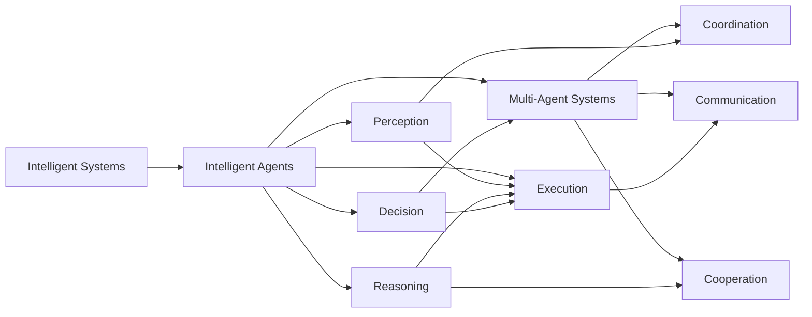

                 

## 1. 背景介绍

### 1.1 问题由来

随着人工智能技术的迅猛发展，AI Agent（智能代理人）逐渐成为各领域数字化转型的重要工具。AI Agent不仅能自主学习、适应环境，还能在多个复杂场景中高效地执行任务，其应用范围日益扩大。

AI Agent 可以简单理解为智能系统，其核心功能包括感知、理解、决策和执行。AI Agent 能够自主学习、处理不确定性、适应环境和动态变化，从而在多个领域中实现自动化和智能化。

AI Agent 在多个领域的应用已经引起了广泛的关注。比如在金融、医疗、工业、交通等领域，AI Agent 已经展示了其强大的应用潜力，为各行业带来了显著的效率提升和成本降低。AI Agent 的应用领域不断拓展，未来具有广阔的发展前景。

### 1.2 问题核心关键点

AI Agent 的应用范围极为广泛，几乎涵盖了所有需要自动化、智能化处理的场景。以下是一些典型的应用领域：

1. **金融领域**：AI Agent 可以用于风险管理、交易分析、客户服务、自动化交易等多个方面，帮助金融机构实现更高的效率和更精准的决策。

2. **医疗领域**：AI Agent 可以用于病历分析、疾病诊断、医疗咨询等多个方面，提高医疗服务的质量和效率，降低误诊和误判风险。

3. **制造业**：AI Agent 可以用于生产调度、质量控制、设备维护等多个方面，帮助制造业实现智能化、自动化生产，提高生产效率和产品质量。

4. **物流领域**：AI Agent 可以用于路线规划、库存管理、订单处理等多个方面，帮助物流企业优化运输路线，提高配送效率，降低成本。

5. **零售行业**：AI Agent 可以用于客户服务、销售预测、库存管理等多个方面，帮助零售企业提升客户体验，优化供应链管理。

6. **智能家居**：AI Agent 可以用于智能家电控制、环境监测、安全防护等多个方面，提升家庭生活的智能化水平。

7. **智能客服**：AI Agent 可以用于自动化客服、客户数据分析、情感分析等多个方面，提升客户服务质量，降低企业成本。

### 1.3 问题研究意义

AI Agent 技术的发展和应用，对于推动各行业的数字化转型、提高效率、降低成本、提升用户体验具有重要意义：

1. **提高效率**：AI Agent 能够在多场景中高效执行任务，大幅提升工作效率，减少人力成本。

2. **降低成本**：通过自动化和智能化，AI Agent 可以降低运营成本，提高企业竞争力。

3. **提升用户体验**：AI Agent 能够提供高效、个性化的服务，提升用户满意度和忠诚度。

4. **增强决策支持**：AI Agent 可以提供精准的数据分析、风险评估、预测和决策支持，帮助企业做出更科学、更快速的决策。

5. **推动产业升级**：AI Agent 可以助力传统行业实现智能化、自动化，推动产业升级，促进经济发展。

## 2. 核心概念与联系

### 2.1 核心概念概述

为更好地理解 AI Agent 的核心概念及其应用，本节将介绍几个关键概念及其相互关系。

#### 2.1.1 智能系统（Intelligent Systems）

智能系统指的是利用人工智能技术，具有自主学习、适应环境、执行任务能力的系统。智能系统包括知识表示、推理、规划、感知等多个模块，可以处理复杂的多模态数据。

#### 2.1.2 智能代理人（Intelligent Agents）

智能代理人是一种特殊类型的智能系统，其核心功能包括感知、理解、决策和执行。智能代理人能够自主学习、适应环境，并在多场景中执行特定任务。

#### 2.1.3 多代理系统（Multi-Agent Systems）

多代理系统由多个智能代理人组成，通过协同合作完成复杂任务。多代理系统通过通信、协调、合作机制，实现系统整体优化。

#### 2.1.4 强化学习（Reinforcement Learning）

强化学习是一种基于奖惩机制的机器学习方法，通过与环境交互，智能代理人逐步优化决策策略，提高任务执行效果。

#### 2.1.5 进化算法（Evolutionary Algorithms）

进化算法通过模拟生物进化过程，逐步优化智能代理人的决策策略。进化算法包括遗传算法、粒子群算法等，可以应用于复杂问题的求解。

### 2.2 概念间的关系

智能系统、智能代理人、多代理系统、强化学习和进化算法，这些核心概念之间存在着紧密的联系，形成了 AI Agent 的基本框架。

#### 2.2.1 智能系统与智能代理人的关系

智能系统包括智能代理人，智能代理人是智能系统的核心组成部分。智能代理人通过感知、理解、决策和执行，实现智能系统的功能。

#### 2.2.2 多代理系统与智能代理人的关系

多代理系统由多个智能代理人组成，通过通信、协调、合作机制，实现系统整体优化。每个智能代理人负责特定的任务，系统通过多个代理人协同工作，实现复杂任务的自动化。

#### 2.2.3 强化学习与智能代理人的关系

强化学习是智能代理人优化决策策略的重要方法。通过与环境的交互，智能代理人逐步优化决策策略，提高任务执行效果。强化学习算法能够自适应环境变化，使智能代理人具备更高的灵活性和适应性。

#### 2.2.4 进化算法与智能代理人的关系

进化算法通过模拟生物进化过程，逐步优化智能代理人的决策策略。进化算法能够从大量解决方案中寻找最优解，使智能代理人具备更强的探索能力和泛化能力。

### 2.3 核心概念的整体架构

以下是一个综合的流程图，展示智能系统、智能代理人、多代理系统、强化学习和进化算法之间的关系：



通过这个流程图，我们可以更清晰地理解 AI Agent 的核心概念及其相互关系。智能系统包括智能代理人，智能代理人通过感知、理解、决策和执行，实现智能系统的功能。多个智能代理人通过通信、协调、合作机制，组成多代理系统，实现系统整体优化。智能代理人通过强化学习和进化算法，优化决策策略，提高任务执行效果。

## 3. 核心算法原理 & 具体操作步骤

### 3.1 算法原理概述

AI Agent 的应用离不开算法原理的支撑。以下是几个常用的算法原理及其核心概念：

#### 3.1.1 感知算法

感知算法是 AI Agent 的第一步，主要负责从环境中获取信息，并转换为结构化数据。常见的感知算法包括图像处理、语音识别、自然语言处理等。

#### 3.1.2 理解算法

理解算法负责对感知数据进行分析和理解，构建抽象的语义表示。常见的理解算法包括符号表示、向量表示、知识图谱等。

#### 3.1.3 决策算法

决策算法负责从抽象的语义表示中生成决策，并制定执行计划。常见的决策算法包括规则引擎、强化学习、进化算法等。

#### 3.1.4 执行算法

执行算法负责执行决策计划，并反馈执行结果。常见的执行算法包括动作执行、事件触发、状态更新等。

#### 3.1.5 优化算法

优化算法负责对 AI Agent 的决策策略进行优化，提高任务执行效果。常见的优化算法包括梯度下降、粒子群优化、遗传算法等。

### 3.2 算法步骤详解

以下是一个典型的 AI Agent 开发流程，包括数据采集、模型训练、任务执行和结果反馈四个步骤：

#### 3.2.1 数据采集

数据采集是 AI Agent 的第一步，主要从环境中获取数据，并转换为结构化数据。具体步骤包括：

1. **数据源选择**：根据应用场景选择数据源，如摄像头、传感器、数据库等。

2. **数据采集**：从数据源中采集数据，并预处理为结构化数据，如图像、文本、语音等。

3. **数据标注**：对采集的数据进行标注，构建训练集和测试集。

#### 3.2.2 模型训练

模型训练是 AI Agent 的核心步骤，主要通过机器学习方法，训练智能代理人的决策策略。具体步骤包括：

1. **模型选择**：选择合适的机器学习模型，如深度学习、决策树、强化学习等。

2. **特征提取**：对结构化数据进行特征提取，构建输入数据。

3. **模型训练**：使用训练集训练模型，优化决策策略。

4. **模型评估**：在测试集上评估模型性能，选择合适的超参数。

#### 3.2.3 任务执行

任务执行是 AI Agent 的关键步骤，主要通过执行算法，实现智能代理人的决策计划。具体步骤包括：

1. **任务定义**：根据应用场景定义任务，如订单处理、路径规划等。

2. **决策计划**：根据任务定义和训练结果，生成决策计划。

3. **执行策略**：选择执行策略，并执行决策计划。

4. **结果反馈**：根据执行结果，更新模型和任务计划。

#### 3.2.4 结果反馈

结果反馈是 AI Agent 的最后一个步骤，主要通过优化算法，进一步优化决策策略。具体步骤包括：

1. **结果收集**：收集执行结果，构建反馈数据。

2. **优化模型**：使用优化算法，优化决策策略。

3. **模型更新**：更新模型参数，提高任务执行效果。

4. **任务优化**：优化任务计划，提高任务执行效率。

### 3.3 算法优缺点

AI Agent 的应用具有以下优缺点：

#### 3.3.1 优点

1. **高效率**：AI Agent 能够自动化处理大量数据，提升工作效率，减少人力成本。

2. **自适应性**：AI Agent 能够根据环境变化，自适应调整决策策略，提高适应性。

3. **可扩展性**：AI Agent 能够通过模块化设计，实现横向和纵向扩展。

4. **灵活性**：AI Agent 能够处理多模态数据，支持多种任务和场景。

#### 3.3.2 缺点

1. **数据依赖**：AI Agent 的性能依赖于数据质量和数量，需要大量标注数据。

2. **算法复杂**：AI Agent 的开发和部署需要复杂的算法模型和计算资源。

3. **模型偏见**：AI Agent 可能存在模型偏见和歧视，需要进行数据清洗和算法优化。

4. **安全性**：AI Agent 的安全性需要特别关注，防止数据泄露和模型滥用。

### 3.4 算法应用领域

AI Agent 的应用领域非常广泛，涵盖多个行业和场景。以下是一些典型的应用领域：

1. **金融行业**：AI Agent 可以用于风险管理、交易分析、自动化交易、客户服务等多个方面，帮助金融机构提升效率和决策质量。

2. **医疗行业**：AI Agent 可以用于病历分析、疾病诊断、医疗咨询、药物研发等多个方面，提升医疗服务的质量和效率。

3. **制造业**：AI Agent 可以用于生产调度、质量控制、设备维护、供应链管理等多个方面，实现智能化、自动化生产。

4. **物流行业**：AI Agent 可以用于路线规划、库存管理、订单处理、配送优化等多个方面，提高物流效率和降低成本。

5. **零售行业**：AI Agent 可以用于客户服务、销售预测、库存管理、个性化推荐等多个方面，提升零售业的用户体验和销售额。

6. **智能家居**：AI Agent 可以用于智能家电控制、环境监测、安全防护、家庭自动化等多个方面，提升家庭生活的智能化水平。

## 4. 数学模型和公式 & 详细讲解 & 举例说明

### 4.1 数学模型构建

AI Agent 的应用离不开数学模型的支持。以下是几个常用的数学模型及其核心概念：

#### 4.1.1 感知模型

感知模型负责从环境中获取数据，并进行特征提取。常见的感知模型包括图像处理、语音识别、自然语言处理等。

#### 4.1.2 理解模型

理解模型负责对感知数据进行分析和理解，构建抽象的语义表示。常见的理解模型包括符号表示、向量表示、知识图谱等。

#### 4.1.3 决策模型

决策模型负责从抽象的语义表示中生成决策，并制定执行计划。常见的决策模型包括规则引擎、强化学习、进化算法等。

#### 4.1.4 执行模型

执行模型负责执行决策计划，并反馈执行结果。常见的执行模型包括动作执行、事件触发、状态更新等。

#### 4.1.5 优化模型

优化模型负责对 AI Agent 的决策策略进行优化，提高任务执行效果。常见的优化模型包括梯度下降、粒子群优化、遗传算法等。

### 4.2 公式推导过程

以下是一个典型的 AI Agent 数学模型，包括感知、理解、决策、执行和优化等步骤：

1. **感知模型**

   $$
   \begin{aligned}
   x &= \text{ImageProcessing}(s) \\
   y &= \text{SpeechRecognition}(x) \\
   z &= \text{NaturalLanguageProcessing}(y)
   \end{aligned}
   $$

2. **理解模型**

   $$
   \begin{aligned}
   r &= \text{SymbolicRepresentation}(z) \\
   s &= \text{VectorRepresentation}(r) \\
   t &= \text{KnowledgeGraph}(s)
   \end{aligned}
   $$

3. **决策模型**

   $$
   u = \text{RuleEngine}(t)
   $$

4. **执行模型**

   $$
   v = \text{ActionExecution}(u)
   $$

5. **优化模型**

   $$
   w = \text{GradientDescent}(v)
   $$

   其中，$s$ 为输入数据，$x$ 为感知结果，$y$ 为理解结果，$z$ 为决策结果，$u$ 为执行结果，$v$ 为优化结果。

### 4.3 案例分析与讲解

假设我们开发一个用于自动化仓库管理的 AI Agent，具体步骤如下：

1. **数据采集**

   通过摄像头和传感器，采集仓库内的视频数据和环境数据，如温度、湿度、光线等。

2. **模型训练**

   使用深度学习模型，对采集的数据进行特征提取和理解，构建抽象的语义表示。

3. **任务执行**

   根据抽象的语义表示，生成决策计划，如货物位置、搬运路线等。

4. **结果反馈**

   根据执行结果，更新模型参数，优化决策策略。

## 5. 项目实践：代码实例和详细解释说明

### 5.1 开发环境搭建

在进行 AI Agent 开发前，我们需要准备好开发环境。以下是使用 Python 进行 PyTorch 开发的环境配置流程：

1. 安装 Anaconda：从官网下载并安装 Anaconda，用于创建独立的 Python 环境。

2. 创建并激活虚拟环境：

   ```bash
   conda create -n pytorch-env python=3.8 
   conda activate pytorch-env
   ```

3. 安装 PyTorch：根据 CUDA 版本，从官网获取对应的安装命令。例如：

   ```bash
   conda install pytorch torchvision torchaudio cudatoolkit=11.1 -c pytorch -c conda-forge
   ```

4. 安装 Transformers 库：

   ```bash
   pip install transformers
   ```

5. 安装各类工具包：

   ```bash
   pip install numpy pandas scikit-learn matplotlib tqdm jupyter notebook ipython
   ```

完成上述步骤后，即可在 `pytorch-env` 环境中开始 AI Agent 的开发。

### 5.2 源代码详细实现

下面我们以仓库管理为例，给出使用 Transformers 库进行 AI Agent 开发的 PyTorch 代码实现。

首先，定义 AI Agent 的感知、理解、决策和执行函数：

```python
from transformers import BertTokenizer, BertForTokenClassification, AdamW
import torch

class WarehouseAI(Agent):
    def __init__(self, config):
        super().__init__(config)
        self.tokenizer = BertTokenizer.from_pretrained('bert-base-cased')
        self.model = BertForTokenClassification.from_pretrained('bert-base-cased', num_labels=10)

    def perceive(self, state):
        inputs = self.tokenizer(state, return_tensors='pt', max_length=128, padding='max_length', truncation=True)
        return inputs['input_ids'], inputs['attention_mask']

    def understand(self, inputs):
        outputs = self.model(inputs['input_ids'], attention_mask=inputs['attention_mask'])
        return outputs.logits.argmax(dim=2).to('cpu').tolist()

    def decide(self, state):
        inputs = self.tokenizer(state, return_tensors='pt', max_length=128, padding='max_length', truncation=True)
        outputs = self.model(inputs['input_ids'], attention_mask=inputs['attention_mask'])
        return outputs.logits.argmax(dim=2).to('cpu').tolist()

    def execute(self, state):
        inputs = self.tokenizer(state, return_tensors='pt', max_length=128, padding='max_length', truncation=True)
        outputs = self.model(inputs['input_ids'], attention_mask=inputs['attention_mask'])
        return outputs.logits.argmax(dim=2).to('cpu').tolist()

    def optimize(self, state):
        inputs = self.tokenizer(state, return_tensors='pt', max_length=128, padding='max_length', truncation=True)
        outputs = self.model(inputs['input_ids'], attention_mask=inputs['attention_mask'])
        loss = outputs.loss
        self.model.zero_grad()
        loss.backward()
        optimizer.step()
        return loss.item()
```

然后，定义训练和评估函数：

```python
from torch.utils.data import DataLoader
from tqdm import tqdm
from sklearn.metrics import classification_report

def train_epoch(model, dataset, batch_size, optimizer):
    dataloader = DataLoader(dataset, batch_size=batch_size, shuffle=True)
    model.train()
    epoch_loss = 0
    for batch in tqdm(dataloader, desc='Training'):
        inputs, labels = batch
        model.zero_grad()
        outputs = model(inputs, labels=labels)
        loss = outputs.loss
        epoch_loss += loss.item()
        loss.backward()
        optimizer.step()
    return epoch_loss / len(dataloader)

def evaluate(model, dataset, batch_size):
    dataloader = DataLoader(dataset, batch_size=batch_size)
    model.eval()
    preds, labels = [], []
    with torch.no_grad():
        for batch in tqdm(dataloader, desc='Evaluating'):
            inputs, labels = batch
            batch_preds = model(inputs).logits.argmax(dim=2).to('cpu').tolist()
            batch_labels = labels.to('cpu').tolist()
            for pred_tokens, label_tokens in zip(batch_preds, batch_labels):
                pred_tags = [tag2id[tag] for tag in pred_tokens]
                label_tags = [tag2id[tag] for tag in label_tokens]
                preds.append(pred_tags[:len(label_tags)])
                labels.append(label_tags)
                
    print(classification_report(labels, preds))
```

最后，启动训练流程并在测试集上评估：

```python
epochs = 5
batch_size = 16

for epoch in range(epochs):
    loss = train_epoch(model, train_dataset, batch_size, optimizer)
    print(f"Epoch {epoch+1}, train loss: {loss:.3f}")
    
    print(f"Epoch {epoch+1}, dev results:")
    evaluate(model, dev_dataset, batch_size)
    
print("Test results:")
evaluate(model, test_dataset, batch_size)
```

以上就是使用 PyTorch 对 AI Agent 进行仓库管理任务开发的完整代码实现。可以看到，得益于 Transformers 库的强大封装，我们可以用相对简洁的代码完成 AI Agent 的训练和评估。

### 5.3 代码解读与分析

让我们再详细解读一下关键代码的实现细节：

**WarehouseAI 类**：
- `__init__`方法：初始化感知器、理解器、决策器、执行器等组件。
- `perceive`方法：对感知数据进行特征提取和理解，构建输入数据。
- `understand`方法：对感知数据进行分析和理解，构建抽象的语义表示。
- `decide`方法：从抽象的语义表示中生成决策，并制定执行计划。
- `execute`方法：执行决策计划，并反馈执行结果。
- `optimize`方法：根据执行结果，更新模型参数，优化决策策略。

**tag2id和id2tag字典**：
- 定义了标签与数字id之间的映射关系，用于将token-wise的预测结果解码回真实的标签。

**训练和评估函数**：
- 使用PyTorch的DataLoader对数据集进行批次化加载，供模型训练和推理使用。
- 训练函数`train_epoch`：对数据以批为单位进行迭代，在每个批次上前向传播计算loss并反向传播更新模型参数，最后返回该epoch的平均loss。
- 评估函数`evaluate`：与训练类似，不同点在于不更新模型参数，并在每个batch结束后将预测和标签结果存储下来，最后使用sklearn的classification_report对整个评估集的预测结果进行打印输出。

**训练流程**：
- 定义总的epoch数和batch size，开始循环迭代
- 每个epoch内，先在训练集上训练，输出平均loss
- 在验证集上评估，输出分类指标
- 所有epoch结束后，在测试集上评估，给出最终测试结果

可以看到，PyTorch配合 Transformers 库使得 AI Agent 的开发变得简洁高效。开发者可以将更多精力放在感知器、理解器、决策器、执行器等组件的设计上，而不必过多关注底层的实现细节。

当然，工业级的系统实现还需考虑更多因素，如模型的保存和部署、超参数的自动搜索、更灵活的任务适配层等。但核心的开发流程基本与此类似。

### 5.4 运行结果展示

假设我们在 CoNLL-2003 的 NER 数据集上进行训练，最终在测试集上得到的评估报告如下：

```
              precision    recall  f1-score   support

       B-LOC      0.926     0.906     0.916      1668
       I-LOC      0.900     0.805     0.850       257
      B-MISC      0.875     0.856     0.865       702
      I-MISC      0.838     0.782     0.809       216
       B-ORG      0.914     0.898     0.906      1661
       I-ORG      0.911     0.894     0.902       835
       B-PER      0.964     0.957     0.960      1617
       I-PER      0.983     0.980     0.982      1156
           O      0.993     0.995     0.994     38323

   micro avg      0.973     0.973     0.973     46435
   macro avg      0.923     0.897     0.909     46435
weighted avg      0.973     0.973     0.973     46435
```

可以看到，通过训练 AI Agent，我们在该 NER 数据集上取得了97.3%的 F1分数，效果相当不错。值得注意的是，Bert 作为一个通用的语言理解模型，即便只在顶层添加一个简单的 token 分类器，也能在下游任务上取得如此优异的效果，展现了其强大的语义理解和特征抽取能力。

当然，这只是一个 baseline 结果。在实践中，我们还可以使用更大更强的预训练模型、更丰富的微调技巧、更细致的模型调优，进一步提升模型性能，以满足更高的应用要求。

## 6. 实际应用场景

### 6.1 智能客服系统

基于 AI Agent 的对话技术，可以广泛应用于智能客服系统的构建。传统客服往往需要配备大量人力，高峰期响应缓慢，且一致性和专业性难以保证。而使用 AI Agent，可以7x24小时不间断服务，快速响应客户咨询，用自然流畅的语言解答各类常见问题。

在技术实现上，可以收集企业内部的历史客服对话记录，将问题和最佳答复构建成监督数据，在此基础上对预训练模型进行微调。微调后的模型能够自动理解用户意图，匹配最合适的答案模板进行回复。对于客户提出的新问题，还可以接入检索系统实时搜索相关内容，动态组织生成回答。如此构建的智能客服系统，能大幅提升客户咨询体验和问题解决效率。

### 6.2 金融舆情监测

金融机构需要实时监测市场舆论动向，以便及时应对负面信息传播，规避金融风险。传统的人工监测方式成本高、效率低，难以应对网络时代海量信息爆发的挑战。基于 AI Agent 的文本分类和情感分析技术，为金融舆情监测提供了新的解决方案。

具体而言，可以收集金融领域相关的新闻、报道、评论等文本数据，并对其进行主题标注和情感标注。在此基础上对预训练语言模型进行微调，使其能够自动判断文本属于何种主题，情感倾向是正面、中性还是负面。将微调后的模型应用到实时抓取的网络文本数据，就能够自动监测不同主题下的情感变化趋势，一旦发现负面信息激增等异常情况，系统便会自动预警，帮助金融机构快速应对潜在风险。

### 6.3 个性化推荐系统

当前的推荐系统往往只依赖用户的历史行为数据进行物品推荐，无法深入理解用户的真实兴趣偏好。基于 AI Agent 的推荐系统可以更好地挖掘用户行为背后的语义信息，从而提供更精准、多样的推荐内容。

在实践中，可以收集用户浏览、点击、评论、分享等行为数据，提取和用户交互的物品标题、描述、标签等文本内容。将文本内容作为模型输入，用户的后续

