                 

# AI Bias原理与代码实例讲解

## 1. 背景介绍

### 1.1 问题由来
人工智能(AI)技术在快速发展的同时，也逐渐暴露出一系列问题。其中，AI偏见(Bias)问题是近年来研究者高度关注的领域之一。AI偏见指的是由AI系统中的训练数据、算法和设计决策所导致的不公平和歧视现象。AI偏见不仅影响了AI系统的公平性，还可能导致严重的社会不公和伦理问题。

具体来说，AI偏见可能出现在以下几个方面：
- **数据偏见**：训练数据集可能包含历史偏见，导致模型偏向某些特定群体或特征。
- **算法偏见**：AI算法的设计和实现过程中，可能有意或无意地引入偏见。
- **设计偏见**：AI系统的设计和接口设计，可能存在某种程度上的偏见和歧视。

例如，在面部识别、信用评分、招聘系统等应用中，AI偏见问题都被反复提及和讨论。这些问题不仅影响了系统的公平性，还对社会造成了深远的影响。

### 1.2 问题核心关键点
为了有效理解和解决AI偏见问题，我们需要对以下关键点进行深入研究：
- **数据集质量**：如何确保训练数据集的代表性、多样性和无偏见性？
- **算法鲁棒性**：如何构建鲁棒性强的AI算法，避免偏见在输出中累积？
- **模型透明性**：如何设计透明的AI模型，便于理解和分析其决策过程？
- **算法伦理**：如何建立和维护AI算法的伦理准则，避免潜在的负面影响？

本文聚焦于AI偏见问题的原理和代码实例讲解，通过理论基础和实际应用，探讨如何解决AI偏见问题，为AI技术的公平、透明和伦理应用提供指导。

## 2. 核心概念与联系

### 2.1 核心概念概述

为了更好地理解AI偏见问题，我们首先需要了解几个核心概念：

- **AI偏见**：指由于数据集、算法和系统设计决策而引入的不公平和歧视现象。
- **数据集偏见**：训练数据集中存在的系统性偏见，可能导致模型在预测过程中偏袒某些群体或特征。
- **算法偏见**：算法设计和实现过程中的偏见，可能导致模型输出存在系统性歧视。
- **透明性**：指AI模型的决策过程能够被理解、分析和解释，以便发现和纠正偏见。
- **鲁棒性**：指AI模型在面对不同的数据分布和条件变化时，能够稳定输出，避免偏见放大。
- **伦理准则**：指在AI系统的设计、开发和应用过程中，需要遵守的伦理原则和规范。

这些概念之间的联系可以通过以下Mermaid流程图来展示：

```mermaid
graph TB
    A[AI偏见] --> B[数据集偏见]
    A --> C[算法偏见]
    A --> D[透明性]
    A --> E[鲁棒性]
    A --> F[伦理准则]
    B --> G[系统性偏见]
    C --> H[设计偏见]
    D --> I[可解释性]
    E --> J[稳定输出]
    F --> K[伦理规范]
```



这个流程图展示了大语言模型微调过程中各个核心概念之间的关系：

1. AI偏见是整个问题的核心，涉及数据集偏见、算法偏见、透明性、鲁棒性和伦理准则等诸多方面。
2. 数据集偏见指数据集中存在的系统性偏见，可能导致模型预测过程中的系统性歧视。
3. 算法偏见指算法设计和实现过程中的偏见，可能导致模型输出存在系统性歧视。
4. 透明性指模型决策过程的可解释性和可分析性，便于发现和纠正偏见。
5. 鲁棒性指模型在面对不同数据分布和条件变化时，能够稳定输出，避免偏见放大。
6. 伦理准则指在AI系统设计、开发和应用过程中需要遵守的伦理规范，避免潜在的负面影响。

### 2.2 概念间的关系

这些核心概念之间存在紧密的联系，共同构成了解决AI偏见问题的基础框架。下面我们通过几个Mermaid流程图来展示这些概念之间的关系。

#### 2.2.1 AI偏见的生成与发现


这个流程图展示了AI偏见生成的过程。首先，训练数据集中存在系统性偏见，被算法学习并引入AI模型中，产生AI偏见。通过透明性和鲁棒性分析，可以发现和纠正模型中的偏见。同时，遵循伦理准则，设计和使用AI系统，避免潜在的负面影响。

#### 2.2.2 数据集偏见的影响


这个流程图展示了数据集偏见对AI模型的影响。数据集中的系统性偏见被算法学习并引入模型中，导致模型输出存在系统性歧视。这种歧视可能影响AI系统在实际应用中的公平性和准确性。

#### 2.2.3 算法偏见的产生机制


这个流程图展示了算法偏见对AI模型的影响。算法设计和实现过程中的偏见，可能导致模型输出存在系统性歧视。这种歧视可能影响AI系统在实际应用中的公平性和准确性。

#### 2.2.4 透明性与鲁棒性的重要性


这个流程图展示了透明性和鲁棒性在发现和纠正AI偏见中的重要性。透明性帮助我们对模型进行解释和分析，发现其中的偏见。鲁棒性则确保模型在面对不同数据分布和条件变化时，能够稳定输出，避免偏见放大。

#### 2.2.5 伦理准则的必要性


这个流程图展示了伦理准则在AI系统设计、开发和应用中的必要性。伦理准则确保AI系统在设计和应用过程中遵循公平原则，避免潜在的偏见和歧视，减少对社会的负面影响。

### 2.3 核心概念的整体架构

最后，我们用一个综合的流程图来展示这些核心概念在大语言模型偏见的生成、发现和纠正过程中的整体架构：


这个综合流程图展示了从预训练到微调，再到偏见纠正的完整过程。大语言模型首先在大规模文本数据上进行预训练，然后通过微调获取特定任务的性能，最后通过透明性分析发现和纠正模型中的偏见，确保公平应用，减少对社会的负面影响。

## 3. 核心算法原理 & 具体操作步骤
### 3.1 算法原理概述

解决AI偏见问题，核心在于对数据集、算法和模型设计进行全面审视和优化。本节将从这些方面入手，详细讲解AI偏见的生成原理和解决方法。

**数据集偏见生成**：
- **数据选择偏差**：训练数据集的偏差选择可能引入系统性偏见。例如，只使用某一年龄、性别、种族的样本，可能导致模型在预测过程中偏袒这些群体。
- **数据标注偏差**：标注数据过程中的人为错误可能导致标注偏差，从而影响模型的公平性。

**算法偏见生成**：
- **算法设计偏见**：算法设计中存在的偏见可能导致模型输出存在系统性歧视。例如，某些算法倾向于偏向某些特征，导致模型在预测过程中偏袒这些特征。
- **特征选择偏差**：算法中的特征选择偏见可能导致模型在预测过程中只考虑特定特征，忽略其他特征。

**模型偏见生成**：
- **训练数据偏见**：训练数据中的系统性偏见可能被模型学习并引入预测过程中，导致系统性歧视。
- **模型设计偏见**：模型设计过程中存在的偏见可能导致模型输出存在系统性歧视。

**解决偏见的方法**：
- **数据集平衡**：通过调整数据集，确保不同群体和特征的代表性。例如，使用重采样、合成数据等方法，平衡数据集。
- **算法鲁棒性**：构建鲁棒性强的算法，确保模型在面对不同数据分布和条件变化时，能够稳定输出，避免偏见放大。
- **透明性分析**：通过透明性分析，发现和纠正模型中的偏见。例如，使用可解释性模型，分析模型的决策过程。
- **伦理准则**：在AI系统的设计、开发和应用过程中，遵循伦理准则，避免潜在的负面影响。

### 3.2 算法步骤详解

解决AI偏见问题，一般包括以下几个关键步骤：

**Step 1: 数据集收集与预处理**
- 收集具有代表性的数据集，确保不同群体和特征的代表性。
- 对数据集进行预处理，如数据清洗、归一化等，确保数据集的质量。

**Step 2: 数据分析与平衡**
- 对数据集进行分析，识别存在的偏见。
- 使用重采样、合成数据等方法，平衡数据集。例如，使用SMOTE算法生成合成数据，平衡少数群体数据。

**Step 3: 模型设计与选择**
- 选择合适的模型，如决策树、神经网络等。
- 在设计模型时，遵循公平原则，避免潜在的偏见。

**Step 4: 模型训练与验证**
- 在训练模型时，使用平衡的数据集。
- 使用交叉验证等方法，评估模型的性能和公平性。

**Step 5: 透明性分析与优化**
- 使用透明性分析方法，如LIME、SHAP等，分析模型的决策过程。
- 发现模型中的偏见，并进行优化。例如，通过调整模型参数，减少模型中的偏见。

**Step 6: 鲁棒性测试与评估**
- 使用鲁棒性测试方法，如对抗样本测试、鲁棒性评估等，评估模型的鲁棒性。
- 发现模型中的鲁棒性不足，并进行优化。例如，使用对抗训练等方法，增强模型的鲁棒性。

**Step 7: 伦理审查与优化**
- 在模型应用过程中，进行伦理审查，确保模型的公平性和安全性。
- 根据伦理审查结果，进行模型优化。例如，去除模型中的有害特征，确保模型输出的公平性。

以上是解决AI偏见问题的完整步骤，每个步骤都需要根据具体任务和数据特点进行优化和调整。

### 3.3 算法优缺点

解决AI偏见问题的方法，具有以下优点和缺点：

**优点**：
- **提高模型公平性**：通过平衡数据集、优化模型设计和训练过程，可以提高模型的公平性和准确性。
- **增强模型鲁棒性**：通过透明性分析和鲁棒性测试，可以增强模型的鲁棒性，减少偏见放大。
- **确保模型伦理**：通过伦理审查和优化，确保模型在应用过程中遵循伦理准则，避免潜在的负面影响。

**缺点**：
- **数据收集难度大**：平衡数据集需要收集具有代表性的数据，可能面临数据收集难度大的问题。
- **算法复杂度高**：解决偏见问题需要设计复杂算法，可能增加开发和维护成本。
- **模型优化困难**：发现和纠正模型中的偏见可能需要大量实验和调整，可能耗费大量时间和资源。

尽管存在这些缺点，但解决AI偏见问题的方法对于确保AI系统的公平、透明和伦理应用具有重要意义。未来，随着技术和资源的不断积累，解决AI偏见问题的方法将更加高效和可靠。

### 3.4 算法应用领域

解决AI偏见问题的方法，已经被广泛应用于多个领域，例如：

- **医疗健康**：使用AI技术进行疾病诊断和治疗方案推荐时，确保数据集和模型的公平性，避免潜在的偏见和歧视。
- **金融服务**：使用AI技术进行信用评分和风险评估时，确保数据集和模型的公平性，避免潜在的偏见和歧视。
- **就业招聘**：使用AI技术进行简历筛选和面试推荐时，确保数据集和模型的公平性，避免潜在的偏见和歧视。
- **司法系统**：使用AI技术进行判决预测和案件分析时，确保数据集和模型的公平性，避免潜在的偏见和歧视。

这些领域中，AI偏见问题的影响尤为显著，解决这些问题的方法可以显著提高系统的公平性和可信度。

## 4. 数学模型和公式 & 详细讲解  
### 4.1 数学模型构建

为了更好地理解解决AI偏见问题的方法，我们将从数学角度对相关模型进行建模。

**数据集平衡模型**：
- **重采样方法**：如SMOTE算法，通过生成合成数据，平衡少数群体数据。
- **权重调整方法**：如Class Weighting，对少数群体样本进行加权，确保其在训练过程中受到重视。

**模型训练公平性**：
- **公平性指标**：如F1 Score、ROC-AUC等，评估模型的公平性。
- **公平性约束**：如Equalized Odds Constraint、Demographic Parity Constraint等，约束模型输出的公平性。

**透明性分析模型**：
- **可解释性模型**：如LIME、SHAP等，分析模型的决策过程。
- **特征重要性分析**：如Permutation Importance、SHAP Values等，分析模型的特征重要性。

**鲁棒性测试模型**：
- **对抗样本测试**：如FGSM、PGD等，生成对抗样本，测试模型的鲁棒性。
- **鲁棒性评估指标**：如Few-shot Learning、Zero-shot Learning等，评估模型的鲁棒性。

**伦理审查模型**：
- **伦理规范评估**：如Fairness Metrics、Ethical Metrics等，评估模型的伦理规范。
- **伦理约束优化**：如Constraint-based Optimization、Robust Optimization等，优化模型的伦理约束。

### 4.2 公式推导过程

以下我们将通过几个公式，展示解决AI偏见问题的方法。

**数据集平衡公式**：
- **SMOTE算法**：通过生成合成数据，平衡少数群体数据。
  $$
  X_{\text{synthetic}} = \Phi(X_{\text{original}})
  $$
  其中，$X_{\text{original}}$为原始数据集，$X_{\text{synthetic}}$为合成数据集，$\Phi$为生成合成数据的函数。

**权重调整公式**：
- **Class Weighting**：对少数群体样本进行加权，确保其在训练过程中受到重视。
  $$
  w_i = \frac{1}{\sum_{j=1}^n w_j} \frac{1}{\log(p_j)}
  $$
  其中，$w_i$为样本$i$的权重，$p_j$为类别$j$的样本比例。

**公平性约束公式**：
- **Equalized Odds Constraint**：确保模型在正负类别上的预测概率相等。
  $$
  \frac{\mathbb{E}[\hat{y}_i^+|\mathbf{x}]}{\mathbb{E}[\hat{y}_i^-|\mathbf{x}]} = \frac{p^+}{p^-}
  $$
  其中，$\hat{y}_i^+$为类别为正的预测概率，$\hat{y}_i^-$为类别为负的预测概率，$p^+$为正类别样本比例，$p^-$为负类别样本比例。

**透明性分析公式**：
- **LIME模型**：通过局部线性模型，解释模型的决策过程。
  $$
  f_{\text{lime}}(\mathbf{x}) = \sum_{i=1}^n \alpha_i g_i(\mathbf{x})
  $$
  其中，$f_{\text{lime}}(\mathbf{x})$为局部线性模型，$g_i(\mathbf{x})$为基函数，$\alpha_i$为基函数的权重。

**特征重要性公式**：
- **Permutation Importance**：通过特征置换，评估模型的特征重要性。
  $$
  I_j = \sum_{i=1}^n (y_i - \overline{y})^2
  $$
  其中，$I_j$为特征$j$的重要性，$y_i$为样本$i$的标签，$\overline{y}$为样本的平均标签。

**鲁棒性测试公式**：
- **对抗样本生成公式**：通过扰动输入，生成对抗样本。
  $$
  \mathbf{x}^* = \mathbf{x} + \epsilon \mathbf{n}
  $$
  其中，$\mathbf{x}^*$为对抗样本，$\mathbf{x}$为原始输入，$\epsilon$为扰动强度，$\mathbf{n}$为随机噪声。

**鲁棒性评估指标**：
- **Few-shot Learning**：在少量标注样本上，评估模型的性能。
  $$
  \text{Few-shot Score} = \frac{\sum_{i=1}^k \ell(f(\mathbf{x}_i), y_i)}{k}
  $$
  其中，$\ell$为损失函数，$\mathbf{x}_i$为训练样本，$y_i$为标签。

**伦理审查模型**：
- **伦理规范评估公式**：通过伦理规范评估指标，评估模型的伦理规范。
  $$
  \text{Ethical Score} = \sum_{i=1}^n f_i(\mathbf{x}_i)
  $$
  其中，$f_i(\mathbf{x}_i)$为模型对样本$i$的伦理评分。

**伦理约束优化公式**：
- **Constraint-based Optimization**：通过约束优化，优化模型的伦理约束。
  $$
  \min_{\theta} \ell(f_\theta(\mathbf{x}), y) \text{ s.t. } f_\theta(\mathbf{x}) \in \Omega
  $$
  其中，$\ell$为损失函数，$f_\theta(\mathbf{x})$为模型输出，$\Omega$为伦理约束集合。

### 4.3 案例分析与讲解

下面我们以一个具体的案例来分析解决AI偏见问题的方法。

**案例：金融信用评分系统**

金融信用评分系统常用于评估个人信用风险，预测贷款还款能力。但是，如果系统的训练数据中存在偏见，可能会导致系统在评分过程中对某些群体或特征存在歧视。

**数据集问题**：训练数据中只包含中高收入群体的信用记录，导致模型对低收入群体的评估偏差。

**算法设计问题**：算法的特征选择只考虑了收入、年龄等经济相关特征，忽略了教育、家庭背景等社会相关特征。

**透明性分析**：通过LIME模型，分析模型对不同特征的敏感度，发现模型对收入的依赖过强，对教育背景的依赖不足。

**鲁棒性测试**：通过对抗样本测试，生成对抗样本，发现模型在面对对抗样本时，评分结果容易变化。

**伦理审查**：通过伦理规范评估，发现模型存在对低收入群体的歧视。

**优化方案**：
- **数据集平衡**：通过重采样方法，平衡数据集，增加低收入群体的样本数量。
- **算法设计优化**：引入社会相关特征，如教育背景、家庭背景等，调整特征选择。
- **透明性分析**：使用SHAP模型，分析模型的特征重要性，优化模型参数。
- **鲁棒性测试**：引入对抗训练等方法，增强模型的鲁棒性。
- **伦理规范优化**：引入伦理约束，如Equalized Odds Constraint，确保模型的公平性。

通过这些优化措施，可以显著提高金融信用评分系统的公平性和可信度，减少对低收入群体的歧视。

## 5. 项目实践：代码实例和详细解释说明
### 5.1 开发环境搭建

在进行AI偏见问题解决实践前，我们需要准备好开发环境。以下是使用Python进行PyTorch开发的环境配置流程：

1. 安装Anaconda：从官网下载并安装Anaconda，用于创建独立的Python环境。

2. 创建并激活虚拟环境：
```bash
conda create -n pytorch-env python=3.8 
conda activate pytorch-env
```

3. 安装PyTorch：根据CUDA版本，从官网获取对应的安装命令。例如：
```bash
conda install pytorch torchvision torchaudio cudatoolkit=11.1 -c pytorch -c conda-forge
```

4. 安装各类工具包：
```bash
pip install numpy pandas scikit-learn matplotlib tqdm jupyter notebook ipython
```

完成上述步骤后，即可在`pytorch-env`环境中开始AI偏见问题解决的实践。

### 5.2 源代码详细实现

这里我们以解决金融信用评分系统中的AI偏见问题为例，给出使用PyTorch代码实现的过程。

首先，定义数据预处理函数：

```python
import pandas as pd
from sklearn.preprocessing import StandardScaler
from sklearn.model_selection import train_test_split
from sklearn.metrics import accuracy_score, precision_recall_fscore_support

def preprocess_data(train_df, test_df):
    train_X = train_df.drop('y', axis=1)
    train_y = train_df['y']
    test_X = test_df.drop('y', axis=1)
    test_y = test_df['y']
    
    # 数据标准化
    scaler = StandardScaler()
    train_X = scaler.fit_transform(train_X)
    test_X = scaler.transform(test_X)
    
    # 数据平衡
    train_X, train_y, val_X, val_y = train_test_split(train_X, train_y, test_size=0.1, stratify=train_y)
    
    return train_X, train_y, val_X, val_y, test_X, test_y
```

然后，定义模型训练和评估函数：

```python
from torch.utils.data import DataLoader
from torch.nn import CrossEntropyLoss
from torch.optim import Adam
from sklearn.metrics import confusion_matrix
import torch.nn.functional as F

class LogisticRegression(nn.Module):
    def __init__(self, input_dim):
        super(LogisticRegression, self).__init__()
        self.linear = nn.Linear(input_dim, 1)
    
    def forward(self, x):
        return torch.sigmoid(self.linear(x))

def train_model(model, train_X, train_y, val_X, val_y, epochs, batch_size):
    criterion = CrossEntropyLoss()
    optimizer = Adam(model.parameters(), lr=0.01)
    
    train_losses = []
    val_losses = []
    train_accuracies = []
    val_accuracies = []
    
    for epoch in range(epochs):
        for i, (inputs, labels) in enumerate(DataLoader(train_X, train_y, batch_size=batch_size)):
            optimizer.zero_grad()
            outputs = model(inputs)
            loss = criterion(outputs, labels)
            loss.backward()
            optimizer.step()
            
            if (i+1) % 100 == 0:
                val_outputs = model(val_X)
                val_loss = criterion(val_outputs, val_y)
                val_accuracy = accuracy_score(val_outputs.numpy(), val_y.numpy())
                train_losses.append(loss.item())
                val_losses.append(val_loss.item())
                train_accuracies.append(val_accuracy)
                val_accuracies.append(val_accuracy)
                print(f'Epoch {epoch+1}, Train Loss: {loss:.4f}, Val Loss: {val_loss:.4f}, Train Accuracy: {val_accuracy:.4f}, Val Accuracy: {val_accuracy:.4f}')
    
    return model, train_losses, val_losses, train_accuracies, val_accuracies

def evaluate_model(model, test_X, test_y):
    test_outputs = model(test_X)
    test_loss = criterion(test_outputs, test_y)
    test_accuracy = accuracy_score(test_outputs.numpy(), test_y.numpy())
    print(f'Test Loss: {test_loss:.4f}, Test Accuracy: {test_accuracy:.4f}')
    return test_loss, test_accuracy
```

接下来，定义透明性分析函数：

```python
import lime
from lime.lime_tabular import LimeTabularExplainer
from sklearn.preprocessing import MinMaxScaler

def lime_analysis(train_X, train_y, val_X, val_y, test_X, test_y):
    explainer = LimeTabularExplainer(train_X, categorical_features=[0, 1], class_names=['low', 'high'], feature_names=train_X.columns)
    
    for i, (inputs, labels) in enumerate(DataLoader(train_X, train_y, batch_size=1000)):
        if i % 100 == 0:
            print(f'LIME Analysis: {i+1}/{len(train_X)}')
            
        outputs = model(inputs)
        exp = explainer.explain_instance(inputs.numpy()[0], outputs.numpy()[0], num_features=train_X.shape[1])
        print(exp.as_list())
```

最后，启动训练流程并在测试集上评估：

```python
epochs = 100
batch_size = 128

# 加载数据集
train_df = pd.read_csv('train.csv')
test_df = pd.read_csv('test.csv')

train_X, train_y, val_X, val_y, test_X, test_y = preprocess_data(train_df, test_df)

# 训练模型
model = LogisticRegression(input_dim=train_X.shape[1])
model, train_losses, val_losses, train_accuracies, val_accuracies = train_model(model, train_X, train_y, val_X, val_y, epochs, batch_size)

# 透明性分析
lime_analysis(train_X, train_y, val_X, val_y

