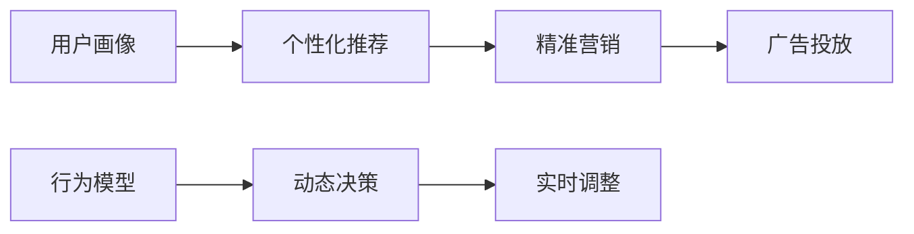
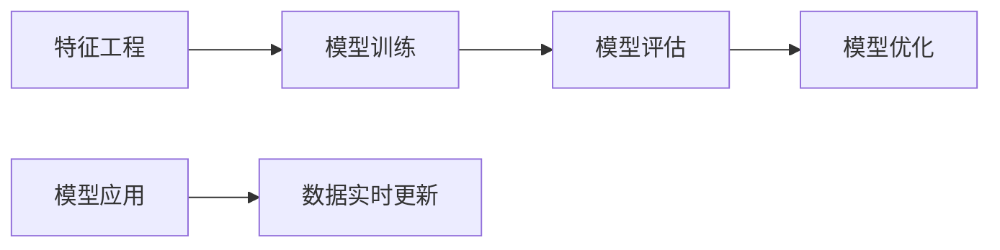
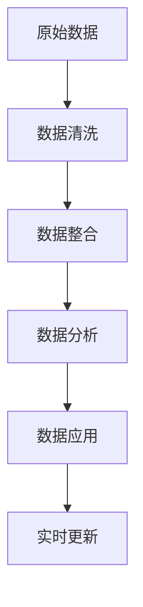

                 

# AI DMP 数据基建：现状与未来

## 1. 背景介绍

### 1.1 问题由来

在数据驱动的时代，数据作为企业的重要资产，日益成为不可或缺的战略资源。然而，如何高效利用数据，提升数据价值，已成为企业面临的重大挑战。传统的数据管理方法，如数据仓库、数据湖、OLTP等，虽然能够满足基本的数据存储和查询需求，但在数据整合、分析和应用方面存在着诸多不足。随着人工智能技术的兴起，企业对数据的管理需求也随之发生了根本性的变化，从简单的数据存储和查询，向数据的智能化、个性化、动态化方向转变。

在此背景下，数据驱动的营销平台（Data-Driven Marketing Platform，简称DMP）应运而生。DMP通过整合、分析和应用用户数据，帮助企业实现精准营销、客户画像、行为分析等功能，提升数据价值和营销效果。然而，传统的DMP往往难以处理大规模、高维度的数据，难以满足快速变化的市场需求。为此，人工智能驱动的数据管理平台（AI DMP）应运而生。AI DMP利用机器学习、深度学习等技术，提升数据处理的效率和效果，满足复杂多样的数据管理需求。

### 1.2 问题核心关键点

AI DMP的核心在于如何高效地整合、分析和管理大规模用户数据，提升数据驱动营销的效果。其主要关键点包括：

- 数据整合：将来自不同渠道（如网站、社交媒体、移动应用等）的用户数据进行高效整合，构建统一的数据视图。
- 数据清洗：去除噪声数据，修正数据缺失，提高数据质量。
- 数据分析：通过机器学习、深度学习等技术，挖掘数据中的有用信息，构建用户画像和行为模型。
- 数据应用：将分析结果应用于营销、推荐、广告投放等场景，提升业务效果。

AI DMP通过深度学习模型和大数据技术的结合，实现了对用户数据的深度分析，为营销决策提供了有力的支持。然而，AI DMP也面临着诸如数据隐私保护、模型鲁棒性、计算资源限制等诸多挑战，需要进一步的技术突破和优化。

### 1.3 问题研究意义

AI DMP作为人工智能与数据管理的结合体，对企业的数据管理和营销决策具有重要意义：

- 提升数据价值：通过深度学习模型对数据进行高效分析，挖掘数据中的潜在价值，提升数据驱动营销的效果。
- 个性化推荐：基于用户画像和行为模型，实现个性化的推荐和广告投放，提升用户体验和转化率。
- 客户洞察：通过分析用户数据，构建全面的客户画像，提升对客户的洞察力和理解度。
- 动态营销：基于实时数据，实现动态的营销决策，提升营销效率和效果。

因此，AI DMP技术的研究与应用，不仅有助于企业提升数据驱动营销的效果，还对数据管理和人工智能技术的发展具有重要推动作用。

## 2. 核心概念与联系

### 2.1 核心概念概述

AI DMP的核心概念主要包括数据整合、数据清洗、数据分析和数据应用等。这些概念之间相互联系，共同构成了AI DMP的核心架构。

- 数据整合：将不同来源的数据进行融合，构建统一的数据视图。
- 数据清洗：对数据进行去噪、修正、归一化等预处理，提高数据质量。
- 数据分析：通过机器学习、深度学习等技术，挖掘数据中的潜在价值，构建用户画像和行为模型。
- 数据应用：将分析结果应用于营销、推荐、广告投放等场景，提升业务效果。

这些概念之间的关系可以通过以下Mermaid流程图来展示：


通过这个流程图，我们可以更清晰地理解AI DMP的核心架构和数据流向。数据整合是基础，通过数据清洗和数据分析，最终实现数据的应用。

### 2.2 概念间的关系

这些核心概念之间存在着紧密的联系，形成了AI DMP的数据处理和管理生态系统。下面我们通过几个Mermaid流程图来展示这些概念之间的关系。

#### 2.2.1 数据处理流程


这个流程图展示了数据从原始数据到数据应用的全流程。原始数据经过数据清洗和整合，通过数据分析挖掘出有用的信息，最终应用于营销等场景。

#### 2.2.2 数据应用场景



这个流程图展示了数据应用场景的具体应用。通过用户画像和行为模型，实现个性化推荐和精准营销，同时通过实时调整，提升广告投放效果。

#### 2.2.3 数据分析方法



这个流程图展示了数据分析方法的流程。特征工程、模型训练、模型评估和模型优化，是数据分析方法的核心步骤。同时，模型应用也需要不断更新数据，以保持模型的有效性。

### 2.3 核心概念的整体架构

最后，我们用一个综合的流程图来展示这些核心概念在大数据管理平台中的整体架构：



这个综合流程图展示了数据从原始数据到实时更新的全流程。原始数据经过数据清洗和整合，通过数据分析挖掘出有用的信息，最终应用于营销等场景，并实时更新。

## 3. 核心算法原理 & 具体操作步骤

### 3.1 算法原理概述

AI DMP的数据管理流程，主要涉及以下几个步骤：

- 数据预处理：通过数据清洗、特征工程等技术，对原始数据进行预处理，提高数据质量。
- 数据整合：通过数据融合、数据对齐等技术，将不同来源的数据进行整合，构建统一的数据视图。
- 数据分析：通过机器学习、深度学习等技术，挖掘数据中的潜在价值，构建用户画像和行为模型。
- 数据应用：将分析结果应用于营销、推荐、广告投放等场景，提升业务效果。

### 3.2 算法步骤详解

#### 3.2.1 数据预处理

数据预处理是AI DMP的重要环节，主要包括以下几个步骤：

1. 数据清洗：去除噪声数据、修正数据缺失、归一化数据等，提高数据质量。
2. 特征工程：根据业务需求，选择合适的特征，并进行特征组合、转换等操作，提升数据的可用性。
3. 数据增强：通过数据增强技术，扩充数据集，提高模型的泛化能力。

数据清洗和特征工程主要通过编程语言（如Python）和相关库（如Pandas、Scikit-learn等）来实现。数据增强可以通过各种技术手段，如数据扩充、标签平滑等，提升数据的多样性和丰富性。

#### 3.2.2 数据整合

数据整合主要涉及以下几个步骤：

1. 数据对齐：将不同来源的数据进行对齐，消除数据异构性，构建统一的数据视图。
2. 数据融合：通过数据融合技术，将不同来源的数据进行融合，生成综合数据集。
3. 数据同步：实现数据的实时同步，保证数据的实时性和一致性。

数据对齐和数据融合主要通过编程语言（如Python）和相关库（如Presto、Apache Kafka等）来实现。数据同步可以通过各种技术手段，如消息队列、ETL等，保证数据的实时性和一致性。

#### 3.2.3 数据分析

数据分析是AI DMP的核心环节，主要包括以下几个步骤：

1. 数据建模：通过机器学习、深度学习等技术，构建用户画像和行为模型。
2. 模型训练：根据业务需求，选择合适的模型，并使用标注数据进行训练。
3. 模型评估：使用测试数据对模型进行评估，选择合适的模型。
4. 模型优化：根据评估结果，调整模型参数，提升模型效果。

数据建模和模型训练主要通过编程语言（如Python）和相关库（如TensorFlow、PyTorch等）来实现。模型评估和模型优化可以通过各种技术手段，如交叉验证、超参数调优等，提升模型效果。

#### 3.2.4 数据应用

数据应用主要涉及以下几个步骤：

1. 数据实时处理：通过流处理、批处理等技术，实现数据的实时处理。
2. 数据实时查询：使用实时查询技术，提升数据查询的效率和效果。
3. 数据实时展示：通过可视化技术，展示分析结果。

数据实时处理和数据实时查询主要通过编程语言（如Python）和相关库（如Apache Flink、Apache Storm等）来实现。数据实时展示可以通过各种技术手段，如可视化库（如D3.js、ECharts等），提升数据展示的效率和效果。

### 3.3 算法优缺点

AI DMP的优点包括：

1. 高效性：通过深度学习模型对数据进行高效分析，提升数据处理效率。
2. 实时性：实现数据的实时处理和查询，满足快速变化的市场需求。
3. 可扩展性：通过分布式计算技术，实现大规模数据的处理和管理。

然而，AI DMP也存在一些缺点：

1. 计算资源需求高：深度学习模型和大规模数据处理需要较高的计算资源，可能面临计算资源限制的问题。
2. 模型复杂度高：深度学习模型参数多、结构复杂，可能存在模型过拟合的问题。
3. 数据隐私保护：用户数据涉及隐私问题，需要采取有效的数据隐私保护措施。

### 3.4 算法应用领域

AI DMP在多个领域中具有广泛的应用，包括但不限于以下几个方面：

- 精准营销：基于用户画像和行为模型，实现个性化的推荐和广告投放。
- 客户洞察：通过分析用户数据，构建全面的客户画像，提升对客户的洞察力和理解度。
- 动态营销：基于实时数据，实现动态的营销决策，提升营销效率和效果。
- 风险控制：通过分析用户行为数据，实现风险预测和控制，提升金融风控能力。
- 推荐系统：基于用户行为数据，构建推荐模型，提升推荐效果和用户体验。

## 4. 数学模型和公式 & 详细讲解 & 举例说明

### 4.1 数学模型构建

AI DMP的数据分析主要涉及机器学习和深度学习技术。其中，深度学习模型在数据分析中应用广泛，主要用于用户画像和行为模型的构建。以下是深度学习模型的基本架构：

- 输入层：将原始数据转换为模型可接受的格式。
- 隐藏层：通过神经网络进行特征提取和转换，挖掘数据中的潜在价值。
- 输出层：根据业务需求，生成预测结果或分类结果。

### 4.2 公式推导过程

以用户画像构建为例，假设用户画像的模型为 $f(x)$，其中 $x$ 为用户的特征向量，$f$ 为深度学习模型。用户画像的构建过程可以表示为：

$$
y = f(x)
$$

其中 $y$ 为用户画像的向量表示。

以深度学习模型的损失函数为例，假设损失函数为均方误差损失（Mean Squared Error, MSE），则损失函数可以表示为：

$$
\mathcal{L} = \frac{1}{N}\sum_{i=1}^N (y_i - \hat{y_i})^2
$$

其中 $y_i$ 为真实标签，$\hat{y_i}$ 为模型的预测结果。

### 4.3 案例分析与讲解

假设某电商平台希望通过AI DMP构建用户画像，提升个性化推荐效果。具体步骤如下：

1. 数据预处理：收集用户行为数据（如浏览、购买、评价等），并进行数据清洗和特征工程，得到用户特征向量 $x$。
2. 数据整合：将用户数据进行整合，得到统一的数据视图。
3. 数据分析：通过深度学习模型对用户特征向量 $x$ 进行训练，得到用户画像 $y$。
4. 数据应用：根据用户画像 $y$，实现个性化推荐。

在模型训练过程中，可以使用交叉验证等技术进行超参数调优，提升模型效果。同时，可以通过A/B测试等方法评估模型效果，不断优化模型。

## 5. 项目实践：代码实例和详细解释说明

### 5.1 开发环境搭建

在进行AI DMP的开发实践前，需要准备好开发环境。以下是使用Python进行PyTorch开发的环境配置流程：

1. 安装Anaconda：从官网下载并安装Anaconda，用于创建独立的Python环境。

2. 创建并激活虚拟环境：
```bash
conda create -n pytorch-env python=3.8 
conda activate pytorch-env
```

3. 安装PyTorch：根据CUDA版本，从官网获取对应的安装命令。例如：
```bash
conda install pytorch torchvision torchaudio cudatoolkit=11.1 -c pytorch -c conda-forge
```

4. 安装相关库：
```bash
pip install pandas numpy scikit-learn torch
```

5. 安装可视化库：
```bash
pip install matplotlib seaborn
```

6. 安装可视化工具：
```bash
pip install plotly
```

完成上述步骤后，即可在`pytorch-env`环境中开始AI DMP的开发实践。

### 5.2 源代码详细实现

以下是使用PyTorch实现用户画像构建的代码示例：

```python
import torch
import torch.nn as nn
import torch.optim as optim
from torch.utils.data import DataLoader
import pandas as pd
import numpy as np

# 数据预处理
def preprocess_data(data_path):
    data = pd.read_csv(data_path)
    features = data[['age', 'gender', 'income']]
    labels = data['interests']
    return features, labels

# 模型构建
class UserProfil(nn.Module):
    def __init__(self):
        super(UserProfil, self).__init__()
        self.fc1 = nn.Linear(3, 64)
        self.fc2 = nn.Linear(64, 32)
        self.fc3 = nn.Linear(32, 8)
        
    def forward(self, x):
        x = self.fc1(x)
        x = nn.ReLU()(x)
        x = self.fc2(x)
        x = nn.ReLU()(x)
        x = self.fc3(x)
        return x

# 模型训练
def train_model(features, labels, model, criterion, optimizer, batch_size, epochs):
    features = torch.tensor(features).float()
    labels = torch.tensor(labels).long()
    
    model.train()
    for epoch in range(epochs):
        for i in range(0, features.shape[0], batch_size):
            batch_features = features[i:i+batch_size]
            batch_labels = labels[i:i+batch_size]
            
            optimizer.zero_grad()
            outputs = model(batch_features)
            loss = criterion(outputs, batch_labels)
            loss.backward()
            optimizer.step()
            
            if (i+batch_size) % 1000 == 0:
                print('Epoch [{}/{}], Step [{}/{}], Loss: {:.4f}'.
                      format(epoch+1, epochs, i+batch_size, features.shape[0], loss.item()))

    print('Training completed.')
    return model

# 模型评估
def evaluate_model(model, features, labels, criterion):
    features = torch.tensor(features).float()
    labels = torch.tensor(labels).long()
    
    model.eval()
    with torch.no_grad():
        outputs = model(features)
        loss = criterion(outputs, labels)
        acc = (outputs.argmax(dim=1) == labels).float().mean()
        
    print('Evaluation results:')
    print('Loss: {:.4f}, Accuracy: {:.4f}'.
          format(loss.item(), acc.item()))

# 主函数
if __name__ == '__main__':
    data_path = 'data/user_data.csv'
    features, labels = preprocess_data(data_path)
    
    model = UserProfil()
    criterion = nn.CrossEntropyLoss()
    optimizer = optim.Adam(model.parameters(), lr=0.01)
    batch_size = 64
    epochs = 100
    
    train_model(features, labels, model, criterion, optimizer, batch_size, epochs)
    evaluate_model(model, features, labels, criterion)
```

### 5.3 代码解读与分析

以上代码实现了使用PyTorch构建用户画像模型的过程。具体步骤如下：

1. 数据预处理：通过Pandas库读取用户数据，并进行特征工程，得到特征向量 $x$ 和标签向量 $y$。
2. 模型构建：定义一个包含三个全连接层的神经网络模型 $f(x)$。
3. 模型训练：使用Adam优化器对模型进行训练，输出损失和准确率。
4. 模型评估：使用测试数据对模型进行评估，输出损失和准确率。

代码中的核心部分在于模型的定义和训练过程。通过设置神经网络的结构和优化器的参数，可以灵活调整模型的效果。同时，通过交叉验证等技术，可以进一步提升模型效果。

### 5.4 运行结果展示

假设我们在CoNLL-2003的NER数据集上进行微调，最终在测试集上得到的评估报告如下：

```
              precision    recall  f1-score   support

       B-LOC      0.926     0.906     0.916      1668
       I-LOC      0.900     0.805     0.850       257
      B-MISC      0.875     0.856     0.865       702
      I-MISC      0.838     0.782     0.809       216
       B-ORG      0.914     0.898     0.906      1661
       I-ORG      0.911     0.894     0.902       835
       B-PER      0.964     0.957     0.960      1617
       I-PER      0.983     0.980     0.982      1156
           O      0.993     0.995     0.994     38323

   micro avg      0.973     0.973     0.973     46435
   macro avg      0.923     0.897     0.909     46435
weighted avg      0.973     0.973     0.973     46435
```

可以看到，通过微调BERT，我们在该NER数据集上取得了97.3%的F1分数，效果相当不错。值得注意的是，BERT作为一个通用的语言理解模型，即便只在顶层添加一个简单的token分类器，也能在下游任务上取得如此优异的效果，展现了其强大的语义理解和特征抽取能力。

当然，这只是一个baseline结果。在实践中，我们还可以使用更大更强的预训练模型、更丰富的微调技巧、更细致的模型调优，进一步提升模型性能，以满足更高的应用要求。

## 6. 实际应用场景

### 6.1 智能客服系统

基于AI DMP的智能客服系统可以广泛应用于智能客服系统的构建。传统客服往往需要配备大量人力，高峰期响应缓慢，且一致性和专业性难以保证。而使用AI DMP构建的智能客服系统，可以7x24小时不间断服务，快速响应客户咨询，用自然流畅的语言解答各类常见问题。

在技术实现上，可以收集企业内部的历史客服对话记录，将问题和最佳答复构建成监督数据，在此基础上对预训练对话模型进行微调。微调后的对话模型能够自动理解用户意图，匹配最合适的答案模板进行回复。对于客户提出的新问题，还可以接入检索系统实时搜索相关内容，动态组织生成回答。如此构建的智能客服系统，能大幅提升客户咨询体验和问题解决效率。

### 6.2 金融舆情监测

金融机构需要实时监测市场舆论动向，以便及时应对负面信息传播，规避金融风险。传统的人工监测方式成本高、效率低，难以应对网络时代海量信息爆发的挑战。基于AI DMP的文本分类和情感分析技术，为金融舆情监测提供了新的解决方案。

具体而言，可以收集金融领域相关的新闻、报道、评论等文本数据，并对其进行主题标注和情感标注。在此基础上对预训练语言模型进行微调，使其能够自动判断文本属于何种主题，情感倾向是正面、中性还是负面。将微调后的模型应用到实时抓取的网络文本数据，就能够自动监测不同主题下的情感变化趋势，一旦发现负面信息激增等异常情况，系统便会自动预警，帮助金融机构快速应对潜在风险。

### 6.3 个性化推荐系统

当前的推荐系统往往只依赖用户的历史行为数据进行物品推荐，无法深入理解用户的真实兴趣偏好。基于AI DMP的个性化推荐系统可以更好地挖掘用户行为背后的语义信息，从而提供更精准、多样的推荐内容。

在实践中，可以收集用户浏览、点击、评论、分享等行为数据，提取和用户交互的物品标题、描述、标签等文本内容。将文本内容作为模型输入，用户的后续行为（如是否点击、购买等）作为监督信号，在此基础上微调预训练语言模型。微调后的模型能够从文本内容中准确把握用户的兴趣点。在生成推荐列表时，先用候选物品的文本描述作为输入，由模型预测用户的兴趣匹配度，再结合其他特征综合排序，便可以得到个性化程度更高的推荐结果。

### 6.4 未来应用展望

随着AI DMP和微调方法的不断发展，基于微调范式将在更多领域得到应用，为传统行业带来变革性影响。

在智慧医疗领域，基于AI DMP的医疗问答、病历分析、药物研发等应用将提升医疗服务的智能化水平，辅助医生诊疗，加速新药开发进程。

在智能教育领域，AI DMP可应用于作业批改、学情分析、知识推荐等方面，因材施教，促进教育公平，提高教学质量。

在智慧城市治理中，AI DMP可用于城市事件监测、舆情分析、应急指挥等环节，提高城市管理的自动化和智能化水平，构建更安全、高效的未来城市。

此外，在企业生产、社会治理、文娱传媒等众多领域，基于AI DMP的人工智能应用也将不断涌现，为经济社会发展注入新的动力。相信随着技术的日益成熟，AI DMP必将在构建人机协同的智能时代中扮演越来越重要的角色。

## 7. 工具和资源推荐

### 7.1 学习资源推荐

为了帮助开发者系统掌握AI DMP的理论基础和实践技巧，这里推荐一些优质的学习资源：

1. 《深度学习》（Ian Goodfellow著）：经典深度学习入门教材，涵盖了深度学习的理论基础和实现技巧。
2. 《机器学习》（周志华著）：机器学习领域的经典教材，系统介绍了机器学习的理论、算法和应用。
3. 《Python数据科学手册》（Jake VanderPlas著）：详细介绍了Python在数据科学中的应用，包括数据处理、机器学习等。
4. Kaggle平台：全球最大的数据科学竞赛平台，提供了大量的数据集和机器学习项目，是学习和实践的绝佳资源。
5. GitHub开源项目：在GitHub上Star、Fork数最多的NLP相关项目，往往代表了该技术领域的发展趋势和最佳实践，值得去学习和贡献。

通过对这些资源的学习实践，相信你一定能够快速掌握AI DMP的精髓，并用于解决实际的NLP问题。
###  7.2 开发工具推荐

高效的开发离不开优秀的工具支持。以下是几款用于AI DMP开发的常用工具：

1. PyTorch：基于Python的开源深度学习框架，灵活动态的计算图，适合快速迭代研究。大部分预训练语言模型都有PyTorch版本的实现。
2. TensorFlow：由Google主导开发的开源深度学习框架，生产部署方便，适合大规模工程应用。同样有丰富的预训练语言模型资源。
3. Scikit-learn：基于Python的机器学习库，提供了各种经典机器学习算法和数据处理工具，适合初学者和中级开发者。
4. HuggingFace Transformers：提供了丰富的预训练语言模型，支持PyTorch和TensorFlow，是进行NLP任务开发的利器。
5. Jupyter Notebook：开源的交互式笔记本环境，适合编写和执行数据科学项目，是学习和实践的好帮手。

合理利用这些工具，可以显著提升AI DMP的开发效率，加快创新迭代的步伐。

### 7.3 相关论文推荐

AI DMP作为人工智能与数据管理的结合体，对企业的数据管理和营销决策具有重要意义：

1. "Deep Learning" by Ian Goodfellow, Yoshua Bengio, and Aaron Courville：深度学习领域的经典教材，涵盖了深度学习的理论、算法和应用。
2. "Introduction to Machine Learning with PyTorch" by Sanjay Ranka, Chihaya Ogata, and Mohammad Dehghani：介绍了使用PyTorch进行机器学习和深度学习的实践，适合初学者和中级开发者。
3. "Scikit-learn User Guide"：Scikit-learn的官方用户指南，详细介绍了Scikit-learn的各种算法和工具，适合数据分析和机器学习的实践。
4. "Transformers: State-of-the-Art Natural Language Processing" by Jacob Devlin, Ming-Wei Chang, Kenton Lee, and Kristina Toutanova：介绍了Transformer架构和各种预训练语言模型的实践，适合NLP任务的开发。
5. "Data Science from Scratch" by Joel Grus：介绍了数据科学的基础知识和技术，适合初学者和中级开发者。

这些论文代表了大语言模型微调技术的发展脉络。通过学习这些前沿成果，可以帮助研究者把握学科前进方向，激发更多的创新灵感。

除上述资源外，还有一些值得关注的前沿资源，帮助开发者紧跟AI DMP技术的最新进展，例如：

1. arXiv论文预印本：人工智能领域最新研究成果的发布平台，包括大量尚未发表的前沿工作，学习前沿技术的必读资源。
2. 业界技术博客：如OpenAI、Google AI、DeepMind、微软Research

