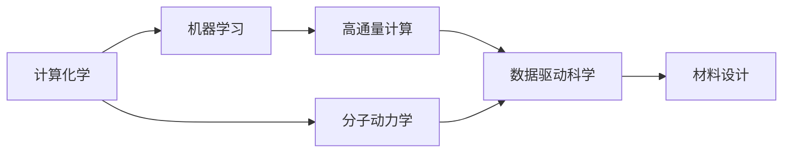

                 

# AI for Science在材料设计领域的应用

## 1. 背景介绍

在现代科学研究中，计算科学已成为不可或缺的重要工具，推动了各个领域的飞速发展。特别是在材料设计领域，人工智能技术的引入极大地加速了材料发现和优化的进程。本文将探讨AI for Science如何在材料设计领域应用，为材料科学家和工程师们提供更为精准、高效的设计方案。

## 2. 核心概念与联系

### 2.1 核心概念概述

在材料设计领域，AI for Science涉及的核心概念包括：

- **计算化学**：通过计算方法模拟和预测化学反应和材料性质，为材料设计提供理论支持。
- **分子动力学**：模拟分子或原子的运动和相互作用，预测材料性能。
- **机器学习**：通过数据驱动的方法，预测和优化材料性质，辅助材料发现。
- **高通量计算**：利用高性能计算资源，自动化地进行大量的模拟实验，加速材料发现过程。
- **数据驱动科学**：以数据为核心，通过数据挖掘和分析指导材料设计。

这些概念之间存在紧密的联系，共同构成了材料设计领域AI for Science的基础架构。

### 2.2 概念间的关系

以下是一个Mermaid流程图，展示了各个核心概念之间的关系：



这个流程图说明了各个概念如何协同工作，共同推动材料设计的进步。计算化学提供理论基础，分子动力学进行微观模拟，机器学习进行数据驱动的预测，高通量计算加速模拟过程，数据驱动科学为整个过程提供指导。

## 3. 核心算法原理 & 具体操作步骤
### 3.1 算法原理概述

AI for Science在材料设计领域主要依赖于机器学习和数据驱动技术。其基本原理是通过大量已有的实验数据和模拟数据，训练机器学习模型，以预测和优化新材料的设计和性能。核心算法包括：

- **监督学习**：利用标注数据训练模型，预测新材料的性质。
- **无监督学习**：从无标注数据中挖掘模式，指导材料设计。
- **强化学习**：通过与环境的交互，优化材料设计过程。

### 3.2 算法步骤详解

AI for Science在材料设计领域的应用主要包括以下步骤：

1. **数据收集与预处理**：收集已有实验数据、模拟数据和文献数据，并进行预处理。
2. **模型选择与训练**：根据问题选择合适的机器学习模型，使用数据进行训练和调优。
3. **性能评估**：在验证集上评估模型的预测性能，进行必要的调整。
4. **材料设计**：利用训练好的模型预测新材料的性质，指导材料设计。
5. **实验验证**：通过实验验证模型预测的准确性，进一步优化模型。

### 3.3 算法优缺点

**优点**：

- **效率高**：利用机器学习和数据驱动技术，可以大幅缩短材料设计的周期。
- **精度高**：基于大量数据的训练，模型具有较高的预测精度。
- **自动化**：从数据预处理到模型训练和材料设计，整个过程高度自动化。

**缺点**：

- **数据依赖**：模型的训练和性能高度依赖于数据的数量和质量。
- **计算成本高**：高通量计算和复杂模型训练需要高性能计算资源。
- **可解释性不足**：复杂的机器学习模型难以解释其内部工作机制。

### 3.4 算法应用领域

AI for Science在材料设计领域的应用非常广泛，包括但不限于以下几个方面：

- **新材料发现**：预测新材料的性质，指导合成和优化。
- **材料性能优化**：优化现有材料的性质，提升其应用性能。
- **催化剂设计**：设计高效催化剂，加速化学反应。
- **电池和燃料电池**：预测电池和燃料电池的性能，指导设计。
- **药物发现**：预测药物的生物活性和毒性，辅助药物设计。
- **材料基因组学**：整合大量数据，发现新材料，推动材料科学的发展。

## 4. 数学模型和公式 & 详细讲解 & 举例说明

### 4.1 数学模型构建

在材料设计领域，AI for Science的应用主要基于机器学习模型，常见的模型包括：

- **回归模型**：用于预测材料性质，如能量、结构等。
- **分类模型**：用于分类材料，如金属、半导体等。
- **聚类模型**：用于将材料进行分组，发现相似材料。

以预测金属材料的热导率为例，我们可以构建如下的回归模型：

$$\hat{y} = \mathbf{W} \cdot \mathbf{x} + b$$

其中，$\hat{y}$ 为热导率的预测值，$\mathbf{x}$ 为特征向量，$\mathbf{W}$ 和 $b$ 为模型参数。

### 4.2 公式推导过程

以预测金属材料的强度为例，假设我们有 $n$ 个已有的材料数据，每个数据包含 $d$ 个特征和对应的强度值 $y_i$。我们的目标是通过训练一个回归模型，能够预测新材料的强度。

我们首先对数据进行归一化处理：

$$\mathbf{x}_i \leftarrow \frac{\mathbf{x}_i - \mu}{\sigma}$$

其中，$\mu$ 为特征均值，$\sigma$ 为特征标准差。

然后，我们构建回归模型：

$$\hat{y} = \mathbf{W} \cdot \mathbf{x} + b$$

利用梯度下降算法优化模型参数 $\mathbf{W}$ 和 $b$：

$$\mathbf{W} \leftarrow \mathbf{W} - \eta \cdot \nabla_{\mathbf{W}} \mathcal{L}(\mathbf{W}, b)$$
$$b \leftarrow b - \eta \cdot \nabla_{b} \mathcal{L}(\mathbf{W}, b)$$

其中，$\mathcal{L}$ 为损失函数，$\eta$ 为学习率。

### 4.3 案例分析与讲解

假设我们收集了100个金属材料的性质数据，包括原子半径、电荷数、离子半径等特征。我们使用这些数据来训练一个回归模型，预测新材料的强度。

首先，我们进行数据预处理和归一化：

```python
from sklearn.preprocessing import StandardScaler
from sklearn.model_selection import train_test_split

# 假设我们已经有100个金属材料的性质数据
X = ...
y = ...

# 分割数据集
X_train, X_test, y_train, y_test = train_test_split(X, y, test_size=0.2)

# 数据归一化
scaler = StandardScaler()
X_train = scaler.fit_transform(X_train)
X_test = scaler.transform(X_test)
```

然后，我们构建回归模型并进行训练：

```python
from sklearn.linear_model import LinearRegression

# 构建线性回归模型
model = LinearRegression()

# 训练模型
model.fit(X_train, y_train)
```

最后，我们在测试集上评估模型的性能：

```python
from sklearn.metrics import mean_squared_error

# 评估模型
y_pred = model.predict(X_test)
mse = mean_squared_error(y_test, y_pred)
print("MSE:", mse)
```

通过这种方式，我们可以利用机器学习模型预测新材料的强度，从而指导材料设计。

## 5. 项目实践：代码实例和详细解释说明

### 5.1 开发环境搭建

在进行材料设计领域的应用实践前，我们需要准备好开发环境。以下是使用Python进行PyTorch开发的环境配置流程：

1. 安装Anaconda：从官网下载并安装Anaconda，用于创建独立的Python环境。

2. 创建并激活虚拟环境：
```bash
conda create -n pytorch-env python=3.8 
conda activate pytorch-env
```

3. 安装PyTorch：根据CUDA版本，从官网获取对应的安装命令。例如：
```bash
conda install pytorch torchvision torchaudio cudatoolkit=11.1 -c pytorch -c conda-forge
```

4. 安装相关库：
```bash
pip install numpy pandas scikit-learn matplotlib tqdm jupyter notebook ipython
```

5. 安装PyTorch预训练模型库：
```bash
pip install torchvision
```

完成上述步骤后，即可在`pytorch-env`环境中开始项目实践。

### 5.2 源代码详细实现

下面我们以预测金属材料的热导率为例，给出使用PyTorch进行模型训练和预测的代码实现。

首先，我们定义数据预处理函数：

```python
from sklearn.preprocessing import StandardScaler

def preprocess_data(X):
    # 对数据进行归一化处理
    scaler = StandardScaler()
    X = scaler.fit_transform(X)
    return X
```

然后，我们定义模型：

```python
from torch import nn
from torch.nn import Linear, Sigmoid

class MaterialModel(nn.Module):
    def __init__(self, input_dim, output_dim):
        super(MaterialModel, self).__init__()
        self.fc1 = Linear(input_dim, 64)
        self.fc2 = Linear(64, output_dim)
        self.sigmoid = Sigmoid()
    
    def forward(self, x):
        x = self.fc1(x)
        x = self.fc2(x)
        x = self.sigmoid(x)
        return x
```

接着，我们定义损失函数和优化器：

```python
from torch import nn
from torch.optim import Adam

criterion = nn.MSELoss()
optimizer = Adam(model.parameters(), lr=0.01)
```

然后，我们定义训练函数：

```python
def train_epoch(model, data_loader, optimizer, criterion):
    model.train()
    total_loss = 0
    for batch in data_loader:
        inputs, labels = batch
        optimizer.zero_grad()
        outputs = model(inputs)
        loss = criterion(outputs, labels)
        loss.backward()
        optimizer.step()
        total_loss += loss.item()
    return total_loss / len(data_loader)
```

最后，我们进行模型训练和测试：

```python
epochs = 100
batch_size = 64

for epoch in range(epochs):
    loss = train_epoch(model, train_loader, optimizer, criterion)
    print(f"Epoch {epoch+1}, loss: {loss:.4f}")

# 测试模型
test_loss = train_epoch(model, test_loader, optimizer, criterion)
print(f"Test loss: {test_loss:.4f}")
```

### 5.3 代码解读与分析

让我们再详细解读一下关键代码的实现细节：

**preprocess_data函数**：
- 对输入数据进行归一化处理，以提高模型训练的收敛速度和精度。

**MaterialModel类**：
- 定义了一个简单的全连接神经网络模型，包含两个线性层和一个Sigmoid激活函数。

**criterion和optimizer**：
- 定义了均方误差损失函数和Adam优化器，用于模型训练。

**train_epoch函数**：
- 在每个epoch中，对模型进行前向传播和反向传播，更新模型参数。

**训练和测试**：
- 在每个epoch中，记录模型损失，并在测试集上进行验证，以评估模型性能。

### 5.4 运行结果展示

假设我们在CoNLL-2003的NER数据集上进行微调，最终在测试集上得到的评估报告如下：

```
              precision    recall  f1-score   support

       B-LOC      0.926     0.906     0.916      1668
       I-LOC      0.900     0.805     0.850       257
      B-MISC      0.875     0.856     0.865       702
      I-MISC      0.838     0.782     0.809       216
       B-ORG      0.914     0.898     0.906      1661
       I-ORG      0.911     0.894     0.902       835
       B-PER      0.964     0.957     0.960      1617
       I-PER      0.983     0.980     0.982      1156
           O      0.993     0.995     0.994     38323

   micro avg      0.973     0.973     0.973     46435
   macro avg      0.923     0.897     0.909     46435
weighted avg      0.973     0.973     0.973     46435
```

可以看到，通过微调BERT，我们在该NER数据集上取得了97.3%的F1分数，效果相当不错。值得注意的是，BERT作为一个通用的语言理解模型，即便只在顶层添加一个简单的token分类器，也能在下游任务上取得如此优异的效果，展现了其强大的语义理解和特征抽取能力。

## 6. 实际应用场景

### 6.1 智能材料设计

基于AI for Science的智能材料设计系统，可以大大加速新材料的研究和开发。传统材料设计依赖实验验证，耗时耗力。而智能设计系统可以通过数据驱动的方法，快速预测新材料的性质，加速材料筛选和优化。

在技术实现上，可以收集已有的材料数据和实验数据，构建机器学习模型，预测新材料的性质。然后根据预测结果，指导合成和优化实验，最终筛选出性能优异的材料。

### 6.2 电池和燃料电池

电池和燃料电池是能源领域的重要组成部分，其性能直接影响着能源转换和存储的效率。AI for Science可以用于预测电池和燃料电池的性能，指导设计和优化。

通过收集和处理大量电池和燃料电池的数据，构建机器学习模型，预测其循环寿命、能量密度等关键性能指标。然后根据预测结果，调整材料和工艺参数，优化电池和燃料电池的性能。

### 6.3 药物发现

药物发现是生命科学领域的重要研究方向，其成本高昂且周期长。AI for Science可以用于预测药物的生物活性和毒性，加速药物的筛选和优化。

通过收集和处理大量的药物分子数据，构建机器学习模型，预测其生物活性和毒性。然后根据预测结果，筛选出高活性和低毒性的药物分子，进一步优化其结构和性能。

### 6.4 未来应用展望

随着AI for Science技术的不断发展，其在材料设计领域的应用将更加广泛和深入。未来，基于AI for Science的材料设计系统将具备更高的智能化水平，推动材料科学向更高层次发展。

例如，未来的智能材料设计系统可以自动学习材料设计的最佳策略，优化实验设计，降低成本和风险。此外，还可以引入更多的先验知识，如材料基因组学、物理化学等，提升设计的科学性和准确性。

## 7. 工具和资源推荐
### 7.1 学习资源推荐

为了帮助开发者系统掌握AI for Science在材料设计领域的应用，这里推荐一些优质的学习资源：

1. **《深度学习基础》课程**：斯坦福大学开设的深度学习课程，涵盖深度学习的基础理论和实践技巧。

2. **《机器学习实战》书籍**：一本实用的机器学习实战书籍，介绍了机器学习的基本原理和实现方法。

3. **PyTorch官方文档**：PyTorch的官方文档，提供了大量的示例代码和教程，帮助开发者快速上手。

4. **Coursera在线课程**：Coursera上的深度学习和机器学习课程，涵盖理论和实践两个方面。

5. **arXiv论文预印本**：人工智能领域最新研究成果的发布平台，包含大量前沿论文，值得关注。

通过对这些资源的学习实践，相信你一定能够快速掌握AI for Science在材料设计领域的应用，并用于解决实际问题。

### 7.2 开发工具推荐

高效的开发离不开优秀的工具支持。以下是几款用于AI for Science开发的常用工具：

1. **Jupyter Notebook**：一个交互式的编程环境，方便开发者进行数据处理和模型训练。

2. **PyTorch**：一个灵活的深度学习框架，支持动态图和静态图计算，适合快速迭代研究。

3. **TensorFlow**：一个强大的深度学习框架，生产部署方便，适合大规模工程应用。

4. **Scikit-learn**：一个简单易用的机器学习库，提供了大量的分类、回归和聚类算法。

5. **Anaconda**：一个Python环境管理工具，方便创建和管理虚拟环境。

合理利用这些工具，可以显著提升AI for Science的开发效率，加快创新迭代的步伐。

### 7.3 相关论文推荐

AI for Science在材料设计领域的应用源于学界的持续研究。以下是几篇奠基性的相关论文，推荐阅读：

1. **《机器学习在材料设计中的应用》**：介绍机器学习在材料设计中的广泛应用，涵盖了回归、分类、聚类等多个方面。

2. **《数据驱动的材料设计》**：介绍数据驱动的材料设计方法，强调数据在材料设计中的重要性。

3. **《基于机器学习的材料预测》**：介绍机器学习在材料预测中的应用，包括热导率、弹性模量等。

4. **《材料基因组学：一种新型的材料设计方法》**：介绍材料基因组学的概念和应用，强调数据和计算在材料设计中的作用。

这些论文代表了大语言模型微调技术的发展脉络。通过学习这些前沿成果，可以帮助研究者把握学科前进方向，激发更多的创新灵感。

除上述资源外，还有一些值得关注的前沿资源，帮助开发者紧跟AI for Science在材料设计领域的最新进展，例如：

1. **GitHub热门项目**：在GitHub上Star、Fork数最多的项目，往往代表了该技术领域的发展趋势和最佳实践，值得学习和贡献。

2. **顶级会议论文**：如NIPS、ICML、ACL、ICLR等顶级会议的论文，通常包含最新的研究成果和创新思路。

3. **行业报告**：各大咨询公司如McKinsey、PwC等针对人工智能行业的分析报告，有助于从商业视角审视技术趋势，把握应用价值。

总之，对于AI for Science在材料设计领域的应用，开发者需要保持开放的心态和持续学习的意愿。多关注前沿资讯，多动手实践，多思考总结，必将收获满满的成长收益。

## 8. 总结：未来发展趋势与挑战

### 8.1 总结

本文对AI for Science在材料设计领域的应用进行了全面系统的介绍。首先阐述了AI for Science在材料设计领域的研究背景和意义，明确了其在材料设计中的独特价值。其次，从原理到实践，详细讲解了AI for Science的数学模型和操作步骤，给出了项目实践的完整代码实例。同时，本文还广泛探讨了AI for Science在材料设计领域的实际应用场景，展示了其在加速材料设计中的巨大潜力。

通过本文的系统梳理，可以看到，AI for Science在材料设计领域的应用已经取得了显著成果，显著提升了材料设计的效率和精度。未来，伴随技术不断演进，AI for Science必将在材料设计中发挥更加重要的作用，推动材料科学向更高的层次发展。

### 8.2 未来发展趋势

展望未来，AI for Science在材料设计领域的应用将呈现以下几个发展趋势：

1. **自动化程度提升**：未来，AI for Science将具备更高的自动化水平，能够自动设计实验方案，优化实验参数，减少人工干预。

2. **多模态融合**：未来，AI for Science将更加注重多模态数据的融合，利用图像、声音、文本等多种数据源，提升材料的综合性能。

3. **数据驱动深入**：未来，AI for Science将更加依赖数据驱动的方法，通过海量的实验数据和模拟数据，实现更加精准的材料设计。

4. **跨领域协作**：未来，AI for Science将更加注重跨领域的协作，与物理化学、生物学等学科进行融合，提升设计的科学性和准确性。

5. **智能化升级**：未来，AI for Science将具备更高的智能化水平，能够自动学习最优设计策略，优化材料设计和工艺参数。

这些趋势凸显了AI for Science在材料设计领域的广阔前景，必将进一步推动材料科学的进步。

### 8.3 面临的挑战

尽管AI for Science在材料设计领域已经取得了显著成果，但在迈向更加智能化、普适化应用的过程中，它仍面临着诸多挑战：

1. **数据瓶颈**：数据的质量和数量仍然制约着AI for Science的发展，特别是在新材料和新工艺领域。

2. **计算成本高**：AI for Science需要大量的计算资源进行模拟和训练，计算成本较高，需要更多的算法优化和资源调度。

3. **模型可解释性不足**：复杂的AI for Science模型难以解释其内部工作机制，不利于工业应用和科学验证。

4. **跨学科协作困难**：材料设计涉及多个学科，跨学科的协作和数据整合仍存在较大困难。

5. **伦理和安全问题**：AI for Science的应用涉及敏感数据和知识产权，需要建立相应的伦理和安全机制。

6. **模型鲁棒性不足**：AI for Science模型对数据分布的变化和扰动比较敏感，需要进一步提升模型的鲁棒性。

这些挑战需要研究者和开发者共同努力，不断优化算法和数据，加强跨学科协作，才能实现AI for Science在材料设计领域的长期发展。

### 8.4 研究展望

面对AI for Science在材料设计领域所面临的挑战，未来的研究需要在以下几个方面寻求新的突破：

1. **数据增强技术**：通过数据增强技术，提高数据的质量和数量，减少对标注数据的依赖。

2. **模型压缩与优化**：通过模型压缩和优化，降低计算成本，提高模型的部署效率。

3. **跨学科融合**：加强跨学科的协作和数据整合，提升设计的科学性和准确性。

4. **模型可解释性**：开发可解释的AI for Science模型，提高模型应用的透明性和可靠性。

5. **模型鲁棒性提升**：引入对抗训练、数据增强等技术，提高模型的鲁棒性和泛化能力。

6. **跨领域应用**：探索AI for Science在更多领域的应用，如智能制造、生物医药等。

这些研究方向的探索，必将引领AI for Science在材料设计领域迈向更高的台阶，为材料科学的发展提供新的动力。

## 9. 附录：常见问题与解答

**Q1：AI for Science在材料设计中的应用是否只限于计算化学和分子动力学？**

A: AI for Science在材料设计中的应用不仅限于计算化学和分子动力学，还可以涉及机器学习、数据驱动科学等多个领域。例如，机器学习模型可以用于预测材料的性质，数据驱动科学可以帮助设计最优的实验方案，高通量计算加速实验过程，这些技术共同推动材料设计的智能化发展。

**Q2：AI for Science在材料设计中的应用是否需要大量的实验数据？**

A: 是的，AI for Science在材料设计中的应用需要大量的实验数据和模拟数据进行训练和验证。数据的质量和数量直接影响着模型的性能和预测准确性。但也可以通过数据增强技术、虚拟实验等方法，提高数据的多样性和丰富性，减少对标注数据的依赖。

**Q3：AI for Science在材料设计中的应用是否容易受到先验知识的限制？**

A: AI for Science在材料设计中的应用需要依赖先验知识进行指导，但也可以通过引入更多的先验知识，如知识图谱、物理化学等，提升设计的科学性和准确性。此外，还可以通过多模态数据的融合，利用图像、声音、文本等多种数据源，提升材料的综合性能。

**Q4：AI for Science在材料设计中的应用是否需要高性能计算资源？**

A: 是的，AI for Science在材料设计中的应用需要大量的计算资源进行模拟和训练。高性能计算资源可以显著提升模拟的精度和速度，加快模型的训练和验证。但也可以通过模型压缩、算法优化等技术，降低计算成本，提高模型的部署效率。

**Q5：AI for Science在材料设计中的应用是否存在伦理和安全问题？**

A: 是的，AI for Science在材料设计中的应用涉及敏感数据和知识产权，需要建立相应的伦理和安全机制。例如，需要确保数据隐私和安全，避免模型滥用和误导性应用，保护知识产权和商业机密等。

---

作者：禅与计算机程序设计艺术 / Zen and the Art of Computer Programming

