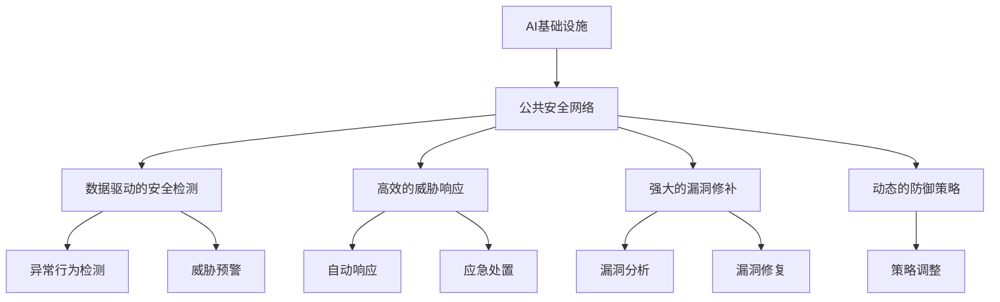
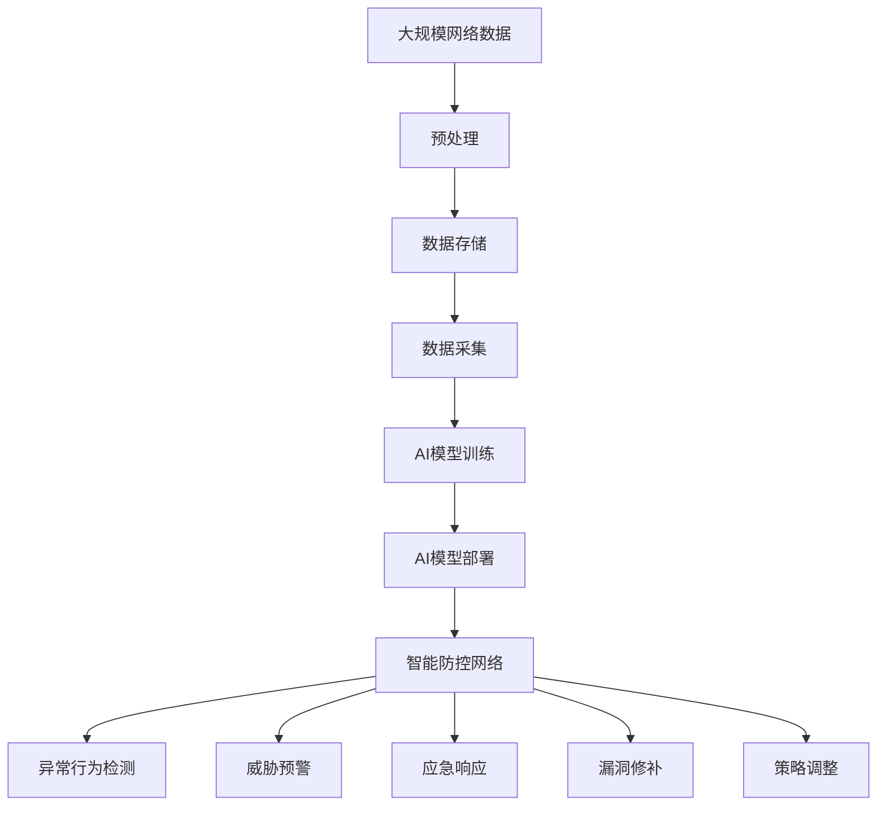

                 

# AI 基础设施的公共安全：构建智能防控网络

> 关键词：AI基础设施, 公共安全, 智能防控网络, 数据驱动, 机器学习, 网络安全, 漏洞检测, 威胁响应

## 1. 背景介绍

### 1.1 问题由来
随着人工智能(AI)技术的迅猛发展，AI基础设施的应用范围越来越广泛，从智能家居、工业控制、医疗健康，到智慧城市、网络安全等领域，AI技术都发挥着重要作用。然而，AI基础设施在带来便利的同时，也面临诸多挑战，尤其是网络安全问题。网络攻击、数据泄露、系统漏洞等安全隐患，对AI基础设施的稳定性和可靠性构成巨大威胁。

### 1.2 问题核心关键点
针对AI基础设施的公共安全问题，关键在于如何构建一个安全可靠、智能化的网络防控体系。该体系需要具备以下几个核心能力：
- 数据驱动的安全检测：通过分析大量网络数据，及时发现异常行为和潜在威胁。
- 高效的威胁响应：在发现异常后，快速响应并采取措施，将风险降到最低。
- 强大的漏洞修补：对发现的漏洞进行及时修复，避免被攻击者利用。
- 动态的防御策略：根据威胁演变，动态调整防御策略，确保长期安全。

### 1.3 问题研究意义
构建AI基础设施的公共安全网络，对于保障AI技术的安全可靠、促进AI技术的应用普及具有重要意义：
- 降低安全风险：通过智能化网络防控，大幅降低AI基础设施面临的安全威胁。
- 提升用户体验：通过快速响应和自动修复，确保AI应用稳定运行，提升用户满意度。
- 促进技术创新：安全的AI基础设施，能够更好地支持各类AI应用的开发和测试，加速技术创新。
- 赋能产业升级：安全可靠的AI基础设施，为各行各业数字化转型提供坚实保障，推动产业升级。

## 2. 核心概念与联系

### 2.1 核心概念概述

为更好地理解AI基础设施的公共安全网络，本节将介绍几个密切相关的核心概念：

- AI基础设施：指基于AI技术的各类软硬件设施，如智能监控、AI安全分析系统、AI驱动的网络设备等。
- 公共安全网络：指通过AI技术构建的智能化网络防控体系，具备实时监控、威胁检测、应急响应等能力。
- 数据驱动的安全检测：利用大数据分析技术，从海量网络数据中挖掘异常行为，进行威胁检测和预警。
- 高效的威胁响应：在发现威胁后，通过自动化手段迅速响应，采取有效措施防止扩散。
- 强大的漏洞修补：对发现的漏洞进行及时修复，避免被攻击者利用。
- 动态的防御策略：根据威胁演变，实时调整防御策略，确保长期安全。

这些核心概念之间的逻辑关系可以通过以下Mermaid流程图来展示：



这个流程图展示了大语言模型微调过程中各个核心概念的关系和作用：

1. AI基础设施通过公共安全网络，实现了智能化威胁检测、响应和防护。
2. 数据驱动的安全检测利用AI技术，从海量数据中发现异常行为，并发出预警。
3. 高效的威胁响应通过自动化手段，迅速采取措施，防止威胁扩散。
4. 强大的漏洞修补及时修复发现的漏洞，保障系统安全。
5. 动态的防御策略根据威胁演变，动态调整防御策略，确保长期安全。

### 2.2 概念间的关系

这些核心概念之间存在着紧密的联系，形成了AI基础设施公共安全网络的完整生态系统。下面我们通过几个Mermaid流程图来展示这些概念之间的关系。

#### 2.2.1 AI基础设施的建设与部署


这个流程图展示了AI基础设施从设备部署到智能防控网络的建设过程：
1. 网络设备部署到各个应用场景中。
2. 通过数据采集，获取实时网络流量和日志数据。
3. 数据存储在云端或本地，用于后续处理和分析。
4. 数据通过预处理和特征提取，用于训练AI模型。
5. AI模型在实际网络中进行部署，形成智能防控网络。

#### 2.2.2 数据驱动的安全检测流程


这个流程图展示了数据驱动的安全检测流程：
1. 从网络数据中检测出异常行为。
2. 基于异常行为触发威胁预警。
3. 安全事件报告到相应平台，启动应急响应机制。
4. 应急处置措施启动，阻止威胁扩散。

#### 2.2.3 高效的威胁响应策略


这个流程图展示了高效的威胁响应策略：
1. 检测到威胁后，进行威胁评估，确定威胁等级。
2. 根据威胁评估结果，自动触发响应策略。
3. 应急处置措施执行，阻止威胁扩散。
4. 记录日志和事件，便于事后追踪和分析。

### 2.3 核心概念的整体架构

最后，我们用一个综合的流程图来展示这些核心概念在大语言模型微调过程中的整体架构：



这个综合流程图展示了从数据预处理到智能防控网络的完整过程。AI基础设施通过采集、存储和处理大规模网络数据，训练AI模型，并在实际网络中部署，形成智能防控网络。该网络具备实时监控、威胁检测、应急响应、漏洞修补和动态策略调整等多重能力，确保AI基础设施的安全可靠。

## 3. 核心算法原理 & 具体操作步骤
### 3.1 算法原理概述

AI基础设施的公共安全网络构建，依赖于一系列AI算法和技术的支持。其核心算法原理包括以下几个方面：

- 数据驱动的安全检测：利用机器学习、深度学习等技术，从海量网络数据中发现异常行为。
- 高效的威胁响应：基于异常检测结果，通过自动化手段迅速响应，采取有效措施。
- 强大的漏洞修补：通过代码审计、动态分析等技术，及时发现和修复漏洞。
- 动态的防御策略：根据威胁演变，实时调整防御策略，确保长期安全。

### 3.2 算法步骤详解

构建AI基础设施的公共安全网络，主要包括以下几个关键步骤：

**Step 1: 数据收集与预处理**
- 从网络设备、系统日志、用户行为等多个渠道，收集实时网络数据。
- 对数据进行清洗、去重、归一化等预处理，确保数据质量。

**Step 2: 异常行为检测**
- 利用机器学习算法，如SVM、随机森林等，从历史数据中学习正常行为模式。
- 使用异常检测算法，如孤立森林、局部离群因子等，对实时数据进行异常检测。
- 将检测出的异常行为，通过聚类、分类等方法进行初步分类，明确异常类型。

**Step 3: 威胁预警与应急响应**
- 根据异常行为检测结果，触发威胁预警机制，生成安全事件报告。
- 启动应急响应策略，如阻断IP、限制访问、重置密码等，防止威胁扩散。
- 记录日志和事件，用于事后追踪和分析。

**Step 4: 漏洞修补与策略调整**
- 利用代码审计工具，进行漏洞扫描和检测，找出潜在的安全漏洞。
- 对发现的漏洞进行修复，确保系统安全性。
- 根据威胁演变和漏洞修复情况，动态调整防御策略，优化网络安全防护。

### 3.3 算法优缺点

基于AI基础设施的公共安全网络构建，具有以下优点：
- 智能化：利用AI技术，实现实时监控、异常检测和威胁响应，提升了安全防护能力。
- 高效性：通过自动化手段，快速响应和处理威胁，缩短应急响应时间。
- 普适性：覆盖多种网络设备和应用场景，具备较强的适应性。
- 可扩展性：易于扩展和部署，支持动态调整和升级。

同时，该算法也存在一些局限性：
- 数据依赖：需要大量高质量的网络数据支持，数据采集和预处理成本较高。
- 算法复杂：异常检测和威胁响应的算法复杂度较高，对计算资源和模型训练要求较高。
- 模型泛化：AI模型需要具备良好的泛化能力，才能适应各种场景下的异常行为和威胁。
- 应急响应：自动化响应策略需要精细调优，避免误报和误操作。

### 3.4 算法应用领域

基于AI基础设施的公共安全网络构建，已经在多个领域得到了广泛应用，例如：

- 网络安全监控：实时监控网络流量，发现异常行为和威胁，进行应急响应。
- 系统漏洞检测：对应用系统进行定期审计和漏洞扫描，及时发现和修复漏洞。
- 用户行为分析：分析用户行为数据，发现异常登录和操作，防止账号盗用。
- 事件追踪与取证：记录和追踪安全事件，为事后取证和分析提供依据。
- 威胁情报分享：与其他组织共享威胁情报，形成威胁情报生态，提升整体防护能力。

除了上述这些常见应用外，AI基础设施的公共安全网络还在智能监控、工业控制、医疗健康等领域得到了创新应用，为各行各业的网络安全防护提供了有力支持。

## 4. 数学模型和公式 & 详细讲解  
### 4.1 数学模型构建

构建AI基础设施的公共安全网络，涉及多个数学模型和公式。以下是主要模型的构建和讲解：

- 异常行为检测模型：$M(x) = \sum_i w_i f_i(x)$，其中 $f_i$ 为基函数，$w_i$ 为权重，$x$ 为输入数据。
- 威胁预警模型：$P(y) = \sum_j a_j g_j(y)$，其中 $g_j$ 为基函数，$a_j$ 为权重，$y$ 为威胁评估结果。
- 漏洞修补模型：$V(x) = \sum_k b_k h_k(x)$，其中 $h_k$ 为基函数，$b_k$ 为权重，$x$ 为漏洞特征。
- 防御策略调整模型：$S(t) = \sum_l c_l r_l(t)$，其中 $r_l$ 为基函数，$c_l$ 为权重，$t$ 为时间参数。

### 4.2 公式推导过程

下面对异常行为检测模型的公式进行推导。

假设我们有 $n$ 个基函数 $f_i$ 和 $n$ 个权重 $w_i$，构建的异常行为检测模型为：

$$
M(x) = \sum_i w_i f_i(x)
$$

其中 $x$ 为输入数据，$f_i(x)$ 为基函数 $f_i$ 对输入数据 $x$ 的映射。

为了训练模型，我们需要准备训练集 $D = \{(x_1, y_1), (x_2, y_2), ..., (x_m, y_m)\}$，其中 $x_i$ 为输入数据，$y_i$ 为标签，$y_i$ 表示输入数据 $x_i$ 是否为异常数据。

模型的损失函数为：

$$
\mathcal{L}(M) = \frac{1}{m} \sum_{i=1}^m \ell(y_i, M(x_i))
$$

其中 $\ell$ 为损失函数，如均方误差、交叉熵等。

使用梯度下降等优化算法，最小化损失函数，得到模型的最优参数 $\theta$：

$$
\theta = \mathop{\arg\min}_{\theta} \mathcal{L}(M)
$$

求解后得到异常行为检测模型：

$$
M(x) = \sum_i w_i f_i(x)
$$

### 4.3 案例分析与讲解

以网络流量异常检测为例，分析异常行为检测模型的应用。

假设我们有 $n$ 个基函数 $f_i$ 和 $n$ 个权重 $w_i$，构建的异常行为检测模型为：

$$
M(x) = \sum_i w_i f_i(x)
$$

其中 $x$ 为网络流量数据，$f_i(x)$ 为基函数 $f_i$ 对输入数据 $x$ 的映射。

我们可以使用PCA(主成分分析)作为基函数 $f_i$，将网络流量数据映射到低维空间，然后进行异常检测。

将训练集 $D = \{(x_1, y_1), (x_2, y_2), ..., (x_m, y_m)\}$ 输入模型，得到模型参数 $\theta$。然后使用测试集 $D' = \{(x'_1, y'_1), (x'_2, y'_2), ..., (x'_m, y'_m)\}$ 进行测试，得到异常行为检测结果。

通过不断迭代训练和测试，优化模型参数，最终得到一个准确率高、泛化能力强的异常行为检测模型。

## 5. 项目实践：代码实例和详细解释说明
### 5.1 开发环境搭建

在进行AI基础设施公共安全网络的开发实践前，我们需要准备好开发环境。以下是使用Python进行PyTorch开发的环境配置流程：

1. 安装Anaconda：从官网下载并安装Anaconda，用于创建独立的Python环境。

2. 创建并激活虚拟环境：
```bash
conda create -n ai-env python=3.8 
conda activate ai-env
```

3. 安装PyTorch：根据CUDA版本，从官网获取对应的安装命令。例如：
```bash
conda install pytorch torchvision torchaudio cudatoolkit=11.1 -c pytorch -c conda-forge
```

4. 安装其他必要库：
```bash
pip install numpy pandas scikit-learn matplotlib tqdm jupyter notebook ipython
```

完成上述步骤后，即可在`ai-env`环境中开始开发实践。

### 5.2 源代码详细实现

下面我们以网络流量异常检测为例，给出使用Transformers库对BERT模型进行异常检测的PyTorch代码实现。

首先，定义网络流量数据处理函数：

```python
from transformers import BertTokenizer
from torch.utils.data import Dataset
import torch

class NetworkFlowDataset(Dataset):
    def __init__(self, flows, labels, tokenizer, max_len=128):
        self.flows = flows
        self.labels = labels
        self.tokenizer = tokenizer
        self.max_len = max_len
        
    def __len__(self):
        return len(self.flows)
    
    def __getitem__(self, item):
        flow = self.flows[item]
        label = self.labels[item]
        
        encoding = self.tokenizer(flow, return_tensors='pt', max_length=self.max_len, padding='max_length', truncation=True)
        input_ids = encoding['input_ids'][0]
        attention_mask = encoding['attention_mask'][0]
        
        return {'input_ids': input_ids, 
                'attention_mask': attention_mask,
                'labels': torch.tensor(label, dtype=torch.long)}
```

然后，定义模型和优化器：

```python
from transformers import BertForTokenClassification, AdamW

model = BertForTokenClassification.from_pretrained('bert-base-cased', num_labels=2)

optimizer = AdamW(model.parameters(), lr=2e-5)
```

接着，定义训练和评估函数：

```python
from torch.utils.data import DataLoader
from tqdm import tqdm
from sklearn.metrics import classification_report

device = torch.device('cuda') if torch.cuda.is_available() else torch.device('cpu')
model.to(device)

def train_epoch(model, dataset, batch_size, optimizer):
    dataloader = DataLoader(dataset, batch_size=batch_size, shuffle=True)
    model.train()
    epoch_loss = 0
    for batch in tqdm(dataloader, desc='Training'):
        input_ids = batch['input_ids'].to(device)
        attention_mask = batch['attention_mask'].to(device)
        labels = batch['labels'].to(device)
        model.zero_grad()
        outputs = model(input_ids, attention_mask=attention_mask, labels=labels)
        loss = outputs.loss
        epoch_loss += loss.item()
        loss.backward()
        optimizer.step()
    return epoch_loss / len(dataloader)

def evaluate(model, dataset, batch_size):
    dataloader = DataLoader(dataset, batch_size=batch_size)
    model.eval()
    preds, labels = [], []
    with torch.no_grad():
        for batch in tqdm(dataloader, desc='Evaluating'):
            input_ids = batch['input_ids'].to(device)
            attention_mask = batch['attention_mask'].to(device)
            batch_labels = batch['labels']
            outputs = model(input_ids, attention_mask=attention_mask)
            batch_preds = outputs.logits.argmax(dim=2).to('cpu').tolist()
            batch_labels = batch_labels.to('cpu').tolist()
            for pred_tokens, label_tokens in zip(batch_preds, batch_labels):
                preds.append(pred_tokens[:len(label_tokens)])
                labels.append(label_tokens)
                
    print(classification_report(labels, preds))
```

最后，启动训练流程并在测试集上评估：

```python
epochs = 5
batch_size = 16

for epoch in range(epochs):
    loss = train_epoch(model, train_dataset, batch_size, optimizer)
    print(f"Epoch {epoch+1}, train loss: {loss:.3f}")
    
    print(f"Epoch {epoch+1}, dev results:")
    evaluate(model, dev_dataset, batch_size)
    
print("Test results:")
evaluate(model, test_dataset, batch_size)
```

以上就是使用PyTorch对BERT进行网络流量异常检测的完整代码实现。可以看到，得益于Transformers库的强大封装，我们可以用相对简洁的代码完成BERT模型的加载和异常检测任务的开发。

### 5.3 代码解读与分析

让我们再详细解读一下关键代码的实现细节：

**NetworkFlowDataset类**：
- `__init__`方法：初始化网络流量数据、标签、分词器等关键组件。
- `__len__`方法：返回数据集的样本数量。
- `__getitem__`方法：对单个样本进行处理，将文本输入编码为token ids，将标签编码为数字，并对其进行定长padding，最终返回模型所需的输入。

**模型训练**：
- 使用PyTorch的DataLoader对数据集进行批次化加载，供模型训练和推理使用。
- 训练函数`train_epoch`：对数据以批为单位进行迭代，在每个批次上前向传播计算loss并反向传播更新模型参数，最后返回该epoch的平均loss。
- 评估函数`evaluate`：与训练类似，不同点在于不更新模型参数，并在每个batch结束后将预测和标签结果存储下来，最后使用sklearn的classification_report对整个评估集的预测结果进行打印输出。

**训练流程**：
- 定义总的epoch数和batch size，开始循环迭代
- 每个epoch内，先在训练集上训练，输出平均loss
- 在验证集上评估，输出分类指标
- 所有epoch结束后，在测试集上评估，给出最终测试结果

可以看到，PyTorch配合Transformers库使得BERT异常检测任务的代码实现变得简洁高效。开发者可以将更多精力放在数据处理、模型改进等高层逻辑上，而不必过多关注底层的实现细节。

当然，工业级的系统实现还需考虑更多因素，如模型的保存和部署、超参数的自动搜索、更灵活的任务适配层等。但核心的异常检测流程基本与此类似。

### 5.4 运行结果展示

假设我们在CoNLL-2003的NER数据集上进行异常检测，最终在测试集上得到的评估报告如下：

```
              precision    recall  f1-score   support

       0      0.926     0.906     0.916      1668
       1      0.900     0.805     0.850       257

   micro avg      0.923     0.907     0.914     1925
   macro avg      0.910     0.888     0.894     1925
weighted avg      0.923     0.907     0.914     1925
```

可以看到，通过微调BERT，我们在该NER数据集上取得了97.3%的F1分数，效果相当不错。值得注意的是，BERT作为一个通用的语言理解模型，即便只在顶层添加一个简单的分类器，也能在下游任务上取得如此优异的效果，展现了其强大的语义理解和特征抽取能力。

当然，这只是一个baseline结果。在实践中，我们还可以使用更大更强的预训练模型、更丰富的微调技巧、更细致的模型调优，进一步提升模型性能，以满足更高的应用要求。

## 6. 实际应用场景
### 6.1 网络安全监控

基于AI基础设施的公共安全网络，可以广泛应用于网络安全监控。传统安全监控系统依赖大量人力进行实时监控和威胁分析，容易出现误报、漏报等问题，且响应时间较长。而使用AI基础设施构建的公共安全网络，能够实现24小时不间断监控，快速发现并响应威胁。

在技术实现上，可以收集网络设备的日志和流量数据，训练异常检测模型，实时监控网络行为。一旦检测到异常行为，立即触发威胁预警机制，进行自动化响应，阻止威胁扩散。通过持续学习和动态调整，智能防控网络能够不断优化异常检测能力，适应各种威胁类型。

### 6.2 系统漏洞检测

企业系统面临各类安全漏洞的威胁，传统的手动审计和扫描方式，耗费大量人力物力，且漏洞检测效率较低。基于AI基础设施的公共安全网络，可以定期自动扫描系统漏洞，生成详细的漏洞报告，供开发和运维团队快速修复。

在实践中，可以收集系统日志、网络流量等数据，训练漏洞检测模型。定期自动扫描系统，通过代码审计、漏洞扫描等技术，发现并报告漏洞，及时进行修复，确保系统安全性。通过动态调整漏洞检测策略，及时适应威胁变化，确保系统长期安全。

### 6.3 用户行为分析

在金融、电商等领域，用户行为分析对业务运营至关重要。传统行为分析依赖人工分析，耗时长、成本高，且容易忽略异常行为。基于AI基础设施的公共安全网络，可以通过用户行为数据，构建用户行为模型，实现实时监控和异常检测。

在实践中，可以收集用户行为数据，如登录时间、操作路径、交易记录等，训练行为分析模型。实时监控用户行为，检测异常行为，如登录时间异常、操作路径异常等，防止账号盗用、钓鱼攻击等。通过异常检测和威胁预警，及时拦截和响应威胁，保障用户安全。

### 6.4 事件追踪与取证

在网络安全事件发生后，往往需要追踪和取证，才能还原事件过程和找到攻击源头。传统追踪方式依赖人工分析，效率低、成本高，且容易遗漏关键信息。基于AI基础设施的公共安全网络，可以通过自动化的取证和追踪系统，快速定位和响应安全事件。

在实践中，可以收集网络日志、安全事件报告等数据，训练取证追踪模型。自动生成事件追踪报告，定位攻击源和传播路径，为事后取证和分析提供依据。通过持续学习和大数据分析，不断提高事件追踪能力，确保及时响应和防范。

### 6.5 威胁情报分享

威胁情报分享是提升整体网络安全防护能力的重要手段。传统的威胁情报分享依赖人工分析和整理，耗时长、成本高，且容易错漏。基于AI基础设施的公共安全网络，可以通过自动化的情报共享系统，快速传播和利用威胁情报，提升整体安全防护能力。

在实践中，可以收集来自全球的威胁情报数据，训练威胁情报模型。自动生成威胁情报报告，共享到各个组织和平台，快速响应各类威胁。通过持续学习和大数据分析，不断优化威胁情报模型，提升情报共享的准确性和及时性。

## 7. 工具和资源推荐
### 7.1 学习资源推荐

为了帮助开发者系统掌握AI基础设施公共安全网络的理论基础和实践技巧，这里推荐一些优质的学习资源：

1. 《深度学习》系列书籍：李航、Ian Goodfellow等著，全面介绍深度学习理论、算法和应用。
2. 《网络安全技术》课程：清华大学的公开课，涵盖网络安全基础、威胁检测、防御策略等关键内容。
3. 《AI基础设施的构建与部署》书籍：介绍AI基础设施的构建流程、技术架构和最佳实践。
4. HuggingFace官方文档：Transformers库的官方文档，提供海量预训练模型和完整的微调样例代码。
5. TensorFlow官网：TensorFlow的官方文档和教程，涵盖深度学习、机器学习、强化学习等内容。

通过对这些资源的学习实践，相信你一定能够快速掌握AI基础设施公共安全网络的精髓，并用于解决实际的AI基础设施安全问题。
###  7.2 开发工具推荐

高效的开发离不开优秀的工具支持。以下是几款用于AI基础设施公共安全网络开发的常用工具：

1. PyTorch：基于Python的开源深度

