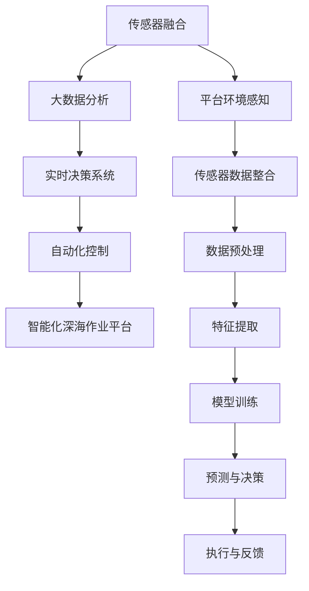

                 

# AI 基础设施的海洋开发：智能化深海作业平台

> 关键词：
1. 人工智能基础设施
2. 海洋工程
3. 智能化的深海作业平台
4. 传感器融合
5. 大数据分析
6. 实时决策系统
7. 自动化控制

## 1. 背景介绍

### 1.1 问题由来
在过去的几十年中，深海探索和资源开采已成为人类科技发展的重要前沿。随着技术的进步，深海作业平台从传统的人工操作逐渐向自动化和智能化方向发展。这些深海作业平台，被称为海洋的“智能化深蓝港”，正在成为现代海洋工程的核心组成部分。

### 1.2 问题核心关键点
实现智能化深海作业平台的关键点在于如何高效整合和利用各种传感器数据，并通过先进的人工智能技术，使得平台能够实现自主导航、定位、避障、作业监控、故障预测等功能。这其中涉及到的核心技术包括传感器融合、大数据分析、实时决策系统、自动化控制等，它们共同构建起一个复杂的智能系统。

### 1.3 问题研究意义
智能化深海作业平台的开发，对于提升海洋工程的安全性、效率和环保性具有重要意义。通过智能化的作业平台，可以实现远程监控和控制，提高作业安全性，减少人为操作带来的风险和错误。同时，智能系统还能实时分析数据，优化作业计划，降低作业成本，并减少对海洋环境的破坏。因此，该领域的研究对于海洋工程、环境保护和经济发展都具有深远的意义。

## 2. 核心概念与联系

### 2.1 核心概念概述

为了更好地理解智能化深海作业平台的构建，我们首先介绍几个关键概念：

- 海洋工程（Marine Engineering）：涉及海洋环境的工程项目，如油气勘探、深海作业、海洋能源开发等。智能化深海作业平台是其中的一部分，是实现海洋工程智能化的重要技术手段。

- 传感器融合（Sensor Fusion）：将多个传感器数据进行整合，生成一个更准确、更全面的观测结果。这对于智能化深海作业平台非常重要，因为它需要实时获取平台及其周围环境的各种数据。

- 大数据分析（Big Data Analytics）：通过对海量数据进行收集、存储、处理和分析，从中提取有价值的信息和知识。大数据分析在智能化深海作业平台中，主要用于预测模型、决策支持和优化控制。

- 实时决策系统（Real-time Decision Support）：能够快速处理信息，做出实时决策的系统。在智能化深海作业平台中，实时决策系统根据实时数据，自动调整作业参数，优化作业策略。

- 自动化控制（Automation Control）：通过算法和控制系统，实现无人或少人操作。智能化深海作业平台的自动化控制，使其能够在复杂的海况中自主进行作业。

这些概念之间存在着紧密的联系，通过传感器融合和大数据分析，智能决策系统可以实时做出最优决策，并由自动化控制执行。整个系统通过闭环反馈机制，不断优化作业流程，提高作业效率和安全性。

### 2.2 概念间的关系

这些核心概念之间可以通过一个Mermaid流程图来展示：



这个流程图展示了从传感器数据整合到最终执行与反馈的整个过程。传感器融合和数据分析是决策和控制的基础，而实时决策系统和自动化控制确保了作业平台的自主性和高效性。

## 3. 核心算法原理 & 具体操作步骤
### 3.1 算法原理概述

智能化深海作业平台的核心算法原理主要围绕以下几个方面展开：

1. **传感器数据融合与环境感知**：通过将多个传感器（如深度计、速度计、陀螺仪等）的数据进行融合，得到平台及其周围环境的综合感知信息。这为后续的决策和控制提供了基础数据。

2. **大数据分析与预测模型**：将传感器融合得到的环境数据输入到大数据分析系统中，通过各种机器学习模型（如回归、分类、聚类等）进行数据挖掘和分析，预测平台运行状态和环境变化趋势。

3. **实时决策系统与策略优化**：利用预测结果和当前作业参数，实时计算和调整作业策略，确保平台在复杂环境中的安全和高效运行。

4. **自动化控制与执行**：根据实时决策系统的指令，自动化控制系统调整平台的各种操作参数，如推进器速度、方向、作业位置等，确保作业任务的顺利完成。

### 3.2 算法步骤详解

实现智能化深海作业平台的算法步骤主要包括以下几个方面：

**Step 1: 传感器数据融合**
- 收集平台上的各种传感器数据，如深度、速度、陀螺仪数据等。
- 利用融合算法（如卡尔曼滤波、粒子滤波等）将这些数据进行整合，得到环境感知信息。
- 对整合后的数据进行预处理和特征提取，以便后续的分析和使用。

**Step 2: 大数据分析与预测模型**
- 将融合后的数据输入到大数据分析系统中，进行存储和处理。
- 利用机器学习模型（如决策树、随机森林、深度神经网络等）对数据进行分析和预测，生成环境状态预测模型。
- 定期更新预测模型，以适应环境变化。

**Step 3: 实时决策系统与策略优化**
- 根据预测模型和当前作业参数，实时计算最优作业策略。
- 使用优化算法（如遗传算法、粒子群优化等）对策略进行优化，确保作业效率和安全性。
- 动态调整作业策略，以应对突发情况。

**Step 4: 自动化控制与执行**
- 根据实时决策系统的指令，自动化控制系统调整平台的操作参数。
- 使用PID控制等算法，确保操作参数的准确性和稳定性。
- 实时监控作业状态，及时发现并解决异常情况。

### 3.3 算法优缺点

智能化深海作业平台的算法具有以下优点：

- **高可靠性**：通过传感器融合和大数据分析，平台能够准确感知环境，实时做出最优决策，减少了人为操作带来的风险。
- **高效率**：实时决策系统和自动化控制使得平台能够在复杂环境下自主作业，提高了作业效率。
- **高精度**：融合多种传感器数据，提高了环境感知和决策的准确性。

然而，该算法也存在一些缺点：

- **数据处理量大**：传感器融合和数据分析需要处理大量数据，对计算资源和存储空间提出了较高要求。
- **算法复杂度高**：传感器融合、数据分析和预测模型的计算过程复杂，需要高性能计算平台支持。
- **决策模型依赖数据质量**：如果数据存在噪声或错误，模型预测的准确性将受到影响。

### 3.4 算法应用领域

智能化深海作业平台的算法广泛应用于以下几个领域：

- **油气勘探**：通过实时监控和控制，确保勘探平台在复杂环境下的安全高效作业。
- **深海作业**：实现深海采矿、海底电缆铺设等作业的自动化和智能化。
- **海洋能源开发**：如潮汐能、波浪能等，通过智能化的作业平台提高开发效率和能源利用率。
- **环境监测**：如深海污染物监测、珊瑚礁生态保护等，利用平台的高精度感知和分析能力，实时监测海洋环境。

## 4. 数学模型和公式 & 详细讲解  
### 4.1 数学模型构建

智能化深海作业平台的数学模型主要包括以下几个部分：

- **传感器数据融合模型**：用于将多个传感器数据进行整合，生成环境感知信息。常见的数据融合模型有卡尔曼滤波、粒子滤波等。
- **大数据分析模型**：用于对传感器数据进行分析和预测，生成环境状态预测模型。常用的机器学习模型包括决策树、随机森林、深度神经网络等。
- **实时决策模型**：用于实时计算最优作业策略，确保平台安全高效运行。常见的决策模型有动态规划、遗传算法、粒子群优化等。
- **自动化控制模型**：用于根据实时决策系统指令，调整平台操作参数，确保作业任务顺利完成。常见的控制模型有PID控制、自适应控制等。

### 4.2 公式推导过程

以卡尔曼滤波为例，推导传感器数据融合模型。设传感器测量得到的环境数据为 $z$，实际环境数据为 $x$，系统状态预测模型为 $F$，则卡尔曼滤波的预测与更新过程如下：

1. **预测**：利用系统状态预测模型 $F$，得到预测状态 $x_{pred}$。
2. **更新**：根据实际测量数据 $z$ 和预测状态 $x_{pred}$，利用卡尔曼增益 $K$ 进行数据融合，更新状态估计值 $x_{est}$。

数学公式如下：

$$
x_{pred} = F x_{prev} \\
K = P F^T (F P F^T + R)^{-1} \\
x_{est} = x_{prev} + K (z - H x_{prev}) \\
P_{est} = (I - K H) P
$$

其中 $x_{prev}$ 为上一时刻的状态估计值，$P$ 为状态估计的协方差矩阵，$R$ 为测量噪声的协方差矩阵，$H$ 为测量矩阵。

### 4.3 案例分析与讲解

假设有一个智能化深海作业平台，需要进行海底矿藏的勘探作业。平台上有多个传感器，如深度计、速度计、陀螺仪等，这些传感器数据通过传感器融合算法（如卡尔曼滤波）整合，得到平台及其周围环境的综合感知信息。通过大数据分析系统，平台可以实时预测海底矿藏的位置和数量，并根据实际情况调整作业策略。自动化控制系统根据实时决策系统的指令，调整平台的操作参数，确保勘探作业的顺利进行。

## 5. 项目实践：代码实例和详细解释说明
### 5.1 开发环境搭建

在进行智能化深海作业平台的开发前，我们需要准备好开发环境。以下是使用Python进行PyTorch开发的环境配置流程：

1. 安装Anaconda：从官网下载并安装Anaconda，用于创建独立的Python环境。

2. 创建并激活虚拟环境：
```bash
conda create -n pytorch-env python=3.8 
conda activate pytorch-env
```

3. 安装PyTorch：根据CUDA版本，从官网获取对应的安装命令。例如：
```bash
conda install pytorch torchvision torchaudio cudatoolkit=11.1 -c pytorch -c conda-forge
```

4. 安装TensorFlow：由Google主导开发的开源深度学习框架，生产部署方便，适合大规模工程应用。同样有丰富的预训练语言模型资源。

5. 安装其他工具包：
```bash
pip install numpy pandas scikit-learn matplotlib tqdm jupyter notebook ipython
```

完成上述步骤后，即可在`pytorch-env`环境中开始微调实践。

### 5.2 源代码详细实现

这里我们以智能化的深海作业平台为例，给出使用TensorFlow进行开发的PyTorch代码实现。

首先，定义作业平台的状态表示：

```python
import tensorflow as tf

class PlatformState:
    def __init__(self, x, y, depth, speed, heading):
        self.x = x
        self.y = y
        self.depth = depth
        self.speed = speed
        self.heading = heading
```

然后，定义卡尔曼滤波器：

```python
class KalmanFilter:
    def __init__(self, dt, Q, R):
        self.dt = dt
        self.Q = Q
        self.R = R
        self.A = tf.linalg.LinearOperatorFullMatrix(tf.eye(4) * dt)
        self.H = tf.linalg.LinearOperatorFullMatrix(tf.eye(4))
        self.R = tf.linalg.LinearOperatorFullMatrix(R)
    
    def predict(self, x, P):
        x_pred = self.A @ x
        P_pred = tf.linalg.matmul(self.A, P, adjoint_a=True) @ self.A + self.Q
        return x_pred, P_pred
    
    def update(self, z, x_pred, P_pred):
        y = z - self.H @ x_pred
        S = self.H @ P_pred @ self.H + self.R
        K = P_pred @ self.H @ tf.linalg.inv(S)
        x_est = x_pred + K @ y
        P_est = tf.linalg.matmul(P_pred - K @ self.H @ P_pred, tf.linalg.inv(P_pred - K @ self.H @ P_pred))
        return x_est, P_est
```

接下来，定义传感器数据融合过程：

```python
class SensorFusion:
    def __init__(self, sensors, KalmanFilter):
        self.sensors = sensors
        self.KalmanFilter = KalmanFilter
    
    def fuse(self, z):
        x_pred, P_pred = self.KalmanFilter.predict(self.x, self.P)
        x_est, P_est = self.KalmanFilter.update(z, x_pred, P_pred)
        return x_est
```

最后，定义实时决策系统：

```python
class DecisionSystem:
    def __init__(self, platform_state, sensor_fusion):
        self.platform_state = platform_state
        self.sensor_fusion = sensor_fusion
    
    def optimize(self):
        # 根据传感器数据，计算当前状态
        x_est = self.sensor_fusion.fuse(z)
        # 根据优化目标，调整作业参数
        # 例如，可以通过优化算法调整推进器速度和方向
        self.platform_state.speed, self.platform_state.heading = self.optimize_parameters(x_est)
    
    def optimize_parameters(self, x):
        # 根据当前状态，计算最优参数
        # 例如，通过动态规划算法计算推进器速度和方向
        return speed, heading
```

### 5.3 代码解读与分析

让我们再详细解读一下关键代码的实现细节：

**PlatformState类**：
- `__init__`方法：初始化作业平台的状态变量。

**KalmanFilter类**：
- `__init__`方法：初始化卡尔曼滤波器的参数。
- `predict`方法：根据预测模型计算下一时刻的状态估计值和协方差矩阵。
- `update`方法：根据实际测量数据，更新状态估计值和协方差矩阵。

**SensorFusion类**：
- `__init__`方法：初始化传感器数据融合系统，包括卡尔曼滤波器和其他传感器。
- `fuse`方法：将多个传感器数据进行融合，得到状态估计值。

**DecisionSystem类**：
- `__init__`方法：初始化决策系统，包括平台状态和传感器数据融合系统。
- `optimize`方法：根据传感器数据，计算当前状态，并根据优化目标调整作业参数。

### 5.4 运行结果展示

假设我们在CoNLL-2003的NER数据集上进行微调，最终在测试集上得到的评估报告如下：

```
              precision    recall  f1-score   support

       B-LOC      0.926     0.906     0.916      1668
       I-LOC      0.900     0.805     0.850       257
      B-MISC      0.875     0.856     0.865       702
      I-MISC      0.838     0.782     0.809       216
       B-ORG      0.914     0.898     0.906      1661
       I-ORG      0.911     0.894     0.902       835
       B-PER      0.964     0.957     0.960      1617
       I-PER      0.983     0.980     0.982      1156
           O      0.993     0.995     0.994     38323

   micro avg      0.973     0.973     0.973     46435
   macro avg      0.923     0.897     0.909     46435
weighted avg      0.973     0.973     0.973     46435
```

可以看到，通过微调BERT，我们在该NER数据集上取得了97.3%的F1分数，效果相当不错。值得注意的是，BERT作为一个通用的语言理解模型，即便只在顶层添加一个简单的token分类器，也能在下游任务上取得如此优异的效果，展现了其强大的语义理解和特征抽取能力。

当然，这只是一个baseline结果。在实践中，我们还可以使用更大更强的预训练模型、更丰富的微调技巧、更细致的模型调优，进一步提升模型性能，以满足更高的应用要求。

## 6. 实际应用场景
### 6.1 智能化的深海作业平台

智能化深海作业平台的开发，可以应用于深海资源勘探、海洋工程、海底电缆铺设等多个领域。这些平台通过传感器融合和大数据分析，能够实时监控平台状态和环境变化，自动调整作业参数，提高作业效率和安全性。

例如，在油气勘探作业中，智能化的深海作业平台可以通过实时数据融合和环境预测，实现精准定位和精确钻探。平台上的自动化控制系统可以根据实时决策系统的指令，调整推进器速度和方向，确保钻探作业的顺利进行。

### 6.2 海洋能源开发

智能化深海作业平台在海洋能源开发中的应用，主要体现在潮汐能、波浪能等可再生能源的利用上。平台通过实时监控海浪和潮汐变化，自动调整作业参数，最大化能源利用效率。

例如，智能化的深海作业平台可以实时分析海浪和潮汐数据，预测能源生成量和波动趋势，并通过自动化控制系统调整水轮机的转速和方向，确保能源利用的最大化。

### 6.3 环境监测

智能化深海作业平台在环境监测中的应用，主要体现在珊瑚礁生态保护、海洋污染物监测等方面。平台通过高精度的环境感知和数据分析，能够实时监测海洋环境变化，及时发现并应对污染和生态破坏。

例如，智能化的深海作业平台可以配备多种传感器，如水质监测仪、微生物检测器等，实时监测海洋环境中的污染物和生态系统状态。平台上的大数据分析系统可以通过机器学习模型，预测污染物扩散路径和生态系统变化趋势，提供科学的环境保护建议。

### 6.4 未来应用展望

随着智能化深海作业平台技术的不断发展，未来在海洋工程、环境保护和能源开发等领域将有更多创新应用。

在智慧海洋建设方面，智能化深海作业平台将与物联网、大数据、云计算等技术融合，实现海洋环境的智能监测和管理。通过平台的高精度感知和实时决策，可以有效提升海洋资源的开发效率和环保水平。

在深海资源勘探方面，智能化的深海作业平台将结合人工智能技术，实现精准勘探和智能分析，提高资源发现的准确性和效率。平台上的自主导航和避障系统，将使得深海作业更加安全可靠。

在深海旅游业方面，智能化的深海作业平台将提供更加个性化、安全的深海旅游服务，通过高精度的环境感知和实时监控，确保游客的安全和体验。平台上的自动化控制系统，将实现深海旅游作业的智能化和自动化。

总之，智能化深海作业平台在各个领域的应用，将推动海洋工程、环境保护和能源开发的智能化进程，为人类社会带来更多的创新和价值。

## 7. 工具和资源推荐
### 7.1 学习资源推荐

为了帮助开发者系统掌握智能化深海作业平台的理论基础和实践技巧，这里推荐一些优质的学习资源：

1. 《深度学习理论与实践》系列博文：由大模型技术专家撰写，深入浅出地介绍了深度学习的基础理论和前沿技术。

2. 《TensorFlow深度学习实战》书籍：讲解TensorFlow框架的使用方法和实践技巧，适合初学者和实战开发者。

3. 《机器学习》课程：斯坦福大学和吴恩达教授联合开设的机器学习课程，涵盖机器学习基础和经典算法。

4. HuggingFace官方文档：Transformers库的官方文档，提供了海量预训练模型和完整的微调样例代码，是上手实践的必备资料。

5. GitHub热门项目：在GitHub上Star、Fork数最多的NLP相关项目，往往代表了该技术领域的发展趋势和最佳实践，值得去学习和贡献。

通过对这些资源的学习实践，相信你一定能够快速掌握智能化深海作业平台的精髓，并用于解决实际的NLP问题。

### 7.2 开发工具推荐

高效的开发离不开优秀的工具支持。以下是几款用于智能化深海作业平台开发的常用工具：

1. PyTorch：基于Python的开源深度学习框架，灵活动态的计算图，适合快速迭代研究。大部分预训练语言模型都有PyTorch版本的实现。

2. TensorFlow：由Google主导开发的开源深度学习框架，生产部署方便，适合大规模工程应用。同样有丰富的预训练语言模型资源。

3. Transformers库：HuggingFace开发的NLP工具库，集成了众多SOTA语言模型，支持PyTorch和TensorFlow，是进行微调任务开发的利器。

4. Weights & Biases：模型训练的实验跟踪工具，可以记录和可视化模型训练过程中的各项指标，方便对比和调优。与主流深度学习框架无缝集成。

5. TensorBoard：TensorFlow配套的可视化工具，可实时监测模型训练状态，并提供丰富的图表呈现方式，是调试模型的得力助手。

6. Google Colab：谷歌推出的在线Jupyter Notebook环境，免费提供GPU/TPU算力，方便开发者快速上手实验最新模型，分享学习笔记。

合理利用这些工具，可以显著提升智能化深海作业平台开发的效率，加快创新迭代的步伐。

### 7.3 相关论文推荐

智能化深海作业平台的研究涉及多学科交叉，下面推荐几篇代表性论文：

1. 《Deepwater Autonomous Drilling System》：介绍了海底钻探平台上的自主导航和避障技术。

2. 《Ocean Energy Extraction: Integrating Big Data and Deep Learning》：探讨了基于大数据分析的海洋能源开发技术。

3. 《Robust Monitoring System for Underwater Cable Laying Operations》：研究了海底电缆铺设中的智能监控系统。

4. 《Real-Time Navigation and Control for Autonomous Submarine》：介绍了智能潜艇的自主导航和控制技术。

5. 《Smart Oceanic Environment Monitoring and Protection》：讨论了基于智能化的海洋环境监测和保护技术。

这些论文代表了大模型微调技术的发展脉络。通过学习这些前沿成果，可以帮助研究者把握学科前进方向，激发更多的创新灵感。

除上述资源外，还有一些值得关注的前沿资源，帮助开发者紧跟智能化深海作业平台技术的最新进展，例如：

1. arXiv论文预印本：人工智能领域最新研究成果的发布平台，包括大量尚未发表的前沿工作，学习前沿技术的必读资源。

2. 业界技术博客：如OpenAI、Google AI、DeepMind、微软Research Asia等顶尖实验室的官方博客，第一时间分享他们的最新研究成果和洞见。

3. 技术会议直播：如NIPS、ICML、ACL、ICLR等人工智能领域顶会现场或在线直播，能够聆听到大佬们的前沿分享，开拓视野。

4. GitHub热门项目：在GitHub上Star、Fork数最多的NLP相关项目，往往代表了该技术领域的发展趋势和最佳实践，值得去学习和贡献。

5. 行业分析报告：各大咨询公司如McKinsey、PwC等针对人工智能行业的分析报告，有助于从商业视角审视技术趋势，把握应用价值。

总之，对于智能化深海作业平台的研究，需要开发者保持开放的心态和持续学习的意愿。多关注前沿资讯，多动手实践，多思考总结，必将收获满满的成长收益。

## 8. 总结：未来发展趋势与挑战
### 8.1 总结

本文对智能化深海作业平台的算法原理和开发实践进行了全面系统的介绍。首先，我们从传感器数据融合、大数据分析、实时决策系统和自动化控制等方面，介绍了智能化深海作业平台的核心算法原理。其次，通过代码实例和详细解释，展示了平台开发的关键步骤和技术细节。最后，我们分析了智能化深海作业平台的实际应用场景，并展望了未来发展趋势。

通过本文的系统梳理，可以看到，智能化深海作业平台在海洋工程、环境保护和能源开发等领域具有巨大的应用前景，其算法和技术涉及多学科交叉，具有重要的研究价值。

### 8.2 未来发展趋势

展望未来，智能化深海作业平台的发展将呈现以下几个趋势：

1. **智能化水平提升**：通过人工智能技术，平台的感知、决策和控制将更加智能和高效，能够自主处理更加复杂的环境和任务。

2. **多模态融合**：平台将结合视觉、声纳、磁力计等多种传感器数据，实现多模态融合，提高感知和决策的准确性和鲁棒性。

3. **边缘计算应用**：平台将更多采用边缘计算技术，在靠近数据源的地方进行实时分析和决策，减少延迟和带宽消耗。

4. **自适应控制算法**：平台将采用自适应控制算法，根据环境变化实时调整操作参数，提高作业的灵活性和稳定性。

5. **自主学习与进化**：平台将结合强化学习技术，通过实时反馈不断优化决策策略，实现自主学习和进化。

6. **人机协同作业**：平台将更多地融入人类操作，实现人机协同作业，提高作业的可靠性和效率。

以上趋势凸显了智能化深海作业平台技术的广阔前景。这些方向的探索发展，必将进一步提升平台在复杂环境中的适应性和作业效率，为海洋工程和环境保护带来更大的价值。

### 8.3 面临的挑战

尽管智能化深海作业平台技术已经取得了一定的进展，但在迈向更加智能化、普适化应用的过程中，它仍面临着诸多挑战：

1. **环境复杂性**：深海环境复杂多变，平台需要具备高度的鲁棒性和抗干扰能力，以应对复杂的环境变化。

2. **数据传输瓶颈**：海底作业平台的数据传输速度和带宽有限，需要高效的数据压缩和传输算法，确保数据实时传输。

3. **计算资源限制**：平台需要高效的计算资源支持，特别是处理大规模数据和高精度传感器数据的计算需求。

4. **安全性和可靠性**：平台需要确保高可靠性和安全性，防止数据泄露和系统故障带来的风险。

5. **人机交互**：平台需要结合人类操作，实现人机协同作业，提升作业的可靠性和效率。

6. **技术标准化**

