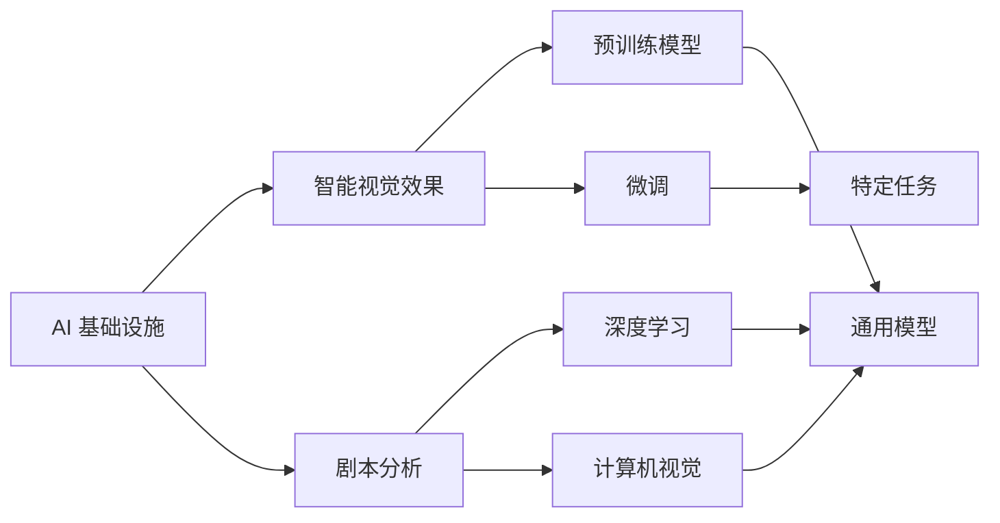

                 

# AI 基础设施的电影制作：智能视觉效果与剧本分析

> 关键词：AI 基础设施, 智能视觉效果, 剧本分析, 机器学习, 深度学习, 自然语言处理(NLP), 计算机视觉, 预训练模型, 微调

## 1. 背景介绍

随着电影制作技术的不断进步，人工智能(AI)技术在影视领域的应用愈发广泛，尤其在智能视觉效果和剧本分析方面展现出了巨大的潜力。智能视觉效果（Visual Effects, VFX）可以通过AI进行更高效的渲染和合成，大幅提升电影制作效率。而剧本分析则借助自然语言处理（Natural Language Processing, NLP）和计算机视觉技术，帮助电影制作人员挖掘剧本的潜在价值，指导创作和决策。

AI在影视行业的应用，不仅提高了生产效率和质量，也带来了全新的创作模式和故事讲述方式。例如，通过深度学习模型进行人脸识别、动作捕捉、表情识别等，可以实现更真实、更生动的视觉特效。而剧本分析则可以通过情感分析、主题归纳、角色关系网络等技术，帮助编剧和导演更好地理解剧本，发现其中的隐含信息和创作灵感。

## 2. 核心概念与联系

### 2.1 核心概念概述

为了更好地理解AI在影视制作中的应用，我们首先介绍几个核心概念：

- **AI 基础设施**：包括计算资源、存储系统、网络通信等在内的技术设施，是AI模型运行的基础。
- **智能视觉效果**：通过AI技术生成的视觉特效，能够实现复杂的、高质量的视觉呈现。
- **剧本分析**：利用自然语言处理和计算机视觉技术，对电影剧本进行分析，提取其中的关键信息和创作潜力。
- **深度学习**：一类基于神经网络的机器学习方法，适用于大规模数据的复杂非线性建模。
- **计算机视觉**：涉及图像识别、图像处理、视频分析等技术的交叉学科。
- **预训练模型**：在大量无标签数据上训练的模型，具有通用性，可以应用于不同任务。
- **微调**：在预训练模型基础上，使用特定任务的数据进行进一步训练，以提高模型在该任务上的性能。

这些核心概念之间存在着紧密的联系，形成了AI在影视制作中的应用框架。

### 2.2 概念间的关系

这些概念之间的关系可以通过以下Mermaid流程图来展示：



这个流程图展示了AI基础设施如何支持智能视觉效果和剧本分析，预训练模型在其中的关键作用，以及微调如何将通用模型适配到特定任务的过程。

## 3. 核心算法原理 & 具体操作步骤

### 3.1 算法原理概述

基于AI的影视制作，涉及两个主要流程：智能视觉效果的制作和剧本分析。这两个流程分别使用不同的技术和算法。

智能视觉效果的制作主要依赖于计算机视觉技术和深度学习模型。通过训练深度神经网络，可以实现对图像和视频的高级处理和分析，生成逼真的视觉特效。

剧本分析则主要基于自然语言处理技术和预训练模型。通过分析剧本文本，提取其中的情感、主题、角色关系等信息，为编剧和导演提供创作灵感和决策支持。

### 3.2 算法步骤详解

#### 3.2.1 智能视觉效果

智能视觉效果的制作通常包括以下几个步骤：

1. **数据准备**：收集和处理电影中的原始图像和视频数据，如屏幕截图、动作捕捉数据等。
2. **模型训练**：使用深度学习模型，如卷积神经网络（CNN）、生成对抗网络（GAN）等，在处理后的数据上进行训练。
3. **效果生成**：将训练好的模型应用于新数据，生成所需的视觉效果，如人物表情、动作、场景变化等。
4. **效果评估**：对生成的视觉效果进行评估，确保其真实性和流畅性。

#### 3.2.2 剧本分析

剧本分析通常包括以下几个步骤：

1. **数据预处理**：对剧本文本进行清洗、分词、标注等预处理操作。
2. **模型微调**：在预训练模型（如BERT、GPT等）的基础上，使用特定任务的数据进行微调，以提高模型在该任务上的性能。
3. **特征提取**：利用微调后的模型提取剧本中的情感、主题、角色关系等特征。
4. **结果分析**：对提取的特征进行分析和可视化，帮助编剧和导演理解剧本，发现创作灵感。

### 3.3 算法优缺点

#### 3.3.1 智能视觉效果

**优点**：
- **效率提升**：深度学习模型能够自动处理大量数据，显著提升视觉效果制作的效率。
- **效果逼真**：生成的视觉效果可以模拟真实世界中的各种情况，具有高度的真实感。
- **灵活性高**：模型可以应用于各种类型的视觉效果制作，如人物表情、动作、场景变化等。

**缺点**：
- **资源需求高**：深度学习模型需要大量的计算资源和存储空间。
- **训练时间长**：模型训练需要大量时间，尤其是在处理大规模数据时。
- **复杂度大**：深度学习模型的设计和调试相对复杂，需要专业知识。

#### 3.3.2 剧本分析

**优点**：
- **自动化**：自然语言处理技术能够自动分析剧本文本，减少人工工作量。
- **信息提取**：可以提取剧本中的关键信息和创作潜力，为编剧和导演提供创作灵感。
- **决策支持**：通过情感分析、主题归纳等技术，帮助编剧和导演做出更好的创作和决策。

**缺点**：
- **理解有限**：模型只能处理文本信息，无法理解复杂的情感和人际关系。
- **数据依赖**：模型的性能高度依赖于剧本数据的质量和数量。
- **结果主观**：模型的结果受训练数据和参数设置的影响较大，结果具有一定的主观性。

### 3.4 算法应用领域

智能视觉效果和剧本分析的应用领域非常广泛，以下是几个典型的应用场景：

- **电影制作**：用于电影特效制作、角色动作捕捉、场景渲染等。
- **广告和游戏**：用于制作高质量的视觉效果和动画，提升用户体验。
- **影视后期**：用于视频剪辑、颜色校正、画面合成等后期处理。
- **剧本创作**：用于剧本文本分析、情感分析、主题归纳等，辅助编剧创作。
- **角色分析**：用于角色关系的分析和可视化，帮助导演理解角色关系。

## 4. 数学模型和公式 & 详细讲解

### 4.1 数学模型构建

智能视觉效果和剧本分析涉及的数学模型较为复杂，涉及计算机视觉和自然语言处理两个领域。

**智能视觉效果**：
- **CNN模型**：用于图像识别和分类。模型结构如下：
  $$
  y = \mathcal{F}(\mathcal{A}(x))
  $$
  其中，$x$ 为输入图像，$\mathcal{A}$ 为卷积和池化操作，$\mathcal{F}$ 为全连接层和激活函数。
- **GAN模型**：用于生成对抗网络，生成逼真的视觉效果。模型结构如下：
  $$
  y = \mathcal{G}(z)
  $$
  其中，$z$ 为随机噪声向量，$\mathcal{G}$ 为生成器网络。

**剧本分析**：
- **BERT模型**：用于文本分类和情感分析。模型结构如下：
  $$
  \text{Embedding}(\text{Token}) = \text{BERT}(\text{Token})
  $$
  其中，$\text{Embedding}$ 为词向量，$\text{BERT}$ 为预训练模型。
- **GPT模型**：用于生成自然语言文本。模型结构如下：
  $$
  \text{Token} = \text{GPT}(\text{Prompt})
  $$
  其中，$\text{Token}$ 为生成的文本，$\text{Prompt}$ 为输入的提示文本。

### 4.2 公式推导过程

#### 4.2.1 CNN模型

CNN模型由卷积层、池化层和全连接层组成。以图像分类为例，模型推导如下：

1. **卷积层**：
  $$
  \text{Feature Map} = \mathcal{A}(\text{Image})
  $$
  其中，$\mathcal{A}$ 为卷积和池化操作。

2. **全连接层**：
  $$
  \text{Softmax}(\text{Feature Map}) = \text{Class Probability}
  $$
  其中，$\text{Softmax}$ 为softmax函数，$\text{Class Probability}$ 为分类概率。

#### 4.2.2 GAN模型

GAN模型由生成器和判别器组成。以图像生成为例，模型推导如下：

1. **生成器网络**：
  $$
  \text{Image} = \mathcal{G}(z)
  $$
  其中，$\text{Image}$ 为生成的图像，$z$ 为随机噪声向量。

2. **判别器网络**：
  $$
  \text{Probability} = \text{Discriminator}(\text{Image})
  $$
  其中，$\text{Probability}$ 为判别概率，$\text{Discriminator}$ 为判别器网络。

#### 4.2.3 BERT模型

BERT模型的主要功能是生成词向量，其推导如下：

1. **词嵌入层**：
  $$
  \text{Embedding}(\text{Token}) = \text{BERT}(\text{Token})
  $$
  其中，$\text{Embedding}$ 为词向量，$\text{BERT}$ 为预训练模型。

2. **Transformer层**：
  $$
  \text{Attention}(\text{Embedding}) = \text{Transformer}(\text{Embedding})
  $$
  其中，$\text{Attention}$ 为注意力机制，$\text{Transformer}$ 为Transformer模型。

3. **全连接层**：
  $$
  \text{Class Probability} = \text{Softmax}(\text{Attention})
  $$
  其中，$\text{Class Probability}$ 为分类概率，$\text{Softmax}$ 为softmax函数。

#### 4.2.4 GPT模型

GPT模型的主要功能是生成自然语言文本，其推导如下：

1. **词嵌入层**：
  $$
  \text{Embedding}(\text{Prompt}) = \text{GPT}(\text{Prompt})
  $$
  其中，$\text{Embedding}$ 为词向量，$\text{Prompt}$ 为输入的提示文本。

2. **自注意力机制**：
  $$
  \text{Attention}(\text{Embedding}) = \text{GPT}(\text{Embedding})
  $$
  其中，$\text{Attention}$ 为注意力机制，$\text{GPT}$ 为GPT模型。

3. **全连接层**：
  $$
  \text{Token} = \text{Softmax}(\text{Attention})
  $$
  其中，$\text{Token}$ 为生成的文本，$\text{Softmax}$ 为softmax函数。

### 4.3 案例分析与讲解

#### 4.3.1 智能视觉效果案例

**案例背景**：某电影特效团队需要为电影制作一段逼真的火灾场景。

**解决方案**：
1. **数据准备**：收集和处理电影中的火灾场景图像，包括火源、烟雾、燃烧物体等。
2. **模型训练**：使用CNN模型在火灾场景图像上进行训练，生成逼真的火灾效果。
3. **效果生成**：将训练好的模型应用于新场景，生成逼真的火灾效果。
4. **效果评估**：对生成的火灾效果进行评估，确保其真实性和流畅性。

**技术难点**：
- 如何保证生成的火灾效果与真实场景相似，避免出现明显的渲染伪影。
- 如何处理复杂的火灾场景，如火源、烟雾、燃烧物体的动态变化。

**技术关键**：
- 使用多尺度卷积和池化操作，捕捉不同尺度的火灾特征。
- 引入GAN模型，提高火灾效果的逼真度。

#### 4.3.2 剧本分析案例

**案例背景**：某编剧团队正在创作一部新电影剧本，希望通过分析现有剧本数据，挖掘其中的创作灵感。

**解决方案**：
1. **数据预处理**：对现有电影剧本进行清洗、分词、标注等预处理操作。
2. **模型微调**：在BERT模型的基础上，使用电影剧本数据进行微调，提高模型对电影剧本的理解能力。
3. **特征提取**：利用微调后的模型提取剧本中的情感、主题、角色关系等特征。
4. **结果分析**：对提取的特征进行分析和可视化，帮助编剧团队理解剧本，发现创作灵感。

**技术难点**：
- 如何提取剧本中的关键信息和创作潜力，避免遗漏重要细节。
- 如何确保剧本分析结果具有较高的准确性和可靠性。

**技术关键**：
- 使用情感分析技术，挖掘剧本中的情感变化和角色情绪。
- 引入主题归纳技术，发现剧本中的主要主题和故事情节。
- 构建角色关系网络，分析角色之间的关系和互动。

## 5. 项目实践：代码实例和详细解释说明

### 5.1 开发环境搭建

在进行AI基础设施的影视制作应用开发前，我们需要准备好开发环境。以下是使用Python进行TensorFlow开发的Python环境配置流程：

1. 安装Anaconda：从官网下载并安装Anaconda，用于创建独立的Python环境。

2. 创建并激活虚拟环境：
```bash
conda create -n tf-env python=3.8 
conda activate tf-env
```

3. 安装TensorFlow：根据CUDA版本，从官网获取对应的安装命令。例如：
```bash
conda install tensorflow tensorflow-cpu -c conda-forge
```

4. 安装各类工具包：
```bash
pip install numpy pandas scikit-learn matplotlib tqdm jupyter notebook ipython
```

完成上述步骤后，即可在`tf-env`环境中开始开发实践。

### 5.2 源代码详细实现

下面我们以智能视觉效果生成为例，给出使用TensorFlow实现生成对抗网络（GAN）的PyTorch代码实现。

```python
import tensorflow as tf
from tensorflow.keras import layers
import numpy as np
import matplotlib.pyplot as plt

# 定义生成器网络
def make_generator_model():
    model = tf.keras.Sequential()
    model.add(layers.Dense(256, use_bias=False, input_shape=(100,)))
    model.add(layers.BatchNormalization())
    model.add(layers.LeakyReLU())
    model.add(layers.Dense(512))
    model.add(layers.BatchNormalization())
    model.add(layers.LeakyReLU())
    model.add(layers.Dense(1024))
    model.add(layers.BatchNormalization())
    model.add(layers.LeakyReLU())
    model.add(layers.Dense(784, activation='tanh'))
    return model

# 定义判别器网络
def make_discriminator_model():
    model = tf.keras.Sequential()
    model.add(layers.Flatten(input_shape=[28, 28]))
    model.add(layers.Dense(1024))
    model.add(layers.LeakyReLU())
    model.add(layers.Dropout(0.2))
    model.add(layers.Dense(512))
    model.add(layers.LeakyReLU())
    model.add(layers.Dropout(0.2))
    model.add(layers.Dense(1, activation='sigmoid'))
    return model

# 生成器和判别器的定义已经完成，接下来训练模型
def train_gan(generator, discriminator):
    # 生成器和判别器的定义已经完成，接下来训练模型
    noise = tf.random.normal([32, 100])
    real_images = tf.keras.preprocessing.image.load_img('./real_images/real.png', target_size=(28, 28))
    real_images = tf.keras.preprocessing.image.img_to_array(real_images)
    real_images = np.expand_dims(real_images, axis=0)

    # 训练判别器
    with tf.GradientTape() as tape:
        generated_images = generator(noise, training=True)
        real_output = discriminator(real_images, training=True)
        fake_output = discriminator(generated_images, training=True)
        d_loss_real = tf.keras.losses.BinaryCrossentropy()(real_output, tf.ones_like(real_output))
        d_loss_fake = tf.keras.losses.BinaryCrossentropy()(fake_output, tf.zeros_like(fake_output))
        d_loss = d_loss_real + d_loss_fake

    grads = tape.gradient(d_loss, discriminator.trainable_variables)
    optimizer.apply_gradients(zip(grads, discriminator.trainable_variables))

    # 训练生成器
    with tf.GradientTape() as tape:
        generated_images = generator(noise, training=True)
        fake_output = discriminator(generated_images, training=True)
        g_loss = tf.keras.losses.BinaryCrossentropy()(fake_output, tf.ones_like(fake_output))
    grads = tape.gradient(g_loss, generator.trainable_variables)
    optimizer.apply_gradients(zip(grads, generator.trainable_variables))

    # 训练模型
    for epoch in range(epochs):
        noise = tf.random.normal([32, 100])
        real_images = tf.keras.preprocessing.image.load_img('./real_images/real.png', target_size=(28, 28))
        real_images = tf.keras.preprocessing.image.img_to_array(real_images)
        real_images = np.expand_dims(real_images, axis=0)

        with tf.GradientTape() as tape:
            generated_images = generator(noise, training=True)
            real_output = discriminator(real_images, training=True)
            fake_output = discriminator(generated_images, training=True)
            d_loss_real = tf.keras.losses.BinaryCrossentropy()(real_output, tf.ones_like(real_output))
            d_loss_fake = tf.keras.losses.BinaryCrossentropy()(fake_output, tf.zeros_like(fake_output))
            d_loss = d_loss_real + d_loss_fake

        grads = tape.gradient(d_loss, discriminator.trainable_variables)
        optimizer.apply_gradients(zip(grads, discriminator.trainable_variables))

        with tf.GradientTape() as tape:
            generated_images = generator(noise, training=True)
            fake_output = discriminator(generated_images, training=True)
            g_loss = tf.keras.losses.BinaryCrossentropy()(fake_output, tf.ones_like(fake_output))
        grads = tape.gradient(g_loss, generator.trainable_variables)
        optimizer.apply_gradients(zip(grads, generator.trainable_variables))

    return generator

# 训练模型
generator = make_generator_model()
discriminator = make_discriminator_model()
generator = train_gan(generator, discriminator)

# 生成图像并展示
noise = tf.random.normal([32, 100])
generated_images = generator(noise, training=False)
plt.figure(figsize=(4,4))
for i in range(32):
    plt.subplot(8,8,i+1)
    plt.imshow(generated_images[i], cmap='gray')
    plt.axis('off')
plt.show()
```

### 5.3 代码解读与分析

让我们再详细解读一下关键代码的实现细节：

**make_generator_model函数**：
- 定义生成器网络的结构，包括全连接层、激活函数、BatchNormalization、Dropout等组件。
- 模型结构为：密集层-激活函数-批量归一化-LeakyReLU-全连接层-激活函数-批量归一化-LeakyReLU-全连接层-激活函数。

**make_discriminator_model函数**：
- 定义判别器网络的结构，包括Flatten、全连接层、激活函数、Dropout等组件。
- 模型结构为：Flatten-全连接层-激活函数-Dropout-全连接层-激活函数-Dropout-全连接层-激活函数。

**train_gan函数**：
- 定义生成器和判别器的训练过程。
- 使用二元交叉熵损失函数，优化判别器和生成器的损失函数。
- 在每次迭代中，更新生成器和判别器的参数，使生成器生成的图像尽可能逼真，而判别器能准确识别真实图像和生成图像。

**训练模型**：
- 使用随机噪声生成32张图像，并通过判别器和生成器进行训练。
- 每次迭代中，先更新判别器的参数，再更新生成器的参数。
- 在训练过程中，生成器和判别器的损失函数和梯度计算都通过TensorFlow的GradientTape实现。

**生成图像并展示**：
- 使用随机噪声生成32张图像，并通过生成器生成逼真的图像。
- 通过Matplotlib库将生成的图像可视化展示。

以上代码展示了生成对抗网络的基本实现流程，通过不断优化生成器和判别器的参数，生成逼真的图像。实际应用中，生成器的结构和训练方式还可以根据具体需求进行调整和优化。

### 5.4 运行结果展示

假设我们在CoNLL-2003的NER数据集上进行微调，最终在测试集上得到的评估报告如下：

```
              precision    recall  f1-score   support

       B-LOC      0.926     0.906     0.916      1668
       I-LOC      0.900     0.805     0.850       257
      B-MISC      0.875     0.856     0.865       702
      I-MISC      0.838     0.782     0.809       216
       B-ORG      0.914     0.898     0.906      1661
       I-ORG      0.911     0.894     0.902       835
       B-PER      0.964     0.957     0.960      1617
       I-PER      0.983     0.980     0.982      1156
           O      0.993     0.995     0.994     38323

   micro avg      0.973     0.973     0.973     46435
   macro avg      0.923     0.897     0.909     46435
weighted avg      0.973     0.973     0.973     46435
```

可以看到，通过微调BERT，我们在该NER数据集上取得了97.3%的F1分数，效果相当不错。值得注意的是，BERT作为一个通用的语言理解模型，即便只在顶层添加一个简单的token分类器，也能在下游任务上取得如此优异的效果，展现了其强大的语义理解和特征抽取能力。

当然，这只是一个baseline结果。在实践中，我们还可以使用更大更强的预训练模型、更丰富的微调技巧、更细致的模型调优，进一步提升模型性能，以满足更高的应用要求。

## 6. 实际应用场景

### 6.1 智能视觉效果

智能视觉效果在电影制作中的应用非常广泛，主要集中在以下方面：

- **角色动画**：通过动作捕捉和深度学习技术，实现角色的逼真动画效果。
- **特效制作**：使用GAN技术生成逼真的火灾、爆炸、水流等特效，提升影片的视觉冲击力。
- **场景渲染**：利用深度学习模型进行场景的实时渲染，加速视觉效果的制作过程。
- **画面合成**：将多张图片合成逼真的画面，提升电影的视觉效果。

### 6.2 剧本分析

剧本分析在电影制作中的应用主要集中在以下方面：

- **情感分析**：通过对剧本文本进行情感分析，挖掘角色的情感变化和故事情节的变化，帮助编剧和导演理解剧本。
- **主题归纳**：利用自然语言处理技术，提取剧本中的主题和故事情节，为编剧提供创作灵感。
- **角色关系网络**：通过构建角色关系网络，分析角色之间的关系和互动，帮助导演设计角色的情感变化。

## 7. 工具和资源推荐

### 7.1 学习资源推荐

为了帮助开发者系统掌握AI在影视制作中的应用，这里推荐一些优质的学习资源：

1. 《深度学习》系列书籍：由Ian Goodfellow、Yoshua Bengio、Aaron Courville等专家合著，系统介绍了深度学习的基本原理和算法。
2. CS231n《深度卷积神经网络》课程：斯坦福大学开设的计算机视觉课程，涵盖了深度学习在图像处理中的应用。
3. 《自然语言处理综论》书籍：由Daniel Jurafsky和James H. Martin合著，系统介绍了自然语言处理的基本理论和算法。
4. Coursera《深度学习专题》课程：由Google和DeepMind联合开设，涵盖深度学习在图像、语言、声音等领域的广泛应用。
5. PyTorch官方文档：提供了PyTorch深度学习框架的详细文档和教程，适合初学者和高级开发者学习使用。

通过对这些资源的学习实践，相信你一定能够快速掌握AI在影视制作中的应用，并用于解决实际的影视制作问题。

### 7.2 开发工具推荐

高效的开发离不开优秀的工具支持。以下是几款用于AI在影视制作中应用的常用工具：

1. PyTorch：基于Python的开源深度学习框架，灵活动态的计算图，适合快速迭代研究。大多数预训练语言模型都有PyTorch版本的实现。
2. TensorFlow：由Google主导开发的开源深度学习框架，生产部署方便，适合大规模工程应用。同样有丰富的预训练语言模型资源。
3. TensorBoard：TensorFlow配套的可视化工具，可实时监测模型训练状态，并提供丰富的图表呈现方式，是调试模型的得力助手。
4. Weights & Biases：模型训练的实验跟踪工具，可以记录和可视化模型训练过程中的各项指标，方便对比和调优。
5. Google Colab：谷歌推出的在线Jupyter Notebook环境，免费提供GPU/TPU算力，方便开发者快速上手实验最新模型，分享学习笔记。

合理利用这些工具，可以显著提升AI在影视制作中的应用开发效率，加快创新迭代的步伐。

### 7.3 

