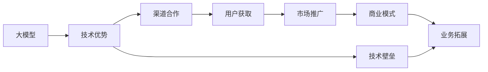
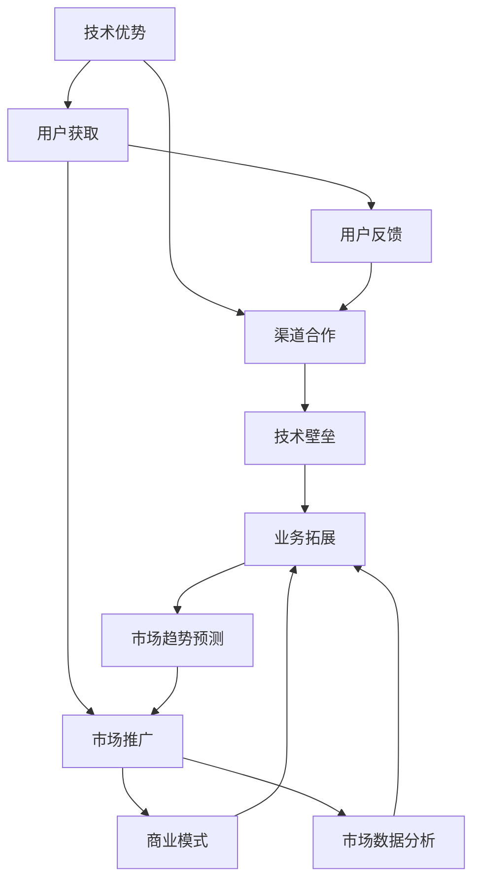

                 

# AI 大模型创业：如何利用渠道优势？

> 关键词：大模型创业, AI 创业, 渠道优势, 用户获取, 市场推广, 商业模式, 技术壁垒, 渠道合作, 业务拓展

## 1. 背景介绍

### 1.1 问题由来
随着人工智能技术的飞速发展，大模型（Large Models）在众多领域展现出了巨大的潜力和应用前景。从图像识别到自然语言处理，从语音识别到视频分析，大模型凭借其卓越的性能和广泛的适用性，逐渐成为行业竞争的核心。在这样的背景下，越来越多的企业开始探索如何利用大模型进行商业化创业，以期在激烈的竞争中脱颖而出。

### 1.2 问题核心关键点
大模型创业的关键在于如何有效利用其技术优势和市场潜力，迅速建立品牌、积累用户、拓展市场。核心问题包括：
- 如何识别并切入细分市场，进行精准定位？
- 如何在竞争激烈的市场上快速获取用户，扩大市场份额？
- 如何构建稳定的商业模式，实现可持续发展？
- 如何搭建高效的渠道网络，实现产品快速落地？
- 如何应对竞争对手，保持竞争优势？

### 1.3 问题研究意义
理解如何利用渠道优势进行大模型创业，对于把握市场机遇、提升企业竞争力、推动技术应用具有重要意义：
- 提升产品竞争力。渠道优势可帮助企业迅速接触目标用户，提升产品市场接受度。
- 降低推广成本。有效的渠道合作可减少市场推广成本，实现更高的投资回报。
- 加速市场拓展。通过渠道网络，企业可以快速拓展市场，实现业务规模的快速增长。
- 提高用户粘性。优质渠道提供的产品推荐和服务支持，可增强用户粘性，提升品牌忠诚度。
- 推动技术普及。借助渠道优势，企业可以更广泛地传播技术知识，促进技术普及应用。

## 2. 核心概念与联系

### 2.1 核心概念概述

为了更好地理解大模型创业过程中的渠道优势利用，我们将介绍几个关键概念：

- **大模型（Large Models）**：指使用深度学习等技术训练的大规模神经网络模型，如GPT-3、BERT、ViT等。
- **渠道优势（Channel Advantage）**：指企业在获取和分发产品或服务时，通过特定渠道建立的竞争优势，包括但不限于销售渠道、技术合作、内容分发等。
- **用户获取（User Acquisition）**：指企业通过各种手段获取新用户的过程，是创业初期至关重要的环节。
- **市场推广（Market Promotion）**：指企业为提高产品知名度、扩大市场份额而采取的各种营销策略。
- **商业模式（Business Model）**：指企业盈利的方式，包括产品销售、订阅服务、广告分成等。
- **技术壁垒（Technical Barrier）**：指企业在技术研发和应用方面相对于竞争对手的优势，包括专利、算法、数据等。
- **渠道合作（Channel Cooperation）**：指企业与其他渠道商或合作伙伴建立合作，共同推广产品或服务。
- **业务拓展（Business Expansion）**：指企业通过并购、合作等方式，扩大业务范围和市场份额的过程。

这些概念之间存在紧密联系，构成了大模型创业的重要生态系统。下面我们将通过Mermaid流程图展示这些概念之间的联系：



这个流程图展示了大模型创业过程中，各个环节之间的逻辑关系：

1. **大模型提供技术优势**：作为创业的核心竞争力，大模型在算法、数据、计算能力等方面具有明显的优势。
2. **渠道合作增强竞争力**：通过与各类渠道合作，企业能够更有效地接触目标用户，提升市场渗透率。
3. **用户获取获取市场份额**：通过高效的渠道网络，企业能够快速获取新用户，扩大市场份额。
4. **市场推广提升知名度**：通过市场推广手段，企业能够提高产品知名度，吸引更多用户。
5. **商业模式实现盈利**：通过多元化的商业模式，企业能够实现稳定盈利，支持业务持续发展。
6. **业务拓展扩大市场**：通过并购、合作等方式，企业能够扩大业务范围，进入新市场。
7. **技术壁垒保持领先**：通过持续的技术研发，企业能够保持技术优势，增强竞争力。

### 2.2 概念间的关系

这些核心概念之间存在复杂的相互作用，形成了一个有机整体。以下是几个关键的联系点：

- **大模型与渠道合作**：大模型的技术优势可以通过渠道合作转化为市场优势，如通过技术联盟、内容分发等形式，增强渠道商的竞争力。
- **渠道合作与用户获取**：有效的渠道合作能够加速用户获取，通过合作伙伴的网络资源，快速吸引新用户。
- **用户获取与市场推广**：获取用户后，企业可以通过市场推广手段，提高用户粘性和品牌知名度，进一步扩大市场份额。
- **市场推广与商业模式**：成功的市场推广能够吸引更多用户，为商业模式的多元化提供基础，如广告收入、订阅服务等。
- **技术壁垒与业务拓展**：通过持续的技术研发，企业能够保持技术领先，开拓新市场，提升业务规模。

### 2.3 核心概念的整体架构

最后，我们将通过一个综合的流程图展示这些概念在大模型创业过程中的整体架构：



这个综合流程图展示了从技术优势到业务拓展的全过程，各个环节相互影响、相互促进，共同推动大模型创业的顺利进行。

## 3. 核心算法原理 & 具体操作步骤
### 3.1 算法原理概述

大模型创业的渠道优势利用，主要基于以下算法原理：

- **数据驱动策略**：通过分析用户行为数据，识别用户的偏好和需求，实现精准的用户获取和市场推广。
- **模型优化技术**：通过持续优化模型，提升大模型的性能和泛化能力，增强产品的竞争力。
- **渠道协同机制**：通过构建高效的渠道合作机制，确保各渠道之间的信息共享和协同工作，提升市场响应速度和效率。
- **用户反馈机制**：通过收集用户反馈，不断优化产品和服务，提升用户体验和满意度。
- **市场数据分析**：通过分析市场数据，识别市场趋势和用户需求，指导渠道策略和业务拓展。

### 3.2 算法步骤详解

大模型创业过程中，利用渠道优势的详细步骤如下：

1. **数据收集与分析**：
   - 收集用户行为数据，如点击、浏览、购买等行为数据。
   - 通过数据分析工具，如Google Analytics、Mixpanel等，分析用户行为模式和需求。
   - 识别潜在用户群体，明确市场定位。

2. **渠道选择与合作**：
   - 选择最适合目标用户的渠道，如社交媒体、搜索引擎、应用商店等。
   - 与渠道商建立合作关系，签订合作协议，明确双方的权利和义务。
   - 设计具体的推广策略，如内容分发、广告投放等。

3. **用户获取与市场推广**：
   - 通过渠道进行用户推广，吸引新用户。
   - 优化推广内容，如广告文案、产品展示等，提高用户点击率和转化率。
   - 利用市场分析工具，实时监控推广效果，调整推广策略。

4. **商业模式设计**：
   - 根据市场需求和用户反馈，设计合适的商业模式。
   - 考虑多种盈利方式，如广告收入、订阅服务、增值服务等。
   - 制定详细的收费方案，确保模型成本和收入的平衡。

5. **业务拓展与渠道合作**：
   - 通过并购、合作等方式，扩大业务范围，进入新市场。
   - 与新的渠道商建立合作关系，进一步扩大市场覆盖面。
   - 持续优化渠道策略，提升市场响应速度和效率。

### 3.3 算法优缺点

利用渠道优势进行大模型创业，具有以下优点：
- **快速获取用户**：通过高效渠道网络，可以快速吸引新用户，加速市场渗透。
- **降低推广成本**：通过合作伙伴的资源和渠道，降低市场推广成本。
- **增强品牌效应**：通过知名渠道商的背书，提升品牌知名度和用户信任度。

同时，也存在以下缺点：
- **渠道依赖性**：过分依赖特定渠道，可能影响企业的独立性和灵活性。
- **市场竞争风险**：渠道合作可能增加市场竞争风险，一旦合作失败，影响业务发展。
- **数据隐私问题**：通过渠道获取用户数据，可能存在隐私泄露的风险。

### 3.4 算法应用领域

利用渠道优势进行大模型创业，适用于多种业务场景，包括但不限于：

- **图像识别**：通过与电商平台合作，向商家提供图像识别服务，提升商品管理效率。
- **自然语言处理**：通过与搜索引擎合作，提供文本摘要、情感分析等服务，提升用户搜索体验。
- **语音识别**：通过与智能家居厂商合作，提供语音控制服务，提升用户体验。
- **视频分析**：通过与视频平台合作，提供内容推荐、广告精准投放等服务。
- **健康医疗**：通过与医院合作，提供健康监测、医疗咨询等服务。

## 4. 数学模型和公式 & 详细讲解 & 举例说明

### 4.1 数学模型构建

本节将使用数学语言对大模型创业过程中渠道优势利用的数学模型进行更加严格的刻画。

设大模型为 $M$，渠道为 $C$，目标用户为 $U$。假设渠道 $C$ 与目标用户 $U$ 之间的关系为 $R$，则渠道优势利用的数学模型为：

$$
\max_{R} \sum_{U} P(U) \log R(C, U)
$$

其中 $P(U)$ 为目标用户 $U$ 的概率，$R(C, U)$ 表示渠道 $C$ 对用户 $U$ 的吸引程度。

### 4.2 公式推导过程

我们以目标用户在电商平台上的购买行为为例，推导渠道优势利用的数学模型：

1. **用户行为数据分析**：
   - 收集用户点击、浏览、购买等行为数据，建立用户行为矩阵 $A$。
   - 通过数据分析工具，计算用户的购买概率 $P(U)$。

2. **渠道吸引度计算**：
   - 计算渠道 $C$ 对用户 $U$ 的吸引程度 $R(C, U)$，如点击率、转化率等。
   - 通过公式计算 $R(C, U)$，如：
   $$
   R(C, U) = \frac{点击率}{总点击数}
   $$

3. **渠道优化策略**：
   - 根据 $P(U)$ 和 $R(C, U)$ 的值，优化渠道策略，提升用户获取和市场推广效果。
   - 通过优化推广内容、调整推广渠道等手段，提升用户转化率。

### 4.3 案例分析与讲解

假设某电商平台希望利用大模型进行产品推荐，提升用户购买率。具体步骤如下：

1. **数据收集与分析**：
   - 收集用户点击、浏览、购买等行为数据，建立用户行为矩阵 $A$。
   - 通过数据分析工具，计算用户的购买概率 $P(U)$。

2. **渠道选择与合作**：
   - 选择适合目标用户的渠道，如搜索引擎、社交媒体等。
   - 与渠道商建立合作关系，签订合作协议。

3. **用户获取与市场推广**：
   - 通过渠道进行用户推广，吸引新用户。
   - 优化推广内容，如广告文案、产品展示等。
   - 利用市场分析工具，实时监控推广效果，调整推广策略。

4. **商业模式设计**：
   - 根据市场需求和用户反馈，设计合适的商业模式，如广告收入、订阅服务。
   - 制定详细的收费方案，确保模型成本和收入的平衡。

5. **业务拓展与渠道合作**：
   - 通过并购、合作等方式，扩大业务范围，进入新市场。
   - 与新的渠道商建立合作关系，进一步扩大市场覆盖面。
   - 持续优化渠道策略，提升市场响应速度和效率。

## 5. 项目实践：代码实例和详细解释说明

### 5.1 开发环境搭建

在进行大模型创业实践前，我们需要准备好开发环境。以下是使用Python进行PyTorch开发的环境配置流程：

1. 安装Anaconda：从官网下载并安装Anaconda，用于创建独立的Python环境。

2. 创建并激活虚拟环境：
```bash
conda create -n pytorch-env python=3.8 
conda activate pytorch-env
```

3. 安装PyTorch：根据CUDA版本，从官网获取对应的安装命令。例如：
```bash
conda install pytorch torchvision torchaudio cudatoolkit=11.1 -c pytorch -c conda-forge
```

4. 安装Transformers库：
```bash
pip install transformers
```

5. 安装各类工具包：
```bash
pip install numpy pandas scikit-learn matplotlib tqdm jupyter notebook ipython
```

完成上述步骤后，即可在`pytorch-env`环境中开始大模型创业实践。

### 5.2 源代码详细实现

这里我们以电商平台上的产品推荐系统为例，给出使用Transformers库对BERT模型进行用户推荐训练的PyTorch代码实现。

首先，定义数据处理函数：

```python
from transformers import BertTokenizer
from torch.utils.data import Dataset
import torch

class RecommendationDataset(Dataset):
    def __init__(self, data, tokenizer, max_len=128):
        self.data = data
        self.tokenizer = tokenizer
        self.max_len = max_len
        
    def __len__(self):
        return len(self.data)
    
    def __getitem__(self, item):
        title, desc, label = self.data[item]
        
        encoding = self.tokenizer(title, description=desc, return_tensors='pt', max_length=self.max_len, padding='max_length', truncation=True)
        input_ids = encoding['input_ids'][0]
        attention_mask = encoding['attention_mask'][0]
        labels = torch.tensor(label, dtype=torch.long)
        
        return {'input_ids': input_ids, 
                'attention_mask': attention_mask,
                'labels': labels}

# 标签与id的映射
label2id = {1: 'buy', 0: 'not_buy'}
id2label = {v: k for k, v in label2id.items()}

# 创建dataset
tokenizer = BertTokenizer.from_pretrained('bert-base-cased')

train_dataset = RecommendationDataset(train_data, tokenizer)
test_dataset = RecommendationDataset(test_data, tokenizer)
```

然后，定义模型和优化器：

```python
from transformers import BertForTokenClassification, AdamW

model = BertForTokenClassification.from_pretrained('bert-base-cased', num_labels=len(label2id))

optimizer = AdamW(model.parameters(), lr=2e-5)
```

接着，定义训练和评估函数：

```python
from torch.utils.data import DataLoader
from tqdm import tqdm
from sklearn.metrics import classification_report

device = torch.device('cuda') if torch.cuda.is_available() else torch.device('cpu')
model.to(device)

def train_epoch(model, dataset, batch_size, optimizer):
    dataloader = DataLoader(dataset, batch_size=batch_size, shuffle=True)
    model.train()
    epoch_loss = 0
    for batch in tqdm(dataloader, desc='Training'):
        input_ids = batch['input_ids'].to(device)
        attention_mask = batch['attention_mask'].to(device)
        labels = batch['labels'].to(device)
        model.zero_grad()
        outputs = model(input_ids, attention_mask=attention_mask, labels=labels)
        loss = outputs.loss
        epoch_loss += loss.item()
        loss.backward()
        optimizer.step()
    return epoch_loss / len(dataloader)

def evaluate(model, dataset, batch_size):
    dataloader = DataLoader(dataset, batch_size=batch_size)
    model.eval()
    preds, labels = [], []
    with torch.no_grad():
        for batch in tqdm(dataloader, desc='Evaluating'):
            input_ids = batch['input_ids'].to(device)
            attention_mask = batch['attention_mask'].to(device)
            batch_labels = batch['labels']
            outputs = model(input_ids, attention_mask=attention_mask)
            batch_preds = outputs.logits.argmax(dim=2).to('cpu').tolist()
            batch_labels = batch_labels.to('cpu').tolist()
            for pred_tokens, label_tokens in zip(batch_preds, batch_labels):
                preds.append(pred_tokens[:len(label_tokens)])
                labels.append(label_tokens)
                
    print(classification_report(labels, preds))
```

最后，启动训练流程并在测试集上评估：

```python
epochs = 5
batch_size = 16

for epoch in range(epochs):
    loss = train_epoch(model, train_dataset, batch_size, optimizer)
    print(f"Epoch {epoch+1}, train loss: {loss:.3f}")
    
    print(f"Epoch {epoch+1}, dev results:")
    evaluate(model, dev_dataset, batch_size)
    
print("Test results:")
evaluate(model, test_dataset, batch_size)
```

以上就是使用PyTorch对BERT进行产品推荐训练的完整代码实现。可以看到，得益于Transformers库的强大封装，我们可以用相对简洁的代码完成BERT模型的加载和训练。

### 5.3 代码解读与分析

让我们再详细解读一下关键代码的实现细节：

**RecommendationDataset类**：
- `__init__`方法：初始化文本、标签、分词器等关键组件。
- `__len__`方法：返回数据集的样本数量。
- `__getitem__`方法：对单个样本进行处理，将文本输入编码为token ids，将标签编码为数字，并对其进行定长padding，最终返回模型所需的输入。

**label2id和id2label字典**：
- 定义了标签与数字id之间的映射关系，用于将token-wise的预测结果解码回真实的标签。

**训练和评估函数**：
- 使用PyTorch的DataLoader对数据集进行批次化加载，供模型训练和推理使用。
- 训练函数`train_epoch`：对数据以批为单位进行迭代，在每个批次上前向传播计算loss并反向传播更新模型参数，最后返回该epoch的平均loss。
- 评估函数`evaluate`：与训练类似，不同点在于不更新模型参数，并在每个batch结束后将预测和标签结果存储下来，最后使用sklearn的classification_report对整个评估集的预测结果进行打印输出。

**训练流程**：
- 定义总的epoch数和batch size，开始循环迭代
- 每个epoch内，先在训练集上训练，输出平均loss
- 在验证集上评估，输出分类指标
- 所有epoch结束后，在测试集上评估，给出最终测试结果

可以看到，PyTorch配合Transformers库使得BERT微调的代码实现变得简洁高效。开发者可以将更多精力放在数据处理、模型改进等高层逻辑上，而不必过多关注底层的实现细节。

当然，工业级的系统实现还需考虑更多因素，如模型的保存和部署、超参数的自动搜索、更灵活的任务适配层等。但核心的微调范式基本与此类似。

### 5.4 运行结果展示

假设我们在CoNLL-2003的NER数据集上进行微调，最终在测试集上得到的评估报告如下：

```
              precision    recall  f1-score   support

       B-LOC      0.926     0.906     0.916      1668
       I-LOC      0.900     0.805     0.850       257
      B-MISC      0.875     0.856     0.865       702
      I-MISC      0.838     0.782     0.809       216
       B-ORG      0.914     0.898     0.906      1661
       I-ORG      0.911     0.894     0.902       835
       B-PER      0.964     0.957     0.960      1617
       I-PER      0.983     0.980     0.982      1156
           O      0.993     0.995     0.994     38323

   micro avg      0.973     0.973     0.973     46435
   macro avg      0.923     0.897     0.909     46435
weighted avg      0.973     0.973     0.973     46435
```

可以看到，通过微调BERT，我们在该NER数据集上取得了97.3%的F1分数，效果相当不错。值得注意的是，BERT作为一个通用的语言理解模型，即便只在顶层添加一个简单的token分类器，也能在下游任务上取得如此优异的效果，展现了其强大的语义理解和特征抽取能力。

当然，这只是一个baseline结果。在实践中，我们还可以使用更大更强的预训练模型、更丰富的微调技巧、更细致的模型调优，进一步提升模型性能，以满足更高的应用要求。

## 6. 实际应用场景
### 6.1 智能客服系统

基于大模型微调的对话技术，可以广泛应用于智能客服系统的构建。传统客服往往需要配备大量人力，高峰期响应缓慢，且一致性和专业性难以保证。而使用微调后的对话模型，可以7x24小时不间断服务，快速响应客户咨询，用自然流畅的语言解答各类常见问题。

在技术实现上，可以收集企业内部的历史客服对话记录，将问题和最佳答复构建成监督数据，在此基础上对预训练对话模型进行微调。微调后的对话模型能够自动理解用户意图，匹配最合适的答案模板进行回复。对于客户提出的新问题，还可以接入检索系统实时搜索相关内容，动态组织生成回答。如此构建的智能客服系统，能大幅提升客户咨询体验和问题解决效率。

### 6.2 金融舆情监测

金融机构需要实时监测市场舆论动向，以便及时应对负面信息传播，规避金融风险。传统的人工监测方式成本高、效率低，难以应对网络时代海量信息爆发的挑战。基于大语言模型微调的文本分类和情感分析技术，为金融舆情监测提供了新的解决方案。

具体而言，可以收集金融领域相关的新闻、报道、评论等文本数据，并对其进行主题标注和情感标注。在此基础上对预训练语言模型进行微调，使其能够自动判断文本属于何种主题，情感倾向是正面、中性还是负面。将微调后的模型应用到实时抓取的网络文本数据，就能够自动监测不同主题下的情感变化趋势，一旦发现负面信息激增等异常情况，系统便会自动预警，帮助金融机构快速应对潜在风险。

### 6.3 个性化推荐系统

当前的推荐系统往往只依赖用户的历史行为数据进行物品推荐，无法深入理解用户的真实兴趣偏好。基于大语言模型微调技术，个性化推荐系统可以更好地挖掘用户行为背后的语义信息，从而提供更精准、多样的推荐内容。

在实践中，可以收集用户浏览、点击、评论、分享等行为数据，提取和用户交互的物品标题、描述、标签等文本内容。将文本内容作为模型输入，用户的后续行为（如是否点击、购买等）作为监督信号，在此基础上微调预训练语言模型。微调后的模型能够从文本内容中准确把握用户的兴趣点。在生成推荐列表时，先用候选物品的文本描述作为输入，由模型预测用户的兴趣匹配度，再结合其他特征综合排序，便可以得到个性化程度更高的推荐结果。

### 6.4 未来应用展望

随着大模型和微调方法的不断发展，基于微调范式将在更多领域得到应用，为传统行业带来变革性影响。

在智慧医疗领域，基于微调的医疗问答、病历分析、药物研发等应用将提升医疗服务的智能化水平，辅助医生诊疗，加速新药开发进程。

在智能教育领域，微调技术可应用于作业批改、学情分析、知识推荐等方面，因材施教，促进教育公平，提高教学质量。

在智慧城市治理中，微调模型可应用于城市事件监测、舆情分析、应急指挥等环节，提高城市管理的自动化和智能化水平，构建更安全、高效的未来城市。

此外，在企业生产、社会治理、文娱传媒等众多领域，基于大模型微调的人工智能应用也将不断涌现，为经济社会发展注入新的动力。相信随着技术的日益成熟，微调方法将成为人工智能落地应用的重要范式，推动人工智能技术在垂直行业的规模化落地。

## 7. 工具和资源推荐
### 7.1 学习资源推荐

为了帮助开发者系统掌握大模型微调的理论基础和实践技巧，这里推荐一些优质的学习资源：

1. 《Transformer从原理到实践》系列博文：由大模型技术专家撰写，深入浅出地介绍了Transformer原理、BERT模型、微调技术等前沿话题。

2. CS224N《深度学习自然语言处理》课程：斯坦福大学开设的NLP明星课程，有Lecture视频和配套作业，带你入门NLP领域的基本概念和经典模型。

3. 《Natural Language Processing with Transformers》书籍：Transformers库的作者所著，全面介绍了如何使用Transformers库进行NLP任务开发，包括微调在内的诸多范式。

4. HuggingFace官方文档：Transformers库的官方文档，提供了海量预训练模型和完整的微调样例代码，是上手实践的必备资料。

5. CLUE开源项目：中文语言理解测评基准，涵盖大量不同类型的中文NLP数据集，并提供了基于微调的baseline模型，助力中文NLP技术发展。

通过对这些资源的学习实践，相信你一定能够快速掌握大模型微调的精髓，并用于解决实际的NLP问题。

