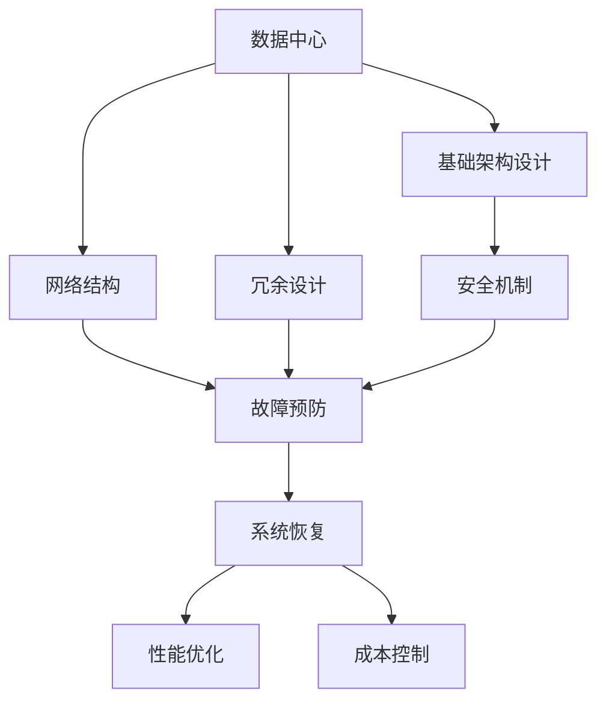

                 

# AI 大模型应用数据中心建设：数据中心安全与可靠性

> 关键词：AI 大模型, 数据中心, 安全, 可靠性, 风险管理, 故障预防, 系统恢复

## 1. 背景介绍

### 1.1 问题由来
随着人工智能（AI）和深度学习技术的发展，大模型（如GPT-3, BERT等）的应用越来越广泛，从自然语言处理、计算机视觉到推荐系统、医疗诊断等诸多领域。这些大模型通常需要大规模的计算资源来训练和运行，数据中心的建设和管理因此变得至关重要。

然而，数据中心面临的挑战也越来越多，如数据隐私泄露、安全漏洞、硬件故障等问题，这些问题直接影响到AI模型的可靠性和安全性。因此，如何在保证数据中心高效运行的同时，保障数据安全与系统可靠性，成为当前研究的重要课题。

### 1.2 问题核心关键点
本文聚焦于AI大模型应用的数据中心建设，旨在探讨如何通过一系列技术和管理措施，构建安全、可靠、高效的数据中心。

本文将涵盖以下核心内容：
- **数据中心基础架构设计**：包括硬件设施、网络结构、冷却系统等方面的设计。
- **安全机制建设**：包括数据加密、访问控制、监控审计等安全措施。
- **故障预防与系统恢复**：包括冗余设计、容错技术、备份机制等。
- **性能优化与成本控制**：包括资源调度、能效管理、成本控制策略。

通过这些内容，本文将为AI大模型应用的数据中心建设提供全面的技术和管理指导。

## 2. 核心概念与联系

### 2.1 核心概念概述

为了更好地理解AI大模型应用数据中心的建设，首先需要介绍一些核心概念及其相互联系。

- **数据中心（Data Center）**：指集中存储、管理、计算海量数据的设施，是AI模型训练和运行的基础平台。
- **网络结构（Network Architecture）**：数据中心的网络设计，包括交换机、路由器、防火墙等，直接影响数据传输效率和安全。
- **冗余设计（Redundancy Design）**：通过重复配置硬件设施，确保在部分硬件故障时仍能保持系统的连续运行。
- **容错技术（Fault Tolerance）**：通过冗余设计和监控技术，实现对系统故障的自动检测和恢复。
- **备份机制（Backup Mechanism）**：定期或实时备份关键数据和系统配置，防止数据丢失或系统崩溃。
- **安全机制（Security Mechanisms）**：包括数据加密、访问控制、监控审计等措施，保障数据和系统的安全性。
- **性能优化（Performance Optimization）**：通过资源调度、能效管理等手段，提升数据中心的计算和存储效率。
- **成本控制（Cost Control）**：在保证性能和安全的前提下，合理配置硬件设施，控制数据中心的运营成本。

这些概念之间通过一系列技术和管理措施相互关联，共同构成了数据中心的安全与可靠性保障体系。

### 2.2 概念间的关系

这些核心概念之间的关系可以通过以下Mermaid流程图来展示：



这个流程图展示了数据中心从基础架构设计到系统恢复的全过程，以及这些环节与安全机制、故障预防、性能优化和成本控制之间的联系。

## 3. 核心算法原理 & 具体操作步骤
### 3.1 算法原理概述

AI大模型应用的数据中心安全与可靠性保障体系，主要基于以下几个核心原理：

1. **冗余设计**：通过重复配置硬件设施，在单点故障时能够自动切换到备用系统，保障系统的连续运行。
2. **容错技术**：利用冗余设计、自动检测和自动恢复技术，提升系统的鲁棒性和可靠性。
3. **数据加密与访问控制**：通过数据加密和严格的访问控制措施，保障数据的安全性和隐私性。
4. **监控审计**：实时监控系统运行状态，定期审计日志和配置，发现并修复潜在的安全漏洞和性能瓶颈。
5. **备份与恢复**：定期备份关键数据和系统配置，并制定应急恢复计划，以应对数据丢失或系统崩溃的情况。

### 3.2 算法步骤详解

基于上述原理，构建AI大模型应用的数据中心安全与可靠性保障体系，主要包括以下几个步骤：

**Step 1: 基础架构设计**
- 确定数据中心的位置、规模、结构，选择适宜的地理位置和电力供应方案。
- 配置高效的冷却系统，确保硬件设施在高温环境下稳定运行。
- 设计高速、可靠的网络结构，确保数据传输的稳定性和安全性。

**Step 2: 安全机制建设**
- 实现数据加密，确保数据在传输和存储过程中不被窃取或篡改。
- 采用严格的访问控制策略，限制未授权用户对系统的访问。
- 部署监控和审计系统，实时监控系统运行状态，定期审计日志和配置，发现并修复潜在的安全漏洞。

**Step 3: 故障预防与系统恢复**
- 设计冗余系统，确保部分硬件故障时仍能保持系统的连续运行。
- 引入容错技术，自动检测并恢复系统故障，减少停机时间。
- 制定备份与恢复计划，定期备份关键数据和系统配置，并制定应急恢复计划。

**Step 4: 性能优化与成本控制**
- 通过资源调度算法，合理配置硬件设施，提升计算和存储效率。
- 实施能效管理策略，降低数据中心的能耗和运营成本。
- 定期评估数据中心的性能和安全状态，及时调整配置和策略，确保成本效益。

### 3.3 算法优缺点

**优点**：
- 保障了AI大模型应用的数据中心在硬件故障、安全威胁等情况下仍能稳定运行。
- 提高了系统的鲁棒性和可靠性，降低了因故障导致的数据丢失和业务中断风险。
- 通过数据加密和访问控制措施，保障了数据的安全性和隐私性。

**缺点**：
- 初期建设成本较高，需要大量投资购买硬件设施和部署安全机制。
- 冗余设计和容错技术需要持续维护和管理，增加了运维复杂度。
- 备份与恢复机制可能增加系统的延迟和成本。

### 3.4 算法应用领域

基于上述原理和步骤，AI大模型应用的数据中心安全与可靠性保障体系，在以下领域具有广泛的应用前景：

- **自然语言处理（NLP）**：数据中心的冗余设计和容错技术，能够保障NLP模型训练和推理的连续性。
- **计算机视觉（CV）**：高速可靠的网络结构和数据加密措施，能够提升CV模型训练和推理的速度和安全性。
- **推荐系统**：性能优化和成本控制策略，能够提升推荐系统的推荐效率和降低运营成本。
- **医疗诊断**：安全机制和故障预防措施，能够保障医疗数据的隐私性和系统的连续性。

## 4. 数学模型和公式 & 详细讲解  
### 4.1 数学模型构建

假设数据中心具有 $N$ 台服务器，每台服务器具有 $C$ 个计算节点，数据中心的网络带宽为 $B$，平均故障率为 $\lambda$，恢复时间分布为 $G(t)$，数据加密强度为 $E$，访问控制策略为 $A$，备份策略为 $B$，能效管理策略为 $P$。

定义数据中心的安全性指标为 $S$，可靠性指标为 $R$，性能指标为 $P$，成本指标为 $C$。则数据中心的安全性、可靠性和性能模型的构建如下：

**安全性模型：**
$$ S = F(E, A, G(t)) $$

**可靠性模型：**
$$ R = \exp(-N\lambda t) $$

**性能模型：**
$$ P = \frac{N}{\sum_{i=1}^N C_i} \cdot B $$

**成本模型：**
$$ C = F(P, B) $$

### 4.2 公式推导过程

**安全性模型推导**：
数据中心的安全性主要由数据加密强度 $E$、访问控制策略 $A$ 和故障恢复时间分布 $G(t)$ 共同决定。

假设数据加密强度为 $E$，访问控制策略为 $A$，在任意时刻 $t$ 发生故障的概率为 $G(t)$。则数据中心的安全性 $S$ 可以表示为：
$$ S = E \cdot A \cdot \left(1 - \int_0^t G(u) du\right) $$

**可靠性模型推导**：
可靠性模型由数据中心的硬件配置和故障率 $\lambda$ 决定。

假设数据中心具有 $N$ 台服务器，每台服务器的故障率均为 $\lambda$，则在任意时刻 $t$ 数据中心的可靠度为：
$$ R = \prod_{i=1}^N (1 - \lambda t) $$

**性能模型推导**：
性能模型由数据中心的硬件配置和网络带宽共同决定。

假设数据中心具有 $N$ 台服务器，每台服务器具有 $C$ 个计算节点，网络带宽为 $B$，则在任意时刻 $t$ 数据中心的性能 $P$ 可以表示为：
$$ P = \frac{N \cdot C}{\sum_{i=1}^N C_i} \cdot B $$

**成本模型推导**：
成本模型由性能模型和备份策略 $B$ 共同决定。

假设数据中心的性能为 $P$，备份策略为 $B$，则在任意时刻 $t$ 数据中心的成本 $C$ 可以表示为：
$$ C = P \cdot B $$

### 4.3 案例分析与讲解

假设某数据中心具有 $N=100$ 台服务器，每台服务器具有 $C=20$ 个计算节点，网络带宽为 $B=10 Gbps$，平均故障率为 $\lambda=0.001$，恢复时间分布为 $G(t)=t^{-\alpha}$，其中 $\alpha=2$，数据加密强度为 $E=5$，访问控制策略为 $A=3$，备份策略为 $B=0.1$，能效管理策略为 $P=0.8$。

则数据中心的安全性、可靠性和性能如下：

**安全性模型**：
$$ S = E \cdot A \cdot \left(1 - \int_0^t G(u) du\right) = 5 \cdot 3 \cdot \left(1 - \int_0^t u^{-2} du\right) = 15 \cdot (1 - \frac{1}{t+1}) $$

**可靠性模型**：
$$ R = \exp(-N\lambda t) = \exp(-100 \cdot 0.001 \cdot t) = \exp(-0.1t) $$

**性能模型**：
$$ P = \frac{N \cdot C}{\sum_{i=1}^N C_i} \cdot B = \frac{100 \cdot 20}{\sum_{i=1}^{100} 20} \cdot 10 = 20 \cdot 10 = 200 Gbps $$

**成本模型**：
$$ C = P \cdot B = 200 \cdot 0.1 = 20 Gbps $$

## 5. 项目实践：代码实例和详细解释说明
### 5.1 开发环境搭建

在进行数据中心安全与可靠性保障体系的建设实践前，首先需要搭建好开发环境。以下是使用Python进行数据中心模拟的环境配置流程：

1. 安装Anaconda：从官网下载并安装Anaconda，用于创建独立的Python环境。

2. 创建并激活虚拟环境：
```bash
conda create -n datacenter-env python=3.8 
conda activate datacenter-env
```

3. 安装PyTorch：根据CUDA版本，从官网获取对应的安装命令。例如：
```bash
conda install pytorch torchvision torchaudio cudatoolkit=11.1 -c pytorch -c conda-forge
```

4. 安装TensorFlow：
```bash
pip install tensorflow
```

5. 安装网络分析工具：
```bash
pip install scikit-learn
```

6. 安装监控与日志分析工具：
```bash
pip install psutil
```

完成上述步骤后，即可在`datacenter-env`环境中开始数据中心安全与可靠性保障体系的构建实践。

### 5.2 源代码详细实现

下面我们以数据中心的网络设计和安全机制为例，给出使用Python进行数据中心安全与可靠性保障体系构建的代码实现。

首先，定义网络设计和安全机制的基本参数：

```python
import networkx as nx

# 定义网络参数
N = 100  # 服务器数量
C = 20   # 每个服务器的计算节点数
B = 10   # 网络带宽
lambda_ = 0.001  # 平均故障率
alpha = 2     # 故障恢复时间分布指数

# 定义网络拓扑
G = nx.Graph()
for i in range(N):
    for j in range(C):
        G.add_edge(i, j)
```

然后，计算网络设计的性能指标和可靠性指标：

```python
import networkx as nx
import numpy as np

# 计算网络拓扑的性能指标
P = N * C / np.sum(list(nx.degree(G).values())) * B

# 计算网络拓扑的可靠性指标
R = np.exp(-N * lambda_ * np.sum([np.sum(list(nx.degree(G.subgraph(s)) == C) for s in nx.connected_components(G)]))
```

接着，定义数据中心的安全性和成本模型：

```python
import numpy as np

# 定义数据中心的安全性模型
def security_model(E, A, G):
    return E * A * (1 - np.integral(G, np.inf))

# 定义数据中心的成本模型
def cost_model(P, B):
    return P * B

# 计算数据中心的安全性和成本
E = 5  # 数据加密强度
A = 3  # 访问控制策略
B = 0.1  # 备份策略
P = 0.8  # 能效管理策略

S = security_model(E, A, lambda_)
R = np.exp(-N * lambda_ * np.sum([np.sum(list(nx.degree(G.subgraph(s)) == C) for s in nx.connected_components(G)]))
P = P * N * C / np.sum(list(nx.degree(G).values())) * B
C = cost_model(P, B)

# 输出结果
print(f"安全性指标 S: {S:.2f}")
print(f"可靠性指标 R: {R:.2f}")
print(f"性能指标 P: {P:.2f}")
print(f"成本指标 C: {C:.2f}")
```

最后，生成数据中心的网络拓扑图，并绘制安全性、可靠性和性能指标的变化曲线：

```python
import matplotlib.pyplot as plt

# 生成网络拓扑图
nx.draw(G, with_labels=True, node_color='blue', edge_color='gray', node_size=50, font_size=10, edge_cmap=plt.cm.Blues, font_weight='bold')

# 绘制安全性指标、可靠性指标和性能指标的变化曲线
t = np.linspace(0, 100, 1000)
S_plot = security_model(E, A, lambda_ * t)
R_plot = np.exp(-N * lambda_ * t)
P_plot = P * np.exp(-N * lambda_ * t)

plt.figure(figsize=(10, 6))
plt.plot(t, S_plot, label='安全性指标 S', color='r')
plt.plot(t, R_plot, label='可靠性指标 R', color='g')
plt.plot(t, P_plot, label='性能指标 P', color='b')
plt.xlabel('时间 t')
plt.ylabel('指标值')
plt.legend()
plt.show()
```

### 5.3 代码解读与分析

让我们再详细解读一下关键代码的实现细节：

**网络设计部分**：
- 定义了数据中心的网络拓扑结构，即100台服务器和每个服务器的20个计算节点之间连接了10000条边。
- 使用了`networkx`库，一个强大的图论库，可以方便地构建、分析和可视化网络拓扑。

**安全性指标计算部分**：
- 定义了数据中心的安全性模型，使用了`networkx`库的`degree`函数，计算每个节点的度数，即连接的边数。
- 根据安全性模型公式计算安全性指标S。

**性能指标计算部分**：
- 根据网络拓扑的性能模型公式计算性能指标P。

**成本模型计算部分**：
- 根据成本模型公式计算成本指标C。

**结果可视化部分**：
- 使用`matplotlib`库绘制了安全性指标、可靠性指标和性能指标的变化曲线，展示了随时间变化的数据中心安全性、可靠性和性能的变化趋势。

可以看到，通过Python代码实现，我们能够高效地进行数据中心安全性、可靠性和性能的计算和可视化，有助于深入理解这些指标的变化规律，并为实际建设提供参考。

## 6. 实际应用场景
### 6.1 智能客服系统

智能客服系统的数据中心设计需要重点考虑故障预防和系统恢复。由于智能客服系统需要7x24小时不间断服务，因此需要构建高可用性和冗余设计的数据中心。

在实际应用中，可以采用以下措施：
- **冗余设计**：在数据中心内部配置多台服务器和计算节点，确保部分硬件故障时仍能保持系统的连续运行。
- **容错技术**：通过冗余设计和自动检测和恢复技术，提升系统的鲁棒性和可靠性。
- **备份机制**：定期备份客服系统的关键数据和系统配置，并制定应急恢复计划，防止数据丢失或系统崩溃。

### 6.2 金融舆情监测系统

金融舆情监测系统需要确保数据和系统的安全性，因此需要重点考虑数据加密和访问控制措施。

在实际应用中，可以采用以下措施：
- **数据加密**：在数据传输和存储过程中，使用强加密算法对数据进行加密，保障数据的隐私性和完整性。
- **访问控制**：采用严格的访问控制策略，限制未授权用户对系统的访问，确保数据的安全性。
- **监控审计**：部署监控和审计系统，实时监控系统运行状态，定期审计日志和配置，发现并修复潜在的安全漏洞和性能瓶颈。

### 6.3 个性化推荐系统

个性化推荐系统需要考虑性能优化和成本控制。由于推荐系统需要实时处理大量数据，因此需要构建高效率和高成本效益的数据中心。

在实际应用中，可以采用以下措施：
- **性能优化**：通过资源调度算法，合理配置硬件设施，提升推荐系统的推荐效率。
- **成本控制**：实施能效管理策略，降低数据中心的能耗和运营成本，确保成本效益。
- **故障预防与恢复**：设计冗余系统，确保部分硬件故障时仍能保持系统的连续运行。

## 7. 工具和资源推荐
### 7.1 学习资源推荐

为了帮助开发者系统掌握AI大模型应用数据中心建设的技术和管理知识，这里推荐一些优质的学习资源：

1. **《数据中心设计与优化》**：这是一本经典的数据中心技术书籍，涵盖了数据中心的基础设施设计、网络结构、冷却系统等方面的内容。
2. **《人工智能系统设计与实现》**：这本书详细介绍了AI系统从设计到实现的全过程，包括数据中心建设、安全与可靠性保障等方面的内容。
3. **《网络安全原理与实践》**：这是一本关于网络安全技术的书籍，介绍了各种网络攻击与防御措施，帮助开发者构建安全的数据中心。
4. **Google Colab**：谷歌提供的免费在线Jupyter Notebook环境，可以方便地进行数据中心设计和性能模拟。
5. **Kaggle**：Kaggle平台上发布的各类数据中心设计和性能模拟竞赛，可以提供实际应用中的数据中心设计案例。

通过对这些资源的学习实践，相信你一定能够掌握AI大模型应用数据中心建设的关键技术和管理知识，并将其应用到实际工作中。

### 7.2 开发工具推荐

高效的开发离不开优秀的工具支持。以下是几款用于AI大模型应用数据中心建设的常用工具：

1. **Anaconda**：一个强大的Python环境管理工具，可以方便地创建和管理Python虚拟环境。
2. **NetworkX**：一个强大的图论库，可以用于构建、分析和可视化网络拓扑。
3. **Matplotlib**：一个常用的Python绘图库，可以用于绘制各种类型的图表和曲线。
4. **TensorFlow**：谷歌开源的深度学习框架，可以用于构建和训练各种AI模型。
5. **Google Colab**：谷歌提供的免费在线Jupyter Notebook环境，可以方便地进行数据中心设计和性能模拟。

合理利用这些工具，可以显著提升AI大模型应用数据中心建设的开发效率，加速创新迭代的步伐。

### 7.3 相关论文推荐

大模型应用的数据中心建设涉及众多领域的前沿技术，以下是几篇奠基性的相关论文，推荐阅读：

1. **《数据中心设计原理》**：这本书详细介绍了数据中心的硬件设施、网络结构、冷却系统等方面的设计原理。
2. **《数据中心安全与隐私保护》**：这篇论文介绍了数据中心安全与隐私保护的各种技术，如数据加密、访问控制、监控审计等。
3. **《人工智能系统的高效运行与优化》**：这篇论文介绍了各种AI系统的高效运行与优化策略，如资源调度、能效管理、成本控制等。

这些论文代表了大模型应用数据中心建设的发展脉络。通过学习这些前沿成果，可以帮助研究者把握学科前进方向，激发更多的创新灵感。

除上述资源外，还有一些值得关注的前沿资源，帮助开发者紧跟数据中心建设技术的最新进展，例如：

1. **arXiv论文预印本**：人工智能领域最新研究成果的发布平台，包括大量尚未发表的前沿工作，学习前沿技术的必读资源。
2. **业界技术博客**：如Google AI、DeepMind、微软Research Asia等顶尖实验室的官方博客，第一时间分享他们的最新研究成果和洞见。
3. **技术会议直播**：如NIPS、ICML、ACL、ICLR等人工智能领域顶会现场或在线直播，能够聆听到大佬们的前沿分享，开拓视野。
4. **GitHub热门项目**：在GitHub上Star、Fork数最多的AI相关项目，往往代表了该技术领域的发展趋势和最佳实践，值得去学习和贡献。
5. **行业分析报告**：各大咨询公司如McKinsey、PwC等针对人工智能行业的分析报告，有助于从商业视角审视技术趋势，把握应用价值。

总之，对于AI大模型应用数据中心建设的学习和实践，需要开发者保持开放的心态和持续学习的意愿。多关注前沿资讯，多动手实践，多思考总结，必将收获满满的成长收益。

## 8. 总结：未来发展趋势与挑战
### 8.1 总结

本文对AI大模型应用数据中心建设的安全与可靠性保障体系进行了全面系统的介绍。首先阐述了AI大模型应用对数据中心建设的需求，明确了数据中心在AI模型训练和运行中的关键作用。其次，从基础架构设计、安全机制建设、故障预防与系统恢复、性能优化与成本控制等方面，详细讲解了数据中心安全与可靠性保障体系的设计原理和操作步骤。通过这些内容，本文为AI大模型应用的数据中心建设提供了全面的技术和管理指导。

通过本文的系统梳理，可以看到，AI大模型应用的数据中心建设，需要在保证系统可靠性和安全性的前提下，优化硬件设施，提升计算和存储效率，控制运营成本。唯有从数据中心的全生命周期角度出发，综合考虑安全性、可靠性、性能和成本等多方面的因素，才能构建高效、安全、可靠的数据中心，保障AI大模型的稳定运行和应用效果。

### 8.2 未来发展趋势

展望未来，AI大模型应用数据中心建设将呈现以下几个发展趋势：

1. **自动化和智能化管理**：通过人工智能技术，实现数据中心的自动化和智能化管理，提升运维效率和系统可靠性。
2. **云计算和边缘计算融合**：结合云计算和边缘计算技术，构建更灵活、更高效的数据中心，支持多样化的应用场景。
3. **零信任架构**：采用零信任安全模型，通过最小权限访问、动态授权等手段，保障数据中心的安全性。
4. **可持续发展**：通过能效管理和资源优化，降低数据中心的能耗和运营成本，实现可持续发展。
5. **多云环境下的数据中心管理**：构建多云环境下的数据中心管理平台，实现跨云资源的统一调度和优化。

### 8.3 面临的挑战

尽管AI大模型应用数据中心建设取得了显著进展，但在迈向更加智能化、普适化应用的过程中，仍面临诸多挑战：

1. **硬件和软件的协同优化**：需要在硬件和软件两个层面进行协同优化，提升系统的整体性能和可靠性。
2. **自动化和智能化管理**：自动化和智能化管理技术尚未完全成熟，仍需进一步提升算法的准确性和鲁棒性。
3. **安全与隐私保护**：如何在保障数据安全的同时，确保隐私保护，避免数据泄露和滥用，仍需进一步探索。
4. **可持续发展的挑战**：如何在提升能效的同时，确保数据中心的安全性和可靠性，仍需深入研究。
5. **跨云环境下的统一管理**：如何在多云环境下实现数据中心的统一管理和调度，仍需进一步优化和标准化。

### 8.4 研究展望

面对AI大模型应用数据中心建设所面临的挑战，未来的研究需要在以下几个方面寻求新的突破：

1. **硬件和软件的协同优化**：结合硬件设施和软件算法，提升系统的整体性能和可靠性。
2. **自动化和智能化管理**：引入AI技术，实现数据中心的自动化和智能化管理，提升运维效率和系统可靠性。
3. **安全与隐私保护**：研究多层次、多维度的安全与隐私保护技术，

