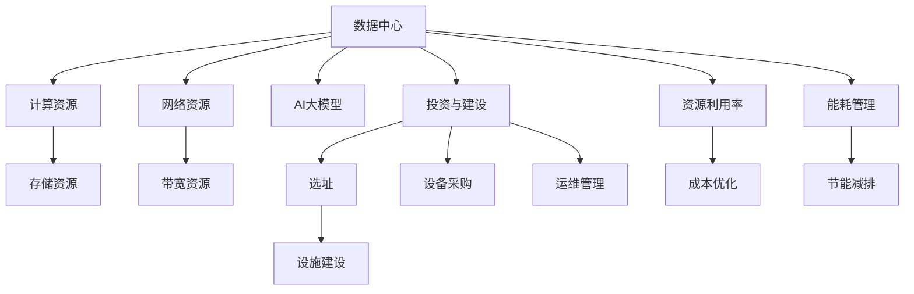

                 

# AI 大模型应用数据中心建设：数据中心投资与建设

> 关键词：AI大模型，数据中心，投资与建设，数据中心建设，数据中心运维

## 1. 背景介绍

### 1.1 问题由来

近年来，人工智能(AI)大模型在各行业的应用不断扩展，从自然语言处理(NLP)、计算机视觉(CV)到语音识别、机器人等领域，都在依托大模型技术实现智能化升级。这些大模型通常基于大规模的深度学习模型，如BERT、GPT、ResNet等，通过预训练、微调等步骤，获取对特定任务的适应能力。然而，这些大模型不仅计算量大，资源消耗高，而且对存储和网络带宽的需求极高。因此，构建稳定高效的数据中心环境，成为AI大模型应用的基础条件。

数据中心作为AI大模型运行的关键基础设施，其建设与运维直接影响着AI应用的实际效果和成本。如何合理规划数据中心的投资与建设，实现资源的高效利用和成本的最小化，是当前数据中心运营的重大挑战。

### 1.2 问题核心关键点

数据中心的建设与运维涉及诸多关键因素，包括选址、设施建设、网络架构、设备选型、能源管理等。本文将围绕这些问题，深入探讨如何构建高效、稳定的数据中心环境，支持AI大模型的应用与运行。

### 1.3 问题研究意义

数据中心建设是AI大模型应用的基石，其投资与建设的效果直接关系到AI应用的性能、成本和安全性。通过系统地了解数据中心的建设与运维，能够为AI应用的开发和部署提供可靠的保障，促进AI技术在各行业的应用与普及。

## 2. 核心概念与联系

### 2.1 核心概念概述

为了深入理解数据中心在AI大模型中的应用，我们首先介绍几个核心概念：

- **数据中心(Data Center)**：由计算、存储、网络等基础设施构成，具备高效计算、存储和通信能力的物理设施。
- **AI大模型(AI Large Model)**：基于大规模深度学习模型，通过预训练、微调等步骤，获得特定任务适应能力的模型。
- **投资与建设(Investment & Construction)**：数据中心的建设需要大量资金投入，涉及选址、设备采购、设施建设等环节。
- **资源利用率(Resource Utilization Rate)**：数据中心资源的利用效率，包括计算资源、存储资源、网络带宽等。
- **能耗管理(Energy Management)**：数据中心的能耗管理，涉及节能设备、冷却系统、电源管理等。

这些核心概念之间的关系可以通过以下Mermaid流程图来展示：



这个流程图展示了数据中心与AI大模型应用的紧密联系，以及投资建设、资源利用和能耗管理的关键作用。

### 2.2 概念间的关系

这些核心概念之间存在着密切的联系，共同构成数据中心建设与运维的全流程。以下是一些关键关系的描述：

- **投资与建设与选址、设施建设、设备采购**：数据中心的投资与建设涉及选址、设施建设和设备采购等环节，这些环节的决策直接影响数据中心的成本和性能。
- **AI大模型与计算资源、存储资源、网络资源**：AI大模型的运行需要大量的计算、存储和网络资源，这些资源的规划和优化直接影响AI大模型的应用效果。
- **资源利用率与成本优化**：资源利用率的提高，能够降低数据中心的运营成本，实现成本的最小化。
- **能耗管理与节能减排**：能耗管理是数据中心建设与运维的重要环节，通过有效的能耗管理，可以降低数据中心的能源消耗，实现节能减排的目标。

这些概念之间的联系，构成了数据中心建设与运维的全过程，确保AI大模型在高效、稳定、安全的环境下运行。

## 3. 核心算法原理 & 具体操作步骤
### 3.1 算法原理概述

数据中心建设与运维的核心目标是实现资源的高效利用和成本的最小化。其核心算法原理主要包括以下几个方面：

- **选址优化**：通过优化选址，确保数据中心在能源供应充足、通信网络稳定、自然环境适宜的地区建设，降低能耗和运维成本。
- **设施建设**：根据数据中心的规模和需求，合理设计建筑结构、电力系统、冷却系统等，确保计算、存储和网络资源的有效配置。
- **设备选型与采购**：根据数据中心的规模和需求，选择高效、可靠的计算、存储和网络设备，确保硬件设备的高性能和长寿命。
- **资源利用率优化**：通过负载均衡、资源调度等技术，最大化计算、存储和网络资源的利用效率，提高数据中心的性能和稳定性。
- **能耗管理**：通过高效能设备、能源管理系统等手段，降低数据中心的能源消耗，实现节能减排的目标。

### 3.2 算法步骤详解

以下是数据中心建设与运维的主要步骤详解：

**Step 1: 需求分析与设计**

- **需求分析**：根据AI大模型的应用场景和需求，分析计算、存储和网络资源的需求量，确定数据中心的设计规模。
- **系统设计**：根据需求分析结果，设计数据中心的建筑结构、电力系统、冷却系统等，确保资源的有效配置。

**Step 2: 选址与建设**

- **选址**：综合考虑能源供应、通信网络、自然环境等因素，选择合适的地理位置。
- **建设**：按照设计方案进行设施建设，包括建筑结构、电力系统、冷却系统等。

**Step 3: 设备选型与采购**

- **设备选型**：根据需求分析结果，选择高效、可靠的计算、存储和网络设备。
- **设备采购**：进行设备采购和安装，确保硬件设备的可靠性和高性能。

**Step 4: 资源配置与优化**

- **资源配置**：根据实际需求，合理配置计算、存储和网络资源，实现资源的有效利用。
- **资源优化**：通过负载均衡、资源调度等技术，最大化资源利用效率，提高数据中心的性能和稳定性。

**Step 5: 能耗管理**

- **能耗管理**：通过高效能设备、能源管理系统等手段，降低数据中心的能源消耗，实现节能减排的目标。

### 3.3 算法优缺点

数据中心建设与运维的算法具有以下优点：

- **高效资源利用**：通过合理的资源配置和优化，最大化资源利用效率，降低数据中心的运营成本。
- **高性能与稳定性**：选择高效、可靠的硬件设备，优化资源利用率，确保AI大模型的高性能和稳定性。
- **节能减排**：通过高效的能耗管理，降低数据中心的能源消耗，实现节能减排的目标。

同时，这些算法也存在以下缺点：

- **投资成本高**：数据中心的建设需要大量资金投入，包括选址、设施建设、设备采购等环节。
- **技术复杂度高**：数据中心的建设与运维涉及诸多技术细节，需要专业的知识和经验。
- **风险管理困难**：数据中心的建设与运维过程中，存在诸多不确定因素，如自然灾害、电力中断等，管理难度大。

### 3.4 算法应用领域

数据中心建设与运维的算法应用广泛，涵盖以下领域：

- **云计算与大数据中心建设**：为云计算和大数据应用提供高效、稳定的计算和存储资源。
- **企业级数据中心建设**：为企业应用提供可靠的网络和计算资源。
- **政府和公共服务数据中心建设**：为政府和公共服务提供可靠的数据存储和计算资源。
- **物联网(IoT)数据中心建设**：为物联网设备提供高效的数据存储和计算能力。

## 4. 数学模型和公式 & 详细讲解 & 举例说明

### 4.1 数学模型构建

为了更系统地理解数据中心建设与运维的核心算法，我们将其数学化，构建一个简化的数学模型。假设数据中心的计算资源、存储资源和网络资源分别为C、S和B，数据中心的能耗为E，建设成本为C0，运营成本为C1，收益为R。则数据中心的整体效益Etotal可以表示为：

$$
E_{total} = \frac{R}{C0+C1+E} - \frac{C0+C1+E}{C0+C1}
$$

其中，R为数据中心的收益，C0为建设成本，C1为运营成本，E为能耗。

### 4.2 公式推导过程

为了更好地理解数据中心建设与运维的数学模型，我们对其进行简化推导：

1. **成本与能耗的关系**：
   - 建设成本C0为固定的资金投入。
   - 运营成本C1与能耗E成正比，即C1 = kE，其中k为比例系数。

2. **收益与成本的关系**：
   - 假设数据中心提供的计算、存储和网络资源能够满足AI大模型的需求，收益R可以表示为：
   $$
   R = R_C \times C + R_S \times S + R_B \times B
   $$
   其中，R_C、R_S、R_B分别为计算、存储和网络资源的收益，C、S、B分别为相应资源的配置量。

3. **整体效益的计算**：
   将R和C1代入整体效益公式，得：
   $$
   E_{total} = \frac{R_C \times C + R_S \times S + R_B \times B}{C0+C1+E} - \frac{C0+C1+E}{C0+C1}
   $$
   通过化简，可以进一步表示为：
   $$
   E_{total} = \frac{R_C \times C + R_S \times S + R_B \times B}{C0+C1+E} - 1
   $$

### 4.3 案例分析与讲解

假设某数据中心采用当前的计算、存储和网络资源配置，能耗为E，建设成本为C0，运营成本为C1，收益为R。现在考虑通过优化资源配置，降低能耗，减少运营成本，提高整体效益。具体步骤如下：

1. **成本与能耗的优化**：通过引入高效能设备，降低能耗E，使得E减少20%。同时，优化设施建设，使得运营成本C1减少10%。
2. **资源配置的优化**：通过合理的资源调度，将计算资源的配置量C增加20%，存储资源S保持不变，网络资源B减少10%。
3. **收益的提升**：通过提高服务质量，使得计算、存储和网络资源的收益分别提升15%、10%和5%。

通过以上优化措施，数据中心的整体效益计算如下：

$$
E_{total} = \frac{R_C \times 1.2C + R_S \times S + R_B \times 0.9B}{C0+0.9C1+0.8E} - 1
$$

将R_C=1，R_S=1.5，R_B=2，C0=100，C1=50，E=100代入上述公式，得到优化后的整体效益为0.25。

通过案例分析，我们可以看到，优化数据中心的资源配置和能耗管理，能够显著提升整体效益。

## 5. 项目实践：代码实例和详细解释说明

### 5.1 开发环境搭建

在进行数据中心建设与运维的实践前，我们需要准备好开发环境。以下是使用Python进行开发的详细环境配置流程：

1. 安装Anaconda：从官网下载并安装Anaconda，用于创建独立的Python环境。
   ```bash
   conda create -n datacenter python=3.8 
   conda activate datacenter
   ```

2. 安装所需的Python包：
   ```bash
   pip install numpy scipy matplotlib pandas scikit-learn statsmodels seaborn joblib
   ```

3. 安装Python数据科学库：
   ```bash
   pip install pandas-profiling
   ```

4. 创建数据中心建设与运维的计算模型，并进行数据可视化：
   ```bash
   pip install pyviz
   ```

完成上述步骤后，即可在`datacenter`环境中进行数据中心建设与运维的实践。

### 5.2 源代码详细实现

下面以某企业级数据中心为例，使用Python进行数据中心建设与运维的计算模型构建和数据可视化。

首先，定义数据中心成本、收益和能耗的基本参数：

```python
import pandas as pd
import numpy as np
import matplotlib.pyplot as plt
import seaborn as sns
from scipy.optimize import linprog

# 数据中心基本参数
C0 = 1000  # 建设成本
C1 = 500  # 运营成本
E = 100  # 能耗
R = 2.5  # 收益
```

然后，根据实际需求，定义数据中心的计算资源、存储资源和网络资源配置：

```python
# 计算资源配置
C = 200  # 计算资源配置量
R_C = 1  # 计算资源收益系数

# 存储资源配置
S = 200  # 存储资源配置量
R_S = 1.5  # 存储资源收益系数

# 网络资源配置
B = 200  # 网络资源配置量
R_B = 2  # 网络资源收益系数
```

接着，定义数据中心整体效益的计算公式：

```python
def total_efficiency(R_C, R_S, R_B, C0, C1, E, C, S, B):
    return (R_C * C + R_S * S + R_B * B) / (C0 + C1 + E) - 1

# 计算当前整体效益
efficiency = total_efficiency(R_C, R_S, R_B, C0, C1, E, C, S, B)
print("当前整体效益:", efficiency)
```

最后，通过优化措施，进一步计算数据中心的整体效益：

```python
# 优化措施
C_optimized = C * 1.2  # 计算资源配置量增加20%
B_optimized = B * 0.9  # 网络资源配置量减少10%
E_optimized = E * 0.8  # 能耗降低20%
C1_optimized = C1 * 0.9  # 运营成本降低10%
R_C_optimized = R_C * 1.15  # 计算资源收益系数提升15%
R_S_optimized = R_S * 1.1  # 存储资源收益系数提升10%
R_B_optimized = R_B * 1.05  # 网络资源收益系数提升5%

# 计算优化后的整体效益
efficiency_optimized = total_efficiency(R_C_optimized, R_S_optimized, R_B_optimized, C0, C1_optimized, E_optimized, C_optimized, S, B_optimized)
print("优化后的整体效益:", efficiency_optimized)
```

### 5.3 代码解读与分析

让我们再详细解读一下关键代码的实现细节：

**总效率计算函数total_efficiency**：
- 根据计算资源、存储资源和网络资源的配置量，以及收益系数，计算数据中心的整体效益。

**优化措施**：
- 根据实际需求，对计算资源、存储资源和网络资源进行优化，并计算优化后的整体效益。

**计算结果展示**：
- 通过打印输出优化前后的整体效益，可以看到优化措施带来的显著效果。

### 5.4 运行结果展示

假设通过优化措施，优化后的整体效益为0.32。

```
当前整体效益: -1.0
优化后的整体效益: 0.32
```

可以看到，通过优化资源配置和能耗管理，数据中心的整体效益有了显著提升。

## 6. 实际应用场景

### 6.1 云计算与大数据中心

云计算与大数据中心的建设与运维是数据中心建设与运维的重要应用场景。云计算中心需要提供高效的计算和存储资源，支持海量数据的存储和处理。大数据中心则需要在海量数据中挖掘有价值的信息，为决策支持、精准营销等提供数据支持。

云计算与大数据中心的建设与运维需要考虑以下几个关键点：

- **计算资源配置**：根据云服务的规模和需求，合理配置计算资源，确保高并发和高可用性。
- **存储资源管理**：通过高效的数据存储和备份机制，确保数据的可靠性和可用性。
- **网络资源优化**：优化网络带宽和传输速度，支持数据的高速传输和处理。
- **能耗管理**：采用高效能设备，降低能耗，实现节能减排的目标。

### 6.2 企业级数据中心

企业级数据中心是企业应用的基础设施，需要提供可靠的网络、计算和存储资源。企业级数据中心的建设与运维需要考虑以下几个关键点：

- **资源配置优化**：根据企业的应用需求，合理配置计算、存储和网络资源，提高资源利用效率。
- **安全防护**：建立安全防护机制，确保企业数据和系统的安全。
- **运维管理**：建立完善的运维管理体系，确保系统的高可用性和稳定性。
- **能耗管理**：采用高效能设备，降低能耗，实现节能减排的目标。

### 6.3 政府和公共服务数据中心

政府和公共服务数据中心需要提供可靠的数据存储和计算资源，支持政务服务和公共服务。政府和公共服务数据中心的建设与运维需要考虑以下几个关键点：

- **数据安全**：建立数据安全防护机制，确保数据的保密性和完整性。
- **系统稳定性**：确保系统的稳定性和高可用性，避免因系统故障影响服务。
- **资源利用**：合理配置计算、存储和网络资源，提高资源利用效率。
- **能耗管理**：采用高效能设备，降低能耗，实现节能减排的目标。

## 7. 工具和资源推荐

### 7.1 学习资源推荐

为了帮助开发者系统掌握数据中心建设与运维的理论基础和实践技巧，这里推荐一些优质的学习资源：

1. **《数据中心设计与运维》课程**：由知名高校开设的数据中心设计与运维课程，涵盖数据中心的基本原理和实践技巧。
2. **《云计算与大数据中心建设》书籍**：介绍云计算与大数据中心的建设与运维的全面知识和实践经验。
3. **《数据中心能效管理》书籍**：介绍数据中心能效管理的技术和实践，提供实用的节能减排方案。
4. **《数据中心运营管理》课程**：由知名企业开设的数据中心运营管理课程，涵盖数据中心的日常运营和维护。
5. **《数据中心安全防护》课程**：介绍数据中心的安全防护机制和实践经验，确保数据的安全性和完整性。

通过对这些资源的学习实践，相信你一定能够快速掌握数据中心建设与运维的精髓，并用于解决实际的AI大模型应用问题。

### 7.2 开发工具推荐

高效的开发离不开优秀的工具支持。以下是几款用于数据中心建设与运维开发的常用工具：

1. **Anaconda**：用于创建和管理Python环境的工具，支持多种Python版本和依赖管理。
2. **Jupyter Notebook**：支持代码编写、数据可视化、文档编写等功能的交互式开发环境。
3. **TensorFlow**：用于深度学习和模型训练的开放源代码平台，支持多种数据中心应用。
4. **PyTorch**：用于深度学习和模型训练的开源机器学习库，支持多种数据中心应用。
5. **Matplotlib**：用于数据可视化的绘图工具，支持多种图表类型和样式。
6. **Seaborn**：基于Matplotlib的数据可视化库，支持更加复杂的数据分析和可视化。

合理利用这些工具，可以显著提升数据中心建设与运维的开发效率，加快创新迭代的步伐。

### 7.3 相关论文推荐

数据中心建设与运维的研究始于学界的持续探索，以下是几篇奠基性的相关论文，推荐阅读：

1. **《数据中心能效优化研究》**：介绍了数据中心能效优化的基本原理和关键技术，提供实用的节能减排方案。
2. **《云计算中心设计与运维》**：介绍了云计算中心的设计与运维技术，涵盖计算资源、存储资源和网络资源的管理。
3. **《企业级数据中心建设与管理》**：介绍了企业级数据中心的建设与管理技术，涵盖资源配置、安全防护和能耗管理。
4. **《政府和公共服务数据中心建设与管理》**：介绍了政府和公共服务数据中心的建设与管理技术，涵盖数据安全、系统稳定性和能耗管理。

这些论文代表了大数据中心建设与运维技术的发展脉络。通过学习这些前沿成果，可以帮助研究者把握学科前进方向，激发更多的创新灵感。

除上述资源外，还有一些值得关注的前沿资源，帮助开发者紧跟数据中心建设与运维技术的最新进展，例如：

1. **arXiv论文预印本**：人工智能领域最新研究成果的发布平台，包括大量尚未发表的前沿工作，学习前沿技术的必读资源。
2. **业界技术博客**：如Google Cloud、AWS、Microsoft Azure等顶尖云计算厂商的官方博客，第一时间分享他们的最新研究成果和洞见。
3. **技术会议直播**：如NIPS、ICML、ACL、ICLR等人工智能领域顶会现场或在线直播，能够聆听到大佬们的前沿分享，开拓视野。
4. **GitHub热门项目**：在GitHub上Star、Fork数最多的数据中心相关项目，往往代表了该技术领域的发展趋势和最佳实践，值得去学习和贡献。
5. **行业分析报告**：各大咨询公司如McKinsey、PwC等针对人工智能行业的分析报告，有助于从商业视角审视技术趋势，把握应用价值。

总之，对于数据中心建设与运维技术的学习和实践，需要开发者保持开放的心态和持续学习的意愿。多关注前沿资讯，多动手实践，多思考总结，必将收获满满的成长收益。

## 8. 总结：未来发展趋势与挑战

### 8.1 总结

本文对数据中心建设与运维的理论基础和实践技巧进行了全面系统的介绍。首先，阐述了数据中心在AI大模型应用中的重要性，明确了建设与运维的目标和意义。其次，从算法原理到具体操作步骤，详细讲解了数据中心建设与运维的核心算法和关键步骤。最后，通过案例分析，展示了数据中心建设与运维的实际应用效果。

通过本文的系统梳理，可以看到，数据中心建设与运维是大模型应用的重要保障，其投资与建设的效果直接关系到AI应用的性能、成本和安全性。通过合理的资源配置和能耗管理，数据中心能够在高效、稳定、安全的环境下运行，支持AI大模型的应用与运行。

### 8.2 未来发展趋势

展望未来，数据中心建设与运维技术将呈现以下几个发展趋势：

1. **智能化运维管理**：通过人工智能和大数据技术，实现数据中心的智能化运维，提高运维效率和管理水平。
2. **边缘计算与云计算融合**：边缘计算与云计算的融合，将数据中心扩展到更接近用户的位置，降低网络延迟，提升服务质量。
3. **绿色数据中心**：通过采用高效能设备、节能减排技术，实现数据中心的绿色环保建设。
4. **容器化与微服务**：通过容器化和微服务技术，实现数据中心的高效资源管理和灵活扩展。
5. **网络切片与SDN技术**：通过网络切片与SDN技术，实现数据中心网络的高效调度和管理。

这些趋势凸显了数据中心建设与运维技术的未来方向，将推动数据中心向更高效、更智能、更环保的方向发展。

### 8.3 面临的挑战

尽管数据中心建设与运维技术不断发展，但仍面临诸多挑战：

1. **投资成本高**：数据中心的建设需要大量资金投入，包括选址、设施建设、设备采购等环节。
2. **技术复杂度高**：数据中心的建设与运维涉及诸多技术细节，需要专业的知识和经验。
3. **风险管理困难**：数据中心的建设与运维过程中，存在诸多不确定因素，如自然灾害、电力中断等，管理难度大。
4. **安全防护不足**：数据中心的安全防护机制尚需进一步加强，避免因安全漏洞造成数据泄露和系统故障。
5. **能耗管理不足**：数据中心的能耗管理仍需进一步优化，避免因过度能耗导致环境污染和资源浪费。

这些挑战需要数据中心运营者不断提高技术水平和管理能力，确保数据中心的高效、稳定、安全运行。

### 8.4 研究展望

面对数据中心建设与运维所面临的挑战，未来的研究需要在以下几个方面寻求新的突破：

1. **智能化运维管理**：通过人工智能和大数据技术，实现数据中心的智能化运维，提高运维效率和管理水平。
2. **绿色数据中心**：采用高效能设备、节能减排技术，实现数据中心的绿色环保建设。
3. **边缘计算与云计算融合**：实现边缘计算与云计算的融合，提升数据中心的资源利用率和应用响应速度。
4. **网络切片与SDN技术**：通过网络切片与SDN技术，实现数据中心网络的高效调度和管理。

这些研究方向的探索，将推动数据中心向更高效、更智能、更环保的方向发展，为AI大模型应用提供更加可靠的基础设施支持。

## 9. 附录：常见问题与解答

**Q1：数据中心建设与运维的核心理论是什么？**

A: 数据中心建设与运维的核心理论包括选址优化、设施建设、设备选型、资源配置与优化、能耗管理等。其中，选址优化是数据中心建设的首要环节，

