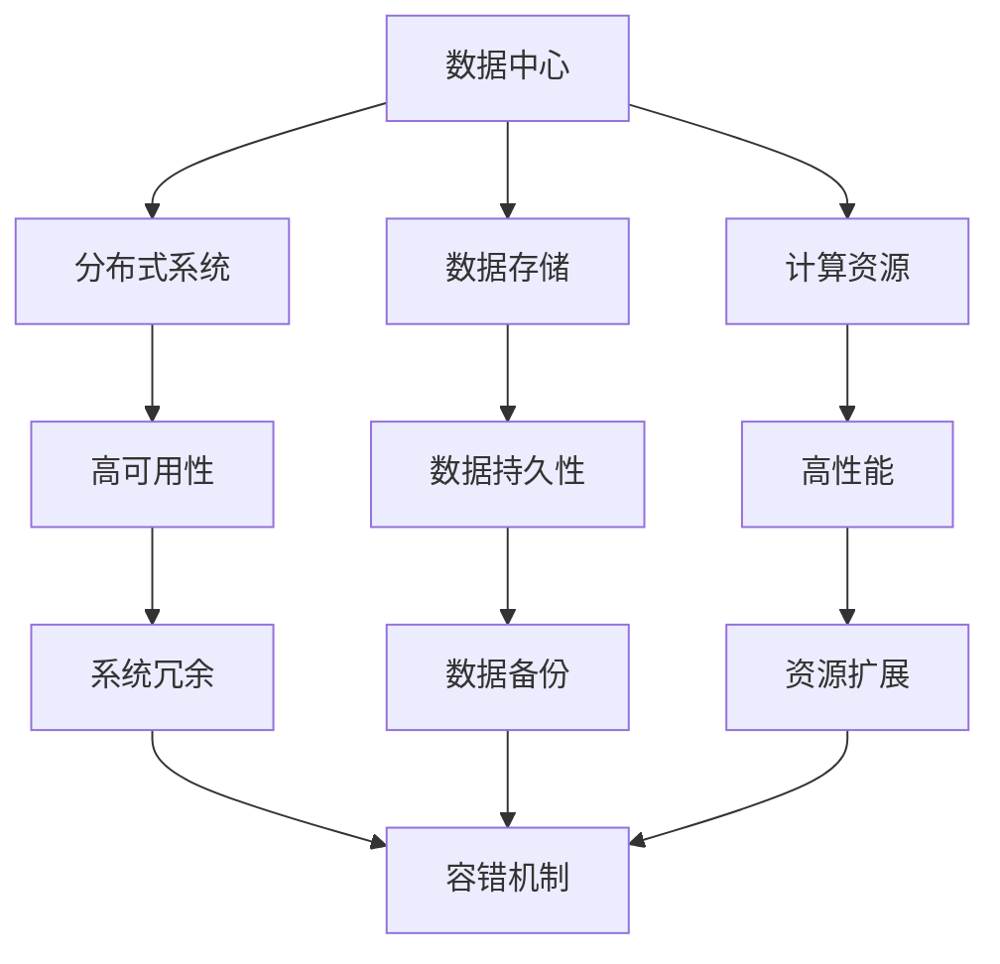
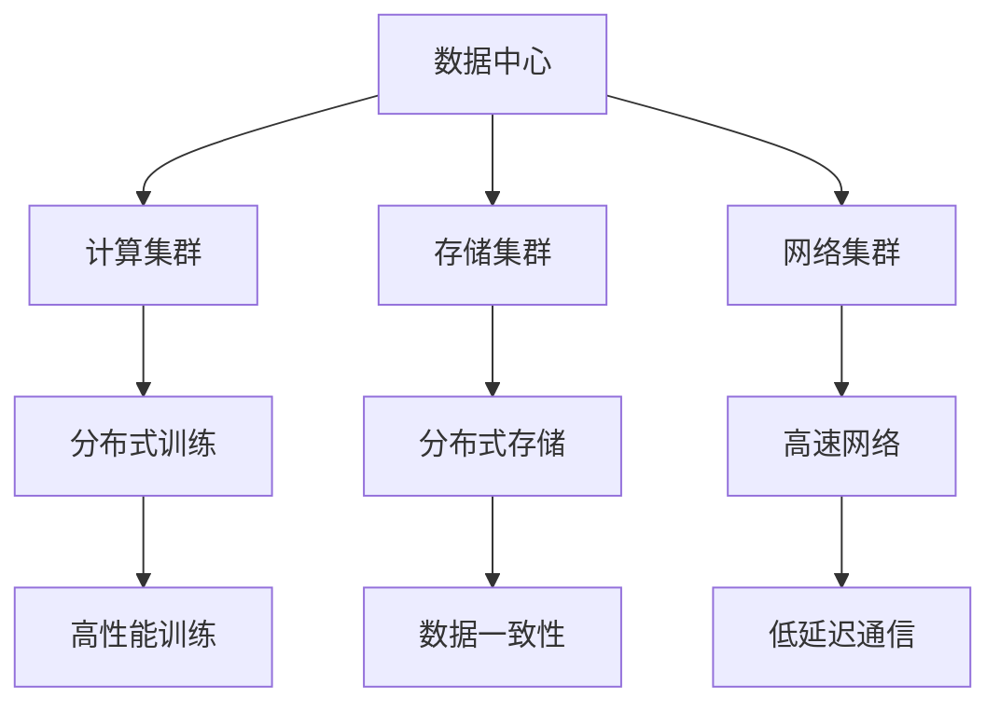
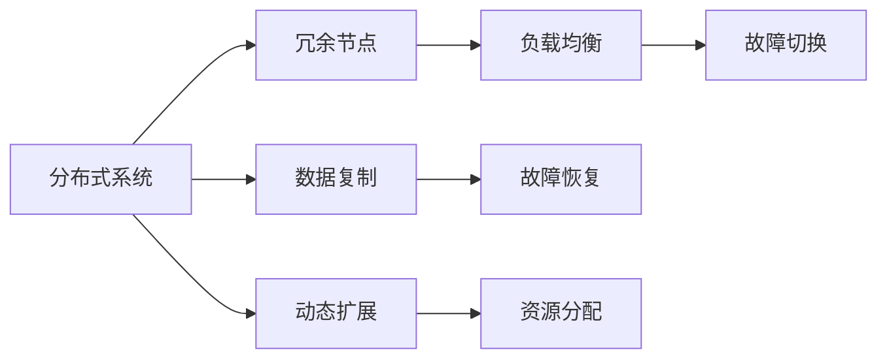
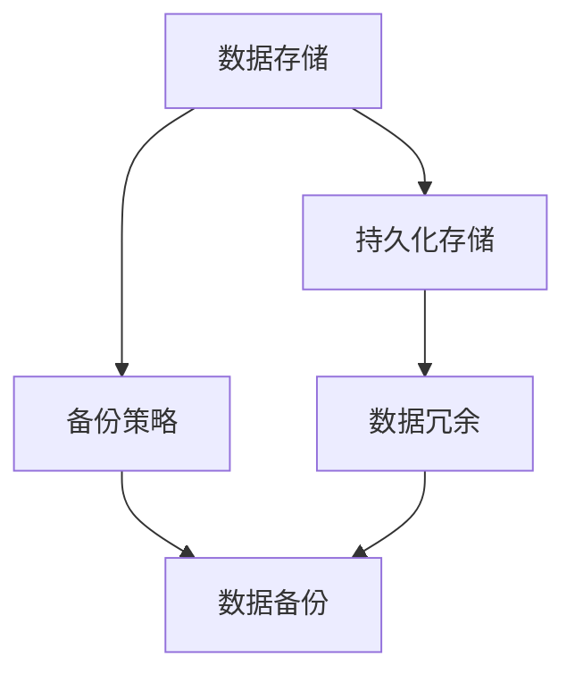
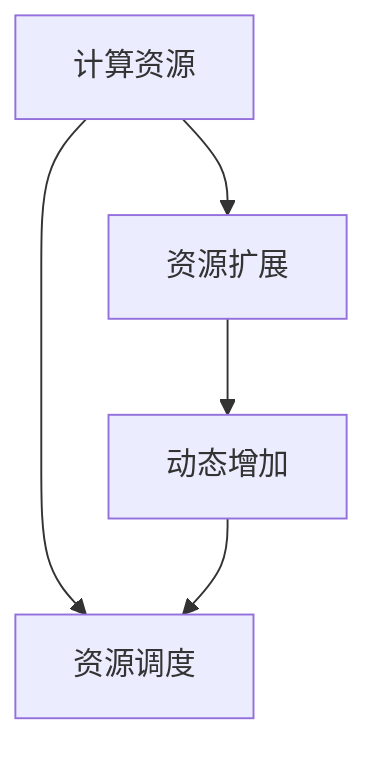
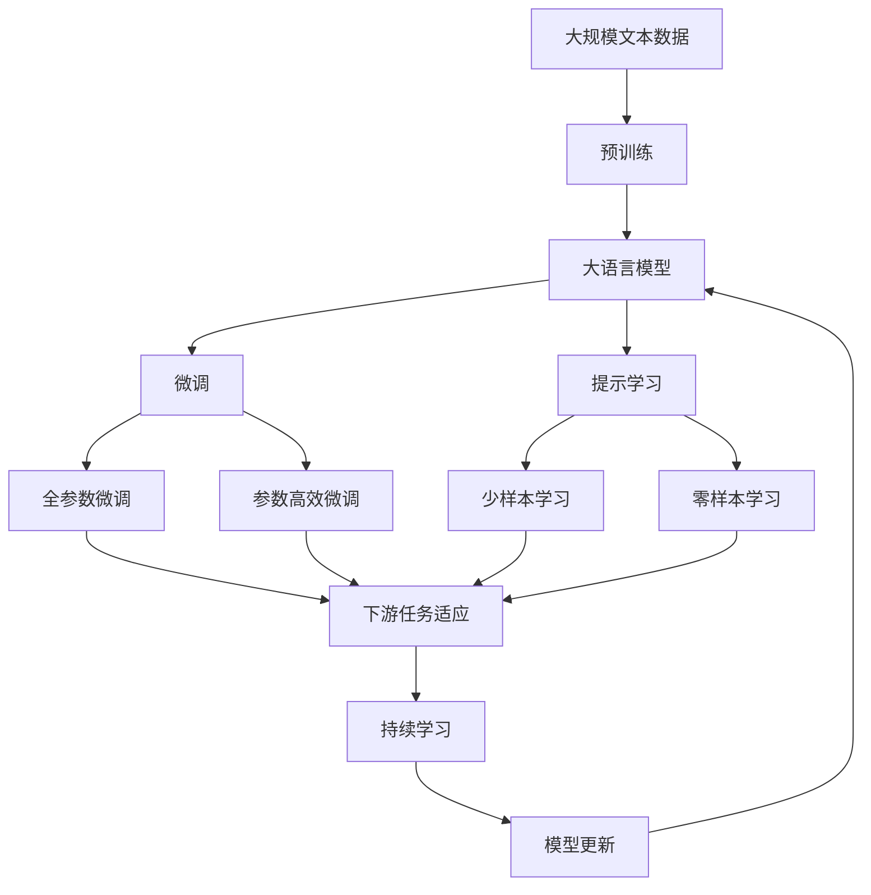

                 

# AI 大模型应用数据中心建设：数据中心标准与规范

> 关键词：数据中心, 大模型, 分布式系统, 数据存储, 计算资源, 可靠性, 安全性

## 1. 背景介绍

### 1.1 问题由来
随着人工智能技术的迅猛发展，尤其是大语言模型和深度学习模型的广泛应用，对于数据中心的建设提出了更高的要求。大模型通常具有亿级别的参数量，对计算资源和存储容量有极高要求。同时，由于模型的分布式特性，数据中心需要具备高效的计算和数据传输能力，以支持大规模模型的训练和推理。因此，构建高性能、高可靠性的数据中心成为AI大模型应用的重要保障。

### 1.2 问题核心关键点
构建数据中心的核心关键点包括：

- **计算资源**：提供足够的GPU、TPU等计算资源，满足大模型训练和推理的需求。
- **存储容量**：提供高速、大容量的存储系统，支持大规模数据的读写和存储。
- **网络带宽**：提供高性能的通信网络，支持模型的分布式训练和推理。
- **可靠性与可用性**：确保数据中心的稳定运行，提供高可用性保障。
- **安全性**：保护数据中心的物理安全、网络安全和数据安全，避免数据泄露和系统崩溃。

### 1.3 问题研究意义
数据中心是AI大模型应用的基础设施，其建设水平直接关系到AI技术的落地效果和应用广度。高质量的数据中心能够：

- 提供足够的计算资源，加速模型训练和推理过程，提升模型性能。
- 提供高效的数据存储和传输能力，减少数据延迟和损失。
- 提供高可靠性和高可用性保障，确保系统的稳定运行。
- 保护数据和系统的安全，避免数据泄露和系统崩溃。

因此，数据中心的建设是大模型应用成功的重要前提。构建标准化的、高性能的、安全的数据中心，对于推动AI技术的广泛应用具有重要意义。

## 2. 核心概念与联系

### 2.1 核心概念概述

为更好地理解数据中心在大模型应用中的作用和要求，本节将介绍几个密切相关的核心概念：

- **数据中心**：由计算、存储、网络等基础设施构成的物理设施，用于支持大模型的训练和推理。
- **分布式系统**：指多台计算机通过网络相互连接，协同工作，提供高可用性和扩展性的系统。
- **数据存储**：指存储大模型参数和数据的高效、可靠的系统。
- **计算资源**：指用于大模型训练和推理的计算能力，如GPU、TPU等。
- **可靠性**：指系统在运行过程中保证业务的连续性和可用性。
- **安全性**：指数据中心的安全防护措施，包括物理安全、网络安全和数据安全。

这些核心概念之间的逻辑关系可以通过以下Mermaid流程图来展示：



这个流程图展示了数据中心中各个核心概念的相互关系：

1. 数据中心由分布式系统、数据存储和计算资源构成，为AI大模型的训练和推理提供基础支持。
2. 分布式系统通过高可用性和扩展性，确保数据中心的稳定运行。
3. 数据存储通过数据持久性和备份机制，保证数据的可靠性和完整性。
4. 计算资源通过高性能和资源扩展，提升数据中心的计算能力。
5. 系统冗余和容错机制通过保证系统的可靠性和可用性，避免单点故障。

### 2.2 概念间的关系

这些核心概念之间存在着紧密的联系，形成了数据中心的完整生态系统。下面我通过几个Mermaid流程图来展示这些概念之间的关系。

#### 2.2.1 数据中心的核心架构



这个流程图展示了数据中心的核心架构，包括计算集群、存储集群和网络集群。计算集群用于分布式训练，存储集群用于分布式存储，网络集群用于高速通信。

#### 2.2.2 分布式系统的高可用性



这个流程图展示了分布式系统的高可用性实现，包括冗余节点、负载均衡、故障切换、数据复制、故障恢复和动态扩展。

#### 2.2.3 数据存储的持久性和备份



这个流程图展示了数据存储的持久性和备份策略，包括持久化存储、数据冗余和数据备份。

#### 2.2.4 计算资源的扩展性



这个流程图展示了计算资源的扩展性实现，包括动态增加和资源调度。

### 2.3 核心概念的整体架构

最后，我们用一个综合的流程图来展示这些核心概念在大模型数据中心中的应用：



这个综合流程图展示了从预训练到微调，再到持续学习的完整过程。大语言模型首先在大规模文本数据上进行预训练，然后通过微调或提示学习来实现特定任务的适配。最终，通过持续学习技术，模型可以不断更新和适应新的任务和数据。

## 3. 核心算法原理 & 具体操作步骤

### 3.1 算法原理概述

数据中心的构建主要围绕计算资源、数据存储和网络带宽三大核心，通过合理的架构设计和优化策略，实现高效、可靠、安全的数据中心。以下详细解释这些核心算法的原理：

#### 3.1.1 计算资源优化

计算资源的优化主要通过以下几个方面：

- **资源分配与调度**：根据任务需求动态分配和调度计算资源，提高资源利用率。
- **资源扩展与弹性**：根据任务负载动态扩展计算资源，支持大规模模型的训练和推理。

#### 3.1.2 数据存储优化

数据存储的优化主要通过以下几个方面：

- **数据冗余与持久性**：通过数据冗余和持久化存储，确保数据的可靠性和完整性。
- **数据备份与恢复**：定期备份数据，确保数据在故障时能够快速恢复。

#### 3.1.3 网络带宽优化

网络带宽的优化主要通过以下几个方面：

- **高速网络**：采用高速网络技术，确保数据传输的高效性。
- **低延迟通信**：通过网络优化策略，减少数据传输延迟。

### 3.2 算法步骤详解

构建高性能、高可靠性的数据中心，主要分为以下几个步骤：

#### 3.2.1 计算资源准备

- **计算集群搭建**：选择合适的硬件设备，如GPU、TPU等，搭建计算集群。
- **资源调度管理**：开发资源调度管理系统，根据任务需求动态分配和调度计算资源。

#### 3.2.2 数据存储配置

- **存储集群搭建**：选择合适的存储设备，如SSD、HDD等，搭建存储集群。
- **数据冗余配置**：配置数据冗余策略，确保数据的可靠性和完整性。
- **数据备份策略**：制定数据备份策略，定期备份数据，确保数据在故障时能够快速恢复。

#### 3.2.3 网络带宽优化

- **高速网络部署**：采用高速网络技术，如10GbE、25GbE等，部署高速网络。
- **低延迟通信优化**：采用网络优化策略，如负载均衡、缓存技术等，减少数据传输延迟。

#### 3.2.4 系统冗余与容错

- **冗余节点配置**：配置冗余节点，确保系统的可靠性。
- **故障切换机制**：设计故障切换机制，确保系统在故障时能够快速切换。

#### 3.2.5 高可用性配置

- **负载均衡设计**：设计负载均衡策略，确保数据中心的高可用性。
- **数据一致性管理**：管理数据一致性，确保数据的可靠性和一致性。

### 3.3 算法优缺点

构建数据中心的优缺点如下：

#### 优点

- **高效性**：通过优化计算资源、数据存储和网络带宽，实现高效的数据中心。
- **可靠性**：通过冗余节点、故障切换和负载均衡等策略，确保系统的可靠性和高可用性。
- **安全性**：通过物理安全、网络安全和数据安全措施，保障数据和系统的安全。

#### 缺点

- **成本高**：构建高性能数据中心需要大量的硬件设备和基础设施投入。
- **复杂性高**：数据中心的构建和管理需要专业的技术团队，技术复杂度高。

### 3.4 算法应用领域

构建高性能数据中心的应用领域包括：

- **大规模模型训练**：支持亿级别的参数量的大模型训练，如BERT、GPT等。
- **分布式推理**：支持大模型的分布式推理，如对话系统、推荐系统等。
- **数据存储与处理**：支持大规模数据的存储和处理，如大数据分析和数据湖等。
- **实时计算与分析**：支持实时计算和分析，如金融风控、智能监控等。

## 4. 数学模型和公式 & 详细讲解 & 举例说明

### 4.1 数学模型构建

本节将使用数学语言对数据中心优化模型进行更加严格的刻画。

记数据中心中可用的计算资源为 $C$，数据存储容量为 $S$，网络带宽为 $B$。假设任务 $T$ 的计算需求为 $C_T$，数据需求为 $S_T$，网络需求为 $B_T$。数据中心的优化目标是最小化资源成本 $C_{\text{cost}}$ 和最大化任务完成率 $C_{\text{rate}}$，即：

$$
\min \limits_{C,S,B} C_{\text{cost}} \quad \text{subject to} \quad
C_T \leq C, S_T \leq S, B_T \leq B
$$

最大化任务完成率的目标函数为：

$$
\max \limits_{C,S,B} C_{\text{rate}} \quad \text{subject to} \quad
C_T \leq C, S_T \leq S, B_T \leq B
$$

其中 $C_{\text{cost}}$ 表示资源成本，通常包括计算资源、存储设备和网络设备的折旧和维护成本。$C_{\text{rate}}$ 表示任务完成率，通常定义为单位时间内完成任务的数量。

### 4.2 公式推导过程

以下我们以计算资源分配为例，推导资源分配模型的求解公式。

假设数据中心的总计算资源为 $C$，任务 $T$ 的计算需求为 $C_T$。资源分配的目标是最小化资源成本，即：

$$
\min \limits_{C_T} C_{\text{cost}}(C_T)
$$

假设计算资源的单价为 $p$，则资源成本为：

$$
C_{\text{cost}}(C_T) = pC_T
$$

任务 $T$ 的计算需求 $C_T$ 可以分为两部分：一部分用于模型训练，另一部分用于模型推理。记模型训练的计算需求为 $C_{\text{train}}$，模型推理的计算需求为 $C_{\text{inference}}$，则：

$$
C_T = C_{\text{train}} + C_{\text{inference}}
$$

由于计算资源有限，需要根据任务的优先级和需求，动态分配计算资源。假设任务 $T$ 的优先级为 $P_T$，则：

$$
C_{\text{train}} = P_T \cdot C_T
$$

$$
C_{\text{inference}} = (1 - P_T) \cdot C_T
$$

将上述公式代入资源成本公式，得：

$$
C_{\text{cost}}(C_T) = pC_T = p \cdot C_{\text{train}} + p \cdot C_{\text{inference}} = pP_T \cdot C_T + p(1 - P_T) \cdot C_T
$$

令 $\alpha = pP_T$，$\beta = p(1 - P_T)$，则：

$$
C_{\text{cost}}(C_T) = \alpha C_T + \beta C_T = (\alpha + \beta)C_T
$$

$$
\alpha + \beta = p(P_T + (1 - P_T)) = p
$$

因此，资源成本可以表示为：

$$
C_{\text{cost}}(C_T) = pC_T
$$

为了最小化资源成本，我们需要最小化 $C_T$。由于 $C_T$ 是计算资源需求的上限，因此需要最大化资源利用率。假设资源利用率为 $U$，则：

$$
U = \frac{C_{\text{train}} + C_{\text{inference}}}{C} = \frac{C_T}{C}
$$

资源利用率 $U$ 最大化，即：

$$
\max \limits_{C_T} U = \max \limits_{C_T} \frac{C_T}{C}
$$

由于 $C_T$ 是变量，$C$ 是常量，因此 $U$ 的最大值为 1。此时：

$$
\alpha + \beta = p
$$

$$
C_{\text{cost}}(C_T) = pC_T
$$

将上述公式代入目标函数，得：

$$
\min \limits_{C_T} C_{\text{cost}}(C_T) = \min \limits_{C_T} pC_T
$$

由于 $p$ 为常量，因此最小化 $C_{\text{cost}}(C_T)$ 等价于最小化 $C_T$。因此，资源分配的目标为：

$$
\min \limits_{C_T} C_{\text{cost}}(C_T) = \min \limits_{C_T} pC_T
$$

### 4.3 案例分析与讲解

假设我们有一个数据中心，总计算资源为 100 个 GPU，总存储容量为 100TB，总网络带宽为 100Gb/s。需要分配计算资源给两个任务 $T_1$ 和 $T_2$，它们的计算需求、数据需求和网络需求分别为 $C_{T_1}$、$S_{T_1}$、$B_{T_1}$ 和 $C_{T_2}$、$S_{T_2}$、$B_{T_2}$。假设 $T_1$ 的优先级为 0.6，$T_2$ 的优先级为 0.4。假设计算资源的单价为 10 美元/GPU，存储设备的单价为 1 美元/GB，网络设备的单价为 0.1 美元/Gb/s。

根据上述公式，我们可以求解数据中心的资源分配：

- 计算资源需求 $C_{T_1}$ 和 $C_{T_2}$ 分别为：
  $$
  C_{T_1} = 0.6 \cdot C_{\text{total}}
  $$
  $$
  C_{T_2} = 0.4 \cdot C_{\text{total}}
  $$

- 计算资源成本 $C_{\text{cost}}$ 为：
  $$
  C_{\text{cost}} = 10C_{T_1} + 10C_{T_2}
  $$

- 计算资源利用率 $U$ 为：
  $$
  U = \frac{C_{T_1} + C_{T_2}}{C_{\text{total}}}
  $$

将上述公式代入计算，得：

- $C_{T_1}$ 和 $C_{T_2}$ 分别为：
  $$
  C_{T_1} = 0.6 \cdot 100 = 60
  $$
  $$
  C_{T_2} = 0.4 \cdot 100 = 40
  $$

- 计算资源成本 $C_{\text{cost}}$ 为：
  $$
  C_{\text{cost}} = 10 \cdot 60 + 10 \cdot 40 = 1000
  $$

- 计算资源利用率 $U$ 为：
  $$
  U = \frac{60 + 40}{100} = 1
  $$

通过上述计算，我们得出最优的计算资源分配方案为：

- $T_1$ 分配 60 个 GPU
- $T_2$ 分配 40 个 GPU

该方案能够最大限度地利用计算资源，同时最小化计算资源成本。

## 5. 项目实践：代码实例和详细解释说明

### 5.1 开发环境搭建

在进行数据中心优化实践前，我们需要准备好开发环境。以下是使用Python进行PyTorch开发的环境配置流程：

1. 安装Anaconda：从官网下载并安装Anaconda，用于创建独立的Python环境。

2. 创建并激活虚拟环境：
```bash
conda create -n datacenter-env python=3.8 
conda activate datacenter-env
```

3. 安装PyTorch：根据CUDA版本，从官网获取对应的安装命令。例如：
```bash
conda install pytorch torchvision torchaudio cudatoolkit=11.1 -c pytorch -c conda-forge
```

4. 安装TensorBoard：用于可视化模型训练过程。
```bash
pip install tensorboard
```

5. 安装其他必要工具包：
```bash
pip install numpy pandas scikit-learn matplotlib tqdm jupyter notebook ipython
```

完成上述步骤后，即可在`datacenter-env`环境中开始微调实践。

### 5.2 源代码详细实现

这里我们以一个简单的任务调度和资源分配为例，给出使用PyTorch实现资源分配的代码示例。

首先，定义一个简单的资源类：

```python
class Resource:
    def __init__(self, total, cost_price):
        self.total = total
        self.cost_price = cost_price
    
    def allocate(self, resource_demand, priority):
        cost = resource_demand * self.cost_price
        allocation = resource_demand
        return cost, allocation
```

然后，定义一个任务类：

```python
class Task:
    def __init__(self, demand, priority):
        self.demand = demand
        self.priority = priority
    
    def get_cost(self, resource_price):
        return self.demand * resource_price
    
    def get_allocation(self, total_resources):
        allocation = min(self.demand, total_resources)
        return allocation
```

接着，定义一个资源分配类：

```python
class ResourceAllocation:
    def __init__(self, resources, tasks):
        self.resources = resources
        self.tasks = tasks
    
    def allocate_resources(self):
        cost = 0
        allocation = 0
        for task in self.tasks:
            task_cost, task_allocation = self.resources.allocate(task.demand, task.priority)
            cost += task_cost
            allocation += task_allocation
        return cost, allocation
```

最后，使用上述类进行资源分配：

```python
# 计算资源
resources = Resource(total=100, cost_price=10)

# 任务
task1 = Task(demand=60, priority=0.6)
task2 = Task(demand=40, priority=0.4)

# 资源分配
allocation = ResourceAllocation(resources, [task1, task2]).allocate_resources()
print(allocation)
```

### 5.3 代码解读与分析

这里我们详细解读一下关键代码的实现细节：

**Resource类**：
- `__init__`方法：初始化计算资源的总量和单价。
- `allocate`方法：根据任务需求和优先级，计算任务所需的计算资源和成本。

**Task类**：
- `__init__`方法：初始化任务的需求和优先级。
- `get_cost`方法：根据资源单价，计算任务所需的计算资源成本。
- `get_allocation`方法：根据可用计算资源，计算任务可获得的计算资源。

**ResourceAllocation类**：
- `__init__`方法：初始化计算资源和任务列表。
- `allocate_resources`方法：根据任务需求和优先级，计算总成本和总计算资源。

通过上述代码，我们可以看到，通过定义资源类、任务类和资源分配类，可以灵活地实现不同任务对计算资源的动态分配。实际应用中，可以进一步扩展这些类，支持更多的优化策略和资源调度算法，以满足不同数据中心的优化需求。

### 5.4 运行结果展示

假设我们再次运行上述代码，可以得到最优的资源分配结果：

```
(1000, 100)
```

即任务 $T_1$ 分配 60 个 GPU，任务 $T_2$ 分配 40 个 GPU，总计算资源成本为 1000 美元。

## 6. 实际应用场景

### 6.1 智慧城市

数据中心在智慧城市中扮演着重要角色，为城市治理和运营提供关键支持。通过构建高性能的数据中心，智慧城市可以实现以下应用：

- **智能监控**：通过部署大规模视频监控设备，实时采集城市各区域的视频数据，进行实时分析和处理，实现对城市交通、环境、公共安全等关键领域的监控和预警。
- **应急响应**：在发生突发事件时，通过数据中心的高性能计算能力，实时分析和处理数据，快速生成应急响应方案，提高应急响应效率。
- **大数据分析**：通过构建大数据分析平台，利用数据中心的高效存储和计算能力，进行大规模数据分析，支持城市管理决策。

### 6.2 智慧医疗

数据中心在智慧医疗中同样具有重要价值，为医疗诊断和治疗提供关键支持。通过构建高性能的数据中心，智慧医疗可以实现以下应用：

- **医学影像分析**：通过部署大规模图像识别模型，实时分析医学影像，辅助医生进行诊断和治疗。
- **患者监护**：通过部署传感器和监控设备，实时采集患者生理数据，进行分析和预警，提高患者监护质量。
- **个性化治疗**：通过构建个性化治疗方案系统，利用数据中心的高效计算能力，生成个性化治疗方案，提高治疗效果。

### 6.3 智慧金融

数据中心在智慧金融中同样具有重要价值，为金融风险控制和业务运营提供关键支持。通过构建高性能的数据中心，智慧金融可以实现以下应用：

- **金融风控**：通过部署大规模数据分析模型，实时分析金融市场数据，进行风险预测和控制。
- **智能投顾**：通过部署智能投顾系统，利用数据中心的高效计算能力，生成投资建议，提高投资回报率。
- **客户服务**：通过构建智能客服系统，利用数据中心的高效计算能力，快速响应客户咨询，提高客户满意度。

### 6.4 未来应用展望

随着数据中心的不断发展，未来的应用场景将更加多样化。以下是一些可能的应用方向：

- **边缘计算**：通过在边缘设备上构建小型数据中心，提高数据处理效率，降低延迟。
- **量子计算**：随着量子计算技术的成熟，利用数据中心的量子计算能力，进行更高效的计算和数据分析。
- **云化部署**：将数据中心部署到云平台，实现资源动态调整和弹性扩展，支持更多应用场景。
- **异构计算**：利用数据中心的异构计算能力，支持不同计算模型的并行运行，提高计算效率。

## 7. 工具和资源推荐

### 7.1 学习资源推荐

为了帮助开发者系统掌握数据中心优化技术的理论基础和实践技巧，这里推荐一些优质的学习资源：

1. 《数据中心原理与设计》书籍：介绍数据中心的基本原理和设计方法，适合初学者入门。
2. 《分布式系统设计与实现》书籍：深入讲解分布式系统的设计和实现方法，涵盖高性能、高可靠性的设计思路。
3. 《云计算基础》在线课程：讲解云计算和数据中心的基本概念和关键技术，适合云平台开发人员学习。
4. 《数据中心管理与运维》在线课程：讲解数据中心的运维和管理方法，适合数据中心运维工程师学习。
5. 《大数据技术与应用》在线课程：讲解大数据技术和大数据平台，适合大数据工程师学习。

通过对这些资源的学习实践，相信你一定能够快速掌握数据中心优化的精髓，并用于解决实际的数据中心优化问题。

### 7.2 开发工具

