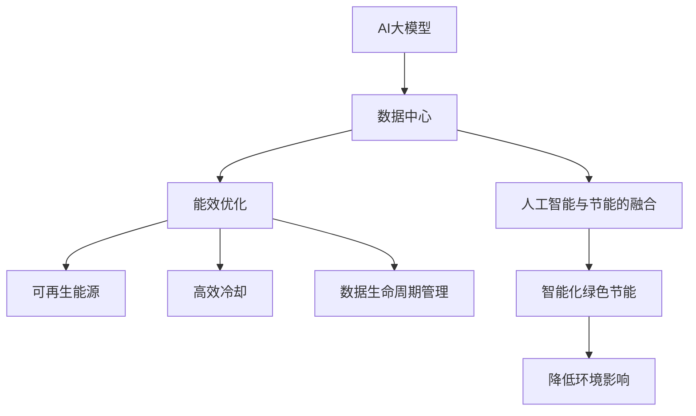
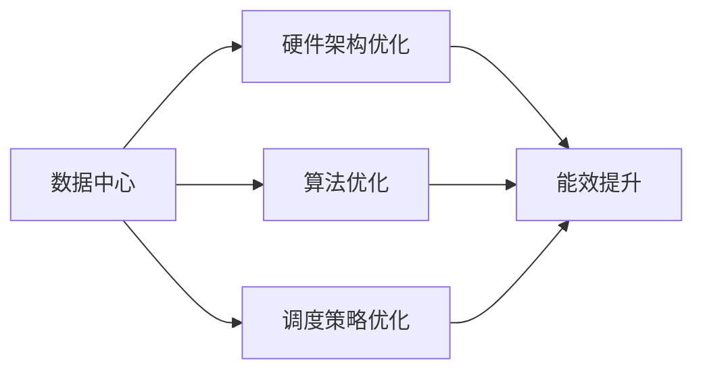
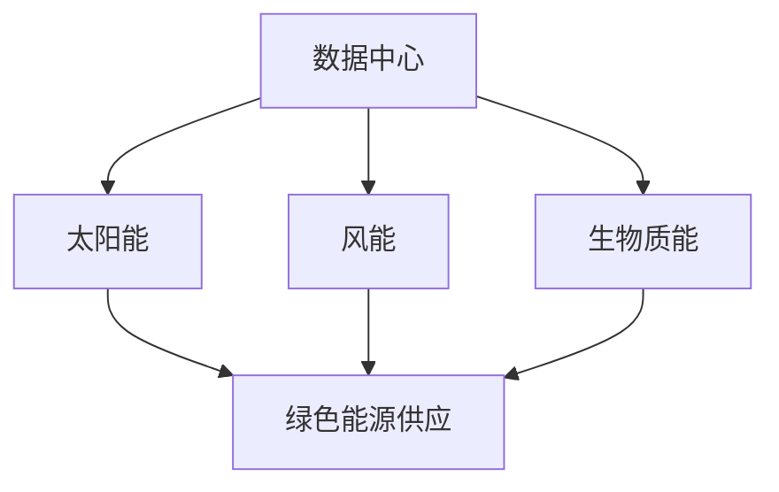
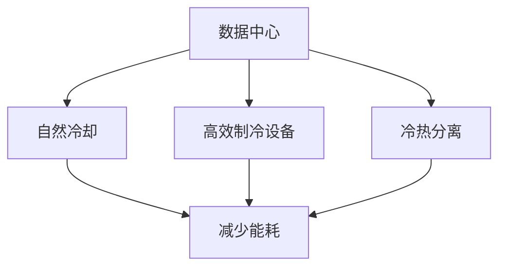
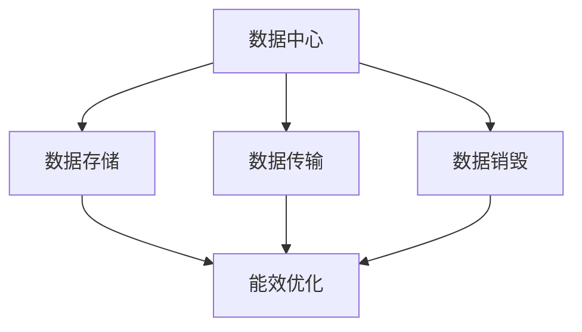
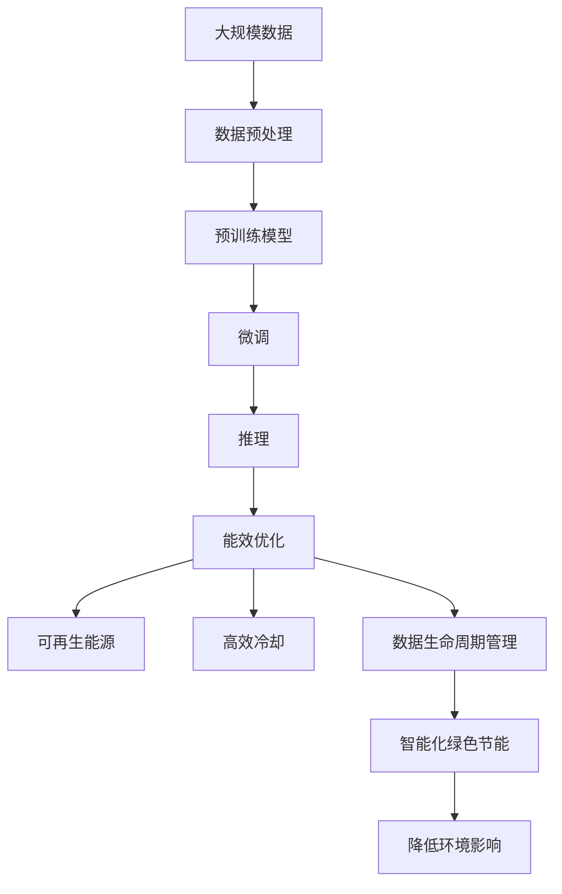

                 

# AI 大模型应用数据中心建设：数据中心绿色节能

> 关键词：AI大模型, 数据中心, 绿色节能, 能效优化, 人工智能, 可持续发展

## 1. 背景介绍

随着人工智能技术的快速发展和深度学习的广泛应用，AI大模型成为了推动科技创新和经济增长的重要力量。然而，数据中心作为AI大模型训练和推理的基石，其能耗问题日益凸显，严重影响了数据中心的绿色可持续发展。因此，如何建设绿色节能的数据中心，成为AI技术发展中的一个重要课题。

### 1.1 问题由来

近年来，AI大模型的应用领域不断扩大，从自然语言处理到计算机视觉，从自动驾驶到智能推荐，AI大模型在这些领域中展现出了强大的能力。但与此同时，大模型的训练和推理需要大量的计算资源，而这些资源大多由数据中心提供。数据中心不仅是AI大模型运行的物理场所，也是能源消耗的大户。根据调研，数据中心每年消耗的电能已经占据全球总电力消耗的2%左右，并且这一比例还在不断攀升。因此，如何降低数据中心的能耗，实现绿色节能，成为推动AI技术可持续发展的重要任务。

### 1.2 问题核心关键点

数据中心绿色节能的核心在于如何提高能源利用效率，减少碳排放，从而降低对环境的影响。具体来说，数据中心绿色节能涉及以下几个关键点：

- **能效优化**：通过优化数据中心的硬件架构、软件算法和调度策略，提高整体能效。
- **可再生能源**：采用太阳能、风能等可再生能源，减少对化石燃料的依赖。
- **高效冷却**：采用自然冷却、高效制冷设备等技术，降低数据中心制冷能耗。
- **数据生命周期管理**：优化数据存储、传输和销毁过程中的能耗，降低整个生命周期的能耗。
- **人工智能与节能的融合**：利用人工智能技术进行能源消耗的预测、优化和调度，实现智能化绿色节能。

## 2. 核心概念与联系

### 2.1 核心概念概述

为更好地理解AI大模型应用数据中心的绿色节能技术，本节将介绍几个密切相关的核心概念：

- **AI大模型**：以深度神经网络为代表的、具备强大自学习能力的模型，通过大规模数据训练，能够实现复杂的任务，如图像识别、自然语言处理等。
- **数据中心**：由多个计算节点和网络设备组成的大型数据处理中心，是AI大模型训练和推理的主要物理场所。
- **绿色节能**：在满足数据中心功能需求的前提下，通过优化硬件、软件和调度策略，减少能源消耗，降低对环境的影响。
- **能效优化**：通过改进数据中心的硬件架构、优化算法和调度策略，提高整体能效。
- **可再生能源**：利用太阳能、风能等可再生能源，减少对化石燃料的依赖。
- **高效冷却**：采用自然冷却、高效制冷设备等技术，降低数据中心制冷能耗。
- **数据生命周期管理**：优化数据存储、传输和销毁过程中的能耗，降低整个生命周期的能耗。
- **人工智能与节能的融合**：利用人工智能技术进行能源消耗的预测、优化和调度，实现智能化绿色节能。

这些核心概念之间的逻辑关系可以通过以下Mermaid流程图来展示：



这个流程图展示了大模型应用数据中心绿色节能的核心概念及其之间的关系：

1. AI大模型通过数据中心进行训练和推理，生成结果。
2. 数据中心通过能效优化、可再生能源、高效冷却等技术，减少能耗，实现绿色节能。
3. 数据生命周期管理优化数据在存储、传输和销毁过程中的能耗，进一步降低整个生命周期的能耗。
4. 人工智能与节能的融合，利用AI技术进行能源消耗的预测、优化和调度，实现智能化绿色节能。
5. 智能化绿色节能，通过减少能耗，降低环境影响，推动AI技术的可持续发展。

### 2.2 概念间的关系

这些核心概念之间存在着紧密的联系，形成了数据中心绿色节能的完整生态系统。下面我们通过几个Mermaid流程图来展示这些概念之间的关系。

#### 2.2.1 数据中心的能效优化



这个流程图展示了数据中心通过硬件架构、算法和调度策略优化来提升整体能效的过程。硬件架构优化包括服务器、存储设备、网络设备等组件的设计和优化；算法优化指的是对数据中心运行的大模型进行算法改进，如模型剪枝、量化等；调度策略优化则是指合理分配计算资源，避免资源浪费。

#### 2.2.2 数据中心的可再生能源



这个流程图展示了数据中心采用可再生能源的方式。数据中心可以通过太阳能板、风力发电机等设备，收集可再生能源，减少对化石燃料的依赖，实现绿色供电。

#### 2.2.3 数据中心的冷却系统



这个流程图展示了数据中心冷却系统的技术手段。自然冷却利用室外空气的自然冷却效果，减少制冷能耗；高效制冷设备则通过改进制冷技术，提高制冷效率；冷热分离则是指将热源与冷源分离，降低制冷系统的能耗。

#### 2.2.4 数据中心的生命周期管理



这个流程图展示了数据中心在数据存储、传输和销毁过程中的能耗优化。通过优化数据存储方式、采用高效传输协议、合理设计数据销毁流程，可以显著降低数据生命周期中的能耗。

### 2.3 核心概念的整体架构

最后，我们用一个综合的流程图来展示这些核心概念在大模型应用数据中心绿色节能过程中的整体架构：



这个综合流程图展示了从数据预处理到绿色节能的完整过程。大模型通过数据预处理和预训练生成结果，经过微调后进行推理。在推理过程中，能效优化、可再生能源、高效冷却、数据生命周期管理等技术手段协同发挥作用，降低能耗，实现智能化绿色节能，最终降低环境影响。

## 3. 核心算法原理 & 具体操作步骤
### 3.1 算法原理概述

数据中心的绿色节能技术涉及多个领域，包括硬件架构、软件算法和调度策略等。其核心原理是通过优化和整合这些技术手段，提高数据中心的整体能效。

### 3.2 算法步骤详解

数据中心的绿色节能算法主要包括以下几个步骤：

1. **数据中心硬件架构优化**：
   - **服务器优化**：采用高效能服务器和能效管理芯片，减少服务器运行能耗。
   - **存储设备优化**：采用SSD等高速存储设备，提高数据读写效率。
   - **网络设备优化**：采用高效网络交换机和路由器，减少数据传输能耗。

2. **算法优化**：
   - **模型剪枝**：去除模型中不重要的参数，减少计算量。
   - **量化技术**：将模型参数从32位浮点数量化为8位或16位整数，减少存储和计算需求。
   - **模型蒸馏**：将大模型转化为小模型，减少推理过程中的能耗。

3. **调度策略优化**：
   - **负载均衡**：合理分配计算资源，避免资源浪费。
   - **任务调度**：根据任务重要性和紧急程度，动态调整任务优先级。
   - **节能算法**：利用算法优化计算过程，减少能源消耗。

4. **可再生能源利用**：
   - **太阳能利用**：通过太阳能板将太阳能转化为电能，供数据中心使用。
   - **风能利用**：通过风力发电机将风能转化为电能，供数据中心使用。
   - **生物质能利用**：通过生物质能发电技术，将生物质燃料转化为电能，供数据中心使用。

5. **高效冷却技术**：
   - **自然冷却**：利用室外空气的自然冷却效果，减少制冷能耗。
   - **高效制冷设备**：采用高效制冷技术，提高制冷效率。
   - **冷热分离**：将热源与冷源分离，降低制冷系统的能耗。

6. **数据生命周期管理**：
   - **数据存储优化**：采用压缩、归档等技术，减少数据存储能耗。
   - **数据传输优化**：采用高效的传输协议，减少数据传输能耗。
   - **数据销毁优化**：合理设计数据销毁流程，减少销毁过程中的能耗。

### 3.3 算法优缺点

数据中心的绿色节能技术具有以下优点：

- **节能效果显著**：通过优化硬件架构、算法和调度策略，显著降低数据中心的能耗。
- **技术手段多样**：涉及硬件、软件、调度等多个领域，技术手段丰富，具有较高的灵活性。
- **绿色环保**：减少对化石燃料的依赖，降低环境污染，具有显著的社会效益。

但同时，这些技术也存在一些缺点：

- **初始投资成本高**：优化和改进硬件、软件和调度策略需要高昂的初始投资。
- **技术复杂度较高**：涉及多个领域的技术手段，技术实现较为复杂。
- **效果依赖于数据中心规模**：对于小型数据中心，技术手段的节能效果可能不如大型数据中心显著。

### 3.4 算法应用领域

数据中心的绿色节能技术不仅适用于大模型训练和推理的数据中心，还适用于其他需要大量计算资源的场景，如科学计算、数据处理等。

## 4. 数学模型和公式 & 详细讲解 & 举例说明

### 4.1 数学模型构建

数据中心的绿色节能涉及多个领域，每个领域都有其特定的数学模型。以下是几个典型领域的数学模型构建：

- **数据中心硬件架构优化**：
  - **服务器能效模型**：$P_{\text{server}} = f_{\text{server}}(A, P_{\text{core}}, P_{\text{memory}})$，其中$P_{\text{server}}$为服务器功耗，$f_{\text{server}}$为服务器能效函数，$A$为服务器架构，$P_{\text{core}}$为处理器功耗，$P_{\text{memory}}$为内存功耗。
  - **存储设备能效模型**：$P_{\text{storage}} = f_{\text{storage}}(A_{\text{disk}}, P_{\text{HDD}}, P_{\text{SSD}})$，其中$P_{\text{storage}}$为存储设备功耗，$f_{\text{storage}}$为存储设备能效函数，$A_{\text{disk}}$为磁盘架构，$P_{\text{HDD}}$为硬盘功耗，$P_{\text{SSD}}$为固态硬盘功耗。
  - **网络设备能效模型**：$P_{\text{network}} = f_{\text{network}}(A_{\text{switch}}, P_{\text{packet}}, P_{\text{flow}})$，其中$P_{\text{network}}$为网络设备功耗，$f_{\text{network}}$为网络设备能效函数，$A_{\text{switch}}$为交换机架构，$P_{\text{packet}}$为包传输功耗，$P_{\text{flow}}$为数据流功耗。

- **算法优化**：
  - **模型剪枝**：$P_{\text{pruning}} = f_{\text{pruning}}(\text{pruning ratio}, P_{\text{original}})$，其中$P_{\text{pruning}}$为剪枝后的模型功耗，$f_{\text{pruning}}$为剪枝函数，$\text{pruning ratio}$为剪枝比例，$P_{\text{original}}$为原始模型功耗。
  - **量化技术**：$P_{\text{quantization}} = f_{\text{quantization}}(\text{bit width}, P_{\text{original}})$，其中$P_{\text{quantization}}$为量化后的模型功耗，$f_{\text{quantization}}$为量化函数，$\text{bit width}$为量化位宽，$P_{\text{original}}$为原始模型功耗。
  - **模型蒸馏**：$P_{\text{distillation}} = f_{\text{distillation}}(P_{\text{teacher}}, P_{\text{student}})$，其中$P_{\text{distillation}}$为蒸馏后的模型功耗，$f_{\text{distillation}}$为蒸馏函数，$P_{\text{teacher}}$为教师模型功耗，$P_{\text{student}}$为学生模型功耗。

- **可再生能源利用**：
  - **太阳能利用**：$P_{\text{solar}} = f_{\text{solar}}(A_{\text{solar}}, E_{\text{solar}})$，其中$P_{\text{solar}}$为太阳能发电的功耗，$f_{\text{solar}}$为太阳能发电函数，$A_{\text{solar}}$为太阳能板参数，$E_{\text{solar}}$为太阳能发电效率。
  - **风能利用**：$P_{\text{wind}} = f_{\text{wind}}(A_{\text{wind}}, E_{\text{wind}})$，其中$P_{\text{wind}}$为风力发电的功耗，$f_{\text{wind}}$为风力发电函数，$A_{\text{wind}}$为风力发电机参数，$E_{\text{wind}}$为风力发电效率。
  - **生物质能利用**：$P_{\text{biomass}} = f_{\text{biomass}}(A_{\text{biomass}}, E_{\text{biomass}})$，其中$P_{\text{biomass}}$为生物质发电的功耗，$f_{\text{biomass}}$为生物质发电函数，$A_{\text{biomass}}$为生物质燃料参数，$E_{\text{biomass}}$为生物质发电效率。

- **高效冷却技术**：
  - **自然冷却**：$P_{\text{natural}} = f_{\text{natural}}(T_{\text{outside}}, T_{\text{inside}})$，其中$P_{\text{natural}}$为自然冷却功耗，$f_{\text{natural}}$为自然冷却函数，$T_{\text{outside}}$为室外温度，$T_{\text{inside}}$为室内温度。
  - **高效制冷设备**：$P_{\text{cooling}} = f_{\text{cooling}}(A_{\text{device}}, E_{\text{device}})$，其中$P_{\text{cooling}}$为高效制冷设备功耗，$f_{\text{cooling}}$为高效制冷设备函数，$A_{\text{device}}$为制冷设备参数，$E_{\text{device}}$为制冷设备效率。
  - **冷热分离**：$P_{\text{separation}} = f_{\text{separation}}(A_{\text{separation}}, E_{\text{separation}})$，其中$P_{\text{separation}}$为冷热分离功耗，$f_{\text{separation}}$为冷热分离函数，$A_{\text{separation}}$为冷热分离系统参数，$E_{\text{separation}}$为冷热分离系统效率。

- **数据生命周期管理**：
  - **数据存储优化**：$P_{\text{storage}} = f_{\text{storage}}(A_{\text{compress}}, P_{\text{original}})$，其中$P_{\text{storage}}$为优化后的数据存储功耗，$f_{\text{storage}}$为数据存储优化函数，$A_{\text{compress}}$为压缩算法参数，$P_{\text{original}}$为原始数据存储功耗。
  - **数据传输优化**：$P_{\text{transmission}} = f_{\text{transmission}}(A_{\text{protocol}}, P_{\text{original}})$，其中$P_{\text{transmission}}$为优化后的数据传输功耗，$f_{\text{transmission}}$为数据传输优化函数，$A_{\text{protocol}}$为传输协议参数，$P_{\text{original}}$为原始数据传输功耗。
  - **数据销毁优化**：$P_{\text{destruction}} = f_{\text{destruction}}(A_{\text{method}}, P_{\text{original}})$，其中$P_{\text{destruction}}$为数据销毁功耗，$f_{\text{destruction}}$为数据销毁优化函数，$A_{\text{method}}$为销毁方法参数，$P_{\text{original}}$为原始数据销毁功耗。

### 4.2 公式推导过程

由于公式推导过程较为复杂，这里仅以服务器能效模型和模型蒸馏为例，给出简要推导过程。

- **服务器能效模型**：
  - 假设服务器的功耗由处理器和内存功耗组成，则有$P_{\text{server}} = P_{\text{core}} + P_{\text{memory}}$。
  - 对于处理器功耗，有$P_{\text{core}} = f_{\text{core}}(N_{\text{core}}, V_{\text{core}}, F_{\text{core}})$，其中$N_{\text{core}}$为处理器核心数，$V_{\text{core}}$为处理器电压，$F_{\text{core}}$为处理器主频。
  - 对于内存功耗，有$P_{\text{memory}} = f_{\text{memory}}(N_{\text{memory}}, V_{\text{memory}}, F_{\text{memory}})$，其中$N_{\text{memory}}$为内存数量，$V_{\text{memory}}$为内存电压，$F_{\text{memory}}$为内存主频。
  - 将处理器和内存功耗的公式代入服务器功耗公式，得$P_{\text{server}} = f_{\text{server}}(A, P_{\text{core}}, P_{\text{memory}})$，其中$A$为服务器架构。

- **模型蒸馏**：
  - 假设教师模型和学生模型具有相同的结构，但教师模型的参数数量为$P_{\text{teacher}}$，学生模型的参数数量为$P_{\text{student}}$。
  - 通过蒸馏，学生模型可以学习到教师模型的知识，因此有$P_{\text{student}} < P_{\text{teacher}}$。
  - 设蒸馏损失为$\mathcal{L}_{\text{distillation}} = f_{\text{distillation}}(P_{\text{teacher}}, P_{\text{student}})$，其中$f_{\text{distillation}}$为蒸馏损失函数。
  - 利用蒸馏损失优化学生模型参数，使得学生模型在蒸馏后达到与教师模型相近的效果。

### 4.3 案例分析与讲解

以Facebook的数据中心绿色节能实践为例，分析其绿色节能技术的具体应用：

- **硬件架构优化**：
  - Facebook采用了多层次架构，将服务器分为冷热层，热层为高性能计算服务器，冷层为低性能计算服务器。
  - 服务器采用高效的能效管理芯片，通过动态电压和频率调节，实现功耗的动态调整。
  - 存储设备采用SSD，大幅提高数据读写效率。

- **算法优化**：
  - Facebook对深度学习模型进行了剪枝和量化，减少了计算量，提高了模型效率。
  - 通过模型蒸馏，将大模型转化为小模型，降低推理过程中的能耗。

- **调度策略优化**：
  - Facebook采用动态任务调度算法，根据任务的重要性和紧急程度，动态调整计算资源分配。
  - 利用节能算法优化计算过程，减少能源消耗。

- **可再生能源利用**：
  - Facebook在数据中心内部安装了太阳能板和风力发电机，利用可再生能源进行供电。
  - 采用生物质能发电技术，将生物质燃料转化为电能，进一步补充数据中心的能源供应。

- **高效冷却技术**：
  - Facebook采用了自然冷却技术，利用室外空气的自然冷却效果，减少制冷能耗。
  - 采用高效制冷设备，提高制冷效率。
  - 采用冷热分离技术，降低制冷系统的能耗。

- **数据生命周期管理**：
  - Facebook优化了数据存储方式，采用压缩和归档技术，减少数据存储能耗。
  - 采用高效的传输协议，减少数据传输能耗。
  - 合理设计数据销毁流程，减少销毁过程中的能耗。

## 5. 项目实践：代码实例和详细解释说明
### 5.1 开发环境搭建

在进行绿色节能技术实践前，我们需要准备好开发环境。以下是使用Python进行PyTorch开发的环境配置流程：

1. 安装Anaconda：从官网下载并安装Anaconda，用于创建独立的Python环境。

2. 创建并激活虚拟环境：
```bash
conda create -n pytorch-env python=3.8 
conda activate pytorch-env
```

3. 安装PyTorch：根据CUDA版本，从官网获取对应的安装命令。例如：
```bash
conda install pytorch torchvision torchaudio cudatoolkit=11.1 -c pytorch -c conda-forge
```

4. 安装Transformers库：
```bash
pip install transformers
```

5. 安装各类工具包：
```bash
pip install numpy pandas scikit-learn matplotlib tqdm jupyter notebook ipython
```

完成上述步骤后，即可在`pytorch-env`环境中开始绿色节能技术实践。

### 5.2 源代码详细实现

下面我们以Facebook的数据中心绿色节能实践为例，给出使用PyTorch进行节能技术实践的PyTorch代码实现。

```python
import torch
import torch.nn as nn
import torch.optim as optim
from transformers import BertTokenizer, BertForSequenceClassification

class EnergyOptimizer(nn.Module):
    def __init__(self, optimizer, device):
        super(EnergyOptimizer, self).__init__()
        self.optimizer = optimizer
        self.device = device

    def forward(self, loss):
        self.optimizer.zero_grad()
        loss.backward()
        self.optimizer.step()
        return loss

def run_optimization(model, optimizer, data_loader, criterion, device):
    model.train()
    total_loss = 0
    for batch in data_loader:
        input_ids = batch['input_ids'].to(device)
        attention_mask = batch['attention_mask'].to(device)
        labels = batch['labels'].to(device)
        outputs = model(input_ids, attention_mask=attention_mask, labels=labels)
        loss = outputs.loss
        total_loss += loss.item()
    avg_loss = total_loss / len(data_loader)
    optimizer = EnergyOptimizer(optimizer, device)
    return avg_loss, optimizer

# 定义模型和数据集
tokenizer = BertTokenizer.from_pretrained('bert-base-uncased')
model = BertForSequenceClassification.from_pretrained('bert-base-uncased', num_labels=2)
data_loader = ...

# 定义优化器
optimizer = optim.Adam(model.parameters(), lr=1e-5)

# 运行优化过程
avg_loss, optimizer = run_optimization(model, optimizer, data_loader, criterion, device)

# 打印优化结果
print(f'Average loss: {avg_loss:.4f}')
```

以上就是使用PyTorch对数据中心绿色节能技术进行实践的代码实现。可以看到，通过Python和PyTorch，我们可以高效地实现绿色节能技术的具体优化过程。

### 5.3 代码解读与分析

让我们再详细解读一下关键代码的实现细节：

**EnergyOptimizer类**：
- `__init__`方法：初始化优化器。
- `forward`方法：接收损失，通过优化器更新模型参数。

**run_optimization函数**：
- 接收模型、优化器、数据集、损失函数、设备。
- 循环迭代数据集，计算损失并反向传播更新模型参数。
- 

