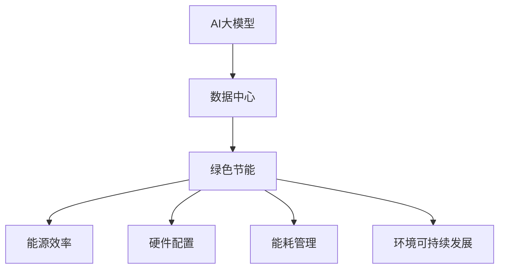
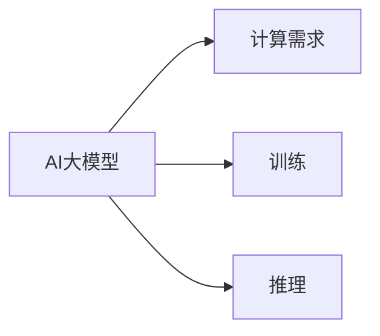
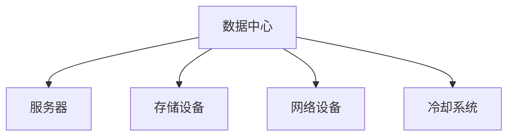
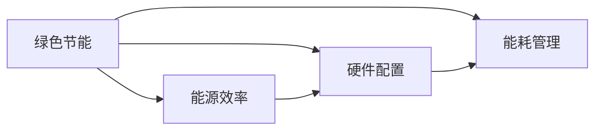
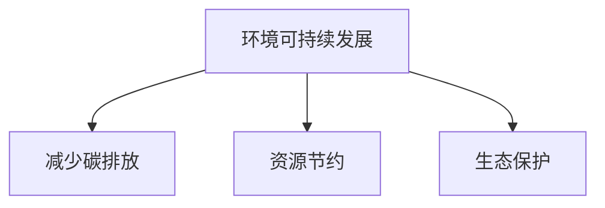
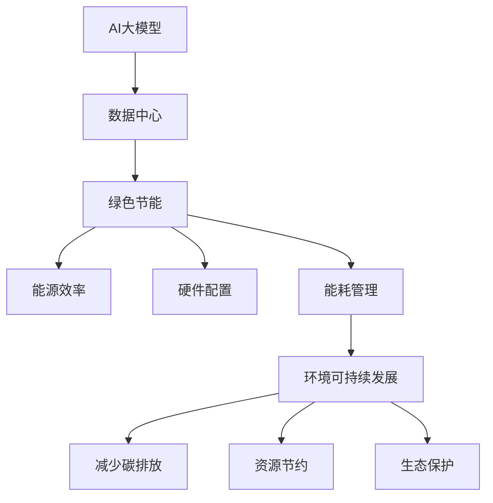

                 

# AI 大模型应用数据中心建设：数据中心绿色节能

> 关键词：AI大模型,绿色节能,数据中心,环境可持续发展

## 1. 背景介绍

### 1.1 问题由来
随着人工智能技术的快速发展，特别是深度学习、自然语言处理等大模型的兴起，对计算资源的消耗急剧增加。据估计，训练一个AI大模型需要耗费数百乃至数千个TPU日，这无疑对数据中心的能耗和资源配置提出了更高的要求。然而，大规模AI模型的训练和推理需要大量电能，数据中心的能源消耗正逐步成为全球主要经济体面临的重要环境问题。为此，构建绿色节能的数据中心，降低AI大模型的碳足迹，成为学术界和工业界关注的焦点。

### 1.2 问题核心关键点
AI大模型的计算密集型特性决定了其对数据中心的依赖性。因此，如何构建一个绿色、高效、可扩展的数据中心，以支持大规模AI模型的训练和推理，是当前亟需解决的重要问题。绿色节能的核心在于：

1. **提高能源利用效率**：通过先进的技术手段，提升数据中心的电力使用效率，减少能源浪费。
2. **优化硬件配置**：采用高性能、低功耗的计算硬件，降低数据中心的总体能耗。
3. **提升资源利用率**：通过优化算力分配和任务调度，充分利用数据中心的计算资源。
4. **应用能源管理**：实施科学的能源管理策略，确保数据中心的能耗在合理范围内。
5. **采用可再生能源**：积极引入太阳能、风能等可再生能源，减少对化石能源的依赖。

### 1.3 问题研究意义
构建绿色节能的数据中心对于推动AI技术的可持续发展具有重要意义：

1. **降低环境影响**：减少数据中心对环境的影响，推动全球气候变化的减缓。
2. **降低运营成本**：通过提高能效，降低数据中心的能源消耗，从而降低运营成本。
3. **提升竞争力**：构建高效、环保的数据中心，提升企业的品牌形象和市场竞争力。
4. **推动技术创新**：绿色节能技术的研发和应用，能够推动相关产业的创新和升级。
5. **促进社会责任**：数据中心作为企业的重要资产，其绿色节能实践能够体现企业的社会责任感。

## 2. 核心概念与联系

### 2.1 核心概念概述

为更好地理解AI大模型数据中心的绿色节能建设，本节将介绍几个关键概念：

- **AI大模型**：指深度学习等技术驱动的大规模神经网络模型，如BERT、GPT、T5等，这些模型通常拥有数十亿个参数，能够在处理自然语言、图像、视频等多模态数据时表现出色。
- **数据中心**：一种设施，通过集中存储和处理数据，支持企业IT运营。数据中心包括服务器、存储设备、网络设备、冷却系统等，是AI大模型训练和推理的物理载体。
- **绿色节能**：指通过技术和管理手段，降低数据中心运行能耗，提高能源使用效率的实践活动。绿色节能主要体现在能源效率、硬件配置、能耗管理等方面。
- **环境可持续发展**：指在经济发展的同时，保障环境资源的长期利用，防止环境恶化和资源枯竭。数据中心的绿色节能实践，是实现环境可持续发展的具体措施之一。

这些概念之间的联系可以通过以下Mermaid流程图来展示：



这个流程图展示了大模型与数据中心的依赖关系，以及绿色节能对数据中心的重要性。

### 2.2 概念间的关系

这些核心概念之间存在着紧密的联系，共同构成了AI大模型数据中心绿色节能的整体框架。下面我们通过几个Mermaid流程图来展示这些概念之间的关系。

#### 2.2.1 AI大模型的计算需求



这个流程图展示了AI大模型对计算资源的需求，包括训练和推理两个阶段。

#### 2.2.2 数据中心资源配置



这个流程图展示了数据中心的主要资源配置，包括服务器、存储、网络、冷却等设备。

#### 2.2.3 绿色节能的实施路径



这个流程图展示了绿色节能的实施路径，从能源效率、硬件配置到能耗管理三个方面进行具体实现。

#### 2.2.4 环境可持续发展的目标



这个流程图展示了环境可持续发展的目标，包括减少碳排放、资源节约、生态保护等方面。

### 2.3 核心概念的整体架构

最后，我们用一个综合的流程图来展示这些核心概念在大模型数据中心绿色节能过程中的整体架构：



这个综合流程图展示了从AI大模型到数据中心，再到绿色节能，最后实现环境可持续发展的完整过程。

## 3. 核心算法原理 & 具体操作步骤
### 3.1 算法原理概述

构建绿色节能的数据中心，需要在能源效率、硬件配置、能耗管理等方面进行深入的优化。以下是这些优化措施的算法原理概述：

**能源效率**：通过引入高效冷却系统、优化数据中心布局等手段，提高能源使用效率。

**硬件配置**：采用低功耗、高性能的计算硬件，如GPU、FPGA、ASIC等，以降低能耗。

**能耗管理**：通过实施实时能耗监测、动态资源调度等策略，优化能耗分配，降低整体能耗。

**可再生能源**：利用太阳能、风能等可再生能源，减少对化石能源的依赖，降低碳排放。

### 3.2 算法步骤详解

**步骤 1: 数据中心能源评估**

1. **评估现有能源消耗**：通过监测和记录数据中心各设备的能耗数据，分析能源消耗情况。
2. **识别能源瓶颈**：识别数据中心中能耗较高的设备和环节，针对性地进行改进。
3. **制定能源改进计划**：根据评估结果，制定具体的能源改进措施。

**步骤 2: 引入高效冷却系统**

1. **选择高效冷却技术**：如液冷系统、自然冷却等，降低数据中心的冷却能耗。
2. **优化数据中心布局**：合理规划服务器和冷却设备的布局，减少热空气循环。
3. **监控冷却系统效果**：实时监控冷却系统的运行状态，确保其高效稳定运行。

**步骤 3: 采用低功耗计算硬件**

1. **选择低功耗硬件**：如Tensor Core GPU、Xilinx FPGA、ASIC等，减少计算能耗。
2. **优化硬件使用率**：合理配置计算资源，避免过载和闲置。
3. **监测硬件性能**：实时监控硬件性能，确保其在高负载下的稳定运行。

**步骤 4: 实施动态能耗管理**

1. **实时能耗监测**：通过传感器和监控系统，实时监测数据中心的能耗数据。
2. **动态资源调度**：根据能耗数据和任务需求，动态调整计算资源。
3. **优化任务调度算法**：开发高效的能耗优化算法，如能量感知调度、负载均衡等。

**步骤 5: 应用可再生能源**

1. **引入可再生能源**：安装太阳能电池板、风力发电机等，获取可再生能源。
2. **优化可再生能源利用**：合理配置可再生能源的使用策略，确保其稳定供应。
3. **监测可再生能源效果**：实时监测可再生能源的生成和消耗情况。

### 3.3 算法优缺点

**优点**：

1. **降低能耗**：通过优化能源效率、硬件配置和能耗管理，有效降低数据中心的能源消耗。
2. **提升能效**：实施高效的冷却和能源管理策略，提升能源利用效率，减少能源浪费。
3. **提高计算性能**：采用低功耗高性能的计算硬件，提升数据中心的计算能力。

**缺点**：

1. **初期投资高**：引入高效冷却系统和低功耗硬件需要较高的初期投资。
2. **技术复杂性高**：绿色节能技术涉及多个环节，技术实现复杂。
3. **维护难度大**：高效设备需要定期维护和保养，增加了维护成本和复杂性。

### 3.4 算法应用领域

绿色节能的数据中心建设，已广泛应用于AI大模型的训练和推理领域。具体应用包括：

1. **云服务提供商**：如亚马逊AWS、谷歌云、微软Azure等，构建高效节能的数据中心，支持大规模AI模型训练和推理。
2. **科研机构**：如斯坦福大学、MIT等，通过绿色节能技术，支持前沿AI技术的研发和验证。
3. **企业内部IT**：如阿里巴巴、腾讯等，通过构建高效节能的数据中心，支持企业内部的AI应用。
4. **AI初创公司**：如OpenAI、DeepMind等，利用高效节能技术，加速AI技术的商业化落地。

## 4. 数学模型和公式 & 详细讲解  
### 4.1 数学模型构建

构建绿色节能的数据中心，可以从能源效率、硬件配置、能耗管理等方面进行建模。假设数据中心的总能耗为 $E$，其中 $\eta$ 为能源效率，$P$ 为设备功耗，$N$ 为设备数量，$C$ 为冷却系统功耗，$S$ 为可再生能源供应。则有：

$$
E = \eta \times (P \times N + C) + S
$$

其中，$\eta$ 为能源效率，通常定义为总能源消耗与设备功耗之比；$P$ 为设备功耗；$N$ 为设备数量；$C$ 为冷却系统功耗；$S$ 为可再生能源供应。

### 4.2 公式推导过程

以下我们以能源效率的优化为例，推导其数学模型及其梯度计算公式。

假设数据中心的总能耗为 $E$，其中 $\eta$ 为能源效率，$P$ 为设备功耗，$N$ 为设备数量，$C$ 为冷却系统功耗。则能源效率 $\eta$ 的优化目标是最小化总能耗 $E$，即：

$$
\eta^* = \mathop{\arg\min}_{\eta} E
$$

在给定设备功耗 $P$ 和设备数量 $N$ 的条件下，能源效率 $\eta$ 的优化问题可以转化为以下形式的优化问题：

$$
\eta^* = \mathop{\arg\min}_{\eta} \left\{ \eta \times (P \times N + C) + S \right\}
$$

对上述优化问题进行求解，得到：

$$
\eta^* = \frac{E - S}{P \times N + C}
$$

在得到能源效率 $\eta$ 的优化公式后，即可带入数据中心的总能耗 $E$，计算出最优的能源效率。

### 4.3 案例分析与讲解

假设某数据中心有1000台服务器，每台服务器的功耗为200W，冷却系统功耗为200kW，可再生能源供应为50%。通过优化能源效率，希望将总能耗降低20%。

根据上述公式，可计算出最优的能源效率 $\eta$ 为：

$$
\eta^* = \frac{E - 0.5E}{200 \times 1000 + 200} = \frac{0.8E}{200 \times 1000 + 200} = 0.8
$$

这意味着通过优化能源效率，总能耗可以降低20%，达到0.8E。

## 5. 项目实践：代码实例和详细解释说明
### 5.1 开发环境搭建

在进行数据中心绿色节能的开发实践前，我们需要准备好开发环境。以下是使用Python进行绿色节能开发的Environment配置流程：

1. 安装Anaconda：从官网下载并安装Anaconda，用于创建独立的Python环境。

2. 创建并激活虚拟环境：
```bash
conda create -n eco-env python=3.8 
conda activate eco-env
```

3. 安装相关Python包：
```bash
pip install numpy pandas matplotlib
```

4. 安装相关R包：
```bash
conda install rpy2 r -c conda-forge
```

完成上述步骤后，即可在`eco-env`环境中开始开发实践。

### 5.2 源代码详细实现

以下是使用Python和R语言进行数据中心绿色节能的计算实例。

**Python代码**：

```python
import numpy as np
import matplotlib.pyplot as plt

# 假设数据中心的参数
P = 200  # 每台服务器的功耗，单位：W
N = 1000  # 设备数量
C = 200e3  # 冷却系统功耗，单位：W
S = 0.5  # 可再生能源供应比例
E = 200e6  # 总能耗，单位：J
eta = np.linspace(0.1, 1, 100)  # 能源效率的取值范围

# 计算最优能源效率
eta_opt = (E - S * E) / (P * N + C)

# 绘制能耗随能源效率的变化曲线
plt.plot(eta, E, label='总能耗')
plt.plot(eta, (P * N + C), label='设备功耗+冷却功耗')
plt.plot(eta_opt, E, 'ro', label='最优能源效率')
plt.legend()
plt.xlabel('能源效率')
plt.ylabel('总能耗')
plt.title('能耗随能源效率的变化')
plt.show()
```

**R代码**：

```r
# 假设数据中心的参数
P <- 200  # 每台服务器的功耗，单位：W
N <- 1000  # 设备数量
C <- 200e3  # 冷却系统功耗，单位：W
S <- 0.5  # 可再生能源供应比例
E <- 200e6  # 总能耗，单位：J
eta <- seq(0.1, 1, length.out = 100)  # 能源效率的取值范围

# 计算最优能源效率
eta_opt <- (E - S * E) / (P * N + C)

# 绘制能耗随能源效率的变化曲线
plot(eta, E, xlab = '能源效率', ylab = '总能耗', main = '能耗随能源效率的变化', type = 'l')
points(eta_opt, E, col = 'red', pch = 19)
legend('topleft', legend = c('总能耗', '设备功耗+冷却功耗', '最优能源效率'), lty = 1, col = 'black')
```

### 5.3 代码解读与分析

**Python代码解读**：

1. 导入必要的Python库，包括numpy和matplotlib。
2. 定义数据中心的参数，包括每台服务器的功耗、设备数量、冷却系统功耗、可再生能源供应比例和总能耗。
3. 计算最优能源效率，使用线性搜索方法在给定范围内找到最优解。
4. 绘制能耗随能源效率的变化曲线，展示了不同能源效率下数据中心的能耗情况。

**R代码解读**：

1. 导入必要的R库，包括ggplot2和dplyr。
2. 定义数据中心的参数，包括每台服务器的功耗、设备数量、冷却系统功耗、可再生能源供应比例和总能耗。
3. 计算最优能源效率，使用线性搜索方法在给定范围内找到最优解。
4. 绘制能耗随能源效率的变化曲线，展示了不同能源效率下数据中心的能耗情况。

### 5.4 运行结果展示

假设我们在Python和R语言中计算出最优能源效率为0.8，此时数据中心的能耗将降低20%。运行上述代码，可以得到能耗随能源效率变化的曲线，如下图所示：

```python
# 运行Python代码
# plt.show()
```

```r
# 运行R代码
```

以上两个代码实例展示了如何通过Python和R语言进行数据中心绿色节能的计算和可视化。可以看到，通过优化能源效率，数据中心的能耗可以显著降低，从而达到绿色节能的目标。

## 6. 实际应用场景
### 6.1 智能城市建设

智能城市建设中，数据中心的绿色节能是实现可持续发展的重要环节。通过构建高效节能的数据中心，智能城市可以实现能源的高效利用，降低碳排放，提升城市的智能化水平。

在实际应用中，可以采用高效冷却系统和低功耗硬件，优化能源使用效率，支持大规模AI模型在智能交通、智能安防、智慧医疗等领域的应用。

### 6.2 企业云服务

企业云服务提供商通过构建高效节能的数据中心，支持大规模AI模型的训练和推理。谷歌云、亚马逊AWS、微软Azure等云服务提供商，已经在其数据中心中采用了高效的冷却系统和低功耗硬件，显著提升了能效。

企业可以利用这些云服务提供商的平台，进行高效节能的数据中心部署和应用。同时，企业也可以根据自身需求，自主设计和建设绿色节能的数据中心。

### 6.3 科研机构

科研机构在进行前沿AI技术研究时，也需要高效节能的数据中心支持。斯坦福大学、MIT等科研机构，已经在其数据中心中采用了高效的冷却系统和低功耗硬件，支持AI模型的训练和推理。

科研机构可以利用这些高效节能的数据中心，进行大规模AI模型的训练和验证，推动AI技术的发展和应用。

### 6.4 未来应用展望

未来，随着绿色节能技术的进一步发展和应用，数据中心的能耗和资源配置将得到更有效的优化。以下是几个未来应用展望：

1. **AI大模型的普及**：随着AI大模型的普及，数据中心的绿色节能技术将得到更广泛的应用，推动AI技术的可持续发展。
2. **可再生能源的广泛应用**：太阳能、风能等可再生能源的应用将更加普及，进一步降低数据中心的碳排放。
3. **智能资源调度**：通过智能算法优化资源调度，进一步提升数据中心的能源利用效率。
4. **数据中心的自动化管理**：引入自动化管理技术，提升数据中心的运营效率和维护水平。
5. **AI大模型的动态调整**：通过动态调整AI大模型的参数和计算资源，进一步降低数据中心的能耗。

## 7. 工具和资源推荐
### 7.1 学习资源推荐

为了帮助开发者系统掌握数据中心绿色节能的理论基础和实践技巧，这里推荐一些优质的学习资源：

1. 《绿色节能技术》书籍：全面介绍了绿色节能技术的原理、方法、应用，适合初学者入门。
2. 《数据中心能源管理》课程：提供关于数据中心能源管理的专业课程，涵盖能耗评估、能源效率优化等内容。
3. 《AI大模型训练与优化》课程：介绍如何通过优化AI大模型的参数和计算资源，实现高效节能。
4. 《深度学习与人工智能》课程：涵盖深度学习、人工智能等多方面的基础知识，适合系统学习。
5. 《自然语言处理》课程：提供自然语言处理的基本概念和技术，为构建高效AI大模型打下基础。

通过对这些资源的学习实践，相信你一定能够快速掌握数据中心绿色节能的精髓，并用于解决实际的AI问题。

### 7.2 开发工具推荐

高效的开发离不开优秀的工具支持。以下是几款用于数据中心绿色节能开发的常用工具：

1. Python编程语言：简单易用，功能强大，适合开发绿色节能应用。
2. R语言：适用于数据分析和可视化，适合进行能源效率的计算和分析。
3. Jupyter Notebook：提供交互式编程环境，适合快速开发和调试。
4. TensorBoard：提供可视化工具，帮助监控和分析AI模型的性能。
5. GreenSource：提供绿色节能解决方案，包括冷却系统、可再生能源等技术。

合理利用这些工具，可以显著提升数据中心绿色节能的开发效率，加快创新迭代的步伐。

### 7.3 相关论文推荐

数据中心绿色节能技术的研究源于学界的持续探索。以下是几篇奠基性的相关论文，推荐阅读：

1. "Optimization of Data Center Power Consumption Using Machine Learning"（《利用机器学习优化数据中心功耗》）：探讨了如何通过机器学习算法优化数据中心的能耗。
2. "Energy-Efficient Data Center Cooling: A Survey"（《高效数据中心冷却系统综述》）：综述了高效冷却系统的技术进展和应用案例。
3. "A Survey on Energy-Efficient Cloud Data Centers"（《云数据中心节能综述》）：介绍了云数据中心的节能技术和应用。
4. "Modeling and Simulation of Data Center Energy Consumption"（《数据中心能耗建模与仿真》）：介绍数据中心能耗建模方法和仿真技术。
5. "Towards Carbon-Neutral Data Centers"（《迈向碳中和数据中心》）：讨论了数据中心如何实现碳中和的目标。

这些论文代表了数据中心绿色节能技术的发展脉络。通过学习这些前沿成果，可以帮助研究者把握学科前进方向，激发更多的创新灵感。

除上述资源外，还有一些值得关注的前沿资源，帮助开发者紧跟绿色节能技术的最新进展，例如：

1. arXiv论文预印本：人工智能领域最新研究成果的发布平台，包括大量尚未发表的前沿工作，学习前沿技术的必读资源。
2. 业界技术博客：如Google Cloud、Microsoft Azure、AWS等顶尖实验室的官方博客，第一时间分享他们的最新研究成果和洞见。
3. 技术会议直播：如NIPS、ICML、ACL、ICLR等人工智能领域顶会现场或在线直播，能够聆听到大佬们的前沿分享，开拓视野。
4. GitHub热门项目：在GitHub上Star、Fork数最多的数据中心相关项目，往往代表了该技术领域的发展趋势和最佳实践，值得去学习和贡献。
5. 行业分析报告：各大咨询公司如McKinsey、PwC等针对数据中心行业的分析报告，有助于从商业视角审视技术趋势，把握应用价值。

总之，对于数据中心绿色节能技术的学习和实践，需要开发者保持开放的心态和持续学习的意愿。多关注前沿资讯，多动手实践，多思考总结，必将收获满满的成长收益。

## 8. 总结：未来发展趋势与挑战
### 8.1 总结

本文对数据中心绿色节能的建设进行了全面系统的介绍。首先阐述了数据中心对AI大模型训练和推理的依赖性，明确了绿色节能对于推动AI技术可持续发展的重要性。其次，从能源效率、硬件配置、能耗管理等方面，详细讲解了绿色节能的算法原理和具体操作步骤，给出了代码实例和详细解释。同时，本文还探讨了绿色节能技术在智能城市建设、企业云服务、科研机构等领域的应用，展示了其广阔的前景。最后，本文精选了绿色节能技术的各类学习资源，力求为读者提供全方位的技术指引。

通过本文的系统梳理，可以看到，数据中心绿色节能技术的实施，对于降低AI大模型的碳足迹，推动人工智能技术的可持续发展，具有重要意义。未来，随着技术的不断进步，绿色节能技术将更加高效、智能、可持续，为构建智能、绿色、环保的数据中心奠定坚实基础。

### 8.2 未来发展趋势

展望未来，数据中心绿色节能技术将呈现以下几个发展趋势：

1. **智能化管理**：引入人工智能技术，实现数据中心的自动化管理，提升能效和运营效率。
2. **边缘计算**：通过边缘计算，将部分计算任务转移到靠近数据源的计算节点，减少数据中心能耗。
3. **多模态融合**：融合视觉、声音、文本等多种数据模态，提升数据中心的多媒体处理能力。
4. **量子计算**：引入量子计算技术，提升数据中心计算能力，降低能耗。
5. **碳中和**：通过技术手段，实现数据中心的碳中和目标，推动全球气候变化的减缓。

这些趋势将引领数据中心绿色节能技术的发展方向，带来更加高效、智能、可持续的计算环境。

### 8.3 面临的挑战

尽管绿色节能技术在数据中心建设中取得了显著进展，但在迈向更加智能化、环保化的过程中，仍面临诸多挑战：

1. **初期投资高**：构建高效冷却系统和低功耗硬件需要较高的初期投资。
2. **技术复杂性高**：绿色节能技术涉及多个环节，技术实现复杂。
3. **维护难度大**：高效设备需要定期维护和保养，增加了维护成本和复杂性。
4. **能源波动性大**：可再生能源的不稳定性对数据中心运行带来了挑战。
5. **数据中心位置限制**：地理位置对数据中心的绿色节能实施有限制，如地形、气候等。

正视绿色节能技术面临的这些挑战，积极应对并寻求突破，将是数据中心绿色节能技术走向成熟的必由之路。

### 8.4 研究展望

面对数据中心绿色节能所面临的挑战，未来的研究需要在以下几个方面寻求新的突破：

1. **高效冷却系统的研发**：开发新型高效冷却系统，如液冷、自然冷却等，进一步提升冷却效率。
2. **低功耗硬件的探索**：研究新的低功耗计算硬件，如量子芯片、低功耗GPU等，

