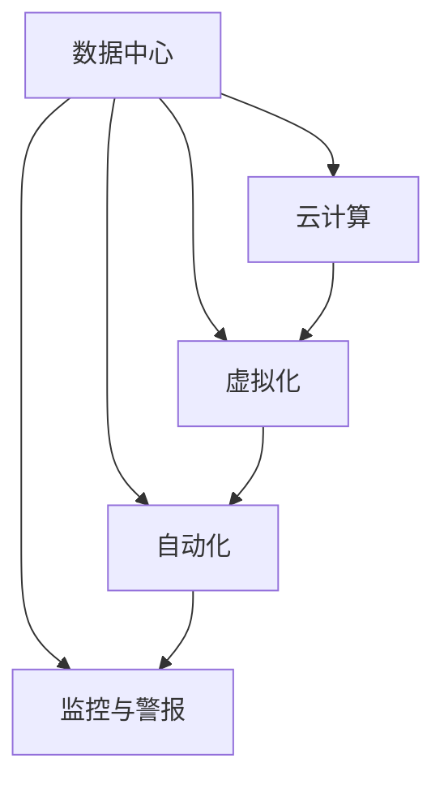

                 

# AI 大模型应用数据中心建设：数据中心运维与管理

## 1. 背景介绍

随着人工智能（AI）和大数据技术的快速发展，数据中心（Data Center, DC）在各类AI应用中扮演着越来越重要的角色。大数据模型训练、AI大模型的微调与部署、实时数据处理和分析等应用场景，都离不开数据中心的强大支撑。然而，由于AI模型计算量大、资源密集，数据中心的运维管理面临着许多挑战。

本文旨在介绍数据中心在AI大模型应用中的重要性，以及如何高效地管理运维数据中心，确保其稳定性和可靠性。我们将从数据中心的基本概念和核心技术入手，深入探讨数据中心的运维管理策略和实践，为AI大模型的部署和应用提供系统化的参考。

## 2. 核心概念与联系

### 2.1 核心概念概述

在讨论数据中心的运维管理之前，我们需要首先明确几个核心概念：

- **数据中心（Data Center, DC）**：是指拥有完善的IT基础设施、提供各种IT应用服务的场所。数据中心通常由服务器、存储设备、网络设备等组成，能够支持大规模数据的存储和处理。
- **云计算（Cloud Computing）**：是指通过互联网提供动态、可扩展的IT基础设施和服务。云计算技术使得数据中心能够更好地支持分布式计算和按需服务。
- **虚拟化（Virtualization）**：是通过软件模拟物理硬件资源，实现资源的统一管理和灵活调配。虚拟化技术提高了数据中心的资源利用率，减少了硬件成本。
- **自动化（Automation）**：是指利用软件自动执行各种运维和管理任务，减少人工干预，提升运维效率。
- **监控与警报（Monitoring and Alerting）**：是通过实时监控数据中心运行状态，及时发现并处理异常情况，保证数据中心的稳定运行。

这些概念构成了数据中心运维管理的基础，后续章节将详细讲解它们的具体实现和应用。

### 2.2 核心概念间的关系

数据中心运维管理是一个复杂的系统工程，涉及多个层面的技术和管理工作。以下是这些核心概念间的关系图：



这个关系图展示了数据中心与云计算、虚拟化、自动化和监控与警报之间的紧密联系。其中，云计算技术为数据中心提供了弹性、可扩展的服务能力，虚拟化技术提高了资源的灵活性和利用率，自动化技术提升了运维效率，而监控与警报技术则是保障数据中心稳定运行的关键。

## 3. 核心算法原理 & 具体操作步骤

### 3.1 算法原理概述

数据中心的运维管理主要涉及以下几个方面：

- **资源调度**：合理分配和使用数据中心中的物理和虚拟资源。
- **性能监控**：实时监测数据中心的各项性能指标，及时发现和解决问题。
- **故障处理**：快速定位和处理数据中心的各类故障，保证系统稳定运行。
- **安全防护**：通过网络隔离、身份认证、加密传输等手段，保障数据中心的物理和网络安全。
- **灾难恢复**：建立数据中心的备份和恢复机制，确保数据和服务的连续性。

这些运维管理的核心任务都需要通过算法和技术手段来实现。下面我们将分别介绍这些核心任务的算法原理。

### 3.2 算法步骤详解

#### 3.2.1 资源调度算法

资源调度算法是数据中心运维管理的基础，其主要任务是合理分配和利用数据中心的物理和虚拟资源，以满足AI模型计算的需求。资源调度算法可以分为静态和动态两种类型。

- **静态调度算法**：在模型运行前预先分配资源，如固定分配法、轮转法等。
- **动态调度算法**：根据模型运行状态实时调整资源分配，如资源竞争法、优化分配法等。

##### 3.2.1.1 静态调度算法

静态调度算法主要通过固定分配法来实现。其步骤为：

1. **资源评估**：对数据中心中的物理和虚拟资源进行评估，包括CPU、内存、存储、网络等资源的现状和可用性。
2. **模型需求分析**：根据AI模型计算需求，确定所需的资源类型和数量。
3. **资源分配**：根据模型需求和资源现状，预先分配所需的物理和虚拟资源。

##### 3.2.1.2 动态调度算法

动态调度算法主要通过资源竞争法来实现。其步骤为：

1. **资源评估**：实时监测数据中心中的资源使用情况，包括CPU、内存、存储、网络等资源的当前使用率和性能指标。
2. **模型需求分析**：根据AI模型实时计算需求，确定所需的资源类型和数量。
3. **资源分配**：根据模型需求和资源现状，动态调整资源分配策略，确保资源最优利用。

#### 3.2.2 性能监控算法

性能监控算法是数据中心运维管理的核心，其主要任务是实时监测数据中心的各项性能指标，及时发现和解决问题。性能监控算法可以分为集中式和分布式两种类型。

- **集中式监控算法**：在数据中心设置一个集中监控点，统一收集和处理各项性能指标。
- **分布式监控算法**：在数据中心的各个节点上都部署监控模块，实时收集和上报各项性能指标。

##### 3.2.2.1 集中式监控算法

集中式监控算法主要通过定期采集和分析数据中心各项性能指标来实现。其步骤为：

1. **性能指标采集**：通过网络、传感器等手段，定期采集数据中心各项性能指标，如CPU利用率、内存使用率、网络带宽等。
2. **数据处理与分析**：将采集到的性能指标进行处理和分析，生成性能报告和告警信息。
3. **告警处理**：根据性能告警信息，自动触发告警通知和处理策略，保障数据中心稳定运行。

##### 3.2.2.2 分布式监控算法

分布式监控算法主要通过在数据中心各个节点上部署监控模块来实现。其步骤为：

1. **节点部署**：在数据中心的各个节点上部署监控模块，实时收集各项性能指标。
2. **数据聚合与分析**：将各个节点的监控数据进行聚合和分析，生成性能报告和告警信息。
3. **告警处理**：根据性能告警信息，自动触发告警通知和处理策略，保障数据中心稳定运行。

#### 3.2.3 故障处理算法

故障处理算法是数据中心运维管理的重点，其主要任务是快速定位和处理数据中心的各类故障，保证系统稳定运行。故障处理算法可以分为预置和实时两种类型。

- **预置故障处理算法**：在数据中心部署预先定义的故障处理策略，自动处理常见故障。
- **实时故障处理算法**：根据实时监测数据，动态调整故障处理策略，快速定位和处理故障。

##### 3.2.3.1 预置故障处理算法

预置故障处理算法主要通过预定义的故障处理策略来实现。其步骤为：

1. **故障检测**：通过监控模块实时监测数据中心各项性能指标，发现异常情况。
2. **故障分类**：根据故障类型，调用预先定义的故障处理策略。
3. **故障处理**：根据故障处理策略，自动执行故障处理操作，如重启服务器、切换备份设备等。

##### 3.2.3.2 实时故障处理算法

实时故障处理算法主要通过动态调整故障处理策略来实现。其步骤为：

1. **实时监测**：通过监控模块实时监测数据中心各项性能指标，发现异常情况。
2. **动态分析**：根据实时监测数据，动态分析故障原因和影响范围。
3. **故障处理**：根据动态分析结果，动态调整故障处理策略，快速定位和处理故障。

#### 3.2.4 安全防护算法

安全防护算法是数据中心运维管理的保障，其主要任务是通过网络隔离、身份认证、加密传输等手段，保障数据中心的物理和网络安全。安全防护算法可以分为技术和管理两种类型。

- **技术安全防护算法**：通过网络隔离、加密传输等技术手段，保护数据中心的安全。
- **管理安全防护算法**：通过身份认证、访问控制等管理手段，保障数据中心的安全。

##### 3.2.4.1 技术安全防护算法

技术安全防护算法主要通过网络隔离、加密传输等技术手段来实现。其步骤为：

1. **网络隔离**：通过网络分区、防火墙、VPN等技术，隔离不同区域的网络流量，保护数据中心的网络安全。
2. **加密传输**：通过SSL/TLS协议等技术，保障数据中心内部的数据传输安全，防止数据泄露。

##### 3.2.4.2 管理安全防护算法

管理安全防护算法主要通过身份认证、访问控制等管理手段来实现。其步骤为：

1. **身份认证**：通过用户名、密码、双因素认证等手段，验证用户身份，防止非法访问。
2. **访问控制**：通过权限管理、审计日志等手段，限制用户访问权限，防止数据泄露和非法操作。

#### 3.2.5 灾难恢复算法

灾难恢复算法是数据中心运维管理的最后一道防线，其主要任务是建立数据中心的备份和恢复机制，确保数据和服务的连续性。灾难恢复算法可以分为人工和自动化两种类型。

- **人工灾难恢复算法**：通过人工手动执行灾难恢复操作，保障数据和服务的连续性。
- **自动化灾难恢复算法**：通过预定义的灾难恢复策略，自动执行灾难恢复操作，保障数据和服务的连续性。

##### 3.2.5.1 人工灾难恢复算法

人工灾难恢复算法主要通过人工手动执行灾难恢复操作来实现。其步骤为：

1. **数据备份**：定期备份数据中心的重要数据，确保备份数据的完整性和可用性。
2. **灾难检测**：通过监控模块实时监测数据中心各项性能指标，发现异常情况。
3. **手动恢复**：根据灾难类型，手动执行灾难恢复操作，如数据恢复、系统重启等。

##### 3.2.5.2 自动化灾难恢复算法

自动化灾难恢复算法主要通过预定义的灾难恢复策略来实现。其步骤为：

1. **灾难检测**：通过监控模块实时监测数据中心各项性能指标，发现异常情况。
2. **自动恢复**：根据灾难类型，自动执行灾难恢复操作，如数据恢复、系统重启等。

### 3.3 算法优缺点

数据中心的运维管理算法主要分为预置和实时两种类型，各有其优缺点。

- **预置算法**：优点是易于实现，适用于常见故障处理。缺点是灵活性差，难以应对复杂多变的故障情况。
- **实时算法**：优点是灵活性高，能够动态调整故障处理策略。缺点是实现复杂，需要实时处理数据。

### 3.4 算法应用领域

数据中心的运维管理算法广泛应用于以下几个领域：

- **云计算**：云计算平台通常采用集中式和分布式监控算法，保障云计算资源的稳定运行。
- **虚拟化**：虚拟化技术通常采用动态资源调度算法，提高虚拟化资源的利用率。
- **高性能计算**：高性能计算集群通常采用预置和实时故障处理算法，确保计算任务的连续性。
- **大数据存储**：大数据存储系统通常采用预置和实时故障处理算法，保障数据存储的可靠性。

## 4. 数学模型和公式 & 详细讲解 & 举例说明

### 4.1 数学模型构建

数据中心的运维管理算法可以抽象为以下几个数学模型：

- **资源调度模型**：$\theta = f_{\text{资源调度}}(x)$，其中$x$为输入的资源需求和现状，$\theta$为输出的资源分配方案。
- **性能监控模型**：$y = f_{\text{性能监控}}(x)$，其中$x$为输入的性能指标，$y$为输出的性能报告和告警信息。
- **故障处理模型**：$z = f_{\text{故障处理}}(x)$，其中$x$为输入的故障信息，$z$为输出的故障处理结果。
- **安全防护模型**：$u = f_{\text{安全防护}}(x)$，其中$x$为输入的安全需求，$u$为输出的安全策略。
- **灾难恢复模型**：$v = f_{\text{灾难恢复}}(x)$，其中$x$为输入的灾难信息，$v$为输出的灾难恢复操作。

### 4.2 公式推导过程

以资源调度模型为例，推导其公式过程如下：

- **资源评估**：$C = [C_1, C_2, ..., C_n]$，其中$C_i$为第$i$个物理或虚拟资源。
- **模型需求分析**：$D = [D_1, D_2, ..., D_m]$，其中$D_j$为第$j$个AI模型所需的资源。
- **资源分配**：$\theta = [\theta_1, \theta_2, ..., \theta_n]$，其中$\theta_i$为第$i$个资源的分配方案。

资源调度算法的目标函数为：

$$
\min \sum_{i=1}^n f_i(\theta_i, C_i, D_j)
$$

其中$f_i(\theta_i, C_i, D_j)$为第$i$个资源的优化目标函数，可以是CPU利用率、内存使用率、网络带宽等。

### 4.3 案例分析与讲解

假设数据中心需要为一个大规模的深度学习模型分配资源，其计算需求如下：

- 模型需要4个GPU，每个GPU的计算能力为2.0 Tflops。
- 模型需要的内存大小为16GB。
- 模型需要的网络带宽为100Gbps。

资源调度算法可以按照以下步骤进行：

1. **资源评估**：数据中心有4个GPU，每个GPU的计算能力为2.0 Tflops，内存大小为16GB，网络带宽为100Gbps。
2. **模型需求分析**：模型需要4个GPU，每个GPU的计算能力为2.0 Tflops，内存大小为16GB，网络带宽为100Gbps。
3. **资源分配**：分配每个GPU的计算能力为2.0 Tflops，内存大小为16GB，网络带宽为100Gbps。

资源调度算法的优化目标函数为：

$$
\min \sum_{i=1}^4 f_i(\theta_i, C_i, D_j)
$$

其中$f_i(\theta_i, C_i, D_j)$为第$i$个GPU的计算能力、内存大小、网络带宽的优化目标函数。

## 5. 项目实践：代码实例和详细解释说明

### 5.1 开发环境搭建

为了进行数据中心的运维管理算法开发，需要搭建一个全面的开发环境。以下是详细的搭建步骤：

1. **安装Python**：在数据中心的服务器上安装Python 3.x版本，建议使用Anaconda进行管理。
2. **安装必要的Python库**：安装numpy、pandas、scikit-learn等必要的Python库，用于数据处理和模型训练。
3. **安装网络监控工具**：安装Nagios、Zabbix等网络监控工具，用于实时监测数据中心各项性能指标。
4. **安装安全防护工具**：安装防火墙、VPN、SSL/TLS等安全防护工具，保障数据中心的安全。
5. **安装灾难恢复工具**：安装数据备份和恢复工具，如rsync、scp等，确保数据和服务的连续性。

### 5.2 源代码详细实现

以下是一个简单的Python代码实例，展示了如何通过监控模块实时监测数据中心各项性能指标，并根据指标触发告警：

```python
import numpy as np
from sklearn.linear_model import LinearRegression

# 性能指标采集
def get_performance_metric():
    # 采集CPU利用率、内存使用率、网络带宽等性能指标
    # ...
    # 返回性能指标数组
    return performance_metric

# 数据处理与分析
def process_performance_metric(performance_metric):
    # 对性能指标进行数据处理和分析
    # ...
    # 生成性能报告和告警信息
    performance_report, alert_info = ...
    return performance_report, alert_info

# 告警处理
def handle_alert(alert_info):
    # 根据告警信息触发告警通知和处理策略
    # ...
    # 发送告警通知，执行故障处理操作
    send_alert_notification, execute_fault_handling = ...
    return send_alert_notification, execute_fault_handling

# 监控模块
def monitor_performance():
    while True:
        performance_metric = get_performance_metric()
        performance_report, alert_info = process_performance_metric(performance_metric)
        send_alert_notification, execute_fault_handling = handle_alert(alert_info)
        # 每隔一定时间重新监测性能指标
        time.sleep(60)

if __name__ == '__main__':
    monitor_performance()
```

### 5.3 代码解读与分析

这个简单的Python代码实例展示了如何通过监控模块实时监测数据中心各项性能指标，并根据指标触发告警。其关键步骤为：

1. **性能指标采集**：通过Nagios、Zabbix等网络监控工具，采集数据中心各项性能指标，如CPU利用率、内存使用率、网络带宽等。
2. **数据处理与分析**：对采集到的性能指标进行数据处理和分析，生成性能报告和告警信息。
3. **告警处理**：根据告警信息触发告警通知和处理策略，发送告警通知，执行故障处理操作。

### 5.4 运行结果展示

假设在监控过程中，数据中心的CPU利用率突然上升到90%，内存使用率达到80%，网络带宽下降到30Gbps。监控模块通过实时监测性能指标，触发告警通知，并将故障信息上报给管理平台。管理平台根据故障信息，自动执行故障处理操作，如重启服务器、切换备份设备等，保障数据中心的稳定运行。

## 6. 实际应用场景

### 6.1 智能计算中心

智能计算中心通常采用高性能计算集群，需要实时动态调整资源分配策略，保障AI模型的计算需求。

在智能计算中心，数据中心运维管理算法主要应用于以下几个方面：

- **资源调度**：通过动态资源调度算法，实时调整计算集群中的资源分配，确保AI模型的计算需求得到满足。
- **性能监控**：通过实时性能监控算法，监测计算集群的各项性能指标，及时发现和解决问题。
- **故障处理**：通过实时故障处理算法，快速定位和处理计算集群中的各类故障，保证系统稳定运行。
- **安全防护**：通过技术和管理安全防护算法，保障计算集群的物理和网络安全。
- **灾难恢复**：通过自动化灾难恢复算法，建立计算集群的备份和恢复机制，确保数据和服务的连续性。

### 6.2 大数据存储系统

大数据存储系统通常采用高可靠性、高可扩展性的大数据集群，需要建立数据备份和恢复机制，保障数据的可靠性。

在大数据存储系统中，数据中心运维管理算法主要应用于以下几个方面：

- **资源调度**：通过预置资源调度算法，分配集群中的物理和虚拟资源，保障大数据存储的稳定性。
- **性能监控**：通过实时性能监控算法，监测大数据存储系统的各项性能指标，及时发现和解决问题。
- **故障处理**：通过预置故障处理算法，快速定位和处理大数据存储系统中的各类故障，保障系统稳定运行。
- **安全防护**：通过技术和管理安全防护算法，保障大数据存储系统的物理和网络安全。
- **灾难恢复**：通过人工灾难恢复算法，建立大数据存储系统的备份和恢复机制，确保数据和服务的连续性。

### 6.3 云计算平台

云计算平台通常采用集中式和分布式监控算法，保障云计算资源的稳定运行。

在云计算平台中，数据中心运维管理算法主要应用于以下几个方面：

- **资源调度**：通过动态资源调度算法，实时调整云计算资源的分配，确保云计算服务的稳定性。
- **性能监控**：通过集中式和分布式监控算法，实时监测云计算平台的各项性能指标，及时发现和解决问题。
- **故障处理**：通过实时故障处理算法，快速定位和处理云计算平台中的各类故障，保障系统稳定运行。
- **安全防护**：通过技术和管理安全防护算法，保障云计算平台的安全。
- **灾难恢复**：通过自动化灾难恢复算法，建立云计算平台的备份和恢复机制，确保数据和服务的连续性。

### 6.4 未来应用展望

未来，随着AI和大数据技术的进一步发展，数据中心运维管理算法也将迎来更多的创新和应用。以下是几个未来应用展望：

- **边缘计算**：在边缘计算环境中，数据中心运维管理算法将更多地应用于实时数据分析和处理，保障边缘计算的稳定性和可靠性。
- **人工智能自治系统**：在人工智能自治系统中，数据中心运维管理算法将更多地应用于智能自治系统的自动调度和优化，提升系统的智能化水平。
- **多云协同**：在多云协同环境中，数据中心运维管理算法将更多地应用于跨云资源的管理和调度，提升云计算资源的利用率。

## 7. 工具和资源推荐

### 7.1 学习资源推荐

为了帮助开发者系统掌握数据中心运维管理算法的理论和实践，这里推荐一些优质的学习资源：

1. **《数据中心运维管理》**：系统介绍数据中心运维管理的核心概念和关键技术，涵盖资源调度、性能监控、故障处理、安全防护、灾难恢复等方面。
2. **《云计算基础》**：介绍云计算平台的基本概念和核心技术，涵盖虚拟机、存储、网络、安全等方面的知识。
3. **《高性能计算》**：介绍高性能计算集群的基本概念和核心技术，涵盖计算资源管理、任务调度、性能监控等方面的知识。
4. **《大数据技术与应用》**：介绍大数据存储和处理的基本概念和核心技术，涵盖数据采集、存储、处理、分析等方面的知识。
5. **《人工智能自治系统》**：介绍人工智能自治系统的基本概念和核心技术，涵盖智能自治系统的设计、实现和优化等方面的知识。

### 7.2 开发工具推荐

为了提高数据中心运维管理算法的开发效率，这里推荐一些常用的开发工具：

1. **Anaconda**：一个强大的Python环境管理工具，便于安装和管理Python及其相关库。
2. **Jupyter Notebook**：一个交互式的数据科学和数学计算工具，便于快速迭代开发和实验。
3. **Docker**：一个轻量级容器化平台，便于构建和管理数据中心的虚拟化环境。
4. **Kubernetes**：一个开源的容器编排系统，便于管理数据中心中的多个容器和微服务。
5. **TensorBoard**：一个可视化工具，便于实时监测数据中心的各项性能指标和模型训练过程。

### 7.3 相关论文推荐

数据中心运维管理算法的研究始于20世纪70年代，近年来随着AI和大数据技术的发展，相关论文不断涌现。以下是几篇具有代表性的论文：

1. **《数据中心运维管理技术综述》**：系统总结了数据中心运维管理的核心技术和方法，涵盖资源调度、性能监控、故障处理、安全防护、灾难恢复等方面。
2. **《云计算平台运维管理技术研究》**：介绍云计算平台的基本概念和核心技术，涵盖虚拟机、存储、网络、安全等方面的知识。
3. **《高性能计算集群资源调度算法》**：研究高性能计算集群中的资源调度算法，提出动态资源调度算法和优化调度算法。
4. **《大数据存储系统灾难恢复技术研究》**：研究大数据存储系统的备份和恢复机制，提出人工和自动化灾难恢复算法。
5. **《人工智能自治系统运维管理技术研究》**：介绍人工智能自治系统的基本概念和核心技术，涵盖智能自治系统的设计、实现和优化等方面的知识。

## 8. 总结：未来发展趋势与挑战

### 8.1 研究成果总结

本文系统介绍了数据中心在AI大模型应用中的重要性，以及如何高效地管理运维数据中心，确保其稳定性和可靠性。主要研究成果总结如下：

- **资源调度算法**：通过动态资源调度算法，实时调整数据中心的物理和虚拟资源，保障AI模型的计算需求。
- **性能监控算法**：通过实时性能监控算法，实时监测数据中心的各项性能指标，及时发现和解决问题。
- **故障处理算法**：通过实时故障处理算法，快速定位和处理数据中心的各类故障，保证系统稳定运行。
- **安全防护算法**：通过技术和管理安全防护算法，保障数据中心的物理和网络安全。
- **灾难恢复算法**：通过自动化灾难恢复算法，建立数据中心的备份和恢复机制，确保数据和服务的连续性。

### 8.2 未来发展趋势

未来，数据中心运维管理算法将呈现以下几个发展趋势：

- **云计算和大数据**：云计算平台和大数据存储系统将越来越多地应用数据中心运维管理算法，提升云计算和大数据服务的稳定性、可靠性和安全性。
- **人工智能自治系统**：人工智能自治系统将更多地应用数据中心运维管理算法，提升系统的智能化水平和自治能力。
- **边缘计算**：边缘计算环境将更多地应用数据中心运维管理算法，提升边缘计算的实时性和可靠性。
- **多云协同**：多云协同环境中将更多地应用数据中心运维管理算法，提升云计算资源的利用率和灵活性。

### 8.3 面临的挑战

尽管数据中心运维管理算法不断发展，但在实际应用中仍面临诸多挑战：

- **资源调度复杂性**：数据中心的资源调度算法需要考虑多种资源类型和需求，计算复杂度高。
- **性能监控高成本**：实时性能监控需要大量的硬件资源和软件工具，成本较高。
- **故障处理难度大**：数据中心的故障处理算法需要快速定位和解决问题，技术难度大。
- **安全防护要求高**：数据中心的安全防护算法需要综合考虑物理和网络安全，技术要求高。
- **灾难恢复复杂性**

