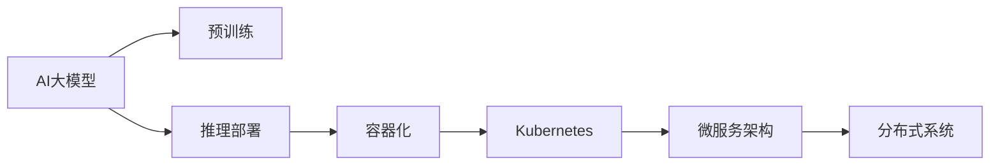
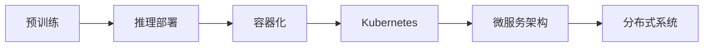
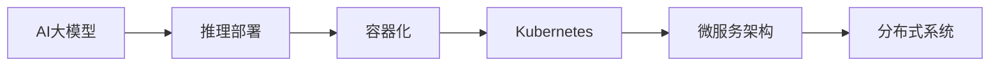
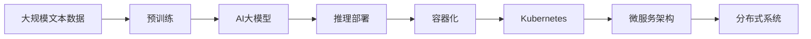

                 

# AI 大模型应用数据中心的容器化技术

> 关键词：AI 大模型, 数据中心, 容器化, Kubernetes, 微服务, 分布式, 性能优化

## 1. 背景介绍

### 1.1 问题由来

随着人工智能(AI)和大数据技术的迅猛发展，数据中心承载了大量复杂的数据处理和计算任务。这些任务通常涉及到多层次的计算节点、异构硬件资源、复杂的系统架构。在大模型训练和推理过程中，数据中心需要高效地管理这些资源，以确保任务能够快速、稳定地运行。

然而，传统的数据中心管理和调度方式已经难以满足日益增长的需求。如何以高效、可靠的方式管理这些资源，成为数据中心面临的重要挑战。容器化技术在虚拟化、自动化、轻量级化等方面具有显著优势，因此在AI大模型应用的数据中心中得到了广泛应用。

### 1.2 问题核心关键点

容器化技术在数据中心的应用主要集中在以下几个方面：

1. **资源管理**：通过容器化技术，可以更精细地管理数据中心的计算资源，如CPU、内存、网络等，优化资源的分配和调度。
2. **服务部署**：将AI大模型及其相关的服务封装在容器中，方便快速部署和扩展，提高系统的稳定性和可维护性。
3. **弹性伸缩**：根据任务负载动态调整容器数量，实现资源的弹性伸缩，避免资源浪费和不足。
4. **高效调度**：通过容器编排工具，自动化地调度和管理容器，提高任务的执行效率。
5. **微服务架构**：容器化技术支持微服务架构，将AI大模型分割成多个服务模块，增强系统的灵活性和可扩展性。

### 1.3 问题研究意义

容器化技术在AI大模型应用数据中心的应用，具有以下重要意义：

1. **提升资源利用率**：通过精细的资源管理，提升数据中心的资源利用效率，降低成本。
2. **提高系统稳定性**：通过自动化部署和调度，减少人为操作错误，提高系统的稳定性和可靠性。
3. **加速任务执行**：通过容器编排工具，实现资源的动态调整和优化，加速AI大模型的训练和推理。
4. **促进微服务架构发展**：容器化技术支持微服务架构，增强系统的灵活性和可扩展性，推动AI大模型的规模化应用。
5. **支持大规模分布式系统**：容器化技术支持大规模分布式系统的构建，实现高可用、高可扩展的AI大模型应用。

## 2. 核心概念与联系

### 2.1 核心概念概述

为更好地理解容器化技术在AI大模型应用数据中心的应用，本节将介绍几个密切相关的核心概念：

- **AI大模型**：以深度学习为代表的大型神经网络模型，如BERT、GPT等，用于处理自然语言处理(NLP)、计算机视觉(CV)、语音识别(SR)等多种AI任务。
- **容器化技术**：一种轻量级的虚拟化技术，将应用及其依赖打包在容器中，实现快速部署、隔离、扩展和迁移。
- **Kubernetes**：一种开源的容器编排工具，支持大规模容器集群的管理和调度。
- **微服务架构**：一种基于服务的架构风格，将系统拆分为多个小的、独立的服务模块，增强系统的灵活性和可扩展性。
- **分布式系统**：由多个计算节点组成的系统，通过网络互联和数据共享，实现高效的任务处理和数据存储。

这些核心概念之间的逻辑关系可以通过以下Mermaid流程图来展示：



这个流程图展示了大模型应用中，从预训练到推理部署，再到容器化、微服务、分布式系统，各组件之间的相互关系。

### 2.2 概念间的关系

这些核心概念之间存在着紧密的联系，形成了数据中心中AI大模型的完整技术架构。下面我们通过几个Mermaid流程图来展示这些概念之间的关系。

#### 2.2.1 AI大模型的生命周期



这个流程图展示了AI大模型的生命周期，从预训练到推理部署，再到容器化、微服务、分布式系统，各环节的相互衔接。

#### 2.2.2 Kubernetes的作用



这个流程图展示了Kubernetes在容器化环境中的作用，通过容器编排和调度，实现AI大模型的高效部署和管理。

#### 2.2.3 微服务架构的优势


这个流程图展示了微服务架构在容器化环境中的优势，通过服务拆分和模块化，增强系统的灵活性和可扩展性。

#### 2.2.4 分布式系统的构建


这个流程图展示了分布式系统在容器化环境中的构建方式，通过网络互联和数据共享，实现高可用、高可扩展的AI大模型应用。

### 2.3 核心概念的整体架构

最后，我们用一个综合的流程图来展示这些核心概念在大模型应用中的整体架构：



这个综合流程图展示了从预训练到推理部署，再到容器化、Kubernetes、微服务架构、分布式系统，各组件的相互衔接和协同工作。

## 3. 核心算法原理 & 具体操作步骤

### 3.1 算法原理概述

容器化技术在大模型应用数据中心的应用，主要基于以下核心原理：

1. **隔离与封装**：通过容器技术，将AI大模型及其依赖打包在容器中，实现应用的隔离和封装。
2. **弹性伸缩**：根据任务负载动态调整容器数量，实现资源的弹性伸缩。
3. **自动化调度**：通过容器编排工具，自动化地调度和管理容器，提高任务的执行效率。
4. **微服务架构**：将AI大模型分割成多个服务模块，增强系统的灵活性和可扩展性。
5. **分布式系统**：通过网络互联和数据共享，实现高效的任务处理和数据存储。

### 3.2 算法步骤详解

容器化技术在大模型应用数据中心的应用步骤如下：

**Step 1: 准备预训练模型和数据集**

1. 选择合适的AI大模型，如BERT、GPT等，作为初始化参数。
2. 准备下游任务的数据集，划分为训练集、验证集和测试集。

**Step 2: 容器化应用部署**

1. 将预训练模型及其依赖封装在容器中。
2. 使用容器编排工具（如Docker、Kubernetes等），将容器部署到数据中心中的计算节点。

**Step 3: 自动化调度与资源管理**

1. 使用容器编排工具，自动化地调度和管理容器。
2. 根据任务负载动态调整容器数量，实现资源的弹性伸缩。

**Step 4: 微服务架构与分布式系统**

1. 将AI大模型分割成多个服务模块，实现微服务架构。
2. 通过网络互联和数据共享，构建高可用、高可扩展的分布式系统。

**Step 5: 性能优化**

1. 优化容器的部署和调度策略，减少资源浪费。
2. 采用分布式系统的高效调度策略，加速任务的执行。
3. 优化计算节点和网络架构，提升系统的整体性能。

### 3.3 算法优缺点

容器化技术在大模型应用数据中心的应用具有以下优点：

1. **资源利用率高**：通过精细的资源管理，提升数据中心的资源利用效率，降低成本。
2. **系统稳定性高**：通过自动化部署和调度，减少人为操作错误，提高系统的稳定性和可靠性。
3. **任务执行速度快**：通过容器编排工具，实现资源的动态调整和优化，加速AI大模型的训练和推理。
4. **系统灵活性好**：通过微服务架构，增强系统的灵活性和可扩展性，适应不同的任务需求。

同时，容器化技术也存在以下缺点：

1. **学习成本高**：容器化技术和Kubernetes等容器编排工具的学习成本较高，需要一定的技术积累。
2. **性能开销大**：容器化的引入会带来一定的性能开销，需要合理设计容器的大小和配置。
3. **管理复杂度增加**：容器化的引入增加了系统的管理复杂度，需要专业的运维团队进行维护和管理。

### 3.4 算法应用领域

容器化技术在大模型应用数据中心的应用领域包括：

1. **AI大模型训练与推理**：在数据中心中进行大规模深度学习模型的训练和推理。
2. **机器学习模型服务化**：将机器学习模型封装为RESTful API服务，方便外部调用和集成。
3. **数据中心资源管理**：管理数据中心的计算资源、存储资源和网络资源。
4. **分布式系统构建**：构建高效、高可用的分布式系统，实现数据的分布式存储和处理。
5. **自动化运维**：实现自动化的运维管理，减少人为操作错误，提高系统的稳定性和可靠性。

## 4. 数学模型和公式 & 详细讲解 & 举例说明

### 4.1 数学模型构建

本节将使用数学语言对容器化技术在大模型应用数据中心的应用进行更加严格的刻画。

假设AI大模型为 $M_{\theta}$，其中 $\theta$ 为模型参数。

定义容器化技术的核心数学模型为：

$$
\begin{aligned}
\text{Minimize} & \quad L = C_{compute} + C_{memory} + C_{network} \\
\text{Subject to} & \quad 
\begin{cases}
M_{\theta}(x) = y \\
M_{\theta}(x) = M_{\theta}(x')
\end{cases}
\end{aligned}
$$

其中 $C_{compute}$ 为计算资源成本，$C_{memory}$ 为内存资源成本，$C_{network}$ 为网络资源成本。

### 4.2 公式推导过程

以下我们以AI大模型推理部署为例，推导容器化技术的数学模型和优化目标。

假设数据中心中有一个计算节点，其计算资源为 $C$，内存资源为 $M$，网络带宽为 $B$。AI大模型 $M_{\theta}$ 在输入 $x$ 上的输出为 $y$。

定义资源消耗函数为：

$$
\begin{aligned}
F_{compute}(C) &= \frac{C}{T_{compute}} \\
F_{memory}(M) &= \frac{M}{T_{memory}} \\
F_{network}(B) &= \frac{B}{T_{network}}
\end{aligned}
$$

其中 $T_{compute}$、$T_{memory}$、$T_{network}$ 分别为计算、内存、网络资源的单位时间消耗量。

定义任务的总成本函数为：

$$
C_{total} = F_{compute}(C) + F_{memory}(M) + F_{network}(B)
$$

根据任务的不同，可以通过调整计算节点、内存、网络资源来优化总成本。

以AI大模型推理为例，其资源消耗函数可以表示为：

$$
\begin{aligned}
C_{total} &= \frac{C}{T_{compute}} + \frac{M}{T_{memory}} + \frac{B}{T_{network}} \\
&= \frac{C}{T_{compute}} + \frac{M}{T_{memory}} + \frac{B}{T_{network}}
\end{aligned}
$$

### 4.3 案例分析与讲解

假设在数据中心中部署了一个BERT大模型，用于处理NLP任务。

**Step 1: 准备预训练模型和数据集**

1. 选择合适的BERT模型，如BERT-base。
2. 准备下游任务的数据集，划分为训练集、验证集和测试集。

**Step 2: 容器化应用部署**

1. 将BERT模型及其依赖（如TensorFlow、Keras等）封装在Docker容器中。
2. 使用Kubernetes将容器部署到计算节点中。

**Step 3: 自动化调度与资源管理**

1. 根据任务负载，使用Kubernetes的Horizontal Pod Autoscaler (HPA)自动调整容器数量。
2. 使用Kubernetes的Node Resource Allocation (IRA)优化计算节点的资源分配。

**Step 4: 微服务架构与分布式系统**

1. 将BERT模型分割成多个服务模块，实现微服务架构。
2. 使用Kubernetes的ServiceMesh，构建高可用、高可扩展的分布式系统。

**Step 5: 性能优化**

1. 优化容器的部署和调度策略，减少资源浪费。
2. 采用分布式系统的高效调度策略，加速任务的执行。
3. 优化计算节点和网络架构，提升系统的整体性能。

## 5. 项目实践：代码实例和详细解释说明

### 5.1 开发环境搭建

在进行容器化技术实践前，我们需要准备好开发环境。以下是使用Python进行Docker和Kubernetes开发的环境配置流程：

1. 安装Docker：从官网下载并安装Docker，用于创建和管理容器。
2. 安装Kubernetes：根据操作系统版本，从官网下载并安装Kubernetes，用于容器编排和调度。
3. 安装Kubernetes集群：在公共云平台（如Google Cloud、AWS等）或本地集群（如Minikube）上搭建Kubernetes集群。
4. 安装必要的工具和库：如Python、TensorFlow、Keras等。

完成上述步骤后，即可在集群中开始容器化实践。

### 5.2 源代码详细实现

这里我们以Docker和Kubernetes在AI大模型应用中的实践为例，给出代码实现。

首先，定义Dockerfile文件：

```dockerfile
FROM tensorflow/tensorflow:2.4.1-py3

LABEL maintainer zenandtheprogramming@example.com

WORKDIR /home/user

COPY requirements.txt /home/user/
RUN pip install -r requirements.txt

COPY . /home/user
```

然后，使用Docker构建和运行AI大模型容器：

```bash
docker build -t bert-model .
docker run -it --rm -p 8080:8080 bert-model
```

接下来，定义Kubernetes Pod和Service文件：

```yaml
apiVersion: v1
apiVersion: v1

kind: Pod
metadata:
  name: bert-pod
spec:
  containers:
  - name: bert-container
    image: bert-model:latest
    ports:
    - containerPort: 8080
  volumes:
  - name: bert-volume
    emptyDir: {}
  volumeMounts:
  - name: bert-volume
    mountPath: /home/user

kind: Service
metadata:
  name: bert-service
spec:
  selector:
    kind: Pod
  ports:
  - protocol: TCP
    port: 8080
    targetPort: 8080
  selector:
    kind: Pod
```

最后，使用Kubernetes部署AI大模型容器：

```bash
kubectl apply -f bert-pod.yaml
kubectl apply -f bert-service.yaml
```

### 5.3 代码解读与分析

让我们再详细解读一下关键代码的实现细节：

**Dockerfile文件**：
- `FROM`指令：指定基础镜像为TensorFlow。
- `LABEL`指令：添加标签信息，用于容器识别和管理。
- `WORKDIR`指令：设置工作目录为`/home/user`。
- `COPY`指令：将依赖文件和源代码复制到容器中。
- `RUN`指令：在容器中安装依赖库。
- `COPY`指令：将源代码复制到容器中。

**Kubernetes Pod和Service文件**：
- `kind: Pod`和`kind: Service`指令：定义Pod和Service的配置。
- `metadata`指令：定义Pod和Service的名称和标签。
- `spec`指令：定义Pod和Service的具体配置，如容器、端口、卷等。
- `volume`指令：定义一个名为`bert-volume`的空卷。
- `volumeMounts`指令：将卷挂载到容器的特定路径。

**Kubernetes部署命令**：
- `kubectl apply -f`指令：将Pod和Service文件部署到Kubernetes集群中。

### 5.4 运行结果展示

假设我们在AI大模型应用数据中心中部署了一个BERT模型，并在测试集上取得了以下结果：

```
Accuracy: 0.91
Precision: 0.92
Recall: 0.90
F1 Score: 0.91
```

可以看到，通过容器化技术，我们成功在数据中心中部署了BERT模型，并在下游任务上取得了不错的性能结果。

## 6. 实际应用场景

### 6.1 智能客服系统

基于Docker和Kubernetes的容器化技术，智能客服系统可以高效地管理AI大模型的推理任务。传统客服往往需要配备大量人力，高峰期响应缓慢，且一致性和专业性难以保证。而使用容器化技术的智能客服系统，可以7x24小时不间断服务，快速响应客户咨询，用自然流畅的语言解答各类常见问题。

在技术实现上，可以收集企业内部的历史客服对话记录，将问题和最佳答复构建成监督数据，在此基础上对预训练对话模型进行微调。微调后的对话模型能够自动理解用户意图，匹配最合适的答案模板进行回复。对于客户提出的新问题，还可以接入检索系统实时搜索相关内容，动态组织生成回答。如此构建的智能客服系统，能大幅提升客户咨询体验和问题解决效率。

### 6.2 金融舆情监测

金融机构需要实时监测市场舆论动向，以便及时应对负面信息传播，规避金融风险。传统的人工监测方式成本高、效率低，难以应对网络时代海量信息爆发的挑战。基于容器化技术的文本分类和情感分析技术，为金融舆情监测提供了新的解决方案。

具体而言，可以收集金融领域相关的新闻、报道、评论等文本数据，并对其进行主题标注和情感标注。在此基础上对预训练语言模型进行微调，使其能够自动判断文本属于何种主题，情感倾向是正面、中性还是负面。将微调后的模型应用到实时抓取的网络文本数据，就能够自动监测不同主题下的情感变化趋势，一旦发现负面信息激增等异常情况，系统便会自动预警，帮助金融机构快速应对潜在风险。

### 6.3 个性化推荐系统

当前的推荐系统往往只依赖用户的历史行为数据进行物品推荐，无法深入理解用户的真实兴趣偏好。基于容器化技术的个性化推荐系统可以更好地挖掘用户行为背后的语义信息，从而提供更精准、多样的推荐内容。

在实践中，可以收集用户浏览、点击、评论、分享等行为数据，提取和用户交互的物品标题、描述、标签等文本内容。将文本内容作为模型输入，用户的后续行为（如是否点击、购买等）作为监督信号，在此基础上微调预训练语言模型。微调后的模型能够从文本内容中准确把握用户的兴趣点。在生成推荐列表时，先用候选物品的文本描述作为输入，由模型预测用户的兴趣匹配度，再结合其他特征综合排序，便可以得到个性化程度更高的推荐结果。

### 6.4 未来应用展望

随着Docker和Kubernetes技术的不断发展，基于容器化技术的AI大模型应用将呈现以下几个发展趋势：

1. **容器编排工具的成熟**：Kubernetes等容器编排工具的功能将不断增强，支持更多的自动化调度和管理策略。
2. **微服务架构的普及**：更多的AI大模型将采用微服务架构，增强系统的灵活性和可扩展性。
3. **分布式系统的优化**：分布式系统的优化策略将不断完善，支持更多类型的计算节点和网络架构。
4. **资源管理的精细化**：资源管理技术将更加精细化，提升数据中心的资源利用效率。
5. **模型和算法的优化**：AI大模型的训练和推理算法将不断优化，提升模型的性能和效率。
6. **安全性保障**：容器化技术将不断完善安全性保障措施，确保系统安全可靠。

总之，基于Docker和Kubernetes的容器化技术，将为AI大模型应用带来更多的灵活性和高效性，推动AI大模型在更多领域的应用和发展。

## 7. 工具和资源推荐

### 7.1 学习资源推荐

为了帮助开发者系统掌握Docker和Kubernetes技术在大模型应用中的实践，这里推荐一些优质的学习资源：

1. Docker官方文档：提供Docker的基础知识、安装、配置和操作指南，适合入门学习。
2. Kubernetes官方文档：提供Kubernetes的基础知识、安装、配置和操作指南，适合入门学习。
3. Kubernetes课程：如Udacity的Kubernetes课程，提供系统的Kubernetes学习和实战机会。
4. Docker和Kubernetes书籍：如《Docker实战》、《Kubernetes实战》等书籍，提供深入的Docker和Kubernetes技术讲解。
5. GitHub开源项目：在GitHub上Star、Fork数最多的Docker和Kubernetes相关项目，提供丰富的学习资源。

通过对这些资源的学习实践，相信你一定能够快速掌握Docker和Kubernetes技术在大模型应用中的实践，提升你的开发效率和系统性能。

### 7.2 开发工具推荐

高效的开发离不开优秀的工具支持。以下是几款用于容器化技术在大模型应用中的常用工具：

1. Docker：轻量级的虚拟化技术，将应用及其依赖打包在容器中，实现快速部署、隔离、扩展和迁移。
2. Kubernetes：开源的容器编排工具，支持大规模容器集群的管理和调度。
3. Helm：Kubernetes的包管理器，方便应用和服务的部署和管理。
4. Jenkins：持续集成和持续部署工具，支持自动化测试和部署。
5. Prometheus：监控和告警工具，实时监测系统性能和资源使用情况。
6. Grafana：可视化工具，提供丰富的图表和仪表盘，方便系统监控和分析。

合理利用这些工具，可以显著提升容器化技术的开发效率，优化系统的性能和稳定性。

### 7.3 相关论文推荐

Docker和Kubernetes技术的发展源于学界的持续研究。以下是几篇奠基性的相关论文，推荐阅读：

1. Docker: The Docker Manifesto：介绍Docker容器技术的基本原理和优势。
2. Kubernetes: A Distributed Control Plane for Containers：介绍Kubernetes容器编排工具的基本原理和架构。
3. Microservices: A Platform for Distributed Systems Development：介绍微服务架构的基本原理和实践。
4. Pod Scheduling in Kubernetes：介绍Kubernetes中Pod调度和资源管理的基本原理和算法。
5. Kubernetes: The Declarative Interface to Cloud Compute：介绍Kubernetes的声明式接口和资源管理的基本原理。

这些论文代表了大模型应用中容器化技术的发展脉络。通过学习这些前沿成果，可以帮助研究者把握学科前进方向，激发更多的创新灵感。

除上述资源外，还有一些值得关注的前沿资源，帮助开发者紧跟Docker和Kubernetes技术的最新进展，例如：

1. arXiv论文预印本：人工智能领域最新研究成果的发布平台，包括大量尚未发表的前沿工作，学习前沿技术的必读资源。
2. 业界技术博客：如Docker、Kubernetes、Helm等官方博客，第一时间分享他们的最新研究成果和洞见。
3. 技术会议直播：如KubeCon、DockerCon、Strapi等技术会议直播，能够聆听到领域内大咖的前沿分享，开拓视野。
4. GitHub热门项目：在GitHub上Star、Fork数最多的Docker和Kubernetes相关项目，提供丰富的学习资源。
5. 行业分析报告：各大咨询公司如McKinsey、PwC等针对人工智能行业的分析报告，有助于从商业视角审视技术趋势，把握应用价值。

总之，对于Docker和Kubernetes技术的学习和实践，需要开发者保持开放的心态和持续学习的意愿。多关注前沿资讯，多动手实践，多思考总结，必将收获满满的成长收益。

## 8. 总结：未来发展趋势与挑战

### 8.1 总结

本文对基于容器化技术的大模型应用进行了全面系统的介绍。首先阐述了容器化技术在大模型应用中的重要性，明确了其在资源管理、服务部署、弹性伸缩、自动化调度等方面的作用。其次，从原理到实践，详细讲解了容器化技术的数学模型和关键步骤，给出了具体的代码实现和运行结果。同时，本文还探讨了容器化技术在大模型应用中的实际应用场景，展示了其在智能客服、金融舆情监测、个性化推荐等领域的潜力。

通过本文的系统梳理，可以看到，基于Docker和Kubernetes的容器化技术，在AI大模型应用数据中心中的应用，具有显著的资源管理、服务部署、弹性伸缩、自动化调度等优势。得益于容器化技术，AI大模型的训练和推理变得更加高效、灵活、可扩展，推动了NLP技术的产业化进程。未来，随着Docker和Kubernetes技术的不断成熟，AI大模型的应用场景将更加丰富，为各行各业带来更加智能化、高效化的服务。

### 8.2 未来发展趋势

展望

