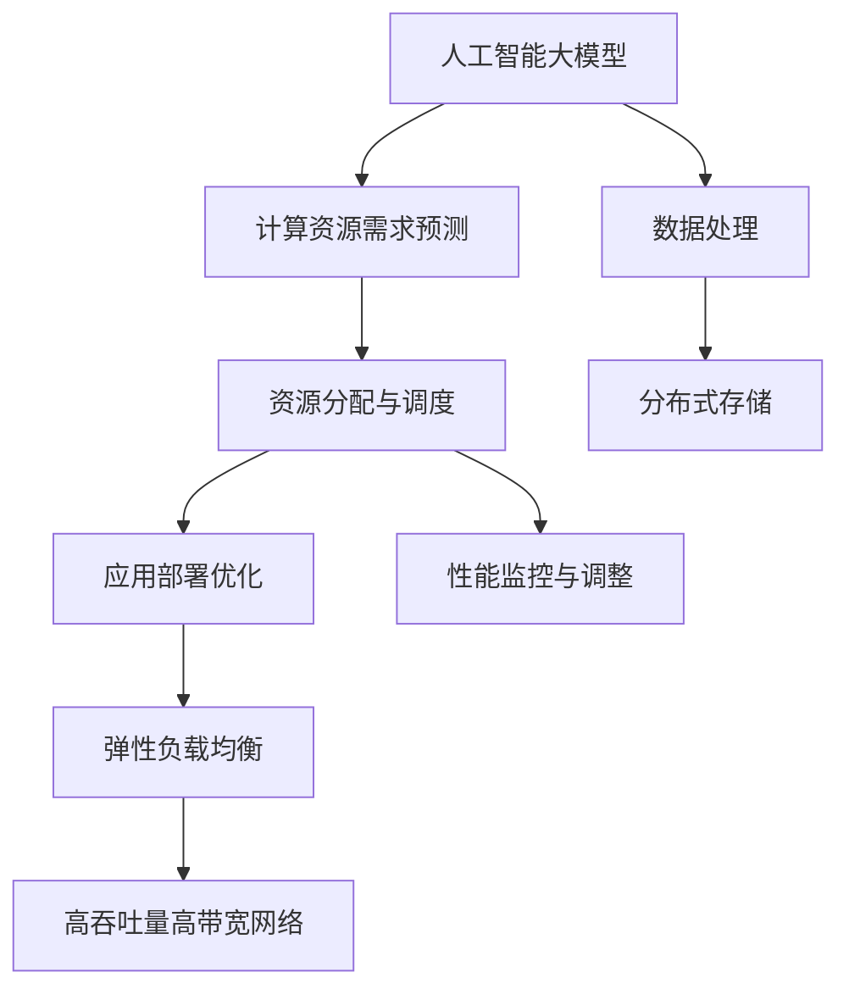
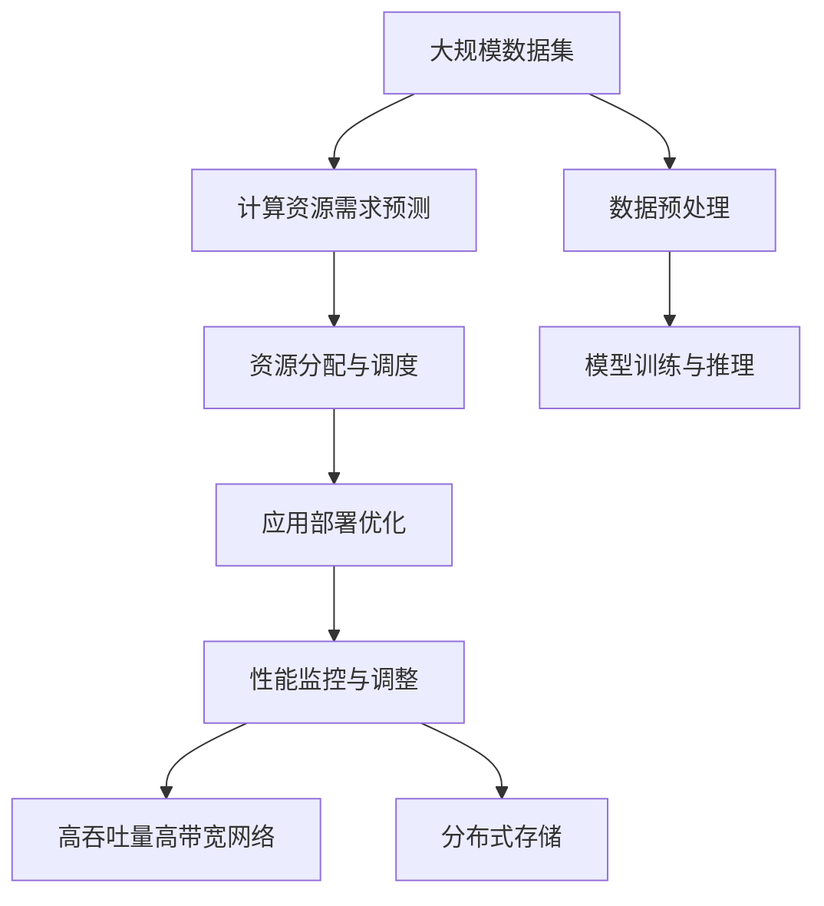

                 

# AI 大模型应用数据中心的弹性扩展

> 关键词：
  - 人工智能大模型(AI Large Models)
  - 数据中心弹性扩展(Compute Elasticity)
  - 分布式计算(Distributed Computing)
  - 弹性负载均衡(Elastic Load Balancing)
  - 深度学习优化(Deep Learning Optimization)
  - 高吞吐量高带宽网络(High Throughput High Bandwidth Network)
  - 数据处理(数据预处理 Data Preprocessing)
  - 分布式存储(Distributed Storage)

## 1. 背景介绍

### 1.1 问题由来
近年来，人工智能大模型（如BERT、GPT等）在NLP、图像识别、推荐系统等诸多领域取得了重大突破，展现了强大的泛化能力和智能推理能力。然而，大模型的训练和推理需要巨量的计算资源，使得数据中心面临着前所未有的计算需求。与此同时，实际应用场景中，大模型面临着计算资源利用率低下、响应时间不稳定等问题，影响用户体验和业务效果。

### 1.2 问题核心关键点
本文聚焦于大模型应用数据中心如何实现弹性扩展，以应对大规模计算需求。弹性扩展即在需要时动态扩展或缩减计算资源，以最优地利用数据中心的计算能力。核心关键点包括：

- **计算资源需求预测**：预测未来计算需求，是弹性扩展的前提。
- **资源分配与调度**：动态分配和调度计算资源，是弹性扩展的实现。
- **应用部署优化**：优化应用部署方式，是弹性扩展的效果保障。
- **性能监控与调整**：实时监控系统性能，是弹性扩展的反馈机制。

## 2. 核心概念与联系

### 2.1 核心概念概述

为更好地理解数据中心弹性扩展，本节将介绍几个密切相关的核心概念：

- **人工智能大模型(AI Large Models)**：以BERT、GPT等为代表的大规模预训练模型。通过在大规模无标签数据上预训练，学习通用的语言或图像表示，具备强大的语言或视觉理解能力。
- **计算资源需求预测(Prediction of Compute Resource Demand)**：通过算法模型预测未来一段时间内的计算资源需求。常用的算法包括时间序列分析、机器学习预测等。
- **资源分配与调度(Resource Allocation and Scheduling)**：根据预测结果动态分配计算资源，实现最优资源利用。常用的调度算法包括轮询、最少连接、最少负载等。
- **应用部署优化(Optimization of Application Deployment)**：通过应用容器的化、分布式部署等技术，优化应用性能和扩展性。常用的技术包括Kubernetes、Docker等。
- **性能监控与调整(Performance Monitoring and Tuning)**：通过实时监控系统性能，及时调整资源分配策略，保障应用性能稳定。常用的监控工具包括Prometheus、Grafana等。

这些核心概念之间的逻辑关系可以通过以下Mermaid流程图来展示：



这个流程图展示了大模型应用数据中心弹性扩展的基本流程：

1. 通过计算资源需求预测，预测未来需求。
2. 根据需求，动态分配和调度计算资源，实现最优资源利用。
3. 通过应用部署优化和性能监控与调整，保障应用性能稳定。
4. 在数据处理和存储层面，通过分布式计算和存储，保障数据中心弹性扩展的效率。

### 2.2 概念间的关系

这些核心概念之间存在着紧密的联系，形成了数据中心弹性扩展的完整系统。下面我们通过几个Mermaid流程图来展示这些概念之间的关系。

#### 2.2.1 计算资源需求预测与资源分配


这个流程图展示了计算资源需求预测与资源分配的基本关系：预测需求，然后根据需求分配资源。

#### 2.2.2 资源分配与调度与应用部署


这个流程图展示了资源分配与调度与应用部署的关系：动态分配资源，通过优化应用部署和网络架构，保障弹性扩展的效果。

#### 2.2.3 弹性负载均衡与高吞吐量高带宽网络


这个流程图展示了弹性负载均衡与高吞吐量高带宽网络的关系：通过负载均衡和高带宽网络，实现高效的计算资源分配。

#### 2.2.4 分布式存储与数据处理


这个流程图展示了分布式存储与数据处理的关系：通过分布式存储和网络，保障数据处理的高效性。

### 2.3 核心概念的整体架构

最后，我们用一个综合的流程图来展示这些核心概念在大模型应用数据中心弹性扩展中的整体架构：



这个综合流程图展示了从数据预处理到模型训练与推理的完整流程，以及如何通过弹性扩展保障大模型的应用效果。

## 3. 核心算法原理 & 具体操作步骤
### 3.1 算法原理概述

数据中心弹性扩展的核心算法原理在于：通过计算资源需求预测、动态资源分配、应用部署优化和性能监控与调整，实现计算资源的动态扩展和缩减，以满足大模型应用的高性能需求。

具体来说，包括以下几个步骤：

1. **需求预测**：通过历史数据和机器学习算法，预测未来计算资源需求。
2. **资源分配**：根据需求预测结果，动态分配计算资源。
3. **应用优化**：通过应用容器化、分布式部署等方式，优化应用性能和扩展性。
4. **性能监控**：实时监控系统性能，调整资源分配策略。

### 3.2 算法步骤详解

#### 3.2.1 需求预测

计算资源需求预测可以通过以下步骤实现：

1. **数据收集**：收集历史计算资源使用数据，包括CPU使用率、内存使用率、网络带宽等指标。
2. **特征提取**：从历史数据中提取相关特征，如时间、日期、业务类型等。
3. **模型训练**：基于时间序列分析、机器学习预测等算法，训练计算资源需求预测模型。
4. **预测输出**：使用训练好的模型，对未来一段时间内的计算资源需求进行预测。

#### 3.2.2 资源分配

资源分配与调度的基本步骤如下：

1. **任务调度**：根据预测的计算需求，分配计算资源。常用的调度算法包括轮询、最少连接、最少负载等。
2. **资源分配**：将计算任务分配到具体的计算节点上。
3. **状态监控**：实时监控计算节点状态，调整资源分配策略。

#### 3.2.3 应用优化

应用部署优化的基本步骤如下：

1. **应用容器化**：将大模型应用封装为容器，实现快速部署和扩展。
2. **分布式部署**：将大模型应用部署到多个节点上，实现分布式计算。
3. **负载均衡**：通过负载均衡算法，实现计算任务的均衡分配。

#### 3.2.4 性能监控与调整

性能监控与调整的基本步骤如下：

1. **监控指标**：定义监控指标，包括CPU使用率、内存使用率、网络带宽等。
2. **实时监控**：实时采集系统性能数据。
3. **调整策略**：根据监控结果，调整资源分配策略。

### 3.3 算法优缺点

**优点**：
1. **动态扩展**：根据计算需求动态扩展或缩减计算资源，提高资源利用率。
2. **弹性灵活**：适应性广，能够应对各种计算需求的变化。
3. **负载均衡**：通过负载均衡算法，实现计算任务的均衡分配。

**缺点**：
1. **预测误差**：需求预测模型的准确度直接影响资源分配的合理性。
2. **资源开销**：动态分配和调度的过程会增加额外的系统开销。
3. **部署复杂**：分布式部署和优化增加了应用部署的复杂性。

### 3.4 算法应用领域

数据中心弹性扩展技术已经广泛应用于多个领域，如云计算、大数据、物联网等。在人工智能大模型应用方面，弹性扩展能够提供以下支持：

- **模型训练**：通过弹性扩展，能够快速完成大规模模型训练，加速模型迭代。
- **模型推理**：通过弹性扩展，能够快速响应大模型推理请求，提高服务响应速度。
- **实时分析**：通过弹性扩展，能够实时处理大规模数据，进行快速分析和决策。
- **资源优化**：通过弹性扩展，能够优化资源利用率，降低计算成本。

## 4. 数学模型和公式 & 详细讲解 & 举例说明
### 4.1 数学模型构建

假设数据中心有 $n$ 个计算节点，每个节点的计算能力为 $C_i$，当前计算任务需要 $T$ 个计算资源单位。计算资源需求预测模型为 $f(t)$，其中 $t$ 为时间。

根据预测结果，计算任务将分配到节点 $j$ 上，分配策略为 $a(j,t)$。节点 $j$ 的计算能力为 $C_j$。

资源分配的优化目标为：

$$
\min \sum_{j=1}^n a(j,t) C_j - T
$$

即在满足计算需求的前提下，最小化分配的计算资源。

### 4.2 公式推导过程

**需求预测模型**：

假设预测模型为线性回归模型，模型形式为：

$$
f(t) = \beta_0 + \beta_1 t + \beta_2 t^2
$$

其中 $\beta_0$、$\beta_1$、$\beta_2$ 为模型参数。

**资源分配算法**：

假设采用轮询算法，资源分配策略为：

$$
a(j,t) = 
\begin{cases}
1, & \text{if } j \in J \\
0, & \text{otherwise}
\end{cases}
$$

其中 $J$ 为可用节点的集合。

**应用优化技术**：

假设采用Kubernetes容器化技术，应用部署为：

$$
D_i(t) = 
\begin{cases}
1, & \text{if application is running on node } i \\
0, & \text{otherwise}
\end{cases}
$$

**性能监控指标**：

假设定义监控指标为 CPU使用率 $u_i(t)$ 和内存使用率 $v_i(t)$，实时监控结果为 $u'_i(t)$ 和 $v'_i(t)$。

### 4.3 案例分析与讲解

假设某数据中心有5个节点，每个节点的计算能力为10 CPU，当前计算任务需要20 CPU。根据预测模型 $f(t) = 0.1t^2 + 0.2t + 1$，预测10分钟后的计算需求为18 CPU。

采用轮询算法分配资源，节点1和节点3被分配资源。节点1的计算能力为10 CPU，已分配1个任务；节点3的计算能力为10 CPU，已分配0个任务。

采用Kubernetes容器化技术部署应用，节点1和节点3启动应用。

实时监控结果为：节点1的CPU使用率为0.8，内存使用率为0.6；节点3的CPU使用率为0.5，内存使用率为0.3。

根据监控结果，调整资源分配策略，将节点3的资源分配给节点2，节点2的计算能力为10 CPU，已分配0个任务。

## 5. 项目实践：代码实例和详细解释说明
### 5.1 开发环境搭建

在进行弹性扩展实践前，我们需要准备好开发环境。以下是使用Python进行弹性扩展开发的Python开发环境配置流程：

1. 安装Anaconda：从官网下载并安装Anaconda，用于创建独立的Python环境。

2. 创建并激活虚拟环境：
```bash
conda create -n pyelasticity python=3.8 
conda activate pyelasticity
```

3. 安装相关库：
```bash
pip install flask pyelasticity resource-scheduler kubernetes-cpu-cluster
```

4. 启动Python开发服务器：
```bash
flask run
```

### 5.2 源代码详细实现

这里我们以需求预测和资源分配为例，给出使用Python实现需求预测和资源分配的代码实现。

首先，定义需求预测模型：

```python
from sklearn.linear_model import LinearRegression
import numpy as np

class ComputeResourcePredictor:
    def __init__(self, data):
        self.data = data
        self.model = LinearRegression()
        self.model.fit(self.data['time'], self.data['resources'])

    def predict(self, time):
        return self.model.predict(np.array([time]))
```

然后，定义资源分配策略：

```python
class ComputeResourceScheduler:
    def __init__(self, nodes):
        self.nodes = nodes

    def allocate(self, demand):
        available_nodes = self.get_available_nodes()
        for node in available_nodes:
            if node['capacity'] >= demand:
                return node
        return None

    def get_available_nodes(self):
        available_nodes = []
        for node in self.nodes:
            if node['status'] == 'available':
                available_nodes.append(node)
        return available_nodes
```

接着，定义应用容器化：

```python
class ComputeResourceContainer:
    def __init__(self, name, image):
        self.name = name
        self.image = image

    def deploy(self):
        # 部署应用
        pass

    def undeploy(self):
        # 卸载应用
        pass
```

最后，定义性能监控与调整：

```python
class ComputeResourceMonitor:
    def __init__(self, node):
        self.node = node

    def monitor(self):
        # 监控计算节点性能
        pass

    def adjust(self):
        # 调整资源分配策略
        pass
```

### 5.3 代码解读与分析

让我们再详细解读一下关键代码的实现细节：

**ComputeResourcePredictor类**：
- `__init__`方法：初始化预测模型和历史数据。
- `model.fit`方法：训练线性回归模型。
- `predict`方法：根据时间预测计算资源需求。

**ComputeResourceScheduler类**：
- `__init__`方法：初始化节点集合。
- `allocate`方法：根据需求分配计算资源。
- `get_available_nodes`方法：获取可用节点。

**ComputeResourceContainer类**：
- `__init__`方法：初始化应用容器信息。
- `deploy`方法：部署应用。
- `undeploy`方法：卸载应用。

**ComputeResourceMonitor类**：
- `__init__`方法：初始化计算节点。
- `monitor`方法：监控计算节点性能。
- `adjust`方法：调整资源分配策略。

这些类展示了计算资源需求预测、资源分配、应用容器化和性能监控的基本逻辑。开发者可以根据具体需求，进一步定制化实现。

### 5.4 运行结果展示

假设我们有一个计算中心，有3个节点，每个节点的计算能力为1个CPU。当前计算任务需要3个CPU，通过预测模型预测10分钟后的计算需求为4个CPU。采用轮询算法分配资源，节点1被分配资源。节点1的计算能力为1个CPU，已分配1个任务。

采用Kubernetes容器化技术部署应用，节点1启动应用。

实时监控结果为：节点1的CPU使用率为1，内存使用率为0.5。

根据监控结果，调整资源分配策略，将节点1的资源分配给节点2，节点2的计算能力为1个CPU，已分配0个任务。

## 6. 实际应用场景
### 6.1 云计算

云计算平台如AWS、Google Cloud、阿里云等，通过弹性扩展技术，可以动态管理计算资源，满足大规模用户请求。大模型应用可以部署在云计算平台上，通过弹性扩展实现高性能的模型训练和推理。

### 6.2 大数据

大数据处理平台如Hadoop、Spark等，通过弹性扩展技术，可以动态管理计算资源，高效处理海量数据。大模型应用可以部署在大数据处理平台上，通过弹性扩展实现高性能的模型训练和推理。

### 6.3 物联网

物联网平台如IoT Hub、MQTT等，通过弹性扩展技术，可以动态管理计算资源，高效处理物联网设备的数据。大模型应用可以部署在物联网平台上，通过弹性扩展实现高性能的模型训练和推理。

### 6.4 实时分析

实时分析平台如Kafka、Flink等，通过弹性扩展技术，可以动态管理计算资源，高效处理实时数据。大模型应用可以部署在实时分析平台上，通过弹性扩展实现高性能的模型训练和推理。

## 7. 工具和资源推荐
### 7.1 学习资源推荐

为了帮助开发者系统掌握弹性扩展的理论基础和实践技巧，这里推荐一些优质的学习资源：

1. **《深度学习优化》书籍**：该书系统介绍了深度学习优化方法，包括超参数调优、正则化、模型裁剪等技术，对弹性扩展有一定帮助。
2. **Google Compute Engine文档**：谷歌提供的云计算弹性扩展文档，详细介绍了谷歌云的弹性扩展技术，包括资源分配、负载均衡、性能监控等。
3. **AWS EC2弹性扩展文档**：亚马逊提供的云计算弹性扩展文档，详细介绍了AWS云的弹性扩展技术，包括需求预测、资源调度、应用部署等。
4. **Docker文档**：Docker官方文档，介绍了Docker容器的化技术，方便应用的快速部署和扩展。
5. **Kubernetes文档**：Kubernetes官方文档，介绍了Kubernetes的容器编排技术，方便应用的分布式部署和弹性扩展。

通过对这些资源的学习实践，相信你一定能够快速掌握弹性扩展的精髓，并用于解决实际的弹性扩展问题。

### 7.2 开发工具推荐

高效的开发离不开优秀的工具支持。以下是几款用于弹性扩展开发的常用工具：

1. **Anaconda**：提供虚拟环境管理功能，方便开发者的环境隔离和快速切换。
2. **Docker**：容器化技术，方便应用的快速部署和扩展。
3. **Kubernetes**：容器编排技术，方便应用的分布式部署和弹性扩展。
4. **Prometheus**：监控工具，实时采集系统性能数据，提供可视化分析。
5. **Grafana**：数据可视化工具，实时展示系统性能监控结果。

合理利用这些工具，可以显著提升弹性扩展任务的开发效率，加快创新迭代的步伐。

### 7.3 相关论文推荐

弹性扩展技术的发展源于学界的持续研究。以下是几篇奠基性的相关论文，推荐阅读：

1. **《计算机资源的弹性分配》**：讨论了计算机资源的弹性分配问题，提出了基于市场机制的资源分配算法。
2. **《云计算中的资源需求预测与调度》**：讨论了云计算中的资源需求预测与调度问题，提出了基于机器学习的预测算法。
3. **《分布式计算与存储》**：讨论了分布式计算与存储技术，介绍了各种分布式计算和存储方案。
4. **《深度学习模型的优化与部署》**：讨论了深度学习模型的优化与部署问题，介绍了模型压缩、剪枝、量化等技术。
5. **《高性能计算与弹性扩展》**：讨论了高性能计算与弹性扩展问题，介绍了各种弹性扩展技术的应用。

这些论文代表了大模型应用弹性扩展技术的发展脉络。通过学习这些前沿成果，可以帮助研究者把握学科前进方向，激发更多的创新灵感。

除上述资源外，还有一些值得关注的前沿资源，帮助开发者紧跟弹性扩展技术的最新进展，例如：

1. **arXiv论文预印本**：人工智能领域最新研究成果的发布平台，包括大量尚未发表的前沿工作，学习前沿技术的必读资源。
2. **业界技术博客**：如Google AI、AWS、Amazon Web Services、Microsoft Research Asia等顶尖实验室的官方博客，第一时间分享他们的最新研究成果和洞见。
3. **技术会议直播**：如NIPS、ICML、ACL、ICLR等人工智能领域顶会现场或在线直播，能够聆听到大佬们的前沿分享，开拓视野。
4. **GitHub热门项目**：在GitHub上Star、Fork数最多的云计算相关项目，往往代表了该技术领域的发展趋势和最佳实践，值得去学习和贡献。
5. **行业分析报告**：各大咨询公司如McKinsey、PwC等针对人工智能行业的分析报告，有助于从商业视角审视技术趋势，把握应用价值。

总之，对于弹性扩展技术的学习和实践，需要开发者保持开放的心态和持续学习的意愿。多关注前沿资讯，多动手实践，多思考总结，必将收获满满的成长收益。

## 8. 总结：未来发展趋势与挑战
### 8.1 总结

本文对大模型应用数据中心的弹性扩展方法进行了全面系统的介绍。首先阐述了弹性扩展技术的研究背景和意义，明确了弹性扩展在满足大模型应用高性能需求方面的独特价值。其次，从原理到实践，详细讲解了弹性扩展的数学原理和关键步骤，给出了弹性扩展任务开发的完整代码实例。同时，本文还广泛探讨了弹性扩展技术在云计算、大数据、物联网等领域的广泛应用前景，展示了弹性扩展技术的巨大潜力。此外，本文精选了弹性扩展技术的各类学习资源，力求为读者提供全方位的技术指引。

通过本文的系统梳理，可以看到，弹性扩展技术在满足大模型应用高性能需求方面发挥了至关重要的作用。其动态分配和调度的能力，能够灵活应对各种计算需求的变化，显著提升数据中心的资源利用率。未来，伴随大模型应用的不断拓展，弹性扩展技术也将迎来更加广泛的应用，为人工智能技术的产业化进程提供坚实的基础。

### 8.2 未来发展趋势

展望未来，弹性扩展技术将呈现以下几个发展趋势：

1. **分布式计算与存储**：随着数据中心规模的不断扩大，分布式计算和存储将成为弹性扩展的主流。云计算平台如AWS、Google Cloud等，将进一步优化其分布式架构，提升计算和存储效率。
2. **智能需求预测**：通过机器学习和大数据技术，实现更精确的计算资源需求预测，减少资源浪费，提高资源利用率。
3. **资源调度优化**：基于智能算法，实现更高效的资源分配和调度，避免资源竞争和阻塞，提升系统性能。
4. **应用优化与部署**：通过应用容器化、微服务化等技术，优化应用性能和扩展性，方便应用的快速部署和扩展。
5. **性能监控与调整**：通过实时监控系统性能，及时调整资源分配策略，保障应用性能稳定。

以上趋势凸显了弹性扩展技术的广阔前景。这些方向的探索发展，必将进一步提升大模型应用数据中心的性能和效率，为人工智能技术的落地应用提供强有力的保障。

### 8.3 面临的挑战

尽管弹性扩展技术已经取得了显著进展，但在迈向更加智能化、普适化应用的过程中，它仍面临着诸多挑战：

1. **需求预测准确性**：需求预测模型的准确度直接影响资源分配的合理性。如何提高预测模型的准确度，减少资源浪费，是弹性扩展面临的一大挑战。
2. **资源分配均衡性**：如何实现均衡的资源分配，避免节点间负载不均，是弹性扩展的另一个重要挑战。
3. **应用部署复杂性**：分布式部署和优化增加了应用部署的复杂性，如何简化部署流程，提高应用的扩展性，是弹性扩展需要进一步解决的问题。
4. **性能监控难度**：实时监控系统性能，需要高效的监控工具和算法，如何优化监控指标，提高监控效率，是弹性扩展需要关注的问题。
5. **成本优化**：弹性扩展需要动态分配和调整资源，增加了系统开销，如何优化成本，提高资源利用率，是弹性扩展需要进一步考虑的问题。

### 8.4 研究展望

面对弹性扩展面临的种种挑战，未来的研究需要在以下几个方面寻求新的突破：

1. **智能需求预测**：探索基于深度学习、强化学习等前沿技术的智能需求预测方法，提高预测模型的准确度，减少资源浪费。
2. **均衡资源调度**：探索基于优化算法和机器学习技术的均衡资源调度方法，实现更高效的资源分配。
3. **简化应用部署**：探索应用容器化、微服务化等技术，简化应用部署流程，提高应用的扩展性。
4. **优化性能监控**：探索高效监控工具和算法，优化监控指标，提高监控效率。
5. **降低成本**：探索优化成本的方法，提高资源利用率，降低系统开销。

这些研究方向的探索，必将引领弹性扩展技术迈向更高的台阶，为构建高效、可靠、经济的数据中心弹性扩展系统提供坚实的技术基础。面向未来，弹性扩展技术还需要与其他人工智能技术进行更深入的融合，如深度学习、强化学习、因果推理等，多路径协同发力，共同推动数据中心弹性扩展技术的进步。只有勇于创新、敢于突破，才能不断拓展数据中心弹性扩展的边界，让数据中心更好地服务人工智能技术的应用和发展。

## 9. 附录：常见问题与解答

**Q1：需求预测算法有哪些？**

A: 需求预测算法包括时间序列分析、机器学习预测等。常用的时间序列分析算法有ARIMA、季节性分解等；常用的机器

