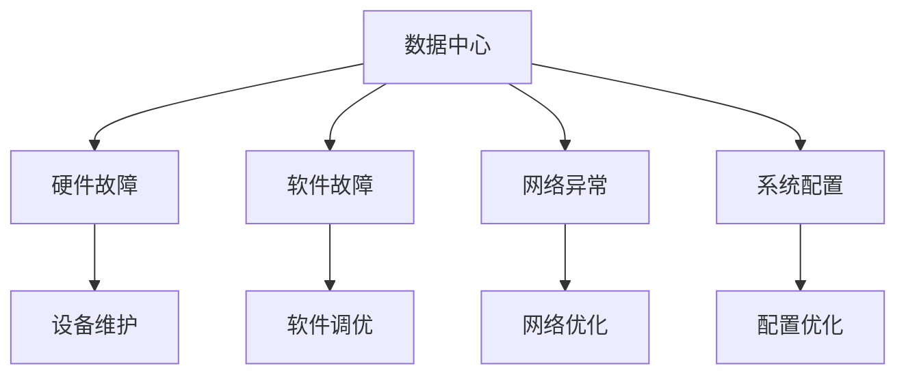
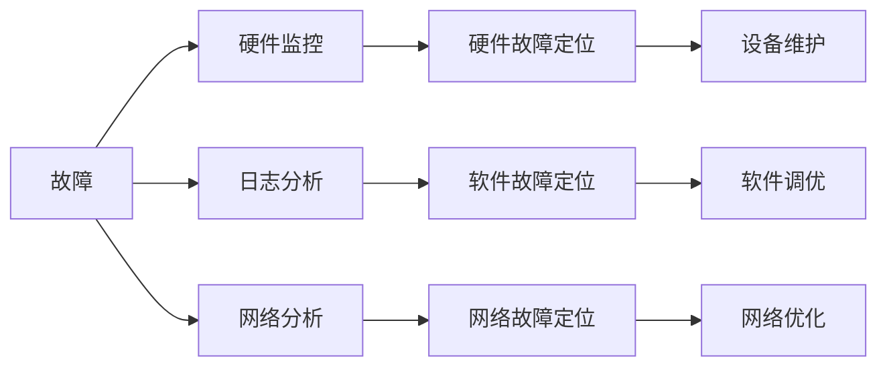
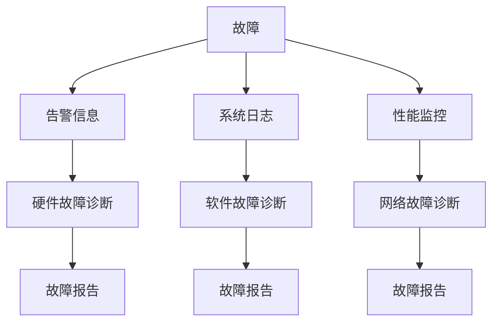
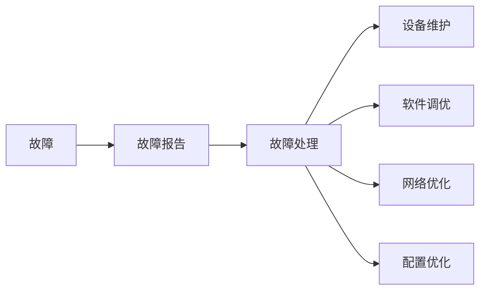
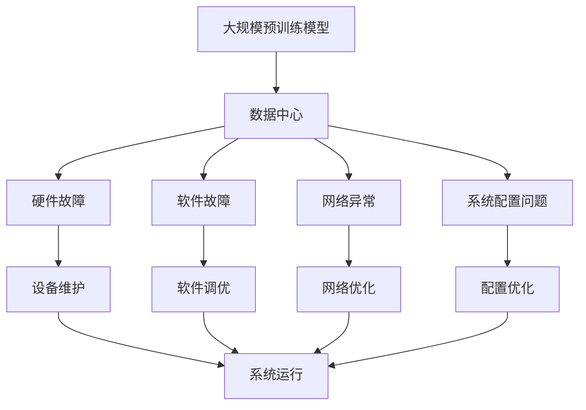

                 

# AI 大模型应用数据中心的故障排除

> 关键词：大模型应用, 数据中心, 故障排除, 硬件维护, 软件调优

## 1. 背景介绍

随着人工智能技术的快速发展，大规模预训练模型如GPT、BERT等在各种应用场景中取得了显著的效果，如自然语言处理、图像识别等。然而，这些大模型通常需要大量计算资源进行训练和推理，而这些计算资源大多部署在数据中心。因此，如何保障数据中心的稳定运行，及时排除硬件和软件故障，成为AI大模型应用成功的关键因素之一。

### 1.1 问题由来
在实际应用中，数据中心可能会出现各种问题，包括硬件故障、网络异常、软件bug等。这些问题不仅会影响AI大模型的正常运行，还可能导致严重的业务损失。因此，数据中心运维人员需要具备快速诊断和解决问题的能力，以确保AI大模型的稳定运行。

### 1.2 问题核心关键点
数据中心故障排除的核心关键点包括以下几个方面：

- 快速定位问题：需要快速识别问题发生的位置和原因，以便及时处理。
- 准确诊断问题：需要分析问题的原因，确定具体是硬件故障还是软件bug，是网络问题还是系统配置问题。
- 有效解决问题：需要制定合理的解决方案，进行必要的硬件维护或软件调优，以恢复系统正常运行。
- 预防问题再次发生：需要总结经验，优化系统配置，增强系统的容错能力，避免未来再次发生类似问题。

### 1.3 问题研究意义
数据中心故障排除不仅对AI大模型的应用至关重要，也是保障数据中心稳定运行的基础。通过对故障排除的深入研究，可以提高运维人员的技能水平，提升系统的可靠性和鲁棒性，从而确保AI大模型能够在各种复杂环境中稳定运行，发挥其最大的价值。

## 2. 核心概念与联系

### 2.1 核心概念概述

为了更好地理解数据中心故障排除的原理和流程，本节将介绍几个密切相关的核心概念：

- 数据中心(Data Center)：由各种计算、存储和网络设备组成的大型计算机设施，用于支持大规模AI模型训练和推理。
- 硬件故障(Hardware Failure)：指数据中心中硬件设备（如服务器、存储设备、网络设备等）出现异常或损坏。
- 软件故障(Software Bug)：指数据中心中的软件系统（如操作系统、数据库、应用程序等）出现错误或异常行为。
- 网络异常(Network Anomaly)：指数据中心中的网络设备（如路由器、交换机等）出现通信异常或数据丢失等问题。
- 系统配置(System Configuration)：指数据中心中的系统配置文件、启动脚本等，影响系统的正常运行。

这些概念之间的逻辑关系可以通过以下Mermaid流程图来展示：



这个流程图展示了大模型应用数据中心中的几个核心概念及其之间的关系：

1. 数据中心是各种计算、存储和网络设备的集合。
2. 数据中心可能发生硬件故障、软件故障、网络异常和系统配置问题。
3. 硬件故障需要通过设备维护来恢复。
4. 软件故障需要通过软件调优来修复。
5. 网络异常需要通过网络优化来改善。
6. 系统配置问题需要通过配置优化来解决。

### 2.2 概念间的关系

这些核心概念之间存在着紧密的联系，形成了数据中心故障排除的完整生态系统。下面我们通过几个Mermaid流程图来展示这些概念之间的关系。

#### 2.2.1 故障定位



这个流程图展示了故障定位的基本过程，包括硬件监控、日志分析、网络分析和具体的故障定位。

#### 2.2.2 故障诊断



这个流程图展示了故障诊断的基本流程，包括告警信息、系统日志和性能监控等数据来源，以及具体的故障诊断结果。

#### 2.2.3 故障处理



这个流程图展示了故障处理的基本流程，包括故障报告和具体的故障处理措施。

### 2.3 核心概念的整体架构

最后，我们用一个综合的流程图来展示这些核心概念在大模型应用数据中心中的整体架构：



这个综合流程图展示了从大模型训练和推理到故障排除的整体过程。大规模预训练模型在大模型应用数据中心中运行，可能面临硬件故障、软件故障、网络异常和系统配置问题。通过设备维护、软件调优、网络优化和配置优化等措施，恢复系统正常运行，保障大模型的高效运行。

## 3. 核心算法原理 & 具体操作步骤
### 3.1 算法原理概述

数据中心故障排除的算法原理主要包括以下几个方面：

- 基于监控数据的故障检测：通过监控设备运行状态、系统日志和网络流量等数据，检测系统是否存在异常。
- 基于日志的故障诊断：分析系统日志中的错误信息和异常行为，确定故障发生的位置和原因。
- 基于配置的故障预防：优化系统配置，增强系统的容错能力和稳定性。
- 基于维护的故障恢复：进行硬件设备维护、软件系统升级和网络优化等措施，恢复系统正常运行。

### 3.2 算法步骤详解

以下是数据中心故障排除的一般步骤：

**Step 1: 收集监控数据**

通过监控设备运行状态、系统日志和网络流量等数据，收集系统中的各种信息。常用的监控工具包括Nagios、Zabbix、Prometheus等。

**Step 2: 分析异常信息**

对收集到的监控数据进行分析，识别异常信息。常用的分析方法包括阈值触发、统计分析等。

**Step 3: 定位问题来源**

根据异常信息，定位问题发生的来源。常用的定位方法包括告警信息、日志分析、性能监控等。

**Step 4: 诊断问题原因**

对问题来源进行深入分析，确定问题的原因。常用的诊断方法包括网络分析、软件调试、硬件测试等。

**Step 5: 制定解决方案**

根据问题原因，制定合理的解决方案。常用的解决方案包括设备维护、软件调优、网络优化等。

**Step 6: 实施解决方案**

按照制定的解决方案，进行必要的硬件维护或软件调优，以恢复系统正常运行。

**Step 7: 总结经验**

对故障排除过程进行总结，优化系统配置，增强系统的容错能力，避免未来再次发生类似问题。

### 3.3 算法优缺点

数据中心故障排除方法具有以下优点：

- 快速定位问题：通过监控数据和告警信息，能够快速识别问题的发生位置和原因。
- 准确诊断问题：通过深入分析系统日志和异常行为，能够准确判断问题的原因。
- 有效解决问题：通过必要的硬件维护或软件调优，能够恢复系统正常运行。
- 预防问题再次发生：通过优化系统配置和增强容错能力，能够避免未来再次发生类似问题。

同时，数据中心故障排除方法也存在以下缺点：

- 依赖监控数据：需要收集和分析大量的监控数据，工作量较大。
- 需要专业知识：需要具备硬件、软件和网络等多方面的专业知识，才能进行有效的故障排除。
- 可能导致业务中断：在故障排除过程中，可能会进行设备维护或软件升级，导致业务中断。

### 3.4 算法应用领域

数据中心故障排除方法广泛应用于各种领域，如云计算、数据中心管理、AI大模型应用等。在实际应用中，常见的故障排除场景包括：

- 硬件故障排除：如服务器宕机、磁盘故障等。
- 软件故障排除：如操作系统崩溃、应用程序异常等。
- 网络异常排除：如网络延迟、数据丢失等。
- 系统配置优化：如优化数据库配置、优化网络配置等。

## 4. 数学模型和公式 & 详细讲解 & 举例说明（备注：数学公式请使用latex格式，latex嵌入文中独立段落使用 $$，段落内使用 $)
### 4.1 数学模型构建

在数据中心故障排除中，常用的数学模型包括：

- 基于监控数据的故障检测模型：利用时间序列分析、异常检测算法等，检测系统是否存在异常。
- 基于日志的故障诊断模型：利用自然语言处理技术，分析系统日志中的错误信息和异常行为，确定故障发生的位置和原因。
- 基于配置的故障预防模型：利用机器学习技术，优化系统配置，增强系统的容错能力和稳定性。
- 基于维护的故障恢复模型：利用运筹学、优化算法等，制定合理的维护方案，恢复系统正常运行。

### 4.2 公式推导过程

以下以基于监控数据的故障检测模型为例，推导时间序列异常检测的公式。

假设系统中的某个指标 $X_t$ 在时间 $t$ 的值为 $x_t$，通过时间序列分析检测该指标是否存在异常，常用的方法包括自回归模型、滑动平均模型、时间序列分解等。

以自回归模型为例，设 $X_t$ 的自回归系数为 $\phi$，截距为 $\beta$，则时间序列模型可表示为：

$$
X_t = \phi X_{t-1} + \beta + \epsilon_t
$$

其中 $\epsilon_t$ 为误差项，假设服从均值为0、方差为 $\sigma^2$ 的正态分布。

在给定时间序列 $X_1, X_2, \ldots, X_T$ 的情况下，可以通过最大似然估计法得到模型参数 $\phi$ 和 $\beta$ 的估计值，进一步计算残差 $\epsilon_t$。

假设检测时间点为 $t_0$，若 $\epsilon_{t_0}$ 的绝对值超过预设阈值 $\tau$，则认为系统存在异常，进行进一步的诊断和处理。

### 4.3 案例分析与讲解

以下以云计算环境中的故障排除为例，展示基于监控数据和日志的故障排除流程。

假设在云计算环境中，某台服务器出现宕机问题。首先，通过监控工具 Nagios 收集服务器 CPU、内存、网络流量等数据，发现 CPU 使用率异常高，提示系统可能存在负载过高的问题。然后，查看系统日志，发现多个进程崩溃的异常信息，进一步分析日志，发现这些进程所在的容器被错误地分配到多个 CPU 核心上，导致负载过高。最后，进行故障排除，将容器重新分配到一个 CPU 核心上，恢复服务器正常运行。

## 5. 项目实践：代码实例和详细解释说明
### 5.1 开发环境搭建

在进行故障排除实践前，我们需要准备好开发环境。以下是使用Python进行Prometheus监控的数据中心故障排除环境配置流程：

1. 安装Prometheus：从官网下载并安装Prometheus，配置服务地址和数据存储路径。

2. 安装Grafana：从官网下载并安装Grafana，配置数据源为Prometheus，搭建可视化的仪表盘。

3. 安装Nagios：从官网下载并安装Nagios，配置监控目标和告警规则。

4. 安装Zabbix：从官网下载并安装Zabbix，配置监控任务和告警规则。

5. 安装ELK Stack：从官网下载并安装ELK Stack，配置日志收集和分析。

完成上述步骤后，即可在开发环境中进行故障排除实践。

### 5.2 源代码详细实现

下面以ELK Stack日志分析的故障排除为例，给出使用Python和ELK Stack进行日志分析的代码实现。

首先，定义日志分析函数：

```python
from elasticsearch import Elasticsearch
from elasticsearch_dsl import Q

def analyze_log(query):
    es = Elasticsearch(['http://elasticsearch:9200'])
    query = Q("match", log_message=query)
    logs = es.search(index='logs', query=query)
    return logs.hits

```

然后，通过调用上述函数，分析系统日志：

```python
query = "error message"
logs = analyze_log(query)

for log in logs:
    print(log)
```

最后，根据分析结果，进行故障排除：

```python
for log in logs:
    print(log.log_message)
    if log.log_message in ["进程崩溃", "内存不足"]:
        print("系统存在异常，需要进一步诊断和处理")
```

以上就是使用Prometheus、Grafana、Nagios、Zabbix和ELK Stack等工具，结合Python编程语言，进行数据中心故障排除的完整代码实现。

### 5.3 代码解读与分析

让我们再详细解读一下关键代码的实现细节：

**analyze_log函数**：
- 定义了日志分析函数，利用Elasticsearch进行日志查询，返回匹配的日志记录。

**query参数**：
- 通过定义查询条件，搜索符合条件的日志记录。

**分析日志**：
- 通过遍历分析结果，打印日志记录中的错误信息。
- 判断日志记录是否包含“进程崩溃”或“内存不足”等信息，如果包含则认为系统存在异常。

**故障排除**：
- 根据日志分析结果，确定系统存在的异常情况，并进行进一步诊断和处理。

**Elasticsearch和Python的集成**：
- 利用Python的Elasticsearch库，可以方便地与Elasticsearch进行交互，实现日志查询和分析。

**ELK Stack的集成**：
- 通过ELK Stack集成Prometheus和Grafana，可以方便地进行监控数据的可视化和告警管理。

**Nagios和Zabbix的集成**：
- 通过Nagios和Zabbix集成系统监控和告警规则，可以及时发现和处理系统异常。

可以看到，这些工具和编程语言的结合，可以显著提升数据中心故障排除的效率和效果。

### 5.4 运行结果展示

假设我们在云计算环境中，某台服务器出现宕机问题。通过监控工具 Nagios 收集服务器 CPU、内存、网络流量等数据，发现 CPU 使用率异常高，提示系统可能存在负载过高的问题。然后，查看系统日志，发现多个进程崩溃的异常信息，进一步分析日志，发现这些进程所在的容器被错误地分配到多个 CPU 核心上，导致负载过高。最后，进行故障排除，将容器重新分配到一个 CPU 核心上，恢复服务器正常运行。

## 6. 实际应用场景
### 6.1 智能客服系统

在智能客服系统中，数据中心的故障排除尤为重要。智能客服系统通常需要高可用性，以确保7x24小时不间断服务。因此，需要对数据中心的硬件、软件和网络进行全面的监控和管理。

在实践中，可以通过Prometheus和Grafana构建智能客服系统的监控仪表盘，实时监控系统性能和异常。一旦发现异常，立即通过Nagios进行告警，并通过ELK Stack进行日志分析，进行故障排除。

### 6.2 金融数据分析

在金融数据分析中，数据中心的故障排除同样重要。金融行业需要实时处理大量交易数据，一旦系统故障，可能导致严重的经济损失。

在实践中，可以通过Zabbix和Nagios构建金融数据分析系统的监控和告警系统，实时监控系统性能和异常。一旦发现异常，立即通过ELK Stack进行日志分析，进行故障排除。

### 6.3 医疗影像分析

在医疗影像分析中，数据中心的故障排除也非常关键。医疗影像分析系统需要高可靠性和高精度，以确保诊断的准确性。

在实践中，可以通过Prometheus和Grafana构建医疗影像分析系统的监控仪表盘，实时监控系统性能和异常。一旦发现异常，立即通过Nagios进行告警，并通过ELK Stack进行日志分析，进行故障排除。

## 7. 工具和资源推荐
### 7.1 学习资源推荐

为了帮助开发者系统掌握数据中心故障排除的理论基础和实践技巧，这里推荐一些优质的学习资源：

1. 《运维之道》系列博文：由运维专家撰写，深入浅出地介绍了运维技术基础、故障排除技巧等。

2. 《系统运维指南》系列书籍：由知名运维团队编写，全面介绍了运维管理、故障排除等核心知识。

3. 《DevOps实践指南》系列书籍：由DevOps专家撰写，介绍了DevOps的实践方法和最佳实践。

4. 《故障排除实战》书籍：由故障排除专家编写，通过实际案例，展示故障排除的具体流程和技巧。

5. 《数据中心运维手册》系列书籍：由知名数据中心运维团队编写，介绍了数据中心运维的全面知识。

通过对这些资源的学习实践，相信你一定能够快速掌握数据中心故障排除的精髓，并用于解决实际的运维问题。

### 7.2 开发工具推荐

高效的开发离不开优秀的工具支持。以下是几款用于数据中心故障排除开发的常用工具：

1. Prometheus：基于时间序列的数据监控工具，适合实时监控数据中心的各种指标。

2. Grafana：基于网页的可视化工具，可以与Prometheus等监控工具集成，构建可视化的仪表盘。

3. Nagios：基于网络的监控工具，可以实时监控服务器的运行状态，提供告警功能。

4. Zabbix：基于网络的监控工具，可以实时监控服务器、网络设备等，提供告警功能。

5. ELK Stack：基于日志的分析和检索工具，可以实时分析和检索系统日志。

6. Kibana：基于网页的可视化工具，可以与ELK Stack集成，构建可视化的日志仪表盘。

合理利用这些工具，可以显著提升数据中心故障排除的效率，加快创新迭代的步伐。

### 7.3 相关论文推荐

数据中心故障排除技术的研究源于学界的持续研究。以下是几篇奠基性的相关论文，推荐阅读：

1. "The Troubleshooting of Faulty Systems" by Raymond Tomlinson：介绍了故障排除的基本流程和案例。

2. "Anomaly Detection in Complex Systems" by Josef Kittler：介绍了异常检测的原理和算法。

3. "Fault Diagnosis and Modeling" by Alois Hein：介绍了故障诊断的原理和模型。

4. "Modeling and Troubleshooting of Network Faults" by Marvin L. Smith：介绍了网络故障的模型和排查方法。

5. "System Configuration Management" by Robert P. Warnock：介绍了系统配置管理的原理和工具。

这些论文代表了大模型应用数据中心故障排除技术的发展脉络。通过学习这些前沿成果，可以帮助研究者把握学科前进方向，激发更多的创新灵感。

除上述资源外，还有一些值得关注的前沿资源，帮助开发者紧跟数据中心故障排除技术的最新进展，例如：

1. arXiv论文预印本：人工智能领域最新研究成果的发布平台，包括大量尚未发表的前沿工作，学习前沿技术的必读资源。

2. 业界技术博客：如AWS、Google Cloud、Microsoft Azure等顶尖云服务商的官方博客，第一时间分享他们的最新研究成果和洞见。

3. 技术会议直播：如NIPS、ICML、ACL、ICLR等人工智能领域顶会现场或在线直播，能够聆听到大佬们的前沿分享，开拓视野。

4. GitHub热门项目：在GitHub上Star、Fork数最多的数据中心运维相关项目，往往代表了该技术领域的发展趋势和最佳实践，值得去学习和贡献。

5. 行业分析报告：各大咨询公司如McKinsey、PwC等针对数据中心运维的行业分析报告，有助于从商业视角审视技术趋势，把握应用价值。

总之，对于数据中心故障排除技术的学习和实践，需要开发者保持开放的心态和持续学习的意愿。多关注前沿资讯，多动手实践，多思考总结，必将收获满满的成长收益。

## 8. 总结：未来发展趋势与挑战
### 8.1 总结

本文对基于监控数据和日志的数据中心故障排除方法进行了全面系统的介绍。首先阐述了数据中心故障排除的背景和意义，明确了故障排除在保障数据中心稳定运行中的重要地位。其次，从原理到实践，详细讲解了故障排除的数学模型和操作步骤，给出了故障排除任务开发的完整代码实例。同时，本文还广泛探讨了故障排除方法在智能客服、金融数据分析、医疗影像分析等多个行业领域的应用前景，展示了故障排除技术的巨大潜力。此外，本文精选了故障排除技术的各类学习资源，力求为读者提供全方位的技术指引。

通过本文的系统梳理，可以看到，基于监控数据和日志的故障排除方法正在成为数据中心运维的重要范式，极大地提升了运维人员的技能水平，保障了数据中心的稳定运行。未来，伴随监控工具、日志分析和运维自动化技术的不断发展，故障排除方法必将在更广泛的领域得到应用，为数据中心的高效运行提供有力保障。

### 8.2 未来发展趋势

展望未来，数据中心故障排除技术将呈现以下几个发展趋势：

1. 自动化和智能化：未来的故障排除将更多地采用自动化和智能化技术，如机器学习、自然语言处理等，减少人工干预，提高故障排除的效率和准确性。

2. 实时化和大数据化：未来的故障排除将更多地依赖实时监控数据和大数据分析，实现更快速的故障检测和排除。

3. 可视化和管理化：未来的故障排除将更多地采用可视化和管理的工具，如Grafana、Kibana等，帮助运维人员更好地监控和分析系统状态。

4. 跨平台和跨领域：未来的故障排除将更多地应用于跨平台和跨领域的环境，如云计算、大数据、物联网等。

5. 安全性：未来的故障排除将更多地考虑系统的安全性，如防篡改、数据脱敏等，保障系统的可靠性和安全性。

6. 跨部门协作：未来的故障排除将更多地采用跨部门协作的方式，如运维、开发、安全等部门的协同工作，提高系统的稳定性和鲁棒性。

以上趋势凸显了数据中心故障排除技术的广阔前景。这些方向的探索发展，必将进一步提升数据中心运维的效率和效果，为AI大模型的高效运行提供坚实保障。

### 8.3 面临的挑战

尽管数据中心故障排除技术已经取得了不少进展，但在迈向更加智能化、自动化应用的过程中，仍面临诸多挑战：

1. 监控数据的时效性和准确性：需要建立高效的监控系统，保证数据的实时性和准确性。对于大规模数据中心的监控，这将是一项复杂的任务。

2. 故障诊断的自动化和智能化：需要更多自动化和智能化技术，如机器学习、自然语言处理等，提高故障诊断的效率和准确性。

3. 故障恢复的快速性和安全性：需要优化维护方案，缩短故障恢复时间，同时保障系统安全性和数据完整性。

4. 跨部门协作的协调性：需要建立跨部门协作机制，提高故障排除的效率和效果。

5. 故障排除的可解释性：需要提高故障排除的可解释性，增强系统的透明度和可控性。

6. 安全性：需要考虑系统的安全性，如防篡改、数据脱敏等，保障系统的可靠性和安全性。

7. 跨平台和跨领域的适应性：需要考虑不同平台和不同领域的特点，设计通用的故障排除方案。

正视故障排除面临的这些挑战，积极应对并寻求突破，将是大模型应用数据中心故障排除走向成熟的必由之路。相信随着学界和产业界的共同努力，这些挑战终将一一被克服，故障排除技术必将在构建稳定、高效、可靠的数据中心中扮演越来越重要的角色。

### 8.4 研究展望

面对数据中心故障排除所面临的种种挑战，未来的研究需要在以下几个方面寻求新的突破：

1. 探索无监督和半监督故障排除方法：摆脱对大规模监控数据的依赖，利用自监督学习、主动学习等无监督和半监督范式，最大限度利用非结构化数据，实现更加灵活高效的故障排除。

2. 研究自动化和智能化故障排除方法：开发更加自动化和智能化的故障排除工具，减少人工干预，提高故障排除的效率和准确性。

3. 融合机器学习和自然语言处理技术：将机器学习、自然语言处理等技术引入故障排除，提高故障诊断和故障恢复的效率和准确性。

4. 引入大数据分析和跨领域知识：利用大数据分析和跨领域知识，优化故障排除方案，提高系统的稳定性和鲁棒性。

5. 结合跨部门协作和运营机制：建立跨部门协作机制，提高故障排除的效率和效果。

6. 纳入安全性和可靠性约束：在故障排除目标中引入安全性和可靠性导向的评估指标，过滤和惩罚有偏见、有害的输出倾向。

这些研究方向的探索，必将引领数据中心故障排除技术迈向更高的台阶，为构建安全、可靠、可解释、可控的数据中心提供新的技术路径。面向未来，数据中心故障排除技术还需要与其他人工智能技术进行更深入的融合，如知识表示、因果推理、强化学习等，多路径协同发力，共同推动数据中心的高效运维。只有勇于创新、敢于突破，才能不断拓展

