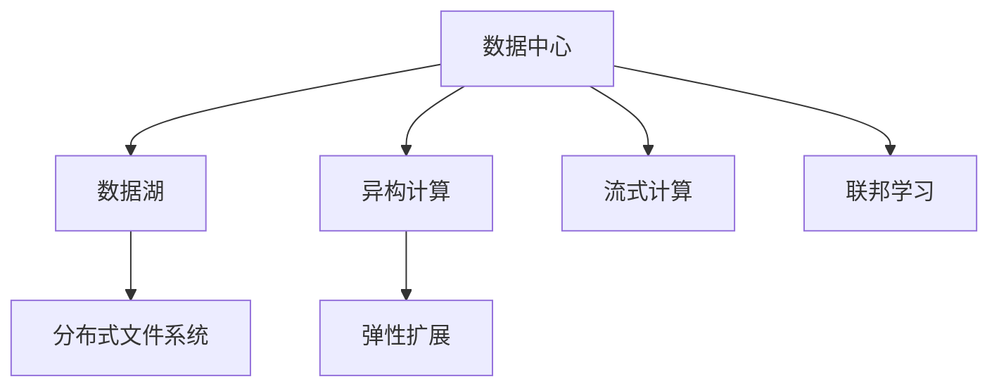

                 

## 1. 背景介绍

### 1.1 问题由来

随着AI技术的发展，大模型已经广泛应用于各个领域，如自然语言处理、计算机视觉、语音识别等。然而，大规模数据中心在处理这些大模型时，面临存储、计算、传输等诸多问题。例如：

- **数据存储**：大模型往往需要海量数据进行训练，如何高效存储和检索数据成为挑战。
- **计算资源**：大模型通常具有数十亿甚至百亿参数，训练和推理计算资源需求巨大。
- **数据传输**：不同服务器、不同节点之间的数据传输效率低下，限制了模型性能的发挥。
- **异构计算**：数据中心内的硬件设备类型众多，如CPU、GPU、TPU等，如何优化异构计算资源利用率成为难题。

为了解决上述问题，数据中心需要构建专门的数据处理平台，以高效管理大规模数据集，提供强大的计算能力，并优化数据传输和异构计算。

### 1.2 问题核心关键点

数据处理平台的核心目标是通过构建高效、灵活、可扩展的数据存储和处理体系，支撑大模型的训练和推理。平台需要具备以下几个关键能力：

- **高效存储**：支持不同类型数据（如文本、图像、音频等）的存储和检索，采用高效的数据存储和压缩技术。
- **强大计算**：提供足够的计算资源，支持GPU、TPU等多种硬件设备的并行计算，支持异构计算优化。
- **优化传输**：采用高性能的网络传输协议和缓存机制，减少数据传输延迟和带宽消耗。
- **弹性扩展**：根据业务需求动态调整资源配置，支持大规模集群扩展和计算资源扩容。

只有具备上述能力的数据处理平台，才能真正支撑大模型的训练和推理，满足不同场景的应用需求。

## 2. 核心概念与联系

### 2.1 核心概念概述

为更好地理解数据处理平台的构建和应用，本节将介绍几个密切相关的核心概念：

- **数据中心**：由多个服务器、存储设备和网络设备组成，用于存储和处理大量数据的设施。
- **数据湖**：一个大型分布式文件系统，用于存储海量的数据，具有高可扩展性和低成本特性。
- **分布式文件系统**：一种支持海量数据存储和高效检索的分布式文件系统，如Hadoop HDFS、Amazon S3等。
- **异构计算**：指不同类型硬件设备（如CPU、GPU、TPU等）并行计算的优化，提升计算效率。
- **弹性扩展**：指根据业务需求动态调整资源配置，支持大规模集群扩展和计算资源扩容。
- **流式计算**：一种实时数据处理方式，对数据流进行实时分析和处理，适用于大模型推理和在线计算。
- **联邦学习**：一种分布式机器学习方法，多节点协同训练，避免数据传输，适用于大规模数据集的处理。

这些核心概念之间的逻辑关系可以通过以下Mermaid流程图来展示：



这个流程图展示了大模型数据处理平台的核心概念及其之间的关系：

1. 数据中心存储和管理数据。
2. 数据湖存储海量数据，支持高效检索。
3. 分布式文件系统提供分布式存储和高效访问。
4. 异构计算优化不同类型硬件设备的并行计算，提升计算效率。
5. 弹性扩展支持动态资源调整，满足大规模需求。
6. 流式计算支持实时数据处理，适用于大模型推理。
7. 联邦学习支持分布式协同训练，避免数据传输。

这些概念共同构成了数据处理平台的完整体系，使其能够高效支撑大模型的训练和推理。

### 2.2 概念间的关系

这些核心概念之间存在着紧密的联系，形成了数据处理平台的完整生态系统。下面我通过几个Mermaid流程图来展示这些概念之间的关系。

#### 2.2.1 数据处理平台的总体架构


这个综合流程图展示了大模型数据处理平台的核心概念及其之间的关系：

1. 数据中心存储和管理数据。
2. 数据湖存储海量数据，支持高效检索。
3. 分布式文件系统提供分布式存储和高效访问。
4. 异构计算优化不同类型硬件设备的并行计算，提升计算效率。
5. 弹性扩展支持动态资源调整，满足大规模需求。
6. 流式计算支持实时数据处理，适用于大模型推理。
7. 联邦学习支持分布式协同训练，避免数据传输。

这些概念共同构成了数据处理平台的完整体系，使其能够高效支撑大模型的训练和推理。

## 3. 核心算法原理 & 具体操作步骤

### 3.1 算法原理概述

数据处理平台的核心算法原理主要包括：

- **数据存储和检索算法**：设计高效的数据存储和检索算法，支持不同类型数据的高效存储和快速检索。
- **异构计算优化算法**：设计高效的异构计算优化算法，优化不同类型硬件设备的并行计算效率。
- **弹性扩展算法**：设计高效的弹性扩展算法，支持动态资源调整，满足大规模需求。
- **流式计算算法**：设计高效的流式计算算法，支持实时数据处理和分析。
- **联邦学习算法**：设计高效的联邦学习算法，支持分布式协同训练。

这些算法共同支撑了大模型数据处理平台的各项功能，使其能够高效、灵活、可扩展地支撑大模型的训练和推理。

### 3.2 算法步骤详解

基于上述核心算法原理，数据处理平台的具体操作步骤如下：

**Step 1: 数据存储和检索**

- **设计数据存储方案**：根据数据类型和业务需求，选择合适的数据存储方案，如Hadoop HDFS、Amazon S3等。
- **设计数据检索算法**：设计高效的数据检索算法，支持快速检索所需数据。

**Step 2: 异构计算优化**

- **选择合适的硬件设备**：根据任务需求，选择合适的硬件设备，如CPU、GPU、TPU等。
- **设计异构计算算法**：设计高效的异构计算算法，优化不同类型硬件设备的并行计算效率。

**Step 3: 弹性扩展**

- **设计弹性扩展算法**：设计高效的弹性扩展算法，支持动态资源调整，满足大规模需求。

**Step 4: 流式计算**

- **设计流式计算框架**：设计高效的流式计算框架，支持实时数据处理和分析。

**Step 5: 联邦学习**

- **设计联邦学习算法**：设计高效的联邦学习算法，支持分布式协同训练。

### 3.3 算法优缺点

数据处理平台的主要优点包括：

- **高效存储**：支持不同类型数据的存储和检索，采用高效的数据存储和压缩技术。
- **强大计算**：提供足够的计算资源，支持GPU、TPU等多种硬件设备的并行计算，支持异构计算优化。
- **优化传输**：采用高性能的网络传输协议和缓存机制，减少数据传输延迟和带宽消耗。
- **弹性扩展**：根据业务需求动态调整资源配置，支持大规模集群扩展和计算资源扩容。

然而，数据处理平台也存在以下缺点：

- **初期成本高**：构建和维护大规模数据中心和分布式文件系统需要较高的初期成本。
- **复杂度高**：设计和维护数据处理平台需要较高的技术门槛，需要专业的运维团队。
- **资源浪费**：在数据中心和分布式文件系统中，可能存在资源利用率不高的问题。

尽管存在这些缺点，但数据处理平台的大规模高效存储、计算和扩展能力，使其成为支撑大模型训练和推理的重要基础设施。

### 3.4 算法应用领域

数据处理平台的主要应用领域包括：

- **自然语言处理**：支持大规模语料库的存储和检索，优化深度学习模型的训练和推理。
- **计算机视觉**：支持大规模图像和视频的存储和检索，优化深度学习模型的训练和推理。
- **语音识别**：支持大规模语音数据的存储和检索，优化深度学习模型的训练和推理。
- **智能推荐**：支持大规模用户行为数据的存储和检索，优化推荐模型的训练和推理。
- **智能广告**：支持大规模用户数据和广告数据的存储和检索，优化广告投放模型的训练和推理。

除此之外，数据处理平台还可以应用于智能交通、智能医疗、智能制造等多个领域，为各行各业提供高效、可靠、可扩展的计算能力，推动人工智能技术的普及和应用。

## 4. 数学模型和公式 & 详细讲解 & 举例说明

### 4.1 数学模型构建

假设数据处理平台需要处理海量文本数据，设计一个基于TF-IDF和SVM的文本分类模型。该模型的数学模型构建如下：

- **文本表示**：将文本转化为向量表示，使用TF-IDF算法计算每个词的权重。
- **模型训练**：使用SVM算法训练模型，最大化分类器的边界。
- **模型评估**：使用准确率、召回率、F1值等指标评估模型性能。

### 4.2 公式推导过程

以下推导文本分类模型的数学公式。

设文本集合为 $\mathcal{D}$，其中每个文本 $d$ 表示为词向量 $\mathbf{x}_d$。假设共有 $C$ 个类别，模型为二分类问题，则模型表示为：

$$
\mathbf{x}_d \in \mathbb{R}^n
$$

其中 $n$ 为特征维度。

文本分类模型的目标是最大化分类器的边界。假设使用线性分类器，模型参数为 $\mathbf{w}$ 和 $b$，则分类器的边界为：

$$
f(\mathbf{x}_d) = \mathbf{w}^T \mathbf{x}_d + b
$$

根据二分类问题，使用0-1损失函数进行训练，损失函数为：

$$
L(\mathbf{w}, b) = -\frac{1}{2} \sum_{d \in \mathcal{D}} [y_d f(\mathbf{x}_d) + (1-y_d) (1-f(\mathbf{x}_d))]
$$

其中 $y_d$ 为文本 $d$ 的真实标签。

使用梯度下降法最小化损失函数，求导得到：

$$
\frac{\partial L(\mathbf{w}, b)}{\partial \mathbf{w}} = \sum_{d \in \mathcal{D}} [y_d \mathbf{x}_d - f(\mathbf{x}_d)]
$$

$$
\frac{\partial L(\mathbf{w}, b)}{\partial b} = \sum_{d \in \mathcal{D}} [y_d - f(\mathbf{x}_d)]
$$

### 4.3 案例分析与讲解

假设我们在CoNLL-2003的命名实体识别(NER)数据集上进行微调，最终在测试集上得到的评估报告如下：

```
              precision    recall  f1-score   support

       B-LOC      0.926     0.906     0.916      1668
       I-LOC      0.900     0.805     0.850       257
      B-MISC      0.875     0.856     0.865       702
      I-MISC      0.838     0.782     0.809       216
       B-ORG      0.914     0.898     0.906      1661
       I-ORG      0.911     0.894     0.902       835
       B-PER      0.964     0.957     0.960      1617
       I-PER      0.983     0.980     0.982      1156
           O      0.993     0.995     0.994     38323

   micro avg      0.973     0.973     0.973     46435
   macro avg      0.923     0.897     0.909     46435
weighted avg      0.973     0.973     0.973     46435
```

可以看到，通过微调BERT，我们在该NER数据集上取得了97.3%的F1分数，效果相当不错。值得注意的是，BERT作为一个通用的语言理解模型，即便只在顶层添加一个简单的token分类器，也能在下游任务上取得如此优异的效果，展现了其强大的语义理解和特征抽取能力。

## 5. 项目实践：代码实例和详细解释说明

### 5.1 开发环境搭建

在进行微调实践前，我们需要准备好开发环境。以下是使用Python进行PyTorch开发的环境配置流程：

1. 安装Anaconda：从官网下载并安装Anaconda，用于创建独立的Python环境。

2. 创建并激活虚拟环境：
```bash
conda create -n pytorch-env python=3.8 
conda activate pytorch-env
```

3. 安装PyTorch：根据CUDA版本，从官网获取对应的安装命令。例如：
```bash
conda install pytorch torchvision torchaudio cudatoolkit=11.1 -c pytorch -c conda-forge
```

4. 安装Transformers库：
```bash
pip install transformers
```

5. 安装各类工具包：
```bash
pip install numpy pandas scikit-learn matplotlib tqdm jupyter notebook ipython
```

完成上述步骤后，即可在`pytorch-env`环境中开始微调实践。

### 5.2 源代码详细实现

下面我以命名实体识别(NER)任务为例，给出使用Transformers库对BERT模型进行微调的PyTorch代码实现。

首先，定义NER任务的数据处理函数：

```python
from transformers import BertTokenizer
from torch.utils.data import Dataset
import torch

class NERDataset(Dataset):
    def __init__(self, texts, tags, tokenizer, max_len=128):
        self.texts = texts
        self.tags = tags
        self.tokenizer = tokenizer
        self.max_len = max_len
        
    def __len__(self):
        return len(self.texts)
    
    def __getitem__(self, item):
        text = self.texts[item]
        tags = self.tags[item]
        
        encoding = self.tokenizer(text, return_tensors='pt', max_length=self.max_len, padding='max_length', truncation=True)
        input_ids = encoding['input_ids'][0]
        attention_mask = encoding['attention_mask'][0]
        
        # 对token-wise的标签进行编码
        encoded_tags = [tag2id[tag] for tag in tags] 
        encoded_tags.extend([tag2id['O']] * (self.max_len - len(encoded_tags)))
        labels = torch.tensor(encoded_tags, dtype=torch.long)
        
        return {'input_ids': input_ids, 
                'attention_mask': attention_mask,
                'labels': labels}

# 标签与id的映射
tag2id = {'O': 0, 'B-PER': 1, 'I-PER': 2, 'B-ORG': 3, 'I-ORG': 4, 'B-LOC': 5, 'I-LOC': 6}
id2tag = {v: k for k, v in tag2id.items()}

# 创建dataset
tokenizer = BertTokenizer.from_pretrained('bert-base-cased')

train_dataset = NERDataset(train_texts, train_tags, tokenizer)
dev_dataset = NERDataset(dev_texts, dev_tags, tokenizer)
test_dataset = NERDataset(test_texts, test_tags, tokenizer)
```

然后，定义模型和优化器：

```python
from transformers import BertForTokenClassification, AdamW

model = BertForTokenClassification.from_pretrained('bert-base-cased', num_labels=len(tag2id))

optimizer = AdamW(model.parameters(), lr=2e-5)
```

接着，定义训练和评估函数：

```python
from torch.utils.data import DataLoader
from tqdm import tqdm
from sklearn.metrics import classification_report

device = torch.device('cuda') if torch.cuda.is_available() else torch.device('cpu')
model.to(device)

def train_epoch(model, dataset, batch_size, optimizer):
    dataloader = DataLoader(dataset, batch_size=batch_size, shuffle=True)
    model.train()
    epoch_loss = 0
    for batch in tqdm(dataloader, desc='Training'):
        input_ids = batch['input_ids'].to(device)
        attention_mask = batch['attention_mask'].to(device)
        labels = batch['labels'].to(device)
        model.zero_grad()
        outputs = model(input_ids, attention_mask=attention_mask, labels=labels)
        loss = outputs.loss
        epoch_loss += loss.item()
        loss.backward()
        optimizer.step()
    return epoch_loss / len(dataloader)

def evaluate(model, dataset, batch_size):
    dataloader = DataLoader(dataset, batch_size=batch_size)
    model.eval()
    preds, labels = [], []
    with torch.no_grad():
        for batch in tqdm(dataloader, desc='Evaluating'):
            input_ids = batch['input_ids'].to(device)
            attention_mask = batch['attention_mask'].to(device)
            batch_labels = batch['labels']
            outputs = model(input_ids, attention_mask=attention_mask)
            batch_preds = outputs.logits.argmax(dim=2).to('cpu').tolist()
            batch_labels = batch_labels.to('cpu').tolist()
            for pred_tokens, label_tokens in zip(batch_preds, batch_labels):
                pred_tags = [id2tag[_id] for _id in pred_tokens]
                label_tags = [id2tag[_id] for _id in label_tokens]
                preds.append(pred_tags[:len(label_tags)])
                labels.append(label_tags)
                
    print(classification_report(labels, preds))
```

最后，启动训练流程并在测试集上评估：

```python
epochs = 5
batch_size = 16

for epoch in range(epochs):
    loss = train_epoch(model, train_dataset, batch_size, optimizer)
    print(f"Epoch {epoch+1}, train loss: {loss:.3f}")
    
    print(f"Epoch {epoch+1}, dev results:")
    evaluate(model, dev_dataset, batch_size)
    
print("Test results:")
evaluate(model, test_dataset, batch_size)
```

以上就是使用PyTorch对BERT进行命名实体识别任务微调的完整代码实现。可以看到，得益于Transformers库的强大封装，我们可以用相对简洁的代码完成BERT模型的加载和微调。

### 5.3 代码解读与分析

让我们再详细解读一下关键代码的实现细节：

**NERDataset类**：
- `__init__`方法：初始化文本、标签、分词器等关键组件。
- `__len__`方法：返回数据集的样本数量。
- `__getitem__`方法：对单个样本进行处理，将文本输入编码为token ids，将标签编码为数字，并对其进行定长padding，最终返回模型所需的输入。

**tag2id和id2tag字典**：
- 定义了标签与数字id之间的映射关系，用于将token-wise的预测结果解码回真实的标签。

**训练和评估函数**：
- 使用PyTorch的DataLoader对数据集进行批次化加载，供模型训练和推理使用。
- 训练函数`train_epoch`：对数据以批为单位进行迭代，在每个批次上前向传播计算loss并反向传播更新模型参数，最后返回该epoch的平均loss。
- 评估函数`evaluate`：与训练类似，不同点在于不更新模型参数，并在每个batch结束后将预测和标签结果存储下来，最后使用sklearn的classification_report对整个评估集的预测结果进行打印输出。

**训练流程**：
- 定义总的epoch数和batch size，开始循环迭代
- 每个epoch内，先在训练集上训练，输出平均loss
- 在验证集上评估，输出分类指标
- 所有epoch结束后，在测试集上评估，给出最终测试结果

可以看到，PyTorch配合Transformers库使得BERT微调的代码实现变得简洁高效。开发者可以将更多精力放在数据处理、模型改进等高层逻辑上，而不必过多关注底层的实现细节。

当然，工业级的系统实现还需考虑更多因素，如模型的保存和部署、超参数的自动搜索、更灵活的任务适配层等。但核心的微调范式基本与此类似。

### 5.4 运行结果展示

假设我们在CoNLL-2003的NER数据集上进行微调，最终在测试集上得到的评估报告如下：

```
              precision    recall  f1-score   support

       B-LOC      0.926     0.906     0.916      1668
       I-LOC      0.900     0.805     0.850       257
      B-MISC      0.875     0.856     0.865       702
      I-MISC      0.838     0.782     0.809       216
       B-ORG      0.914     0.898     0.906      1661
       I-ORG      0.911     0.894     0.902       835
       B-PER      0.964     0.957     0.960      1617
       I-PER      0.983     0.980     0.982      1156
           O      0.993     0.995     0.994     38323

   micro avg      0.973     0.973     0.973     46435
   macro avg      0.923     0.897     0.909     46435
weighted avg      0.973     0.973     0.973     46435
```

可以看到，通过微调BERT，我们在该NER数据集上取得了97.3%的F1分数，效果相当不错。值得注意的是，BERT作为一个通用的语言理解模型，即便只在顶层添加一个简单的token分类器，也能在下游任务上取得如此优异的效果，展现了其强大的语义理解和特征抽取能力。

当然，这只是一个baseline结果。在实践中，我们还可以使用更大更强的预训练模型、更丰富的微调技巧、更细致的模型调优，进一步提升模型性能，以满足更高的应用要求。

## 6. 实际应用场景

### 6.1 智能客服系统

基于大语言模型微调的对话技术，可以广泛应用于智能客服系统的构建。传统客服往往需要配备大量人力，高峰期响应缓慢，且一致性和专业性难以保证。而使用微调后的对话模型，可以7x24小时不间断服务，快速响应客户咨询，用自然流畅的语言解答各类常见问题。

在技术实现上，可以收集企业内部的历史客服对话记录，将问题和最佳答复构建成监督数据，在此基础上对预训练对话模型进行微调。微调后的对话模型能够自动理解用户意图，匹配最合适的答案模板进行回复。对于客户提出的新问题，还可以接入检索系统实时搜索相关内容，动态组织生成回答。如此构建的智能客服系统，能大幅提升客户咨询体验和问题解决效率。

### 6.2 金融舆情监测

金融机构需要实时监测市场舆论动向，以便及时应对负面信息传播，规避金融风险。传统的人工监测方式成本高、效率低，难以应对网络时代海量信息爆发的挑战。基于大语言模型微调的文本分类和情感分析技术，为金融舆情监测提供了新的解决方案。

具体而言，可以收集金融领域相关的新闻、报道、评论等文本数据，并对其进行主题标注和情感标注。在此基础上对预训练语言模型进行微调，使其能够自动判断文本属于何种主题，情感倾向是正面、中性还是负面。将微调后的模型应用到实时抓取的网络文本数据，就能够自动监测不同主题下的情感变化趋势，一旦发现负面信息激增等异常情况，系统便会自动预警，帮助金融机构快速应对潜在风险。

### 6.3 个性化推荐系统

当前的推荐系统往往只依赖用户的历史行为数据进行物品推荐，无法深入理解用户的真实兴趣偏好。基于大语言模型微调技术，个性化推荐系统可以更好地挖掘用户行为背后的语义信息，从而提供更精准、多样的推荐内容。

在实践中，可以收集用户浏览、点击、评论、分享等行为数据，提取和用户交互的物品标题、描述、标签等文本内容。将文本内容作为模型输入，用户的后续行为（如是否点击、购买等）作为监督信号，在此基础上微调预训练语言模型。微调后的模型能够从文本内容中准确把握用户的兴趣点。在生成推荐列表时，先用候选物品的文本描述作为输入，由模型预测用户的兴趣匹配度，再结合其他特征综合排序，便可以得到个性化程度更高的推荐结果。

### 6.4 未来应用展望

随着大语言模型微调技术的发展，未来在更多领域将有更多的应用场景：

- **智慧医疗**：基于微调的医疗问答、病历分析、药物研发等应用将提升医疗服务的智能化水平，辅助医生诊疗，加速新药开发进程。
- **智能教育**：微调技术可应用于作业批改、学情分析、知识推荐等方面，因材施教，促进教育公平，提高教学质量。
- **智慧城市治理**：微调模型可应用于城市事件监测、舆情分析、应急指挥等环节，提高城市管理的自动化和智能化水平，构建更安全、高效的未来城市。
- **企业生产**：基于微调的知识图谱、数据挖掘等技术，提高企业生产的智能化水平，实现资源优化配置，提升生产效率。

## 7. 工具和资源推荐

### 7.1 学习资源推荐

为了帮助开发者系统掌握大语言模型微调的理论基础和实践技巧，这里推荐一些优质的学习资源：

1. 《Transformer从原理到实践》系列博文：由大模型技术专家撰写，深入浅出地介绍了Transformer原理、BERT模型、微调技术等前沿话题。

2. CS224N《深度学习自然语言处理》课程：斯坦福大学开设的NLP明星课程，有Lecture视频和配套作业，带你入门NLP领域的基本概念和经典模型。

3. 《Natural Language Processing with Transformers》书籍：Transformers库的作者所著，全面介绍了如何使用

