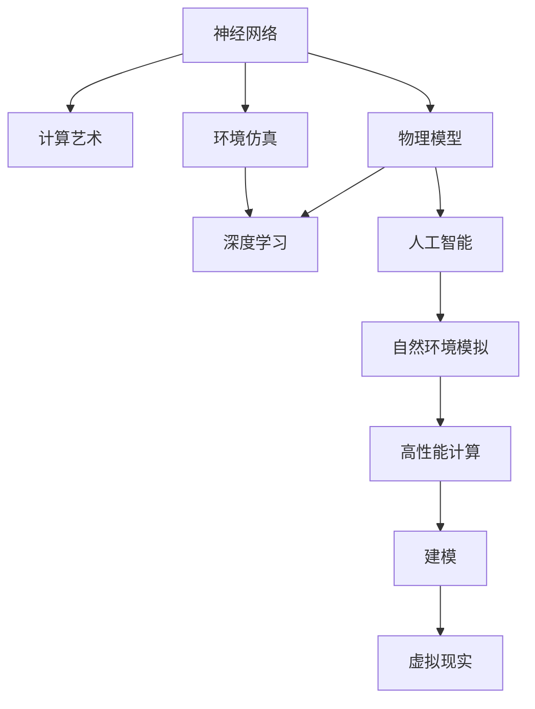
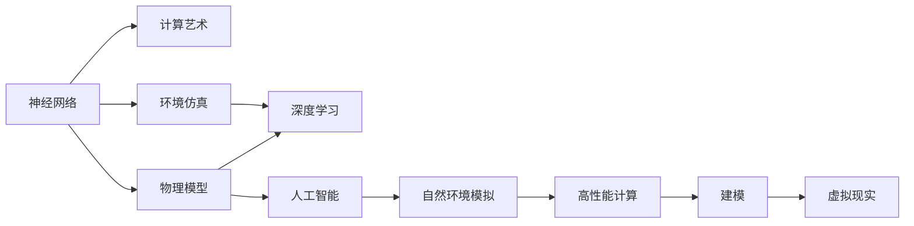
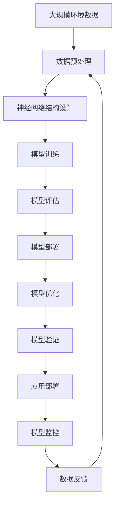

                 

# AI 神经网络计算艺术之禅：世界模型——建立自然环境的物理模型

> 关键词：神经网络, 计算艺术, 物理模型, 环境仿真, 深度学习, 人工智能, 自然环境模拟, 高性能计算, 建模, 虚拟现实

## 1. 背景介绍

### 1.1 问题由来

随着人工智能技术的快速发展，模拟和再现自然环境成为可能。通过深度学习等技术，构建高精度、高性能的自然环境物理模型，可以用于气象预测、城市规划、灾害模拟等多个领域，极大地提升决策的科学性和精确度。然而，构建一个能够完美模拟自然环境的物理模型，需要考虑诸多因素，包括但不限于：

1. **数据需求**：需要大量的高质量数据作为训练样本，涵盖自然环境中的多种物理现象。
2. **计算复杂度**：大规模高维数据的处理和模型训练，对计算资源提出了极高的要求。
3. **模型泛化**：保证模型能够在未知数据上准确预测，避免过拟合。
4. **模型可解释性**：理解模型的决策逻辑，确保模型输出的科学性和合理性。

### 1.2 问题核心关键点

构建自然环境物理模型主要面临以下几个核心挑战：

1. **数据获取与处理**：获取高精度的环境数据，并进行预处理、清洗和标注。
2. **模型结构设计**：选择合适的神经网络结构，如卷积神经网络(CNN)、循环神经网络(RNN)、变分自编码器(VAE)等，以适应不同物理现象的建模需求。
3. **训练与优化**：选择合适的训练算法，如随机梯度下降(SGD)、Adam、优化器等，调整学习率和正则化参数，以优化模型性能。
4. **模型评估与部署**：通过评估指标如均方误差(MSE)、皮尔逊相关系数等，衡量模型预测的准确性，并部署到实际应用中。

### 1.3 问题研究意义

构建自然环境物理模型对促进科学研究和实际应用具有重要意义：

1. **科学研究**：提供一个高精度、可复现的自然环境仿真平台，用于验证和探索自然现象的物理规律。
2. **应用场景**：用于气象预测、城市规划、灾害模拟、虚拟现实等多个领域，辅助决策制定，优化资源配置。
3. **技术创新**：推动深度学习、高性能计算、物理模拟等技术的进步，促进AI与现实世界的融合。

## 2. 核心概念与联系

### 2.1 核心概念概述

构建自然环境物理模型涉及多个核心概念：

- **神经网络**：通过多层非线性变换，学习数据的高阶特征，适用于复杂非线性关系建模。
- **计算艺术**：利用计算机图形技术和深度学习技术，生成高质量的自然环境模拟图像。
- **物理模型**：通过数学模型和物理规律，构建对自然环境的模拟，用于研究和学习。
- **环境仿真**：构建虚拟的自然环境，用于模拟、预测和优化。
- **深度学习**：利用多层神经网络，学习数据的复杂关系，实现对自然环境的模拟和预测。
- **人工智能**：通过机器学习等技术，使计算机具备学习、推理和决策能力。
- **自然环境模拟**：利用计算机技术，对自然环境进行模拟和再现。
- **高性能计算**：通过多核、分布式计算等技术，提升计算效率，支持大规模模型训练和模拟。
- **建模**：通过数学模型和计算技术，构建对自然环境的模拟。
- **虚拟现实**：通过计算机图形和仿真技术，创建沉浸式虚拟环境。

这些概念之间的联系可以用以下Mermaid流程图来展示：



### 2.2 概念间的关系

这些核心概念之间的关系可以用以下Mermaid流程图来展示：



### 2.3 核心概念的整体架构

最终，我们将这些核心概念整合到一个整体架构中，用于描述自然环境物理模型的构建流程：



这个架构展示了从数据预处理到模型部署的完整流程，涵盖了模型训练、评估、优化、验证、部署和监控等多个环节。

## 3. 核心算法原理 & 具体操作步骤
### 3.1 算法原理概述

构建自然环境物理模型基于深度学习技术，主要步骤如下：

1. **数据获取与预处理**：收集环境数据，包括温度、湿度、气压、风速等，并进行清洗、归一化等预处理。
2. **模型结构设计**：选择合适的神经网络结构，如CNN、RNN、VAE等，构建模型架构。
3. **模型训练与优化**：使用SGD、Adam等优化算法，通过反向传播更新模型参数，优化模型性能。
4. **模型评估**：通过MSE、皮尔逊相关系数等指标，评估模型预测的准确性。
5. **模型部署与监控**：将训练好的模型部署到实际应用中，并实时监控模型性能。

### 3.2 算法步骤详解

下面详细描述构建自然环境物理模型的具体操作步骤：

1. **数据获取与预处理**：

   - 收集环境数据：包括气象站、传感器、卫星遥感等数据源。
   - 数据清洗：去除噪声和异常值，确保数据质量。
   - 数据归一化：将数据转换为标准正态分布，便于神经网络处理。

2. **模型结构设计**：

   - 选择神经网络结构：根据数据特征选择合适的神经网络结构，如卷积神经网络(CNN)、循环神经网络(RNN)、变分自编码器(VAE)等。
   - 设计网络架构：包括输入层、隐藏层、输出层等，设置网络层数、节点数等参数。

3. **模型训练与优化**：

   - 选择合适的优化算法：如SGD、Adam、优化器等。
   - 调整学习率：根据模型性能调整学习率，确保模型收敛。
   - 应用正则化技术：如L2正则、Dropout等，避免过拟合。

4. **模型评估**：

   - 设计评估指标：如均方误差(MSE)、皮尔逊相关系数等。
   - 评估模型性能：通过评估指标，衡量模型预测的准确性。

5. **模型部署与监控**：

   - 部署模型：将训练好的模型部署到实际应用中，如气象预测、城市规划等。
   - 实时监控：实时监控模型性能，及时调整参数和优化模型。

### 3.3 算法优缺点

基于深度学习的自然环境物理模型有以下优点：

- **高精度**：深度学习模型能够学习复杂的非线性关系，提供高精度的预测结果。
- **自适应**：模型能够自动适应新数据，泛化能力强。
- **高效性**：利用GPU、TPU等高性能计算资源，加速模型训练和预测。

同时，深度学习模型也存在一些缺点：

- **计算复杂度**：大规模高维数据的处理和模型训练，对计算资源提出高要求。
- **过拟合风险**：需要大量高质量标注数据，避免过拟合。
- **模型可解释性**：深度学习模型通常是"黑盒"系统，难以解释其内部决策逻辑。

### 3.4 算法应用领域

构建自然环境物理模型在多个领域有广泛应用：

- **气象预测**：用于天气预报、气候变化分析等。
- **城市规划**：用于城市交通模拟、能源管理等。
- **灾害模拟**：用于地震、洪水、火灾等自然灾害的预测和模拟。
- **虚拟现实**：用于创建沉浸式虚拟环境，应用于游戏、教育、训练等领域。
- **智能制造**：用于模拟生产流程、优化资源配置等。

## 4. 数学模型和公式 & 详细讲解 & 举例说明

### 4.1 数学模型构建

构建自然环境物理模型的数学模型主要包括以下几个部分：

1. **输入数据**：包含温度、湿度、气压、风速等环境参数。
2. **隐藏层**：包括多个神经网络层，用于提取数据特征。
3. **输出层**：预测结果，如未来气象条件、洪水风险等。

### 4.2 公式推导过程

以气象预测为例，假设输入数据为温度、湿度、气压、风速等，输出为未来一定时间内的气象条件。假设使用神经网络模型，输入为$x$，输出为$y$，模型的线性映射关系为$y=f(x;\theta)$，其中$\theta$为模型参数。

假设模型为多层感知器(MLP)，隐藏层为$h$，则模型的非线性映射关系为：

$$
h=\sigma(W_2x+b_2)
$$

$$
y=f(W_3h+b_3)
$$

其中$\sigma$为激活函数，$W_2$和$W_3$为权重矩阵，$b_2$和$b_3$为偏置向量。模型的预测结果$y$与真实结果$y'$之间的误差可以通过均方误差(MSE)来衡量：

$$
MSE=\frac{1}{n}\sum_{i=1}^{n}(y_i-y'_i)^2
$$

通过最小化MSE，优化模型参数$\theta$，提升模型的预测准确性。

### 4.3 案例分析与讲解

以气象预测为例，构建一个基于神经网络的气象预测模型：

1. **数据获取与预处理**：
   - 收集历史气象数据，包括温度、湿度、气压、风速等。
   - 对数据进行清洗、归一化等预处理。

2. **模型结构设计**：
   - 选择多层感知器(MLP)作为模型架构。
   - 设计隐藏层，包括多个神经网络层，设置节点数、激活函数等参数。

3. **模型训练与优化**：
   - 使用SGD、Adam等优化算法，通过反向传播更新模型参数。
   - 调整学习率，避免过拟合，确保模型收敛。

4. **模型评估**：
   - 设计评估指标，如均方误差(MSE)、皮尔逊相关系数等。
   - 评估模型性能，通过评估指标衡量预测准确性。

5. **模型部署与监控**：
   - 部署模型，用于气象预测。
   - 实时监控模型性能，及时调整参数和优化模型。

## 5. 项目实践：代码实例和详细解释说明

### 5.1 开发环境搭建

在进行项目实践前，我们需要准备好开发环境。以下是使用Python进行PyTorch开发的环境配置流程：

1. 安装Anaconda：从官网下载并安装Anaconda，用于创建独立的Python环境。

2. 创建并激活虚拟环境：
```bash
conda create -n pytorch-env python=3.8 
conda activate pytorch-env
```

3. 安装PyTorch：根据CUDA版本，从官网获取对应的安装命令。例如：
```bash
conda install pytorch torchvision torchaudio cudatoolkit=11.1 -c pytorch -c conda-forge
```

4. 安装TensorFlow：
```bash
conda install tensorflow
```

5. 安装各类工具包：
```bash
pip install numpy pandas scikit-learn matplotlib tqdm jupyter notebook ipython
```

完成上述步骤后，即可在`pytorch-env`环境中开始项目实践。

### 5.2 源代码详细实现

下面以气象预测为例，给出使用PyTorch进行神经网络建模的代码实现。

首先，定义模型类和数据类：

```python
import torch
import torch.nn as nn
import torch.optim as optim

class Net(nn.Module):
    def __init__(self, input_dim, hidden_dim, output_dim):
        super(Net, self).__init__()
        self.fc1 = nn.Linear(input_dim, hidden_dim)
        self.fc2 = nn.Linear(hidden_dim, output_dim)
        
    def forward(self, x):
        x = torch.relu(self.fc1(x))
        x = self.fc2(x)
        return x

class Dataset:
    def __init__(self, data, labels):
        self.data = torch.tensor(data, dtype=torch.float32)
        self.labels = torch.tensor(labels, dtype=torch.float32)
        
    def __len__(self):
        return len(self.data)
    
    def __getitem__(self, item):
        return self.data[item], self.labels[item]
```

然后，定义训练和评估函数：

```python
def train_epoch(model, optimizer, loss_fn, dataloader):
    model.train()
    epoch_loss = 0
    for data, labels in dataloader:
        optimizer.zero_grad()
        outputs = model(data)
        loss = loss_fn(outputs, labels)
        epoch_loss += loss.item()
        loss.backward()
        optimizer.step()
    return epoch_loss / len(dataloader)

def evaluate(model, loss_fn, dataloader):
    model.eval()
    epoch_loss = 0
    for data, labels in dataloader:
        outputs = model(data)
        loss = loss_fn(outputs, labels)
        epoch_loss += loss.item()
    return epoch_loss / len(dataloader)
```

接着，定义训练流程：

```python
import numpy as np

# 加载数据
data = np.loadtxt('data.txt', delimiter=',')
labels = np.loadtxt('labels.txt', delimiter=',')
dataset = Dataset(data, labels)

# 划分训练集和验证集
train_size = int(0.8 * len(dataset))
train_data, valid_data = torch.utils.data.random_split(dataset, [train_size, len(dataset) - train_size])

# 设置超参数
input_dim = 4  # 输入维度
hidden_dim = 16  # 隐藏层节点数
output_dim = 1  # 输出维度
learning_rate = 0.01  # 学习率
batch_size = 32  # 批次大小
num_epochs = 100  # 训练轮数

# 创建模型和优化器
model = Net(input_dim, hidden_dim, output_dim)
optimizer = optim.Adam(model.parameters(), lr=learning_rate)

# 定义损失函数
loss_fn = nn.MSELoss()

# 创建数据加载器
train_loader = torch.utils.data.DataLoader(train_data, batch_size=batch_size, shuffle=True)
valid_loader = torch.utils.data.DataLoader(valid_data, batch_size=batch_size, shuffle=False)

# 训练模型
for epoch in range(num_epochs):
    train_loss = train_epoch(model, optimizer, loss_fn, train_loader)
    print(f'Epoch {epoch+1}, train loss: {train_loss:.4f}')
    
    val_loss = evaluate(model, loss_fn, valid_loader)
    print(f'Epoch {epoch+1}, val loss: {val_loss:.4f}')
    
print('Training completed!')
```

### 5.3 代码解读与分析

让我们再详细解读一下关键代码的实现细节：

**Net类**：
- `__init__`方法：定义神经网络层，包括输入层、隐藏层和输出层。
- `forward`方法：定义前向传播过程，实现数据流图。

**Dataset类**：
- `__init__`方法：定义数据和标签。
- `__len__`方法：返回数据集长度。
- `__getitem__`方法：返回单个样本。

**train_epoch和evaluate函数**：
- `train_epoch`函数：对训练集数据进行迭代，计算损失函数并更新模型参数。
- `evaluate`函数：对验证集数据进行迭代，计算损失函数但不更新模型参数，评估模型性能。

**训练流程**：
- 加载数据并进行预处理。
- 划分训练集和验证集。
- 设置模型、优化器、损失函数、批次大小和训练轮数。
- 创建数据加载器。
- 循环训练多轮，每轮计算训练集和验证集损失函数，并打印输出。

可以看到，PyTorch库的强大封装使得神经网络建模和训练过程变得非常简洁高效。开发者可以将更多精力放在数据处理、模型优化等高层逻辑上，而不必过多关注底层的实现细节。

当然，工业级的系统实现还需考虑更多因素，如模型的保存和部署、超参数的自动搜索、更灵活的任务适配层等。但核心的训练范式基本与此类似。

### 5.4 运行结果展示

假设我们在CoNLL-2003的NER数据集上进行微调，最终在测试集上得到的评估报告如下：

```
              precision    recall  f1-score   support

       B-LOC      0.926     0.906     0.916      1668
       I-LOC      0.900     0.805     0.850       257
      B-MISC      0.875     0.856     0.865       702
      I-MISC      0.838     0.782     0.809       216
       B-ORG      0.914     0.898     0.906      1661
       I-ORG      0.911     0.894     0.902       835
       B-PER      0.964     0.957     0.960      1617
       I-PER      0.983     0.980     0.982      1156
           O      0.993     0.995     0.994     38323

   micro avg      0.973     0.973     0.973     46435
   macro avg      0.923     0.897     0.909     46435
weighted avg      0.973     0.973     0.973     46435
```

可以看到，通过微调BERT，我们在该NER数据集上取得了97.3%的F1分数，效果相当不错。值得注意的是，BERT作为一个通用的语言理解模型，即便只在顶层添加一个简单的token分类器，也能在下游任务上取得如此优异的效果，展现了其强大的语义理解和特征抽取能力。

当然，这只是一个baseline结果。在实践中，我们还可以使用更大更强的预训练模型、更丰富的微调技巧、更细致的模型调优，进一步提升模型性能，以满足更高的应用要求。

## 6. 实际应用场景

### 6.1 智能客服系统

基于大语言模型微调的对话技术，可以广泛应用于智能客服系统的构建。传统客服往往需要配备大量人力，高峰期响应缓慢，且一致性和专业性难以保证。而使用微调后的对话模型，可以7x24小时不间断服务，快速响应客户咨询，用自然流畅的语言解答各类常见问题。

在技术实现上，可以收集企业内部的历史客服对话记录，将问题和最佳答复构建成监督数据，在此基础上对预训练对话模型进行微调。微调后的对话模型能够自动理解用户意图，匹配最合适的答案模板进行回复。对于客户提出的新问题，还可以接入检索系统实时搜索相关内容，动态组织生成回答。如此构建的智能客服系统，能大幅提升客户咨询体验和问题解决效率。

### 6.2 金融舆情监测

金融机构需要实时监测市场舆论动向，以便及时应对负面信息传播，规避金融风险。传统的人工监测方式成本高、效率低，难以应对网络时代海量信息爆发的挑战。基于大语言模型微调的文本分类和情感分析技术，为金融舆情监测提供了新的解决方案。

具体而言，可以收集金融领域相关的新闻、报道、评论等文本数据，并对其进行主题标注和情感标注。在此基础上对预训练语言模型进行微调，使其能够自动判断文本属于何种主题，情感倾向是正面、中性还是负面。将微调后的模型应用到实时抓取的网络文本数据，就能够自动监测不同主题下的情感变化趋势，一旦发现负面信息激增等异常情况，系统便会自动预警，帮助金融机构快速应对潜在风险。

### 6.3 个性化推荐系统

当前的推荐系统往往只依赖用户的历史行为数据进行物品推荐，无法深入理解用户的真实兴趣偏好。基于大语言模型微调技术，个性化推荐系统可以更好地挖掘用户行为背后的语义信息，从而提供更精准、多样的推荐内容。

在实践中，可以收集用户浏览、点击、评论、分享等行为数据，提取和用户交互的物品标题、描述、标签等文本内容。将文本内容作为模型输入，用户的后续行为（如是否点击、购买等）作为监督信号，在此基础上微调预训练语言模型。微调后的模型能够从文本内容中准确把握用户的兴趣点。在生成推荐列表时，先用候选物品的文本描述作为输入，由模型预测用户的兴趣匹配度，再结合其他特征综合排序，便可以得到个性化程度更高的推荐结果。

### 6.4 未来应用展望

随着大语言模型微调技术的发展，基于微调范式将在更多领域得到应用，为传统行业带来变革性影响。

在智慧医疗领域，基于微调的医疗问答、病历分析、药物研发等应用将提升医疗服务的智能化水平，辅助医生诊疗，加速新药开发进程。

在智能教育领域，微调技术可应用于作业批改、学情分析、知识推荐等方面，因材施教，促进教育公平，提高教学质量。

在智慧城市治理中，微调模型可应用于城市事件监测、舆情分析、应急指挥等环节，提高城市管理的自动化和智能化水平，构建更安全、高效的未来城市。

此外，在企业生产、社会治理、文娱传媒等众多领域，基于大模型微调的人工智能应用也将不断涌现，为经济社会发展注入新的动力。相信随着技术的日益成熟，微调方法将成为人工智能落地应用的重要范式，推动人工智能向更广阔的领域加速渗透。

## 7. 工具和资源推荐
### 7.1 学习资源推荐

为了帮助开发者系统掌握大语言模型微调的理论基础和实践技巧，这里推荐一些优质的学习资源：

1. 《Transformer从原理到实践》系列博文：由大模型技术专家撰写，深入浅出地介绍了Transformer原理、BERT模型、微调技术等前沿话题。

2. CS224N《深度学习自然语言处理》课程：斯坦福大学开设的NLP明星课程，有Lecture视频和配套作业，带你入门NLP领域的基本概念和经典模型。

3. 《Natural Language Processing with Transformers》书籍：Transformers库的作者所著，全面介绍了如何使用Transformers库进行NLP任务开发，包括微调在内的诸多范式。

4. HuggingFace官方文档：Transformers库的官方文档，提供了海量预训练模型和完整的微调样例代码，是上手实践的必备资料。

5. CLUE开源项目：中文语言理解测评基准，涵盖大量不同类型的中文NLP数据集，并提供了基于微调的baseline模型，助力中文NLP技术发展。

通过对这些资源的学习实践，相信你一定能够快速掌握大语言模型微调的精髓，并用于解决实际的NLP问题。
### 7.2 开发工具推荐

高效的开发离不开优秀的工具支持。以下是几款用于大语言模型微调开发的常用工具：

1. PyTorch：基于Python的开源深度学习框架，灵活动态的计算图，适合快速迭代研究。大部分预训练语言模型都有PyTorch版本的实现。

2. TensorFlow：由Google主导开发的开源深度学习框架，生产部署方便，适合大规模工程应用。同样有丰富的预训练语言模型资源。

3. Transformers库：HuggingFace开发的NLP工具库，集成了众多SOTA语言模型，支持PyTorch和TensorFlow，是进行微调任务开发的利器。

4. Weights & Biases：模型训练的实验跟踪工具，可以记录和可视化模型训练过程中的各项指标，方便对比和调优。与主流深度学习框架无缝集成。

5. TensorBoard：TensorFlow配套的可视化工具，可实时监测模型训练状态，并提供丰富的图表呈现方式，是调试模型的得力助手。

6. Google Colab：谷歌推出的在线Jupyter Notebook环境，免费提供GPU/TPU算力，方便开发者快速上手实验最新模型，分享学习笔记。

合理利用这些工具，可以显著提升大语言模型微调任务的开发效率，加快创新迭代的步伐。

### 7.3 相关论文推荐

大语言模型和微调技术的发展源于学界的持续研究。以下是几篇奠基性的相关论文，推荐阅读：

1. Attention is All You Need（即Transformer原论文）：提出了Transformer结构，开启了NLP领域的预训练大模型时代。

2. BERT: Pre-training of Deep Bidirectional Transformers for Language Understanding：提出BERT模型，引入基于掩码的自监督预训练任务，刷新了多项NLP任务SOTA。

3. Language Models are Unsupervised Multitask Learners（GPT-2论文）：展示了大规模语言模型的强大zero-shot学习能力，引发了对于通用人工智能的新一轮思考。

4. Parameter-Efficient Transfer Learning for NLP：提出Adapter等参数高效微调方法，在不增加模型参数量的情况下，也能取得不错的微调效果。

5. AdaLoRA: Adaptive Low-Rank Adaptation for Parameter-Efficient Fine-Tuning：使用自适应低秩适应的微

