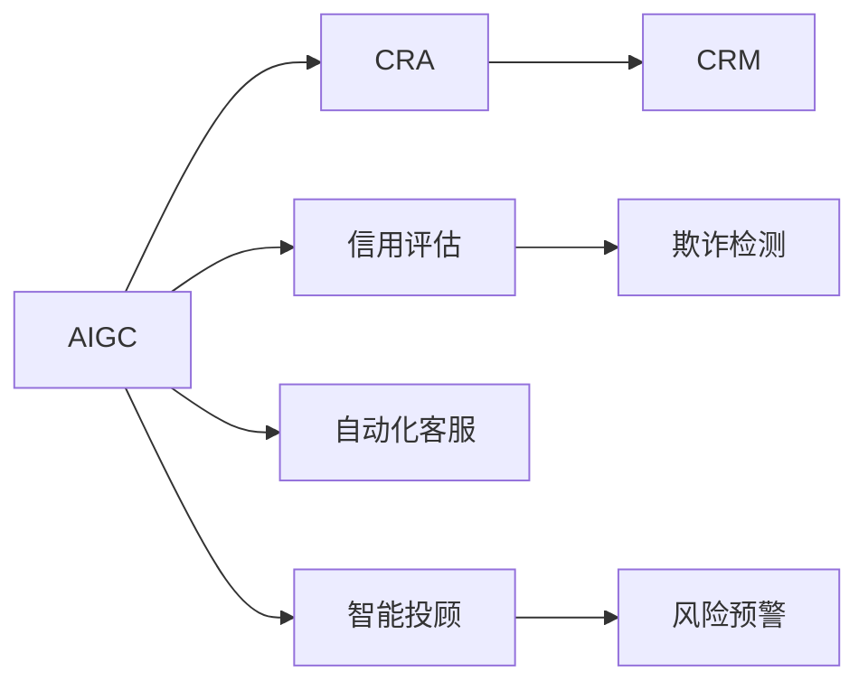
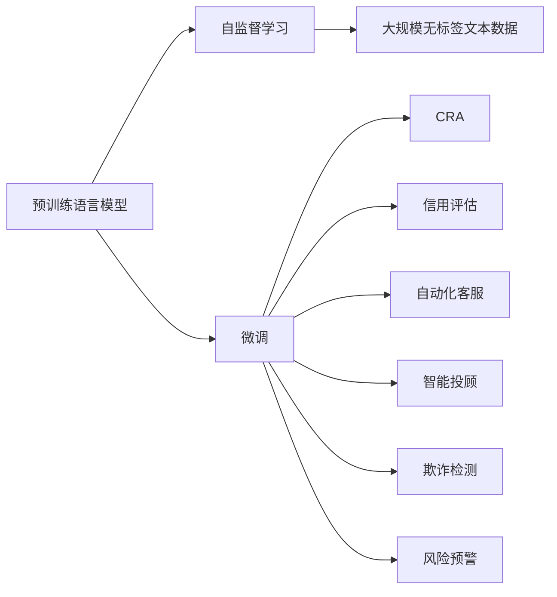
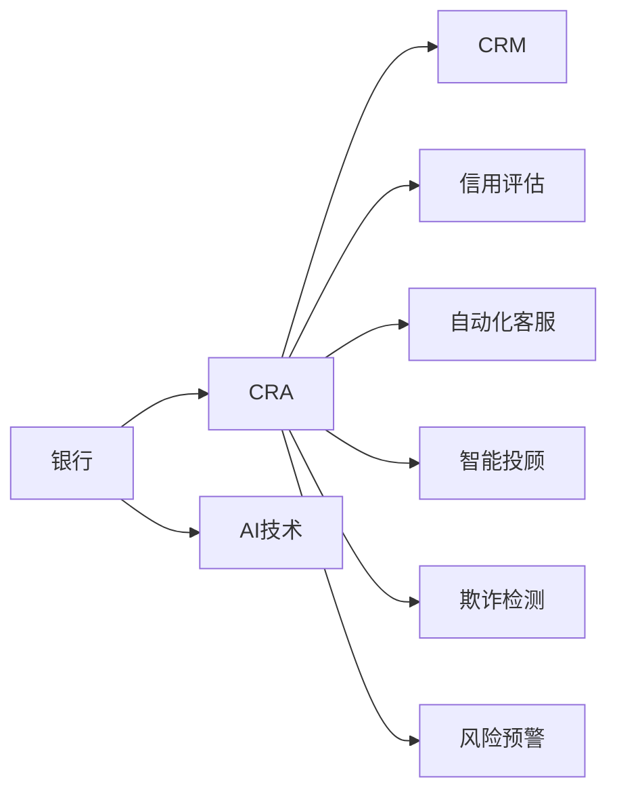
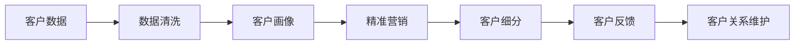
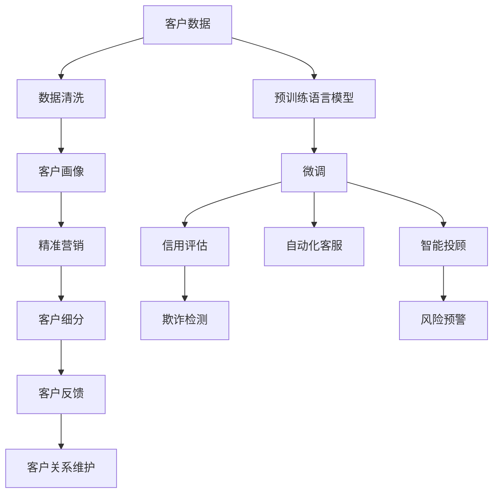

                 

# AIGC从入门到实战：AIGC 在金融行业的创新场景—银行零售新范式

> 关键词：AIGC,银行零售,金融行业,客户关系管理,CRA,个性化推荐,信用评估,自动化客服,风险管理,智能投顾

## 1. 背景介绍

### 1.1 问题由来

随着人工智能(AI)和大规模预训练模型(AIGC)的兴起，金融行业正经历着一场深刻的变革。特别是银行业，在客户关系管理、信用评估、风险控制等核心业务上，AI技术的应用已经从辅助向主导转变。AIGC技术以其强大的语言理解、生成能力，为银行业带来了新的服务模式和商业机遇。

近年来，银行业在客户服务、风险管理、金融产品推荐等环节，应用了大量的AI技术，取得了显著的效果。然而，随着技术的发展，传统金融业务的运营模式和用户体验也面临新的挑战和机遇。本文旨在探讨AIGC在金融行业的创新场景，特别是在银行零售领域的新范式，为金融从业者提供实践指导和技术支持。

### 1.2 问题核心关键点

AIGC在金融行业的核心应用场景包括客户关系管理、信用评估、风险管理、自动化客服、智能投顾等多个方面。其中，银行零售是AIGC技术的典型应用场景，涉及客户服务、产品推荐、风险控制等多个环节。AIGC技术的成功应用，极大地提升了金融服务的效率和质量，推动了银行业务的智能化、个性化和自动化发展。

AIGC在银行零售中的应用，主要涉及以下核心技术：

1. **客户关系管理**：利用AI技术构建客户画像，进行精准营销和客户细分。
2. **信用评估**：通过NLP和机器学习模型，对客户申请信息进行深度分析，快速评估信用风险。
3. **风险管理**：应用AIGC技术进行欺诈检测、风险预警，提高风险识别和应对能力。
4. **自动化客服**：通过聊天机器人和语音助手，提供全天候的金融服务，提升客户满意度。
5. **智能投顾**：利用AI和大数据，为客户提供个性化投资建议，优化资产配置。

这些技术的应用，使得银行在产品推荐、客户关系管理、风险控制等方面取得了显著的突破。AIGC技术的引入，不仅提升了银行的运营效率，也改善了客户体验，为银行带来了新的商业价值。

### 1.3 问题研究意义

AIGC在银行零售领域的应用，具有重要的研究意义：

1. **提升客户体验**：AIGC技术可以自动化处理客户咨询，提供24/7不间断的服务，提升了客户满意度和忠诚度。
2. **降低运营成本**：通过自动化客服和风险管理，降低了银行的运营成本，提高了运营效率。
3. **优化产品推荐**：通过AI技术进行客户画像分析，为客户提供个性化推荐，提升了销售转化率。
4. **增强风险控制**：AIGC技术在欺诈检测和风险预警方面的应用，提高了银行的风险管理能力，减少了潜在损失。
5. **推动业务创新**：AIGC技术为银行带来了新的服务模式和商业机遇，推动了业务创新和数字化转型。

本文将全面系统地介绍AIGC在银行零售领域的应用，探讨其核心技术原理、操作步骤和应用效果，为金融从业者提供实用的技术指导和实践参考。

## 2. 核心概念与联系

### 2.1 核心概念概述

为了更好地理解AIGC在银行零售领域的应用，我们需要了解一些核心概念：

1. **AIGC**：人工智能和大规模预训练模型的简称，通过在大规模无标签文本数据上进行预训练，学习通用的语言知识和常识，具备强大的语言理解和生成能力。

2. **客户关系管理(CRM)**：银行通过收集、整理和分析客户数据，构建客户画像，进行精准营销和客户细分，提升客户满意度和忠诚度。

3. **信用评估**：利用AI技术对客户的信用信息进行分析，评估客户的信用风险，帮助银行进行贷款审批和风险管理。

4. **自动化客服**：通过聊天机器人、语音助手等技术，提供全天候的金融服务，提升客户满意度。

5. **智能投顾**：利用AI和大数据，为客户提供个性化的投资建议，优化资产配置，提升投资回报率。

6. **欺诈检测**：利用AI技术检测金融交易中的异常行为，预防和减少欺诈风险。

7. **风险预警**：通过AI技术进行风险分析和预警，及时应对潜在的金融风险。

这些核心概念之间存在紧密的联系，共同构成了AIGC在银行零售领域的应用生态系统。下面通过一个Mermaid流程图来展示这些概念之间的关系：



这个流程图展示了AIGC在银行零售领域的应用场景，从客户关系管理、信用评估到风险管理，每个环节都可以利用AIGC技术进行优化和提升。

### 2.2 概念间的关系

这些核心概念之间存在着紧密的联系，形成了AIGC在银行零售领域的应用框架。下面我们通过几个Mermaid流程图来展示这些概念之间的关系。

#### 2.2.1 AIGC的运行机制



这个流程图展示了AIGC技术的运行机制。通过在大规模无标签文本数据上进行预训练，学习通用的语言知识和常识，然后在特定任务上进行微调，使得模型能够适应具体的银行零售场景，提升金融服务的效率和质量。

#### 2.2.2 AIGC在银行零售的应用



这个流程图展示了AIGC技术在银行零售中的应用场景。通过AI技术，银行在客户关系管理、信用评估、自动化客服、智能投顾、欺诈检测和风险预警等多个环节，都取得了显著的效果。

#### 2.2.3 客户关系管理(CRM)流程



这个流程图展示了客户关系管理(CRM)的流程。通过数据清洗和客户画像构建，银行能够进行精准营销和客户细分，提升客户满意度和忠诚度。

### 2.3 核心概念的整体架构

最后，我们用一个综合的流程图来展示这些核心概念在银行零售领域的整体架构：



这个综合流程图展示了从客户数据处理到金融服务各环节的AIGC应用，强调了AIGC在银行零售领域的强大应用潜力。

## 3. 核心算法原理 & 具体操作步骤
### 3.1 算法原理概述

AIGC在银行零售领域的应用，主要涉及以下几个核心算法：

1. **客户画像构建**：利用自然语言处理(NLP)技术，对客户提交的各类信息（如贷款申请、咨询记录等）进行文本分析，提取关键特征，构建客户画像。
2. **信用评估模型**：通过机器学习模型对客户信用信息进行分析，预测客户的信用风险。
3. **自动化客服系统**：构建聊天机器人和语音助手，利用NLP技术理解客户意图，提供自动化的金融服务。
4. **智能投顾系统**：利用AI和大数据，对客户的资产配置进行优化，提供个性化的投资建议。
5. **欺诈检测模型**：构建欺诈检测模型，识别金融交易中的异常行为，预防和减少欺诈风险。
6. **风险预警模型**：构建风险预警模型，对金融市场和交易进行风险评估，提供风险预警服务。

这些算法通常基于监督学习、半监督学习、无监督学习等方法，通过构建模型对输入数据进行学习，实现特定的功能。

### 3.2 算法步骤详解

以下是AIGC在银行零售领域的具体操作步骤：

**Step 1: 数据准备和预处理**

1. **数据收集**：从银行的业务系统中收集客户数据，包括贷款申请、信用卡申请、咨询记录、交易记录等。
2. **数据清洗**：清洗数据，去除噪声和不相关的信息，保证数据的质量。
3. **特征提取**：提取关键特征，如客户姓名、年龄、收入、消费记录等。

**Step 2: 构建客户画像**

1. **文本分析**：对客户提交的各类信息进行文本分析，提取关键特征。
2. **画像构建**：基于文本分析结果，构建客户画像，包括基本信息、消费行为、信用记录等。

**Step 3: 信用评估模型训练**

1. **数据集划分**：将客户数据划分为训练集、验证集和测试集。
2. **模型选择**：选择适合的机器学习模型，如随机森林、逻辑回归、神经网络等。
3. **模型训练**：在训练集上训练模型，优化模型参数，提高模型的泛化能力。
4. **模型评估**：在验证集上评估模型性能，根据评估结果调整模型参数。
5. **模型部署**：在生产环境中部署模型，实时进行信用评估。

**Step 4: 自动化客服系统构建**

1. **意图识别**：构建意图识别模型，理解客户的意图。
2. **知识库构建**：构建知识库，包括常见的金融问题、服务流程、产品介绍等。
3. **聊天机器人构建**：构建聊天机器人，利用意图识别和知识库提供自动化的金融服务。
4. **语音助手构建**：构建语音助手，利用语音识别和NLP技术提供语音服务。

**Step 5: 智能投顾系统构建**

1. **资产配置模型**：构建资产配置模型，根据客户的风险偏好和资产配置需求，提供个性化的投资建议。
2. **数据采集**：采集市场数据、客户数据等，进行数据分析和处理。
3. **模型训练**：训练智能投顾模型，优化投资建议的准确性和可靠性。
4. **模型部署**：在生产环境中部署模型，实时提供投资建议。

**Step 6: 欺诈检测模型构建**

1. **数据收集**：收集交易数据、客户行为数据等，构建欺诈检测数据集。
2. **特征提取**：提取交易金额、交易时间、交易频率等关键特征。
3. **模型选择**：选择适合的机器学习模型，如决策树、神经网络、异常检测模型等。
4. **模型训练**：在欺诈检测数据集上训练模型，优化模型参数。
5. **模型评估**：在测试集上评估模型性能，根据评估结果调整模型参数。
6. **模型部署**：在生产环境中部署模型，实时进行欺诈检测。

**Step 7: 风险预警模型构建**

1. **数据收集**：收集市场数据、客户数据等，构建风险预警数据集。
2. **特征提取**：提取市场波动、客户交易记录等关键特征。
3. **模型选择**：选择适合的机器学习模型，如深度学习模型、回归模型等。
4. **模型训练**：在风险预警数据集上训练模型，优化模型参数。
5. **模型评估**：在测试集上评估模型性能，根据评估结果调整模型参数。
6. **模型部署**：在生产环境中部署模型，实时进行风险预警。

### 3.3 算法优缺点

AIGC在银行零售领域的应用具有以下优点：

1. **高效性**：AIGC技术能够自动化处理大量的金融数据，提升处理效率，降低人工成本。
2. **精确性**：通过机器学习模型，AIGC能够准确地预测客户信用风险、提供个性化的投资建议，提高决策的准确性。
3. **实时性**：AIGC系统能够实时处理客户咨询、交易数据等，提供及时的金融服务。
4. **个性化**：AIGC能够根据客户画像，提供个性化的金融服务，提升客户体验。

同时，AIGC技术也存在一些缺点：

1. **数据依赖**：AIGC技术需要大量的高质量数据进行训练，数据质量和数据量不足会影响模型的性能。
2. **模型复杂性**：AIGC模型的构建和训练过程较为复杂，需要专业的技术团队进行开发和维护。
3. **解释性不足**：AIGC模型的决策过程较为复杂，缺乏足够的解释性，难以理解其内部工作机制。
4. **安全性问题**：AIGC技术可能存在数据泄露、模型攻击等安全隐患，需要加强安全防护措施。

### 3.4 算法应用领域

AIGC在银行零售领域的应用涉及多个方面，主要包括：

1. **客户关系管理**：通过构建客户画像，进行精准营销和客户细分，提升客户满意度和忠诚度。
2. **信用评估**：通过机器学习模型，快速评估客户的信用风险，优化贷款审批流程。
3. **自动化客服**：通过聊天机器人和语音助手，提供全天候的金融服务，提升客户满意度。
4. **智能投顾**：利用AI和大数据，为客户提供个性化的投资建议，优化资产配置。
5. **欺诈检测**：构建欺诈检测模型，识别金融交易中的异常行为，预防和减少欺诈风险。
6. **风险预警**：构建风险预警模型，对金融市场和交易进行风险评估，提供风险预警服务。

这些应用场景展示了AIGC技术的强大应用潜力，为银行零售领域的数字化转型提供了重要的技术支撑。

## 4. 数学模型和公式 & 详细讲解

### 4.1 数学模型构建

AIGC在银行零售领域的应用主要基于监督学习和深度学习模型。以下是对主要数学模型的详细介绍：

#### 4.1.1 客户画像构建

客户画像构建通常基于自然语言处理(NLP)技术，通过文本分析提取关键特征。以下是客户画像构建的数学模型：

1. **文本特征提取**：将客户文本信息转换为向量表示，如TF-IDF、Word2Vec等。
2. **特征融合**：将文本特征与其他特征（如年龄、性别、收入等）进行融合，构建客户画像。

#### 4.1.2 信用评估模型

信用评估模型通常基于机器学习模型，如逻辑回归、随机森林、神经网络等。以下是信用评估模型的数学模型：

1. **数据预处理**：对客户数据进行归一化、标准化等处理，保证数据的质量。
2. **特征选择**：选择对信用风险有影响的特征，如年龄、收入、信用记录等。
3. **模型训练**：在训练集上训练模型，优化模型参数。
4. **模型评估**：在验证集上评估模型性能，根据评估结果调整模型参数。

#### 4.1.3 自动化客服系统

自动化客服系统基于意图识别和知识库构建，利用自然语言处理技术。以下是自动化客服系统的数学模型：

1. **意图识别**：通过深度学习模型（如BERT、GPT等），识别客户意图。
2. **知识库构建**：构建知识库，包括常见的金融问题、服务流程、产品介绍等。
3. **对话生成**：利用对话生成模型（如Seq2Seq、GPT等），生成自动化的回复。

#### 4.1.4 智能投顾系统

智能投顾系统基于资产配置模型和大数据技术，利用机器学习算法。以下是智能投顾系统的数学模型：

1. **数据采集**：采集市场数据、客户数据等，进行数据分析和处理。
2. **模型训练**：在训练集上训练模型，优化模型参数。
3. **模型评估**：在测试集上评估模型性能，根据评估结果调整模型参数。
4. **投资建议生成**：根据客户的风险偏好和资产配置需求，生成个性化的投资建议。

#### 4.1.5 欺诈检测模型

欺诈检测模型基于异常检测和分类算法，如决策树、神经网络、深度学习等。以下是欺诈检测模型的数学模型：

1. **数据收集**：收集交易数据、客户行为数据等，构建欺诈检测数据集。
2. **特征提取**：提取交易金额、交易时间、交易频率等关键特征。
3. **模型选择**：选择适合的机器学习模型，如决策树、神经网络、异常检测模型等。
4. **模型训练**：在欺诈检测数据集上训练模型，优化模型参数。
5. **模型评估**：在测试集上评估模型性能，根据评估结果调整模型参数。

#### 4.1.6 风险预警模型

风险预警模型基于回归模型和分类算法，如线性回归、随机森林、神经网络等。以下是风险预警模型的数学模型：

1. **数据收集**：收集市场数据、客户数据等，构建风险预警数据集。
2. **特征提取**：提取市场波动、客户交易记录等关键特征。
3. **模型选择**：选择适合的机器学习模型，如深度学习模型、回归模型等。
4. **模型训练**：在风险预警数据集上训练模型，优化模型参数。
5. **模型评估**：在测试集上评估模型性能，根据评估结果调整模型参数。

### 4.2 公式推导过程

以下是几个核心算法的公式推导过程：

#### 4.2.1 客户画像构建

客户画像构建涉及文本特征提取和特征融合。以下是对该过程的公式推导：

1. **文本特征提取**：

   $$
   \mathbf{x} = \{\mathbf{x}_1, \mathbf{x}_2, \cdots, \mathbf{x}_n\}
   $$

   其中，$\mathbf{x}_i$ 表示文本信息中的第 $i$ 个特征向量。

2. **特征融合**：

   $$
   \mathbf{p} = \mathbf{W} \mathbf{x} + \mathbf{b}
   $$

   其中，$\mathbf{W}$ 为权重矩阵，$\mathbf{b}$ 为偏置向量。

#### 4.2.2 信用评估模型

信用评估模型基于逻辑回归模型，以下是公式推导：

1. **数据预处理**：

   $$
   \mathbf{x} = \{\mathbf{x}_1, \mathbf{x}_2, \cdots, \mathbf{x}_n\}
   $$

   其中，$\mathbf{x}_i$ 表示客户数据中的第 $i$ 个特征向量。

2. **模型训练**：

   $$
   \hat{y} = \sigma(\mathbf{W} \mathbf{x} + \mathbf{b})
   $$

   其中，$\sigma$ 为sigmoid函数，$\hat{y}$ 为预测结果。

#### 4.2.3 自动化客服系统

自动化客服系统基于意图识别和对话生成。以下是对该过程的公式推导：

1. **意图识别**：

   $$
   \hat{I} = \sigma(\mathbf{W} \mathbf{x} + \mathbf{b})
   $$

   其中，$\hat{I}$ 为意图识别结果。

2. **对话生成**：

   $$
   \hat{R} = \sigma(\mathbf{W} \mathbf{I} + \mathbf{b})
   $$

   其中，$\mathbf{I}$ 为意图向量，$\hat{R}$ 为生成的回复。

#### 4.2.4 智能投顾系统

智能投顾系统基于资产配置模型和大数据技术。以下是对该过程的公式推导：

1. **数据采集**：

   $$
   \mathbf{D} = \{\mathbf{d}_1, \mathbf{d}_2, \cdots, \mathbf{d}_n\}
   $$

   其中，$\mathbf{d}_i$ 表示市场数据中的第 $i$ 个数据点。

2. **模型训练**：

   $$
   \hat{R} = \sigma(\mathbf{W} \mathbf{D} + \mathbf{b})
   $$

   其中，$\hat{R}$ 为投资建议。

#### 4.2.5 欺诈检测模型

欺诈检测模型基于异常检测和分类算法。以下是对该过程的公式推导：

1. **数据收集**：

   $$
   \mathbf{X} = \{\mathbf{x}_1, \mathbf{x}_2, \cdots, \mathbf{x}_n\}
   $$

   其中，$\mathbf{x}_i$ 表示交易数据中的第 $i$ 个特征向量。

2. **模型训练**：

   $$
   \hat{y} = \sigma(\mathbf{W} \mathbf{X} + \mathbf{b})
   $$

   其中，$\hat{y}$ 为预测结果。

#### 4.2.6 风险预警模型

风险预警模型基于回归模型和分类算法。以下是对该过程的公式推导：

1. **数据收集**：

   $$
   \mathbf{X} = \{\mathbf{x}_1, \mathbf{x}_2, \cdots, \mathbf{x}_n\}
   $$

   其中，$\mathbf{x}_i$ 表示市场数据中的第 $i$ 个数据点。

2. **模型训练**：

   $$
   \hat{y} = \mathbf{W} \mathbf{X} + \mathbf{b}
   $$

   其中，$\hat{y}$ 为预测结果。

### 4.3 案例分析与讲解

以某银行的信用评估模型为例，分析其构建过程和应用效果：

1. **数据收集**：从银行的业务系统中收集客户数据，包括贷款申请、信用卡申请、咨询记录等。
2. **数据预处理**：对客户数据进行清洗和归一化处理，去除噪声和不相关的信息，保证数据的质量。
3. **特征选择**：选择对信用风险有影响的特征，如年龄、收入、信用记录等。
4. **模型训练**：选择逻辑回归模型，在训练集上训练模型，优化模型参数。
5. **模型评估**：在验证集上评估模型性能，根据评估结果调整模型参数。
6. **模型部署**：在生产环境中部署模型，实时进行信用评估。

通过以上步骤，该银行构建了高效的信用评估模型，能够快速准确地评估客户的信用风险，优化贷款审批流程。

## 5. 项目实践：代码实例和详细解释说明

### 5.1 开发环境搭建

在进行AIGC在银行零售领域的应用实践前，我们需要准备好开发环境。以下是使用Python进行PyTorch开发的环境配置流程：

1. 安装Anaconda：从官网下载并安装Anaconda，用于创建独立的Python环境。

2. 创建并激活虚拟环境：
```bash
conda create -n pytorch-env python=3.8 
conda activate pytorch-env
```

3. 安装PyTorch：根据CUDA版本，从官网获取对应的安装命令。例如：
```bash
conda install pytorch torchvision torchaudio cudatoolkit=11.1 -c pytorch -c conda-forge
```

4. 安装Transformers库：
```bash
pip install transformers
```

5. 安装各类工具包：
```bash
pip install numpy pandas scikit-learn matplotlib tqdm jupyter notebook ipython
```

完成上述步骤后，即可在`pytorch-env`环境中开始AIGC在银行零售领域的应用实践。

### 5.2 源代码详细实现

下面我们以信用评估模型为例，给出使用Transformers库构建的PyTorch代码实现。

首先，定义模型和数据处理函数：

```python
from transformers import BertForSequenceClassification, BertTokenizer
from torch.utils.data import Dataset
import torch

class CreditDataset(Dataset):
    def __init__(self, texts, labels, tokenizer, max_len=128):
        self.texts = texts
        self.labels = labels
        self.tokenizer = tokenizer
        self.max_len = max_len
        
    def __len__(self):
        return len(self.texts)
    
    def __getitem__(self, item):
        text = self.texts[item]
        label = self.labels[item]
        
        encoding = self.tokenizer(text, return_tensors='pt', max_length=self.max_len, padding='max_length', truncation=True)
        input_ids = encoding['input_ids'][0]
        attention_mask = encoding['attention_mask'][0]
        
        return {'input_ids': input_ids, 
                'attention_mask': attention_mask,
                'labels':

