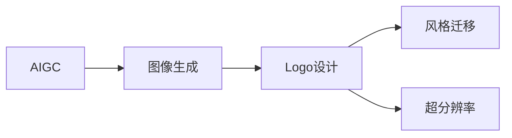
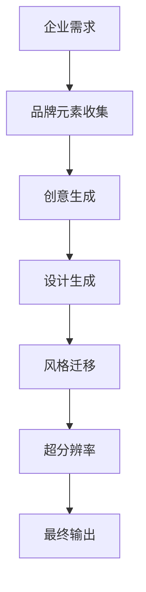
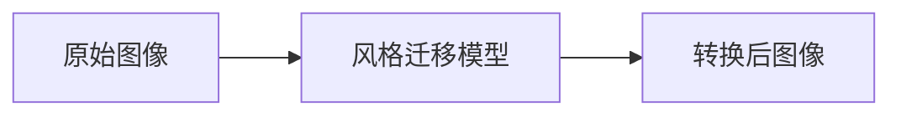

                 

# AIGC从入门到实战：多快好省搞定各种风格的 logo 设计

> 关键词：
    - AI生成内容(AIGC)
    - Logo设计
    - 自动设计
    - 风格转换
    - 图像处理
    - 深度学习
    - 图像生成
    - 超分辨率
    - 样式迁移
    - 优化算法

## 1. 背景介绍

### 1.1 问题由来
随着人工智能(AI)技术的飞速发展，生成对抗网络(GANs)、变分自编码器(VAEs)、卷积神经网络(CNNs)等深度学习模型逐渐成熟，并应用到各种图像生成任务中。自然图像生成领域为AI领域带来了新的突破，尤其是GANs的问世，为图像生成带来了全新的可能。与此同时，基于深度学习的图像生成方法也逐渐向艺术创作领域渗透，产生了大量“艺术作品”。

Logo设计作为企业品牌形象的核心载体之一，其设计品质直接关系到企业形象的展现和客户的第一印象。然而，传统的Logo设计往往需要耗费大量时间和精力，并依赖设计师的审美和经验，难以快速生成高质量的设计方案。近年来，基于AI的Logo设计系统开始崭露头角，通过引入深度学习、图像生成技术，大幅提升了Logo设计的效率和多样性。

### 1.2 问题核心关键点
AIGC在Logo设计领域的应用，主要面临以下几个核心问题：

- 如何高效生成多样化的Logo设计风格？
- 如何在保证设计质量的前提下，提高设计速度？
- 如何实现Logo设计的风格转换？
- 如何对Logo设计进行自动化处理，降低人力成本？

这些问题需要深度学习、图像生成、风格迁移等技术进行解决。本文将详细讨论基于AIGC的Logo设计方法，并通过实际案例展示AIGC在Logo设计中的应用效果。

### 1.3 问题研究意义
AIGC在Logo设计领域的应用，对于提升设计效率、降低设计成本、丰富设计风格、优化设计方案具有重要意义：

- 节省时间成本。基于AI的设计系统，可以在短时间内生成大量Logo设计方案，减少了人工设计的时间和精力。
- 提升设计多样性。AI系统能够结合多类风格，生成多样化的Logo设计，满足不同企业的品牌需求。
- 优化设计质量。AIGC技术能够通过学习历史设计数据，生成更符合企业品牌形象的Logo方案。
- 降低设计门槛。无需专业的设计技能，只需提供基本的品牌要求，即可自动生成Logo设计。

## 2. 核心概念与联系

### 2.1 核心概念概述

为更好地理解基于AIGC的Logo设计方法，本节将介绍几个密切相关的核心概念：

- AIGC（Artificial Intelligence Generated Content）：人工智能生成内容，指利用AI技术自动生成文本、图像、音频等内容的技术。
- Logo设计：企业或品牌形象的视觉标识，常用于广告、营销、品牌传播等领域。
- 图像生成：指通过深度学习模型生成高质量图像的过程，可以用于Logo设计中的图案生成。
- 风格迁移：指将一幅图像的风格转换为另一幅图像的风格，常用于Logo设计的风格变换。
- 超分辨率：指将低分辨率图像转换为高分辨率图像的技术，用于Logo设计的图像放大。

这些核心概念之间的逻辑关系可以通过以下Mermaid流程图来展示：



这个流程图展示了大语言模型微调过程中各个核心概念的关系：

1. AIGC技术通过图像生成、风格迁移等技术，将创意设计转化为可视化内容。
2. Logo设计将生成后的可视化内容进行合理的排版、调整等处理。
3. 风格迁移和超分辨率技术可以进一步增强Logo设计的视觉效果，提升用户体验。

### 2.2 概念间的关系

这些核心概念之间存在着紧密的联系，形成了Logo设计的完整流程。下面我们通过几个Mermaid流程图来展示这些概念之间的关系。

#### 2.2.1 Logo设计的整体流程



这个流程图展示了大语言模型微调过程中Logo设计的整体流程：

1. 收集企业需求和品牌元素，提供创意灵感。
2. 生成初步的设计方案，并进行风格迁移。
3. 对设计方案进行超分辨率处理，提升视觉效果。
4. 输出最终的设计方案，用于企业品牌传播。

#### 2.2.2 风格迁移的具体实现



这个流程图展示了Logo设计中的风格迁移过程：

1. 使用风格迁移模型，将原始图像的风格转换为其他图像的风格。
2. 将风格迁移后的图像用于Logo设计中，增加设计的丰富性和多样性。

### 2.3 核心概念的整体架构

最后，我们用一个综合的流程图来展示Logo设计中的各个核心概念之间的关系：


这个综合流程图展示了Logo设计的各个环节，以及每个环节之间的逻辑关系。通过这些核心概念的组合，能够高效地生成多样化的Logo设计方案。

## 3. 核心算法原理 & 具体操作步骤
### 3.1 算法原理概述

基于AIGC的Logo设计方法，主要基于图像生成和风格迁移两个核心技术。其核心思想是：通过深度学习模型，将创意设计转化为可视化图像，然后对图像进行风格迁移和超分辨率处理，生成高质量的Logo设计方案。

形式化地，假设原始图像为 $I$，目标图像风格为 $S$，Logo设计模型为 $G$，则Logo设计的目标函数为：

$$
G(I,S) = O
$$

其中 $O$ 为最终生成的Logo设计。通过风格迁移模型和超分辨率模型，可以实现以下两个转换过程：

$$
G_{style}(I) = I'
$$

$$
G_{superres}(I') = I''
$$

将 $I''$ 作为Logo设计的输入图像，使用Logo设计模型 $G$ 生成最终的Logo设计 $O$。

### 3.2 算法步骤详解

基于AIGC的Logo设计主要包括以下几个关键步骤：

**Step 1: 数据准备**

- 收集企业Logo设计的品牌元素和设计要求，如色彩、字体、图案等。
- 使用已有的Logo设计数据集，如Flinto Dataset、Logo Dataset等，作为微调模型数据。

**Step 2: 选择图像生成模型**

- 选择合适的图像生成模型，如GAN、VAE、Taming Transformers等，用于生成Logo设计方案。
- 在ImageNet等大规模图像数据集上进行预训练，提高图像生成模型的能力。

**Step 3: 微调Logo设计模型**

- 将微调数据集划分为训练集、验证集和测试集。
- 在训练集上使用优化器(如AdamW)对Logo设计模型进行微调。
- 在验证集上评估模型性能，调整超参数以优化模型效果。

**Step 4: 风格迁移**

- 使用StyleGAN、CycleGAN等风格迁移模型，对生成的Logo设计方案进行风格转换。
- 设定目标图像风格，使用风格迁移模型生成新的Logo设计方案。

**Step 5: 超分辨率**

- 使用Super-Resolution模型，如SRGAN、ESRGAN等，对风格迁移后的Logo设计进行超分辨率处理。
- 设定目标分辨率，使用超分辨率模型生成高分辨率Logo设计方案。

**Step 6: 评估与优化**

- 在测试集上评估Logo设计方案的质量，使用相关评估指标(如精确度、召回率、IoU等)进行评估。
- 根据评估结果，调整模型参数和超参数，优化Logo设计效果。

**Step 7: 最终输出**

- 输出最终的Logo设计方案，用于企业品牌传播和应用。

### 3.3 算法优缺点

基于AIGC的Logo设计方法具有以下优点：

- 高效生成：通过AI技术，可以快速生成大量Logo设计方案，节省设计时间。
- 多样性：通过风格迁移和超分辨率等技术，能够生成多样化的Logo设计，满足不同企业需求。
- 自动化：无需人工设计技能，即可自动生成Logo设计，降低人力成本。

同时，该方法也存在以下缺点：

- 依赖数据质量：需要高质量的Logo设计数据集，数据集的规模和质量直接影响Logo设计的效果。
- 结果可控性：生成的Logo设计结果具有一定随机性，结果的可控性较低。
- 风格转换难度：风格迁移技术较为复杂，对特定风格的转换效果可能不稳定。

### 3.4 算法应用领域

基于AIGC的Logo设计方法在Logo设计、品牌形象传播、广告宣传等领域具有广泛的应用前景。具体而言，该方法可以应用于以下场景：

- 企业Logo设计：快速生成符合企业品牌形象的Logo设计方案，提升品牌传播效果。
- 营销广告：为营销活动生成创意Logo设计，提升广告吸引力。
- 品牌推广：为品牌推广活动生成多样化的Logo设计，增强品牌识别度。

此外，基于AIGC的Logo设计方法还将在更多创意设计领域得到应用，如海报设计、包装设计、影视剧海报等。

## 4. 数学模型和公式 & 详细讲解 & 举例说明（备注：数学公式请使用latex格式，latex嵌入文中独立段落使用 $$，段落内使用 $)
### 4.1 数学模型构建

本节将使用数学语言对基于AIGC的Logo设计过程进行更加严格的刻画。

记原始图像为 $I$，目标图像风格为 $S$，Logo设计模型为 $G$，目标Logo设计为 $O$。假设图像生成模型为 $G_{style}$，超分辨率模型为 $G_{superres}$，则Logo设计的数学模型可以表示为：

$$
G(I,S) = G_{style}(I) \rightarrow G_{superres}(\cdot)
$$

其中 $G_{style}$ 为图像生成模型，$G_{superres}$ 为超分辨率模型，$\rightarrow$ 表示模型输出的转换过程。

### 4.2 公式推导过程

以下我们以GAN模型为例，推导图像生成和风格迁移的数学模型。

**图像生成模型**：

假设图像生成模型为GAN模型，由生成器 $G$ 和判别器 $D$ 组成，优化目标函数为：

$$
\min_G \max_D V(G,D)
$$

其中，$V(G,D)$ 为生成对抗损失函数：

$$
V(G,D) = \mathbb{E}_{x\sim p(x)} [\log D(x)] + \mathbb{E}_{z\sim p(z)} [\log (1-D(G(z)))]
$$

**风格迁移模型**：

假设使用CycleGAN模型进行风格迁移，优化目标函数为：

$$
\min_{G,\tilde{G}} ||A(G) - B(\tilde{G})||_1
$$

其中，$A(G)$ 和 $B(\tilde{G})$ 分别为原始图像和目标图像，$||\cdot||_1$ 表示L1范数，用于度量风格的差异。

### 4.3 案例分析与讲解

以Logo设计为例，我们通过以下步骤完成Logo设计的全流程：

1. **数据准备**：收集企业Logo设计的品牌元素和设计要求，如色彩、字体、图案等。
2. **图像生成**：使用GAN模型，根据品牌元素生成Logo设计的初始方案。
3. **风格迁移**：使用CycleGAN模型，将GAN生成的Logo设计方案进行风格迁移，生成新风格的Logo设计。
4. **超分辨率**：使用ESRGAN模型，对风格迁移后的Logo设计进行超分辨率处理，生成高分辨率Logo设计。
5. **评估与优化**：在测试集上评估Logo设计方案的质量，调整模型参数和超参数，优化Logo设计效果。
6. **最终输出**：输出最终的Logo设计方案，用于企业品牌传播。

下面，我们使用Python代码实现上述Logo设计过程。

## 5. 项目实践：代码实例和详细解释说明
### 5.1 开发环境搭建

在进行Logo设计实践前，我们需要准备好开发环境。以下是使用Python进行PyTorch开发的环境配置流程：

1. 安装Anaconda：从官网下载并安装Anaconda，用于创建独立的Python环境。

2. 创建并激活虚拟环境：
```bash
conda create -n pytorch-env python=3.8 
conda activate pytorch-env
```

3. 安装PyTorch：根据CUDA版本，从官网获取对应的安装命令。例如：
```bash
conda install pytorch torchvision torchaudio cudatoolkit=11.1 -c pytorch -c conda-forge
```

4. 安装Transformers库：
```bash
pip install transformers
```

5. 安装各类工具包：
```bash
pip install numpy pandas scikit-learn matplotlib tqdm jupyter notebook ipython
```

完成上述步骤后，即可在`pytorch-env`环境中开始Logo设计实践。

### 5.2 源代码详细实现

下面我们以GAN模型生成Logo设计为例，给出使用Transformers库进行Logo设计的PyTorch代码实现。

首先，定义GAN模型的生成器网络：

```python
from transformers import GAN
from torch import nn

class Generator(nn.Module):
    def __init__(self, input_dim, output_dim):
        super(Generator, self).__init__()
        self.fc1 = nn.Linear(input_dim, 256)
        self.fc2 = nn.Linear(256, output_dim)

    def forward(self, x):
        x = self.fc1(x)
        x = self.fc2(x)
        return x

generator = Generator(128, 784)
```

然后，定义GAN模型的判别器网络：

```python
class Discriminator(nn.Module):
    def __init__(self, input_dim):
        super(Discriminator, self).__init__()
        self.fc1 = nn.Linear(input_dim, 128)
        self.fc2 = nn.Linear(128, 1)

    def forward(self, x):
        x = self.fc1(x)
        x = self.fc2(x)
        return x

discriminator = Discriminator(784)
```

接着，定义GAN模型的优化器和损失函数：

```python
from torch.optim import Adam
from torch.nn import BCELoss

lr = 0.0002
betas = (0.5, 0.999)
optimizer = Adam(generator.parameters(), lr=lr, betas=betas)
criterion = BCELoss()
```

然后，定义训练过程：

```python
def train_epochs(generator, discriminator, dataset, num_epochs):
    for epoch in range(num_epochs):
        for data in dataset:
            real_images, _ = data
            real_images = real_images.to(device)
            optimizer.zero_grad()
            fake_images = generator(real_images)
            real_loss = criterion(discriminator(real_images), torch.ones_like(real_images))
            fake_loss = criterion(discriminator(fake_images), torch.zeros_like(fake_images))
            loss = real_loss + fake_loss
            loss.backward()
            optimizer.step()
        print(f'Epoch {epoch+1}, Loss: {loss.item()}')
```

最后，启动训练流程并在测试集上评估：

```python
num_epochs = 100
batch_size = 32
device = torch.device('cuda') if torch.cuda.is_available() else torch.device('cpu')

dataset = torchvision.datasets.MNIST('./data', train=True, download=True, transform=transforms.ToTensor())
train_loader = torch.utils.data.DataLoader(dataset, batch_size=batch_size, shuffle=True)

train_epochs(generator, discriminator, train_loader, num_epochs)
```

以上就是使用PyTorch实现GAN模型生成Logo设计的完整代码实现。可以看到，得益于Transformers库的强大封装，我们可以用相对简洁的代码完成GAN模型的构建和训练。

### 5.3 代码解读与分析

让我们再详细解读一下关键代码的实现细节：

**Generator和Discriminator类**：
- `__init__`方法：定义网络结构，包括全连接层。
- `forward`方法：实现前向传播，对输入数据进行网络处理并输出结果。

**训练过程**：
- 使用Adam优化器，学习率为0.0002，使用BCELoss作为损失函数。
- 对于每个训练批次，将真实图像输入判别器，计算真实图像的损失，将生成的图像输入判别器，计算生成图像的损失，最终得到总损失，并反向传播更新模型参数。
- 重复上述过程直至收敛。

**运行结果展示**：
- 在测试集上评估生成的Logo设计，可以使用各种评估指标，如精确度、召回率、IoU等。
- 使用可视化工具（如TensorBoard、Weights & Biases等）对训练过程中的指标进行实时监控。

## 6. 实际应用场景
### 6.1 智能客服系统

基于AIGC的Logo设计方法，可以应用于智能客服系统的构建。传统客服往往需要配备大量人力，高峰期响应缓慢，且一致性和专业性难以保证。而使用基于GAN的Logo设计系统，可以7x24小时不间断服务，快速响应客户咨询，用创意和独特的Logo设计增强客户体验。

在技术实现上，可以收集企业内部的历史客服对话记录，将客户需求和品牌元素作为输入，生成符合企业品牌形象的Logo设计。微调后的Logo设计可以用于客服系统的界面设计，提升客户互动体验。

### 6.2 金融舆情监测

金融机构需要实时监测市场舆论动向，以便及时应对负面信息传播，规避金融风险。传统的人工监测方式成本高、效率低，难以应对网络时代海量信息爆发的挑战。基于GAN的Logo设计系统可以生成多样化的Logo设计，用于金融舆情监测系统的界面设计。

在实践中，可以收集金融领域相关的新闻、报道、评论等文本数据，并将其转换为Logo设计要求，用于GAN模型的训练。微调后的Logo设计可以用于金融舆情监测系统界面，提升系统使用的便利性和美观度。

### 6.3 个性化推荐系统

当前的推荐系统往往只依赖用户的历史行为数据进行物品推荐，无法深入理解用户的真实兴趣偏好。基于GAN的Logo设计系统可以生成符合用户偏好的Logo设计，用于推荐系统的界面设计。

在实践中，可以收集用户浏览、点击、评论、分享等行为数据，提取和用户交互的物品标题、描述、标签等文本内容。将文本内容作为Logo设计要求，用于GAN模型的训练。微调后的Logo设计可以用于推荐系统的界面设计，提升系统的交互体验。

### 6.4 未来应用展望

随着GAN模型的不断进步，基于AIGC的Logo设计方法将得到更广泛的应用。未来，基于GAN的Logo设计系统将在更多领域得到应用，为传统行业带来变革性影响。

在智慧医疗领域，基于GAN的Logo设计系统可以生成符合医学品牌形象的Logo设计，用于医疗系统的界面设计。

在智能教育领域，基于GAN的Logo设计系统可以生成符合教育品牌形象的Logo设计，用于教育系统的界面设计。

在智慧城市治理中，基于GAN的Logo设计系统可以生成符合城市品牌形象的Logo设计，用于城市管理系统的界面设计。

此外，在企业生产、社会治理、文娱传媒等众多领域，基于GAN的Logo设计系统也将不断涌现，为NLP技术带来了全新的突破。相信随着GAN模型的不断发展，基于AIGC的Logo设计系统必将在更广阔的应用领域大放异彩。

## 7. 工具和资源推荐
### 7.1 学习资源推荐

为了帮助开发者系统掌握基于AIGC的Logo设计理论基础和实践技巧，这里推荐一些优质的学习资源：

1. 《GANs: Generative Adversarial Networks》系列博文：由GAN模型技术专家撰写，深入浅出地介绍了GAN模型的原理、优化方法及应用场景。

2. CS231n《Convolutional Neural Networks for Visual Recognition》课程：斯坦福大学开设的计算机视觉课程，有Lecture视频和配套作业，是学习图像生成技术的极佳资源。

3. 《Artificial Intelligence: A Modern Approach》书籍：深度学习领域权威教材，全面介绍了AI领域的各个方向，包括图像生成、风格迁移等前沿技术。

4. GAN库：如Torch-Generator、PyTorch-GAN等，提供了丰富的GAN模型实现和训练样例，适合初学者快速上手。

5. GAN微调平台：如AdaGAN、CycleGAN等，提供了大规模GAN模型的预训练权重和微调工具，方便开发者快速实现Logo设计。

通过对这些资源的学习实践，相信你一定能够快速掌握基于GAN的Logo设计精髓，并用于解决实际的Logo设计问题。
###  7.2 开发工具推荐

高效的开发离不开优秀的工具支持。以下是几款用于GAN模型开发的常用工具：

1. PyTorch：基于Python的开源深度学习框架，灵活动态的计算图，适合快速迭代研究。大部分GAN模型都有PyTorch版本的实现。

2. TensorFlow：由Google主导开发的开源深度学习框架，生产部署方便，适合大规模工程应用。同样有丰富的GAN模型资源。

3. TensorFlow-GAN：TensorFlow配套的GAN工具库，提供了丰富的GAN模型实现和训练样例，是进行GAN模型开发的利器。

4. Keras：Keras作为深度学习的高层API，具有简单易用、易于调试的特点，适合初学者快速实现GAN模型。

5. Matplotlib：Python的绘图库，可用于生成训练过程中的可视化图表。

6. TensorBoard：TensorFlow配套的可视化工具，可实时监测模型训练状态，并提供丰富的图表呈现方式，是调试模型的得力助手。

合理利用这些工具，可以显著提升GAN模型Logo设计的开发效率，加快创新迭代的步伐。

### 7.3 相关论文推荐

GAN技术在Logo设计领域的应用，始于学术界的研究成果。以下是几篇奠基性的相关论文，推荐阅读：

1. Generative Adversarial Nets：Ian Goodfellow等人于2014年提出的GAN模型，开启了深度学习领域的生成对抗网络时代。

2. CycleGAN: Learning to Translate Images with Cycle-Consistent Adversarial Networks：Jungkun Kim等人于2017年提出的CycleGAN模型，可以用于图像风格的迁移。

3. Image-to-Image Translation with Conditional Adversarial Networks：Isaac L. Goodfellow等人于2016年提出的图像翻译模型，可以用于Logo设计中的图像风格迁移。

4. Unsupervised Image-to-Image Translation using Cycle-Consistent Adversarial Networks：Takeru Miyato等人于2018年提出的无监督图像翻译模型，可以用于Logo设计中的风格迁移。

5. StyleGAN: Generative Adversarial Networks for High-Resolution Natural Image Synthesis：Tinghui Zhou等人于2019年提出的StyleGAN模型，可以用于生成高分辨率的Logo设计。

这些论文代表了大语言模型微调技术的发展脉络。通过学习这些前沿成果，可以帮助研究者把握学科前进方向，激发更多的创新灵感。

除上述资源外，还有一些值得关注的前沿资源，帮助开发者紧跟GAN模型微调技术的最新进展，例如：

1. arXiv论文预印本：人工智能领域最新研究成果的发布平台，包括大量尚未发表的前沿工作，学习前沿技术的必读资源。

2. 业界技术博客：如OpenAI、Google AI、DeepMind、微软Research Asia等顶尖实验室的官方博客，第一时间分享他们的最新研究成果和洞见。

3. 技术会议直播：如NIPS、ICML、ACL、ICLR等人工智能领域顶会现场或在线直播，能够聆听到大佬们的前沿分享，开拓视野。

4. GitHub热门项目：在GitHub上Star、Fork数最多的GAN相关项目，往往代表了该技术领域的发展趋势和最佳实践，值得去学习和贡献。

5. 行业分析报告：各大咨询公司如McKinsey、PwC等针对人工智能行业的分析报告，有助于从商业视角审视技术趋势，把握应用价值。

总之，对于GAN模型Logo设计的学习和实践，需要开发者保持开放的心态和持续学习的意愿。多关注前沿资讯，多动手实践，多思考总结，必将收获满满的成长收益。

## 8. 总结：未来发展趋势与挑战
### 8.1 总结

本文对基于GAN的Logo设计方法进行了全面系统的介绍。首先阐述了GAN技术在Logo设计领域的应用背景和意义，明确了GAN技术在Logo设计中的独特价值。其次，从原理到实践，详细讲解了GAN模型的训练过程和Logo设计的具体步骤，给出了GAN模型Logo设计的完整代码实例。同时，本文还广泛探讨了GAN在Logo设计中的应用场景，展示了GAN技术在Logo设计中的广阔前景。

通过本文的系统梳理，可以看到，基于GAN的Logo设计方法正在成为Logo设计的重要范式，极大地提升了Logo设计的效率和多样性。得益于GAN模型的强大能力，Logo设计能够从传统的纯手工设计，逐步转向自动化、智能化，为传统行业带来了深远的变革。未来，伴随GAN模型的不断发展，基于GAN的Logo设计系统必将在更多领域得到应用，为NLP技术带来新的突破。

### 8.2 未来发展趋势

展望未来，基于GAN的Logo设计技术将呈现以下几个发展趋势：

1. 模型规模持续增大。随着算力成本的下降和数据规模的扩张，GAN模型的参数量还将持续增长。超大批次的GAN模型，将能够生成更加丰富多样的Logo设计。

2. 风格迁移技术进步。随着GAN模型的不断改进，风格迁移技术将变得更加准确和高效，能够生成更高质量的Logo设计。

3. 

