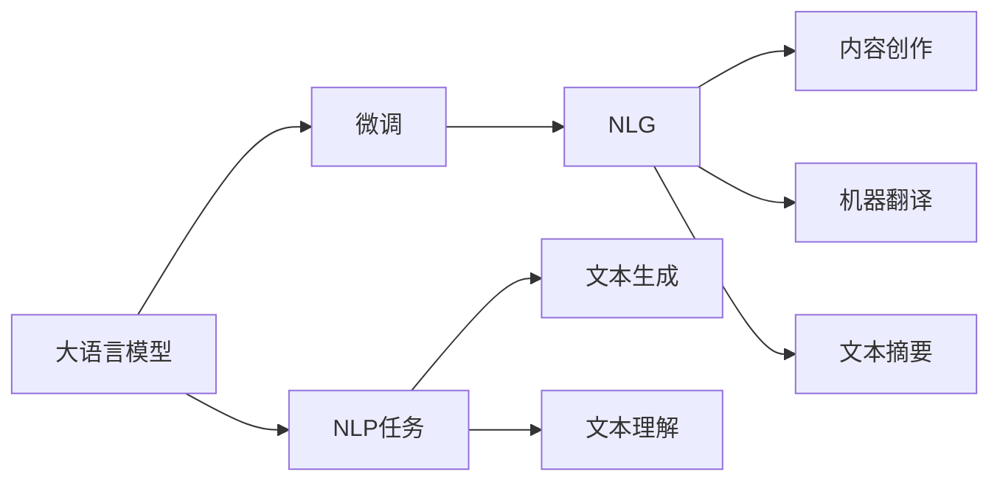

                 

# AIGC从入门到实战：如何向 ChatGPT 提问以获得高质量答案

## 1. 背景介绍

随着人工智能（AI）技术的飞速发展，生成式人工智能（AIGC，Generative AI）成为了当前最热门的技术之一。ChatGPT作为OpenAI推出的最新一代大语言模型，以其卓越的生成能力和广泛的应用场景，迅速吸引了全球的关注和应用。无论是研究机构、企业还是个人开发者，都希望能够熟练使用ChatGPT，利用其强大的知识库和生成能力，解决实际问题。然而，ChatGPT的功能强大，但也存在一定的局限性，特别是在如何提出有效的问题以获得高质量答案方面，仍需要一定的技巧和方法。本文旨在帮助读者从入门到实战，掌握如何高效利用ChatGPT，提出高质问题并获取理想答案。

## 2. 核心概念与联系

### 2.1 核心概念概述

在探讨如何利用ChatGPT之前，我们首先需要了解一些核心概念：

- **大语言模型（LLM）**：如GPT、BERT等，基于Transformer架构，通过大规模无标签数据预训练，学习到丰富的语言表示。
- **自然语言处理（NLP）**：研究如何让计算机理解和处理人类语言，包括语义理解、语言生成等任务。
- **生成式AI**：通过模型生成文本、图像、音乐等，提供创新的解决方案，推动各行各业的智能化转型。
- **自然语言生成（NLG）**：利用大语言模型，自动生成自然流畅的文本，解决机器翻译、文本摘要、内容创作等任务。
- **模型微调（Fine-tuning）**：在预训练基础上，通过少量标注数据，优化模型在某特定任务上的性能。

这些概念之间紧密关联，共同构成了AIGC的核心框架。其中，大语言模型是基础，通过微调等技术，应用于各种NLP任务，最终实现自然语言生成和理解。

### 2.2 概念间的关系

下图展示了核心概念之间的联系：



大语言模型通过微调，应用于各种NLP任务，包括文本生成和理解。微调后的模型能够更好地适应特定任务，生成自然流畅的文本，解决了诸如机器翻译、文本摘要、内容创作等NLP问题。

## 3. 核心算法原理 & 具体操作步骤

### 3.1 算法原理概述

ChatGPT基于Transformer架构，采用深度学习技术，通过大规模数据预训练和微调，具备了强大的自然语言生成和理解能力。其核心算法包括自回归（Auto-Regressive）生成和注意力机制（Attention Mechanism）。自回归生成使得模型能够从前文预测后文，生成连贯的文本；注意力机制则使得模型能够捕捉上下文信息，理解文本的语义。

### 3.2 算法步骤详解

1. **数据准备**：首先需要收集和整理问题相关的文本数据，包括问题的描述、背景信息和期望的答案格式等。
2. **模型选择**：根据任务类型和数据规模，选择合适的预训练模型，如GPT-3、GPT-4等。
3. **微调**：使用少量标注数据，对模型进行微调，优化其在特定任务上的性能。
4. **输入构造**：将问题转换为模型的输入格式，包括问题的描述、上下文信息等。
5. **输出解释**：根据模型输出，结合上下文信息，理解和解释答案。

### 3.3 算法优缺点

ChatGPT的优势在于其强大的知识库和生成能力，能够生成流畅、连贯的文本，且对于各种主题都有所涉猎。但同时，也存在一些局限性：

- **过拟合风险**：在特定领域或数据集上，模型可能出现过拟合，导致生成答案偏颇。
- **泛化能力有限**：模型在处理新颖、复杂的任务时，可能表现不佳。
- **输出质量不稳定**：不同输入和参数设置下，生成的答案质量可能有所波动。
- **无法处理复杂推理**：对于需要多步推理或逻辑判断的任务，可能无法提供准确答案。

### 3.4 算法应用领域

ChatGPT在多个领域都有广泛应用，包括但不限于：

- **内容创作**：自动生成文章、小说、博客等文本内容，提高创作效率。
- **教育培训**：提供个性化的学习资源，包括问题解答、作业批改等。
- **客户服务**：自动化客服机器人，快速响应客户咨询，提升用户体验。
- **市场研究**：自动化生成市场分析报告、客户需求调查等，辅助企业决策。
- **创意设计**：自动生成设计方案、广告文案等，推动创意产业创新。

## 4. 数学模型和公式 & 详细讲解 & 举例说明

### 4.1 数学模型构建

ChatGPT的生成过程可以表示为：

$$
p(x|y) = \prod_{i=1}^n p(x_i|x_{<i},y)
$$

其中 $x$ 为生成的文本序列，$y$ 为上下文信息，$p(x_i|x_{<i},y)$ 为给定前文和上下文信息，生成下一个文本的概率。

### 4.2 公式推导过程

以生成单个文本为例，其概率可以表示为：

$$
p(x_i|x_{<i},y) = \frac{\exp(\log p(x_i|x_{<i},y))}{\sum_{x_i} \exp(\log p(x_i|x_{<i},y))}
$$

其中，$\log p(x_i|x_{<i},y)$ 为模型的条件概率计算公式，$x_i$ 为生成的第 $i$ 个文本。

### 4.3 案例分析与讲解

假设我们需要生成一段关于“如何优化网站SEO”的文本，可以按照以下步骤操作：

1. **数据准备**：收集关于SEO的各类资料，包括关键词、优化策略、成功案例等。
2. **模型选择**：选择GPT-3或GPT-4模型，利用大规模数据进行预训练和微调。
3. **输入构造**：输入“如何优化网站SEO”的描述，并说明期望的答案格式为“步骤指南”。
4. **模型生成**：输入问题到ChatGPT，等待模型输出。
5. **输出解释**：根据输出结果，结合上下文信息，理解并解释答案。

## 5. 项目实践：代码实例和详细解释说明

### 5.1 开发环境搭建

首先，我们需要安装OpenAI的API密钥，并使用Python代码与ChatGPT进行交互。

```python
import openai

openai.api_key = 'your_api_key'
```

### 5.2 源代码详细实现

```python
import openai

def generate_answer(prompt):
    response = openai.Completion.create(
        engine="text-davinci-003",
        prompt=prompt,
        max_tokens=100
    )
    return response.choices[0].text

if __name__ == '__main__':
    prompt = "如何优化网站SEO"
    answer = generate_answer(prompt)
    print(answer)
```

### 5.3 代码解读与分析

上述代码中，我们使用了OpenAI的API接口，通过`Completion.create`方法生成文本。`engine`参数指定了使用的模型，`prompt`为输入的提示信息，`max_tokens`为期望生成的文本长度。

### 5.4 运行结果展示

执行上述代码，可以得到关于“如何优化网站SEO”的详细指南。

```
优化网站SEO的指南：

1. 关键词优化：选择相关关键词，并确保关键词密度合理，避免过度优化。
2. 内容优化：创建高质量、原创的内容，确保内容与关键词高度相关。
3. 页面结构优化：优化页面结构和代码，提高页面加载速度和用户体验。
4. 内部链接优化：增加内部链接，提高网站的页面互连性。
5. 外部链接优化：获取高质量的外部链接，提高网站的权威性和权重。
```

## 6. 实际应用场景

### 6.1 内容创作

ChatGPT能够自动生成各种类型的内容，包括文章、博客、广告文案等，大大提升了创作效率。

### 6.2 教育培训

ChatGPT可以提供个性化的学习资源，如解答问题、生成作业等，帮助学生更好地掌握知识。

### 6.3 客户服务

自动化的客服机器人可以24小时在线，快速响应客户咨询，提高客户满意度。

### 6.4 未来应用展望

未来，ChatGPT在各个领域的应用将更加广泛，推动社会生产力和生活水平的提升。

## 7. 工具和资源推荐

### 7.1 学习资源推荐

- 《生成式人工智能：原理与实践》：详细介绍了生成式AI的技术原理和应用场景。
- 《深度学习与自然语言处理》：介绍了自然语言处理的基本概念和核心算法。
- Coursera、edX等在线课程：提供丰富的生成式AI学习资源，帮助初学者快速入门。

### 7.2 开发工具推荐

- Python：常用的生成式AI开发语言，支持丰富的第三方库和框架。
- OpenAI API：提供了与ChatGPT进行交互的接口，支持文本生成和推理。
- Jupyter Notebook：支持代码和注释的交互式开发环境。

### 7.3 相关论文推荐

- "Transformers are Generative"：提出自回归生成模型的理论基础。
- "Attention is All You Need"：提出注意力机制，改进Transformer的生成能力。
- "Language Models are Unsupervised Multitask Learners"：展示大语言模型的零样本学习能力。

## 8. 总结：未来发展趋势与挑战

### 8.1 研究成果总结

本文详细介绍了ChatGPT的基本原理和操作步骤，并通过实例展示了如何高效利用ChatGPT生成高质量答案。ChatGPT已经在多个领域展示了强大的应用潜力，推动了自然语言处理和生成式AI技术的发展。

### 8.2 未来发展趋势

未来，生成式AI将进一步深入各个行业，推动智能化转型和创新。ChatGPT也将不断迭代升级，具备更加强大的生成和理解能力，解决更多复杂问题。

### 8.3 面临的挑战

虽然ChatGPT在生成文本方面表现优异，但仍面临一些挑战：

- **数据隐私和伦理**：生成的内容可能涉及隐私和伦理问题，需要加强监管。
- **生成质量**：生成的文本可能存在语法错误或逻辑问题，需要进一步提升质量。
- **广泛应用**：在特定领域或场景，模型可能表现不佳，需要针对性地优化。

### 8.4 研究展望

未来，需要进一步提升ChatGPT的生成质量，解决隐私和伦理问题，推动生成式AI的广泛应用。同时，需要加强多模态AI技术的研究，提高模型在图像、语音等多模态数据上的处理能力。

## 9. 附录：常见问题与解答

**Q1：ChatGPT可以生成所有问题的答案吗？**

A: 尽管ChatGPT在生成文本方面表现优异，但仍存在一些局限性。对于一些需要专业知识或复杂推理的问题，可能无法生成理想答案。

**Q2：如何避免生成的文本质量波动？**

A: 可以通过多次迭代生成，选择质量较高的答案；或者结合上下文信息，优化输入提示。

**Q3：如何提高生成的文本质量？**

A: 可以通过调整输入提示、调整模型参数、增加训练数据等方式，提高生成文本的质量和准确性。

**Q4：ChatGPT在生成文本时，如何处理不确定性？**

A: 可以通过引入噪声、增加上下文信息等方式，处理生成文本中的不确定性，提高生成的稳定性。

**Q5：ChatGPT在多轮对话中，如何保持一致性？**

A: 可以通过设置上下文信息和记忆机制，保持多轮对话的一致性和连贯性。

---

作者：禅与计算机程序设计艺术 / Zen and the Art of Computer Programming

