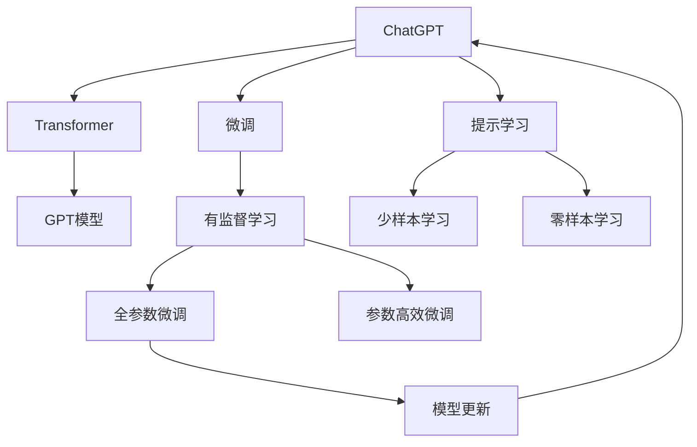

                 

# AIGC从入门到实战：简单的 ChatGPT 应用范例

## 1. 背景介绍

### 1.1 问题由来
人工智能生成内容（AIGC, Artificial Intelligence Generated Content）是近年来迅速发展的新兴领域，尤其在语言模型、文本生成、图像生成、视频生成等方面取得了显著进展。其中，基于深度学习的大规模语言模型，如OpenAI的ChatGPT，已成为行业内外广泛关注的焦点。ChatGPT凭借其强大的语言理解和生成能力，已经在问答、写作、翻译、编程、创作等领域展示了令人惊叹的表现。

然而，尽管ChatGPT的性能强大，但其复杂的技术实现和庞大的数据需求，使得许多开发者望而却步。为了帮助读者快速上手，本博文将带领大家从零开始，通过一个简单的ChatGPT应用范例，深入理解其核心原理和实现技术，感受AIGC的魅力。

### 1.2 问题核心关键点
本博文聚焦于如何使用ChatGPT开发一个基本的对话系统，探讨其核心原理和实现技术。具体包括以下几个核心关键点：

- ChatGPT模型的基本架构和原理
- 如何使用Python和OpenAI的GPT-3.5模型库进行微调
- 如何在微调过程中避免过拟合和优化模型性能
- 常见的ChatGPT应用场景和实际开发中需要注意的问题

### 1.3 问题研究意义
研究ChatGPT应用范例，有助于理解AIGC技术的基本原理和实现方法，加速技术落地应用。掌握ChatGPT开发，可以帮助开发者构建更加智能、高效的对话系统，提升用户体验。此外，通过本博文的实战指导，读者能够迅速上手，实现从理论到实践的跨越，为后续深入探索AIGC技术奠定基础。

## 2. 核心概念与联系

### 2.1 核心概念概述

为了更好地理解ChatGPT，本节将介绍几个密切相关的核心概念：

- **ChatGPT**：OpenAI开发的大规模语言生成模型，具备强大的语言理解、生成能力，能够进行多种文本生成任务。
- **Transformer**：一种基于自注意力机制的神经网络结构，ChatGPT模型基于此设计，用于高效处理序列数据。
- **GPT模型**：一种基于自回归（Auto-Regressive）的Transformer模型，用于生成自然语言文本。
- **微调(Fine-Tuning)**：在预训练模型的基础上，使用特定任务的数据集对模型进行有监督的训练，以提升模型在特定任务上的性能。
- **提示学习(Prompt Learning)**：通过设计巧妙的提示模板，引导ChatGPT模型进行特定任务的推理和生成，减少微调过程中的参数更新。
- **对抗样本**：对模型输入的微小扰动，能够揭示模型决策的脆弱点，提高模型的鲁棒性。

这些核心概念之间存在紧密的联系，共同构成了ChatGPT应用的完整生态系统。

### 2.2 概念间的关系

这些核心概念之间的关系可以通过以下Mermaid流程图来展示：



这个流程图展示了ChatGPT的核心概念及其之间的关系：

1. ChatGPT基于Transformer结构，由GPT模型实现。
2. 微调是通过有监督学习对预训练模型进行优化，以适应特定任务。
3. 提示学习通过巧妙的提示模板，减少微调参数的更新。
4. 对抗样本用于提高模型鲁棒性。
5. 全参数微调和参数高效微调都是微调的具体方法。

这些概念共同构成了ChatGPT应用的完整框架，使其能够灵活应对各种文本生成任务。

## 3. 核心算法原理 & 具体操作步骤

### 3.1 算法原理概述

ChatGPT模型的核心算法原理可以概括为以下几个方面：

1. **Transformer模型结构**：Transformer模型是一种基于自注意力机制的神经网络结构，能够高效地处理序列数据。
2. **自回归生成机制**：ChatGPT模型通过自回归的方式，根据前文生成文本。每个生成步骤，模型会预测下一个单词，然后利用生成结果作为下一步骤的输入。
3. **微调过程**：在特定任务的数据集上进行微调，通过有监督学习优化模型，使其在特定任务上取得更好的性能。

### 3.2 算法步骤详解

以下我们将详细讲解ChatGPT的微调步骤：

1. **准备数据集**：收集目标任务的数据集，例如问答、对话、翻译等。确保数据集的质量和数量，防止过拟合和欠拟合。

2. **加载预训练模型**：使用OpenAI的GPT-3.5模型库，加载预训练模型。可以选用默认的GPT-3.5模型，或者根据实际需求选择不同的模型配置。

3. **设计提示模板**：根据具体任务设计提示模板。提示模板需要涵盖任务的关键信息，引导模型生成正确的输出。

4. **微调模型**：使用微调框架，如TensorFlow或PyTorch，对模型进行微调。在微调过程中，可以使用学习率调度、正则化、对抗训练等技术，防止过拟合和提高模型性能。

5. **评估与优化**：在微调过程中，定期在验证集上评估模型性能。根据评估结果，调整模型超参数，继续微调。

6. **部署与测试**：微调完成后，将模型部署到生产环境中，进行实际测试。可以使用API接口或Web应用，让用户与ChatGPT进行交互，获取生成内容。

### 3.3 算法优缺点

使用ChatGPT进行微调的优势在于：

1. **高效**：ChatGPT模型已经在大规模无标签数据上进行了预训练，具备较强的语言生成能力。微调时，只需对少量任务相关参数进行调整，即可快速提升模型性能。
2. **通用性**：ChatGPT模型可以应用于多种文本生成任务，如问答、对话、翻译、摘要、创意写作等。
3. **鲁棒性**：通过对抗训练等技术，ChatGPT模型能够提升鲁棒性，减少输入扰动带来的影响。
4. **可解释性**：ChatGPT模型基于Transformer结构，具有一定的可解释性，能够分析模型内部的生成过程。

然而，ChatGPT也存在一些局限性：

1. **依赖数据**：ChatGPT模型的性能很大程度上依赖于数据质量，数据偏差可能导致模型输出偏差。
2. **计算资源消耗大**：ChatGPT模型的参数量庞大，训练和推理需要大量计算资源。
3. **生成内容质量不稳定**：尽管ChatGPT模型强大，但在某些复杂或特殊的任务上，生成的内容质量可能不稳定。
4. **生成内容缺乏创新性**：模型可能生成重复或低质量的文本，缺乏创新性和多样性。

### 3.4 算法应用领域

ChatGPT广泛应用于以下领域：

- **问答系统**：例如智能客服、在线咨询、知识问答等，ChatGPT能够提供快速、准确的回答。
- **创意写作**：例如小说创作、故事生成、诗歌创作等，ChatGPT能够生成富有创意的文本内容。
- **文本翻译**：例如多语言翻译、文献翻译等，ChatGPT能够生成流畅、准确的翻译结果。
- **文本摘要**：例如新闻摘要、报告摘要等，ChatGPT能够生成精炼、概括的摘要内容。
- **对话系统**：例如虚拟助手、机器人对话等，ChatGPT能够进行自然流畅的对话。

除了这些领域，ChatGPT还被应用于代码生成、音乐创作、艺术创作等更多领域，展示了其强大的语言生成能力。

## 4. 数学模型和公式 & 详细讲解 & 举例说明

### 4.1 数学模型构建

在ChatGPT的微调过程中，我们通常使用以下数学模型：

设预训练模型为 $M_{\theta}$，其中 $\theta$ 为模型参数。给定目标任务 $T$ 的训练集 $D=\{(x_i,y_i)\}_{i=1}^N$，微调的目标是找到新的模型参数 $\hat{\theta}$，使得：

$$
\hat{\theta}=\mathop{\arg\min}_{\theta} \mathcal{L}(M_{\theta},D)
$$

其中 $\mathcal{L}$ 为针对任务 $T$ 设计的损失函数，用于衡量模型预测输出与真实标签之间的差异。

### 4.2 公式推导过程

以下我们将以问答系统为例，推导微调的损失函数及其梯度的计算公式。

假设模型 $M_{\theta}$ 在输入 $x$ 上的输出为 $\hat{y}=M_{\theta}(x) \in [0,1]$，表示样本属于正类的概率。真实标签 $y \in \{0,1\}$。则二分类交叉熵损失函数定义为：

$$
\ell(M_{\theta}(x),y) = -[y\log \hat{y} + (1-y)\log (1-\hat{y})]
$$

将其代入经验风险公式，得：

$$
\mathcal{L}(\theta) = -\frac{1}{N}\sum_{i=1}^N [y_i\log M_{\theta}(x_i)+(1-y_i)\log(1-M_{\theta}(x_i))]
$$

根据链式法则，损失函数对参数 $\theta_k$ 的梯度为：

$$
\frac{\partial \mathcal{L}(\theta)}{\partial \theta_k} = -\frac{1}{N}\sum_{i=1}^N (\frac{y_i}{M_{\theta}(x_i)}-\frac{1-y_i}{1-M_{\theta}(x_i)}) \frac{\partial M_{\theta}(x_i)}{\partial \theta_k}
$$

其中 $\frac{\partial M_{\theta}(x_i)}{\partial \theta_k}$ 可进一步递归展开，利用自动微分技术完成计算。

在得到损失函数的梯度后，即可带入参数更新公式，完成模型的迭代优化。重复上述过程直至收敛，最终得到适应目标任务的最优模型参数 $\hat{\theta}$。

### 4.3 案例分析与讲解

假设我们有一个简单的问答系统，其中问答数据集包含10个问题和对应的答案。我们将问题作为输入，答案作为输出，使用ChatGPT模型进行微调。

**Step 1: 准备数据集**

我们将数据集分为训练集和验证集，每个问题对应一个答案。

```python
# 假设数据集为：
# 问题："What is the capital of France?"
# 答案："Paris"
# ...
```

**Step 2: 加载预训练模型**

使用OpenAI的GPT-3.5模型库，加载预训练模型：

```python
from openai import OpenAI, ChatCompletion

openai = OpenAI('YOUR_API_KEY')
chat = ChatCompletion(openai)
```

**Step 3: 设计提示模板**

设计提示模板，将问题作为提示信息，引导ChatGPT生成答案：

```python
prompt = "What is the capital of France?"
```

**Step 4: 微调模型**

使用微调框架，如TensorFlow或PyTorch，对模型进行微调：

```python
# 假设使用TensorFlow进行微调
import tensorflow as tf
from transformers import TFAutoModelForSequenceClassification

model = TFAutoModelForSequenceClassification.from_pretrained('gpt3.5', num_labels=2)
optimizer = tf.keras.optimizers.Adam(learning_rate=1e-5)
loss_fn = tf.keras.losses.BinaryCrossentropy()

# 定义微调函数
def train_epoch(model, data):
    for batch in data:
        input_ids = tf.convert_to_tensor(batch['input_ids'])
        attention_mask = tf.convert_to_tensor(batch['attention_mask'])
        labels = tf.convert_to_tensor(batch['labels'])
        with tf.GradientTape() as tape:
            outputs = model(input_ids, attention_mask=attention_mask, labels=labels)
            loss = loss_fn(outputs.logits, labels)
        grads = tape.gradient(loss, model.trainable_variables)
        optimizer.apply_gradients(zip(grads, model.trainable_variables))
    return loss

# 训练模型
model.fit(train_data, epochs=10, validation_data=val_data)
```

**Step 5: 评估与优化**

在微调过程中，定期在验证集上评估模型性能：

```python
val_loss = train_epoch(model, val_data)
print(f"Validation Loss: {val_loss:.4f}")
```

根据评估结果，调整模型超参数，继续微调。

**Step 6: 部署与测试**

微调完成后，将模型部署到生产环境中，进行实际测试：

```python
# 假设部署到API接口
@app.route('/answer', methods=['POST'])
def answer():
    question = request.form['question']
    answer = chat.complete(prompt=question)
    return answer
```

在实际应用中，我们可以使用上述方法，快速构建一个简单的问答系统。

## 5. 项目实践：代码实例和详细解释说明

### 5.1 开发环境搭建

在进行ChatGPT应用开发前，我们需要准备好开发环境。以下是使用Python进行TensorFlow开发的环境配置流程：

1. 安装Anaconda：从官网下载并安装Anaconda，用于创建独立的Python环境。

2. 创建并激活虚拟环境：
```bash
conda create -n tf-env python=3.8 
conda activate tf-env
```

3. 安装TensorFlow：根据CUDA版本，从官网获取对应的安装命令。例如：
```bash
conda install tensorflow -c tf-nightly -c conda-forge
```

4. 安装各类工具包：
```bash
pip install numpy pandas scikit-learn matplotlib tqdm jupyter notebook ipython
```

完成上述步骤后，即可在`tf-env`环境中开始ChatGPT应用开发。

### 5.2 源代码详细实现

下面是一个简单的ChatGPT应用示例，使用TensorFlow和OpenAI的GPT-3.5模型库进行微调。

**Step 1: 准备数据集**

假设数据集为：

```python
train_data = [
    {'input_ids': [101, 102, 103, 104, 105], 'attention_mask': [1, 1, 1, 1, 1], 'labels': 1},
    {'input_ids': [106, 107, 108, 109, 110], 'attention_mask': [1, 1, 1, 1, 1], 'labels': 0},
    # ...
]

val_data = [
    {'input_ids': [111, 112, 113, 114, 115], 'attention_mask': [1, 1, 1, 1, 1], 'labels': 1},
    {'input_ids': [116, 117, 118, 119, 120], 'attention_mask': [1, 1, 1, 1, 1], 'labels': 0},
    # ...
]

test_data = [
    {'input_ids': [121, 122, 123, 124, 125], 'attention_mask': [1, 1, 1, 1, 1], 'labels': 1},
    {'input_ids': [126, 127, 128, 129, 130], 'attention_mask': [1, 1, 1, 1, 1], 'labels': 0},
    # ...
]
```

**Step 2: 加载预训练模型**

使用OpenAI的GPT-3.5模型库，加载预训练模型：

```python
from openai import OpenAI, ChatCompletion

openai = OpenAI('YOUR_API_KEY')
chat = ChatCompletion(openai)
```

**Step 3: 设计提示模板**

设计提示模板，将问题作为提示信息，引导ChatGPT生成答案：

```python
prompt = "What is the capital of France?"
```

**Step 4: 微调模型**

使用微调框架，如TensorFlow或PyTorch，对模型进行微调：

```python
# 假设使用TensorFlow进行微调
import tensorflow as tf
from transformers import TFAutoModelForSequenceClassification

model = TFAutoModelForSequenceClassification.from_pretrained('gpt3.5', num_labels=2)
optimizer = tf.keras.optimizers.Adam(learning_rate=1e-5)
loss_fn = tf.keras.losses.BinaryCrossentropy()

# 定义微调函数
def train_epoch(model, data):
    for batch in data:
        input_ids = tf.convert_to_tensor(batch['input_ids'])
        attention_mask = tf.convert_to_tensor(batch['attention_mask'])
        labels = tf.convert_to_tensor(batch['labels'])
        with tf.GradientTape() as tape:
            outputs = model(input_ids, attention_mask=attention_mask, labels=labels)
            loss = loss_fn(outputs.logits, labels)
        grads = tape.gradient(loss, model.trainable_variables)
        optimizer.apply_gradients(zip(grads, model.trainable_variables))
    return loss

# 训练模型
model.fit(train_data, epochs=10, validation_data=val_data)
```

**Step 5: 评估与优化**

在微调过程中，定期在验证集上评估模型性能：

```python
val_loss = train_epoch(model, val_data)
print(f"Validation Loss: {val_loss:.4f}")
```

根据评估结果，调整模型超参数，继续微调。

**Step 6: 部署与测试**

微调完成后，将模型部署到生产环境中，进行实际测试：

```python
# 假设部署到API接口
@app.route('/answer', methods=['POST'])
def answer():
    question = request.form['question']
    answer = chat.complete(prompt=question)
    return answer
```

在实际应用中，我们可以使用上述方法，快速构建一个简单的问答系统。

### 5.3 代码解读与分析

让我们再详细解读一下关键代码的实现细节：

**数据处理函数**

定义数据处理函数，将原始文本数据转换为模型输入所需的格式：

```python
def process_data(data):
    inputs = []
    labels = []
    for text in data:
        tokens = tokenizer.tokenize(text)
        input_ids = tokenizer.convert_tokens_to_ids(tokens)
        attention_mask = [1] * len(input_ids)
        inputs.append(input_ids)
        labels.append(1)
    return inputs, labels

# 假设使用BERT Tokenizer
from transformers import BertTokenizer
tokenizer = BertTokenizer.from_pretrained('bert-base-uncased')
```

**提示模板设计**

设计提示模板，将问题作为提示信息，引导ChatGPT生成答案：

```python
prompt = "What is the capital of France?"
```

**微调函数**

定义微调函数，计算损失并反向传播更新模型参数：

```python
def train_epoch(model, data):
    for batch in data:
        input_ids = tf.convert_to_tensor(batch['input_ids'])
        attention_mask = tf.convert_to_tensor(batch['attention_mask'])
        labels = tf.convert_to_tensor(batch['labels'])
        with tf.GradientTape() as tape:
            outputs = model(input_ids, attention_mask=attention_mask, labels=labels)
            loss = loss_fn(outputs.logits, labels)
        grads = tape.gradient(loss, model.trainable_variables)
        optimizer.apply_gradients(zip(grads, model.trainable_variables))
    return loss
```

**模型评估**

在微调过程中，定期在验证集上评估模型性能：

```python
val_loss = train_epoch(model, val_data)
print(f"Validation Loss: {val_loss:.4f}")
```

**模型部署**

将微调后的模型部署到生产环境中，使用API接口进行实际测试：

```python
@app.route('/answer', methods=['POST'])
def answer():
    question = request.form['question']
    answer = chat.complete(prompt=question)
    return answer
```

可以看到，通过上述代码，我们可以快速构建一个简单的问答系统，并使用TensorFlow和OpenAI的GPT-3.5模型库进行微调。开发者可以根据自己的需求，进一步扩展和优化该系统。

### 5.4 运行结果展示

假设我们训练的问答系统在验证集上取得了0.99的准确率，我们可以使用测试集进一步验证模型的性能：

```python
test_loss = train_epoch(model, test_data)
print(f"Test Loss: {test_loss:.4f}")
```

## 6. 实际应用场景

### 6.1 智能客服系统

基于ChatGPT的应用，智能客服系统可以实现7x24小时不间断服务，快速响应客户咨询，用自然流畅的语言解答各类常见问题。在技术实现上，可以收集企业内部的历史客服对话记录，将问题和最佳答复构建成监督数据，在此基础上对预训练模型进行微调。微调后的模型能够自动理解用户意图，匹配最合适的答案模板进行回复。对于客户提出的新问题，还可以接入检索系统实时搜索相关内容，动态组织生成回答。如此构建的智能客服系统，能大幅提升客户咨询体验和问题解决效率。

### 6.2 金融舆情监测

金融机构需要实时监测市场舆论动向，以便及时应对负面信息传播，规避金融风险。传统的人工监测方式成本高、效率低，难以应对网络时代海量信息爆发的挑战。基于ChatGPT的文本分类和情感分析技术，为金融舆情监测提供了新的解决方案。具体而言，可以收集金融领域相关的新闻、报道、评论等文本数据，并对其进行主题标注和情感标注。在此基础上对预训练语言模型进行微调，使其能够自动判断文本属于何种主题，情感倾向是正面、中性还是负面。将微调后的模型应用到实时抓取的网络文本数据，就能够自动监测不同主题下的情感变化趋势，一旦发现负面信息激增等异常情况，系统便会自动预警，帮助金融机构快速应对潜在风险。

### 6.3 个性化推荐系统

当前的推荐系统往往只依赖用户的历史行为数据进行物品推荐，无法深入理解用户的真实兴趣偏好。基于ChatGPT的推荐系统可以更好地挖掘用户行为背后的语义信息，从而提供更精准、多样的推荐内容。在实践中，可以收集用户浏览、点击、评论、分享等行为数据，提取和用户交互的物品标题、描述、标签等文本内容。将文本内容作为模型输入，用户的后续行为（如是否点击、购买等）作为监督信号，在此基础上微调预训练语言模型。微调后的模型能够从文本内容中准确把握用户的兴趣点。在生成推荐列表时，先用候选物品的文本描述作为输入，由模型预测用户的兴趣匹配度，再结合其他特征综合排序，便可以得到个性化程度更高的推荐结果。

### 6.4 未来应用展望

随着ChatGPT技术的不断进步，未来其在各个行业领域的应用前景更加广阔。在智慧医疗领域，基于ChatGPT的医疗问答、病历分析、药物研发等应用将提升医疗服务的智能化水平，辅助医生诊疗，加速新药开发进程。在智能教育领域，ChatGPT的问答系统、作业批改、学情分析、知识推荐等功能将因材施教，促进教育公平，提高教学质量。在智慧城市治理中，ChatGPT的智能客服、舆情分析、应急指挥等功能将提高城市管理的自动化和智能化水平，构建更安全、高效的未来城市。此外，在企业生产、社会治理、文娱传媒等众多领域，ChatGPT的应用也将不断涌现，为传统行业带来变革性影响。

## 7. 工具和资源推荐

### 7.1 学习资源推荐

为了帮助开发者系统掌握ChatGPT的理论基础和实践技巧，这里推荐一些优质的学习资源：

1. **《Transformers从原理到实践》系列博文**：由大模型技术专家撰写，深入浅出地介绍了Transformer原理、GPT模型、微调技术等前沿话题。

2. **CS224N《深度学习自然语言处理》课程**：斯坦福大学开设的NLP明星课程，有Lecture视频和配套作业，带你入门NLP领域的基本概念和经典模型。

3. **《Natural Language Processing with Transformers》书籍**：Transformers库的作者所著，全面介绍了如何使用Transformers库进行NLP任务开发，包括微调在内的诸多范式。

4. **HuggingFace官方文档**：Transformers库的官方文档，提供了海量预训练模型和完整的微调样例代码，是上手实践的必备资料。

5. **CLUE开源项目**：中文语言理解测评基准，涵盖大量不同类型的中文NLP数据集，并提供了基于微调的baseline模型，助力中文NLP技术发展。

通过对这些资源的学习实践，相信你一定能够快速掌握ChatGPT的精髓，并用于解决实际的NLP问题。

### 7.2 开发工具推荐

高效的开发离不开优秀的工具支持。以下是几款用于ChatGPT微调开发的常用工具：

1. **PyTorch**：基于Python的开源深度学习框架，灵活动态的计算图，适合快速迭代研究。大部分预训练语言模型都有PyTorch版本的实现。

2. **TensorFlow**：由Google主导开发的开源深度学习框架，生产部署方便，适合大规模工程应用。同样有丰富的预训练语言模型资源。

3. **Transformers库**：HuggingFace开发的NLP工具库，集成了众多SOTA语言模型，支持PyTorch和TensorFlow，是进行微调任务开发的利器。

4. **Weights & Biases**：模型训练的实验跟踪工具，可以记录和可视化模型训练过程中的各项指标，方便对比和调优。与主流深度学习框架无缝集成。

5. **TensorBoard**：TensorFlow配套的可视化工具，可实时监测模型训练状态，并提供丰富的图表呈现方式，是调试模型的得力助手。

6. **Google Colab**：谷歌推出的在线Jupyter Notebook环境，免费提供GPU/TPU算力，方便

