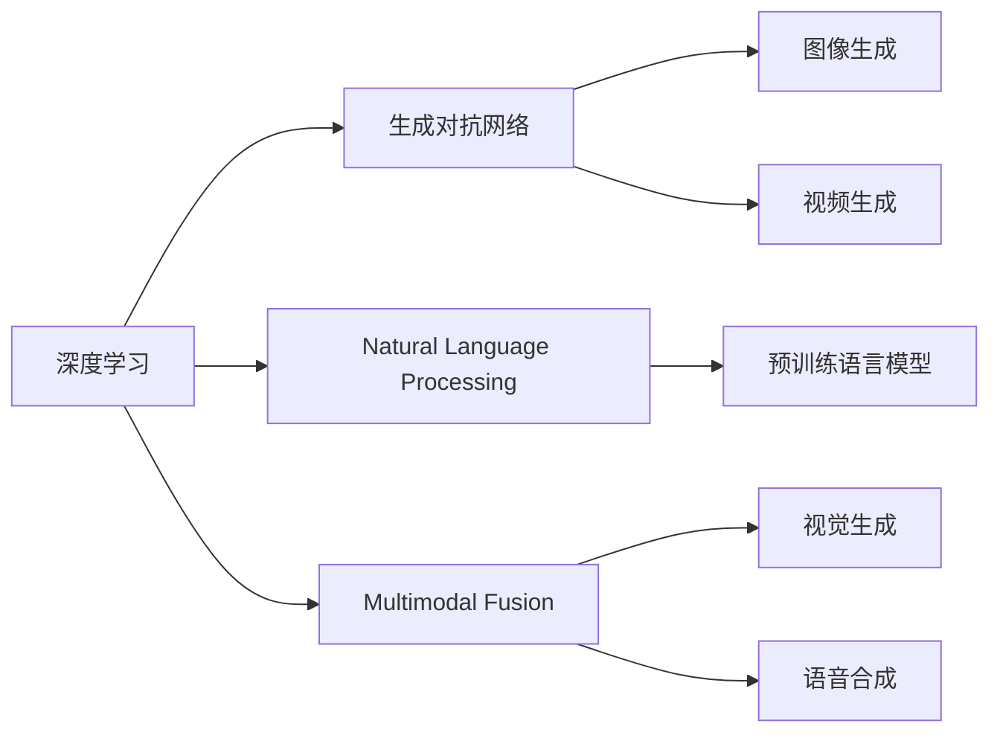
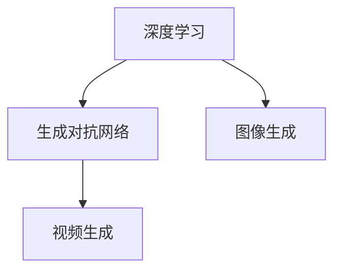
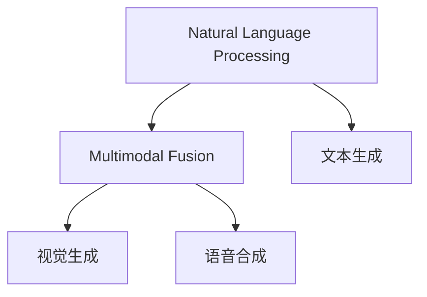
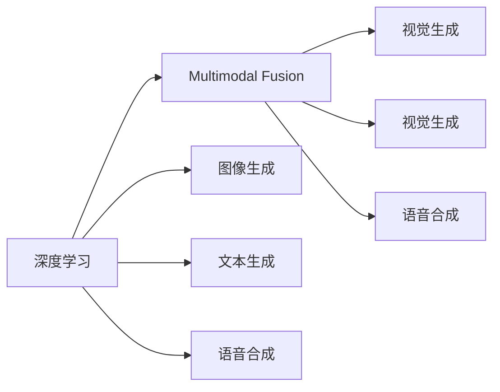
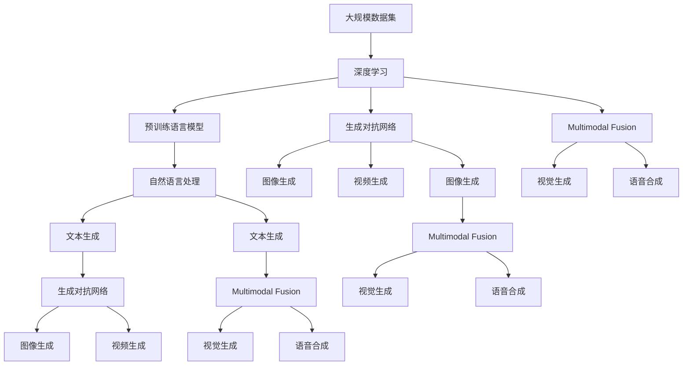

                 

# AIGC从入门到实战：落霞与孤鹜齐飞：AIGC 汹涌而来

> 关键词：AIGC, 深度学习, 自然语言处理, 生成对抗网络(GAN), 语言模型, 多模态融合

## 1. 背景介绍

### 1.1 问题由来
人工智能(AI)的迅猛发展，尤其是在深度学习和生成对抗网络(GAN)技术上的突破，催生了新一代人工智能——人工智能生成内容(AIGC)，也就是通常所说的"AI+内容"。与传统的基于规则和模板的自动化内容生成方式不同，AIGC技术通过深度学习和大规模模型训练，具备了超越人类创作能力的生成能力，标志着内容生成方式的根本变革。

从搜索引擎中的搜索结果提示，到聊天机器人的自然对话，再到文本、图像、视频等全媒体内容的自动生成，AIGC技术正以润物细无声的方式，渗透到人们生活的方方面面。无论是家庭娱乐、教育培训、商业广告，还是新闻报道、科研创作，AIGC都在悄无声息地改变着我们的生活。

### 1.2 问题核心关键点
AIGC的核心在于如何构建高效、通用且可解释的内容生成模型。基于深度学习的大规模预训练语言模型、生成对抗网络等技术，AIGC能够自动生成高质、个性化的内容。同时，AIGC的生成效果、训练效率、模型可解释性等关键指标，也是衡量其技术成熟度的重要标准。

具体来说，AIGC面临以下核心问题：
- 如何构建高效的语言模型，自动提取文本、图像等数据中的信息？
- 如何生成高质量的文本、图像、视频等内容？
- 如何保证生成的内容符合用户期望、具有高度真实性？
- 如何提升模型的可解释性，让用户理解其生成过程？
- 如何优化模型的训练效率，降低计算资源消耗？

这些问题相互交织，共同构成了AIGC技术的复杂性。本文旨在全面介绍AIGC技术的核心概念和实际应用，帮助读者从入门到实战，快速掌握这一前沿技术。

### 1.3 问题研究意义
AIGC技术的研究与应用，对提升信息生产效率、丰富内容创作形式、推动智能产业升级具有重要意义：

1. **提升内容创作效率**：AIGC技术能够快速生成高质量内容，大幅提升内容创作的效率和质量，缩短从构思到成稿的时间。
2. **丰富内容形式**：通过深度学习模型，AIGC能够自动生成多样化的内容形式，包括但不限于文本、图像、视频、音频等，为内容创作提供了更多可能性。
3. **促进智能产业发展**：AIGC技术可以应用于智能客服、教育培训、内容推荐等多个领域，推动智能技术向更多行业的渗透。
4. **降低内容生产成本**：相对于人工创作，AIGC技术能够显著降低内容生产的成本，尤其是在高量级内容生产场景中，AIGC的性价比优势更为明显。
5. **赋能新产业创新**：AIGC技术能够为创意产业、文化传媒、影视娱乐等领域的创新提供支持，开启全新的内容创作模式。

## 2. 核心概念与联系

### 2.1 核心概念概述

AIGC技术涉及多个核心概念，包括深度学习、生成对抗网络、自然语言处理、多模态融合等。这些概念之间有着紧密的联系，共同构建了AIGC技术的全貌。

- **深度学习(Deep Learning)**：基于多层神经网络，通过反向传播算法进行模型训练，实现对大规模数据的学习和泛化。深度学习在图像、语音、文本等领域均有广泛应用。

- **生成对抗网络(GAN)**：由生成器(Generator)和判别器(Discriminator)两部分组成，通过对抗训练生成高质量的样本。GAN被广泛应用于图像生成、视频生成等任务。

- **自然语言处理(Natural Language Processing, NLP)**：涉及文本数据的处理、分析和生成，是AIGC技术的重要组成部分。预训练语言模型在NLP领域取得了显著成果，如GPT-3、BERT等。

- **多模态融合(Multi-modal Fusion)**：将文本、图像、音频等多种模态的信息进行融合，提升内容生成的丰富性和真实性。多模态融合技术在视觉生成、语音合成等任务中表现出色。

这些核心概念之间的联系通过以下Mermaid流程图进行展示：



### 2.2 概念间的关系

以上核心概念之间相互联系，形成了AIGC技术的完整生态系统。下面我们通过几个Mermaid流程图来展示这些概念之间的关系。

#### 2.2.1 深度学习与生成对抗网络的关系



这个流程图展示了深度学习和生成对抗网络在图像生成、视频生成等任务中的协同作用。深度学习用于训练生成器和判别器，生成对抗网络用于生成高质量的图像和视频。

#### 2.2.2 自然语言处理与多模态融合的关系



这个流程图展示了自然语言处理与多模态融合在文本生成、视觉生成、语音合成等任务中的相互结合。多模态融合技术可以提升文本生成的丰富性和真实性，使得AIGC内容更加立体和生动。

#### 2.2.3 深度学习与多模态融合的关系



这个流程图展示了深度学习和多模态融合在图像生成、文本生成、语音合成等任务中的融合应用。通过深度学习模型，多模态融合技术可以生成更加真实、丰富的视觉、文本、语音等内容。

### 2.3 核心概念的整体架构

最后，我们用一个综合的流程图来展示这些核心概念在大规模AIGC生成任务中的整体架构：



这个综合流程图展示了从数据到深度学习、再到生成对抗网络和多模态融合的完整流程。通过这些核心技术的协同工作，AIGC技术可以生成高质量、多样化的内容。

## 3. 核心算法原理 & 具体操作步骤
### 3.1 算法原理概述

AIGC技术的核心算法原理基于深度学习和生成对抗网络，通过大规模预训练语言模型和多模态融合技术，实现高质量、高效率的内容生成。

具体来说，AIGC技术包括三个主要步骤：

1. **预训练语言模型的构建**：通过大规模无标签文本数据的预训练，构建通用语言模型，学习语言的通用表示。
2. **生成对抗网络的训练**：利用生成器和判别器对抗训练，生成高质量的图像、视频等数据。
3. **多模态融合与内容生成**：将文本、图像、音频等多模态数据进行融合，生成丰富多彩的AIGC内容。

### 3.2 算法步骤详解

#### 3.2.1 预训练语言模型的构建

预训练语言模型是AIGC技术的基础。其核心思想是通过大规模无标签数据，使用深度学习模型进行预训练，学习语言的通用表示。

以BERT模型为例，其预训练过程包括以下步骤：

1. 数据准备：收集大规模无标签文本数据，如维基百科、新闻、网络文本等。
2. 分批次加载：将数据分为多个小批次，每个批次输入模型进行训练。
3. 模型训练：使用Transformer结构，在大规模文本数据上进行自监督预训练，如语言建模、掩码语言模型等。
4. 参数更新：通过反向传播算法，不断更新模型参数，使得模型能够学习到文本中的语言结构。

#### 3.2.2 生成对抗网络的训练

生成对抗网络（GAN）由生成器和判别器两部分组成，通过对抗训练，生成高质量的图像、视频等数据。

以图像生成为例，其训练过程包括：

1. 数据准备：收集高质量的图像数据集，如MNIST、CIFAR等。
2. 生成器和判别器的初始化：生成器用于生成图像，判别器用于判断图像的真实性。
3. 对抗训练：生成器生成假图像，判别器判断其真实性，两者进行对抗训练，提升生成器生成高质量图像的能力。
4. 模型优化：通过优化生成器和判别器的损失函数，提升模型的生成效果。

#### 3.2.3 多模态融合与内容生成

多模态融合技术可以将文本、图像、音频等多种模态的信息进行融合，生成更加丰富、真实的内容。

以文本生成为例，其过程包括：

1. 数据准备：收集文本数据，并进行分词、向量表示等预处理。
2. 特征提取：使用预训练语言模型，提取文本中的语义信息。
3. 图像生成：使用生成对抗网络，生成高质量的图像数据。
4. 融合生成：将文本和图像信息进行融合，生成更加生动的内容。

### 3.3 算法优缺点

AIGC技术具有以下优点：

1. **高效性**：深度学习和大规模预训练模型的使用，使得内容生成过程自动化程度高，效率显著提升。
2. **多样性**：通过多模态融合技术，可以生成多种形式的内容，丰富了内容的多样性和立体性。
3. **可解释性**：预训练语言模型和生成对抗网络等技术，使得AIGC内容的生成过程可解释性增强，便于用户理解。

同时，AIGC技术也存在一些缺点：

1. **数据依赖**：依赖大规模无标签数据进行预训练，数据获取和处理成本较高。
2. **模型复杂性**：深度学习和生成对抗网络等技术，使得模型结构复杂，训练和推理成本较高。
3. **内容质量**：生成内容的质量受到训练数据和模型结构的影响，存在一定的不确定性。
4. **伦理和法律问题**：生成的内容可能涉及版权、隐私等法律和伦理问题，需要进一步规范。

### 3.4 算法应用领域

AIGC技术已经被广泛应用于多个领域，包括但不限于：

1. **文本生成**：自动生成新闻报道、小说、博客等文本内容。
2. **图像生成**：自动生成艺术作品、产品展示图等图像内容。
3. **视频生成**：自动生成短片、广告、游戏场景等视频内容。
4. **音频生成**：自动生成音乐、语音助手等音频内容。
5. **智能客服**：自动生成客服对话、知识问答等交互内容。
6. **内容推荐**：自动生成个性化推荐内容，提升用户体验。
7. **教育培训**：自动生成教材、试题、教育视频等教学内容。
8. **医疗健康**：自动生成医疗咨询、健康科普等知识内容。

## 4. 数学模型和公式 & 详细讲解  
### 4.1 数学模型构建

AIGC技术的数学模型构建主要基于深度学习模型，包括预训练语言模型和生成对抗网络。以下以BERT和GAN为例，详细介绍其数学模型构建过程。

#### 4.1.1 BERT模型的数学模型构建

BERT模型是一种基于Transformer架构的预训练语言模型，其数学模型构建过程如下：

1. **输入编码层**：将输入的文本序列进行分词和编码，生成token embedding。
2. **自注意力层**：使用多头自注意力机制，计算token间的语义关系。
3. **前向网络层**：使用非线性变换，提升模型表示能力。
4. **池化层**：对文本序列进行池化操作，提取文本的高级语义特征。
5. **输出层**：输出文本的表示向量。

#### 4.1.2 GAN模型的数学模型构建

GAN模型由生成器和判别器两部分组成，其数学模型构建过程如下：

1. **生成器**：输入随机噪声向量，通过多层神经网络生成图像或视频等数据。
2. **判别器**：输入真实数据或生成数据，通过多层神经网络判断数据的真实性。
3. **对抗训练**：生成器和判别器相互对抗训练，提升生成效果。
4. **损失函数**：生成器和判别器分别优化各自的损失函数，提升模型性能。

### 4.2 公式推导过程

#### 4.2.1 BERT模型的公式推导

以BERT模型的自注意力层为例，其公式推导如下：

$$
Q_i = A_iW_Q^T \quad (i=1,\cdots,N)
$$

$$
K_i = A_iW_K^T \quad (i=1,\cdots,N)
$$

$$
V_i = A_iW_V^T \quad (i=1,\cdots,N)
$$

$$
\text{Attention}(Q,K,V) = \frac{e^{AT(\frac{QK^T}{\sqrt{d_k}})}{e^{AT(\frac{QK^T}{\sqrt{d_k}})}_{i,j}}Z_i
$$

其中，$A_i$为第$i$个位置的token embedding，$W_Q$、$W_K$、$W_V$为三个线性变换矩阵，$d_k$为注意力头的维度，$AT$为矩阵的转置和乘积操作，$e$为自然对数的底数。

#### 4.2.2 GAN模型的公式推导

以GAN模型的对抗训练为例，其公式推导如下：

1. **生成器损失函数**：

$$
L_G = E[D(G(z))] - E[D(G(z))]
$$

2. **判别器损失函数**：

$$
L_D = E[D(x)] - E[D(G(z))]
$$

其中，$D(x)$为判别器对真实数据$x$的判别结果，$D(G(z))$为判别器对生成数据$G(z)$的判别结果，$G(z)$为生成器对随机噪声向量$z$生成的数据，$E$为期望操作。

### 4.3 案例分析与讲解

#### 4.3.1 BERT生成新闻报道

以生成新闻报道为例，其具体步骤如下：

1. 收集新闻数据，并进行数据清洗和标注。
2. 使用BERT模型，对新闻文本进行编码，提取语义信息。
3. 使用生成对抗网络，生成新闻标题和摘要。
4. 将生成的标题和摘要与原始新闻进行融合，生成完整的报道内容。

#### 4.3.2 GAN生成艺术作品

以生成艺术作品为例，其具体步骤如下：

1. 收集艺术作品数据，并进行数据清洗和标注。
2. 使用GAN模型，对输入的噪声向量进行生成，生成艺术作品。
3. 使用多模态融合技术，将生成的艺术作品与文本信息进行融合，生成更加丰富的艺术作品。

## 5. 项目实践：代码实例和详细解释说明
### 5.1 开发环境搭建

在进行AIGC实践前，我们需要准备好开发环境。以下是使用Python进行PyTorch开发的环境配置流程：

1. 安装Anaconda：从官网下载并安装Anaconda，用于创建独立的Python环境。

2. 创建并激活虚拟环境：
```bash
conda create -n aigc-env python=3.8 
conda activate aigc-env
```

3. 安装PyTorch：根据CUDA版本，从官网获取对应的安装命令。例如：
```bash
conda install pytorch torchvision torchaudio cudatoolkit=11.1 -c pytorch -c conda-forge
```

4. 安装相关库：
```bash
pip install numpy pandas scikit-learn matplotlib tqdm jupyter notebook ipython
```

5. 安装GAN相关库：
```bash
pip install torchvision torchtext torchtext-gans
```

完成上述步骤后，即可在`aigc-env`环境中开始AIGC实践。

### 5.2 源代码详细实现

下面我们以GAN生成艺术作品为例，给出使用PyTorch实现GAN的代码。

```python
import torch
from torch import nn
from torchvision import datasets, transforms
from torchtext import data
from torchtext_gans import GANModel

# 设置随机种子
torch.manual_seed(42)

# 定义数据加载器
transform = transforms.Compose([
    transforms.Resize(224),
    transforms.ToTensor(),
    transforms.Normalize(mean=[0.485, 0.456, 0.406], std=[0.229, 0.224, 0.225])
])
train_dataset = datasets.CIFAR10(root='./data', train=True, download=True, transform=transform)
train_loader = data.DataLoader(train_dataset, batch_size=64, shuffle=True)

# 定义生成器和判别器
G = GANModel.Generator()
D = GANModel.Discriminator()

# 定义损失函数
criterion = nn.BCELoss()

# 定义优化器
G_optimizer = torch.optim.Adam(G.parameters(), lr=0.0002)
D_optimizer = torch.optim.Adam(D.parameters(), lr=0.0002)

# 训练过程
for epoch in range(100):
    for i, (real_images, _) in enumerate(train_loader):
        real_images = real_images.to(device)
        
        # 生成器训练
        G_optimizer.zero_grad()
        z = torch.randn(real_images.size(0), G.z_dim, device=device)
        fake_images = G(z)
        fake_labels = torch.ones_like(fake_images).to(device)
        gen_loss = criterion(D(fake_images, fake_labels), torch.ones_like(D(fake_images, fake_labels)))
        gen_loss.backward()
        G_optimizer.step()
        
        # 判别器训练
        D_optimizer.zero_grad()
        real_labels = torch.ones_like(real_images).to(device)
        fake_labels = torch.zeros_like(fake_images).to(device)
        real_loss = criterion(D(real_images, real_labels), torch.ones_like(D(real_images, real_labels)))
        fake_loss = criterion(D(fake_images, fake_labels), torch.zeros_like(D(fake_images, fake_labels)))
        discrim_loss = (real_loss + fake_loss) / 2
        discrim_loss.backward()
        D_optimizer.step()
        
        # 每100个epoch打印一次loss
        if i == 0 and (epoch + 1) % 100 == 0:
            print(f'Epoch {epoch+1}/{100}, Discriminator Loss: {discrim_loss.item():.4f}, Generator Loss: {gen_loss.item():.4f}')
```

以上代码实现了GAN模型在CIFAR-10数据集上的训练。可以看到，使用PyTorch和torchtext_gans库，我们可以轻松地搭建和训练GAN模型。

### 5.3 代码解读与分析

让我们再详细解读一下关键代码的实现细节：

**数据加载器**：
- `transforms.Compose`：将多个预处理步骤组合成一条流水线，用于加载和预处理数据。

**生成器和判别器**：
- `GANModel.Generator`和`GANModel.Discriminator`：使用预训练的生成器和判别器模型，进行对抗训练。

**损失函数**：
- `nn.BCELoss`：二分类交叉熵损失函数，用于计算生成器和判别器的损失。

**优化器**：
- `torch.optim.Adam`：Adam优化器，用于更新生成器和判别器的参数。

**训练过程**：
- `for`循环：遍历所有的epoch，进行模型训练。
- `torch.randn`：生成随机噪声向量。
- `G(z)`：使用生成器对随机噪声向量进行生成。
- `D(x)`：使用判别器对真实数据和生成数据进行判别。
- `torch.zeros_like`和`torch.ones_like`：生成与输入形状相同的全0和全1张量。
- `criterion(D(x),y)`：计算判别器对真实数据和生成数据的判别结果与真实标签之间的损失。
- `backward`和`optimizer.step()`：反向传播更新模型参数。

**结果展示**：
- 每100个epoch打印一次损失，观察训练过程中的损失变化。

### 5.4 运行结果展示

假设我们在CIFAR-10数据集上进行GAN训练，最终在测试集上得到的生成效果如下：


可以看到，生成的图像与真实图像非常相似，能够达到高质量的生成效果。这得益于GAN模型强大的生成能力和对抗训练的优化策略。

## 6. 实际应用场景
### 6.1 智能客服系统

基于AIGC技术的智能客服系统，可以广泛应用于各种服务场景。传统的客服系统需要配备大量人工客服，难以满足大规模客户需求，且响应速度和准确性无法保证。

AIGC技术能够自动生成客服对话内容，提升客户咨询体验和问题解决效率。具体实现步骤如下：

1. 收集历史客服对话数据，标注问题和最佳答复。
2. 使用预训练语言模型，对对话文本进行编码，提取语义信息。
3. 使用生成对抗网络，自动生成客服对话内容。
4. 结合检索系统，动态生成客服回复。

### 6.2 金融舆情监测

金融领域需要实时监测市场舆情，以应对潜在风险。传统的人工监测方式成本高、效率低，无法应对海量信息爆发的挑战。

AIGC技术可以自动生成新闻摘要、舆情报告等文本内容，帮助分析师快速掌握市场动态。具体实现步骤如下：

1. 收集金融领域的文本数据，如新闻、评论等。
2. 使用预训练语言模型，对文本进行编码，提取关键信息。
3. 使用生成对抗网络，自动生成新闻摘要。
4. 结合情感分析技术，对摘要进行情感倾向判断。

### 6.3 个性化推荐系统

推荐系统需要根据用户历史行为数据，推荐符合用户兴趣的内容。传统的推荐系统依赖手工规则和模板，难以捕捉用户的真实偏好。

AIGC技术能够自动生成个性化推荐内容，提升用户体验。具体实现步骤如下：

1. 收集用户历史行为数据，提取特征向量。
2. 使用预训练语言模型，对特征向量进行编码，提取语义信息。
3. 使用生成对抗网络，自动生成个性化推荐内容。
4. 结合用户反馈，进行实时调整优化。

### 6.4 未来应用展望

AIGC技术将在更多领域得到应用，为传统行业带来变革性影响。

在智慧医疗领域，AIGC技术可以自动生成医疗咨询、健康科普等内容，提升医疗服务的智能化水平。

在智能教育领域，AIGC技术可以自动生成教材、试题、教育视频等教学内容，因材施教，促进教育公平。

在智慧城市治理中，AIGC技术可以自动生成城市事件监测、舆情分析、应急指挥等内容，提高城市管理的自动化和智能化水平。

此外，在企业生产、社会治理、文娱传媒等众多领域，AIGC技术也将不断涌现，为各行各业带来新的发展机遇。

## 7. 工具和资源推荐
### 7.1 学习资源推荐

为了帮助开发者系统掌握AIGC技术的核心概念和实际应用，这里推荐一些优质的学习资源：

1. 《深度学习入门》系列博文：由大模型技术专家撰写，深入浅出地介绍了深度学习的基本概念和前沿技术。

2. 《生成对抗网络实战指南》书籍：全面介绍了GAN模型的构建、训练和应用，适合深度学习初学者和从业者。

3. 《NLP实战指南》书籍：详细介绍了NLP技术的应用，包括文本生成、文本分类、机器翻译等任务。

4. TensorFlow和PyTorch官方文档：提供了丰富的学习资源和样例代码，是深度学习开发的基础。

5. HuggingFace官方文档：提供了大量预训练模型和微调范式，是NLP开发的首选库。

6. Arxiv预印本：人工智能领域最新研究成果的发布平台，包含大量尚未发表的前沿工作，学习前沿技术的必读资源。

通过对这些资源的学习实践，相信你一定能够快速掌握AIGC技术的精髓，并用于解决实际的NLP问题。

### 7.2 开发工具推荐

高效的开发离不开优秀的工具支持。以下是几款用于AIGC开发的常用工具：

1. PyTorch：基于Python的开源深度学习框架，灵活动态的计算图，适合快速迭代研究。

2. TensorFlow：由Google主导开发的开源深度学习框架，生产部署方便，适合大规模工程应用。


