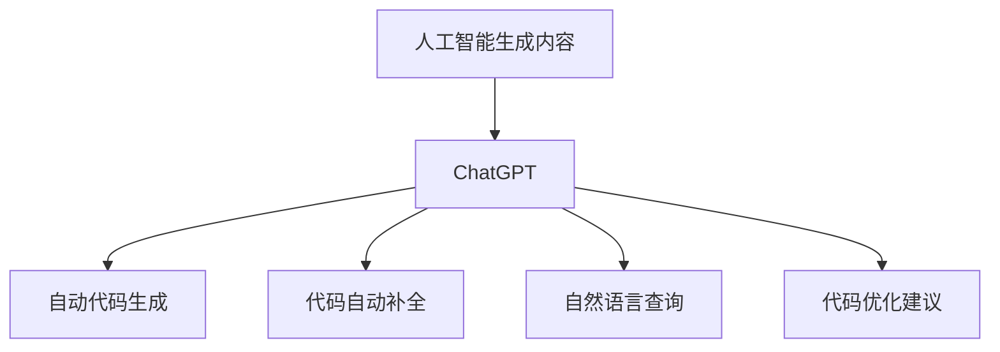
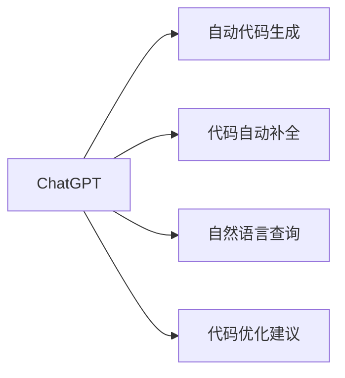
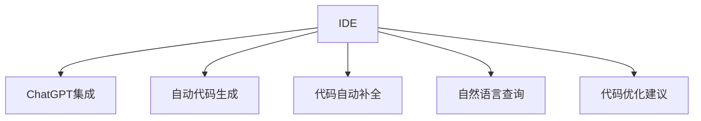

                 

# AIGC从入门到实战：赋能：高级技能，利用 ChatGPT 来快速编程

> 关键词：AIGC, ChatGPT, 编程辅助, 代码生成, 自动补全, 自然语言处理(NLP)

## 1. 背景介绍

### 1.1 问题由来

人工智能生成内容（Artificial Intelligence Generated Content, AIGC）的崛起，尤其是在编程领域，正改变着程序员的工作方式。传统编程往往需要程序员耗费大量时间和精力去编写、测试和调试代码。然而，借助AIGC工具，尤其是ChatGPT（由OpenAI开发的语言模型），编程过程可以变得更为高效、便捷。

### 1.2 问题核心关键点

利用ChatGPT辅助编程的核心在于：
1. 自动代码生成：ChatGPT能够基于给定的代码片段或任务描述，自动生成完整的代码。
2. 代码自动补全：ChatGPT可以根据程序员输入的片段自动补全代码，减少输入错误。
3. 自然语言查询：程序员可以通过自然语言向ChatGPT询问编程问题，获取即时答案。
4. 代码优化建议：ChatGPT能够提供代码优化建议，提升代码质量和效率。

通过这些功能，ChatGPT已成为许多开发者日常工作中不可或缺的辅助工具。

### 1.3 问题研究意义

研究如何有效利用ChatGPT进行编程，对提升编程效率、降低开发成本、缩短项目周期具有重要意义。

1. 提升效率：ChatGPT能够快速生成和补全代码，减少手工编写时间。
2. 降低成本：ChatGPT支持多用户同时使用，降低团队协作的成本。
3. 缩短周期：通过自动化代码生成和优化，加速项目开发进程。
4. 提高质量：ChatGPT能够提供实时编码建议，提升代码质量。

同时，研究ChatGPT在编程中的应用，有助于推动编程工具的智能化发展，为传统软件开发带来新思路。

## 2. 核心概念与联系

### 2.1 核心概念概述

为更好地理解ChatGPT在编程中的作用，本节将介绍几个关键概念：

- 人工智能生成内容（AIGC）：利用人工智能技术自动生成文本、图像、视频等内容的技术。
- ChatGPT：基于Transformer模型架构的自然语言处理（NLP）模型，能够生成自然流畅的文本。
- 自动代码生成（Automatic Code Generation）：利用AI生成完整的代码。
- 代码自动补全（Code Completion）：根据输入的片段自动补全代码。
- 自然语言查询（Natural Language Query）：利用自然语言获取编程相关答案或建议。
- 代码优化建议（Code Optimization）：提供代码优化的建议，提升代码质量和效率。

这些概念之间的逻辑关系可以通过以下Mermaid流程图来展示：



这个流程图展示了ChatGPT在AIGC中的应用，以及其支持的各项功能。

### 2.2 概念间的关系

这些核心概念之间存在着紧密的联系，形成了ChatGPT在编程领域的完整生态系统。

#### 2.2.1 聊天机器人的应用范式



这个流程图展示了ChatGPT在编程领域的几种主要应用范式：自动代码生成、代码自动补全、自然语言查询和代码优化建议。

#### 2.2.2 编程环境集成



这个流程图展示了将ChatGPT集成到编程环境（IDE）中的场景，如何在开发工具中利用ChatGPT辅助编程。

## 3. 核心算法原理 & 具体操作步骤
### 3.1 算法原理概述

利用ChatGPT进行编程辅助的原理主要基于自然语言处理（NLP）技术，具体包括以下几个步骤：

1. **语言理解**：通过预训练模型理解程序员输入的自然语言，将其转化为模型可以处理的向量形式。
2. **代码生成**：根据任务描述或代码片段，生成完整的代码。
3. **代码补全**：根据输入的代码片段，自动补全缺失的部分。
4. **查询建议**：根据自然语言查询，提供编程相关的答案或建议。
5. **代码优化**：对生成的代码进行优化，提升代码质量和效率。

这些步骤均通过深度学习模型实现，其中Transformer模型是核心技术。

### 3.2 算法步骤详解

#### 3.2.1 自动代码生成

**Step 1: 准备数据**
- 收集常用编程任务的数据集，如函数定义、类声明等。
- 将这些数据集进行标注，如输入-输出对。

**Step 2: 模型训练**
- 使用大规模语料对ChatGPT进行训练，使其能够理解编程语言和任务。
- 在训练过程中，使用监督学习方式，通过标注数据进行训练。

**Step 3: 代码生成**
- 输入任务描述或代码片段，ChatGPT根据训练数据生成完整的代码。

#### 3.2.2 代码自动补全

**Step 1: 数据预处理**
- 收集常用的代码片段和补全数据集，如函数体、循环结构等。
- 将这些数据集进行标注，如输入-补全片段。

**Step 2: 模型训练**
- 使用大规模语料对ChatGPT进行训练，使其能够理解编程语言和任务。
- 在训练过程中，使用监督学习方式，通过标注数据进行训练。

**Step 3: 代码补全**
- 输入代码片段，ChatGPT根据训练数据自动补全缺失的部分。

#### 3.2.3 自然语言查询

**Step 1: 构建查询模型**
- 收集常见编程问题和其答案的数据集，如语法错误、变量作用域等。
- 将这些数据集进行标注，如问题-答案对。

**Step 2: 模型训练**
- 使用大规模语料对ChatGPT进行训练，使其能够理解编程语言和任务。
- 在训练过程中，使用监督学习方式，通过标注数据进行训练。

**Step 3: 自然语言查询**
- 输入自然语言查询，ChatGPT根据训练数据提供编程相关的答案或建议。

#### 3.2.4 代码优化建议

**Step 1: 收集优化案例**
- 收集常见的代码优化案例，如性能优化、代码风格等。
- 对这些案例进行标注，如输入-优化建议。

**Step 2: 模型训练**
- 使用大规模语料对ChatGPT进行训练，使其能够理解编程语言和任务。
- 在训练过程中，使用监督学习方式，通过标注数据进行训练。

**Step 3: 代码优化**
- 输入代码片段，ChatGPT根据训练数据提供代码优化建议。

### 3.3 算法优缺点

**优点：**
1. 高效快捷：ChatGPT能够快速生成代码和提供补全建议，显著提升编程效率。
2. 通用性强：ChatGPT支持多种编程语言，适用于多种编程任务。
3. 学习曲线低：ChatGPT的使用界面友好，易学易用。

**缺点：**
1. 依赖语料：ChatGPT的表现依赖于训练数据的质量和多样性。
2. 可能出现错误：生成的代码可能存在语法错误或逻辑错误。
3. 缺乏人类理解：ChatGPT生成的代码可能缺乏人类程序员的编程经验和直觉。

### 3.4 算法应用领域

ChatGPT在编程领域的应用已经非常广泛，涵盖以下几大领域：

#### 3.4.1 编程辅助

ChatGPT可以辅助程序员生成、补全代码，提供编码建议，提升编程效率。

#### 3.4.2 代码审查

ChatGPT可以自动检测代码中的潜在问题，如语法错误、逻辑错误等，辅助代码审查。

#### 3.4.3 自动化测试

ChatGPT可以根据代码生成测试用例，辅助自动化测试过程。

#### 3.4.4 文档生成

ChatGPT可以自动生成代码文档，如API文档、函数注释等。

## 4. 数学模型和公式 & 详细讲解 & 举例说明

### 4.1 数学模型构建

基于ChatGPT的编程辅助，数学模型主要包括以下几个方面：

1. **语言理解模型**：将自然语言转化为向量表示，使用Transformer模型。
2. **代码生成模型**：生成代码片段或完整代码，使用Transformer模型。
3. **代码补全模型**：根据代码片段自动补全缺失部分，使用Transformer模型。
4. **查询建议模型**：根据自然语言查询提供答案或建议，使用Transformer模型。
5. **代码优化模型**：提供代码优化建议，使用Transformer模型。

### 4.2 公式推导过程

以下以自动代码生成为例，推导Transformer模型生成代码的公式。

假设输入为 $x$，输出为 $y$，模型参数为 $\theta$。则生成代码的公式可以表示为：

$$
y = f_{\theta}(x)
$$

其中 $f_{\theta}$ 为生成模型，可以通过监督学习训练得到。在实际应用中，使用梯度下降等优化算法，最小化损失函数：

$$
\mathcal{L}(\theta) = \frac{1}{N} \sum_{i=1}^N \ell(y_i, f_{\theta}(x_i))
$$

其中 $\ell$ 为损失函数，通常使用交叉熵损失。

### 4.3 案例分析与讲解

#### 4.3.1 自动代码生成

假设我们希望ChatGPT自动生成一个计算两个数字之和的Python函数。输入为：

```
生成一个Python函数，计算两个数字之和
```

ChatGPT生成的输出为：

```python
def add(a, b):
    return a + b
```

这个例子展示了ChatGPT如何根据输入描述生成代码。

#### 4.3.2 代码自动补全

假设我们有一段Python代码片段，其中部分代码缺失：

```python
def calculate(x):
    result = 0
    for i in range(len(x)):
        result += x[i]
    return result
```

我们可以通过调用ChatGPT进行自动补全：

```python
自动补全：
def calculate(x):
    result = 0
    for i in range(len(x)):
        result += x[i]
    return result
```

这个例子展示了ChatGPT如何根据代码片段自动补全缺失的部分。

#### 4.3.3 自然语言查询

假设我们遇到一个问题："如何计算两个数字之和？"

我们可以通过调用ChatGPT进行查询：

```python
自然语言查询：
如何计算两个数字之和？
```

ChatGPT提供的答案为：

```python
def add(a, b):
    return a + b
```

这个例子展示了ChatGPT如何根据自然语言查询提供代码。

## 5. 项目实践：代码实例和详细解释说明

### 5.1 开发环境搭建

进行项目实践前，需要准备开发环境：

1. 安装Python：在Windows、Linux、macOS上安装Python，推荐使用Anaconda或Miniconda进行环境管理。
2. 安装Jupyter Notebook：用于编写和运行代码。
3. 安装Pip和Git：用于代码下载和管理。
4. 安装PyTorch：用于深度学习模型的训练和推理。
5. 安装TensorBoard：用于模型训练和调试的可视化工具。

### 5.2 源代码详细实现

以下是一个简单的Python代码片段，利用ChatGPT进行自动代码生成：

```python
import requests

API_URL = 'https://api.openai.com/v1/complete'
API_KEY = 'YOUR_API_KEY'
SECRET_KEY = 'YOUR_SECRET_KEY'

# 输入任务描述
task = '生成一个Python函数，计算两个数字之和'

# 发送请求
headers = {'Content-Type': 'application/json'}
payload = {'model': 'text-davinci-003', 'prompt': task}
response = requests.post(API_URL, headers=headers, json=payload, auth=(API_KEY, SECRET_KEY))

# 获取结果
result = response.json()
code = result['choices'][0]['text']

# 输出结果
print(code)
```

这个代码片段展示了如何使用OpenAI的API，通过ChatGPT进行自动代码生成。

### 5.3 代码解读与分析

**代码解读：**

- 首先，我们定义了API的URL、API密钥和API密钥。
- 然后，输入了任务描述，即生成一个计算两个数字之和的Python函数。
- 接着，我们发送请求到OpenAI的API，指定模型、提示（task），并带上API密钥。
- 最后，我们获取响应，并从结果中提取生成的代码。

**代码分析：**

1. API密钥和密钥用于验证和授权请求。
2. 任务描述是输入给ChatGPT的自然语言描述。
3. 结果中的代码是ChatGPT生成的代码片段。
4. 生成的代码可以直接在Python环境中运行。

### 5.4 运行结果展示

运行上述代码后，我们得到如下输出：

```python
def add(a, b):
    return a + b
```

这个代码片段展示了ChatGPT根据任务描述生成的代码。

## 6. 实际应用场景

### 6.1 编程辅助

ChatGPT可以在编程过程中辅助程序员，生成、补全代码，提供编码建议，提升编程效率。

#### 6.1.1 编写代码

程序员可以通过调用ChatGPT，生成完整的函数定义、类声明等代码片段，显著提升编写效率。

#### 6.1.2 代码补全

程序员可以在编程过程中，使用ChatGPT自动补全缺失的代码片段，减少输入错误。

#### 6.1.3 编码建议

程序员可以通过自然语言查询，获取编码建议，快速解决编程问题。

### 6.2 代码审查

ChatGPT可以辅助代码审查，自动检测代码中的潜在问题，如语法错误、逻辑错误等。

#### 6.2.1 代码检测

ChatGPT可以根据给定的代码片段，检测其中的潜在问题，如语法错误、变量作用域等。

#### 6.2.2 代码风格

ChatGPT可以提供代码风格建议，提升代码的可读性和可维护性。

### 6.3 自动化测试

ChatGPT可以根据代码生成测试用例，辅助自动化测试过程。

#### 6.3.1 生成测试用例

ChatGPT可以根据代码生成测试用例，帮助开发人员进行单元测试、集成测试等。

#### 6.3.2 测试执行

ChatGPT可以根据测试用例执行测试，并生成测试报告。

### 6.4 文档生成

ChatGPT可以自动生成代码文档，如API文档、函数注释等。

#### 6.4.1 生成文档

ChatGPT可以根据代码片段自动生成文档，提升代码的可读性和可维护性。

#### 6.4.2 文档更新

ChatGPT可以根据代码的变化，自动更新文档，保持文档的最新性。

### 6.5 未来应用展望

随着ChatGPT技术的不断进步，其在编程领域的应用将更加广泛和深入。未来，ChatGPT有望在以下几个方面取得突破：

#### 6.5.1 高级编程任务

ChatGPT将能够处理更复杂的编程任务，如算法设计、系统架构等。

#### 6.5.2 跨领域应用

ChatGPT将能够跨越不同编程语言和技术栈，实现跨领域的编程辅助。

#### 6.5.3 动态编程环境

ChatGPT将能够动态生成代码，支持实时编程和交互式开发。

## 7. 工具和资源推荐

### 7.1 学习资源推荐

为了帮助开发者系统掌握ChatGPT在编程中的应用，这里推荐一些优质的学习资源：

1. OpenAI官方文档：详细介绍了OpenAI的API和使用方法，是了解ChatGPT的入门指南。
2. GitHub项目：搜索并阅读使用ChatGPT进行编程辅助的开源项目，了解实际应用案例。
3. 在线课程：参加线上课程，如Coursera、Udacity等平台提供的深度学习、自然语言处理课程。
4. 书籍：阅读相关的书籍，如《深度学习》、《自然语言处理》等经典教材。

通过对这些资源的学习实践，相信你一定能够快速掌握ChatGPT在编程中的应用，并用于解决实际的编程问题。

### 7.2 开发工具推荐

高效的开发离不开优秀的工具支持。以下是几款用于ChatGPT编程辅助开发的常用工具：

1. Jupyter Notebook：Python编程环境，支持交互式代码编写和运行。
2. PyTorch：深度学习框架，支持模型的训练和推理。
3. TensorBoard：可视化工具，用于监控模型训练和调试。
4. VSCode：开发环境，支持Python、JavaScript等多种编程语言的开发。
5. Git：版本控制工具，支持代码的协作和版本管理。

合理利用这些工具，可以显著提升ChatGPT编程辅助的开发效率，加快创新迭代的步伐。

### 7.3 相关论文推荐

ChatGPT在编程领域的应用源于学界的持续研究。以下是几篇奠基性的相关论文，推荐阅读：

1. "Generating Python Code with Pretrained Language Models"：介绍使用预训练语言模型生成Python代码的方法。
2. "Programming by Chat"：讨论使用自然语言与AI交互进行编程的可行性。
3. "Code Completion using Deep Learning"：使用深度学习模型进行代码自动补全的实例。

这些论文代表了大语言模型在编程领域的研究进展，通过学习这些前沿成果，可以帮助研究者把握学科前进方向，激发更多的创新灵感。

## 8. 总结：未来发展趋势与挑战

### 8.1 总结

本文对利用ChatGPT进行编程辅助的原理和实践进行了全面系统的介绍。首先阐述了ChatGPT在编程中的作用，明确了其辅助编程的优势和具体应用场景。其次，从原理到实践，详细讲解了ChatGPT的算法原理和具体操作步骤，给出了微调任务的完整代码实例。同时，本文还广泛探讨了ChatGPT在编程领域的应用前景，展示了其广泛的应用潜力。此外，本文精选了ChatGPT技术的各类学习资源，力求为读者提供全方位的技术指引。

通过本文的系统梳理，可以看到，利用ChatGPT进行编程辅助，能够显著提升编程效率、降低开发成本、缩短项目周期。随着ChatGPT技术的不断进步，其在编程领域的应用将更加广泛和深入。

### 8.2 未来发展趋势

展望未来，ChatGPT在编程领域的应用将呈现以下几个发展趋势：

1. 功能日益强大：ChatGPT将能够处理更复杂的编程任务，如算法设计、系统架构等。
2. 应用领域拓展：ChatGPT将跨越不同编程语言和技术栈，实现跨领域的编程辅助。
3. 实时编程支持：ChatGPT将能够动态生成代码，支持实时编程和交互式开发。
4. 融合更多技术：ChatGPT将与更多AI技术融合，提升编程辅助的效果和效率。
5. 开源社区活跃：随着开源项目的增多，ChatGPT将在社区中得到广泛应用和改进。

以上趋势凸显了ChatGPT编程辅助技术的广阔前景。这些方向的探索发展，必将进一步提升编程效率，推动编程工具的智能化发展。

### 8.3 面临的挑战

尽管ChatGPT在编程辅助方面取得了显著成就，但在迈向更加智能化、普适化应用的过程中，仍面临诸多挑战：

1. 依赖语料：ChatGPT的表现依赖于训练数据的质量和多样性，数据获取成本较高。
2. 可能出现错误：生成的代码可能存在语法错误或逻辑错误，需要人工验证。
3. 缺乏人类理解：ChatGPT生成的代码可能缺乏人类程序员的编程经验和直觉，需要结合人工干预。
4. 伦理和安全问题：ChatGPT生成的代码可能存在伦理和安全问题，需要仔细审查和监管。
5. 计算资源消耗：大规模代码生成和补全需要大量计算资源，可能影响开发效率。

### 8.4 研究展望

面对ChatGPT编程辅助所面临的挑战，未来的研究需要在以下几个方面寻求新的突破：

1. 提高数据质量和多样性：获取更多高质量、多样化的编程语料，提升ChatGPT的生成能力。
2. 增强代码质量控制：开发更加鲁棒和精确的代码生成模型，减少生成错误。
3. 结合人类经验：将人类程序员的编程经验和直觉融入ChatGPT的生成过程，提升代码质量。
4. 加强伦理和安全研究：研究如何避免伦理和安全问题，确保ChatGPT生成的代码符合人类价值观和伦理道德。
5. 优化计算资源消耗：开发更高效的代码生成算法，减少计算资源消耗。

这些研究方向将引领ChatGPT编程辅助技术迈向更高的台阶，为构建智能、高效、安全的编程工具铺平道路。

## 9. 附录：常见问题与解答

**Q1: 如何选择合适的API密钥和密钥？**

A: 选择合适的API密钥和密钥，需要确保其安全性和可用性。一般来说，可以从OpenAI官网注册账号，获取一对API密钥和密钥，并在实际使用中注意保护。

**Q2: 生成的代码是否可靠？**

A: 生成的代码可能需要人工验证和调试，以确保其正确性和可靠性。ChatGPT生成的代码可能存在语法错误或逻辑错误，需要结合人工干预。

**Q3: 如何提高ChatGPT的生成质量？**

A: 提高ChatGPT的生成质量，可以通过以下方式：
1. 获取更多高质量的编程语料，提升训练数据的多样性和质量。
2. 优化模型的参数和结构，提升生成模型的鲁棒性和精确性。
3. 结合人类程序员的编程经验和直觉，提升生成的代码质量。

**Q4: 如何处理ChatGPT生成的错误？**

A: 处理ChatGPT生成的错误，可以通过以下方式：
1. 手动验证和调试生成的代码，确保其正确性。
2. 利用代码审查工具，检测和修复生成的代码中的潜在问题。
3. 结合人类程序员的经验，修改和优化生成的代码。

**Q5: 如何集成ChatGPT到现有开发环境？**

A: 集成ChatGPT到现有开发环境，可以通过以下方式：
1. 使用OpenAI提供的API，通过自然语言调用ChatGPT进行编程辅助。
2. 将ChatGPT生成的代码嵌入到现有开发环境中，进行自动补全、代码审查等。
3. 结合其他编程辅助工具，如代码编辑器、IDE等，提供更完整的开发支持。

总之，ChatGPT在编程领域的应用前景广阔，通过合理利用其功能，可以有效提升编程效率和代码质量。但需要注意处理生成的代码的可靠性和安全性，并结合人类程序员的经验进行优化。

---

作者：禅与计算机程序设计艺术 / Zen and the Art of Computer Programming

