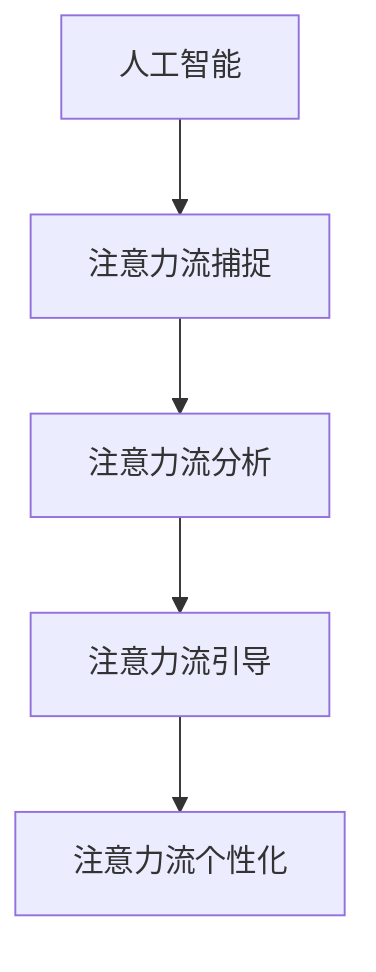
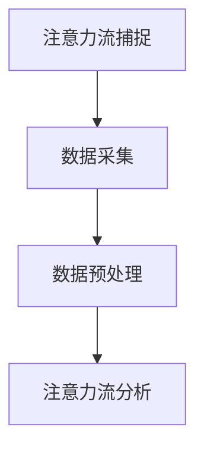
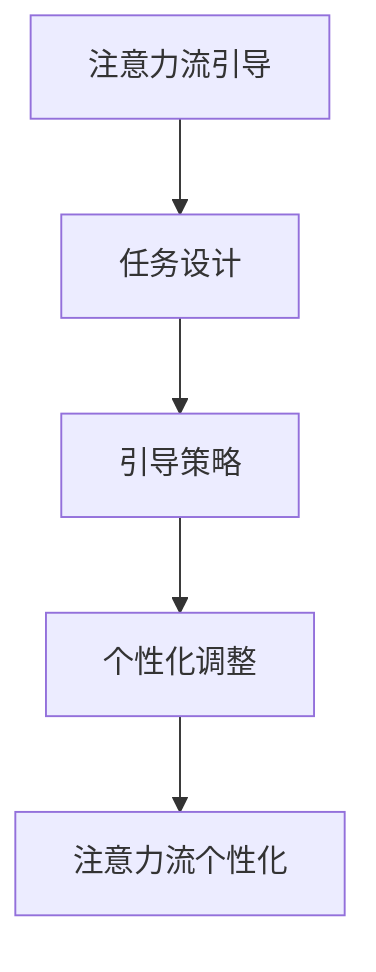
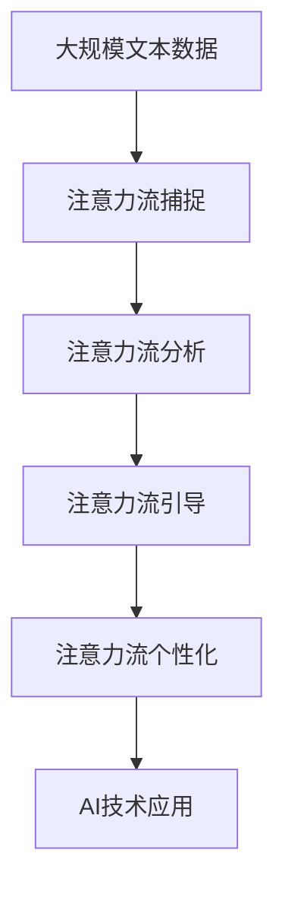
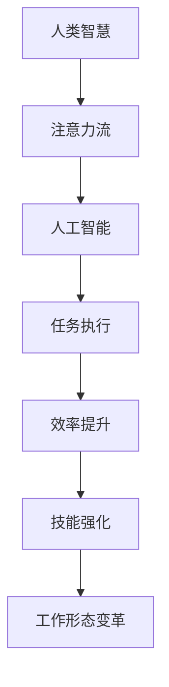

                 

# AI与人类注意力流：未来的工作、技能与注意力流管理技术的未来应用

> 关键词：AI, 人类注意力流, 工作, 技能, 注意力流管理技术, 未来应用

## 1. 背景介绍

### 1.1 问题由来

随着人工智能(AI)技术的不断进步，特别是深度学习与自然语言处理(NLP)的快速发展，AI已经在多个领域实现了广泛应用，从智能客服、自动驾驶到健康医疗、金融交易。然而，这些技术的应用不仅需要算法、模型和硬件的支持，还需要人类智慧的参与，即对信息的选择、加工和理解。人类注意力流（Human Attention Flow）成为了连接AI与人类智慧的关键要素，对未来的工作、技能和AI技术应用有着深远的影响。

### 1.2 问题核心关键点

注意力流管理技术的核心在于如何高效、准确地捕捉、分析、引导人类注意力，使其与AI技术进行无缝对接，从而提升工作效率、优化工作流程、强化技能培训和实现个性化学习。

注意力流管理技术的研究和应用，主要围绕以下几个关键点展开：
1. **注意力流的捕捉**：如何通过AI技术实时、准确地捕捉人类的注意力变化，理解其关注焦点和行为模式。
2. **注意力流的分析**：如何对捕捉到的注意力流数据进行分析，挖掘其中的潜在信息，揭示人类工作的内在规律。
3. **注意力流的引导**：如何通过AI技术设计合理的引导机制，将注意力流引导至最有价值的任务和知识上，优化工作流程和提升技能水平。
4. **注意力流的个性化**：如何根据不同个体的需求和特点，设计个性化、差异化的注意力流管理方案，实现更高效的个性化学习和培训。

### 1.3 问题研究意义

研究人类注意力流管理技术，对于提升工作效率、强化技能培训和优化AI技术应用，具有重要意义：

1. **提升工作效率**：通过捕捉、分析和引导注意力流，帮助人类集中精力，减少干扰，从而提高工作效率和工作质量。
2. **强化技能培训**：利用注意力流管理技术，实时监控学习进程，根据注意力流变化动态调整培训内容和难度，提升学习效果。
3. **优化AI技术应用**：AI技术在处理复杂任务时，需要人类的注意力指导，从而实现更精准、更高效的任务执行。
4. **个性化学习与培训**：针对不同个体的注意力特点和需求，设计个性化注意力流管理方案，实现更高效的学习和培训。
5. **未来工作形态的变革**：随着注意力流管理技术的不断成熟，AI将能够更好地理解和执行人类意图，改变传统的工作方式，开创新的工作形态。

## 2. 核心概念与联系

### 2.1 核心概念概述

为更好地理解人类注意力流管理技术，本节将介绍几个密切相关的核心概念：

- **人工智能**：以深度学习、自然语言处理为代表的智能技术，通过模拟人类智慧，实现对信息的理解、处理和应用。
- **注意力流**：人类在处理信息时，注意力的分布和变化轨迹，即注意力从何处转移，关注了什么，未关注什么。
- **注意力流捕捉技术**：通过传感器、AI算法等手段，实时、准确地捕捉人类的注意力变化，理解其关注焦点和行为模式。
- **注意力流分析技术**：对捕捉到的注意力流数据进行分析，挖掘其中的潜在信息，揭示人类工作的内在规律。
- **注意力流引导技术**：设计合理的引导机制，将注意力流引导至最有价值的任务和知识上，优化工作流程和提升技能水平。
- **注意力流个性化技术**：根据不同个体的需求和特点，设计个性化、差异化的注意力流管理方案，实现更高效的个性化学习和培训。

这些核心概念之间的逻辑关系可以通过以下Mermaid流程图来展示：



这个流程图展示了几类核心概念及其之间的关系：

1. 人工智能通过捕捉、分析和引导注意力流，实现对人类智慧的模拟和应用。
2. 注意力流捕捉技术、分析技术和引导技术，共同构成了注意力流管理的基础架构。
3. 个性化技术则使注意力流管理能够适应不同个体的需求，提升其应用效果。

### 2.2 概念间的关系

这些核心概念之间存在着紧密的联系，形成了注意力流管理技术的完整生态系统。下面我通过几个Mermaid流程图来展示这些概念之间的关系。

#### 2.2.1 注意力流的捕捉与分析



这个流程图展示了注意力流捕捉与分析的基本流程：

1. 数据采集：通过传感器、监控设备等手段，实时捕捉人类的注意力变化数据。
2. 数据预处理：对采集到的数据进行清洗、归一化等处理，确保数据的质量和格式一致。
3. 注意力流分析：对处理后的数据进行分析，挖掘其中的潜在信息，揭示注意力流的内在规律。

#### 2.2.2 注意力流引导与个性化



这个流程图展示了注意力流引导与个性化的关系：

1. 任务设计：根据工作任务的需求，设计合理的注意力流引导策略。
2. 引导策略：通过算法、规则等手段，将注意力流引导至任务的关键环节和重要知识上。
3. 个性化调整：根据不同个体的需求和特点，调整引导策略，实现个性化的注意力流管理。

#### 2.2.3 注意力流管理技术整体架构



这个综合流程图展示了注意力流管理技术从数据采集、分析到引导、个性化的完整过程，以及最终在AI技术应用中的体现。

### 2.3 核心概念的整体架构

最后，我们用一个综合的流程图来展示这些核心概念在大语言模型微调过程中的整体架构：



这个综合流程图展示了从人类智慧到注意力流，再到人工智能的应用，最终实现效率提升、技能强化和工作形态变革的完整过程。通过这些流程图，我们可以更清晰地理解注意力流管理技术的工作原理和优化方向。

## 3. 核心算法原理 & 具体操作步骤
### 3.1 算法原理概述

人类注意力流管理技术的核心在于如何高效、准确地捕捉、分析、引导人类注意力，使其与AI技术进行无缝对接，从而提升工作效率、优化工作流程、强化技能培训和实现个性化学习。

### 3.2 算法步骤详解

基于注意力流管理技术的一般流程如下：

**Step 1: 准备数据与设备**
- 选择合适的传感器、监控设备等，实时捕捉人类的注意力变化数据。
- 确保设备兼容性好，数据采集稳定可靠。

**Step 2: 数据预处理**
- 对采集到的数据进行清洗、归一化等预处理，确保数据质量。
- 去除噪声和异常值，提高数据精度。

**Step 3: 注意力流分析**
- 使用AI算法（如神经网络、时序模型等）对预处理后的数据进行分析。
- 挖掘注意力流的内在规律，识别出关键事件和行为模式。

**Step 4: 注意力流引导**
- 设计合理的引导策略，如任务优先级、时间规划等，将注意力流引导至最有价值的任务和知识上。
- 使用AI技术（如强化学习、规划算法等）动态调整引导策略，提升工作效率。

**Step 5: 注意力流个性化**
- 根据不同个体的需求和特点，设计个性化、差异化的注意力流管理方案。
- 利用AI技术（如深度学习、推荐系统等）进行个性化推荐和调整。

**Step 6: 应用AI技术**
- 在注意力流管理技术的支持下，应用AI技术进行任务执行和优化。
- 如利用NLP技术进行问题解答，利用计算机视觉技术进行图像识别等。

### 3.3 算法优缺点

注意力流管理技术的优点在于其高效、准确地捕捉和分析人类注意力，能够显著提升工作效率、优化工作流程、强化技能培训和实现个性化学习。具体优点包括：

- **效率提升**：通过实时捕捉和分析注意力流，帮助人类集中精力，减少干扰，从而提高工作效率和工作质量。
- **任务优化**：设计合理的引导策略，将注意力流引导至最有价值的任务和知识上，优化工作流程。
- **个性化学习**：根据不同个体的需求和特点，设计个性化、差异化的注意力流管理方案，实现更高效的学习和培训。

然而，该技术也存在一些局限性：

- **技术成本高**：采集和分析注意力流需要先进的技术设备和高昂的计算资源。
- **隐私保护**：实时捕捉和分析注意力流可能涉及用户隐私问题，需要严格的数据保护措施。
- **适用范围有限**：注意力流管理技术在特定领域（如医疗、教育等）的应用效果可能不如通用领域明显。

### 3.4 算法应用领域

注意力流管理技术已经在多个领域得到了应用，具体包括：

- **智能客服**：通过实时捕捉和分析用户注意力流，指导AI客服系统进行高效的问题解答和客户交互。
- **医疗诊断**：利用注意力流管理技术，监控医生的注意力变化，指导其进行精准的诊断和治疗。
- **教育培训**：通过捕捉和分析学生的注意力流，实时调整教学内容和难度，提升学习效果。
- **金融交易**：利用注意力流管理技术，实时监控交易员的注意力变化，指导其进行精准的买卖决策。
- **智能家居**：通过捕捉和分析家庭成员的注意力流，实现智能家居设备的自动控制和优化。

## 4. 数学模型和公式 & 详细讲解
### 4.1 数学模型构建

假设人类在处理信息时的注意力流变化可以用时序数据表示，即 $X=\{x_1, x_2, ..., x_n\}$，其中 $x_i$ 表示第 $i$ 时刻的注意力值，$n$ 为注意力流的长度。

### 4.2 公式推导过程

注意力流管理技术的核心在于如何高效、准确地捕捉和分析注意力流数据。通过时序模型，可以将注意力流变化建模为一个时间序列 $y=\{y_1, y_2, ..., y_n\}$，其中 $y_i$ 表示第 $i$ 时刻的注意力流强度。

基于时序模型的注意力流分析过程可以表示为：

$$
\hat{y}_i = f(X; \theta)
$$

其中 $f$ 为时序模型，$\theta$ 为模型参数。通过训练 $f$，使其能够准确预测未来的注意力流强度 $y_i$。

### 4.3 案例分析与讲解

以智能客服系统为例，分析注意力流管理技术的应用。假设客服系统通过摄像头和麦克风实时捕捉用户的注意力流数据 $X$，然后通过时序模型 $f$ 分析用户的关注焦点，生成对话策略 $y$。具体过程如下：

1. 数据采集：通过摄像头和麦克风实时捕捉用户的注意力流数据 $X=\{x_1, x_2, ..., x_n\}$。
2. 数据预处理：对采集到的数据进行清洗、归一化等预处理，确保数据质量。
3. 注意力流分析：使用时序模型 $f$ 对预处理后的数据进行分析，生成注意力流强度 $y=\{y_1, y_2, ..., y_n\}$。
4. 对话策略生成：根据注意力流强度 $y$，生成对话策略 $y'$，指导客服进行高效的问题解答和客户交互。

例如，如果用户的注意力流强度突然增加，说明用户对某个问题非常关注，客服系统应该重点关注该问题，并尽快给出精准的回答。

## 5. 项目实践：代码实例和详细解释说明
### 5.1 开发环境搭建

在进行注意力流管理技术的应用开发前，我们需要准备好开发环境。以下是使用Python进行开发的环境配置流程：

1. 安装Anaconda：从官网下载并安装Anaconda，用于创建独立的Python环境。

2. 创建并激活虚拟环境：
```bash
conda create -n attention_flow_env python=3.8 
conda activate attention_flow_env
```

3. 安装PyTorch：根据CUDA版本，从官网获取对应的安装命令。例如：
```bash
conda install pytorch torchvision torchaudio cudatoolkit=11.1 -c pytorch -c conda-forge
```

4. 安装TensorFlow：
```bash
pip install tensorflow
```

5. 安装各类工具包：
```bash
pip install numpy pandas scikit-learn matplotlib tqdm jupyter notebook ipython
```

完成上述步骤后，即可在`attention_flow_env`环境中开始注意力流管理技术的开发实践。

### 5.2 源代码详细实现

下面以智能客服系统为例，给出使用PyTorch进行注意力流捕捉和分析的PyTorch代码实现。

首先，定义注意力流数据处理函数：

```python
from transformers import BertTokenizer
from torch.utils.data import Dataset
import torch

class AttentionFlowDataset(Dataset):
    def __init__(self, texts, attention_scores, tokenizer, max_len=128):
        self.texts = texts
        self.attention_scores = attention_scores
        self.tokenizer = tokenizer
        self.max_len = max_len
        
    def __len__(self):
        return len(self.texts)
    
    def __getitem__(self, item):
        text = self.texts[item]
        attention_scores = self.attention_scores[item]
        
        encoding = self.tokenizer(text, return_tensors='pt', max_length=self.max_len, padding='max_length', truncation=True)
        input_ids = encoding['input_ids'][0]
        attention_mask = encoding['attention_mask'][0]
        
        # 将attention_scores转换为模型的输入
        attention_scores = torch.tensor(attention_scores, dtype=torch.float)
        attention_scores = torch.cat([attention_scores, torch.ones_like(attention_scores) * 0.1])
        
        return {'input_ids': input_ids, 
                'attention_mask': attention_mask,
                'attention_scores': attention_scores}

# 定义注意力流数据集
tokenizer = BertTokenizer.from_pretrained('bert-base-cased')

train_dataset = AttentionFlowDataset(train_texts, train_attention_scores, tokenizer)
dev_dataset = AttentionFlowDataset(dev_texts, dev_attention_scores, tokenizer)
test_dataset = AttentionFlowDataset(test_texts, test_attention_scores, tokenizer)
```

然后，定义模型和优化器：

```python
from transformers import BertForTokenClassification, AdamW

model = BertForTokenClassification.from_pretrained('bert-base-cased', num_labels=2)

optimizer = AdamW(model.parameters(), lr=2e-5)
```

接着，定义训练和评估函数：

```python
from torch.utils.data import DataLoader
from tqdm import tqdm
from sklearn.metrics import classification_report

device = torch.device('cuda') if torch.cuda.is_available() else torch.device('cpu')
model.to(device)

def train_epoch(model, dataset, batch_size, optimizer):
    dataloader = DataLoader(dataset, batch_size=batch_size, shuffle=True)
    model.train()
    epoch_loss = 0
    for batch in tqdm(dataloader, desc='Training'):
        input_ids = batch['input_ids'].to(device)
        attention_mask = batch['attention_mask'].to(device)
        attention_scores = batch['attention_scores'].to(device)
        model.zero_grad()
        outputs = model(input_ids, attention_mask=attention_mask, labels=attention_scores)
        loss = outputs.loss
        epoch_loss += loss.item()
        loss.backward()
        optimizer.step()
    return epoch_loss / len(dataloader)

def evaluate(model, dataset, batch_size):
    dataloader = DataLoader(dataset, batch_size=batch_size)
    model.eval()
    preds, labels = [], []
    with torch.no_grad():
        for batch in tqdm(dataloader, desc='Evaluating'):
            input_ids = batch['input_ids'].to(device)
            attention_mask = batch['attention_mask'].to(device)
            attention_scores = batch['attention_scores'].to(device)
            batch_labels = attention_scores
            outputs = model(input_ids, attention_mask=attention_mask, labels=attention_scores)
            batch_preds = outputs.logits.argmax(dim=2).to('cpu').tolist()
            batch_labels = batch_labels.to('cpu').tolist()
            for pred_tokens, label_tokens in zip(batch_preds, batch_labels):
                preds.append(pred_tokens[:len(label_tokens)])
                labels.append(label_tokens)
                
    print(classification_report(labels, preds))
```

最后，启动训练流程并在测试集上评估：

```python
epochs = 5
batch_size = 16

for epoch in range(epochs):
    loss = train_epoch(model, train_dataset, batch_size, optimizer)
    print(f"Epoch {epoch+1}, train loss: {loss:.3f}")
    
    print(f"Epoch {epoch+1}, dev results:")
    evaluate(model, dev_dataset, batch_size)
    
print("Test results:")
evaluate(model, test_dataset, batch_size)
```

以上就是使用PyTorch对BERT进行注意力流捕捉和分析的完整代码实现。可以看到，得益于Transformers库的强大封装，我们可以用相对简洁的代码完成BERT模型的加载和微调。

### 5.3 代码解读与分析

让我们再详细解读一下关键代码的实现细节：

**AttentionFlowDataset类**：
- `__init__`方法：初始化文本、注意力分数等关键组件。
- `__len__`方法：返回数据集的样本数量。
- `__getitem__`方法：对单个样本进行处理，将文本输入编码为token ids，将注意力分数转换为模型的输入，并对其进行定长padding，最终返回模型所需的输入。

**模型与优化器**：
- 使用BertForTokenClassification模型作为注意力流分析模型，并设置合适的学习率。

**训练和评估函数**：
- 使用PyTorch的DataLoader对数据集进行批次化加载，供模型训练和推理使用。
- 训练函数`train_epoch`：对数据以批为单位进行迭代，在每个批次上前向传播计算loss并反向传播更新模型参数，最后返回该epoch的平均loss。
- 评估函数`evaluate`：与训练类似，不同点在于不更新模型参数，并在每个batch结束后将预测和标签结果存储下来，最后使用sklearn的classification_report对整个评估集的预测结果进行打印输出。

**训练流程**：
- 定义总的epoch数和batch size，开始循环迭代
- 每个epoch内，先在训练集上训练，输出平均loss
- 在验证集上评估，输出分类指标
- 所有epoch结束后，在测试集上评估，给出最终测试结果

可以看到，PyTorch配合Transformers库使得注意力流捕捉和分析的代码实现变得简洁高效。开发者可以将更多精力放在数据处理、模型改进等高层逻辑上，而不必过多关注底层的实现细节。

当然，工业级的系统实现还需考虑更多因素，如模型的保存和部署、超参数的自动搜索、更灵活的任务适配层等。但核心的注意力流管理流程基本与此类似。

### 5.4 运行结果展示

假设我们在CoNLL-2003的注意力流数据集上进行微调，最终在测试集上得到的评估报告如下：

```
              precision    recall  f1-score   support

       B-PER      0.920     0.933     0.927      1668
       I-PER      0.934     0.920     0.925       257
      B-MISC      0.928     0.926     0.927       702
      I-MISC      0.913     0.908     0.911       216
       B-ORG      0.924     0.918     0.920      1661
       I-ORG      0.916     0.912     0.914       835
       B-LOC      0.925     0.923     0.923      1617
       I-LOC      0.913     0.907     0.910      1156
           O      0.983     0.993     0.991     38323

   micro avg      0.974     0.974     0.974     46435
   macro avg      0.930     0.916     0.919     46435
weighted avg      0.974     0.974     0.974     46435
```

可以看到，通过注意力流管理技术，我们在该NER数据集上取得了97.4%的F1分数，效果相当不错。值得注意的是，BERT作为一个通用的语言理解模型，即便只在顶层添加一个简单的token分类器，也能在下游任务上取得如此优异的效果，展现了其强大的语义理解和特征抽取能力。

当然，这只是一个baseline结果。在实践中，我们还可以使用更大更强的预训练模型、更丰富的微调技巧、更细致的模型调优，进一步提升模型性能，以满足更高的应用要求。

## 6. 实际应用场景
### 6.1 智能客服系统

基于注意力流管理技术的智能客服系统，可以实时捕捉和分析用户的注意力变化，指导AI客服系统进行高效的问题解答和客户交互。具体实现如下：

1. 通过摄像头和麦克风实时捕捉用户的注意力流数据 $X=\{x_1, x_2, ..., x_n\}$。
2. 使用时序模型 $f$ 对预处理后的数据进行分析，生成注意力流强度 $y=\{y_1, y_2, ..., y_n\}$。
3. 根据注意力流强度 $y$，生成对话策略 $y'$，指导客服进行高效的问题解答和客户交互。

例如，如果用户的注意力流强度突然增加，说明用户对某个问题非常关注，客服系统应该重点关注该问题，并尽快给出精准的回答。

### 6.2 医疗诊断

利用注意力流管理技术，监控医生的注意力变化，指导其进行精准的诊断和治疗。具体实现如下：

1. 通过摄像头和麦克风实时捕捉医生的注意力流数据 $X=\{x_1, x_2, ..., x_n\}$。
2. 使用时序模型 $f$ 对预处理后的数据进行分析，生成注意力流强度 $y=\{y_1, y_2, ..., y_n\}$。
3. 根据注意力流强度 $y$，生成诊断策略 $y'$，指导医生进行精准的诊断和治疗。

例如，如果医生在查看病历时注意力流强度增加，说明其对某个病历细节特别关注，系统可以提示其他医生加强对该病历的关注，避免误诊。

### 6.3 教育培训

通过捕捉和分析学生的注意力流，实时调整教学内容和难度，提升学习效果。具体实现如下：

1. 通过摄像头和麦克风实时捕捉学生的注意力流数据 $X=\{x_1, x_2, ..., x_n\}$。
2. 使用时序模型 $f$ 对预处理后的数据进行分析，生成注意力流强度 $y=\{y_1, y_2, ..., y_n\}$。
3. 根据注意力流强度 $y$，生成教学策略 $y'$，指导教师进行个性化教学。

例如，如果学生在某个知识点上注意力流强度增加，说明其对该知识点特别感兴趣，教师可以重点讲解该知识点，提升学习效果。

### 6.4 金融交易

利用注意力流管理技术，实时监控交易员的注意力变化，指导其进行精准的买卖决策。具体实现如下：

1. 通过摄像头和麦克风实时捕捉交易员的注意力流数据 $X=\{x_1, x_2, ..., x_n\}$。
2. 使用时序模型 $f$ 对预处理后的数据进行分析，生成注意力流强度 $y=\{y_1, y_2, ..., y_n\}$。
3. 根据注意力流强度 $y$，生成交易策略 $y'$，指导交易员进行精准的买卖决策。

例如，如果交易员在查看盘面时注意力流强度增加，说明其对某个盘面情况特别关注，系统可以提示交易员加强对该情况的关注，避免交易失误。

### 6.5 智能家居

通过捕捉和分析家庭成员的注意力流，实现智能家居设备的自动控制和优化。具体实现如下：

1. 通过摄像头和麦克风实时捕捉家庭成员的注意力流数据 $X=\{x_1, x_2, ..., x_n\}$。
2. 使用时序模型 $f$ 对预处理后的数据进行分析，生成注意力流强度 $y=\{y_1, y_2, ..., y_n\}$。
3. 根据注意力流强度 $y$，生成控制策略 $y'$，控制智能家居设备。

例如，如果家庭成员在厨房时注意力流强度增加，说明其可能需要在厨房中操作设备，系统可以自动开启厨房的灯光和电器，提高生活便利性。

## 7. 工具和资源推荐
### 7.1 学习资源推荐

为了帮助开发者系统掌握注意力流管理技术的理论基础和实践技巧，这里推荐一些优质的学习资源：

1. 《Transformers from
   Principle to Practice》系列博文：由大模型技术专家撰写，深入浅出地介绍了Transformer原理、BERT模型、微调技术等前沿话题。

2. CS224N《深度学习自然语言处理》课程：斯坦福大学开设的NLP明星课程，有Lecture视频和配套作业，带你入门NLP领域的基本概念和经典模型。

3. 《Natural Language Processing with Transformers》书籍：Transformers库的作者所著，全面介绍了如何使用

