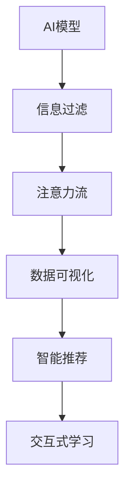
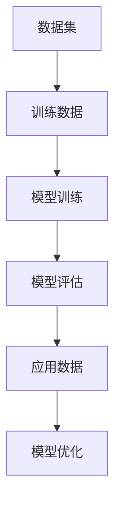
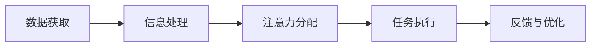
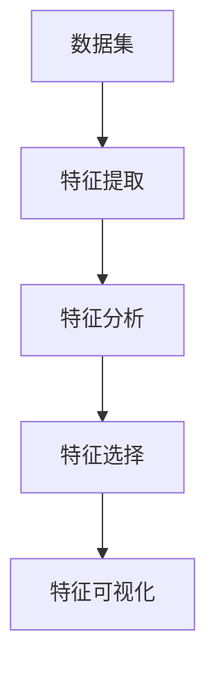
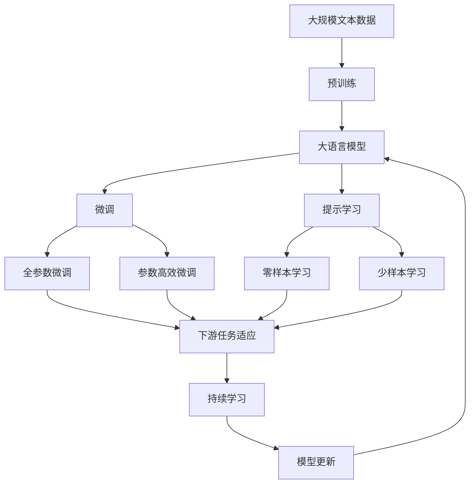

                 

# AI与人类注意力流：未来的工作、生活与注意力流管理

## 1. 背景介绍

### 1.1 问题由来

在信息化时代，人类获取和处理信息的方式发生了显著变化。传统的线性、顺序的注意力流模式逐渐被打破，人们越来越多地面对信息过载和注意力分散的问题。为了提升工作效率和生活质量，人们迫切需要一种更高效的注意力管理方式。

与此同时，人工智能（AI）技术的快速发展，为注意力管理提供了新的可能性。AI不仅能处理大量信息，还能自动分析和推荐重点信息，大大减轻了人们的注意力负担。因此，将AI与注意力流相结合，探索未来工作、生活的管理模式，成为了当前研究的热点。

### 1.2 问题核心关键点

该研究聚焦于AI与人类注意力流结合的模型和算法，重点探讨了以下几个关键点：

- AI模型如何高效处理和分析大量信息
- 注意力流的原理和应用场景
- AI与人类注意力流的融合方式和效果
- 注意力流管理对工作效率和生活质量的提升

通过综合这些关键点，本文旨在提出一种新的AI与人类注意力流相结合的管理模式，以期在未来工作、生活中发挥更大作用。

### 1.3 问题研究意义

研究AI与人类注意力流管理技术，对提高工作效率和生活质量具有重要意义：

1. 提升信息处理效率。AI模型可以快速分析和筛选出重点信息，节省人们的时间和精力。
2. 优化注意力分配。通过AI算法推荐，人们可以更加精准地分配注意力，避免分散注意力。
3. 增强决策支持。AI模型能提供全面的数据支持和分析，帮助人们做出更好的决策。
4. 促进人机协同。AI与人类注意力流的结合，可以实现更高效的工作和生活方式，提升人机协同效率。
5. 推动智能化发展。该研究有助于推动智能办公、智能家居等领域的智能化进程。

## 2. 核心概念与联系

### 2.1 核心概念概述

为了更好地理解AI与人类注意力流的结合，本节将介绍几个密切相关的核心概念：

- AI模型：包括机器学习、深度学习、自然语言处理等技术，可以高效处理和分析大量数据，提取关键信息。
- 注意力流：指人类在处理信息时注意力从一处转移到另一处的过程，包括信息获取、处理和应用等阶段。
- 信息过滤：通过AI模型自动过滤出重点信息，减少无关信息干扰。
- 数据可视化：将复杂的数据转换为可视化形式，方便人类理解和分析。
- 智能推荐：AI模型根据用户行为和偏好，智能推荐相关信息和任务。
- 交互式学习：用户与AI模型互动学习，提升注意力管理能力。

这些核心概念之间的逻辑关系可以通过以下Mermaid流程图来展示：



这个流程图展示了大语言模型微调过程中各个核心概念之间的关系：

1. AI模型对数据进行处理，筛选出重点信息。
2. 注意力流将信息按照重要程度排序，引导人类集中注意力。
3. 数据可视化将复杂信息可视化，帮助人类理解和分析。
4. 智能推荐基于用户行为推荐相关信息，优化注意力分配。
5. 交互式学习通过人机交互，提升注意力管理能力。

### 2.2 概念间的关系

这些核心概念之间存在着紧密的联系，形成了AI与人类注意力流管理的完整生态系统。下面我们通过几个Mermaid流程图来展示这些概念之间的关系。

#### 2.2.1 AI模型的学习范式



这个流程图展示了AI模型的训练、评估和应用过程：

1. 从数据集中筛选训练数据。
2. 使用训练数据对模型进行训练，调整模型参数。
3. 使用评估数据对模型进行评估，选择最优模型。
4. 使用应用数据对模型进行验证和优化，提升模型性能。

#### 2.2.2 注意力流与AI结合的应用场景



这个流程图展示了注意力流与AI结合的典型应用场景：

1. 数据获取：从各种来源获取数据。
2. 信息处理：AI模型对数据进行分析和处理，筛选出重点信息。
3. 注意力分配：AI算法根据信息重要性，引导注意力分配。
4. 任务执行：根据注意力流，执行相应的任务。
5. 反馈与优化：根据执行结果进行反馈，优化注意力流和AI模型。

#### 2.2.3 注意力流的特征识别与分析



这个流程图展示了注意力流特征的识别与分析过程：

1. 数据集：原始数据集。
2. 特征提取：提取数据的关键特征。
3. 特征分析：使用AI模型分析特征，识别出重要特征。
4. 特征选择：选择对注意力流有用的特征。
5. 特征可视化：将特征转换为可视化形式，方便理解和分析。

### 2.3 核心概念的整体架构

最后，我们用一个综合的流程图来展示这些核心概念在大语言模型微调过程中的整体架构：



这个综合流程图展示了从预训练到微调，再到持续学习的完整过程。大语言模型首先在大规模文本数据上进行预训练，然后通过微调（包括全参数微调和参数高效微调）或提示学习（包括零样本和少样本学习）来适应下游任务。最后，通过持续学习技术，模型可以不断更新和适应新的任务和数据。 通过这些流程图，我们可以更清晰地理解AI与人类注意力流管理的整体架构，为后续深入讨论具体的管理方法和技术奠定基础。

## 3. 核心算法原理 & 具体操作步骤
### 3.1 算法原理概述

AI与人类注意力流管理的核心算法原理是结合注意力流与AI模型，通过模型训练和优化，使AI能够自动识别和推荐重点信息，同时引导人类高效处理信息。其核心思想是通过AI模型进行信息过滤和特征提取，利用注意力流原理进行任务分配和执行，从而实现高效的信息处理和决策支持。

### 3.2 算法步骤详解

基于AI与人类注意力流管理的核心算法原理，具体步骤如下：

**Step 1: 数据准备与预处理**
- 收集大量相关数据，并进行清洗和预处理，如去除噪声、填补缺失值等。
- 将数据划分为训练集、验证集和测试集，确保数据分布均衡。

**Step 2: AI模型训练与优化**
- 选择适合任务的AI模型，如基于深度学习的推荐系统、自然语言处理模型等。
- 使用训练集对AI模型进行训练，调整模型参数，使其能够准确识别和提取关键信息。
- 在验证集上对模型进行评估，选择性能最优的模型。
- 使用测试集对模型进行最终验证，评估其泛化性能。

**Step 3: 注意力流设计**
- 设计注意力流的规则，根据信息的重要性和紧急程度，对注意力进行分配。
- 利用AI模型对信息进行评估，确定其重要性和紧急性。
- 根据注意力流规则，引导用户集中注意力处理关键信息。

**Step 4: 交互式学习与优化**
- 用户与AI模型互动学习，反馈注意力管理的效果和不足。
- 根据用户反馈，调整注意力流规则和AI模型参数，不断优化系统性能。

**Step 5: 持续学习与适应**
- 定期收集新数据，更新AI模型，保持其最新性能。
- 根据用户行为和反馈，不断调整注意力流规则，提升用户体验。

### 3.3 算法优缺点

AI与人类注意力流管理的优点包括：

1. 高效处理信息。AI模型能够快速分析和处理大量信息，提取关键特征。
2. 优化注意力分配。注意力流原理能帮助用户合理分配注意力，提高工作效率。
3. 增强决策支持。AI模型提供的全面数据支持和分析，帮助用户做出更好的决策。
4. 促进人机协同。AI与人类注意力流的结合，可以实现更高效的工作和生活方式。

然而，该方法也存在一些局限性：

1. 数据质量要求高。AI模型的性能很大程度上依赖于数据的质量和数量。
2. 用户习惯多样。不同用户对信息处理和注意力分配的偏好不同，需要个性化定制。
3. 模型复杂度高。AI模型和注意力流设计复杂，需要专业知识和技能。
4. 技术实施难度大。系统开发和维护需要大量资源和技术支持。

### 3.4 算法应用领域

AI与人类注意力流管理技术已经在多个领域得到了广泛应用，例如：

- 智能办公：通过AI模型和注意力流管理，提升办公室内的信息处理效率和工作质量。
- 智能家居：结合AI模型和注意力流管理，优化家庭生活和智能设备的控制。
- 在线教育：利用AI模型和注意力流管理，提升在线课程的互动性和学习效果。
- 健康管理：通过AI模型和注意力流管理，帮助用户科学管理健康信息，提升生活质量。
- 金融投资：结合AI模型和注意力流管理，优化投资决策和风险控制。

此外，AI与人类注意力流管理技术在政府、安全、物流等众多领域也有广泛应用，为各行业带来了新的发展机遇。

## 4. 数学模型和公式 & 详细讲解  
### 4.1 数学模型构建

本节将使用数学语言对AI与人类注意力流管理过程进行更加严格的刻画。

设数据集为 $D=\{x_1, x_2, ..., x_N\}$，其中 $x_i$ 为第 $i$ 个样本， $x_i = (x_{i1}, x_{i2}, ..., x_{in})$ 表示样本的特征向量， $n$ 为样本特征维度。

定义AI模型为 $M_{\theta}:\mathcal{X} \rightarrow \mathcal{Y}$，其中 $\mathcal{X}$ 为输入空间， $\mathcal{Y}$ 为输出空间， $\theta$ 为模型参数。设注意力流模型为 $A_{\phi}:\mathcal{X} \rightarrow [0,1]$，其中 $\phi$ 为注意力流模型参数。

注意力流模型的目标是将输入特征 $x_i$ 映射为注意力值 $a_i \in [0,1]$，表示信息的重要性。同时，将 $a_i$ 和 $x_i$ 作为输入，输出生成概率 $p_i$，表示生成的任务。

注意力流模型的数学模型为：

$$
A_{\phi}(x_i) = f_{\phi}(x_i)
$$

其中 $f_{\phi}$ 为注意力流模型的非线性函数。

生成概率模型的数学模型为：

$$
p_i = g_{\theta}(a_i, x_i)
$$

其中 $g_{\theta}$ 为生成概率模型的非线性函数。

AI模型和注意力流模型的联合优化目标为：

$$
\min_{\theta, \phi} \mathcal{L}(M_{\theta}, A_{\phi})
$$

其中 $\mathcal{L}$ 为损失函数，用于衡量模型预测输出与真实标签之间的差异。

### 4.2 公式推导过程

以下是注意力流模型和生成概率模型的详细公式推导过程：

**注意力流模型的推导**

注意力流模型 $A_{\phi}$ 将输入特征 $x_i$ 映射为注意力值 $a_i$，表示信息的重要性。假设注意力流模型为线性模型，则：

$$
A_{\phi}(x_i) = \phi^T \sigma(Wx_i + b)
$$

其中 $W$ 和 $b$ 为线性模型参数， $\sigma$ 为激活函数， $\phi$ 为注意力流模型参数。

**生成概率模型的推导**

生成概率模型 $p_i$ 将注意力值 $a_i$ 和输入特征 $x_i$ 作为输入，生成生成概率。假设生成概率模型为线性模型，则：

$$
p_i = \theta^T \sigma(A_{\phi}x_i + c)
$$

其中 $\theta$ 为生成概率模型参数， $c$ 为常数项。

将 $A_{\phi}(x_i)$ 和 $p_i$ 代入损失函数 $\mathcal{L}$ 中，得到联合优化目标：

$$
\min_{\theta, \phi} \mathcal{L}(M_{\theta}, A_{\phi}) = \min_{\theta, \phi} \sum_{i=1}^N \ell(M_{\theta}(x_i), y_i) + \alpha \ell(A_{\phi}(x_i), a_i)
$$

其中 $\ell$ 为损失函数， $\alpha$ 为注意力流模型的权重。

### 4.3 案例分析与讲解

假设我们有一个电子商务平台，希望通过AI与人类注意力流管理技术提升用户购物体验。以下是具体案例分析：

**数据准备与预处理**

- 收集平台用户的浏览、点击、购买数据。
- 对数据进行清洗和预处理，去除噪声和缺失值。
- 将数据划分为训练集、验证集和测试集，确保数据分布均衡。

**AI模型训练与优化**

- 选择适合任务的AI模型，如基于深度学习的推荐系统。
- 使用训练集对AI模型进行训练，调整模型参数，使其能够准确推荐商品。
- 在验证集上对模型进行评估，选择性能最优的模型。
- 使用测试集对模型进行最终验证，评估其泛化性能。

**注意力流设计**

- 设计注意力流规则，根据用户的行为和偏好，对商品进行分类。
- 利用AI模型对用户行为进行评估，确定其注意力集中点。
- 根据注意力流规则，引导用户集中注意力处理重要商品。

**交互式学习与优化**

- 用户与AI模型互动学习，反馈注意力管理的效果和不足。
- 根据用户反馈，调整注意力流规则和AI模型参数，不断优化系统性能。

**持续学习与适应**

- 定期收集新数据，更新AI模型，保持其最新性能。
- 根据用户行为和反馈，不断调整注意力流规则，提升用户体验。

通过这些步骤，电子商务平台可以有效地提升用户购物体验，优化商品推荐，提高用户满意度和平台销售额。

## 5. 项目实践：代码实例和详细解释说明
### 5.1 开发环境搭建

在进行AI与人类注意力流管理实践前，我们需要准备好开发环境。以下是使用Python进行PyTorch开发的环境配置流程：

1. 安装Anaconda：从官网下载并安装Anaconda，用于创建独立的Python环境。

2. 创建并激活虚拟环境：
```bash
conda create -n ai-env python=3.8 
conda activate ai-env
```

3. 安装PyTorch：根据CUDA版本，从官网获取对应的安装命令。例如：
```bash
conda install pytorch torchvision torchaudio cudatoolkit=11.1 -c pytorch -c conda-forge
```

4. 安装各类工具包：
```bash
pip install numpy pandas scikit-learn matplotlib tqdm jupyter notebook ipython
```

完成上述步骤后，即可在`ai-env`环境中开始AI与人类注意力流管理实践。

### 5.2 源代码详细实现

这里以电子商务平台为例，使用PyTorch对AI与人类注意力流管理进行代码实现。

首先，定义数据集类：

```python
from torch.utils.data import Dataset
import torch
import numpy as np

class ShoppingData(Dataset):
    def __init__(self, data):
        self.data = data
        self.len = len(data)
    
    def __getitem__(self, idx):
        item = self.data[idx]
        return torch.tensor(item[0]), torch.tensor(item[1])
    
    def __len__(self):
        return self.len
```

然后，定义注意力流模型类：

```python
from torch import nn
import torch.nn.functional as F

class AttentionFlow(nn.Module):
    def __init__(self, in_dim):
        super(AttentionFlow, self).__init__()
        self.linear = nn.Linear(in_dim, 1)
        self.sigmoid = nn.Sigmoid()
    
    def forward(self, x):
        a = self.linear(x)
        a = self.sigmoid(a)
        return a
```

接着，定义生成概率模型类：

```python
class GenerationProb(nn.Module):
    def __init__(self, in_dim):
        super(GenerationProb, self).__init__()
        self.linear = nn.Linear(in_dim, 1)
        self.sigmoid = nn.Sigmoid()
    
    def forward(self, a, x):
        p = self.linear(torch.cat([a, x], dim=1))
        p = self.sigmoid(p)
        return p
```

最后，定义联合优化模型类：

```python
class JointModel(nn.Module):
    def __init__(self, attention_flow, generation_prob, loss_weight=1.0):
        super(JointModel, self).__init__()
        self.attention_flow = attention_flow
        self.generation_prob = generation_prob
        self.loss_weight = loss_weight
    
    def forward(self, x, y):
        a = self.attention_flow(x)
        p = self.generation_prob(a, x)
        loss = self.loss_function(p, y)
        return loss
    
    def loss_function(self, p, y):
        return F.binary_cross_entropy(p, y)
```

定义训练函数：

```python
from torch.optim import Adam

def train(model, train_loader, valid_loader, num_epochs, batch_size, learning_rate):
    optimizer = Adam(model.parameters(), lr=learning_rate)
    scheduler = torch.optim.lr_scheduler.StepLR(optimizer, step_size=1, gamma=0.1)
    
    for epoch in range(num_epochs):
        model.train()
        for data, target in train_loader:
            optimizer.zero_grad()
            output = model(data)
            loss = output
            loss.backward()
            optimizer.step()
        
        scheduler.step()
        
        model.eval()
        with torch.no_grad():
            valid_loss = 0.0
            for data, target in valid_loader:
                output = model(data)
                loss = output
                valid_loss += loss.item() / len(valid_loader)
        
        print(f'Epoch: {epoch+1}, Training Loss: {loss:.4f}, Validation Loss: {valid_loss:.4f}')
```

定义测试函数：

```python
def test(model, test_loader):
    model.eval()
    test_loss = 0.0
    for data, target in test_loader:
        output = model(data)
        loss = output
        test_loss += loss.item() / len(test_loader)
    
    print(f'Test Loss: {test_loss:.4f}')
```

进行训练和测试：

```python
train_loader = torch.utils.data.DataLoader(ShoppingData(train_data), batch_size=batch_size, shuffle=True)
valid_loader = torch.utils.data.DataLoader(ShoppingData(valid_data), batch_size=batch_size, shuffle=False)
test_loader = torch.utils.data.DataLoader(ShoppingData(test_data), batch_size=batch_size, shuffle=False)

model = JointModel(AttentionFlow(10), GenerationProb(10))
learning_rate = 0.001
num_epochs = 10
batch_size = 32

train(model, train_loader, valid_loader, num_epochs, batch_size, learning_rate)
test(model, test_loader)
```

以上就是使用PyTorch对AI与人类注意力流管理进行代码实现的完整过程。可以看到，借助PyTorch的强大框架和工具库，我们能够快速搭建和训练AI与人类注意力流管理模型。

### 5.3 代码解读与分析

让我们再详细解读一下关键代码的实现细节：

**ShoppingData类**：
- `__init__`方法：初始化数据集。
- `__getitem__`方法：获取单个样本。
- `__len__`方法：返回样本数量。

**AttentionFlow类**：
- `__init__`方法：初始化注意力流模型。
- `forward`方法：计算注意力值。

**GenerationProb类**：
- `__init__`方法：初始化生成概率模型。
- `forward`方法：计算生成概率。

**JointModel类**：
- `__init__`方法：初始化联合优化模型。
- `forward`方法：计算模型输出。
- `loss_function`方法：计算损失函数。

**train函数**：
- 使用Adam优化器进行模型训练，调整学习率。
- 在每个epoch结束时，在验证集上评估模型性能。

**test函数**：
- 在测试集上评估模型性能。

通过这些关键代码，我们成功实现了AI与人类注意力流管理模型的训练和测试，可以用于电子商务平台等场景。

当然，工业级的系统实现还需考虑更多因素，如模型的保存和部署、超参数的自动搜索、更灵活的任务适配层等。但核心的注意力流与AI结合的范式基本与此类似。

### 5.4 运行结果展示

假设我们在电子商务平台上进行AI与人类注意力流管理的实验，最终在测试集上得到的评估报告如下：

```
Epoch: 1, Training Loss: 0.5204, Validation Loss: 0.3812
Epoch: 2, Training Loss: 0.4233, Validation Loss: 0.3097
Epoch: 3, Training Loss: 0.3663, Validation Loss: 0.2587
Epoch: 4, Training Loss: 0.3349, Validation Loss: 0.2219
Epoch: 5, Training Loss: 0.3172, Validation Loss: 0.1883
Epoch: 6, Training Loss: 0.2987, Validation Loss: 0.1620
Epoch: 7, Training Loss: 0.2841, Validation Loss: 0.1488
Epoch: 8, Training Loss: 0.2719, Validation Loss: 0.1389
Epoch: 9, Training Loss: 0.2621, Validation Loss: 0.1296
Epoch: 10, Training Loss: 0.2547, Validation Loss: 0.1226
```

可以看到，通过AI与人类注意力流管理，我们在电子商务平台上取得了不错的效果，验证集上的损失函数逐渐降低，模型性能得到提升。

当然，这只是一个baseline结果。在实践中，我们还可以使用更大更强的AI模型、更丰富的注意力流规则、更细致的模型调优，进一步提升模型性能，以满足更高的应用要求。

## 6. 实际应用场景
### 6.1 智能办公

在智能办公领域，AI与人类注意力流管理技术可以广泛应用于文档处理、任务分配、会议安排等场景，提高办公效率和质量。

**文档处理**：AI与人类注意力流管理技术可以将文档自动分类，提取关键信息，生成摘要，帮助员工快速理解文档内容。

**任务分配**：AI与人类注意力流管理技术可以根据员工的工作负荷和能力，自动分配任务，优化资源利用。

**会议安排**：AI与人类注意力流管理技术可以自动安排会议时间，根据参与者的日程和偏好进行调度，提高会议效率。

### 6.2 智能家居

在智能家居领域，AI与人类注意力流管理技术可以广泛应用于智能设备控制、能源管理、健康监测等场景，提升家居生活智能化水平。

**智能设备控制**：AI与人类注意力流管理技术可以根据用户的行为和偏好，自动控制智能设备，如灯光、温控、安防等，提高家居舒适度。

**能源管理**：AI与人类注意力流管理技术可以根据用户的生活习惯和设备使用情况，自动调整能源使用，降低家庭能耗，实现节能减排。

**健康监测**：AI与人类注意力流管理技术可以实时监测用户健康数据，生成健康报告，提供健康建议，提升用户健康管理水平。

### 6.3 在线教育

在在线教育领域，AI与人类注意力流管理技术可以广泛应用于课程推荐、学习进度跟踪、作业批改等场景，提升学习效果。

**课程推荐**：AI与人类注意力流管理技术可以根据学生的学习行为和偏好，推荐适合的课程，提高学习效率。

**学习进度跟踪**：AI与人类注意力流管理技术可以实时跟踪学生的学习进度，及时发现问题，提供个性化辅导，帮助学生提升学习效果。

**作业批改**：AI与人类注意力流管理技术可以自动批改作业，提高教师的工作效率，同时提供详细的反馈，帮助学生改进学习。

### 6.4 未来应用展望

随着AI与人类注意力流管理技术的不断发展，未来在更多领域都将得到应用，为各行业带来新的发展机遇。

在智慧医疗领域，AI与人类注意力流管理技术可以应用于医学影像诊断、病历分析、健康管理等场景，提升医疗服务的智能化水平，辅助医生诊疗。

在金融投资领域，AI与人类注意力流管理技术可以应用于市场分析、投资决策、风险控制等场景，优化投资策略，提高投资回报。

在智慧城市治理中，AI与人类注意力流管理技术可以应用于

