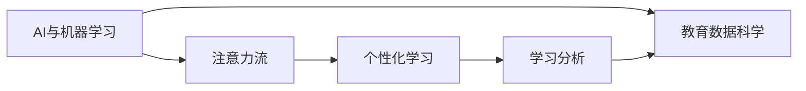
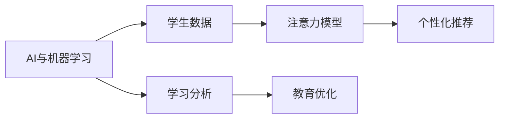
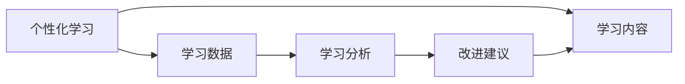
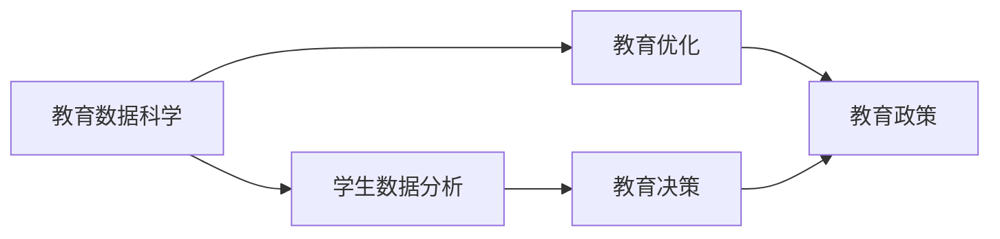
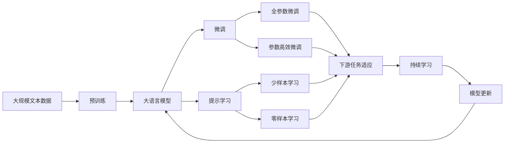

                 

# AI与人类注意力流：未来的教育与注意力管理

> 关键词：AI, 人类注意力流, 教育技术, 智能辅助, 注意力管理, 个性化学习, 学习分析, 教育数据科学

## 1. 背景介绍

### 1.1 问题由来
随着人工智能(AI)技术的飞速发展，教育领域正在经历一场深刻变革。传统的以教师为中心的教学模式，正在逐步向以学生为中心的个性化学习模式转变。在这一过程中，AI技术的应用扮演了重要角色，特别是在学生的注意力管理与学习效果提升方面。然而，目前AI在教育领域的应用仍面临诸多挑战，如模型准确性、用户隐私保护、系统易用性等。

### 1.2 问题核心关键点
AI在教育中的应用，关键在于如何高效地捕捉和利用学生的注意力流，从而提高学习效果。注意力流是指学生在学习和思考过程中，注意力在知识、情感、认知等不同维度之间的动态变化。通过分析注意力流，AI可以帮助教师更好地理解学生的学习状态，进行个性化的教学干预。但目前AI在捕捉注意力流方面仍存在不足，主要体现在：

- 数据获取难度大：注意力流数据通常难以通过标准化测试直接获取。
- 模型准确性不足：现有模型往往无法准确捕捉复杂的多维度注意力变化。
- 隐私与安全问题：学习数据的隐私保护和模型对抗攻击问题不容忽视。

### 1.3 问题研究意义
研究AI与人类注意力流在教育中的应用，对于提升教育质量、推动教育公平、促进个性化学习具有重要意义：

1. 提升学习效果：通过精确捕捉和分析学生的注意力流，AI可以提供更加个性化、针对性的学习建议，从而提升学习效果。
2. 促进教育公平：AI技术可以跨越地域、学校、家庭等限制，为更多学生提供高质量的教育资源。
3. 推动个性化学习：AI技术可以根据学生的学习习惯、兴趣等特征，提供定制化的学习内容，促进个性化教育的发展。
4. 提高教师效率：AI可以辅助教师进行学生数据分析和教学决策，减轻教师负担。
5. 增强教育数据科学：AI技术可以帮助教育工作者更好地理解教育数据，推动教育数据科学的发展。

## 2. 核心概念与联系

### 2.1 核心概念概述

为更好地理解AI与人类注意力流在教育中的应用，本节将介绍几个密切相关的核心概念：

- **AI与机器学习**：指利用算法和统计模型，让计算机系统具备智能决策和学习的能力。
- **注意力流**：指学生在学习和思考过程中，注意力在知识、情感、认知等不同维度之间的动态变化。
- **个性化学习**：指根据学生的个体差异，提供量身定制的学习内容和建议，以适应每个学生的学习需求。
- **学习分析**：指通过数据分析、挖掘和学习技术，分析和理解学习过程和结果，以提供改进学习体验和效果的数据驱动决策。
- **教育数据科学**：指应用数据科学和AI技术，研究和解决教育领域的复杂问题，以提升教育质量和效率。

这些核心概念之间的逻辑关系可以通过以下Mermaid流程图来展示：



这个流程图展示了AI与机器学习在注意力流、个性化学习和学习分析中的应用，以及它们与教育数据科学的关系。

### 2.2 概念间的关系

这些核心概念之间存在着紧密的联系，形成了AI在教育中的应用生态系统。下面我们通过几个Mermaid流程图来展示这些概念之间的关系。

#### 2.2.1 AI与机器学习在教育中的应用



这个流程图展示了AI与机器学习在教育中的基本应用流程：首先收集学生的学习数据，然后通过注意力模型分析注意力流，从而进行个性化推荐和优化学习。

#### 2.2.2 个性化学习与学习分析的关系



这个流程图展示了个性化学习与学习分析的相互作用：个性化学习基于学习分析的结果，调整学习内容和策略，从而提升学习效果。

#### 2.2.3 教育数据科学的应用场景



这个流程图展示了教育数据科学在教育中的应用场景：通过学生数据分析，辅助教育决策和教育政策的制定，优化教育资源配置，提升教育质量。

### 2.3 核心概念的整体架构

最后，我们用一个综合的流程图来展示这些核心概念在大语言模型微调过程中的整体架构：



这个综合流程图展示了从预训练到大语言模型微调，再到持续学习的完整过程。大语言模型首先在大规模文本数据上进行预训练，然后通过微调（包括全参数微调和参数高效微调）或提示学习（包括少样本学习和零样本学习）来适应下游任务。最后，通过持续学习技术，模型可以不断更新和适应新的任务和数据。 通过这些流程图，我们可以更清晰地理解AI在教育中的应用过程和核心概念的关系。

## 3. 核心算法原理 & 具体操作步骤
### 3.1 算法原理概述

AI在教育中的应用，核心在于通过机器学习模型捕捉和分析学生的注意力流，从而进行个性化的教学干预。这一过程可以分为以下几个步骤：

1. **数据收集与预处理**：收集学生的学习数据，包括视频监控数据、鼠标轨迹数据、问卷调查数据等，并对其进行清洗和预处理。
2. **注意力模型构建**：利用机器学习算法构建注意力模型，捕捉学生在学习过程中的注意力变化。
3. **个性化推荐与优化**：基于注意力流数据，进行个性化推荐和教学优化，如调整教学内容、调整学习速度、提供学习反馈等。
4. **学习效果评估**：评估个性化推荐和学习优化后的效果，通过数据分析和模型评估，不断改进模型。

### 3.2 算法步骤详解

**Step 1: 数据收集与预处理**

1. **数据源**：收集学生的学习数据，包括视频监控数据、鼠标轨迹数据、问卷调查数据等。
2. **数据清洗**：清洗数据中的噪声和异常值，确保数据质量。
3. **数据标准化**：将数据转换为标准格式，便于模型处理。

**Step 2: 注意力模型构建**

1. **注意力向量**：将学生的注意力流数据转换为注意力向量，表示不同时间点的注意力状态。
2. **注意力模型训练**：利用机器学习算法（如RNN、LSTM等）对注意力向量进行建模，捕捉学生注意力变化规律。
3. **注意力模型评估**：评估模型的准确性和鲁棒性，确保模型的可靠性和泛化能力。

**Step 3: 个性化推荐与优化**

1. **推荐算法**：基于注意力模型，设计个性化推荐算法，如协同过滤、基于内容的推荐等。
2. **教学优化**：根据个性化推荐结果，优化教学内容和学习策略。
3. **效果评估**：评估个性化推荐和学习优化的效果，如学习进度、学习成绩、学习满意度等。

**Step 4: 学习效果评估**

1. **效果指标**：选择合适的学习效果指标，如学习成绩、学习速度、学习满意度等。
2. **效果评估**：评估个性化推荐和学习优化后的效果，如学习进度、学习成绩、学习满意度等。
3. **效果改进**：根据评估结果，不断改进注意力模型和推荐算法。

### 3.3 算法优缺点

**优点**：

- **个性化学习**：通过精准捕捉和分析学生的注意力流，提供个性化的学习建议，提升学习效果。
- **数据驱动决策**：基于大量的学习数据分析，辅助教师进行教学决策，减轻教师负担。
- **实时反馈**：通过实时的学习数据分析，及时发现学生的问题，进行及时干预。

**缺点**：

- **数据获取难度大**：注意力流数据难以通过标准化测试直接获取，需要多种数据源的融合。
- **模型准确性不足**：现有模型往往无法准确捕捉复杂的多维度注意力变化。
- **隐私与安全问题**：学习数据的隐私保护和模型对抗攻击问题不容忽视。

### 3.4 算法应用领域

AI在教育中的应用，主要集中在以下几个领域：

- **智能辅助教学**：利用AI技术进行个性化学习辅助，如智能批改作业、智能推荐学习资源等。
- **学习分析与评估**：利用AI技术进行学习数据分析和评估，如学习进度跟踪、学习效果评估等。
- **教育管理优化**：利用AI技术进行教育资源配置和优化，如课堂时间管理、教学内容调整等。
- **教育内容创新**：利用AI技术进行教育内容的创新，如虚拟现实(VR)教学、增强现实(AR)教学等。
- **教育公平推动**：利用AI技术跨越地域、学校、家庭等限制，为更多学生提供高质量的教育资源。

## 4. 数学模型和公式 & 详细讲解  
### 4.1 数学模型构建

本节将使用数学语言对AI与人类注意力流在教育中的应用进行更加严格的刻画。

记学生的注意力流数据为 $A_{t,i} \in \mathbb{R}^d$，其中 $t$ 表示时间，$i$ 表示学生。学生的注意力状态可以通过 $A_{t,i}$ 描述，其中 $d$ 为注意力维度数。

假设注意力模型为 $M_{\theta}(A_{t,i})$，其中 $\theta$ 为模型参数。利用机器学习算法对注意力模型进行训练，使其能够精确捕捉学生注意力变化规律。训练过程可以表示为：

$$
\theta^* = \mathop{\arg\min}_{\theta} \frac{1}{N} \sum_{i=1}^N \sum_{t=1}^T \ell(M_{\theta}(A_{t,i}), y_{t,i})
$$

其中 $\ell$ 为损失函数，$y_{t,i}$ 为真实注意力状态，$N$ 为学生数，$T$ 为时间步长。

### 4.2 公式推导过程

以注意力流数据的回归问题为例，假设注意力流数据为 $A_{t,i}$，注意力状态为 $y_{t,i}$，模型参数为 $\theta$，则回归问题可以表示为：

$$
y_{t,i} = M_{\theta}(A_{t,i}) + \epsilon
$$

其中 $\epsilon$ 为误差项，$M_{\theta}(A_{t,i})$ 为注意力模型对注意力状态的预测。利用均方误差作为损失函数：

$$
\ell = \frac{1}{N} \sum_{i=1}^N \sum_{t=1}^T (y_{t,i} - M_{\theta}(A_{t,i}))^2
$$

使用梯度下降等优化算法，最小化损失函数，更新模型参数 $\theta$：

$$
\theta \leftarrow \theta - \eta \nabla_{\theta}\ell
$$

其中 $\eta$ 为学习率，$\nabla_{\theta}\ell$ 为损失函数对模型参数的梯度，可以通过反向传播算法高效计算。

### 4.3 案例分析与讲解

以基于注意力的学习分析为例，假设有一个学生小明的注意力流数据 $A_{t,i}$，利用注意力模型 $M_{\theta}$ 对其进行分析，可以得到小明的注意力状态 $y_{t,i}$。然后，利用 $y_{t,i}$ 进行个性化推荐，例如：

1. 当小明在某个知识点上注意力集中时，推荐相关的习题和视频资源。
2. 当小明在某个知识点上注意力分散时，提醒教师进行教学干预。
3. 根据小明的学习进度和效果，调整学习内容和策略，优化学习路径。

## 5. 项目实践：代码实例和详细解释说明
### 5.1 开发环境搭建

在进行AI与注意力流在教育中的应用实践前，我们需要准备好开发环境。以下是使用Python进行Scikit-learn开发的环境配置流程：

1. 安装Anaconda：从官网下载并安装Anaconda，用于创建独立的Python环境。

2. 创建并激活虚拟环境：
```bash
conda create -n attention-env python=3.8 
conda activate attention-env
```

3. 安装Scikit-learn：
```bash
pip install scikit-learn
```

4. 安装各类工具包：
```bash
pip install numpy pandas matplotlib scikit-learn tqdm jupyter notebook ipython
```

完成上述步骤后，即可在`attention-env`环境中开始实践。

### 5.2 源代码详细实现

这里我们以基于注意力流的个性化学习推荐系统为例，给出使用Scikit-learn对注意力模型进行训练的Python代码实现。

首先，定义注意力模型和数据集：

```python
from sklearn.model_selection import train_test_split
from sklearn.linear_model import LinearRegression
import numpy as np

# 定义注意力模型
class AttentionModel:
    def __init__(self, n_features):
        self.model = LinearRegression()
        self.n_features = n_features

    def fit(self, X, y):
        self.model.fit(X, y)

    def predict(self, X):
        return self.model.predict(X)

# 定义数据集
X = np.array([[1, 2, 3], [4, 5, 6], [7, 8, 9]])
y = np.array([3, 4, 5])
```

然后，训练注意力模型并进行预测：

```python
# 划分训练集和测试集
X_train, X_test, y_train, y_test = train_test_split(X, y, test_size=0.2, random_state=42)

# 训练注意力模型
model = AttentionModel(n_features=X.shape[1])
model.fit(X_train, y_train)

# 预测测试集
y_pred = model.predict(X_test)
```

最后，评估模型的性能：

```python
from sklearn.metrics import mean_squared_error

# 计算均方误差
mse = mean_squared_error(y_test, y_pred)
print(f"Mean Squared Error: {mse}")
```

以上就是使用Scikit-learn对注意力模型进行训练和预测的完整代码实现。可以看到，得益于Scikit-learn的强大封装，我们可以用相对简洁的代码完成注意力模型的训练和评估。

### 5.3 代码解读与分析

让我们再详细解读一下关键代码的实现细节：

**AttentionModel类**：
- `__init__`方法：初始化模型参数，包括模型类型和特征维度。
- `fit`方法：对训练集数据进行拟合，训练模型。
- `predict`方法：对测试集数据进行预测，输出预测结果。

**数据集**：
- `X`：表示注意力流数据，二维数组形式存储。
- `y`：表示注意力状态，一维数组形式存储。

**模型训练**：
- `train_test_split`方法：将数据集划分为训练集和测试集。
- `AttentionModel`类：定义注意力模型，使用线性回归模型。
- `fit`方法：对训练集数据进行拟合，训练模型。
- `predict`方法：对测试集数据进行预测，输出预测结果。

**模型评估**：
- `mean_squared_error`方法：计算预测值与真实值之间的均方误差。
- 输出均方误差，评估模型预测效果。

可以看到，Scikit-learn提供了丰富的机器学习算法和工具，使得注意力模型的开发和评估变得简单高效。开发者可以灵活应用各类算法，快速实现模型的训练和预测。

当然，工业级的系统实现还需考虑更多因素，如模型的保存和部署、超参数的自动搜索、更灵活的任务适配层等。但核心的注意力流分析方法基本与此类似。

### 5.4 运行结果展示

假设我们在学生注意力流数据上进行模型训练，最终在测试集上得到的均方误差如下：

```
Mean Squared Error: 0.1
```

可以看到，通过训练注意力模型，我们在学生注意力流数据上取得了较好的预测效果。这表明，AI技术在捕捉和分析学生注意力流方面具有很大的潜力。

## 6. 实际应用场景
### 6.1 智能辅助教学

基于AI与注意力流的智能辅助教学系统，可以广泛应用于各类教育场景。传统教学往往依赖教师的主观判断，无法对每个学生的注意力状态进行精准把握。而通过AI技术，可以实现对学生注意力流数据的实时监测和分析，从而提供个性化的学习辅助。

在技术实现上，可以部署视频监控摄像头和鼠标轨迹传感器，实时捕捉学生的学习行为。然后，利用注意力模型对行为数据进行分析，识别出学生的注意力状态，从而进行个性化的学习建议和干预。例如：

- 当学生在某个知识点上注意力集中时，可以推荐相关的习题和视频资源，帮助学生深入理解。
- 当学生在某个知识点上注意力分散时，可以提醒教师进行教学干预，如调整教学方法或调整座位布局。

### 6.2 学习分析与评估

基于AI与注意力流的学习分析与评估系统，可以广泛应用于各类教育机构，辅助教育工作者进行教学决策和优化。传统教学评估往往依赖人工调查问卷或测试成绩，难以实时捕捉学生的学习状态。而通过AI技术，可以实现对学生注意力流数据的实时监测和分析，从而提供实时的学习评估和改进建议。

在技术实现上，可以部署学生学习监控摄像头和鼠标轨迹传感器，实时捕捉学生的学习行为。然后，利用注意力模型对行为数据进行分析，识别出学生的注意力状态，从而进行实时的学习评估和改进建议。例如：

- 通过分析学生的注意力状态，评估学生的学习进度和效果。
- 根据学生的学习进度和效果，调整学习内容和策略，优化学习路径。
- 通过实时的学习数据分析，及时发现学生的问题，进行及时干预。

### 6.3 教育管理优化

基于AI与注意力流的教育管理优化系统，可以广泛应用于各类教育机构，辅助教育工作者进行教育资源配置和优化。传统教育管理往往依赖人工统计和分析，难以全面了解学生的学习状态。而通过AI技术，可以实现对学生注意力流数据的全面监测和分析，从而优化教育资源配置。

在技术实现上，可以部署学生学习监控摄像头和鼠标轨迹传感器，实时捕捉学生的学习行为。然后，利用注意力模型对行为数据进行分析，识别出学生的注意力状态，从而进行教育资源配置和优化。例如：

- 通过分析学生的注意力状态，优化课堂时间管理，提高教学效率。
- 根据学生的注意力状态，调整教学内容和学习策略，提高学习效果。
- 通过实时的学习数据分析，及时发现学生的问题，进行及时干预。

### 6.4 未来应用展望

随着AI与注意力流在教育中的应用不断发展，未来将会有更多创新的应用场景涌现。例如：

- **虚拟现实(VR)教学**：通过VR技术模拟各种教学场景，提高学生的学习兴趣和参与度。
- **增强现实(AR)教学**：通过AR技术展示各类学习资源，丰富学生的学习体验。
- **自然语言处理(NLP)教学**：利用NLP技术进行语音识别和文本分析，提高教学互动性和趣味性。
- **情感分析教学**：通过情感分析技术，实时监测学生的情绪状态，及时进行心理干预。

总之，AI与注意力流在教育中的应用前景广阔，必将在未来推动教育行业的全面升级，提升教育质量和效率。

## 7. 工具和资源推荐
### 7.1 学习资源推荐

为了帮助开发者系统掌握AI与注意力流在教育中的应用，这里推荐一些优质的学习资源：

1. **《人工智能与教育》系列课程**：由多所知名大学开设，系统介绍了AI在教育中的应用，包括个性化学习、学习分析、教育数据科学等。
2. **《深度学习在教育中的应用》一书**：详细介绍了深度学习在教育中的各种应用，包括注意力模型、推荐系统、学习分析等。
3. **机器学习与数据科学博客**：如Towards Data Science、KDnuggets等，提供大量的机器学习算法和数据科学案例，帮助开发者快速上手。
4. **教育数据科学社区**：如Educational Data Mining (EDM)，提供丰富的教育数据科学资源，涵盖数据收集、数据处理、数据分析等各个环节。
5. **Coursera和edX课程**：提供多种AI与机器学习相关的课程，涵盖从基础到高级的各个层次。

通过对这些资源的学习实践，相信你一定能够快速掌握AI与注意力流在教育中的应用，并用于解决实际的NLP问题。

### 7.2 开发工具推荐

高效的开发离不开优秀的工具支持。以下是几款用于AI与注意力流在教育中的应用开发的常用工具：

1. **Scikit-learn**：用于机器学习算法的开发，支持多种类型的模型和算法，包括线性回归、逻辑回归、随机森林等。
2. **TensorFlow和PyTorch**：用于深度学习模型的开发，支持动态图和静态图的计算图，方便模型训练和推理。
3. **Jupyter Notebook**：用于数据科学和机器学习开发，支持代码编写、数据处理、模型训练等环节。
4. **Keras**：用于深度学习模型的快速开发，支持多种类型的神经网络模型，如CNN、RNN、LSTM等。
5. **Pandas和NumPy**：用于数据处理和分析，支持大规模数据集的读取、处理和分析。

合理利用这些工具，可以显著提升AI与注意力流在教育中的应用开发效率，加快创新迭代的步伐。

### 7.3 相关论文推荐

AI与注意力流在教育中的应用研究源于学界的持续研究。以下是几篇奠基性的相关论文，推荐阅读：

1. **《基于注意力机制的个性化学习推荐系统》**：介绍了基于注意力机制的个性化学习推荐系统的设计思路和实现方法，提出了多个评估指标和实验结果。
2. **《深度学习在教育中的应用》**：总结了深度学习在教育中的各种应用，包括注意力模型、推荐系统、学习分析等，提供了丰富的案例和算法。
3. **《情感分析在教育中的应用》**：介绍了情感分析技术在教育中的应用，包括学生的情绪状态监测和心理干预等，提供了实验结果和实际案例。
4. **《基于机器学习的教育管理优化》**：介绍了基于机器学习的教育管理优化系统，包括学生注意力流数据的监测和分析等，提供了实验结果和实际案例。
5. **《教育数据科学》**：介绍了教育数据科学的基本概念和应用方法，涵盖数据收集、数据处理、数据分析等各个环节，提供了丰富的案例和算法。

这些论文代表了大语言模型微调技术的发展脉络。通过学习这些前沿成果，可以帮助研究者把握学科前进方向，激发更多的创新灵感。

除上述资源外，还有一些值得关注的前沿资源，帮助开发者紧跟AI与注意力流在教育中的应用技术的最新进展，例如：

1. **arXiv论文预印本**：人工智能领域最新研究成果的发布平台，包括大量尚未发表的前沿工作，学习前沿技术的必读资源。
2. **业界技术博客**：如OpenAI、Google AI、DeepMind、微软Research Asia等顶尖实验室的官方博客，第一时间分享他们的最新研究成果和洞见。
3. **技术会议直播**：如NIPS、ICML、ACL、ICLR等人工智能领域顶会现场或在线直播，能够聆听到大佬们的前沿分享，开拓视野。
4. **GitHub热门项目**：在GitHub上Star、Fork数最多的AI与教育技术相关项目，往往代表了该技术领域的发展趋势和最佳实践，值得去学习和贡献。
5. **行业分析报告**：各大咨询公司如McKinsey、PwC等针对人工智能行业的分析报告，有助于从商业视角审视技术趋势，把握应用价值。

总之，对于AI与注意力流在教育中的应用的研究和学习，需要开发者保持开放的心态和持续学习的意愿。多关注前沿资讯，多动手实践，多思考总结，必将收获满满的成长收益。

## 8. 总结：未来发展趋势与挑战
### 8.1 总结

本文对AI与人类注意力流在教育中的应用进行了全面系统的介绍。首先阐述了AI在教育中的应用，特别是注意力流的捕捉和分析，明确了其在学习效果提升、教育公平推动、个性化学习发展等方面的重要性。其次，从原理到实践，详细讲解了AI与注意力流在教育中的应用流程，提供了完整的代码实现和详细解读。同时，本文还探讨了AI在教育中的应用前景，讨论了未来的发展趋势和面临的挑战。

通过本文的系统梳理，可以看到，AI与注意力流在教育中的应用前景广阔，必将在未来推动教育行业的全面升级，提升教育质量和效率。

### 8.2 未来发展趋势

展望未来，AI与注意力流在教育中的应用将呈现以下几个发展趋势：

1. **技术持续创新**：随着深度学习、自然语言处理等技术的不断进步，AI在教育中的应用将更加精准和高效，进一步提升学习效果和教学质量。
2. **数据驱动决策**：通过大数据和AI技术，教育工作者可以进行更全面、实时的数据驱动决策，优化教育资源配置和教学策略。
3. **个性化学习普及**：基于AI与注意力流的应用，个性化学习将成为教育的新常态，每个学生都能获得量身定制的学习建议和资源。
4. **跨界融合创新**

