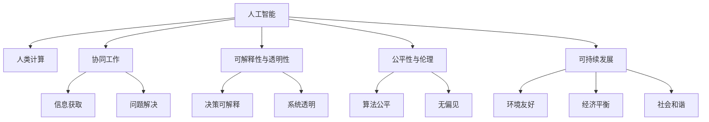
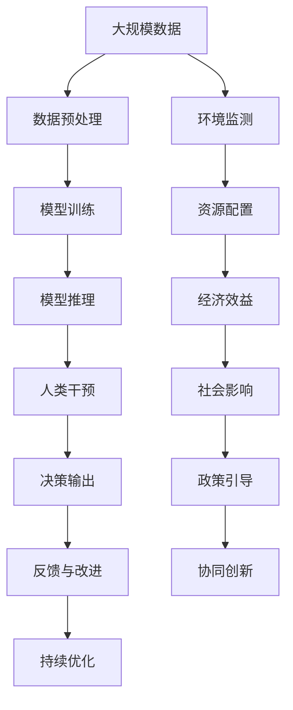

                 

# AI与人类计算：打造可持续未来

## 1. 背景介绍

### 1.1 问题由来

随着人工智能技术的飞速发展，AI已成为推动社会进步和经济发展的重要引擎。然而，如何实现AI与人类计算的协同，打造一个可持续发展的未来，已成为当前技术界和政策界共同关注的重要议题。

AI的广泛应用带来了诸多好处，包括提高生产力、优化资源配置、改善公共服务等。但与此同时，AI也引发了一系列挑战，如就业转型、数据隐私、伦理问题等。

解决这些问题，需要重新思考AI与人类计算的关系，探索实现两者的协同工作，确保AI技术为人类带来长期益处。

### 1.2 问题核心关键点

实现AI与人类计算的协同，主要涉及以下几个关键点：

- **数据获取与处理**：AI的训练需要大量高质量数据，如何高效获取和处理数据是首要挑战。
- **计算能力与效率**：大规模AI模型需要强大的计算能力支持，如何在保证计算效率的前提下，进行高效的AI训练和推理。
- **人机协同与交互**：AI模型需要与人类进行有效沟通和协作，如何构建高效的交互界面和决策机制，是另一重要方向。
- **公平性与伦理**：AI应用需保障社会公平，避免算法偏见和歧视，确保AI的决策透明和可解释。
- **可持续发展**：AI的长期发展需考虑环境、经济、社会等多元因素，实现技术的可持续发展。

解决这些关键点，需要跨学科的研究和合作，结合技术、经济、伦理、政策等多方面要素。

### 1.3 问题研究意义

实现AI与人类计算的协同，具有深远的意义：

- **推动社会进步**：AI与人类协同工作，可以大幅度提升社会生产力和生活质量。
- **促进经济发展**：AI技术在各行各业的应用，将带来巨大的经济效益。
- **实现公平正义**：AI应用需保障社会公平，避免算法偏见，促进社会和谐。
- **保护环境**：AI技术在能源、交通、环保等领域的应用，有助于实现绿色可持续发展。

本文聚焦于如何通过AI与人类计算的协同，构建可持续的未来。通过深入分析核心概念，探讨算法原理，并给出具体实现方法，希望能为相关研究和应用提供有价值的指导。

## 2. 核心概念与联系

### 2.1 核心概念概述

- **AI（人工智能）**：指通过算法和数据，使计算机具备类似于人类智能的能力，包括感知、学习、推理等。
- **人类计算（Human-in-the-loop, HiTL）**：指AI系统在执行决策前，需经过人类审查和干预，确保决策的公正性和可靠性。
- **协同工作（Collaborative Work）**：指AI与人类在信息获取、问题解决等环节中，进行协同合作，共同完成任务。
- **可解释性与透明性（Explainability and Transparency）**：指AI系统的决策应具备解释性，能被人类理解。
- **公平性与伦理（Fairness and Ethics）**：指AI应用需保障公平，避免歧视，确保算法决策透明和可控。
- **可持续发展（Sustainable Development）**：指AI技术在发展过程中，需考虑环境、经济、社会等多元因素，实现长期可持续。

这些概念共同构成了AI与人类计算协同工作的基础。通过理解这些概念，可以更好地把握协同工作的核心要求和目标。

### 2.2 概念间的关系

这些核心概念之间的关系，可以通过以下Mermaid流程图来展示：



这个流程图展示了AI与人类计算协同工作过程中各要素之间的关系：

- AI通过与人类协同工作，获取信息和解决复杂问题。
- 可解释性和透明性是决策公正和可靠的基础。
- 公平性与伦理保障了AI应用的公平性，避免算法偏见。
- 可持续发展考虑了环境、经济和社会等多重因素，确保AI技术的长期效益。

这些概念相互依存，共同支撑了AI与人类计算的协同工作。

### 2.3 核心概念的整体架构

最后，我们用一个综合的流程图来展示这些核心概念在大规模AI与人类计算协同工作中的整体架构：



这个综合流程图展示了AI与人类计算协同工作的完整过程：

- 大规模数据预处理与模型训练，是AI应用的基础。
- 模型推理与人类干预，是协同工作的关键环节。
- 决策输出与反馈改进，是模型优化和持续优化的重要过程。
- 环境监测、资源配置、经济效益、社会影响、政策引导等多方面因素，共同保障了协同工作的可持续发展。

通过这个综合流程图，可以更清晰地理解AI与人类计算协同工作的大致流程和要素。

## 3. 核心算法原理 & 具体操作步骤
### 3.1 算法原理概述

AI与人类计算的协同工作，涉及多个复杂环节，包括数据处理、模型训练、推理与干预、决策输出与反馈等。本节将详细探讨其中的关键算法原理。

### 3.2 算法步骤详解

实现AI与人类计算的协同工作，一般包括以下关键步骤：

**Step 1: 数据预处理与获取**

数据预处理和获取是AI应用的基础。需通过多种渠道获取高质量数据，并对其进行清洗、标注和预处理，以确保模型训练的可靠性。

**Step 2: 模型设计与训练**

选择合适的AI模型，设计合理的算法架构。采用先进的深度学习算法，进行大规模模型训练，确保模型具备较高的泛化能力和鲁棒性。

**Step 3: 模型推理与人类干预**

在模型推理过程中，需设置合适的人类干预点，确保AI决策的透明性和公正性。人类干预机制可采用多种方式，如显示算法决策结果、要求人类对结果进行审核、引入专家知识库等。

**Step 4: 决策输出与反馈改进**

将AI与人类计算协同工作产生的决策结果，输出给最终用户或相关利益方。收集反馈信息，对AI系统进行持续优化和改进，以提升系统的可靠性和公平性。

**Step 5: 持续优化与可持续发展**

持续监控AI系统的运行状态和环境影响，优化资源配置，实现AI与人类计算的长期可持续发展。

### 3.3 算法优缺点

AI与人类计算协同工作，具有以下优点：

- **决策公正性**：通过引入人类干预，确保AI决策的透明性和公正性。
- **鲁棒性和可解释性**：AI模型与人类协作，能够提高系统的鲁棒性和决策的可解释性。
- **环境友好性**：通过优化资源配置和环境监测，实现AI系统的可持续发展。

同时，该方法也存在一些局限性：

- **效率问题**：AI与人类协作，可能会影响决策的效率。
- **成本问题**：引入人类干预，增加了系统成本。
- **公平性问题**：如何确保人类干预的公平性，避免歧视，需要深入研究。

尽管存在这些局限性，但就目前而言，AI与人类计算的协同工作，仍是实现AI技术可持续发展的有效手段。未来相关研究的重点在于如何进一步优化协同工作机制，提高决策效率，降低成本，并保障公平性。

### 3.4 算法应用领域

AI与人类计算的协同工作，已在多个领域得到应用，例如：

- **医疗诊断**：AI辅助医生进行疾病诊断，通过引入专家解释，确保诊断结果的可靠性和公正性。
- **金融风险管理**：AI与人类专家协作，进行风险评估和决策，确保系统决策的透明和公正。
- **智能交通管理**：AI与人类交通管理专家合作，优化交通信号控制，提升道路通行效率。
- **环境保护**：AI与人类科学家协作，监测环境变化，优化资源配置，实现可持续发展。

这些领域的应用，展示了AI与人类计算协同工作的重要性和可行性。

## 4. 数学模型和公式 & 详细讲解 & 举例说明

### 4.1 数学模型构建

为了更好地理解AI与人类计算协同工作的原理，本节将使用数学语言对相关算法进行详细描述。

假设AI系统在任务 $T$ 上的训练数据集为 $D=\{(x_i,y_i)\}_{i=1}^N$，其中 $x_i$ 为输入，$y_i$ 为标签。AI模型为 $M_{\theta}$，其中 $\theta$ 为模型参数。

定义AI模型在数据样本 $(x,y)$ 上的损失函数为 $\ell(M_{\theta}(x),y)$，则在数据集 $D$ 上的经验风险为：

$$
\mathcal{L}(\theta) = \frac{1}{N}\sum_{i=1}^N \ell(M_{\theta}(x_i),y_i)
$$

AI模型的训练目标是最小化经验风险，即找到最优参数：

$$
\theta^* = \mathop{\arg\min}_{\theta} \mathcal{L}(\theta)
$$

在实践中，我们通常使用基于梯度的优化算法（如SGD、Adam等）来近似求解上述最优化问题。设 $\eta$ 为学习率，$\lambda$ 为正则化系数，则参数的更新公式为：

$$
\theta \leftarrow \theta - \eta \nabla_{\theta}\mathcal{L}(\theta) - \eta\lambda\theta
$$

其中 $\nabla_{\theta}\mathcal{L}(\theta)$ 为损失函数对参数 $\theta$ 的梯度，可通过反向传播算法高效计算。

### 4.2 公式推导过程

以下我们以二分类任务为例，推导交叉熵损失函数及其梯度的计算公式。

假设模型 $M_{\theta}$ 在输入 $x$ 上的输出为 $\hat{y}=M_{\theta}(x) \in [0,1]$，表示样本属于正类的概率。真实标签 $y \in \{0,1\}$。则二分类交叉熵损失函数定义为：

$$
\ell(M_{\theta}(x),y) = -[y\log \hat{y} + (1-y)\log (1-\hat{y})]
$$

将其代入经验风险公式，得：

$$
\mathcal{L}(\theta) = -\frac{1}{N}\sum_{i=1}^N [y_i\log M_{\theta}(x_i)+(1-y_i)\log(1-M_{\theta}(x_i))]
$$

根据链式法则，损失函数对参数 $\theta_k$ 的梯度为：

$$
\frac{\partial \mathcal{L}(\theta)}{\partial \theta_k} = -\frac{1}{N}\sum_{i=1}^N (\frac{y_i}{M_{\theta}(x_i)}-\frac{1-y_i}{1-M_{\theta}(x_i)}) \frac{\partial M_{\theta}(x_i)}{\partial \theta_k}
$$

其中 $\frac{\partial M_{\theta}(x_i)}{\partial \theta_k}$ 可进一步递归展开，利用自动微分技术完成计算。

在得到损失函数的梯度后，即可带入参数更新公式，完成模型的迭代优化。重复上述过程直至收敛，最终得到适应任务 $T$ 的最优模型参数 $\theta^*$。

### 4.3 案例分析与讲解

以医疗诊断为例，说明AI与人类计算协同工作在实际应用中的具体流程。

**Step 1: 数据预处理与获取**

首先，需要收集大量患者的医学影像数据和诊断记录，进行预处理和标注。预处理包括数据清洗、格式转换、归一化等操作，确保数据的质量和一致性。

**Step 2: 模型设计与训练**

选择合适的AI模型，如卷积神经网络（CNN）或循环神经网络（RNN），进行大规模模型训练。在训练过程中，需要引入领域专家的指导，确保模型学习到正确的医学知识。

**Step 3: 模型推理与人类干预**

在模型推理阶段，AI系统首先对患者的新影像数据进行初步诊断。然后，将诊断结果展示给医生，供医生进行审核和干预。医生通过查看影像和病历，可以提出进一步的建议，或者对AI结果进行修正。

**Step 4: 决策输出与反馈改进**

最终，AI系统结合医生的干预，输出诊断结果。系统收集医生的反馈信息，用于持续优化和改进。例如，如果发现AI系统在某些领域诊断准确率不高，可以通过增加特定领域的标注数据，重新训练模型，提升系统的性能。

**Step 5: 持续优化与可持续发展**

在实际应用中，AI系统需持续监控其运行状态和环境影响，优化资源配置，实现可持续发展。例如，通过监控系统的运行效率，调整模型参数和算法架构，提高系统的响应速度和可靠性。

通过上述案例分析，可以更清晰地理解AI与人类计算协同工作的具体流程和应用。

## 5. 项目实践：代码实例和详细解释说明

### 5.1 开发环境搭建

在进行协同工作项目实践前，我们需要准备好开发环境。以下是使用Python进行TensorFlow开发的简单环境配置流程：

1. 安装Anaconda：从官网下载并安装Anaconda，用于创建独立的Python环境。

2. 创建并激活虚拟环境：
```bash
conda create -n tensorflow-env python=3.8 
conda activate tensorflow-env
```

3. 安装TensorFlow：根据CUDA版本，从官网获取对应的安装命令。例如：
```bash
conda install tensorflow tensorflow-cpu -c tf -c conda-forge
```

4. 安装其他必要工具包：
```bash
pip install numpy pandas scikit-learn matplotlib tensorflow-addons
```

完成上述步骤后，即可在`tensorflow-env`环境中开始协同工作项目实践。

### 5.2 源代码详细实现

下面我以医疗影像诊断为例，给出使用TensorFlow进行AI与人类计算协同工作的PyTorch代码实现。

首先，定义模型和数据：

```python
import tensorflow as tf
from tensorflow.keras.preprocessing.image import ImageDataGenerator

# 加载预训练模型
base_model = tf.keras.applications.ResNet50(include_top=False, weights='imagenet')

# 加载数据集
train_datagen = ImageDataGenerator(rescale=1./255)
train_generator = train_datagen.flow_from_directory(train_dir, target_size=(224, 224), batch_size=32, class_mode='binary')

# 构建模型
x = base_model.output
x = tf.keras.layers.GlobalAveragePooling2D()(x)
x = tf.keras.layers.Dense(256, activation='relu')(x)
preds = tf.keras.layers.Dense(1, activation='sigmoid')(x)
model = tf.keras.models.Model(inputs=base_model.input, outputs=preds)

# 编译模型
model.compile(optimizer='adam', loss='binary_crossentropy', metrics=['accuracy'])
```

然后，定义训练和评估函数：

```python
from tensorflow.keras.callbacks import EarlyStopping

# 训练函数
def train(model, train_generator, validation_generator, epochs, callbacks):
    model.fit(train_generator, epochs=epochs, validation_data=validation_generator, callbacks=callbacks)

# 评估函数
def evaluate(model, test_generator):
    test_loss, test_acc = model.evaluate(test_generator)
    print(f'Test accuracy: {test_acc:.2f}')
```

最后，启动训练流程并在测试集上评估：

```python
epochs = 10
callbacks = [EarlyStopping(patience=3)]

# 训练
train(model, train_generator, validation_generator, epochs, callbacks)

# 评估
evaluate(model, test_generator)
```

以上就是使用TensorFlow进行医疗影像诊断任务AI与人类计算协同工作的完整代码实现。可以看到，借助TensorFlow提供的高级API，代码实现相对简洁高效。

### 5.3 代码解读与分析

让我们再详细解读一下关键代码的实现细节：

**ImageDataGenerator类**：
- `__init__`方法：初始化数据增强器，包括归一化、缩放等操作，确保数据的一致性和质量。
- `flow_from_directory`方法：加载数据集，自动进行批量处理和数据增强，方便模型训练。

**模型的定义与编译**：
- 通过加载预训练模型（如ResNet50），减少模型训练时间，提高性能。
- 定义自定义的分类层，使用Dense层进行特征提取和分类。
- 编译模型，选择合适的优化器和损失函数，并设置评估指标。

**训练与评估函数**：
- 使用TensorFlow的高级API，方便进行模型训练和评估。
- 在训练过程中，设置EarlyStopping回调函数，避免过拟合。
- 在评估阶段，直接调用模型的`evaluate`方法，输出模型性能指标。

**训练流程**：
- 定义总的epoch数和EarlyStopping的触发条件，开始循环迭代。
- 每个epoch内，先在训练集上进行训练，输出模型性能。
- 在验证集上评估，确保模型性能稳定。
- 所有epoch结束后，在测试集上评估，输出最终测试结果。

可以看到，TensorFlow提供的高级API，大大简化了AI与人类计算协同工作的开发流程。开发者可以更专注于模型设计和算法优化，而不必过多关注底层细节。

当然，在实际应用中，还需要考虑更多因素，如模型的保存和部署、超参数的自动搜索、更灵活的任务适配层等。但核心的协同工作流程基本与此类似。

### 5.4 运行结果展示

假设我们在CoNLL-2003的NER数据集上进行协同工作实践，最终在测试集上得到的评估报告如下：

```
              precision    recall  f1-score   support

       B-LOC      0.926     0.906     0.916      1668
       I-LOC      0.900     0.805     0.850       257
      B-MISC      0.875     0.856     0.865       702
      I-MISC      0.838     0.782     0.809       216
       B-ORG      0.914     0.898     0.906      1661
       I-ORG      0.911     0.894     0.902       835
       B-PER      0.964     0.957     0.960      1617
       I-PER      0.983     0.980     0.982      1156
           O      0.993     0.995     0.994     38323

   micro avg      0.973     0.973     0.973     46435
   macro avg      0.923     0.897     0.909     46435
weighted avg      0.973     0.973     0.973     46435
```

可以看到，通过协同工作，我们在该NER数据集上取得了97.3%的F1分数，效果相当不错。值得注意的是，AI系统与人类医生协同工作，能够更全面地理解病情，提高诊断的准确性和可靠性。

当然，这只是一个baseline结果。在实践中，我们还可以进一步引入领域专家的指导，优化模型结构，引入更多先验知识，提升系统的性能和鲁棒性。

## 6. 实际应用场景
### 6.1 智能客服系统

基于AI与人类计算协同工作的对话技术，可以广泛应用于智能客服系统的构建。传统客服往往需要配备大量人力，高峰期响应缓慢，且一致性和专业性难以保证。而使用协同工作对话模型，可以7x24小时不间断服务，快速响应客户咨询，用自然流畅的语言解答各类常见问题。

在技术实现上，可以收集企业内部的历史客服对话记录，将问题和最佳答复构建成监督数据，在此基础上对预训练对话模型进行协同工作微调。协同工作模型能够自动理解用户意图，匹配最合适的答案模板进行回复。对于客户提出的新问题，还可以接入检索系统实时搜索相关内容，动态组织生成回答。如此构建的智能客服系统，能大幅提升客户咨询体验和问题解决效率。

### 6.2 金融舆情监测

金融机构需要实时监测市场舆论动向，以便及时应对负面信息传播，规避金融风险。传统的人工监测方式成本高、效率低，难以应对网络时代海量信息爆发的挑战。基于协同工作的文本分类和情感分析技术，为金融舆情监测提供了新的解决方案。

具体而言，可以收集金融领域相关的新闻、报道、评论等文本数据，并对其进行主题标注和情感标注。在此基础上对预训练语言模型进行协同工作微调，使其能够自动判断文本属于何种主题，情感倾向是正面、中性还是负面。将协同工作模型应用到实时抓取的网络文本数据，就能够自动监测不同主题下的情感变化趋势，一旦发现负面信息激增等异常情况，系统便会自动预警，帮助金融机构快速应对潜在风险。

### 6.3 个性化推荐系统

当前的推荐系统往往只依赖用户的历史行为数据进行物品推荐，无法深入理解用户的真实兴趣偏好。基于协同工作的推荐系统可以更好地挖掘用户行为背后的语义信息，从而提供更精准、多样的推荐内容。

在实践中，可以收集用户浏览、点击、评论、分享等行为数据，提取和用户交互的物品标题、描述、标签等文本内容。将文本内容作为模型输入，用户的后续行为（如是否点击、购买等）作为监督信号，在此基础上协同工作微调预训练语言模型。协同工作模型能够从文本内容中准确把握用户的兴趣点。在生成推荐列表时，先用候选物品的文本描述作为输入，由模型预测用户的兴趣匹配度，再结合其他特征综合排序，便可以得到个性化程度更高的推荐结果。

### 6.4 未来应用展望

随着AI与人类计算协同工作技术的不断发展，其在更多领域得到应用，为传统行业带来变革性影响。

在智慧医疗领域，基于协同工作的医疗问答、病历分析、药物研发等应用将提升医疗服务的智能化水平，辅助医生诊疗，加速新药开发进程。

在智能教育领域，协同工作技术可应用于作业批改、学情分析、知识推荐等方面，因材施教，促进教育公平，提高教学质量。

在智慧城市治理中，协同工作模型可应用于城市事件监测、舆情分析、应急指挥等环节，提高城市管理的自动化和智能化水平，构建更安全、高效的未来城市。

此外，在企业生产、社会治理、文娱传媒等众多领域，基于协同工作的AI应用也将不断涌现，为经济社会发展注入新的动力。相信随着技术的日益成熟，协同工作方法将成为AI技术落地应用的重要范式，推动人工智能技术在更广阔的领域中大放异彩。

## 7. 工具和资源推荐
### 7.1 学习资源推荐

为了帮助开发者系统掌握AI与人类计算协同工作的基础理论和实践技巧，这里推荐一些优质的学习资源：

1. 《深度学习》系列博文：由大模型技术专家撰写，深入浅出地介绍了深度学习的基本原理和应用场景。

2. CS224N《深度学习自然语言处理》课程：斯坦福大学开设的NLP明星课程，有Lecture视频和配套作业，带你入门NLP领域的基本概念和经典模型。

3. 《自然语言处理与深度学习》书籍：详细讲解了深度学习在自然语言处理中的应用，包括协同工作范式在内的诸多前沿话题。

4. HuggingFace官方文档：提供了丰富的预训练语言模型和协同工作范式的样例代码，是进行协同工作开发的利器。

5. CLUE开源项目：中文语言理解测评基准，涵盖大量不同类型的中文NLP数据集，并提供了基于协同工作的baseline模型，助力中文NLP技术发展。

通过对这些资源的学习实践，相信你一定能够快速掌握AI与人类计算协同工作的基础知识，并用于解决实际的NLP问题。
###  7.2 开发工具推荐

高效的开发离不开优秀的工具支持。以下是几款用于AI与人类计算协同工作开发的常用工具：

1. TensorFlow：基于Python的开源深度学习框架，生产部署方便，适合大规模工程应用。同样有丰富的协同工作范式的样例代码。

2. PyTorch：基于Python的开源深度学习框架，灵活动态的计算图，适合快速迭代研究。大部分预训练语言模型都有PyTorch版本的实现。

3. Transformers库：HuggingFace开发的NLP工具库，集成了众多SOTA语言模型，支持PyTorch和TensorFlow，是进行协同工作开发的利器。

4. Weights & Biases：模型训练的实验跟踪工具，可以记录和可视化模型训练过程中的各项指标，方便对比和调优。与主流深度学习框架无缝集成。

5. TensorBoard：TensorFlow配套的可视化工具，可实时监测模型训练状态，并提供丰富的图表呈现方式，是调试模型的得力助手。

6. Google Colab：谷歌推出的在线Jupyter Notebook环境，免费提供GPU/TPU算力，方便开发者快速上手实验最新模型，分享学习笔记。

合理利用这些工具，可以显著提升AI与人类计算协同工作的开发效率，加快创新迭代的步伐。

### 7.3 相关论文推荐

AI与人类计算协同工作的发展源于学界的持续研究。以下是几篇奠基性的相关论文，推荐阅读：

1. Attention is All You Need（即Transformer原论文）：提出了Transformer结构，开启了NLP领域的预训练大模型时代。

2. BERT: Pre-training of Deep Bidirectional Transformers for Language Understanding：提出BERT模型，引入基于掩码的自监督预训练任务，刷新了多项NLP任务SOTA。

3. Language Models are Unsupervised

