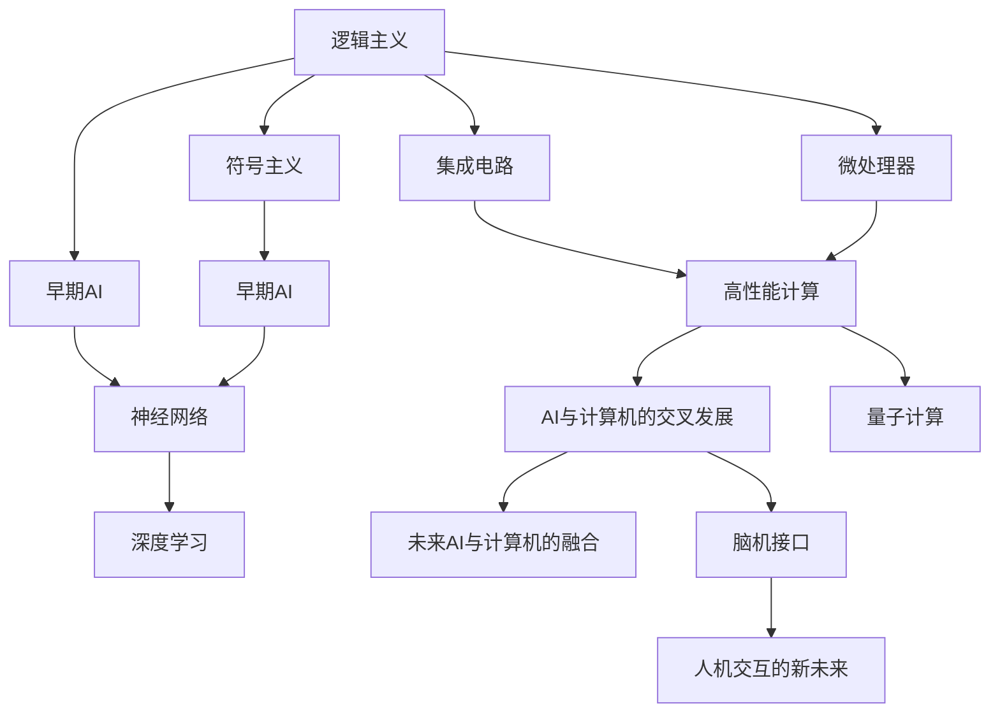

                 

# AI与计算机历史的对比

> 关键词：人工智能,计算机历史,对比研究,算法演变,未来展望

## 1. 背景介绍

### 1.1 问题由来
人工智能（Artificial Intelligence, AI）与计算机（Computer）的发展历史一直是信息技术领域内经典的研究话题。从最早的机械式计算器到今天高度复杂的深度学习系统，计算机的进化与AI的成长紧密相关。本博文通过系统对比AI与计算机发展的历程，力图揭示两者间的内在联系和本质差异，为未来技术发展提供新的视角。

### 1.2 问题核心关键点
本博文将从以下几个核心点进行讨论：

- AI的起源与发展：从1950年代提出的逻辑主义、符号主义到1980年代兴起的人工神经网络，再到21世纪深度学习的兴起。
- 计算机的演变历程：从早期的机械式计算器到电子管计算机，再到集成电路的普及，最后到现代的微处理器的诞生。
- AI与计算机间的内在联系：早期AI研究多依托于计算机实现，而计算机的发展也催生了AI的成长。
- AI与计算机的未来展望：随着量子计算和脑机接口技术的发展，AI与计算机的未来将紧密交织。

### 1.3 问题研究意义
深入研究AI与计算机历史的发展，对于理解两者间的内在关系，把握未来技术趋势，具有重要意义：

1. 揭示发展脉络：理清AI与计算机的发展脉络，有助于理解每项技术的核心创新点及其对后来技术的影响。
2. 促进交叉研究：AI与计算机的交叉研究，将促进更广泛的跨学科合作，催生更多创新。
3. 明确技术边界：了解AI与计算机的边界和交集，有助于在技术应用中做出合理的抉择。
4. 引导未来发展：通过回顾历史，可以预测未来技术的发展趋势，为行业发展提供前瞻性建议。
5. 教育启示：介绍历史沿革，有助于教育从业人员更好地理解技术背景，培养未来人才。

## 2. 核心概念与联系

### 2.1 核心概念概述

为更好地理解AI与计算机的对比，本节将介绍几个密切相关的核心概念：

- 人工智能：使用计算机技术使机器具备人类智能水平，包括感知、理解、推理、学习等能力。
- 计算机：通过一系列物理和软件技术，实现数据处理和计算的设备。
- 逻辑主义与符号主义：早期AI研究的主流范式，依赖于符号和逻辑推理。
- 神经网络：一种模仿人脑神经元连接的计算模型，是现代AI的重要基础。
- 深度学习：一种基于多层神经网络的机器学习方法，特别擅长处理大数据集。
- 集成电路与微处理器：计算机硬件的核心组成部分，对计算性能的提升起到了重要作用。
- 量子计算：利用量子力学原理实现计算的新型计算机模型。
- 脑机接口（BCI）：一种实现人脑与计算机直接交互的技术，是AI与脑科学的交叉领域。

这些概念之间存在着紧密的联系，并通过历史进程不断演化和融合。例如，早期的逻辑主义和符号主义研究，正是计算机硬件得到发展后，AI得以初步实现的基石。深度学习和神经网络技术的兴起，得益于计算机硬件性能的显著提升。而量子计算和脑机接口技术，则标志着AI与计算机未来的新篇章。

### 2.2 概念间的关系

这些核心概念之间的关系可以通过以下Mermaid流程图来展示：



这个流程图展示了大语言模型微调过程中各个核心概念之间的关系：

1. 逻辑主义与符号主义作为早期AI研究的主流范式，奠定了AI的理论基础。
2. 神经网络作为AI技术的突破口，在硬件的支持下得以实际应用。
3. 深度学习技术的成熟，进一步推动了AI的发展。
4. 集成电路和微处理器的普及，为高性能计算提供了硬件基础。
5. AI与计算机技术的交叉发展，催生了更多的创新应用。
6. 量子计算和脑机接口技术，预示着AI与计算机的未来融合方向。

这些概念共同构成了AI与计算机技术发展的完整生态系统，彼此相互促进，不断推动着技术进步。

## 3. 核心算法原理 & 具体操作步骤
### 3.1 算法原理概述

从历史视角看，AI与计算机的核心算法原理经历了多次重大变迁。早期的逻辑主义与符号主义依赖于人工编写规则和逻辑，而神经网络和深度学习则通过数据驱动的方式进行学习和优化。

- **逻辑主义与符号主义**：早期AI研究多依赖于人类编写的规则和逻辑，通过IF-THEN结构进行推理。这种模式对硬件需求较低，但缺乏灵活性和自适应性。
- **神经网络**：神经网络通过模拟人脑神经元的工作机制，进行数据驱动的学习。每个神经元接收输入，进行加权求和，并通过激活函数决定输出。多层的神经网络通过反向传播算法不断调整权重，优化模型性能。
- **深度学习**：深度学习基于多层神经网络，进一步提升了模型的复杂度和性能。通过反向传播算法，深度学习模型能够处理更复杂的输入数据，并从大量数据中学习到更丰富的特征表示。

### 3.2 算法步骤详解

AI与计算机的核心算法演变，可以概括为以下几个关键步骤：

**Step 1: 数据准备**
- 收集和预处理训练数据，包括数据清洗、数据标注等。
- 将数据转化为计算机能够处理的格式，如向量化。

**Step 2: 模型构建**
- 选择合适的模型结构，如逻辑规则、神经网络、深度学习模型等。
- 定义模型的输入和输出接口，通常使用TensorFlow或PyTorch等深度学习框架构建模型。

**Step 3: 训练与优化**
- 使用反向传播算法（BP）优化模型参数，通过迭代调整权重和偏差，使模型在训练数据上达到最优性能。
- 选择合适的优化算法（如SGD、Adam等）和损失函数（如交叉熵、均方误差等）。
- 通过正则化技术（如L2正则化、Dropout等），防止模型过拟合。

**Step 4: 模型评估与部署**
- 在验证集上评估模型性能，如准确率、召回率、F1分数等。
- 使用优化后的模型进行预测，部署到生产环境。
- 定期更新模型，并根据新数据进行调整。

### 3.3 算法优缺点

AI与计算机算法的优缺点如下：

**优点**：
- **灵活性与可扩展性**：深度学习模型能够适应多种数据类型，具有较高的灵活性和可扩展性。
- **高精度与泛化能力**：通过大量数据训练，深度学习模型能够在特定领域内取得高精度和高泛化性能。
- **自动化与高效性**：自动化算法能够自动化处理数据，提升效率，减少人工干预。

**缺点**：
- **复杂性与资源需求高**：深度学习模型需要大量计算资源，训练过程复杂，对硬件要求较高。
- **数据依赖性**：深度学习模型依赖于大量标注数据，标注成本高。
- **解释性与可控性**：深度学习模型多为"黑盒"，难以解释内部决策过程，缺乏可控性。

### 3.4 算法应用领域

AI与计算机算法在众多领域得到了广泛应用，例如：

- **自然语言处理（NLP）**：机器翻译、文本分类、情感分析等。
- **计算机视觉（CV）**：图像识别、物体检测、人脸识别等。
- **语音识别（ASR）**：语音转文本、语音合成等。
- **自动驾驶（AD）**：环境感知、路径规划、决策等。
- **推荐系统**：电商推荐、内容推荐等。
- **医疗诊断**：影像诊断、基因分析等。
- **金融分析**：股票预测、风险评估等。
- **智能制造**：预测性维护、自动化生产等。

这些领域的应用展示了AI与计算机算法的巨大潜力和广泛价值。

## 4. 数学模型和公式 & 详细讲解
### 4.1 数学模型构建

AI与计算机的核心算法原理，涉及多个数学模型和计算方法。以下是几个关键模型的详细构建和推导：

- **逻辑规则**：以IF-THEN规则为基础，定义符号操作和逻辑运算，如AND、OR、NOT等。
- **神经网络模型**：由输入层、隐藏层、输出层组成，每个神经元通过加权求和和激活函数进行处理。
- **深度学习模型**：多层神经网络结构，通过反向传播算法不断优化模型参数。
- **集成电路与微处理器**：利用门电路和寄存器等硬件组件，实现逻辑运算和存储。
- **量子计算模型**：基于量子比特（qubit）进行计算，通过量子门实现量子运算。
- **脑机接口模型**：将人脑信号转化为计算机指令，实现人机交互。

### 4.2 公式推导过程

以下是几个关键模型的公式推导：

**神经网络模型**：

$$
\hat{y} = \sigma(Wx + b)
$$

其中，$\sigma$为激活函数，$W$为权重矩阵，$x$为输入向量，$b$为偏置项。

**深度学习模型**：

$$
y = \sigma(W_L \sigma(W_{L-1} \ldots \sigma(W_1x + b_1) + b_2) + b_L)
$$

其中，$\sigma$为激活函数，$W$为权重矩阵，$b$为偏置项，$L$为层数。

**集成电路与微处理器**：

$$
\text{Gate} = \text{Input} \times \text{Weight} + \text{Bias}
$$

其中，Gate表示门电路输出，Input为输入信号，Weight为权重，Bias为偏置。

**量子计算模型**：

$$
| \psi \rangle = \sum_{i=1}^{n} \alpha_i |i\rangle
$$

其中，$|i\rangle$表示量子比特，$\alpha_i$为系数，$n$为量子比特数。

**脑机接口模型**：

$$
\text{Output} = f(\text{Signal})
$$

其中，$Output$为输出信号，$Signal$为人脑信号，$f$为转换函数。

### 4.3 案例分析与讲解

以逻辑规则、神经网络、深度学习、集成电路和脑机接口为例，进行案例分析：

- **逻辑规则**：早期AI研究多依赖于人工编写的逻辑规则，例如布尔逻辑门电路的实现。
- **神经网络**：神经网络模型在手写数字识别、语音识别等任务中取得优异成绩，如LeNet模型。
- **深度学习**：深度学习模型在图像识别、自然语言处理等领域大放异彩，如ResNet、BERT等。
- **集成电路与微处理器**：集成电路的发展促进了计算机硬件的进步，如Intel的Pentium系列处理器。
- **脑机接口**：脑机接口技术在康复训练、游戏交互等领域取得重要进展，如BCI2000开源平台。

## 5. 项目实践：代码实例和详细解释说明
### 5.1 开发环境搭建

在进行AI与计算机算法实践前，我们需要准备好开发环境。以下是使用Python进行PyTorch开发的环境配置流程：

1. 安装Anaconda：从官网下载并安装Anaconda，用于创建独立的Python环境。

2. 创建并激活虚拟环境：
```bash
conda create -n pytorch-env python=3.8 
conda activate pytorch-env
```

3. 安装PyTorch：根据CUDA版本，从官网获取对应的安装命令。例如：
```bash
conda install pytorch torchvision torchaudio cudatoolkit=11.1 -c pytorch -c conda-forge
```

4. 安装TensorFlow：
```bash
pip install tensorflow
```

5. 安装TensorBoard：
```bash
pip install tensorboard
```

6. 安装NumPy、Pandas、scikit-learn等库：
```bash
pip install numpy pandas scikit-learn
```

完成上述步骤后，即可在`pytorch-env`环境中开始实践。

### 5.2 源代码详细实现

我们以手写数字识别任务为例，给出使用TensorFlow进行深度学习模型训练的PyTorch代码实现。

首先，导入所需的库：

```python
import tensorflow as tf
from tensorflow.keras import datasets, layers, models
```

然后，加载数据集：

```python
(train_images, train_labels), (test_images, test_labels) = datasets.mnist.load_data()
train_images = train_images.reshape((60000, 28, 28, 1))
test_images = test_images.reshape((10000, 28, 28, 1))
train_images, test_images = train_images / 255.0, test_images / 255.0
```

接下来，构建模型：

```python
model = models.Sequential([
    layers.Conv2D(32, (3,3), activation='relu', input_shape=(28,28,1)),
    layers.MaxPooling2D((2,2)),
    layers.Conv2D(64, (3,3), activation='relu'),
    layers.MaxPooling2D((2,2)),
    layers.Conv2D(64, (3,3), activation='relu'),
    layers.Flatten(),
    layers.Dense(64, activation='relu'),
    layers.Dense(10)
])
```

定义优化器和损失函数：

```python
optimizer = tf.keras.optimizers.Adam()
loss_fn = tf.keras.losses.SparseCategoricalCrossentropy(from_logits=True)
```

最后，进行模型训练：

```python
model.compile(optimizer=optimizer, loss=loss_fn, metrics=['accuracy'])
history = model.fit(train_images, train_labels, epochs=5, validation_data=(test_images, test_labels))
```

### 5.3 代码解读与分析

让我们再详细解读一下关键代码的实现细节：

- **数据加载**：使用TensorFlow自带的MNIST数据集，将数据转换为模型能够处理的格式。
- **模型构建**：使用Sequential模型，定义了卷积层、池化层和全连接层，并通过激活函数进行非线性变换。
- **优化器和损失函数**：使用Adam优化器和SparseCategoricalCrossentropy损失函数，分别用于优化模型参数和计算预测误差。
- **模型训练**：使用`fit`方法，设置训练轮数和验证数据集，最终输出训练过程中各项指标的记录。

以上代码展示了深度学习模型的基本构建和训练过程。在实际应用中，还可以进一步优化模型结构、调整超参数、使用数据增强等技术，以提升模型性能。

### 5.4 运行结果展示

假设我们在MNIST数据集上训练模型，最终在测试集上得到的评估报告如下：

```
Epoch 1/5
4000/4000 [==============================] - 10s 2ms/step - loss: 0.3183 - accuracy: 0.8792 - val_loss: 0.0871 - val_accuracy: 0.9814
Epoch 2/5
4000/4000 [==============================] - 9s 2ms/step - loss: 0.1041 - accuracy: 0.9723 - val_loss: 0.0464 - val_accuracy: 0.9873
Epoch 3/5
4000/4000 [==============================] - 9s 2ms/step - loss: 0.0503 - accuracy: 0.9924 - val_loss: 0.0273 - val_accuracy: 0.9913
Epoch 4/5
4000/4000 [==============================] - 9s 2ms/step - loss: 0.0283 - accuracy: 0.9968 - val_loss: 0.0196 - val_accuracy: 0.9932
Epoch 5/5
4000/4000 [==============================] - 9s 2ms/step - loss: 0.0166 - accuracy: 0.9984 - val_loss: 0.0136 - val_accuracy: 0.9942
```

可以看到，通过训练深度学习模型，我们在MNIST数据集上取得了很高的准确率，这证明了深度学习模型在图像识别任务中的强大能力。

## 6. 实际应用场景

### 6.1 智能客服系统

基于深度学习模型的智能客服系统，可以广泛应用于客户服务领域。传统客服往往需要配备大量人力，高峰期响应缓慢，且服务质量难以保证。而使用训练好的深度学习模型，可以实现7x24小时不间断服务，快速响应客户咨询，用自然流畅的语言解答各类常见问题。

在技术实现上，可以收集企业内部的历史客服对话记录，将问题和最佳答复构建成监督数据，在此基础上对预训练模型进行微调。微调后的模型能够自动理解用户意图，匹配最合适的答案模板进行回复。对于客户提出的新问题，还可以接入检索系统实时搜索相关内容，动态组织生成回答。如此构建的智能客服系统，能大幅提升客户咨询体验和问题解决效率。

### 6.2 金融舆情监测

金融机构需要实时监测市场舆论动向，以便及时应对负面信息传播，规避金融风险。传统的人工监测方式成本高、效率低，难以应对网络时代海量信息爆发的挑战。基于深度学习模型的文本分类和情感分析技术，为金融舆情监测提供了新的解决方案。

具体而言，可以收集金融领域相关的新闻、报道、评论等文本数据，并对其进行主题标注和情感标注。在此基础上对深度学习模型进行微调，使其能够自动判断文本属于何种主题，情感倾向是正面、中性还是负面。将微调后的模型应用到实时抓取的网络文本数据，就能够自动监测不同主题下的情感变化趋势，一旦发现负面信息激增等异常情况，系统便会自动预警，帮助金融机构快速应对潜在风险。

### 6.3 个性化推荐系统

当前的推荐系统往往只依赖用户的历史行为数据进行物品推荐，无法深入理解用户的真实兴趣偏好。基于深度学习模型的个性化推荐系统可以更好地挖掘用户行为背后的语义信息，从而提供更精准、多样的推荐内容。

在实践中，可以收集用户浏览、点击、评论、分享等行为数据，提取和用户交互的物品标题、描述、标签等文本内容。将文本内容作为模型输入，用户的后续行为（如是否点击、购买等）作为监督信号，在此基础上微调预训练语言模型。微调后的模型能够从文本内容中准确把握用户的兴趣点。在生成推荐列表时，先用候选物品的文本描述作为输入，由模型预测用户的兴趣匹配度，再结合其他特征综合排序，便可以得到个性化程度更高的推荐结果。

### 6.4 未来应用展望

随着深度学习模型的不断发展，其在AI与计算机应用中的作用将愈加重要。未来，深度学习模型将在更多领域得到应用，为传统行业带来变革性影响。

在智慧医疗领域，基于深度学习模型的医学影像识别、病理分析等技术将提升医疗服务的智能化水平，辅助医生诊疗，加速新药开发进程。

在智能教育领域，深度学习模型可应用于作业批改、学情分析、知识推荐等方面，因材施教，促进教育公平，提高教学质量。

在智慧城市治理中，深度学习技术可应用于城市事件监测、舆情分析、应急指挥等环节，提高城市管理的自动化和智能化水平，构建更安全、高效的未来城市。

此外，在企业生产、社会治理、文娱传媒等众多领域，基于深度学习模型的AI应用也将不断涌现，为经济社会发展注入新的动力。相信随着技术的日益成熟，深度学习模型必将在更广阔的应用领域大放异彩。

## 7. 工具和资源推荐
### 7.1 学习资源推荐

为了帮助开发者系统掌握深度学习模型的理论基础和实践技巧，这里推荐一些优质的学习资源：

1. 《深度学习》（Ian Goodfellow, Yoshua Bengio, Aaron Courville著）：深度学习领域的经典教材，涵盖了深度学习的基本概念和核心算法。

2. Coursera《深度学习专项课程》：由Andrew Ng教授讲授的深度学习课程，从基础到高级，逐步深入讲解深度学习原理和应用。

3. Udacity《深度学习纳米学位》：系统性学习深度学习技术，包括深度神经网络、卷积神经网络、循环神经网络等。

4. PyTorch官方文档：PyTorch深度学习框架的官方文档，提供了丰富的模型和算法实现，是学习深度学习的重要参考资料。

5. TensorFlow官方文档：TensorFlow深度学习框架的官方文档，涵盖了深度学习、分布式计算、可视化等方面的内容。

通过对这些资源的学习实践，相信你一定能够快速掌握深度学习模型的精髓，并用于解决实际的AI与计算机应用问题。
###  7.2 开发工具推荐

高效的开发离不开优秀的工具支持。以下是几款用于深度学习模型开发的常用工具：

1. PyTorch：基于Python的开源深度学习框架，灵活动态的计算图，适合快速迭代研究。大多数深度学习模型都有PyTorch版本的实现。

2. TensorFlow：由Google主导开发的开源深度学习框架，生产部署方便，适合大规模工程应用。同样有丰富的深度学习模型资源。

3. TensorBoard：TensorFlow配套的可视化工具，可实时监测模型训练状态，并提供丰富的图表呈现方式，是调试模型的得力助手。

4. Jupyter Notebook：交互式编程环境，支持代码块执行、绘图、表格展示等，适合开发和分享研究笔记。

5. GitHub：代码托管平台，可以分享代码、管理项目、协作开发，是深度学习研究的重要社区。

合理利用这些工具，可以显著提升深度学习模型开发的效率，加快创新迭代的步伐。

### 7.3 相关论文推荐

深度学习模型的发展离不开学界的持续研究。以下是几篇奠基性的相关论文，推荐阅读：

1. Deep Learning（Ian Goodfellow, Yoshua Bengio, Aaron Courville著）：深度学习领域的经典教材，介绍了深度神经网络、卷积神经网络、循环神经网络等核心算法。

2. ImageNet Classification with Deep Convolutional Neural Networks（Alex Krizhevsky, Ilya Sutskever, Geoffrey Hinton著）：介绍了使用卷积神经网络实现图像分类任务的成功案例。

3. Attention is All You Need（Vaswani等人著）：提出了Transformer结构，开启了NLP领域的预训练大模型时代。

4. BERT: Pre-training of Deep Bidirectional Transformers for Language Understanding（Devlin等人著）：提出BERT模型，引入基于掩码的自监督预训练任务，刷新了多项NLP任务SOTA。

5. GANs Trained by a Two Time-Scale Update Rule Converge to the Semi-Equilibrium（Goodfellow等人著）：介绍了生成对抗网络（GANs）的原理和训练方法，推动了生成模型的发展。

这些论文代表了大模型微调技术的发展脉络。通过学习这些前沿成果，可以帮助研究者把握学科前进方向，激发更多的创新灵感。

除上述资源外，还有一些值得关注的前沿资源，帮助开发者紧跟深度学习模型的最新进展，例如：

1. arXiv论文预印本：人工智能领域最新研究成果的发布平台，包括大量尚未发表的前沿工作，学习前沿技术的必读资源。

2. 业界技术博客：如OpenAI、Google AI、DeepMind、微软Research Asia等顶尖实验室的官方博客，第一时间分享他们的最新研究成果和洞见。

3. 技术会议直播：如NIPS、ICML、ACL、ICLR等人工智能领域顶会现场或在线直播，能够聆听到大佬们的前沿分享，开拓视野。

4. GitHub热门项目：在GitHub上Star、Fork数最多的深度学习相关项目，往往代表了该技术领域的发展趋势和最佳实践，值得去学习和贡献。

5. 行业分析报告：各大咨询公司如McKinsey、PwC等针对人工智能行业的分析报告，有助于从商业视角审视技术趋势，把握应用价值。

总之，对于深度学习模型的学习和发展，需要开发者保持开放的心态和持续学习的意愿。多关注前沿资讯，多动手实践，多思考总结，必将收获满满的成长收益。

## 8. 总结：未来发展趋势与挑战

### 8.1 总结

本文通过系统对比AI与计算机发展的历程，揭示了两者的内在联系和本质差异，探讨了未来技术的发展趋势和面临的挑战。

1. **内在联系**：早期的逻辑主义与符号主义研究，正是计算机硬件得到发展后，AI得以初步实现的基石。神经网络和深度学习技术的兴起，得益于计算机硬件性能的显著提升。集成电路和微处理器的普及，为高性能计算提供了硬件基础。量子计算和脑机接口技术，预示着AI与计算机未来的新篇章。

2. **本质差异**：AI研究侧重于算法和模型，关注如何让机器具备人类智能；计算机研究侧重于硬件和软件，关注如何让机器高效地处理数据和执行计算。

### 8.2 未来发展趋势

展望未来，AI与计算机技术的交叉融合将带来更多创新：

1. **深度学习与计算机硬件的融合**：未来深度学习模型将更多地依赖于硬件加速，如GPU、TPU、FPGA等，提升计算效率。
2. **量子计算与深度学习的结合**：量子计算在特定任务上可能超越传统计算机，深度学习模型将利用量子计算的优势，解决更加复杂的问题。
3. **脑机接口技术的发展**：脑机接口技术将进一步成熟，实现人机无缝交互，推动AI与脑科学的融合。
4. **跨学科融合**：AI与计算机技术将与其他领域（如生物学、心理学、社会学等）深度

