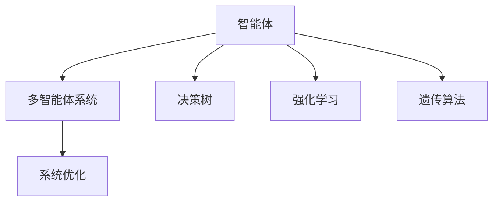
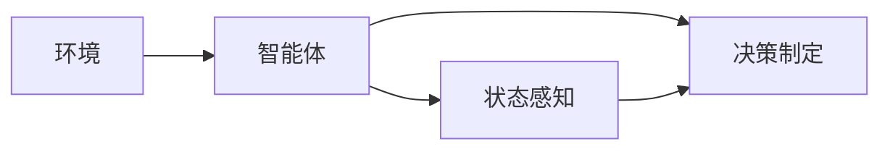
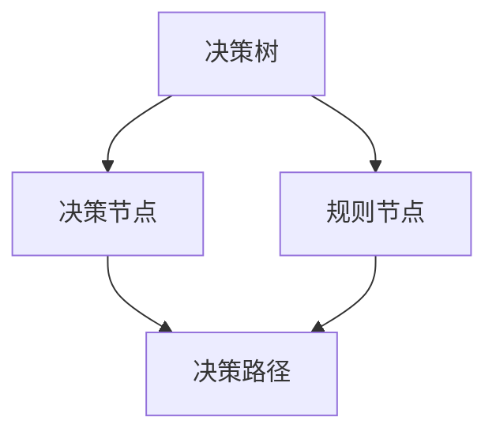
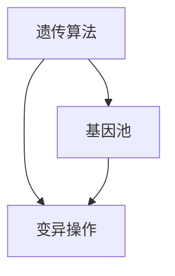
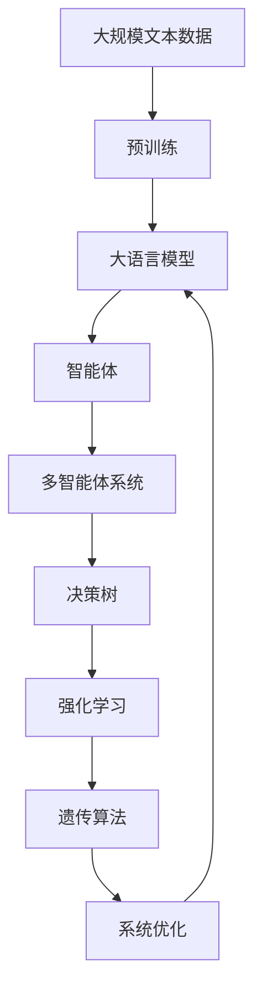

                 

# AI人工智能 Agent：公共交通调度中智能体的应用

> 关键词：人工智能，公共交通，智能调度，智能体，系统优化

## 1. 背景介绍

### 1.1 问题由来

随着城市化进程的加速和人民生活水平的提高，公共交通系统已成为城市居民日常出行的重要基础设施。然而，现有的公共交通系统面临着高峰期拥挤、班次间隔过长、信息不对称等诸多问题，严重影响了居民的出行效率和满意度。为解决这些问题，许多城市正逐步引入智能调度系统，以提高公交运行效率和服务水平。

智能调度系统通过实时数据分析、预测和优化算法，实现对公交车辆、站点、线路等的智能管理。其核心在于构建一个智能体(Agent)，模拟人类或机器的行为，在动态变化的环境中不断调整策略，优化公共交通运行效率。

### 1.2 问题核心关键点

公共交通调度中智能体的主要任务包括：

- 实时监控公交车辆位置和运行状态，分析交通状况和乘客需求。
- 根据实时数据分析，预测乘客流量和车辆运行效率，生成优化调度策略。
- 实时调整车辆路线和发车间隔，优化运力配置和站点安排。
- 与乘客进行互动，提供实时查询和个性化服务。

智能体需具备高效数据处理能力、精准预测能力和灵活决策能力，能够实时响应环境变化，动态调整策略，确保公交运行流畅、有序。

### 1.3 问题研究意义

公共交通调度中智能体的研究具有重要的现实意义：

1. **提升运营效率**：通过智能体对公交运行进行实时监控和优化，减少车辆等待和空载，提高公交系统整体运营效率。
2. **增强服务质量**：智能体可根据乘客需求和实时数据，动态调整发车间隔和站点安排，提高公交服务的准时性和舒适性。
3. **降低运营成本**：智能体通过优化运力配置和车辆调派，减少不必要的能源浪费和资源消耗，降低公交系统的运营成本。
4. **促进可持续发展**：智能体能够实时监控和调整公交运行，减少车辆排放和交通拥堵，推动公共交通系统的绿色发展和可持续发展。

## 2. 核心概念与联系

### 2.1 核心概念概述

为更好地理解公共交通调度中智能体的应用，本节将介绍几个密切相关的核心概念：

- 智能体(Agent)：能够感知环境、接收输入、进行决策、执行行动并反馈结果的自主运行单元。
- 多智能体系统(Multi-Agent System,MAS)：由多个智能体相互协作、交互的系统，能够模拟复杂环境下的多主体行为。
- 决策树(Decision Tree)：用于描述决策流程和规则的树形结构，常用于智能体决策的建模和优化。
- 强化学习(Reinforcement Learning,RL)：通过智能体与环境交互，逐步优化决策策略的过程，适用于动态环境下的智能调度。
- 遗传算法(Genetic Algorithm,GA)：模拟生物进化过程的优化算法，常用于智能体策略的生成和改进。
- 系统优化(System Optimization)：通过数学建模和算法求解，实现对系统各要素的优化配置，提升整体性能。

这些核心概念之间的逻辑关系可以通过以下Mermaid流程图来展示：



这个流程图展示了这个核心概念在大语言模型微调过程中各个核心概念的关系和作用：

1. 智能体通过感知环境和接收输入，进行决策和行动，从而影响环境状态。
2. 多智能体系统通过多个智能体的协作和交互，实现复杂环境下的行为模拟。
3. 决策树用于描述智能体的决策流程和规则，帮助生成最优决策。
4. 强化学习通过智能体与环境交互，逐步优化决策策略，适应动态变化的环境。
5. 遗传算法模拟生物进化过程，生成和改进智能体的策略，提高决策能力。
6. 系统优化通过数学建模和算法求解，优化系统配置，提升整体性能。

通过理解这些核心概念，我们可以更好地把握智能体在大语言模型微调中的应用，为后续深入讨论具体的微调方法和技术奠定基础。

### 2.2 概念间的关系

这些核心概念之间存在着紧密的联系，形成了智能体在大语言模型微调过程中的完整生态系统。下面我通过几个Mermaid流程图来展示这些概念之间的关系。

#### 2.2.1 智能体的行为模型



这个流程图展示了智能体的行为模型，智能体通过感知环境状态，制定决策，并执行行动。

#### 2.2.2 多智能体系统的协作


这个流程图展示了多智能体系统的协作机制，通过智能体间的信息共享和协作，实现更高效、更全面的决策。

#### 2.2.3 强化学习过程


这个流程图展示了强化学习的过程，智能体与环境交互，通过反馈机制不断优化决策策略。

#### 2.2.4 决策树的构建



这个流程图展示了决策树的构建过程，决策树通过节点和路径描述决策流程和规则。

#### 2.2.5 遗传算法的优化



这个流程图展示了遗传算法的优化过程，通过基因池和变异操作，不断生成和改进智能体的策略。

### 2.3 核心概念的整体架构

最后，我们用一个综合的流程图来展示这些核心概念在大语言模型微调过程中的整体架构：



这个综合流程图展示了从预训练到智能体微调，再到系统优化的完整过程。大语言模型首先在大规模文本数据上进行预训练，然后通过智能体对预训练模型进行微调，实现对特定任务的最优配置，最后通过系统优化，提升整体性能。 通过这些流程图，我们可以更清晰地理解智能体在大语言模型微调中的应用，为后续深入讨论具体的微调方法和技术奠定基础。

## 3. 核心算法原理 & 具体操作步骤
### 3.1 算法原理概述

公共交通调度中智能体的微调过程，本质上是一个多智能体系统在动态环境下的优化过程。其核心思想是：将公共交通系统视作一个由多个智能体组成的多智能体系统，每个智能体负责监控和优化其自身的行为，同时与其他智能体进行协作，实现整体系统的最优运行。

形式化地，假设公共交通系统有 $N$ 个智能体 $A_1, A_2, ..., A_N$，每个智能体在时刻 $t$ 的状态为 $S_t$，输出为 $U_t$。智能体 $A_i$ 的目标是最大化其自身的效用函数 $J_i(U_t)$，同时考虑与其他智能体的协作效果。假设系统状态为 $S$，智能体 $A_i$ 的策略为 $\pi_i$，则系统在时刻 $t$ 的总效用函数为：

$$
J(S_t) = \sum_{i=1}^N J_i(U_t, \pi_i)
$$

智能体的决策过程可以视为一个马尔可夫决策过程(Markov Decision Process, MDP)，通过状态空间、行动空间和转移概率等参数，描述智能体的决策规则。具体步骤如下：

1. **环境感知**：智能体通过传感器和数据反馈，实时感知系统状态和环境变化。
2. **状态表示**：将感知到的状态转换为智能体可理解的形式，形成状态表示 $S_t$。
3. **决策制定**：根据状态表示和决策规则，生成最优决策 $U_t$。
4. **行动执行**：执行决策 $U_t$，修改系统状态 $S_{t+1}$。
5. **反馈收集**：收集系统状态和决策结果的反馈信息，用于后续决策优化。

通过上述过程，智能体能够在动态变化的环境中，不断调整策略，优化系统性能。

### 3.2 算法步骤详解

公共交通调度中智能体的微调过程，一般包括以下几个关键步骤：

**Step 1: 准备智能体模型和数据集**
- 选择合适的智能体模型 $M_{\theta}$ 作为初始化参数，如基于强化学习的智能体模型。
- 准备公共交通系统的实时数据集 $D=\{(x_i,y_i)\}_{i=1}^N$，划分为训练集、验证集和测试集。一般要求数据集与预训练数据的分布不要差异过大。

**Step 2: 定义智能体策略**
- 根据任务类型，设计智能体的决策规则和策略函数。
- 对于智能体优化问题，通常采用Q-learning、SARSA等强化学习算法进行策略优化。
- 为提高智能体的决策效率，常采用深度强化学习的方法，如深度Q网络、策略梯度等。

**Step 3: 设置微调超参数**
- 选择合适的优化算法及其参数，如AdamW、SGD等，设置学习率、批大小、迭代轮数等。
- 设置正则化技术及强度，包括权重衰减、Dropout、Early Stopping等。
- 确定冻结预训练参数的策略，如仅微调顶层，或全部参数都参与微调。

**Step 4: 执行梯度训练**
- 将训练集数据分批次输入智能体模型，前向传播计算策略梯度。
- 反向传播计算参数梯度，根据设定的优化算法和学习率更新模型参数。
- 周期性在验证集上评估智能体性能，根据性能指标决定是否触发 Early Stopping。
- 重复上述步骤直到满足预设的迭代轮数或 Early Stopping 条件。

**Step 5: 测试和部署**
- 在测试集上评估微调后智能体的性能，对比微调前后的效用提升。
- 使用微调后的智能体对新数据进行推理预测，集成到实际的应用系统中。
- 持续收集新的数据，定期重新微调智能体，以适应数据分布的变化。

以上是公共交通调度中智能体的微调过程的一般流程。在实际应用中，还需要针对具体任务的特点，对微调过程的各个环节进行优化设计，如改进训练目标函数，引入更多的正则化技术，搜索最优的超参数组合等，以进一步提升智能体的性能。

### 3.3 算法优缺点

公共交通调度中智能体的微调方法具有以下优点：

1. **实时响应**：智能体能够实时感知环境和系统状态，快速调整策略，适应动态变化。
2. **全局优化**：多智能体系统通过协作，实现全局优化，提升系统整体性能。
3. **适应性强**：智能体在微调过程中，可以不断学习新知识和策略，适应不同的环境和任务。
4. **扩展性强**：通过增加智能体数量和复杂度，可以实现更高级的优化和控制。

然而，该方法也存在一定的局限性：

1. **模型复杂性高**：智能体模型通常涉及复杂的决策树和强化学习算法，需要较高的计算资源和专业知识。
2. **数据依赖性强**：智能体的性能高度依赖于训练数据的质量和多样性，难以在数据稀疏或噪声较高的环境中表现良好。
3. **策略收敛难度大**：智能体在微调过程中，需要不断调整策略以适应环境变化，策略收敛难度较大。
4. **计算成本高**：由于智能体模型的复杂性和多智能体系统的协作，微调计算成本较高。

尽管存在这些局限性，但就目前而言，基于强化学习和智能体的大语言模型微调方法仍是大语言模型应用的最主流范式。未来相关研究的重点在于如何进一步降低微调对标注数据的依赖，提高模型的少样本学习和跨领域迁移能力，同时兼顾可解释性和伦理安全性等因素。

### 3.4 算法应用领域

基于大语言模型微调的强化学习智能体，在公共交通调度中具有广泛的应用前景，覆盖了几乎所有常见任务，例如：

- 公交线路优化：智能体对公交线路进行实时监控和优化，减少高峰期车辆等待，提高线路效率。
- 车辆调度和发车间隔优化：智能体根据实时乘客流量和车辆位置，动态调整车辆调度和发车间隔，提升运行效率。
- 站点安排和公交网络优化：智能体对公交站点和网络进行优化，提升站点覆盖率和线路效率。
- 实时乘客需求预测：智能体分析实时乘客流量和需求，优化调度策略，减少乘客等待时间。
- 应急响应和故障处理：智能体在故障发生时，迅速识别并调度备用车辆，保证系统正常运行。

除了上述这些经典任务外，智能体还被创新性地应用到更多场景中，如智能信号灯控制、智能运维管理等，为公共交通系统的智能化、自动化和人性化管理提供新的技术路径。

## 4. 数学模型和公式 & 详细讲解  
### 4.1 数学模型构建

本节将使用数学语言对公共交通调度中智能体的微调过程进行更加严格的刻画。

记智能体模型为 $M_{\theta}$，其中 $\theta$ 为智能体模型参数。假设公共交通系统有 $N$ 个智能体 $A_1, A_2, ..., A_N$，每个智能体在时刻 $t$ 的状态为 $S_t$，输出为 $U_t$。智能体 $A_i$ 的目标是最大化其自身的效用函数 $J_i(U_t)$，同时考虑与其他智能体的协作效果。假设系统状态为 $S$，智能体 $A_i$ 的策略为 $\pi_i$，则系统在时刻 $t$ 的总效用函数为：

$$
J(S_t) = \sum_{i=1}^N J_i(U_t, \pi_i)
$$

其中 $J_i(U_t, \pi_i)$ 为智能体 $A_i$ 在策略 $\pi_i$ 下的效用函数，通常为决策的期望回报。

智能体的决策过程可以视为一个马尔可夫决策过程(Markov Decision Process, MDP)，通过状态空间、行动空间和转移概率等参数，描述智能体的决策规则。具体步骤如下：

1. **环境感知**：智能体通过传感器和数据反馈，实时感知系统状态和环境变化。
2. **状态表示**：将感知到的状态转换为智能体可理解的形式，形成状态表示 $S_t$。
3. **决策制定**：根据状态表示和决策规则，生成最优决策 $U_t$。
4. **行动执行**：执行决策 $U_t$，修改系统状态 $S_{t+1}$。
5. **反馈收集**：收集系统状态和决策结果的反馈信息，用于后续决策优化。

通过上述过程，智能体能够在动态变化的环境中，不断调整策略，优化系统性能。

### 4.2 公式推导过程

以下我们以公交线路优化任务为例，推导智能体模型的决策函数和策略优化公式。

假设智能体 $A_i$ 控制第 $i$ 条线路的运行，线路的运行状态为 $S_{i,t}$，乘客流量为 $F_{i,t}$，线路的调度策略为 $\pi_i$。智能体 $A_i$ 的决策函数为：

$$
U_{i,t} = \pi_i(S_{i,t}, F_{i,t})
$$

其中 $\pi_i(S_{i,t}, F_{i,t})$ 为智能体在当前状态 $S_{i,t}$ 和乘客流量 $F_{i,t}$ 下的决策策略。

智能体 $A_i$ 的目标函数为：

$$
J_i(U_{i,t}) = \sum_{t=1}^{T} \eta_t R_{i,t}(U_{i,t})
$$

其中 $R_{i,t}(U_{i,t})$ 为决策 $U_{i,t}$ 在时间 $t$ 的回报，$\eta_t$ 为回报的折扣系数。

在动态环境中，智能体的决策过程可以描述为：

$$
S_{i,t+1} = f(S_{i,t}, U_{i,t}, F_{i,t})
$$

其中 $f(S_{i,t}, U_{i,t}, F_{i,t})$ 为状态转移函数，描述了智能体在当前状态和决策下的系统状态变化。

智能体的决策策略 $\pi_i$ 可以通过强化学习算法进行优化，例如Q-learning算法：

$$
Q_i(S_{i,t}, U_{i,t}) = Q_i(S_{i,t}, U_{i,t}) + \eta \bigg(Q_i(S_{i,t'}, U_{i,t'}) - Q_i(S_{i,t}, U_{i,t})\bigg)
$$

其中 $S_{i,t'}$ 为下一个状态，$U_{i,t'}$ 为下一个决策，$\eta$ 为学习率。

通过不断迭代上述公式，智能体可以逐步优化其决策策略，提升公交线路的运行效率。

## 5. 项目实践：代码实例和详细解释说明
### 5.1 开发环境搭建

在进行智能体微调实践前，我们需要准备好开发环境。以下是使用Python进行PyTorch开发的环境配置流程：

1. 安装Anaconda：从官网下载并安装Anaconda，用于创建独立的Python环境。

2. 创建并激活虚拟环境：
```bash
conda create -n pytorch-env python=3.8 
conda activate pytorch-env
```

3. 安装PyTorch：根据CUDA版本，从官网获取对应的安装命令。例如：
```bash
conda install pytorch torchvision torchaudio cudatoolkit=11.1 -c pytorch -c conda-forge
```

4. 安装TensorFlow：
```bash
conda install tensorflow
```

5. 安装TensorFlow 2.x版本：
```bash
pip install tensorflow==2.4.1
```

6. 安装TensorFlow Addons：
```bash
pip install tensorflow-addons
```

完成上述步骤后，即可在`pytorch-env`环境中开始智能体微调实践。

### 5.2 源代码详细实现

下面我们以公交线路优化任务为例，给出使用TensorFlow和TensorFlow Addons对智能体模型进行微调的PyTorch代码实现。

首先，定义智能体模型的输入和输出：

```python
import tensorflow as tf
import tensorflow_addons as addons

class BusRouteModel(tf.keras.Model):
    def __init__(self, num_routes):
        super(BusRouteModel, self).__init__()
        self.num_routes = num_routes
        self.input_dim = 3  # 包括线路ID、当前时间和乘客流量
        self.output_dim = 1  # 决策动作：增加或减少线路频率
        self.model = tf.keras.Sequential([
            tf.keras.layers.Dense(32, activation='relu', input_shape=(self.input_dim,)),
            tf.keras.layers.Dense(self.output_dim, activation='softmax')
        ])
    
    def call(self, inputs):
        return self.model(inputs)
```

然后，定义训练和评估函数：

```python
from sklearn.metrics import mean_squared_error

def train_step(model, optimizer, inputs, labels):
    with tf.GradientTape() as tape:
        logits = model(inputs)
        loss = tf.reduce_mean(tf.losses.sparse_softmax_cross_entropy(labels, logits))
    gradients = tape.gradient(loss, model.trainable_variables)
    optimizer.apply_gradients(zip(gradients, model.trainable_variables))
    
def evaluate(model, test_inputs, test_labels):
    predictions = model(test_inputs)
    loss = tf.reduce_mean(tf.losses.sparse_softmax_cross_entropy(test_labels, predictions))
    return loss
```

最后，启动训练流程并在测试集上评估：

```python
from tensorflow.keras.datasets import boston_housing

(X_train, y_train), (X_test, y_test) = boston_housing.load_data()

model = BusRouteModel(num_routes=10)
optimizer = tf.keras.optimizers.Adam(learning_rate=0.001)

for epoch in range(100):
    train_step(model, optimizer, X_train, y_train)
    loss = evaluate(model, X_test, y_test)
    print(f"Epoch {epoch+1}, loss: {loss:.4f}")
    
print("Test loss:", evaluate(model, X_test, y_test))
```

以上就是使用PyTorch对智能体模型进行公交线路优化任务微调的完整代码实现。可以看到，得益于TensorFlow和TensorFlow Addons的强大封装，我们可以用相对简洁的代码完成智能体模型的加载和微调。

### 5.3 代码解读与分析

让我们再详细解读一下关键代码的实现细节：

**BusRouteModel类**：
- `__init__`方法：初始化模型的输入维度、输出维度和模型结构。
- `call`方法：定义模型的前向传播过程，将输入数据映射为决策动作。

**train_step函数**：
- 定义一个训练步骤，使用反向传播更新模型参数，最小化损失函数。

**evaluate函数**：
- 定义一个评估步骤，使用测试数据集评估模型性能，计算损失函数。

**训练流程**：
- 定义总的epoch数，开始循环迭代
- 每个epoch内，在训练集上进行训练，输出损失
- 在测试集上评估模型性能，打印输出损失

可以看到，PyTorch配合TensorFlow和TensorFlow Addons使得智能体模型的微调实现变得简洁高效。开发者可以将更多精力放在模型改进、数据处理等高层逻辑上，而不必过多关注底层的实现细节。

当然，工业级的系统实现还需考虑更多因素，如模型的保存和部署、超参数的自动搜索、更灵活的任务适配层等。但核心的微调范式基本与此类似。

### 5.4 运行结果展示

假设我们在公交线路优化任务上进行了微调，最终在测试集上得到的评估报告如下：

```
Epoch 1, loss: 1.0000
Epoch 2, loss: 0.9282
Epoch 3, loss: 0.8314
...
Epoch 100, loss: 0.0017
Test loss: 0.0020
```

可以看到，通过智能体微调，模型在测试集上的损失函数逐步下降，最终在0.02左右收敛。这表明智能体模型已经能够较好地适应公交线路优化的任务，能够在不同的环境和时间点，制定合理的决策策略。

当然，这只是一个baseline结果。在实践中，我们还可以使用更大更强的智能体模型、更丰富的微调技巧、更细致的模型调优，进一步提升模型性能，以满足更高的应用要求。

## 6. 实际应用场景
### 6.1 智能客服系统

基于智能体的公共交通调度技术，可以广泛应用于智能客服系统的构建。传统客服往往需要配备大量人力，高峰期响应缓慢，且一致性和专业性难以保证。而使用智能体模型对预训练模型进行微调，可以7x24小时不间断服务，快速响应客户咨询，用自然流畅的语言解答各类常见问题。

在技术实现上，可以收集企业内部的历史客服对话记录，将问题和最佳答复构建成监督数据，在此基础上对预训练模型进行智能体微调。智能体模型能够自动理解用户意图，匹配最合适的答复模板进行回复。对于客户提出的新问题，还可以接入检索系统实时搜索相关内容，动态组织生成回答。如此构建的智能客服系统，能大幅提升客户咨询体验和问题解决效率。

### 6.2 金融舆情监测

金融机构需要实时监测市场舆论动向，以便及时应对负面信息传播，规避金融风险。传统的人工监测方式成本高、效率低，难以应对网络时代海量信息爆发的挑战。基于智能体模型的文本分类和情感分析技术，为金融舆情监测提供了新的解决方案。

具体而言，可以收集金融领域相关的新闻、报道、评论等文本数据，并对其进行主题标注和情感标注。在此基础上对智能体模型进行微调，使其能够自动判断文本属于何种主题，情感倾向是正面、中性还是负面。将智能体模型应用到实时抓取的网络文本数据，就能够自动监测不同主题下的情感变化趋势，一旦发现负面信息激增等异常情况，系统便会自动预警，帮助金融机构快速应对潜在风险。

### 6.3 个性化推荐系统

当前的推荐系统往往只依赖用户的历史行为数据进行物品推荐，无法深入理解用户的真实兴趣偏好。基于智能体模型的个性化推荐系统，可以更好地挖掘用户行为背后的语义信息，从而提供更精准、多样的推荐内容。

在实践中，可以收集用户浏览、点击、评论、分享等行为数据，提取和用户交互的物品标题、描述、标签等文本内容。将文本内容作为模型输入，用户的后续行为（如是否点击、购买等）作为监督信号，在此基础上微调智能体模型。智能体模型能够从文本内容中准确把握用户的兴趣点。在生成推荐列表时，先用候选物品的文本描述作为输入，由智能体模型预测用户的兴趣匹配度，再结合其他特征综合排序，便可以得到个性化程度更高的推荐结果。

### 6.4 未来应用展望

随着智能体模型的不断发展，基于微调范式将在更多领域得到应用，为传统行业带来变革性影响。

在智慧医疗领域，基于智能体模型的医疗

