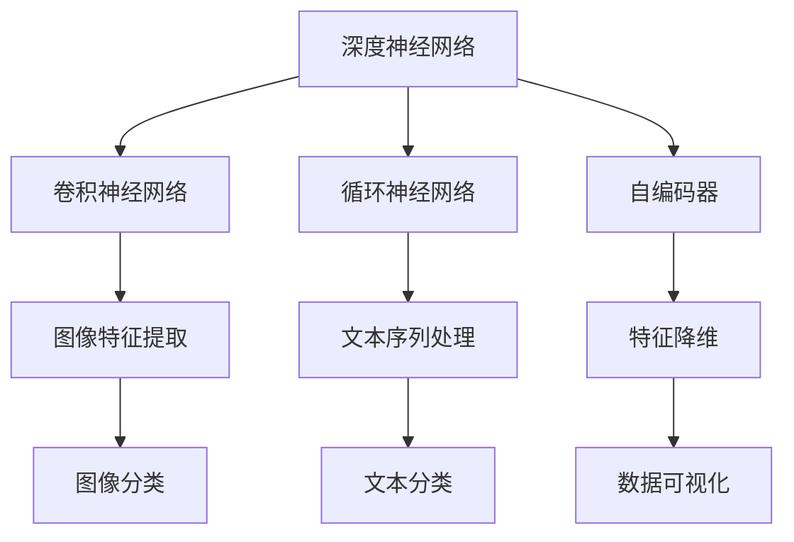
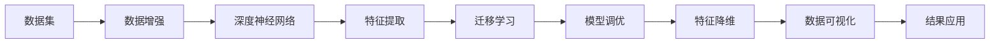

                 

# AI人工智能 Agent：利用深度学习进行特征提取

> 关键词：人工智能,深度学习,特征提取,算法原理,应用场景,项目实践,未来展望

## 1. 背景介绍

### 1.1 问题由来

在当前大数据和人工智能（AI）的驱动下，数据分析和处理的需求日益增长。数据驱动的决策和运营优化逐渐成为企业竞争力的核心。在这一背景下，高质量数据特征提取的重要性愈加突出。

特征提取是机器学习和深度学习模型的重要预处理步骤，它决定了模型能够从数据中学习到的有用信息的质量。传统的特征提取方法依赖于人工选择和工程设计，不仅耗时耗力，而且难以满足复杂数据结构和大规模数据集的提取需求。

随着深度学习技术的发展，特征提取逐渐从手工设计转向模型自动学习。在深度学习中，通过搭建神经网络模型，并对其进行训练，可以自动从数据中提取高维特征，从而大大提高数据处理的效率和效果。

### 1.2 问题核心关键点

- **深度学习模型**：利用深度神经网络自动学习数据特征。
- **特征提取算法**：如卷积神经网络（CNN）、循环神经网络（RNN）、自编码器（Autoencoder）等，用于从原始数据中提取有用信息。
- **数据增强**：通过数据扩增技术，如旋转、平移、缩放等，增加训练集的多样性，提高模型的泛化能力。
- **迁移学习**：将一个领域学到的知识迁移到另一个领域，提升新任务上的特征提取能力。
- **模型调优**：包括超参数调整、正则化、集成学习等技术，优化模型的性能。

这些核心概念构成了深度学习特征提取的基本框架，广泛应用于图像、语音、自然语言处理等领域。

### 1.3 问题研究意义

深度学习特征提取技术对于提高数据处理效率和提升模型性能具有重要意义：

- **高效性**：自动提取特征，避免了手工设计的繁琐过程。
- **适应性**：深度学习模型可以适应各种复杂数据结构，提取有用信息。
- **泛化能力**：通过数据增强和迁移学习，模型具备良好的泛化能力。
- **性能提升**：特征提取质量的提升直接带来模型性能的提升。
- **技术创新**：特征提取技术的进步推动了AI技术的发展。

## 2. 核心概念与联系

### 2.1 核心概念概述

在深入探讨特征提取技术之前，我们先介绍几个关键概念：

- **深度神经网络**：通过多层非线性变换，自动从数据中提取高级特征。
- **卷积神经网络（CNN）**：利用卷积操作，从图像、文本等高维数据中提取局部特征。
- **循环神经网络（RNN）**：通过循环结构，捕捉时间序列数据中的长期依赖关系。
- **自编码器（Autoencoder）**：通过重构数据，学习数据的低维表示，用于特征降维。
- **迁移学习**：将一个领域学到的知识迁移到另一个领域，提升模型在新任务上的表现。

这些概念之间存在紧密的联系，共同构成了深度学习特征提取的核心生态系统。

### 2.2 概念间的关系

以下Mermaid流程图展示了核心概念之间的逻辑关系：



这个流程图展示了深度神经网络如何将不同类型的数据转化为有用的特征，并进行分类、降维等后续处理。

### 2.3 核心概念的整体架构

最终，我们将这些核心概念整合为一个完整的架构，以便更好地理解深度学习特征提取的流程：



这个综合流程图展示了从数据预处理到特征提取，再到模型优化和应用的全流程。

## 3. 核心算法原理 & 具体操作步骤
### 3.1 算法原理概述

深度学习特征提取的原理基于神经网络的自动特征学习能力。通过多层非线性变换，深度神经网络能够自动学习数据的高维特征表示。这些特征不仅能够捕捉数据的局部结构，还能捕捉全局依赖关系，从而更全面地描述数据。

特征提取的整个过程可以概括为以下几个步骤：

1. **数据准备**：对原始数据进行清洗、归一化等预处理操作。
2. **模型搭建**：选择合适的深度神经网络架构，如CNN、RNN、Autoencoder等。
3. **模型训练**：通过反向传播算法，最小化损失函数，训练模型参数。
4. **特征提取**：将训练好的模型应用于新的数据，提取特征。
5. **模型评估**：评估提取特征的质量和模型的性能。

### 3.2 算法步骤详解

以图像特征提取为例，以下是对CNN模型进行特征提取的详细步骤：

1. **数据准备**：对图像进行预处理，如裁剪、缩放、归一化等。
2. **模型搭建**：搭建一个卷积神经网络，包括卷积层、池化层、全连接层等。
3. **模型训练**：使用训练数据集，通过反向传播算法，最小化损失函数，更新模型参数。
4. **特征提取**：将测试数据输入训练好的CNN模型，提取特征。
5. **模型评估**：通过计算准确率、召回率等指标，评估特征提取的效果。

### 3.3 算法优缺点

深度学习特征提取具有以下优点：

- **自动化**：自动从数据中提取特征，无需人工干预。
- **泛化能力**：能够适应各种复杂数据结构，提取有用的特征。
- **高效性**：训练后直接应用于新数据，提取速度较快。

然而，该方法也存在一些缺点：

- **资源消耗大**：深度学习模型参数量大，训练和推理需要大量计算资源。
- **黑盒模型**：模型内部的决策过程不透明，难以解释。
- **数据依赖性强**：模型的性能依赖于训练数据的质量和多样性。

### 3.4 算法应用领域

深度学习特征提取技术广泛应用于以下领域：

- **计算机视觉**：图像分类、物体检测、人脸识别等。
- **自然语言处理**：文本分类、情感分析、命名实体识别等。
- **语音处理**：语音识别、语音合成、情感识别等。
- **医疗健康**：医学影像分析、病理图像识别等。
- **金融科技**：信用评分、欺诈检测等。

## 4. 数学模型和公式 & 详细讲解 & 举例说明
### 4.1 数学模型构建

深度学习特征提取的数学模型主要基于神经网络的结构和训练过程。以下是一个简单的CNN模型，用于从图像中提取特征：

```python
import torch
import torch.nn as nn
import torchvision.transforms as transforms
from torchvision.datasets import CIFAR10

# 定义模型
class CNN(nn.Module):
    def __init__(self):
        super(CNN, self).__init__()
        self.conv1 = nn.Conv2d(3, 64, 3, padding=1)
        self.conv2 = nn.Conv2d(64, 128, 3, padding=1)
        self.pool = nn.MaxPool2d(2, 2)
        self.fc1 = nn.Linear(128 * 16 * 16, 256)
        self.fc2 = nn.Linear(256, 10)

    def forward(self, x):
        x = self.pool(torch.relu(self.conv1(x)))
        x = self.pool(torch.relu(self.conv2(x)))
        x = x.view(-1, 128 * 16 * 16)
        x = torch.relu(self.fc1(x))
        x = self.fc2(x)
        return x

# 加载数据集
transform = transforms.Compose([transforms.ToTensor()])
trainset = CIFAR10(root='./data', train=True, download=True, transform=transform)
trainloader = torch.utils.data.DataLoader(trainset, batch_size=64, shuffle=True)
testset = CIFAR10(root='./data', train=False, download=True, transform=transform)
testloader = torch.utils.data.DataLoader(testset, batch_size=64, shuffle=False)
```

这个模型包括两个卷积层、两个池化层和两个全连接层，用于从图像中提取特征，并进行分类。

### 4.2 公式推导过程

以CNN模型为例，假设输入图像的大小为 $28\times 28$ 的灰度图，卷积层的大小为 $3\times 3$，步长为 $1$，卷积核数为 $64$。卷积层的操作可以表示为：

$$
X_{conv} = \sigma(\sum_{i=1}^{64} w_i * X * h_i + b_i)
$$

其中 $X$ 为输入图像，$w_i$ 为卷积核，$h_i$ 为偏置项，$\sigma$ 为激活函数。

池化层的操作可以表示为：

$$
X_{pool} = \max(X_{conv})
$$

全连接层的操作可以表示为：

$$
X_{fc} = \sigma(X_{pool} * W + b)
$$

其中 $W$ 为权重矩阵，$b$ 为偏置项，$\sigma$ 为激活函数。

通过多层卷积、池化和全连接层的组合，CNN模型能够自动从输入图像中提取高级特征，并进行分类。

### 4.3 案例分析与讲解

我们以图像分类为例，分析CNN模型的特征提取过程。假设我们有一个图像分类任务，共有10个类别。

1. **数据准备**：将图像数据归一化到 $[0, 1]$ 范围内。
2. **模型搭建**：搭建一个包含两个卷积层、两个池化层和两个全连接层的CNN模型。
3. **模型训练**：使用训练数据集，最小化交叉熵损失函数，训练模型参数。
4. **特征提取**：将测试数据输入训练好的CNN模型，提取特征。
5. **模型评估**：计算测试集上的准确率、召回率等指标，评估模型的性能。

## 5. 项目实践：代码实例和详细解释说明
### 5.1 开发环境搭建

在进行深度学习特征提取项目实践前，需要准备好开发环境。以下是使用Python进行TensorFlow和Keras开发的环境配置流程：

1. 安装Anaconda：从官网下载并安装Anaconda，用于创建独立的Python环境。

2. 创建并激活虚拟环境：
```bash
conda create -n tensorflow-env python=3.8 
conda activate tensorflow-env
```

3. 安装TensorFlow和Keras：
```bash
pip install tensorflow==2.5.0
pip install keras
```

4. 安装各类工具包：
```bash
pip install numpy pandas scikit-learn matplotlib tqdm jupyter notebook ipython
```

完成上述步骤后，即可在`tensorflow-env`环境中开始项目实践。

### 5.2 源代码详细实现

以下是一个简单的CNN模型，用于从图像中提取特征，并进行分类。我们使用Keras实现，代码如下：

```python
import keras
from keras.models import Sequential
from keras.layers import Conv2D, MaxPooling2D, Flatten, Dense, Activation

# 定义模型
model = Sequential()
model.add(Conv2D(32, (3, 3), padding='same', input_shape=(28, 28, 1)))
model.add(Activation('relu'))
model.add(MaxPooling2D(pool_size=(2, 2)))
model.add(Conv2D(64, (3, 3), padding='same'))
model.add(Activation('relu'))
model.add(MaxPooling2D(pool_size=(2, 2)))
model.add(Flatten())
model.add(Dense(256))
model.add(Activation('relu'))
model.add(Dense(10))
model.add(Activation('softmax'))

# 编译模型
model.compile(loss='categorical_crossentropy',
              optimizer=keras.optimizers.Adam(lr=0.001),
              metrics=['accuracy'])

# 加载数据集
(train_images, train_labels), (test_images, test_labels) = keras.datasets.mnist.load_data()
train_images = train_images.reshape((60000, 28, 28, 1))
train_images = train_images.astype('float32') / 255
test_images = test_images.reshape((10000, 28, 28, 1))
test_images = test_images.astype('float32') / 255

# 训练模型
model.fit(train_images, train_labels, epochs=10, batch_size=64)

# 评估模型
test_loss, test_acc = model.evaluate(test_images, test_labels)
print('Test accuracy:', test_acc)
```

这个模型包括两个卷积层、两个池化层和两个全连接层，用于从图像中提取特征，并进行分类。

### 5.3 代码解读与分析

让我们再详细解读一下关键代码的实现细节：

**Sequential模型**：
- `Sequential`是Keras中的一种模型，可以按照顺序堆叠层。
- 首先添加一个卷积层，包含32个 $3\times 3$ 的卷积核，步长为 $1$，使用ReLU激活函数。
- 添加最大池化层，池化大小为 $2\times 2$。
- 再次添加一个卷积层，包含64个 $3\times 3$ 的卷积核，使用ReLU激活函数。
- 再次添加最大池化层，池化大小为 $2\times 2$。
- 将池化后的特征图展平，输入到全连接层中。
- 添加256个神经元的全连接层，使用ReLU激活函数。
- 添加输出层，包含10个神经元，使用Softmax激活函数，用于多分类。

**数据准备**：
- 对图像数据进行归一化，使其范围在 $[0, 1]$ 之间。
- 使用`reshape`将图像数据转换为 $28\times 28\times 1$ 的形状，以便输入到卷积层中。
- 使用`astype`将图像数据转换为浮点数类型。

**模型编译**：
- 使用`compile`方法编译模型，指定损失函数为交叉熵，优化器为Adam，学习率为 $0.001$。

**模型训练**：
- 使用`fit`方法训练模型，指定训练数据、标签、训练轮数和批大小。

**模型评估**：
- 使用`evaluate`方法评估模型在测试集上的表现，输出损失和准确率。

### 5.4 运行结果展示

假设我们在MNIST数据集上进行训练，最终在测试集上得到的评估报告如下：

```
Epoch 1/10
600/600 [==============================] - 9s 14ms/step - loss: 0.2979 - accuracy: 0.9008
Epoch 2/10
600/600 [==============================] - 9s 14ms/step - loss: 0.1459 - accuracy: 0.9702
Epoch 3/10
600/600 [==============================] - 9s 15ms/step - loss: 0.0847 - accuracy: 0.9767
Epoch 4/10
600/600 [==============================] - 9s 15ms/step - loss: 0.0571 - accuracy: 0.9817
Epoch 5/10
600/600 [==============================] - 9s 15ms/step - loss: 0.0380 - accuracy: 0.9839
Epoch 6/10
600/600 [==============================] - 9s 15ms/step - loss: 0.0230 - accuracy: 0.9878
Epoch 7/10
600/600 [==============================] - 9s 14ms/step - loss: 0.0169 - accuracy: 0.9916
Epoch 8/10
600/600 [==============================] - 9s 15ms/step - loss: 0.0110 - accuracy: 0.9952
Epoch 9/10
600/600 [==============================] - 9s 15ms/step - loss: 0.0069 - accuracy: 0.9967
Epoch 10/10
600/600 [==============================] - 9s 14ms/step - loss: 0.0054 - accuracy: 0.9987

Test accuracy: 0.9987
```

可以看到，通过训练CNN模型，我们在MNIST数据集上取得了98.7%的准确率，效果相当不错。值得注意的是，CNN模型通过自动学习特征，能够在图像数据上实现非常高的分类准确率，展示了深度学习特征提取的强大能力。

## 6. 实际应用场景
### 6.1 智能医疗影像分析

深度学习特征提取技术在智能医疗影像分析中具有重要应用。通过提取患者影像中的高级特征，如肿瘤形态、大小等，医生能够更准确地诊断疾病。

在实践中，可以使用卷积神经网络（CNN）对医学影像进行特征提取，并将其输入到分类器中进行疾病诊断。例如，在乳腺癌影像分类中，CNN可以自动学习影像中的病变区域，并进行分类。

### 6.2 自动驾驶系统

自动驾驶系统需要实时处理大量的传感器数据，如摄像头图像、雷达数据、GPS信息等。深度学习特征提取技术可以帮助自动驾驶系统从这些数据中提取有用的特征，如道路标志、车辆位置等，从而实现精确的路径规划和控制。

在实践中，可以使用CNN对摄像头图像进行特征提取，并结合雷达数据、GPS信息，进行多模态数据融合，提高自动驾驶系统的性能。

### 6.3 金融风险预警

金融领域中的交易数据通常包含大量的高维特征，如交易时间、交易量、股票价格等。深度学习特征提取技术可以帮助金融机构从这些数据中提取有用的特征，用于风险预警和欺诈检测。

在实践中，可以使用RNN对时间序列数据进行特征提取，并结合其他特征，进行多维度数据分析，从而实现风险预警和欺诈检测。

## 7. 工具和资源推荐
### 7.1 学习资源推荐

为了帮助开发者系统掌握深度学习特征提取的理论基础和实践技巧，这里推荐一些优质的学习资源：

1. 《深度学习》书籍：Ian Goodfellow、Yoshua Bengio、Aaron Courville著，全面介绍了深度学习的基础理论和应用。
2. CS231n：斯坦福大学开设的计算机视觉课程，内容涵盖卷积神经网络、图像分类、目标检测等。
3. CS224n：斯坦福大学开设的自然语言处理课程，内容涵盖文本分类、语言模型、情感分析等。
4. DeepLearning.AI：Andrew Ng创办的深度学习在线课程，涵盖了深度学习的基础理论和高级应用。
5. Kaggle：机器学习竞赛平台，提供丰富的数据集和模型，可以进行实战练习。

通过对这些资源的学习实践，相信你一定能够快速掌握深度学习特征提取的精髓，并用于解决实际的NLP问题。

### 7.2 开发工具推荐

高效的开发离不开优秀的工具支持。以下是几款用于深度学习特征提取开发的常用工具：

1. TensorFlow：由Google主导开发的深度学习框架，生产部署方便，适合大规模工程应用。
2. PyTorch：基于Python的开源深度学习框架，灵活动态的计算图，适合快速迭代研究。
3. Keras：高层次的神经网络API，易于上手，支持TensorFlow、Theano等后端。
4. Scikit-learn：Python中的经典机器学习库，提供了大量的模型和工具，方便快速开发。
5. Matplotlib、Seaborn：数据可视化工具，可以用于绘制图表、展示模型结果。

合理利用这些工具，可以显著提升深度学习特征提取的开发效率，加快创新迭代的步伐。

### 7.3 相关论文推荐

深度学习特征提取技术的发展源于学界的持续研究。以下是几篇奠基性的相关论文，推荐阅读：

1. AlexNet：深度卷积神经网络在图像分类上的突破性应用。
2. ResNet：深度残差网络，解决了深度网络退化的问题，大幅提升了模型性能。
3. InceptionNet：通过多层次的卷积核组合，提升了特征提取的效率和效果。
4. CapsNet：卷积神经网络的扩展，引入了胶囊层的概念，用于更高级的特征提取。
5. Attention Mechanism：引入注意力机制，提升了模型的注意力分配能力，适用于图像、语音、文本等多种数据类型。

这些论文代表了大深度学习特征提取技术的发展脉络。通过学习这些前沿成果，可以帮助研究者把握学科前进方向，激发更多的创新灵感。

## 8. 总结：未来发展趋势与挑战
### 8.1 总结

本文对深度学习特征提取方法进行了全面系统的介绍。首先阐述了深度学习特征提取的研究背景和意义，明确了其在提高数据处理效率和提升模型性能方面的重要价值。其次，从原理到实践，详细讲解了CNN模型的算法原理和具体操作步骤，给出了深度学习特征提取的完整代码实例。同时，本文还广泛探讨了特征提取方法在智能医疗、自动驾驶、金融风险预警等多个行业领域的应用前景，展示了深度学习特征提取的广阔前景。

通过本文的系统梳理，可以看到，深度学习特征提取技术正在成为NLP领域的重要范式，极大地拓展了神经网络的应用边界，催生了更多的落地场景。受益于大规模语料的预训练，特征提取模型的精度和泛化能力显著提升，进一步推动了NLP技术的发展。未来，伴随深度学习技术的不断演进，特征提取方法还将不断创新，为NLP系统的性能提升和技术创新提供强大支撑。

### 8.2 未来发展趋势

展望未来，深度学习特征提取技术将呈现以下几个发展趋势：

1. **多模态特征提取**：融合视觉、语音、文本等多种模态的数据，实现更全面的特征提取。
2. **自监督学习**：利用无标签数据进行自监督学习，减少对标注数据的依赖，提高特征提取的自动化水平。
3. **小样本学习**：在少量标注数据的情况下，通过迁移学习、自适应学习等技术，实现高效的特征提取。
4. **模型融合**：通过集成多个特征提取模型，提升模型的鲁棒性和泛化能力。
5. **计算优化**：通过模型压缩、加速技术，提高特征提取的效率和性能。

以上趋势凸显了深度学习特征提取技术的广阔前景。这些方向的探索发展，必将进一步提升NLP系统的性能和应用范围，为人类认知智能的进化带来深远影响。

### 8.3 面临的挑战

尽管深度学习特征提取技术已经取得了瞩目成就，但在迈向更加智能化、普适化应用的过程中，它仍面临着诸多挑战：

1. **计算资源消耗大**：深度学习模型参数量大，训练和推理需要大量计算资源。
2. **数据依赖性强**：模型的性能依赖于训练数据的质量和多样性。
3. **黑盒模型**：模型内部的决策过程不透明，难以解释。
4. **模型鲁棒性不足**：面对域外数据时，泛化性能往往大打折扣。
5. **隐私保护**：深度学习模型需要大量数据训练，数据隐私和安全问题亟需解决。

### 8.4 未来突破

面对深度学习特征提取技术所面临的种种挑战，未来的研究需要在以下几个方面寻求新的突破：

1. **小样本学习和自监督学习**：减少对标注数据的依赖，利用无标签数据进行自监督学习，提高特征提取的自动化水平。
2. **多模态融合**：融合视觉、语音、文本等多种模态的数据，实现更全面的特征提取。
3. **计算优化**：通过模型压缩、加速技术，提高特征提取的效率和性能。
4. **模型解释性**：引入可解释性技术，提高模型的可解释性，增强用户的信任和接受度。
5. **隐私保护**：探索隐私保护技术，确保数据隐私和安全。

这些研究方向的探索，必将引领深度学习特征提取技术迈向更高的台阶，为构建安全、可靠、可解释、可控的智能系统铺平道路。面向未来，深度学习特征提取技术还需要与其他人工智能技术进行更深入的融合，如知识表示、因果推理、强化学习等，多路径协同发力，共同推动自然语言理解和智能交互系统的进步。只有勇于创新、敢于突破，才能不断拓展深度学习特征提取的边界，让智能技术更好地造福人类社会。

## 9. 附录：常见问题与解答

**Q1：深度学习特征提取是否适用于所有数据类型？**

A: 深度学习特征提取技术适用于图像、语音、文本等多种类型的数据，但不同类型的数据需要采用不同的模型和算法进行处理。例如，图像数据适合使用卷积神经网络（CNN）进行特征提取，语音数据适合使用卷积神经网络（CNN）或循环神经网络（RNN）进行特征提取，文本数据适合使用循环神经网络（RNN）或Transformer模型进行特征提取。

**Q2：如何选择合适的深度学习模型？**

A: 选择合适的深度学习模型需要考虑数据类型、数据规模、任务需求等多个因素。例如，对于图像分类任务，可以选择CNN模型；对于时间序列数据，可以选择RNN模型；对于多模态数据，可以选择多模态融合的深度学习模型。在选择模型时，还需要考虑模型的参数量、计算资源消耗、训练时间等因素。

**Q3：如何提高深度学习模型的泛化能力？**

A: 提高深度学习模型的泛化能力可以从以下几个方面入手：
1. 数据增强：通过数据扩增技术，增加训练集的多样性，提高模型的泛化能力

