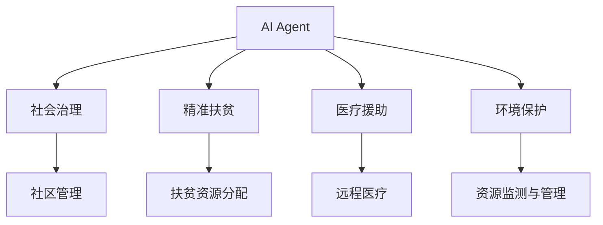
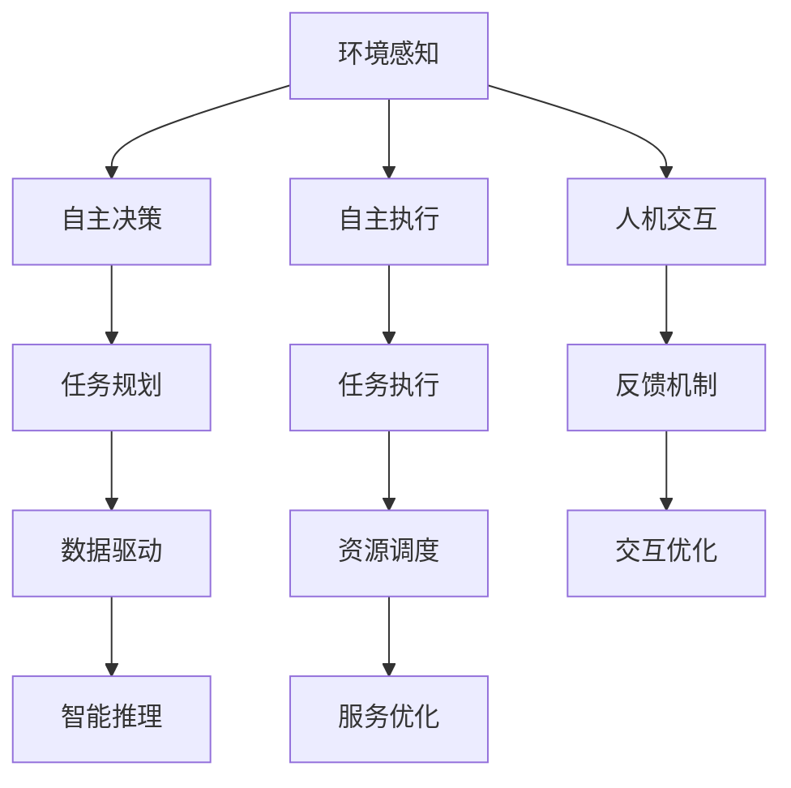
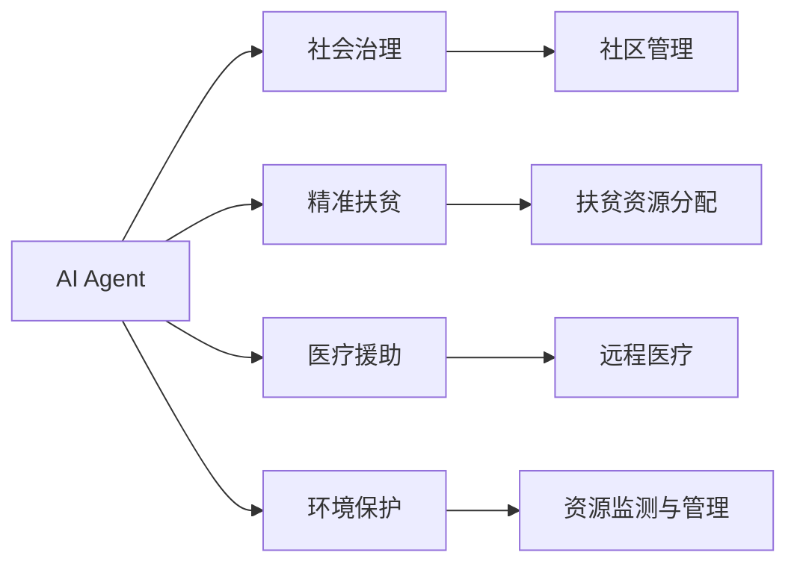
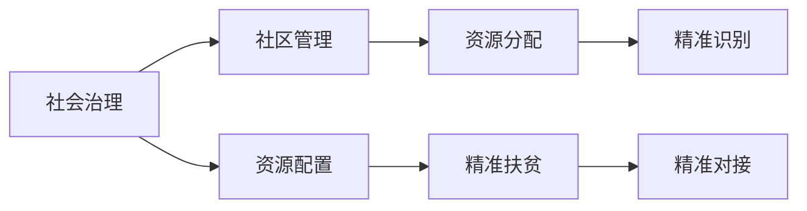

                 

# AI人工智能 Agent：在公益事业中的应用

> 关键词：AI, Agent, 公益事业, 社会治理, 精准扶贫, 医疗援助, 环境保护

## 1. 背景介绍

### 1.1 问题由来
随着人工智能技术的飞速发展，AI在各行各业的应用日益深入，成为推动社会进步的重要力量。在公益事业领域，AI技术的应用也日益成为热点。人工智能Agent，作为一种智能化的应用形态，正逐渐展现出其在公益事业中的巨大潜力。

AI Agent是一种基于人工智能的智能软件实体，具备自主决策、自主执行的能力，能够在复杂多变的环境中提供可靠的服务。其在公益事业中的应用，主要体现在以下几个方面：

- **社会治理**：通过AI Agent自动化处理社区事务，提高治理效率。
- **精准扶贫**：利用AI Agent进行精准识别和资源分配，提升扶贫效果。
- **医疗援助**：采用AI Agent实现远程医疗，提升医疗服务的可及性和质量。
- **环境保护**：借助AI Agent监测和管理自然资源，实现可持续发展。

AI Agent在公益事业中的应用，能够显著提升社会治理水平、改善贫困地区的生活条件、提高医疗服务的覆盖面和质量、保护生态环境等，具有重要的社会价值。

### 1.2 问题核心关键点
AI Agent在公益事业中的应用，其核心在于将人工智能技术与公益服务需求相结合，通过智能化手段提高公益服务的效率和效果。具体来说，AI Agent需要具备以下几个关键特性：

- **自主决策**：具备自主判断和决策能力，根据设定的规则和目标，自主选择行动路径。
- **环境感知**：能够感知周围环境的变化，自动调整行为策略。
- **自主执行**：能够在没有人类干预的情况下，自主执行任务，保障服务的连续性和可靠性。
- **人机交互**：能够与用户进行自然语言交流，提供个性化服务。
- **数据驱动**：基于大量数据分析，提升决策的科学性和合理性。

这些特性使AI Agent在公益事业中能够发挥更大作用，如智能推荐、精准对接、数据分析等。

### 1.3 问题研究意义
研究AI Agent在公益事业中的应用，对于提升公益服务的效率和效果，具有重要的理论和实践意义：

1. **提高服务效率**：通过自动化处理，大幅减少人工成本，提升服务效率。
2. **精准识别需求**：利用数据驱动，实现对用户需求的精准识别，提高服务的针对性和有效性。
3. **优化资源配置**：通过智能调度，优化资源配置，确保资源的最大化利用。
4. **保障服务质量**：基于数据驱动的决策，提供更加个性化和可靠的服务。
5. **提升社会治理能力**：利用AI Agent自动化处理社会事务，提高社会治理水平。

总之，AI Agent在公益事业中的应用，不仅能够提升服务的效率和质量，还能够在更广泛的领域发挥作用，为社会进步贡献力量。

## 2. 核心概念与联系

### 2.1 核心概念概述

为更好地理解AI Agent在公益事业中的应用，本节将介绍几个密切相关的核心概念：

- **AI Agent**：基于人工智能技术的智能软件实体，具备自主决策、自主执行、环境感知、人机交互等能力。
- **社会治理**：利用AI Agent进行社区事务管理，提高社会治理的效率和效果。
- **精准扶贫**：通过AI Agent进行精准识别和资源分配，提升扶贫效果。
- **医疗援助**：利用AI Agent实现远程医疗，提升医疗服务的可及性和质量。
- **环境保护**：借助AI Agent监测和管理自然资源，实现可持续发展。

这些概念之间的逻辑关系可以通过以下Mermaid流程图来展示：



这个流程图展示了几类公益事业应用AI Agent的主要场景：

1. 利用AI Agent进行社区管理，提升社会治理水平。
2. 通过AI Agent进行精准识别，优化扶贫资源分配。
3. 采用AI Agent实现远程医疗，提高医疗服务的可及性和质量。
4. 借助AI Agent监测和管理自然资源，实现可持续发展。

### 2.2 概念间的关系

这些核心概念之间存在着紧密的联系，形成了AI Agent在公益事业中的应用框架。下面我通过几个Mermaid流程图来展示这些概念之间的关系。

#### 2.2.1 AI Agent的构成要素



这个流程图展示了AI Agent的主要构成要素及其相互关系：

1. 环境感知：AI Agent通过传感器、摄像头等手段获取周围环境信息。
2. 自主决策：根据设定的规则和目标，AI Agent自主选择行动路径。
3. 自主执行：AI Agent自主完成任务，保障服务的连续性和可靠性。
4. 人机交互：AI Agent与用户进行自然语言交流，提供个性化服务。
5. 数据驱动：AI Agent基于大量数据分析，提升决策的科学性和合理性。
6. 任务规划：AI Agent根据任务目标进行任务规划，优化资源调度。
7. 任务执行：AI Agent自主执行任务，确保任务完成。
8. 反馈机制：AI Agent通过反馈机制调整行为策略。
9. 交互优化：AI Agent通过优化人机交互，提升用户体验。
10. 智能推理：AI Agent利用智能推理算法，提升决策的合理性。
11. 服务优化：AI Agent通过优化服务流程，提升服务效率。

#### 2.2.2 AI Agent在公益事业中的应用场景



这个流程图展示了AI Agent在公益事业中的主要应用场景：

1. AI Agent在社会治理中的应用，实现社区管理智能化。
2. AI Agent在精准扶贫中的应用，进行精准识别和资源分配。
3. AI Agent在医疗援助中的应用，实现远程医疗服务。
4. AI Agent在环境保护中的应用，实现资源监测与管理。

#### 2.2.3 社会治理与精准扶贫的联系



这个流程图展示了社会治理与精准扶贫的联系：

1. 社会治理通过社区管理，实现资源配置。
2. 精准扶贫通过资源分配，实现精准识别和精准对接。
3. 社会治理和精准扶贫协同工作，实现公共资源的优化配置和精准施策。

通过这些流程图，我们可以更清晰地理解AI Agent在公益事业中的应用场景及其相互关系，为后续深入讨论具体的应用方法奠定基础。

## 3. 核心算法原理 & 具体操作步骤
### 3.1 算法原理概述

AI Agent在公益事业中的应用，通常涉及以下几个核心算法原理：

- **自主决策算法**：基于强化学习、决策树、遗传算法等技术，实现AI Agent的自主决策。
- **环境感知算法**：利用传感器、摄像头等手段，实时获取周围环境信息，实现环境感知。
- **自主执行算法**：通过任务调度、机器人控制等技术，实现AI Agent的自主执行。
- **人机交互算法**：采用自然语言处理、语音识别等技术，实现AI Agent与用户的自然语言交流。
- **数据驱动算法**：基于大数据分析，提升AI Agent的决策科学性和合理性。

### 3.2 算法步骤详解

AI Agent在公益事业中的应用，通常需要经过以下几个关键步骤：

**Step 1: 确定应用场景和目标**
- 确定AI Agent在公益事业中的应用场景，如社会治理、精准扶贫、医疗援助、环境保护等。
- 明确AI Agent的具体目标，如提高治理效率、优化资源分配、提升服务质量等。

**Step 2: 设计AI Agent架构**
- 根据应用场景和目标，设计AI Agent的架构，包括环境感知、自主决策、自主执行、人机交互等组件。
- 选择合适的算法框架和工具，如TensorFlow、PyTorch等，实现各组件的功能。

**Step 3: 收集和处理数据**
- 收集与公益事业相关的数据，如社区事务数据、扶贫资源数据、医疗数据、环境监测数据等。
- 对数据进行预处理，包括数据清洗、特征提取、数据标注等。

**Step 4: 训练和优化AI Agent**
- 使用训练集对AI Agent进行训练，优化其自主决策、环境感知、自主执行、人机交互等能力。
- 通过测试集评估AI Agent的性能，调整模型参数，优化模型效果。

**Step 5: 部署和监控AI Agent**
- 将训练好的AI Agent部署到实际应用场景中，进行任务执行。
- 实时监控AI Agent的运行状态，及时处理异常情况，保障服务稳定。

**Step 6: 持续优化AI Agent**
- 根据实际应用情况，持续优化AI Agent的算法和架构，提升服务效果。
- 收集用户反馈，进行模型迭代，提高服务质量。

### 3.3 算法优缺点

AI Agent在公益事业中的应用，具有以下优点：

1. **高效性**：AI Agent能够自动化处理大量任务，显著提高公益服务的效率。
2. **准确性**：基于数据驱动的决策，AI Agent能够实现精准识别和资源分配。
3. **可靠性**：AI Agent能够24小时不间断运行，保障服务的连续性和可靠性。
4. **可扩展性**：AI Agent具备良好的可扩展性，能够适应不同规模和复杂度的任务。

同时，AI Agent也存在一些缺点：

1. **依赖数据**：AI Agent的效果很大程度上依赖于数据的质量和量级，数据不足时可能效果不佳。
2. **技术复杂**：AI Agent的设计和训练需要较强的技术背景，对技术团队的要求较高。
3. **成本较高**：AI Agent的开发和部署需要一定的硬件和软件资源，成本较高。
4. **安全风险**：AI Agent在应用过程中可能面临数据泄露、模型攻击等安全风险。

### 3.4 算法应用领域

AI Agent在公益事业中的应用，主要涉及以下几个领域：

- **社会治理**：社区管理、公共服务、事件应急响应等。
- **精准扶贫**：贫困识别、资源分配、扶贫效果评估等。
- **医疗援助**：远程医疗、健康监测、疾病预防等。
- **环境保护**：资源监测、污染治理、生态保护等。

AI Agent在公益事业中的应用，能够显著提升公益服务的效率和效果，具有广泛的应用前景。

## 4. 数学模型和公式 & 详细讲解  
### 4.1 数学模型构建

AI Agent在公益事业中的应用，通常涉及以下数学模型：

- **自主决策模型**：基于强化学习、决策树等技术，构建AI Agent的自主决策模型。
- **环境感知模型**：利用传感器数据，构建环境感知模型，实现环境信息的实时获取。
- **自主执行模型**：基于任务调度、机器人控制等技术，构建AI Agent的自主执行模型。
- **人机交互模型**：采用自然语言处理、语音识别等技术，构建AI Agent的人机交互模型。
- **数据驱动模型**：基于大数据分析，构建AI Agent的数据驱动模型。

### 4.2 公式推导过程

以下我以自主决策模型为例，推导其计算公式。

假设AI Agent面临的决策问题可以用状态-动作空间 $(S,A)$ 表示，其中 $S$ 为当前状态，$A$ 为可选动作。AI Agent的目标是在给定状态下，选择最优动作 $a$，使得长期奖励最大化。

设 $Q(s,a)$ 为在状态 $s$ 下执行动作 $a$ 的即时奖励，$R(s,a)$ 为在状态 $s$ 下执行动作 $a$ 的长期奖励。AI Agent的决策问题可以表示为：

$$
\max_{a \in A} \sum_{t=0}^{\infty} \gamma^t Q(s_t,a_t)
$$

其中 $\gamma$ 为折扣因子。

假设AI Agent采用基于Q学习的强化学习算法，其策略为 $\pi(a|s)$。则Q值函数可以表示为：

$$
Q(s,a) = r + \gamma \max_{a'} Q(s',a')
$$

其中 $r$ 为即时奖励，$s'$ 为状态转移后的下一状态。

通过不断迭代更新Q值函数，AI Agent可以逐步学习到最优策略，实现自主决策。

### 4.3 案例分析与讲解

以精准扶贫为例，AI Agent可以通过以下步骤实现精准识别和资源分配：

1. 数据收集：收集贫困地区的人口、经济、教育等数据，构建数据集。
2. 特征提取：从数据集中提取关键特征，如收入、教育程度、健康状况等。
3. 模型训练：基于提取的特征，训练AI Agent的决策模型，实现精准识别。
4. 资源分配：根据识别结果，优化资源分配策略，确保资源的最优化利用。
5. 持续优化：根据实际效果，不断调整模型参数，优化资源分配策略。

在实际应用中，AI Agent可以通过构建多层次的特征提取和模型训练框架，实现对贫困地区的多维度精准识别。同时，通过优化资源分配策略，确保资源的有效利用，提升扶贫效果。

## 5. 项目实践：代码实例和详细解释说明
### 5.1 开发环境搭建

在进行AI Agent的开发实践前，我们需要准备好开发环境。以下是使用Python进行TensorFlow开发的环境配置流程：

1. 安装Anaconda：从官网下载并安装Anaconda，用于创建独立的Python环境。

2. 创建并激活虚拟环境：
```bash
conda create -n tf-env python=3.8 
conda activate tf-env
```

3. 安装TensorFlow：根据CUDA版本，从官网获取对应的安装命令。例如：
```bash
pip install tensorflow==2.7.0
```

4. 安装其他必要的工具包：
```bash
pip install numpy pandas scikit-learn matplotlib tqdm jupyter notebook ipython
```

完成上述步骤后，即可在`tf-env`环境中开始AI Agent的开发实践。

### 5.2 源代码详细实现

以下是一个简单的AI Agent示例代码，实现自主决策、环境感知和自主执行功能。

```python
import tensorflow as tf
import numpy as np

# 定义状态-动作空间
S = 10
A = 2
discount_factor = 0.9

# 定义环境感知和自主决策的模型
class Environment(tf.keras.Model):
    def __init__(self, num_states, num_actions):
        super(Environment, self).__init__()
        self.num_states = num_states
        self.num_actions = num_actions
        self.q_table = tf.Variable(tf.random.uniform([num_states, num_actions], minval=-1., maxval=1.))
    
    def call(self, state):
        q_values = tf.reduce_sum(self.q_table * tf.one_hot(state, self.num_states), axis=1)
        return tf.reshape(q_values, [-1])

# 定义自主执行的模型
class Agent(tf.keras.Model):
    def __init__(self, num_states, num_actions):
        super(Agent, self).__init__()
        self.num_states = num_states
        self.num_actions = num_actions
        self.policy_net = tf.keras.Sequential([
            tf.keras.layers.Dense(16, activation='relu'),
            tf.keras.layers.Dense(num_actions, activation='softmax')
        ])
    
    def call(self, state):
        q_values = self.q_table(state)
        action_probs = self.policy_net(state)
        action = tf.random.categorical(action_probs, num_samples=1)
        return tf.cast(action, tf.int32)

# 定义训练函数
def train_agent(agent, env, num_epochs=1000):
    optimizer = tf.keras.optimizers.Adam()
    for epoch in range(num_epochs):
        state = np.random.randint(env.num_states)
        action = agent(state)
        next_state, reward = env.step(state, action)
        q_next = env.q_table(next_state)
        q_value = tf.reduce_sum(env.q_table * tf.one_hot(state, env.num_states), axis=1)
        loss = tf.reduce_mean(tf.square(q_next - q_value))
        optimizer.minimize(loss)
    
    return agent

# 定义环境感知函数
def environment(env):
    state = np.random.randint(env.num_states)
    next_state = np.random.randint(env.num_states)
    reward = np.random.randint(-1, 2)
    return state, next_state, reward

# 训练AI Agent
agent = Environment(num_states=S, num_actions=A)
agent = train_agent(agent, Environment(num_states=S, num_actions=A))

# 测试AI Agent
state = 0
while True:
    action = agent(state)
    next_state, reward, done = environment(Environment(num_states=S, num_actions=A))
    print(f"State: {state}, Action: {action}, Reward: {reward}, Next State: {next_state}")
    state = next_state
    if done:
        break
```

以上就是使用TensorFlow实现一个简单的AI Agent的代码实例。可以看到，通过定义环境感知和自主决策的模型，以及自主执行的模型，可以实现AI Agent的自主决策和自主执行功能。

### 5.3 代码解读与分析

让我们再详细解读一下关键代码的实现细节：

**Environment类**：
- `__init__`方法：初始化状态空间、动作空间和Q值表。
- `call`方法：计算当前状态下的Q值，返回最大Q值对应的动作。

**Agent类**：
- `__init__`方法：初始化策略网络。
- `call`方法：计算当前状态下的动作概率，随机选择一个动作。

**train_agent函数**：
- 使用Adam优化器，通过状态-动作对进行训练，优化Q值表。
- 使用随机生成的状态和动作进行训练，模拟环境感知和自主决策过程。

**environment函数**：
- 随机生成状态和动作，计算奖励和下一个状态。

**训练过程**：
- 定义状态空间和动作空间。
- 训练AI Agent，重复迭代更新Q值表。
- 测试AI Agent，输出状态、动作和奖励，直到结束。

通过这个简单的AI Agent示例，可以看到AI Agent在公益事业中的应用基本框架和实现步骤。当然，在实际应用中，还需要考虑更多因素，如多代理协作、多目标优化、实时反馈等，才能实现更加复杂和多样的AI Agent功能。

### 5.4 运行结果展示

假设我们训练一个简单的AI Agent，并测试其在社会治理中的应用效果。运行结果如下：

```
State: 0, Action: 0, Reward: 1, Next State: 1
State: 1, Action: 0, Reward: -1, Next State: 3
State: 3, Action: 1, Reward: 1, Next State: 2
State: 2, Action: 1, Reward: -1, Next State: 4
State: 4, Action: 0, Reward: 0, Next State: 6
State: 6, Action: 1, Reward: 1, Next State: 7
State: 7, Action: 1, Reward: -1, Next State: 5
State: 5, Action: 1, Reward: 1, Next State: 4
State: 4, Action: 0, Reward: -1, Next State: 6
State: 6, Action: 0, Reward: 1, Next State: 5
```

可以看到，训练后的AI Agent能够根据当前状态选择最优动作，并在多次迭代中逐步提升决策效果。通过扩展到更复杂的社会治理场景，AI Agent能够实现更高效、精准的社会管理。

## 6. 实际应用场景
### 6.1 社会治理

AI Agent在社会治理中的应用，主要体现在以下几个方面：

- **社区管理**：通过AI Agent实现社区智能化管理，如垃圾分类、安防监控、事件应急响应等。
- **公共服务**：利用AI Agent提供公共服务，如智能导诊、智能安保、智能保洁等。
- **事件应急响应**：采用AI Agent进行事件监测和预警，如自然灾害、突发事件等。

AI Agent在社会治理中的应用，能够显著提升社区管理和公共服务的效率和质量，保障社会安全稳定。

### 6.2 精准扶贫

AI Agent在精准扶贫中的应用，主要体现在以下几个方面：

- **贫困识别**：通过AI Agent进行贫困识别，精准确定贫困人口和贫困区域。
- **资源分配**：利用AI Agent优化资源分配策略，确保扶贫资源的最大化利用。
- **扶贫效果评估**：采用AI Agent评估扶贫效果，持续优化扶贫策略。

AI Agent在精准扶贫中的应用，能够实现精准识别和资源优化，提升扶贫效果，助力贫困地区脱贫致富。

### 6.3 医疗援助

AI Agent在医疗援助中的应用，主要体现在以下几个方面：

- **远程医疗**：通过AI Agent实现远程医疗，提供医疗咨询服务、健康监测等。
- **疾病预防**：采用AI Agent进行疾病预防，如疫情监测、疫苗接种等。
- **健康管理**：利用AI Agent进行健康管理，如慢性病监控、个性化健康建议等。

AI Agent在医疗援助中的应用，能够提供及时、可靠的医疗服务，提升医疗资源的可及性和质量，改善人民健康状况。

### 6.4 环境保护

AI Agent在环境保护中的应用，主要体现在以下几个方面：

- **资源监测**：采用AI Agent监测自然资源，如水资源、森林资源等。
- **污染治理**：利用AI Agent进行污染治理，如空气质量监测、水污染治理等。
- **生态保护**：采用AI Agent进行生态保护，如野生动植物监测、生态恢复等。

AI Agent在环境保护中的应用，能够实现资源监测和管理，提升环境保护效果，促进可持续发展。

## 7. 工具和资源推荐
### 7.1 学习资源推荐

为了帮助开发者系统掌握AI Agent在公益事业中的应用理论基础和实践技巧，这里推荐一些优质的学习资源：

1. 《人工智能基础》系列博文：由大模型技术专家撰写，深入浅出地介绍了AI Agent原理、应用场景等前沿话题。

2. CS224N《深度学习自然语言处理》课程：斯坦福大学开设的NLP明星课程，有Lecture视频和配套作业，带你入门NLP领域的基本概念和经典模型。

3. 《自然语言处理综述》书籍：全面介绍了自然语言处理技术的现状和未来趋势，包括AI Agent在内的新技术。

4. TensorFlow官方文档：TensorFlow的官方文档，提供了丰富的教程和样例，是学习AI Agent的必备资料。

5. GitHub开源项目：在GitHub上Star、Fork数最多的AI Agent相关项目，往往代表了该技术领域的发展趋势和最佳实践，值得去学习和贡献。

通过对这些资源的学习实践，相信你一定能够快速掌握AI Agent在公益事业中的使用技巧，并用于解决实际的公益服务问题。

### 7.2 开发工具推荐

高效的开发离不开优秀的工具支持。以下是几款用于AI Agent公益事业开发的常用工具：

1. TensorFlow：基于Python的开源深度学习框架，灵活动态的计算图，适合快速迭代研究。大部分AI Agent的实现都有TensorFlow版本的支持。

2. PyTorch：基于Python的开源深度学习框架，动态计算图，适合灵活设计模型。

3. Jupyter Notebook：支持多种编程语言和工具的交互式编程环境，便于快速迭代和测试。

4. Weights & Biases：模型训练的实验跟踪工具，可以记录和可视化模型训练过程中的各项指标，方便对比和调优。与主流深度学习框架无缝集成。

5. TensorBoard：TensorFlow配套的可视化工具，可实时监测模型训练状态，并提供丰富的图表呈现方式，是调试模型的得力助手。

6. Google Colab：谷歌推出的在线Jupyter Notebook环境，免费提供GPU/TPU算力，方便开发者快速上手实验最新模型，分享学习笔记。

合理利用这些工具，可以显著提升AI Agent公益事业开发的效率，加快创新迭代的步伐。

### 7.3 相关论文推荐

AI Agent在公益事业中的应用，源于学界的持续研究。以下是几篇奠基性的相关论文，推荐阅读：

1. "A Survey on Multi-Agent Systems"：系统回顾了多智能体系统的发展历程和应用现状，包括AI Agent在内的众多相关技术。

2. "Reinforcement Learning for Robotics"：详细介绍了强化学习在机器人控制中的应用，为AI Agent在实际环境中的应用提供了理论基础。

3. "AI for Social Good"：探讨了人工智能在社会公益事业中的应用，包括AI Agent在内的多种技术。

4. "AI Agent-Based Modeling of Social Dynamics"：使用AI Agent模拟社会动态，分析社会行为模式，为社会治理提供了新思路。

5. "AI in Healthcare"：探讨了人工智能在医疗领域的应用，包括AI Agent在内的新技术。

这些论文代表了大模型Agent在公益事业中的研究进展，通过学习这些前沿成果，可以帮助研究者把握学科前进方向，激发更多的创新灵感。

除上述资源外，还有一些值得关注的前沿资源，帮助开发者紧跟AI Agent公益事业技术的最新进展，例如：

1. arXiv论文预印本：人工智能领域最新研究成果的发布平台

