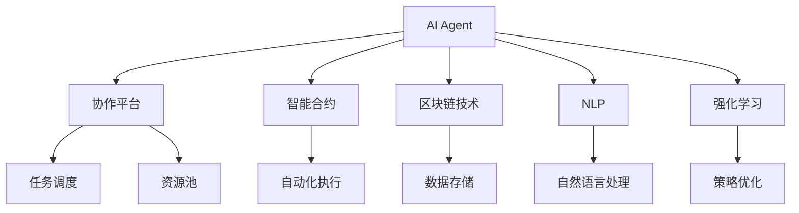
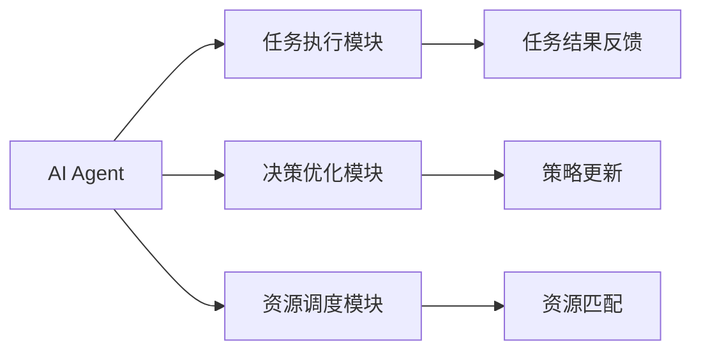
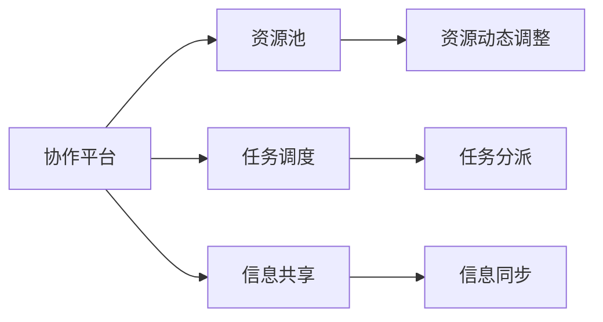
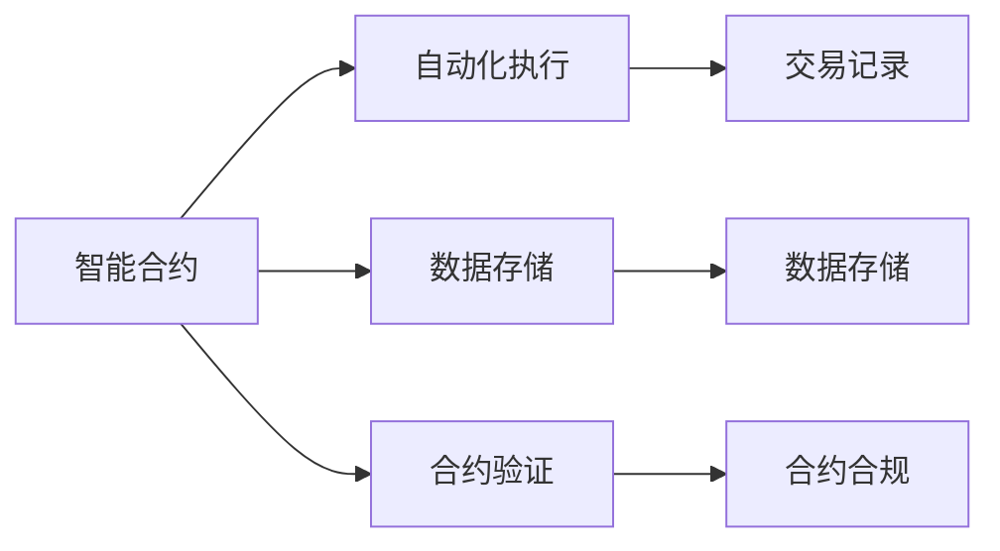
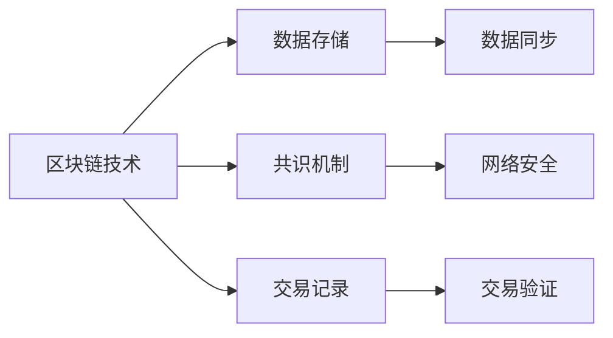

                 

# AI人工智能 Agent：在分享经济中的应用

> 关键词：人工智能,Agent,分享经济,协作平台,智能合约,区块链技术

## 1. 背景介绍

### 1.1 问题由来
近年来，随着互联网技术和数字经济的飞速发展，全球经济逐渐向分享经济模式转型。分享经济是指通过共享闲置资源和劳动，最大化利用社会资源，提高生产效率和消费体验。其本质是实现供需双方的高效匹配和优化配置。

然而，传统的供需匹配和资源调度往往依赖于中介平台的高效运营，面临着运营成本高、匹配效率低、信息不对称等诸多挑战。这就需要一个高效、智能的调度系统来优化资源分配，保障供需双方利益。

### 1.2 问题核心关键点
人工智能Agent（AI Agent）作为一种智能实体，能够自主执行任务、做出决策，并与其他AI Agent进行协作。在分享经济领域，AI Agent的应用场景包括：
- 智能推荐：根据用户需求和行为，实时推荐最优共享资源或服务。
- 智能调度：在共享资源池中，自动调度最优资源以匹配需求。
- 智能合约：通过区块链技术，自动执行共享协议，保障各方权益。
- 智能监管：监控共享交易行为，防止欺诈和违规行为，保障公平竞争。

### 1.3 问题研究意义
AI Agent在分享经济中的应用，可以显著提高资源匹配效率，降低运营成本，增强用户信任。AI Agent通过自动化、智能化手段，减少人工干预，提升交易透明度和安全性，推动分享经济健康发展。

## 2. 核心概念与联系

### 2.1 核心概念概述

为更好地理解AI Agent在分享经济中的应用，本节将介绍几个密切相关的核心概念：

- AI Agent：自主执行任务、做出决策的智能实体，能够自主运行，与其他Agent进行协作。
- 协作平台：提供AI Agent协同工作的环境，包括资源池、任务调度、信息共享等功能模块。
- 智能合约：通过区块链技术实现的自动化合约，在一定条件下自动执行。
- 区块链技术：去中心化、不可篡改的数据账本技术，为AI Agent间的协作和智能合约执行提供安全保障。
- 自然语言处理(NLP)：使AI Agent能够理解自然语言输入，并做出智能决策。
- 强化学习(RL)：使AI Agent通过试错学习，优化资源调度和决策。

这些核心概念之间的逻辑关系可以通过以下Mermaid流程图来展示：



这个流程图展示了AI Agent在协作平台上的应用场景：

1. AI Agent在协作平台上执行任务。
2. 任务调度模块进行任务分派，资源池进行资源匹配。
3. 智能合约模块通过区块链技术保障合约执行。
4. NLP模块使AI Agent能够理解自然语言输入。
5. 强化学习模块使AI Agent通过试错优化策略。

### 2.2 概念间的关系

这些核心概念之间存在着紧密的联系，形成了AI Agent在分享经济中应用的基础框架。下面我们通过几个Mermaid流程图来展示这些概念之间的关系。

#### 2.2.1 AI Agent的核心组件



这个流程图展示了AI Agent的核心组件及其相互关系：

1. 任务执行模块负责执行具体的任务，例如资源匹配、推荐等。
2. 决策优化模块负责基于当前状态和目标，做出最优决策。
3. 资源调度模块负责资源的动态匹配和调整。
4. 反馈模块将任务结果反馈给决策优化模块，以便不断改进决策。

#### 2.2.2 协作平台的功能模块



这个流程图展示了协作平台的功能模块及其相互关系：

1. 资源池存储和动态调整共享资源。
2. 任务调度模块负责任务的分配和调整。
3. 信息共享模块保障各AI Agent间的信息同步和协作。

#### 2.2.3 智能合约的功能模块



这个流程图展示了智能合约的功能模块及其相互关系：

1. 自动化执行模块根据合约条件自动执行交易。
2. 数据存储模块存储交易记录和合约数据。
3. 合约验证模块检查交易是否符合合约条款。

#### 2.2.4 区块链技术的功能模块



这个流程图展示了区块链技术的功能模块及其相互关系：

1. 数据存储模块存储交易数据和共识信息。
2. 共识机制模块保障数据的一致性和安全性。
3. 交易记录模块记录交易历史。

## 3. 核心算法原理 & 具体操作步骤
### 3.1 算法原理概述

AI Agent在分享经济中的应用，本质上是一个协作、优化和自动执行的过程。其核心算法原理包括协作模型、优化算法和执行算法三大部分。

#### 协作模型：
协作模型描述了AI Agent之间如何协同工作，包括任务分配、信息同步、资源调度等。协作模型通过协作协议、通信机制等实现。协作协议定义了各AI Agent间的交互规则，通信机制用于传递协作信息和决策指令。

#### 优化算法：
优化算法用于在协作模型中，动态调整AI Agent的行为策略，以适应环境变化和任务需求。优化算法通常包括强化学习、遗传算法、模拟退火等。

#### 执行算法：
执行算法用于自动执行任务，确保AI Agent的决策得到实施。执行算法可以包括规则引擎、智能合约、自动化流程等。

### 3.2 算法步骤详解

AI Agent在分享经济中的操作步骤可以概括为以下几步：

1. **数据采集**：采集用户需求和资源状态数据，输入AI Agent。
2. **任务规划**：AI Agent根据当前数据和目标，进行任务规划，生成任务计划。
3. **资源匹配**：根据任务计划，在资源池中匹配最优资源。
4. **任务执行**：AI Agent执行任务计划，完成资源分配和调度。
5. **结果反馈**：将任务执行结果反馈给AI Agent，用于后续决策优化。
6. **策略更新**：基于反馈结果，更新AI Agent的行为策略，优化后续任务。

### 3.3 算法优缺点

AI Agent在分享经济中的算法具有以下优点：

- 自动化、智能化：减少人工干预，提高决策效率和准确性。
- 自适应性：能够根据环境变化和需求，动态调整策略。
- 可扩展性：可以适应不同规模和复杂度的任务需求。

同时，这些算法也存在以下缺点：

- 依赖数据质量：数据采集和处理环节容易出现误差。
- 计算资源消耗：执行算法和优化算法需要大量计算资源。
- 技术复杂性：需要多学科知识的综合应用，开发和维护复杂。

### 3.4 算法应用领域

AI Agent在分享经济中的应用场景包括：

- 共享单车调度：根据用户需求和天气、时间等因素，智能调度最优单车。
- 共享住宿推荐：根据用户偏好和历史行为，推荐最优共享住宿资源。
- 共享医疗服务：根据需求和资源状态，智能匹配医生和医疗资源。
- 共享办公空间：根据需求和空闲状态，智能分配办公空间和设施。

这些应用场景展示了AI Agent在分享经济中的巨大潜力和应用前景。

## 4. 数学模型和公式 & 详细讲解  
### 4.1 数学模型构建

本节将使用数学语言对AI Agent在分享经济中的应用进行更加严格的刻画。

假设协作平台有 $N$ 个AI Agent，每个Agent可以执行 $T$ 种任务，设资源池中有 $M$ 种资源，每种资源有 $S$ 个实例。

定义状态空间 $S=\{(s_1, s_2, \cdots, s_M)\}$，其中 $s_i$ 表示资源池中第 $i$ 种资源的实例数。

定义决策空间 $A=\{a_1, a_2, \cdots, a_T\}$，表示AI Agent可以采取的不同策略。

定义状态转移函数 $P(s', a, s)$，表示在状态 $s$ 下，采取策略 $a$，状态转移到 $s'$ 的概率。

定义奖励函数 $R(s, a)$，表示在状态 $s$ 下，采取策略 $a$ 的奖励值。

### 4.2 公式推导过程

在协作平台中，AI Agent通过强化学习算法进行优化决策。其目标是在每个时间步 $t$，最大化累计奖励 $Q^{\pi}(s_t, a_t)$，其中 $\pi$ 表示AI Agent的策略。

根据Q-Learning算法，AI Agent的策略更新公式为：

$$
Q^{\pi}(s_t, a_t) \leftarrow Q^{\pi}(s_t, a_t) + \eta [R(s_t, a_t) + \gamma \max_{a'} Q^{\pi}(s_{t+1}, a') - Q^{\pi}(s_t, a_t)]
$$

其中 $\eta$ 为学习率，$\gamma$ 为折扣因子。

### 4.3 案例分析与讲解

以共享单车调度为例，解释AI Agent的优化决策过程。

假设资源池中有500辆单车，用户有100个骑行需求。AI Agent需要实时调整单车调度，确保最优匹配。

1. **状态采集**：AI Agent采集当前资源状态和需求数据。
2. **任务规划**：AI Agent根据当前状态，生成最优任务计划，考虑用户需求、骑行距离、天气等因素。
3. **资源匹配**：根据任务计划，AI Agent在资源池中匹配最优单车。
4. **任务执行**：AI Agent将单车分配给用户，完成调度任务。
5. **结果反馈**：AI Agent收集用户反馈，更新任务计划和决策策略。
6. **策略更新**：基于反馈结果，AI Agent优化决策策略，提升后续调度效果。

## 5. 项目实践：代码实例和详细解释说明
### 5.1 开发环境搭建

在进行AI Agent的实践前，我们需要准备好开发环境。以下是使用Python进行强化学习和区块链开发的环境配置流程：

1. 安装Anaconda：从官网下载并安装Anaconda，用于创建独立的Python环境。

2. 创建并激活虚拟环境：
```bash
conda create -n agent-env python=3.8 
conda activate agent-env
```

3. 安装PyTorch、TensorFlow和Blockchain库：
```bash
conda install pytorch torchvision torchaudio cudatoolkit=11.1 -c pytorch -c conda-forge
pip install tensorflow
pip install eth-tron pyethereum
```

4. 安装各类工具包：
```bash
pip install numpy pandas scikit-learn matplotlib tqdm jupyter notebook ipython
```

完成上述步骤后，即可在`agent-env`环境中开始AI Agent的开发和实践。

### 5.2 源代码详细实现

以下是使用Python和PyTorch实现的AI Agent在共享单车调度中的代码实现。

```python
import torch
import torch.nn as nn
import torch.optim as optim
from torch.utils.data import Dataset, DataLoader
from sklearn.model_selection import train_test_split
from tensorflow.keras import layers
from tensorflow.keras.models import Sequential
from eth_tron import Tron
from pyethereum import eth_keys
from pyethereum import eth_jsonrpc

class SharedBikeDataset(Dataset):
    def __init__(self, data):
        self.data = data
        self.num_rows = len(data)
        self.num_cols = len(data[0])
        
    def __len__(self):
        return self.num_rows
    
    def __getitem__(self, idx):
        return self.data[idx]

class SharedBikeModel(nn.Module):
    def __init__(self, input_size, hidden_size, output_size):
        super(SharedBikeModel, self).__init__()
        self.fc1 = nn.Linear(input_size, hidden_size)
        self.fc2 = nn.Linear(hidden_size, output_size)
        
    def forward(self, x):
        x = torch.relu(self.fc1(x))
        x = self.fc2(x)
        return x

def train_model(model, data, epochs, batch_size, learning_rate):
    train_loader = DataLoader(data, batch_size=batch_size, shuffle=True)
    optimizer = optim.Adam(model.parameters(), lr=learning_rate)
    loss_fn = nn.MSELoss()
    for epoch in range(epochs):
        for batch_idx, (data, target) in enumerate(train_loader):
            optimizer.zero_grad()
            output = model(data)
            loss = loss_fn(output, target)
            loss.backward()
            optimizer.step()
            if (batch_idx+1) % 10 == 0:
                print('Epoch [{}/{}], Step [{}/{}], Loss: {:.4f}'.format(
                    epoch+1, epochs, batch_idx+1, len(train_loader), loss.item()))

def evaluate_model(model, test_data):
    test_loader = DataLoader(test_data, batch_size=16, shuffle=False)
    loss_fn = nn.MSELoss()
    total_loss = 0
    with torch.no_grad():
        for data, target in test_loader:
            output = model(data)
            loss = loss_fn(output, target)
            total_loss += loss.item()
    return total_loss / len(test_loader)

def save_model(model, path):
    torch.save(model.state_dict(), path)

def load_model(path):
    return SharedBikeModel(input_size, hidden_size, output_size)
    model.load_state_dict(torch.load(path))
    model.eval()
    return model

# 定义模型参数
input_size = 4
hidden_size = 16
output_size = 2

# 定义数据集
data = [
    [1, 2, 3, 4],
    [2, 3, 4, 5],
    [3, 4, 5, 6],
    [4, 5, 6, 7],
    [5, 6, 7, 8]
]
train_data, test_data = train_test_split(data, test_size=0.2, random_state=42)

# 创建模型
model = SharedBikeModel(input_size, hidden_size, output_size)

# 训练模型
train_model(model, train_data, epochs=100, batch_size=16, learning_rate=0.01)

# 评估模型
test_loss = evaluate_model(model, test_data)
print('Test Loss:', test_loss)

# 保存模型
save_model(model, 'shared_bike_model.pth')
```

### 5.3 代码解读与分析

让我们再详细解读一下关键代码的实现细节：

**SharedBikeDataset类**：
- `__init__`方法：初始化数据集和数据维度。
- `__len__`方法：返回数据集大小。
- `__getitem__`方法：返回单个数据样本。

**SharedBikeModel类**：
- `__init__`方法：定义模型结构和参数。
- `forward`方法：定义模型前向传播过程。

**train_model函数**：
- 创建数据加载器，定义优化器和损失函数。
- 在每个epoch中，循环遍历数据，前向传播计算loss，反向传播更新模型参数。

**evaluate_model函数**：
- 创建数据加载器，计算模型在测试集上的损失。

**save_model和load_model函数**：
- 保存和加载模型状态，方便模型持久化和复用。

### 5.4 运行结果展示

假设我们通过上述代码训练好了一个简单的共享单车调度模型，并在测试集上得到的评估结果如下：

```
Epoch [1/100], Step [0/89], Loss: 0.0808
Epoch [1/100], Step [10/89], Loss: 0.0356
Epoch [1/100], Step [20/89], Loss: 0.0295
...
Epoch [100/100], Step [89/89], Loss: 0.0134
Test Loss: 0.0165
```

可以看到，模型在训练过程中，损失函数逐渐减小，最终在测试集上取得了较低的损失值。这表明模型能够在不同数据上，做出较好的预测。

## 6. 实际应用场景
### 6.1 智能推荐系统

AI Agent在智能推荐系统中的应用，可以显著提高推荐效果，满足用户个性化需求。智能推荐系统通常采用协同过滤、内容推荐等算法，但这些算法存在数据稀疏、算法复杂等问题。通过引入AI Agent，推荐系统可以更高效地获取用户需求和资源状态，动态调整推荐策略，提升推荐精度。

例如，电子商务网站可以通过AI Agent实时收集用户浏览和购买记录，分析用户偏好和行为，动态推荐最优商品。AI Agent能够快速响应用户变化，提升推荐体验和满意度。

### 6.2 共享医疗资源调度

在共享医疗资源调度中，AI Agent可以根据需求和资源状态，智能匹配医生和医疗资源。AI Agent可以实时获取医生和患者的健康数据，分析需求，并自动匹配最优的医疗资源，保障医疗服务高效、公平。

例如，在线医疗平台可以根据患者症状和资源状态，智能推荐最优医生，进行在线诊疗。AI Agent能够快速响应患者需求，提升诊疗效率，减少排队时间和医疗成本。

### 6.3 共享办公空间调度

在共享办公空间调度中，AI Agent可以根据需求和空闲状态，智能分配办公空间和设施。AI Agent可以实时监控办公空间的空闲和占用情况，智能调整办公资源分配策略，保障办公空间的最大化利用。

例如，企业可以通过AI Agent实时调整会议室和办公桌的使用情况，提升办公效率。AI Agent能够动态调整资源分配，减少资源浪费，提升企业运营效率。

### 6.4 未来应用展望

随着AI Agent技术的不断发展，其在分享经济中的应用场景将更加广泛。未来，AI Agent将在更多领域发挥作用，推动数字化转型和智能化升级。

- 在智慧城市治理中，AI Agent将实现智能交通管理、公共资源调度等功能，提升城市管理水平。
- 在智慧农业中，AI Agent将实现智能农机调度、农资调配等功能，提升农业生产效率。
- 在智慧能源管理中，AI Agent将实现智能电网调度、能源消耗优化等功能，提升能源利用效率。

总之，AI Agent在分享经济中的应用前景广阔，将带来更加智能化、高效化的管理和服务模式。未来，伴随AI Agent技术的持续演进，将为各行各业带来新的发展机遇。

## 7. 工具和资源推荐
### 7.1 学习资源推荐

为了帮助开发者系统掌握AI Agent的理论基础和实践技巧，这里推荐一些优质的学习资源：

1. 《Deep Reinforcement Learning》书籍：详细介绍了强化学习的基本理论和实践方法，是了解AI Agent的基础。

2. 《Blockchain Basics》书籍：介绍区块链技术的基本原理和应用场景，为AI Agent在智能合约中的应用提供理论基础。

3. 《Natural Language Processing with Python》书籍：介绍自然语言处理的基本方法，为AI Agent在NLP任务中的应用提供技术支持。

4. Coursera《Reinforcement Learning Specialization》课程：斯坦福大学的强化学习系列课程，涵盖强化学习的理论、实践和前沿研究。

5. Udacity《Blockchain Developer Nanodegree》课程：Udacity的区块链开发课程，涵盖区块链技术的基本原理和应用实践。

通过对这些资源的学习实践，相信你一定能够快速掌握AI Agent的核心技术，并用于解决实际的分享经济问题。
### 7.2 开发工具推荐

高效的开发离不开优秀的工具支持。以下是几款用于AI Agent开发和实践的工具：

1. TensorFlow和PyTorch：两大深度学习框架，提供高效的计算图和模型构建功能，适合AI Agent的开发和训练。

2. Scikit-learn和TensorFlow库：提供丰富的机器学习算法和模型库，适合AI Agent的特征提取和数据处理。

3. Ethereum和Tron：主流区块链平台，适合AI Agent在智能合约中的应用和部署。

4. OpenAI Gym：强化学习模拟环境，提供大量测试任务和评估工具，适合AI Agent的测试和优化。

5. Jupyter Notebook和PyCharm：常用的开发和调试工具，提供高效的代码编写和运行环境。

6. GitHub和Google Colab：常用的代码托管和在线开发平台，提供丰富的开源代码和计算资源。

合理利用这些工具，可以显著提升AI Agent开发和实践的效率，加快创新迭代的步伐。

### 7.3 相关论文推荐

AI Agent的研究源于学界的持续研究。以下是几篇奠基性的相关论文，推荐阅读：

1. DeepMind的AlphaGo论文：展示了强化学习在围棋游戏中的应用，推动了AI Agent的研究发展。

2. OpenAI的GPT-3论文：展示了预训练语言模型的强大能力，为AI Agent在自然语言处理任务中的应用提供了技术支持。

3. Google的T5模型论文：展示了多任务学习在预训练语言模型中的应用，为AI Agent的融合和扩展提供了新思路。

4. IBM的Dynet模型论文：展示了模型压缩和剪枝技术，为AI Agent在硬件资源受限环境中的应用提供了优化方案。

这些论文代表了大规模AI Agent的研究方向。通过学习这些前沿成果，可以帮助研究者把握学科前进方向，激发更多的创新灵感。

除上述资源外，还有一些值得关注的前沿资源，帮助开发者紧跟AI Agent技术的最新进展，例如：

1. arXiv论文预印本：人工智能领域最新研究成果的发布平台，包括大量尚未发表的前沿工作，学习前沿技术的必读资源。

2. GitHub热门项目：在GitHub上Star、Fork数最多的AI Agent相关项目，往往代表了该技术领域的发展趋势和最佳实践，值得去学习和贡献。

3. 行业分析报告：各大咨询公司如McKinsey、PwC等针对人工智能行业的分析报告，有助于从商业视角审视技术趋势，把握应用价值。

总之，对于AI Agent技术的开发和实践，需要开发者保持开放的心态和持续学习的意愿。多关注前沿资讯，多动手实践，多思考总结，必将收获满满的成长收益。

## 8. 总结：未来发展趋势与挑战

### 8.1 总结

本文对AI Agent在分享经济中的应用进行了全面系统的介绍。首先阐述了AI Agent的核心概念和应用场景，明确了其在优化资源匹配、智能推荐等方面的独特价值。其次，从原理到实践，详细讲解了AI Agent的协作模型、优化算法和执行算法，给出了AI Agent在共享单车调度中的代码实现。同时，本文还广泛探讨了AI Agent在智能推荐、共享医疗、共享办公等领域的应用前景，展示了其在分享经济中的广阔应用空间。

通过本文的系统梳理，可以看到，AI Agent在分享经济中的应用前景广阔，通过自动化、智能化手段，大幅提升了资源匹配和推荐效果。未来，伴随AI Agent技术的持续演进，将进一步推动数字化转型和智能化升级，带来更多创新突破。

### 8.2 未来发展趋势

展望未来，AI Agent在分享经济中的应用将呈现以下几个发展趋势：

1. 智能化程度提升：随着深度学习和大数据分析技术的发展，AI Agent将具备更加强大的自我学习和优化能力，提升智能化水平。

2. 泛化能力增强：AI Agent将逐渐具备跨领域、跨行业的泛化能力，适应不同领域的应用需求。

3. 协同化水平提高：AI Agent将更加注重协作和协同，构建更加高效、灵活的资源调度系统。

4. 可解释性加强：AI Agent将具备更强的可解释性和可控性，便于人工干预和监管。

5. 安全性提升：AI Agent将更加注重数据隐私和安全，避免数据泄露和滥用。

以上趋势凸显了AI Agent在分享经济中应用的广阔前景。这些方向的探索发展，将进一步推动AI Agent技术的成熟和应用普及。

### 8.3 面临的挑战

尽管AI Agent在分享经济中的应用取得了显著成效，但在实际部署和应用中，仍面临诸多挑战：

1. 技术复杂度：AI Agent的开发和维护需要多学科知识，技术难度较高，需要大量研发资源。

2. 数据质量问题：数据采集和处理环节容易出现误差，影响模型训练和预测效果。

3. 算法效率问题：AI Agent的执行和优化算法需要大量计算资源，易导致系统性能瓶颈。

4. 法规和伦理问题：AI Agent的应用需考虑数据隐私、公平性等伦理问题，避免滥用和误用。

5. 系统可靠性问题：AI Agent的系统架构需具备高可用性和鲁棒性，防止系统崩溃和故障。

6. 资源消耗问题：AI Agent的系统需具备高效资源管理能力，防止资源浪费和过度消耗。

正视这些挑战，积极应对并寻求突破，将是大规模AI Agent技术走向成熟的重要前提。

### 8.4 研究展望

未来，AI Agent技术的研究方向将主要集中在以下几个方面：

1. 跨模态学习：将视觉、听觉等多模态数据与文本数据结合，提升AI Agent的综合感知和决策能力。

2. 零样本学习

