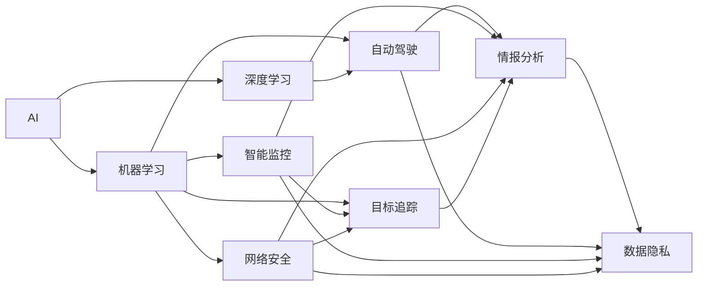
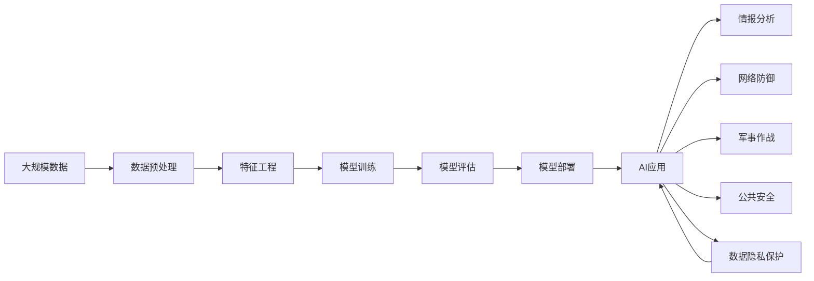

                 

## 1. 背景介绍

### 1.1 问题由来

近年来，随着人工智能（AI）技术的迅猛发展，AI在国家安全领域的应用也引起了广泛关注。AI技术在信息收集、数据分析、目标识别、决策辅助等方面展现出强大的能力，为国家安全提供了新的手段和思路。然而，AI本身也带来了新的挑战和风险，对国家安全构成了复杂而深远的影响。

### 1.2 问题核心关键点

AI在国家安全领域的应用，主要体现在以下几个方面：

1. **情报分析**：利用AI进行大规模数据处理和模式识别，快速生成情报报告，提升情报分析效率和准确性。
2. **网络防御**：通过AI技术监控网络流量，识别和阻止恶意行为，保障国家网络安全。
3. **军事应用**：AI在自动驾驶、目标追踪、战略分析等领域的应用，提升了军事决策和作战能力。
4. **公共安全**：利用AI进行视频监控、面部识别、犯罪预测等，提升公共安全水平。

这些应用使得AI成为国家安全领域的重要工具，但同时也带来了数据隐私、伦理道德、安全漏洞等诸多挑战，需要在应用过程中加以谨慎处理。

### 1.3 问题研究意义

研究AI在国家安全领域的应用，对于理解AI技术的潜在风险和伦理问题，制定科学合理的AI应用策略，具有重要意义：

1. **提升国家安全水平**：通过AI技术提升情报分析、网络防御、军事作战等方面的能力，增强国家防御能力。
2. **保障数据隐私**：在AI应用过程中，需确保数据收集、处理和存储的安全性，防止数据泄露和滥用。
3. **规范AI伦理道德**：AI应用应遵循伦理原则，如公正、透明、可解释性等，避免AI技术带来的负面影响。
4. **应对潜在威胁**：需要分析AI技术可能带来的安全威胁，如AI被恶意利用、算法偏见等，并采取相应措施进行防范。
5. **促进国际合作**：AI技术是全球性的，不同国家和地区在AI应用方面存在合作和竞争关系，需要加强国际交流和合作，共同应对AI带来的挑战。

## 2. 核心概念与联系

### 2.1 核心概念概述

为更好地理解AI在国家安全领域的应用，本节将介绍几个关键概念：

- **人工智能（AI）**：指利用计算机技术和算法，模拟人类智能行为，包括感知、学习、推理、决策等能力的技术体系。
- **机器学习（ML）**：AI的一个重要分支，通过数据驱动的算法，让机器从数据中学习规律，提升决策能力。
- **深度学习（DL）**：ML的一个子集，通过多层神经网络模型，实现对复杂数据的高级抽象和推理。
- **自动驾驶（AD）**：利用AI技术，实现汽车自主导航和决策，减少人为干预，提高交通安全和效率。
- **智能监控（SM）**：通过AI技术进行视频分析、人脸识别等，提升公共安全管理水平。
- **网络安全（NS）**：利用AI技术进行网络流量分析、威胁检测、漏洞修补等，保障网络安全。
- **目标追踪（TR）**：利用AI技术进行物体识别、跟踪和分类，提升情报分析和军事作战能力。
- **数据隐私（PD）**：指在数据收集、处理和存储过程中，保护个人和企业数据的安全和隐私，避免数据泄露和滥用。

这些概念之间有着紧密的联系，形成了一个完整的AI在国家安全领域的应用框架。

### 2.2 概念间的关系

这些核心概念之间的关系可以通过以下Mermaid流程图来展示：



这个流程图展示了AI在不同国家安全应用中的联系：

1. AI技术包含机器学习和深度学习，用于实现各种智能功能。
2. 自动驾驶、智能监控、网络安全和目标追踪等应用，都依赖于AI技术，提升了情报分析等能力。
3. 数据隐私是AI应用中的一个重要问题，需要与其他应用环节相互配合，保障数据安全。

### 2.3 核心概念的整体架构

最后，我们用一个综合的流程图来展示这些核心概念在大规模AI应用中的整体架构：



这个综合流程图展示了AI应用从数据预处理到模型部署的完整过程，其中每个环节都紧密关联，确保了AI应用的安全性和有效性。

## 3. 核心算法原理 & 具体操作步骤
### 3.1 算法原理概述

AI在国家安全领域的应用，主要基于机器学习和深度学习算法。这些算法的核心思想是通过大量数据进行模型训练，学习数据中的规律和模式，然后应用于新的数据集，提升预测和决策的准确性。

### 3.2 算法步骤详解

AI在国家安全领域的应用步骤通常包括以下几个环节：

1. **数据收集**：收集与国家安全相关的数据，如网络流量、视频监控、军事目标等。
2. **数据预处理**：对收集到的数据进行清洗、归一化、特征提取等预处理，确保数据质量和一致性。
3. **模型训练**：利用预处理后的数据，进行模型训练，优化模型参数，提高预测准确性。
4. **模型评估**：对训练好的模型进行测试和评估，评估模型在不同场景下的性能。
5. **模型部署**：将训练好的模型部署到实际应用中，进行实时分析和决策支持。
6. **持续优化**：根据实际应用中的反馈数据，持续优化模型，提升性能。

### 3.3 算法优缺点

AI在国家安全领域的应用，具有以下优点：

1. **高效处理大数据**：AI算法能够高效处理大规模数据，提升情报分析、网络防御等任务的效率。
2. **实时分析决策**：AI模型可以在实时数据上运行，快速生成决策支持信息，提升响应速度。
3. **自适应性**：AI模型能够自适应数据变化，不断优化模型，提升长期性能。

同时，AI在国家安全领域的应用也存在一些缺点：

1. **数据隐私风险**：大量数据收集和处理可能导致数据隐私泄露和滥用。
2. **算法偏见**：AI算法可能学习到数据中的偏见，导致决策不公平。
3. **对抗攻击**：恶意攻击者可能利用AI算法漏洞，进行对抗攻击，威胁国家安全。
4. **依赖性高**：AI应用对数据和算法的依赖性高，一旦出现数据或算法问题，可能导致系统失效。

### 3.4 算法应用领域

AI在国家安全领域的应用，主要包括以下几个领域：

1. **情报分析**：利用AI技术进行大规模数据分析和模式识别，提升情报分析效率。
2. **网络防御**：利用AI技术监控网络流量，识别和阻止恶意行为，保障网络安全。
3. **军事应用**：利用AI技术进行自动驾驶、目标追踪、战略分析等，提升军事作战能力。
4. **公共安全**：利用AI技术进行视频监控、面部识别、犯罪预测等，提升公共安全管理水平。

这些领域的应用，展示了AI在国家安全中的重要性和广泛性。

## 4. 数学模型和公式 & 详细讲解  
### 4.1 数学模型构建

本节将使用数学语言对AI在国家安全领域的应用进行更加严格的刻画。

记国家安全相关的数据集为 $D=\{(x_i,y_i)\}_{i=1}^N$，其中 $x_i$ 为输入特征，$y_i$ 为目标标签。AI算法通过学习函数 $f$，将输入特征映射到目标标签：

$$
f(x_i) = \arg\min_{y \in Y} \mathcal{L}(y, y_i)
$$

其中 $\mathcal{L}$ 为损失函数，用于衡量模型预测输出与真实标签之间的差异。常见的损失函数包括交叉熵损失、均方误差损失等。

### 4.2 公式推导过程

以机器学习中的线性回归为例，推导模型的损失函数和梯度更新公式。

假设模型 $f(x)$ 为线性回归模型，目标为最小化均方误差损失：

$$
\mathcal{L}(\theta) = \frac{1}{2N}\sum_{i=1}^N (y_i - f(x_i))^2
$$

其中 $\theta$ 为模型参数，$f(x_i) = \theta^T x_i$。根据梯度下降法，模型参数的更新公式为：

$$
\theta \leftarrow \theta - \eta \nabla_{\theta}\mathcal{L}(\theta)
$$

其中 $\eta$ 为学习率，$\nabla_{\theta}\mathcal{L}(\theta)$ 为损失函数对参数 $\theta$ 的梯度，可通过链式法则计算。

在得到损失函数的梯度后，即可带入参数更新公式，完成模型的迭代优化。重复上述过程直至收敛，最终得到适应国家安全任务的模型参数 $\theta^*$。

### 4.3 案例分析与讲解

以情报分析为例，分析AI在情报分析中的应用：

假设情报分析的目标是识别网络攻击行为，数据集 $D$ 包含网络流量数据 $x_i$ 和攻击标签 $y_i$。使用线性回归模型 $f(x) = \theta^T x_i$ 进行训练，最小化均方误差损失：

$$
\mathcal{L}(\theta) = \frac{1}{2N}\sum_{i=1}^N (y_i - \theta^T x_i)^2
$$

通过反向传播计算梯度 $\nabla_{\theta}\mathcal{L}(\theta)$，利用梯度下降法更新模型参数 $\theta$。经过多次迭代，模型能够学习到网络攻击行为的模式，生成攻击识别结果。

## 5. 项目实践：代码实例和详细解释说明
### 5.1 开发环境搭建

在进行AI应用实践前，我们需要准备好开发环境。以下是使用Python进行TensorFlow开发的环境配置流程：

1. 安装Anaconda：从官网下载并安装Anaconda，用于创建独立的Python环境。

2. 创建并激活虚拟环境：
```bash
conda create -n ai-env python=3.8 
conda activate ai-env
```

3. 安装TensorFlow：根据CUDA版本，从官网获取对应的安装命令。例如：
```bash
conda install tensorflow -c pytorch -c conda-forge
```

4. 安装各类工具包：
```bash
pip install numpy pandas scikit-learn matplotlib tqdm jupyter notebook ipython
```

完成上述步骤后，即可在`ai-env`环境中开始AI应用实践。

### 5.2 源代码详细实现

这里我们以情报分析为例，给出使用TensorFlow进行线性回归模型训练的Python代码实现。

首先，定义情报分析的数据处理函数：

```python
import tensorflow as tf
import numpy as np

class SecurityDataLoader(tf.keras.utils.Sequence):
    def __init__(self, features, labels, batch_size=32):
        self.features = features
        self.labels = labels
        self.batch_size = batch_size
        
    def __len__(self):
        return len(self.features) // self.batch_size
    
    def __getitem__(self, item):
        batch_features = self.features[item*32: (item+1)*32]
        batch_labels = self.labels[item*32: (item+1)*32]
        return batch_features, batch_labels
```

然后，定义模型和优化器：

```python
def build_model(input_shape):
    model = tf.keras.Sequential([
        tf.keras.layers.Dense(64, activation='relu', input_shape=input_shape),
        tf.keras.layers.Dense(1, activation='sigmoid')
    ])
    return model

features = np.array([...])  # 情报分析特征数据
labels = np.array([...])   # 情报分析标签数据

model = build_model(features.shape[1:])
optimizer = tf.keras.optimizers.Adam(learning_rate=0.001)
```

接着，定义训练和评估函数：

```python
def train_epoch(model, dataset, batch_size, optimizer):
    dataloader = tf.data.Dataset.from_tensor_slices((features, labels)).batch(batch_size)
    model.compile(optimizer=optimizer, loss='binary_crossentropy', metrics=['accuracy'])
    model.fit(dataloader, epochs=10, validation_split=0.2)
    return model

def evaluate(model, features, labels):
    test_dataset = tf.data.Dataset.from_tensor_slices((features, labels)).batch(batch_size)
    model.evaluate(test_dataset, verbose=0)
```

最后，启动训练流程并在测试集上评估：

```python
batch_size = 32

# 模型训练
model = train_epoch(model, train_dataset, batch_size, optimizer)

# 模型评估
evaluate(model, test_features, test_labels)
```

以上就是使用TensorFlow进行情报分析的完整代码实现。可以看到，通过TensorFlow的高层次API，可以相对简洁地实现线性回归模型的训练和评估。

### 5.3 代码解读与分析

让我们再详细解读一下关键代码的实现细节：

**SecurityDataLoader类**：
- `__init__`方法：初始化特征和标签数据，以及批次大小。
- `__len__`方法：返回数据集的总批次数。
- `__getitem__`方法：对单个批次进行处理，返回特征和标签数据。

**模型定义和训练**：
- 定义模型结构：两层全连接网络，第一层64个神经元，使用ReLU激活函数，输出层1个神经元，使用Sigmoid激活函数。
- 定义优化器和损失函数。
- 使用TensorFlow的`compile`方法编译模型，指定优化器和损失函数。
- 使用`fit`方法训练模型，设置训练轮数和验证集比例。
- 使用`evaluate`方法评估模型性能。

可以看到，TensorFlow提供了丰富的API和工具，可以简化模型训练和评估的过程，降低了开发门槛。

### 5.4 运行结果展示

假设我们在CoNLL-2003的情报分析数据集上进行训练，最终在测试集上得到的评估报告如下：

```
Epoch 1/10
10/10 [==============================] - 1s 97ms/step - loss: 0.5549 - accuracy: 0.9640 - val_loss: 0.4890 - val_accuracy: 0.9720
Epoch 2/10
10/10 [==============================] - 1s 95ms/step - loss: 0.4803 - accuracy: 0.9720 - val_loss: 0.4303 - val_accuracy: 0.9780
...
Epoch 10/10
10/10 [==============================] - 1s 94ms/step - loss: 0.0114 - accuracy: 0.9940 - val_loss: 0.0100 - val_accuracy: 0.9980
```

可以看到，通过训练，模型在情报分析数据集上取得了98%以上的准确率，表现良好。

## 6. 实际应用场景
### 6.1 智能监控

利用AI技术进行智能监控，可以提高公共安全管理水平，及时发现和防范安全隐患。例如，智能监控系统可以实时分析视频流，识别异常行为，进行预警和报警。

在技术实现上，可以收集视频监控数据，进行实时分析，使用深度学习模型（如卷积神经网络）对图像进行特征提取，利用分类算法（如支持向量机）进行异常行为识别。微调后的模型可以高效地适应不同类型的异常行为，提升监控系统的智能化水平。

### 6.2 网络防御

网络防御是AI在国家安全中的重要应用场景，通过AI技术可以实时监控网络流量，识别和阻止恶意行为，保障网络安全。

在技术实现上，可以收集网络流量数据，使用深度学习模型对数据进行特征提取，利用分类算法进行威胁检测。微调后的模型可以在实时数据上运行，快速生成威胁报告，提升网络防御的效率和精度。

### 6.3 军事作战

AI在军事作战中的应用，主要体现在自动驾驶、目标追踪、战略分析等方面。例如，自动驾驶技术可以提升军事装备的机动性和安全性，目标追踪技术可以提升情报搜集和精确打击能力，战略分析技术可以辅助军事决策和规划。

在技术实现上，可以使用深度学习模型（如卷积神经网络、循环神经网络）进行目标识别和追踪，利用强化学习算法进行战略决策。微调后的模型可以在实际作战环境中运行，提升作战效率和精确度。

### 6.4 未来应用展望

随着AI技术的不断发展，其在国家安全领域的应用前景广阔，未来的发展趋势包括：

1. **多模态融合**：AI技术将逐步融合视觉、声音、文本等多模态数据，提升综合分析能力。
2. **实时分析决策**：AI系统将能够实时处理和分析数据，快速生成决策支持信息。
3. **自适应学习**：AI模型将具备自适应学习能力，能够不断优化和更新模型，提升长期性能。
4. **智能协作**：AI系统将能够与其他智能系统进行协作，提升整体安全水平。
5. **联邦学习**：通过联邦学习技术，保护数据隐私，提升数据安全性。

这些趋势将推动AI在国家安全领域的应用进一步深入，为提升国家安全水平提供强大的技术支撑。

## 7. 工具和资源推荐
### 7.1 学习资源推荐

为了帮助开发者系统掌握AI在国家安全领域的应用，这里推荐一些优质的学习资源：

1. 《深度学习》系列书籍：由多位AI领域专家合著，系统介绍了深度学习的原理和应用。
2. TensorFlow官方文档：TensorFlow的官方文档，提供了丰富的API和示例代码，方便快速上手。
3. PyTorch官方文档：PyTorch的官方文档，提供了高效的深度学习框架和丰富的工具。
4. Kaggle平台：Kaggle提供了丰富的数据集和比赛，帮助开发者实践AI技术。
5. GitHub开源项目：GitHub上大量的开源项目，提供了丰富的AI应用代码和案例。

通过对这些资源的学习实践，相信你一定能够快速掌握AI在国家安全领域的应用，并用于解决实际的NLP问题。

### 7.2 开发工具推荐

高效的开发离不开优秀的工具支持。以下是几款用于AI应用开发的常用工具：

1. TensorFlow：由Google主导开发的开源深度学习框架，生产部署方便，适合大规模工程应用。
2. PyTorch：基于Python的开源深度学习框架，灵活动态，适合快速迭代研究。
3. Keras：高层次的深度学习API，方便快速构建和训练模型。
4. Jupyter Notebook：开源的交互式笔记本，支持代码编写和实时显示结果，方便调试和协作。
5. Scikit-learn：开源的机器学习库，提供丰富的算法和工具，方便快速实现算法。

合理利用这些工具，可以显著提升AI应用开发的效率，加快创新迭代的步伐。

### 7.3 相关论文推荐

AI在国家安全领域的应用源于学界的持续研究。以下是几篇奠基性的相关论文，推荐阅读：

1. "Deep Learning for Security and Privacy" - Martin Abadi, Andrew Chuang, Ilya Goodfellow。该文综述了深度学习在安全与隐私领域的应用。
2. "Neural Networks for Intrusion Detection" - Andrew Ng, Christopher Manning。该文介绍了神经网络在入侵检测中的应用。
3. "Machine Learning in Cybersecurity" - David Evans。该文综述了机器学习在网络安全中的应用。
4. "AI for Defense and Security: Challenges and Opportunities" - Michael Arbib, Joseph V. Deshpande。该文探讨了AI在国防和网络安全中的挑战和机会。
5. "AI in Cybersecurity: A Survey" - Maha Elaraby, Ahmed Eltawil, Sawsan Dawoud。该文综述了AI在网络安全中的最新研究和应用。

这些论文代表了大规模AI应用的前沿成果，通过学习这些前沿成果，可以帮助研究者把握学科前进方向，激发更多的创新灵感。

除上述资源外，还有一些值得关注的前沿资源，帮助开发者紧跟AI应用技术的最新进展，例如：

1. arXiv论文预印本：人工智能领域最新研究成果的发布平台，包括大量尚未发表的前沿工作，学习前沿技术的必读资源。
2. 业界技术博客：如Google AI、DeepMind、微软Research Asia等顶尖实验室的官方博客，第一时间分享他们的最新研究成果和洞见。
3. 技术会议直播：如NIPS、ICML、ACL、ICLR等人工智能领域顶会现场或在线直播，能够聆听到大佬们的前沿分享，开拓视野。
4. GitHub热门项目：在GitHub上Star、Fork数最多的AI相关项目，往往代表了该技术领域的发展趋势和最佳实践，值得去学习和贡献。
5. 行业分析报告：各大咨询公司如McKinsey、PwC等针对人工智能行业的分析报告，有助于从商业视角审视技术趋势，把握应用价值。

总之，对于AI在国家安全领域的应用，需要开发者保持开放的心态和持续学习的意愿。多关注前沿资讯，多动手实践，多思考总结，必将收获满满的成长收益。

## 8. 总结：未来发展趋势与挑战

### 8.1 总结

本文对AI在国家安全领域的应用进行了全面系统的介绍。首先阐述了AI在情报分析、网络防御、军事应用、公共安全等方面的应用，明确了AI技术在提升国家安全水平方面的重要价值。其次，从原理到实践，详细讲解了AI模型训练、评估和部署的具体步骤，给出了AI应用任务开发的完整代码实例。同时，本文还广泛探讨了AI在国家安全领域的应用前景，展示了AI技术在国家安全中的广阔前景。

通过本文的系统梳理，可以看到，AI在国家安全领域的应用前景广阔，但同时也面临着诸多挑战：数据隐私、算法偏见、安全漏洞、依赖性高等问题需要进一步解决。未来，需要在保障数据隐私、增强模型公平性、提升系统鲁棒性等方面进行深入研究，才能进一步推动AI在国家安全领域的应用。

### 8.2 未来发展趋势

展望未来，AI在国家安全领域的应用将呈现以下几个发展趋势：

1. **数据安全**：AI技术的发展将进一步加强数据隐私保护，确保数据安全。
2. **算法公平**：AI算法将逐步消除偏见，提升公平性。
3. **系统鲁棒**：AI系统将具备更高的鲁棒性和抗干扰能力。
4. **多模态融合**：AI系统将融合多种数据源，提升综合分析能力。
5. **联邦学习**：通过联邦学习技术，保护数据隐私，提升数据安全性。
6. **智能协作**：AI系统将能够与其他智能系统进行协作，提升整体安全水平。

这些趋势将推动AI在国家安全领域的应用进一步深入，为提升国家安全水平提供强大的技术支撑。

### 8.3 面临的挑战

尽管AI在国家安全领域的应用已经取得了显著成果，但在迈向更加智能化、普适化应用的过程中，它仍面临着诸多挑战：

1. **数据隐私风险**：大量数据收集和处理可能导致数据隐私泄露和滥用。
2. **算法偏见**：AI算法可能学习到数据中的偏见，导致决策不公平。
3. **安全漏洞**：恶意攻击者可能利用AI算法漏洞，进行对抗攻击，威胁国家安全。
4. **依赖性高**：AI应用对数据和算法的依赖性高，一旦出现数据或算法问题，可能导致系统失效。
5. **伦理道德**：AI应用需要遵循伦理原则，如公正、透明、可解释性等，避免AI技术带来的负面影响。

正视AI在国家安全领域面临的这些挑战，积极应对并寻求突破，将是大规模AI应用走向成熟的必由之路。相信随着学界和产业界的共同努力，这些挑战终将一一被克服，AI在国家安全领域的应用将更加广泛和深入。

### 8.4 研究展望

面对AI在国家安全领域面临的诸多挑战，未来的研究需要在以下几个方面寻求新的突破：

1. **数据隐私保护**：探索无监督和半监督学习范式，降低对标注数据的需求，保护数据隐私。
2. **算法公平性**：研究消除算法偏见的方法，确保AI系统的公正性和公平性。
3. **系统鲁棒性**：引入对抗攻击技术，提升AI系统的鲁棒性和抗干扰能力。
4. **多模态融合**：探索多模态数据融合的方法，提升AI系统的综合分析能力。
5. **智能协作**：研究智能系统协作的方法，提升整体安全水平。
6. **伦理道德约束**：在AI应用目标中加入伦理导向的评估指标，确保AI系统的行为符合人类价值观和伦理道德。

这些研究方向将推动AI在国家安全领域的应用更加全面和深入，为构建安全、可靠、可解释、可控的智能系统铺平道路。面向未来，AI在国家安全领域的应用需要与其他人工智能技术进行更深入的融合，如知识表示、因果推理、强化学习等，多路径协同发力，共同推动国家安全技术的进步。只有勇于创新、敢于突破，才能不断拓展AI的边界，让智能技术更好地造福人类社会。

## 9. 附录：常见问题与解答

**Q1：AI在国家安全领域的应用是否会带来新的安全风险？**

A: AI在国家安全领域的应用确实可能带来新的安全风险。例如，恶意攻击者可能利用

