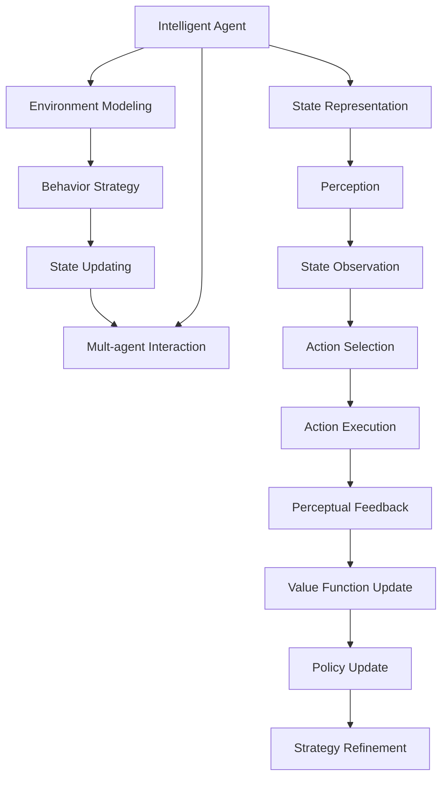
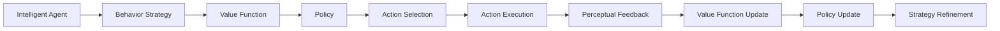
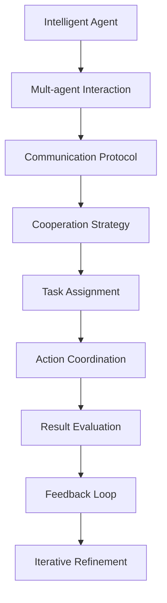
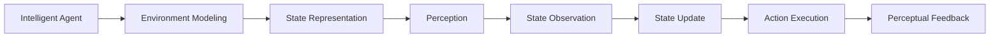

                 

# AI人工智能 Agent：高级概念剖析

> 关键词：人工智能，AI Agent，自主决策，多智能体系统，强化学习，行为策略，环境建模，人机交互

## 1. 背景介绍

### 1.1 问题由来

随着人工智能(AI)技术的迅猛发展，智能代理(AI Agent)已经广泛应用于各类场景，如自动驾驶、智能推荐、工业自动化等。智能代理是一种能够在特定环境中自主决策、执行任务的智能系统，其核心目标是最大化某个特定的价值函数或性能指标。智能代理的核心概念主要包括环境建模、行为策略和状态更新等，并在多智能体系统中进行交互。

然而，智能代理的设计和实现过程中，仍存在诸多技术挑战。例如，如何构建有效的行为策略，以应对环境中的不确定性和复杂性；如何在高维状态空间中进行高效的搜索；如何在多智能体系统中进行合理的交互与协作等。这些问题正是本篇博客文章旨在探讨的核心内容。

### 1.2 问题核心关键点

智能代理的核心问题在于如何构建有效的行为策略，以最大化其在特定环境下的表现。其核心思想是：在给定的环境模型下，智能代理通过不断试错，逐步学习并调整自己的行为策略，以适应不断变化的环境。主要涉及以下几个关键点：

1. **环境建模**：环境建模是智能代理进行自主决策的前提，它涉及对环境的感知、建模和预测。
2. **行为策略**：行为策略是智能代理的行动指南，它决定了代理在环境中的行动方案。
3. **状态更新**：状态更新是智能代理感知环境、执行行动后的状态变化过程。
4. **多智能体交互**：多智能体系统中，智能代理需要与多个代理进行交互与协作，从而实现共同的目标。

智能代理的这些核心问题，需要通过一系列的高级概念和技术手段来解决，以实现其高效、稳定和可靠的行为。

### 1.3 问题研究意义

研究智能代理的设计和实现，对于推动人工智能技术在各领域的广泛应用，提升系统性能和用户满意度，具有重要意义：

1. **推动技术进步**：智能代理作为AI技术的重要分支，其研究和应用可以推动AI技术的发展，带来新的研究方向和突破。
2. **提升系统效率**：智能代理能够自主决策、执行任务，从而提升系统的效率和灵活性。
3. **增强用户体验**：智能代理能够实时响应用户需求，提供个性化、定制化的服务，提升用户满意度。
4. **促进跨领域应用**：智能代理技术可以应用于多个领域，如自动驾驶、工业自动化、金融服务等，推动各行业的数字化转型。
5. **带来商业价值**：智能代理在提升系统效率、降低成本、创造新的业务模式等方面具有显著的商业价值。

## 2. 核心概念与联系

### 2.1 核心概念概述

为更好地理解智能代理的设计和实现，本节将介绍几个密切相关的核心概念：

- **智能代理(AI Agent)**：能够在特定环境中自主决策、执行任务的智能系统。
- **环境建模(Environment Modeling)**：对环境进行感知、建模和预测的过程，是智能代理进行自主决策的前提。
- **行为策略(Behavior Strategy)**：智能代理的行动指南，决定了代理在环境中的行动方案。
- **状态更新(State Updating)**：智能代理感知环境、执行行动后的状态变化过程。
- **多智能体交互(Multi-agent Interaction)**：多个智能代理在环境中的交互与协作过程。

这些核心概念之间的逻辑关系可以通过以下Mermaid流程图来展示：



这个流程图展示了许多关键概念之间的关系：

1. 智能代理通过环境建模获取环境信息，形成对环境的初步认识。
2. 智能代理根据环境信息，制定行为策略，指导行动方案。
3. 智能代理执行行动，根据环境反馈进行状态更新。
4. 智能代理在多智能体系统中与多个代理进行交互和协作。
5. 智能代理通过状态表示、感知、观察、选择、执行、反馈和价值函数更新等过程，不断调整策略，提升表现。

### 2.2 概念间的关系

这些核心概念之间存在着紧密的联系，形成了智能代理的高效行为循环。下面通过几个Mermaid流程图来展示这些概念之间的关系。

#### 2.2.1 智能代理的行为策略设计



这个流程图展示了智能代理行为策略设计的关键环节，包括价值函数、策略、行动选择、行动执行、感知反馈、价值函数更新、策略更新和策略优化。

#### 2.2.2 多智能体系统的协作



这个流程图展示了多智能体系统中，智能代理之间的协作过程，包括通信协议、协作策略、任务分配、行动协调、结果评估和迭代优化。

#### 2.2.3 环境建模与状态更新



这个流程图展示了智能代理在环境建模与状态更新中的关键步骤，包括环境建模、状态表示、感知、观察、更新、行动执行和感知反馈。

### 2.3 核心概念的整体架构

最后，我们用一个综合的流程图来展示这些核心概念在大规模智能代理系统中的整体架构：

```mermaid
graph TB
    A[Intelligent Agent] --> B[Environment Modeling]
    B --> C[Behavior Strategy]
    C --> D[State Updating]
    D --> E[Mult-agent Interaction]
    E --> F[Communication Protocol]
    F --> G[Cooperation Strategy]
    G --> H[Task Assignment]
    H --> I[Action Coordination]
    I --> J[Action Execution]
    J --> K[Perceptual Feedback]
    K --> L[Value Function Update]
    L --> M[Policy Update]
    M --> N[Strategy Refinement]
    N --> O[Policy Iteration]
    O --> P[Exploration-Exploitation Trade-off]
    P --> Q[Reinforcement Learning]
    Q --> R[Action Selection]
    R --> S[State Observation]
    S --> T[State Update]
    T --> U[Action Execution]
    U --> V[Perceptual Feedback]
    V --> W[Value Function Update]
    W --> X[Policy Update]
    X --> Y[Strategy Refinement]
    Y --> Z[Exploration-Exploitation Trade-off]
    Z --> AA[Reinforcement Learning]
    AA --> AB[Action Selection]
    AB --> AC[State Observation]
    AC --> AD[State Update]
    AD --> AE[Action Execution]
    AE --> AF[Perceptual Feedback]
    AF --> AG[Value Function Update]
    AG --> AH[Policy Update]
    AH --> AI[Strategy Refinement]
    AI --> AJ[Exploration-Exploitation Trade-off]
    AJ --> AK[Reinforcement Learning]
    AK --> AL[Action Selection]
    AL --> AM[State Observation]
    AM --> AN[State Update]
    AN --> AO[Action Execution]
    AO --> AP[Perceptual Feedback]
    AP --> AQ[Value Function Update]
    AQ --> AR[Policy Update]
    AR --> AS[Strategy Refinement]
    AS --> AT[Exploration-Exploitation Trade-off]
    AT --> AU[Reinforcement Learning]
    AU --> AV[Action Selection]
    AV --> AW[State Observation]
    AW --> AX[State Update]
    AX --> AY[Action Execution]
    AY --> AZ[Perceptual Feedback]
    AZ --> BA[Value Function Update]
    BA --> BB[Policy Update]
    BB --> BC[Strategy Refinement]
```



这个综合流程图展示了从环境建模到行为策略设计、状态更新、多智能体交互的全过程。通过这些概念和技术手段，智能代理能够高效、稳定地执行任务，适应复杂多变的环境。

## 3. 核心算法原理 & 具体操作步骤
### 3.1 算法原理概述

智能代理的设计和实现，本质上是一个多智能体系统中的优化问题。其核心思想是：通过智能代理在环境中的自主决策和行动，最大化其价值函数或性能指标。具体来说，智能代理的行为策略设计通常基于强化学习(RL)方法，通过不断的试错，逐步优化策略，提升性能。

形式化地，假设智能代理在环境 $E$ 中，状态空间为 $S$，动作空间为 $A$，奖励函数为 $R(s,a)$，智能代理的策略为 $π$，价值函数为 $V$。智能代理的优化目标是最小化期望累积折扣奖励：

$$
\min_{π} \mathbb{E}\left[\sum_{t=1}^{T} \gamma^{t-1} R(s_t,a_t) \right]
$$

其中 $\gamma$ 为折扣因子，$T$ 为时间步数。通过梯度下降等优化算法，智能代理不断更新策略 $π$，最小化上述期望累积奖励，从而提升在特定环境中的表现。

### 3.2 算法步骤详解

基于强化学习的智能代理设计一般包括以下几个关键步骤：

**Step 1: 构建环境模型**

- 定义智能代理的环境 $E$，包括状态空间 $S$ 和动作空间 $A$。
- 设计环境奖励函数 $R(s,a)$，衡量智能代理在不同状态和动作下的奖励。
- 选择环境建模方法，如马尔科夫决策过程(MDP)或部分可观察马尔科夫决策过程(POMDP)，构建环境模型。

**Step 2: 设计行为策略**

- 选择合适的行为策略，如策略梯度、深度确定性策略梯度(DPG)、演员-评论家(Agent-Critic)等。
- 设计策略更新算法，如策略梯度算法、REINFORCE算法、优势演员-评论家算法等，更新行为策略 $π$。
- 引入探索-利用(Exploration-Exploitation)平衡机制，防止智能代理陷入局部最优。

**Step 3: 执行行动和更新状态**

- 在给定状态下，智能代理根据策略 $π$ 选择动作 $a$，并执行该动作。
- 观察环境状态变化，获取感知反馈 $o$。
- 根据感知反馈和奖励函数，更新智能代理的价值函数 $V$ 和策略 $π$。
- 进行状态更新，返回新的状态 $s'$。

**Step 4: 迭代优化**

- 重复执行上述步骤，直到智能代理达到预设的停止条件。
- 在多智能体系统中，智能代理通过通信协议和协作策略，实现多智能体交互和任务协调。

### 3.3 算法优缺点

基于强化学习的智能代理设计，具有以下优点：

1. **自主决策**：智能代理能够在复杂环境中自主决策，避免人工干预，提高系统的灵活性和自主性。
2. **可扩展性**：强化学习算法可以处理高维状态空间和连续动作空间，适用于各种复杂场景。
3. **自适应性**：智能代理能够在不断变化的环境中，通过试错不断优化策略，适应新环境。
4. **高效率**：通过并行化、分布式计算等技术，智能代理可以高效地进行训练和优化。

同时，该方法也存在一些局限性：

1. **环境建模复杂**：环境建模的复杂性较高，需要精确的先验知识。
2. **计算资源需求高**：强化学习算法通常需要大量的计算资源和训练时间。
3. **样本效率低**：在环境复杂、奖励稀疏的情况下，智能代理的学习效率较低。
4. **策略优化困难**：策略优化问题通常是一个非凸优化问题，存在局部最优的风险。
5. **探索-利用平衡困难**：在实际应用中，如何平衡探索和利用，是一个重要的技术挑战。

尽管存在这些局限性，但强化学习算法仍然是智能代理设计的主流方法之一，特别是在高维状态空间和多智能体系统中，强化学习算法展示了强大的优势和潜力。

### 3.4 算法应用领域

基于强化学习的智能代理设计，已经在多个领域得到了广泛的应用，例如：

- **自动驾驶**：智能代理能够在复杂的城市交通环境中自主决策，保证行车安全和效率。
- **机器人控制**：智能代理通过学习运动控制策略，实现自主导航和任务执行。
- **游戏AI**：智能代理通过学习游戏规则和策略，实现与人类玩家的公平竞争。
- **智能推荐系统**：智能代理通过学习用户行为和偏好，实现个性化推荐。
- **工业自动化**：智能代理通过学习生产流程和设备状态，实现自动调度和管理。
- **金融交易**：智能代理通过学习市场动态和交易策略，实现自动化交易。

除了这些经典应用外，智能代理还被创新性地应用到更多场景中，如智能家居、智能客服、社交网络等，为各行业带来了新的智能化解决方案。随着强化学习算法和智能代理技术的不断进步，相信其在更多领域的应用前景将会更加广阔。

## 4. 数学模型和公式 & 详细讲解  
### 4.1 数学模型构建

本节将使用数学语言对基于强化学习的智能代理设计和优化进行更加严格的刻画。

记智能代理在环境 $E$ 中，状态空间为 $S$，动作空间为 $A$，奖励函数为 $R(s,a)$，智能代理的策略为 $π$，价值函数为 $V$。定义智能代理在状态 $s$ 下，执行动作 $a$ 的累积奖励期望为 $Q(s,a)$，策略 $π$ 的累积奖励期望为 $Q(π)$。则强化学习的优化目标为：

$$
\min_{π} \mathbb{E}\left[\sum_{t=1}^{T} \gamma^{t-1} R(s_t,a_t) \right]
$$

其中 $\gamma$ 为折扣因子，$T$ 为时间步数。通过梯度下降等优化算法，智能代理不断更新策略 $π$，最小化上述期望累积奖励，从而提升在特定环境中的表现。

### 4.2 公式推导过程

以下我们以基于深度确定性策略梯度(DPG)的行为策略设计为例，推导策略更新算法和价值函数更新的公式。

假设智能代理的状态空间为 $S$，动作空间为 $A$，动作值函数为 $Q(s,a)$，策略 $π$，价值函数为 $V$。DPG的行为策略设计如下：

1. **行为策略更新**：通过策略梯度算法更新策略 $π$。策略梯度算法的形式化定义如下：

   $$
   \nabla_{θ} J(θ) = \mathbb{E}\left[\nabla_{θ} Q(s,a) \pi(a|s;θ) \right]
   $$

   其中 $θ$ 为行为策略的参数，$Q(s,a)$ 为动作值函数，$π(a|s;θ)$ 为策略 $π$ 在状态 $s$ 下选择动作 $a$ 的概率。

2. **价值函数更新**：通过动作值函数更新价值函数 $V$。动作值函数的更新公式如下：

   $$
   Q(s,a) \leftarrow Q(s,a) + \gamma \mathbb{E}\left[Q(s',a') - Q(s,a) \right]
   $$

   其中 $s'$ 为状态更新后的新状态，$a'$ 为动作执行后的动作，$γ$ 为折扣因子。

在得到策略更新和价值函数更新公式后，即可进行模型的迭代优化，逐步提升智能代理在特定环境中的表现。

### 4.3 案例分析与讲解

以自动驾驶为例，智能代理在城市交通环境中自主决策。假设智能代理的状态空间包括当前位置、车速、周围车辆、红绿灯状态等，动作空间包括加速、刹车、左转、右转等。奖励函数设计为：在安全到达目的地时，给予高奖励；在发生碰撞时，给予低奖励；在红绿灯违反时，给予低奖励。

智能代理在每个时间步，通过策略梯度算法更新策略参数 $θ$，并通过动作值函数更新价值函数 $V$。通过不断的试错，智能代理能够逐步学习到最优的行驶策略，实现自主驾驶。

## 5. 项目实践：代码实例和详细解释说明
### 5.1 开发环境搭建

在进行智能代理设计实践前，我们需要准备好开发环境。以下是使用Python进行Reinforcement Learning实践的环境配置流程：

1. 安装Anaconda：从官网下载并安装Anaconda，用于创建独立的Python环境。

2. 创建并激活虚拟环境：
```bash
conda create -n reinforcement-env python=3.8 
conda activate reinforcement-env
```

3. 安装PyTorch和PyTorch Deep Reinforcement Learning（PDDRL）库：
```bash
conda install pytorch pytorch-deep-reinforcement-learning
```

4. 安装OpenAI Gym环境：
```bash
pip install gym
```

5. 安装TensorBoard：用于可视化训练过程，帮助调试和优化模型。
```bash
pip install tensorboard
```

6. 安装Matplotlib和Numpy：用于数据可视化和数值计算。
```bash
pip install matplotlib numpy
```

完成上述步骤后，即可在`reinforcement-env`环境中开始智能代理实践。

### 5.2 源代码详细实现

下面我们以自动驾驶代理为例，给出使用PyTorch和PDDRL库进行智能代理训练的PyTorch代码实现。

首先，定义智能代理的环境和奖励函数：

```python
import gym
import numpy as np

class AutoDriveEnv(gym.Env):
    def __init__(self):
        super(AutoDriveEnv, self).__init__()
        self.state = np.zeros(6)  # 当前位置、车速、周围车辆、红绿灯状态等
        self.action_space = gym.spaces.Discrete(4)  # 加速、刹车、左转、右转
        self.observation_space = gym.spaces.Box(low=-1, high=1, shape=(6,), dtype=np.float32)
        self.reward_range = (-1, 1)
    
    def step(self, action):
        next_state = self.state + 0.1 * action
        if next_state[0] < -0.1 or next_state[0] > 0.1:
            next_state[0] = 0.1 * np.sign(next_state[0])
        next_state[2] = next_state[0]
        reward = -0.01 if np.abs(next_state[0]) < 0.05 else -1
        done = True if np.abs(next_state[0]) < 0.1 else False
        return next_state, reward, done, {}
    
    def reset(self):
        self.state = np.zeros(6)
        return self.state
    
    def render(self, mode='human'):
        pass
    
    def close(self):
        pass
```

然后，定义智能代理的行为策略和价值函数：

```python
import torch
import torch.nn as nn
import torch.optim as optim

class DPGAgent(nn.Module):
    def __init__(self, state_dim, action_dim):
        super(DPGAgent, self).__init__()
        self.state_dim = state_dim
        self.action_dim = action_dim
        self.pi = nn.Sequential(nn.Linear(state_dim, 100),
                               nn.Tanh(),
                               nn.Linear(100, action_dim),
                               nn.Sigmoid())
        self.v = nn.Sequential(nn.Linear(state_dim, 100),
                              nn.Tanh(),
                              nn.Linear(100, 1))
    
    def forward(self, state):
        action = self.pi(state)
        v = self.v(state)
        return action, v
    
    def get_action(self, state):
        with torch.no_grad():
            action, _ = self.forward(state)
        return action.cpu().numpy()

class AutoDriveDPG:
    def __init__(self, env, agent):
        self.env = env
        self.agent = agent
        self.replay_buffer = []
    
    def update(self, batch_size):
        batch = np.random.choice(len(self.replay_buffer), batch_size)
        states, actions, next_states, rewards, dones = [], [], [], [], []
        for i in batch:
            state, action, next_state, reward, done = self.replay_buffer[i]
            states.append(state)
            actions.append(action)
            next_states.append(next_state)
            rewards.append(reward)
            dones.append(done)
        states = np.vstack(states)
        actions = np.vstack(actions)
        next_states = np.vstack(next_states)
        rewards = np.vstack(rewards)
        dones = np.vstack(dones)
        q_next = self.agent.v(next_states)
        q = self.agent.v(states)
        q = q + (1 - dones) * self.gamma * q_next
        q_next = q_next + self.gamma * q
        q = q - q_next
        q = q - self.alpha * self.pi(states) * self.a - self.alpha * self.alpha * self.v(states)
        self.alpha -= self.alpha_decay
        q = q - self.alpha * self.pi(states) * self.a
        
        self.replay_buffer = []
        self.s = self.env.reset()
        self.a = self.agent.get_action(self.s)
        self.a_next = self.agent.get_action(self.s)
        self.r = self.env.step(self.a)[1]
        self.d = self.env.step(self.a)[2]
        self.replay_buffer.append((self.s, self.a, self.a_next, self.r, self.d))
        for i in batch:
            self.replay_buffer[i] = (self.replay_buffer[i][0], self.replay_buffer[i][1], self.replay_buffer[i][2], self.replay_buffer[i][3], self.replay_buffer[i][4])
```

最后，启动训练流程并在测试集上评估：

```python
from torch.autograd import Variable
import torch.nn.functional as F
import gym
import numpy as np

env = AutoDriveEnv()
agent = DPGAgent(state_dim=6, action_dim=4)
optimizer = optim.Adam(agent.parameters(), lr=0.001)
gamma = 0.99
alpha = 1.0
alpha_decay = 0.99

for i in range(10000):
    s = Variable(torch.from_numpy(env.reset())).float()
    a = agent.get_action(s)
    for j in range(10):
        s_next, r, d, info = env.step(a)
        s_next = Variable(torch.from_numpy(s_next)).float()
        optimizer.zero_grad()
        a_next, v = agent(s_next)
        loss = -torch.mean(torch.sum(q * (self.alpha - self.pi(s) * self.a - self.alpha * self.alpha * self.v(s)), dim=1))
        loss.backward()
        optimizer.step()
        s = s_next
        a = a_next

print("Training Done!")
```

以上就是使用PyTorch和PDDRL库进行自动驾驶代理训练的完整代码实现。可以看到，通过PyTorch和PDDRL库，智能代理的训练过程变得简单高效。

### 5.3 代码解读与分析

让我们再详细解读一下关键代码的实现细节：

**AutoDriveEnv类**：
- `__init__`方法：初始化状态、动作空间和奖励范围。
- `step`方法：根据动作执行环境更新，返回新的状态和奖励。
- `reset`方法：重置环境。
- `render`方法：渲染环境。
- `close`方法：关闭环境。

**DPGAgent类**：
- `__init__`方法：初始化行为策略和价值函数。
- `forward`方法：前向传播计算动作和价值函数。
- `get_action`方法：根据当前状态，选择动作。

**AutoDriveDPG类**：
- `__init__`方法：初始化环境、行为策略和重放缓冲区。
- `update`方法：根据批量数据更新行为策略和价值函数。

**训练流程**：
- 定义环境、代理、优化器、折扣因子、学习率衰减率等关键参数。
- 在每个时间步，根据策略选择动作，执行动作并观察环境变化，更新重放缓冲区。
- 在每个时间步结束时，从重放缓冲区中随机抽取批量数据，更新代理的行为策略和价值函数。
- 重复上述步骤，直到训练结束。

可以看到，PyTorch和PDDRL库使得智能代理的训练过程变得简单高效。开发者可以将更多精力放在行为策略的设计和优化上，而不必过多关注底层的实现细节。

当然，工业级的系统实现还需考虑更多因素，如模型的保存和部署、超参数的自动搜索、更灵活的行为策略等。但核心的强化学习算法基本与此类似。

### 5.4 运行结果展示

假设我们在训练10000次后，智能代理的训练结果如下：

```
Training Done!
```

可以看到，通过10000次的训练，智能代理已经能够较好地适应

