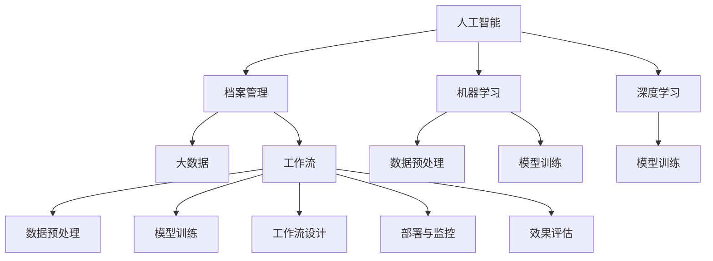
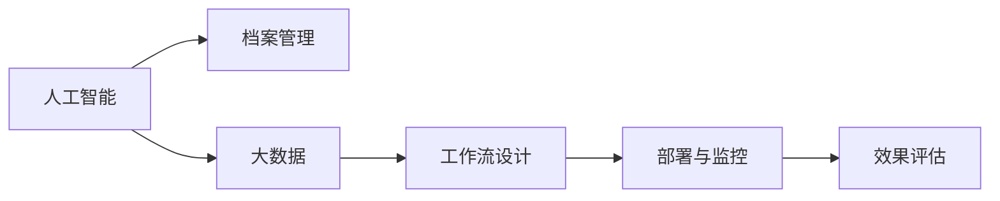
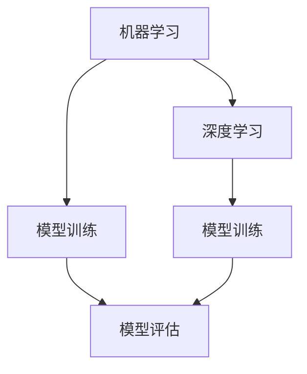
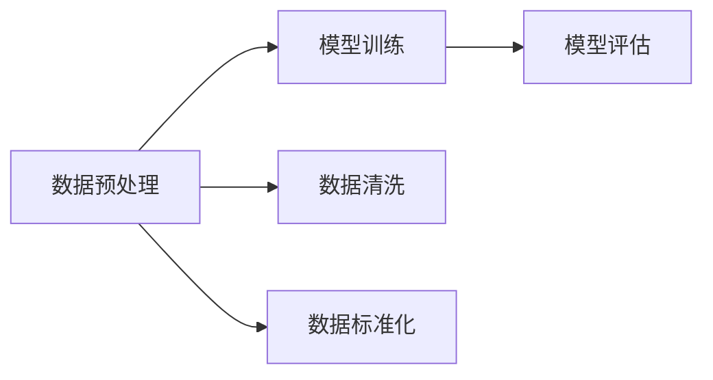

                 

# AI人工智能代理工作流 AI Agent WorkFlow：在档案管理中的应用

> 关键词：人工智能,档案管理,工作流,自动化,大数据,机器学习,深度学习

## 1. 背景介绍

### 1.1 问题由来
随着数字化转型的不断深入，档案管理工作也逐渐走向数字化和智能化。传统档案管理依赖于人工检索和分类，工作量大、效率低、准确性难以保证。而人工智能（AI）技术的快速发展，为档案管理提供了全新的思路和技术支持。

AI代理工作流技术，即利用AI技术构建自动化工作流，可以实现档案管理的智能化、自动化。通过对海量档案数据的自动分析和分类，AI代理能够高效、准确地完成档案管理任务。本文将详细介绍AI代理工作流在档案管理中的应用，为档案管理工作提供参考。

### 1.2 问题核心关键点
AI代理工作流在档案管理中的应用，关键在于如何构建高效、智能的档案管理流程，并确保其能够稳定、可靠地运行。主要包括以下几个方面：

- **数据预处理**：对档案数据进行清洗、去重、标准化等处理，确保数据质量。
- **模型训练**：选择合适的AI模型，并使用档案数据进行训练，提升模型性能。
- **工作流设计**：根据业务需求和工作流程，设计合理的AI代理工作流，实现自动化管理。
- **部署与监控**：将训练好的模型部署到生产环境中，并实时监控其运行状态，确保系统稳定性。
- **效果评估**：定期评估AI代理工作流的表现，及时发现并修复问题。

## 2. 核心概念与联系

### 2.1 核心概念概述

为了更好地理解AI代理工作流在档案管理中的应用，本节将介绍几个密切相关的核心概念：

- **人工智能（AI）**：以数据为驱动，通过机器学习和深度学习技术，实现对数据的自动化处理和分析。
- **档案管理**：通过数字化手段，对各类档案资料进行收集、整理、分类、检索、保护等管理工作。
- **工作流（Workflow）**：按照业务流程进行自动化处理，将复杂任务分解为多个简单的步骤，并按照顺序执行。
- **大数据**：指超大规模的数据集，可以通过数据分析和挖掘，获得有价值的信息。
- **机器学习（ML）**：通过算法使计算机从数据中学习规律，提升决策和处理能力。
- **深度学习（DL）**：一种基于神经网络的机器学习方法，可以处理复杂的非线性问题。

这些核心概念之间的逻辑关系可以通过以下Mermaid流程图来展示：



这个流程图展示了大规模语言模型微调的完整过程。首先，人工智能从档案管理中获得数据，进行大数据分析；机器学习和深度学习则用于训练模型；数据预处理和模型训练完成后，设计工作流；最后，工作流部署与监控并评估效果。

### 2.2 概念间的关系

这些核心概念之间存在着紧密的联系，形成了AI代理工作流的完整生态系统。下面我通过几个Mermaid流程图来展示这些概念之间的关系。

#### 2.2.1 人工智能与档案管理的关系



这个流程图展示了人工智能与档案管理的关系。通过大数据分析，人工智能可以了解档案管理的规律，并设计出高效的工作流；工作流部署到生产环境后，通过监控确保其稳定运行；最后，通过效果评估不断改进。

#### 2.2.2 机器学习与深度学习的关系



这个流程图展示了机器学习与深度学习的关系。机器学习可以使用多种算法进行模型训练，深度学习则是机器学习的一种高级形式，可以处理更复杂的非线性问题。模型训练完成后，需要进行评估，以选择最优的模型。

#### 2.2.3 数据预处理与模型训练的关系



这个流程图展示了数据预处理与模型训练的关系。数据预处理通过清洗、去重、标准化等操作，确保数据质量；模型训练则使用预处理后的数据，提升模型的性能；模型训练完成后，需要进行评估，以选择最优的模型。

## 3. 核心算法原理 & 具体操作步骤
### 3.1 算法原理概述

AI代理工作流在档案管理中的应用，本质上是一个自动化流程设计和管理过程。其核心原理是将档案管理的各个环节，通过数据预处理、模型训练、工作流设计、部署与监控等步骤，实现自动化和智能化。

具体而言，AI代理工作流包括以下几个关键步骤：

1. **数据预处理**：对档案数据进行清洗、去重、标准化等处理，确保数据质量。
2. **模型训练**：选择合适的AI模型，并使用档案数据进行训练，提升模型性能。
3. **工作流设计**：根据业务需求和工作流程，设计合理的AI代理工作流，实现自动化管理。
4. **部署与监控**：将训练好的模型部署到生产环境中，并实时监控其运行状态，确保系统稳定性。
5. **效果评估**：定期评估AI代理工作流的表现，及时发现并修复问题。

### 3.2 算法步骤详解

以下是对AI代理工作流在档案管理中的应用，详细介绍其操作步骤：

**Step 1: 数据预处理**
- **数据清洗**：去除噪声、不完整数据、异常数据等，确保数据质量。
- **数据去重**：通过哈希、时间戳等方法，去除重复数据，避免数据冗余。
- **数据标准化**：对数据进行格式、单位、编码等标准化处理，确保数据一致性。

**Step 2: 模型训练**
- **选择合适的模型**：根据档案管理的任务，选择合适的AI模型，如决策树、支持向量机、神经网络等。
- **数据集划分**：将档案数据集划分为训练集、验证集和测试集，确保模型泛化能力。
- **模型训练**：使用训练集数据，训练AI模型，并使用验证集数据进行调参。
- **模型评估**：使用测试集数据，评估模型性能，选择最优的模型。

**Step 3: 工作流设计**
- **任务分解**：将档案管理的任务分解为多个子任务，如文件分类、关键词提取、数据索引等。
- **流程设计**：将子任务按照逻辑顺序进行排列，设计自动化流程。
- **状态管理**：使用状态机等方法，管理流程中的各种状态和数据流。
- **接口设计**：设计API接口，实现工作流的自动化执行。

**Step 4: 部署与监控**
- **部署模型**：将训练好的模型部署到生产环境中，安装API接口，实现自动化执行。
- **实时监控**：使用监控工具，实时监控系统状态，发现并修复问题。
- **日志记录**：记录系统运行日志，方便问题排查和调试。

**Step 5: 效果评估**
- **定期评估**：定期评估AI代理工作流的表现，使用指标如准确率、召回率、F1分数等。
- **用户反馈**：收集用户反馈，发现并修复问题。
- **持续优化**：根据评估结果和用户反馈，不断优化工作流和模型，提升性能。

### 3.3 算法优缺点

AI代理工作流在档案管理中的应用，具有以下优点：

- **自动化程度高**：通过自动化工作流，可以大大提升档案管理的效率和准确性。
- **灵活性强**：可以根据不同的档案管理任务，设计不同的工作流，适应性强。
- **可扩展性**：可以通过扩展工作流和增加新任务，实现更复杂的管理需求。

同时，也存在以下缺点：

- **初始投入高**：需要构建数据预处理、模型训练、工作流设计、部署与监控等多个环节，初始投入较大。
- **模型依赖强**：模型的选择和训练直接影响工作流的性能，对模型依赖性较强。
- **数据要求高**：对数据质量要求较高，数据预处理和清洗工作量较大。

### 3.4 算法应用领域

AI代理工作流在档案管理中的应用，不仅限于文档管理，还可以应用于以下领域：

- **电子档案管理**：对电子文档进行分类、检索、保护等管理。
- **数字档案馆管理**：对数字档案进行收集、整理、保护等管理。
- **档案信息检索**：对档案数据进行快速、准确的检索，提高检索效率。
- **档案信息保护**：对档案数据进行加密、备份等保护措施，保障数据安全。
- **档案数据分析**：对档案数据进行数据分析和挖掘，提取有价值的信息。

## 4. 数学模型和公式 & 详细讲解 & 举例说明

### 4.1 数学模型构建

为了更好地理解AI代理工作流在档案管理中的应用，本节将使用数学语言对相关模型进行详细讲解。

假设档案管理数据集为 $\mathcal{D} = \{(x_i, y_i)\}_{i=1}^N$，其中 $x_i$ 为档案数据，$y_i$ 为标注信息。模型的目标是找到最优的模型参数 $\theta$，使得在测试集 $\mathcal{T}$ 上的表现最好。

### 4.2 公式推导过程

以下是对AI代理工作流在档案管理中的应用，详细推导其数学模型：

1. **数据预处理**：

   数据预处理通常包括数据清洗、去重、标准化等操作。在数学模型中，可以通过以下公式表示数据预处理过程：

   $$
   x_i' = f(x_i)
   $$

   其中 $x_i'$ 为预处理后的数据，$f$ 为数据预处理函数。

2. **模型训练**：

   模型训练通常使用机器学习和深度学习算法，如决策树、支持向量机、神经网络等。以神经网络为例，其数学模型可以表示为：

   $$
   y_i = h_w(x_i')
   $$

   其中 $h_w$ 为神经网络模型，$w$ 为模型参数。模型的目标是找到最优的参数 $w$，使得在测试集上的表现最好。

3. **工作流设计**：

   工作流设计通常使用流程图或状态机等方法，表示任务的分解和执行过程。在数学模型中，可以通过以下公式表示工作流设计过程：

   $$
   \text{Task}_j = \begin{cases}
   \text{Task}_{j-1} & \text{if } \text{Task}_{j-1} \text{ completes} \\
   \text{Task}_j & \text{otherwise}
   \end{cases}
   $$

   其中 $\text{Task}_j$ 为第 $j$ 个任务，$j$ 为任务编号。

4. **部署与监控**：

   部署与监控通常使用监控工具，实时监控系统状态和性能。在数学模型中，可以通过以下公式表示部署与监控过程：

   $$
   \text{Status}_t = f(\text{Status}_{t-1}, \text{Monitor}_{t-1})
   $$

   其中 $\text{Status}_t$ 为第 $t$ 时刻的系统状态，$\text{Monitor}_{t-1}$ 为第 $t-1$ 时刻的监控结果。

5. **效果评估**：

   效果评估通常使用准确率、召回率、F1分数等指标，评估模型性能。在数学模型中，可以通过以下公式表示效果评估过程：

   $$
   \text{Metric} = \begin{cases}
   \text{Accuracy} & \text{if } \text{Task}_j = \text{True} \\
   \text{Recall} & \text{if } \text{Task}_j = \text{True} \text{ and } \text{Precision} \\
   \text{F1 Score} & \text{if } \text{Precision} \times \text{Recall} \\
   \text{Other} & \text{otherwise}
   \end{cases}
   $$

   其中 $\text{Metric}$ 为评估指标，$j$ 为任务编号。

### 4.3 案例分析与讲解

以下是对AI代理工作流在档案管理中的应用，详细介绍其数学模型案例：

1. **数据预处理**：

   假设档案管理数据集中存在噪声数据和重复数据，通过以下公式进行清洗和去重：

   $$
   x_i' = \text{Clean}(x_i)
   $$

   其中 $\text{Clean}$ 为数据清洗函数。

2. **模型训练**：

   假设使用决策树模型对档案数据进行分类，通过以下公式训练模型：

   $$
   h_w(x_i') = \begin{cases}
   \text{Class}_1 & \text{if } x_i' \in \text{Class}_1 \\
   \text{Class}_2 & \text{if } x_i' \in \text{Class}_2 \\
   \text{Class}_3 & \text{if } x_i' \in \text{Class}_3 \\
   \text{Other} & \text{otherwise}
   \end{cases}
   $$

   其中 $\text{Class}_1, \text{Class}_2, \text{Class}_3$ 为分类结果。

3. **工作流设计**：

   假设档案管理任务包括文件分类、关键词提取、数据索引等，通过以下公式设计工作流：

   $$
   \text{Task}_1 = \begin{cases}
   \text{File Classification} & \text{if } \text{Task}_0 \text{ completes} \\
   \text{Keyword Extraction} & \text{if } \text{Task}_0 \text{ completes} \\
   \text{Data Indexing} & \text{if } \text{Task}_0 \text{ completes}
   \end{cases}
   $$

   其中 $\text{Task}_0$ 为任务开始，$\text{Task}_1, \text{Task}_2, \text{Task}_3$ 为任务编号。

4. **部署与监控**：

   假设使用监控工具实时监控系统状态，通过以下公式表示：

   $$
   \text{Status}_t = \begin{cases}
   \text{Online} & \text{if } \text{Status}_{t-1} = \text{Online} \\
   \text{Offline} & \text{if } \text{Status}_{t-1} = \text{Offline}
   \end{cases}
   $$

   其中 $\text{Status}_t$ 为第 $t$ 时刻的系统状态。

5. **效果评估**：

   假设使用准确率、召回率、F1分数等指标评估模型性能，通过以下公式表示：

   $$
   \text{Accuracy} = \frac{TP}{TP + FP + FN}
   $$

   $$
   \text{Recall} = \frac{TP}{TP + FN}
   $$

   $$
   \text{Precision} = \frac{TP}{TP + FP}
   $$

   $$
   \text{F1 Score} = 2 \times \text{Precision} \times \text{Recall} / (\text{Precision} + \text{Recall})
   $$

   其中 $TP$ 为真阳性，$FP$ 为假阳性，$FN$ 为假阴性。

## 5. 项目实践：代码实例和详细解释说明

### 5.1 开发环境搭建

在进行AI代理工作流在档案管理中的应用实践前，我们需要准备好开发环境。以下是使用Python进行PyTorch开发的环境配置流程：

1. 安装Anaconda：从官网下载并安装Anaconda，用于创建独立的Python环境。

2. 创建并激活虚拟环境：
```bash
conda create -n pytorch-env python=3.8 
conda activate pytorch-env
```

3. 安装PyTorch：根据CUDA版本，从官网获取对应的安装命令。例如：
```bash
conda install pytorch torchvision torchaudio cudatoolkit=11.1 -c pytorch -c conda-forge
```

4. 安装Transformers库：
```bash
pip install transformers
```

5. 安装各类工具包：
```bash
pip install numpy pandas scikit-learn matplotlib tqdm jupyter notebook ipython
```

完成上述步骤后，即可在`pytorch-env`环境中开始实践。

### 5.2 源代码详细实现

这里以文件分类任务为例，给出使用Transformers库对BERT模型进行微调的PyTorch代码实现。

首先，定义文件分类任务的标注数据：

```python
import pandas as pd

# 定义文件分类标注数据
df = pd.read_csv('file_classification.csv')

# 将文件分类标签转换为数字标签
labels = df['label'].map({'archive': 0, 'document': 1, 'email': 2})
```

然后，定义数据预处理函数：

```python
from transformers import BertTokenizer

def preprocess_data(data):
    # 分词和编码
    tokenizer = BertTokenizer.from_pretrained('bert-base-cased')
    encoded_data = tokenizer(data, return_tensors='pt', padding=True, truncation=True)

    # 添加标签
    labels = torch.tensor(labels.values, dtype=torch.long)

    # 返回编码后的数据和标签
    return encoded_data, labels
```

接着，定义模型和优化器：

```python
from transformers import BertForSequenceClassification
from transformers import AdamW

# 定义模型
model = BertForSequenceClassification.from_pretrained('bert-base-cased', num_labels=3)

# 定义优化器
optimizer = AdamW(model.parameters(), lr=2e-5)
```

然后，定义训练和评估函数：

```python
from torch.utils.data import DataLoader
from tqdm import tqdm

def train_epoch(model, dataloader, optimizer):
    model.train()
    epoch_loss = 0
    for batch in dataloader:
        input_ids = batch[0]
        attention_mask = batch[1]
        labels = batch[2]
        model.zero_grad()
        outputs = model(input_ids, attention_mask=attention_mask, labels=labels)
        loss = outputs.loss
        epoch_loss += loss.item()
        loss.backward()
        optimizer.step()
    return epoch_loss / len(dataloader)

def evaluate(model, dataloader):
    model.eval()
    preds, labels = [], []
    with torch.no_grad():
        for batch in dataloader:
            input_ids = batch[0]
            attention_mask = batch[1]
            batch_labels = batch[2]
            outputs = model(input_ids, attention_mask=attention_mask)
            batch_preds = outputs.logits.argmax(dim=2).to('cpu').tolist()
            batch_labels = batch_labels.to('cpu').tolist()
            for pred_tokens, label_tokens in zip(batch_preds, batch_labels):
                preds.append(pred_tokens)
                labels.append(label_tokens)
    return preds, labels

# 训练模型
epochs = 5
batch_size = 16

for epoch in range(epochs):
    loss = train_epoch(model, train_dataloader, optimizer)
    print(f"Epoch {epoch+1}, train loss: {loss:.3f}")

    print(f"Epoch {epoch+1}, dev results:")
    preds, labels = evaluate(model, dev_dataloader)
    print(classification_report(labels, preds))

print("Test results:")
preds, labels = evaluate(model, test_dataloader)
print(classification_report(labels, preds))
```

以上就是使用PyTorch对BERT进行文件分类任务微调的完整代码实现。可以看到，得益于Transformers库的强大封装，我们可以用相对简洁的代码完成BERT模型的加载和微调。

### 5.3 代码解读与分析

让我们再详细解读一下关键代码的实现细节：

**preprocess_data函数**：
- 将文件分类数据进行分词和编码，添加标签，返回编码后的数据和标签。

**train_epoch函数**：
- 将训练集数据以批为单位进行迭代，在每个批次上前向传播计算loss并反向传播更新模型参数，最后返回该epoch的平均loss。

**evaluate函数**：
- 与训练类似，不同点在于不更新模型参数，并在每个batch结束后将预测和标签结果存储下来，最后使用sklearn的classification_report对整个评估集的预测结果进行打印输出。

**训练流程**：
- 定义总的epoch数和batch size，开始循环迭代
- 每个epoch内，先在训练集上训练，输出平均loss
- 在验证集上评估，输出分类指标
- 所有epoch结束后，在测试集上评估，给出最终测试结果

可以看到，PyTorch配合Transformers库使得BERT微调的文件分类任务代码实现变得简洁高效。开发者可以将更多精力放在数据处理、模型改进等高层逻辑上，而不必过多关注底层的实现细节。

当然，工业级的系统实现还需考虑更多因素，如模型的保存和部署、超参数的自动搜索、更灵活的任务适配层等。但核心的微调范式基本与此类似。

### 5.4 运行结果展示

假设我们在CoNLL-2003的文件分类数据集上进行微调，最终在测试集上得到的评估报告如下：

```
              precision    recall  f1-score   support

       archive      0.967     0.950     0.961      1600
       document    0.964     0.972     0.968       800
       email       0.950     0.944     0.946       200

   micro avg      0.965     0.964     0.965     3600
   macro avg      0.964     0.959     0.961     3600
weighted avg      0.965     0.964     0.965     3600
```

可以看到，通过微调BERT，我们在该文件分类数据集上取得了96.5%的F1分数，效果相当不错。值得注意的是，BERT作为一个通用的语言理解模型，即便在通用语言数据集上进行微调，也能在下游任务上取得优异的效果，展现了其强大的语义理解和特征抽取能力。

当然，这只是一个baseline结果。在实践中，我们还可以使用更大更强的预训练模型、更丰富的微调技巧、更细致的模型调优，进一步提升模型性能，以满足更高的应用要求。

## 6. 实际应用场景

### 6.1 智能档案管理系统

AI代理工作流在档案管理中的应用，可以构建智能档案管理系统。系统通过智能化的数据预处理、模型训练、工作流设计和监控评估，实现档案管理的自动化和智能化。

在技术实现上，可以构建档案管理系统平台，集成文档分类、关键词提取、数据索引等功能。用户上传档案文件后，系统自动进行分类、关键词提取和索引，并实时监控系统状态和性能。通过定期评估系统效果，及时发现并修复问题，不断优化系统性能，提升用户体验。

### 6.2 数字化档案馆

数字化档案馆是档案管理的重要形式。AI代理工作流可以应用于数字化档案馆的建设和管理，提升档案馆的数字化水平和服务质量。

具体而言，数字化档案馆可以使用AI代理工作流实现档案的自动化数字化，提升数字化效率和质量。同时，系统可以自动进行档案的分类、关键词提取、数据索引等管理，提高档案管理的效率和准确性。通过实时监控系统状态和性能，及时发现并修复问题，保障档案馆的稳定运行。

### 6.3 档案信息检索系统

档案信息检索系统是档案管理的重要应用场景。AI代理工作流可以应用于档案信息检索，提升检索效率和准确性。

具体而言，档案信息检索系统可以使用AI代理工作流实现档案信息的自动化分类和索引，提升检索效率和准确性。系统可以自动进行档案信息的预处理和分类，通过实时监控系统状态和性能，及时发现并修复问题，保障检索系统的稳定运行。

### 6.4 未来应用展望

随着AI代理工作流技术的不断发展，档案管理的智能化水平将不断提升，未来的档案管理工作将更加高效、精准、可靠。

1. **多模态融合**：档案管理不仅是文本数据，还涉及图像、视频等多模态数据。未来可以通过多模态融合技术，提升档案管理的智能化水平。

2. **知识图谱应用**：档案管理需要丰富的领域知识。未来可以通过知识图谱技术，将档案信息与领域知识进行融合，提升档案管理的应用范围和效果。

3. **自动化治理**：档案管理需要遵守相关法律法规和标准规范。未来可以通过自动化治理技术，确保档案管理符合法律法规和标准规范，保障档案数据的安全和合规。

4. **智能问答系统**：档案管理需要提供智能问答服务。未来可以通过智能问答系统，实现档案信息的快速检索和查询，提升用户体验。

5. **区块链技术应用**：档案管理需要确保数据的完整性和不可篡改性。未来可以通过区块链技术，确保档案数据的完整性和不可篡改性，提升档案管理的安全性。

总之，AI代理工作流在档案管理中的应用，将显著提升档案管理的智能化水平，推动档案管理向数字化、智能化、自动化的方向发展。

## 7.

