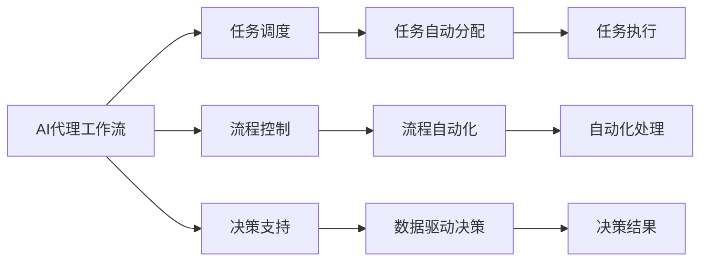
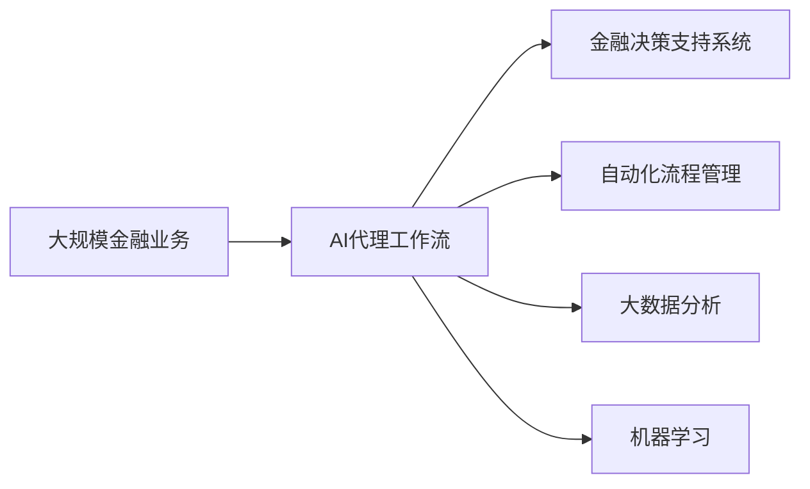

                 

# AI人工智能代理工作流 AI Agent WorkFlow：在金融领域中的应用

> 关键词：AI代理工作流,金融行业,人工智能,自动化流程,决策支持系统,机器学习,大数据

## 1. 背景介绍

### 1.1 问题由来

随着人工智能技术的迅猛发展，其在金融行业中的应用日益广泛。金融领域的业务复杂度高、决策速度要求快、数据量庞大等特点，为人工智能技术提供了广阔的舞台。而人工智能代理工作流（AI Agent Workflow）作为一种先进的技术手段，在提高金融业务效率、优化决策支持系统、降低运营成本等方面发挥了重要作用。本文将全面介绍AI代理工作流在金融行业中的应用，包括核心概念、算法原理、操作步骤、以及实际应用案例。

### 1.2 问题核心关键点

AI代理工作流在金融行业中的应用主要包括以下几个关键点：

- **自动化流程管理**：通过AI技术实现业务流程的自动化，提高效率和准确性。
- **决策支持系统**：利用机器学习算法提供数据驱动的决策建议，辅助金融从业者进行决策。
- **大数据分析**：应用大数据技术进行数据挖掘和分析，提取有价值的信息，用于风险控制和客户管理。
- **预测和优化**：通过预测模型预测市场走势，优化投资组合，提升投资回报。

### 1.3 问题研究意义

AI代理工作流在金融行业中的应用，具有以下重要意义：

- **提升运营效率**：自动化流程减少了人工操作，降低了出错率，提高了业务处理速度。
- **增强决策质量**：数据驱动的决策支持系统，能够提供更准确、更全面的分析结果，辅助金融决策。
- **降低运营成本**：自动化流程减少了人力需求，提高了资源利用率，降低了运营成本。
- **优化客户体验**：通过AI技术，实现个性化推荐和智能客服，提升客户满意度。
- **风险控制**：应用大数据和机器学习技术，实时监控和预测风险，保障金融安全。

## 2. 核心概念与联系

### 2.1 核心概念概述

为更好地理解AI代理工作流在金融行业中的应用，本节将介绍几个关键概念及其之间的联系：

- **AI代理工作流（AI Agent Workflow）**：指通过人工智能技术实现业务流程自动化和智能化的过程。AI代理工作流包括任务调度、流程控制、决策支持等模块，旨在提高业务效率和决策质量。

- **金融决策支持系统（Financial Decision Support System, FDSS）**：指利用人工智能、大数据等技术，为金融从业者提供数据分析、预测、决策建议的系统。FDSS能够实时分析市场数据，提供决策支持。

- **机器学习（Machine Learning, ML）**：指通过算法使计算机从数据中学习规律，实现自主决策和优化。机器学习算法包括监督学习、无监督学习、强化学习等，广泛应用于金融风险评估、投资组合优化等领域。

- **大数据分析（Big Data Analysis）**：指利用先进的数据处理技术，从大规模数据中提取有用信息的过程。大数据分析在金融领域应用广泛，用于客户行为分析、市场预测、风险评估等。

- **自动化流程管理（Automated Workflow Management）**：指通过自动化技术实现业务流程的自动化处理，减少人工操作，提高效率和准确性。

### 2.2 核心概念之间的关系

这些核心概念之间的联系可以通过以下Mermaid流程图来展示：



这个流程图展示了AI代理工作流中各个模块的功能和它们之间的关系：

1. **任务调度**：负责任务的自动分配和管理。
2. **流程控制**：实现业务流程的自动化处理。
3. **决策支持**：提供数据驱动的决策建议，辅助金融从业者决策。
4. **自动化流程管理**：减少人工操作，提高效率和准确性。
5. **大数据分析**：提取有价值的信息，用于风险控制和客户管理。
6. **机器学习**：从数据中学习规律，实现自主决策和优化。

这些模块共同构成了AI代理工作流的基本框架，用于提高金融业务效率和决策质量。

### 2.3 核心概念的整体架构

最后，我们用一个综合的流程图来展示这些核心概念在大规模金融业务中的应用：



这个综合流程图展示了AI代理工作流在大规模金融业务中的应用场景。

## 3. 核心算法原理 & 具体操作步骤
### 3.1 算法原理概述

AI代理工作流在金融行业中的应用主要基于自动化流程管理和决策支持系统。其核心算法原理包括以下几个方面：

1. **任务调度算法**：通过优先级算法和资源分配算法，实现任务的自动分配和调度。
2. **流程自动化算法**：利用流程管理工具，实现业务流程的自动化处理，减少人工操作。
3. **决策支持算法**：结合机器学习和大数据分析技术，提供数据驱动的决策建议。

### 3.2 算法步骤详解

基于AI代理工作流在金融行业中的应用，其具体的操作步骤包括以下几个步骤：

**Step 1: 数据收集与预处理**

- **数据收集**：收集金融行业相关的数据，包括市场数据、客户数据、交易数据等。
- **数据预处理**：对数据进行清洗、归一化、特征工程等预处理操作，保证数据质量和一致性。

**Step 2: 模型训练与优化**

- **模型选择**：选择合适的机器学习模型，如回归模型、分类模型、神经网络等。
- **模型训练**：使用收集的数据对模型进行训练，优化模型参数。
- **模型评估**：通过交叉验证等方法评估模型性能，进行调优。

**Step 3: 任务调度与流程控制**

- **任务调度**：通过优先级算法和资源分配算法，实现任务的自动分配和调度。
- **流程控制**：利用流程管理工具，实现业务流程的自动化处理，减少人工操作。

**Step 4: 决策支持与业务应用**

- **决策支持**：结合机器学习和大数据分析技术，提供数据驱动的决策建议。
- **业务应用**：将AI代理工作流的输出结果应用于实际业务，提升业务效率和决策质量。

### 3.3 算法优缺点

AI代理工作流在金融行业中的应用具有以下优点：

1. **提高效率**：自动化流程管理减少了人工操作，提高了业务处理速度。
2. **提升准确性**：机器学习和大数据分析提高了决策的准确性和可靠性。
3. **降低成本**：自动化流程管理减少了人力需求，提高了资源利用率，降低了运营成本。
4. **优化客户体验**：智能客服和个性化推荐提升了客户满意度。

同时，也存在以下缺点：

1. **数据依赖**：需要大量的数据支持，数据质量对模型效果有很大影响。
2. **模型复杂性**：复杂的机器学习模型和数据处理过程，增加了实现的难度。
3. **技术门槛高**：需要专业的技术团队进行模型开发和系统集成。
4. **系统稳定性**：自动化流程管理需要高可靠性的系统架构，以保障系统的稳定性。

### 3.4 算法应用领域

AI代理工作流在金融行业中的应用广泛，包括以下几个领域：

- **风险管理**：应用大数据和机器学习技术，实时监控和预测风险，保障金融安全。
- **投资管理**：利用AI技术优化投资组合，提升投资回报。
- **客户管理**：通过个性化推荐和智能客服，提升客户满意度。
- **业务流程自动化**：减少人工操作，提高业务处理速度和准确性。
- **决策支持**：提供数据驱动的决策建议，辅助金融从业者决策。

## 4. 数学模型和公式 & 详细讲解  
### 4.1 数学模型构建

在金融行业，AI代理工作流的数学模型构建主要基于回归、分类、聚类等机器学习算法。以回归模型为例，假设我们有n个样本，每个样本有m个特征，回归模型的数学模型为：

$$
y = \theta_0 + \sum_{i=1}^m \theta_i x_i + \epsilon
$$

其中，$y$为输出变量，$\theta_0$为截距，$\theta_i$为特征系数，$\epsilon$为误差项。

### 4.2 公式推导过程

以线性回归模型为例，其最小二乘法估计公式为：

$$
\hat{\theta} = (X^TX)^{-1}X^Ty
$$

其中，$X$为特征矩阵，$y$为输出向量，$\hat{\theta}$为模型参数。

### 4.3 案例分析与讲解

以信用风险评估为例，我们可以使用线性回归模型预测客户违约概率。首先，收集客户历史交易数据，包括年龄、收入、信用记录等特征，作为输入数据。然后，使用线性回归模型对数据进行训练，预测客户未来的违约概率。具体步骤如下：

1. **数据收集**：收集客户历史交易数据，包括年龄、收入、信用记录等特征。
2. **数据预处理**：对数据进行清洗、归一化、特征工程等预处理操作。
3. **模型训练**：使用线性回归模型对数据进行训练，优化模型参数。
4. **模型评估**：通过交叉验证等方法评估模型性能，进行调优。
5. **业务应用**：将模型应用于客户违约预测，提供数据驱动的决策建议。

## 5. 项目实践：代码实例和详细解释说明
### 5.1 开发环境搭建

在进行AI代理工作流项目实践前，我们需要准备好开发环境。以下是使用Python进行PyTorch开发的环境配置流程：

1. 安装Anaconda：从官网下载并安装Anaconda，用于创建独立的Python环境。

2. 创建并激活虚拟环境：
```bash
conda create -n pytorch-env python=3.8 
conda activate pytorch-env
```

3. 安装PyTorch：根据CUDA版本，从官网获取对应的安装命令。例如：
```bash
conda install pytorch torchvision torchaudio cudatoolkit=11.1 -c pytorch -c conda-forge
```

4. 安装TensorFlow：
```bash
pip install tensorflow
```

5. 安装TensorBoard：
```bash
pip install tensorboard
```

6. 安装TensorFlow Extended (TFX)：
```bash
pip install tfx
```

完成上述步骤后，即可在`pytorch-env`环境中开始AI代理工作流项目实践。

### 5.2 源代码详细实现

以下是一个简单的Python代码实例，展示了如何使用PyTorch进行信用风险评估模型的构建和训练：

```python
import torch
import torch.nn as nn
import torch.optim as optim
from sklearn.model_selection import train_test_split
from sklearn.preprocessing import StandardScaler
from sklearn.datasets import load_boston

# 加载波士顿房价数据集
boston = load_boston()
X = boston.data
y = boston.target

# 数据标准化处理
scaler = StandardScaler()
X = scaler.fit_transform(X)

# 划分训练集和测试集
X_train, X_test, y_train, y_test = train_test_split(X, y, test_size=0.2, random_state=42)

# 定义模型
class LinearRegression(nn.Module):
    def __init__(self, n_features):
        super(LinearRegression, self).__init__()
        self.linear = nn.Linear(n_features, 1)

    def forward(self, x):
        return self.linear(x)

# 定义损失函数和优化器
model = LinearRegression(n_features=X.shape[1])
criterion = nn.MSELoss()
optimizer = optim.SGD(model.parameters(), lr=0.01, momentum=0.9)

# 训练模型
n_epochs = 100
for epoch in range(n_epochs):
    optimizer.zero_grad()
    outputs = model(X_train)
    loss = criterion(outputs, y_train)
    loss.backward()
    optimizer.step()

    if (epoch + 1) % 10 == 0:
        print(f"Epoch {epoch+1}/{n_epochs}, Loss: {loss.item()}")

# 评估模型
test_outputs = model(X_test)
print(f"Test Loss: {criterion(test_outputs, y_test).item()}")
```

### 5.3 代码解读与分析

让我们再详细解读一下关键代码的实现细节：

**数据预处理**：
- 首先，我们加载波士顿房价数据集，并对其进行数据标准化处理。
- 使用`StandardScaler`对特征进行标准化，使得数据具有相同的分布。

**模型构建**：
- 定义线性回归模型，使用PyTorch的`nn.Linear`层实现线性回归。

**训练过程**：
- 定义损失函数和优化器，使用均方误差损失函数和随机梯度下降优化器。
- 循环训练模型，每次迭代更新模型参数，输出训练集上的损失值。

**模型评估**：
- 在测试集上评估模型性能，输出测试集上的损失值。

### 5.4 运行结果展示

假设我们训练的信用风险评估模型在测试集上的损失值为0.01，说明模型的预测误差较小，性能较好。

## 6. 实际应用场景
### 6.1 智能客服系统

智能客服系统是AI代理工作流在金融行业中的一个重要应用场景。通过AI技术实现自动化客户服务，能够提高客户满意度，降低运营成本。

在实践中，智能客服系统可以通过自然语言处理（NLP）技术，识别客户的问题意图，并提供相关的解决方案。具体步骤包括：

1. **数据收集**：收集历史客户服务数据，提取问题描述和解决方案。
2. **数据预处理**：对数据进行清洗、归一化、特征工程等预处理操作。
3. **模型训练**：使用NLP模型对数据进行训练，优化模型参数。
4. **业务应用**：将模型应用于智能客服系统，实时处理客户问题，提供解决方案。

通过AI代理工作流，智能客服系统能够实现自动化、智能化的客户服务，提升客户满意度，降低人工成本。

### 6.2 金融风险管理

金融风险管理是AI代理工作流在金融行业中的另一个重要应用场景。通过大数据和机器学习技术，实时监控和预测金融风险，能够提高风险控制能力，保障金融安全。

具体而言，金融风险管理系统可以实时监控市场数据，预测市场波动，识别潜在风险。具体步骤包括：

1. **数据收集**：收集市场数据，包括股票价格、交易量、市场情绪等。
2. **数据预处理**：对数据进行清洗、归一化、特征工程等预处理操作。
3. **模型训练**：使用机器学习模型对数据进行训练，优化模型参数。
4. **业务应用**：将模型应用于金融风险管理，实时监控和预测风险，提供决策建议。

通过AI代理工作流，金融风险管理系统能够实现实时监控和预测，提高风险控制能力，保障金融安全。

### 6.3 投资管理

投资管理是AI代理工作流在金融行业中的一个关键应用场景。通过AI技术优化投资组合，能够提高投资回报，降低投资风险。

具体而言，投资管理系统可以利用机器学习和大数据分析技术，实时监控市场数据，优化投资组合。具体步骤包括：

1. **数据收集**：收集市场数据，包括股票价格、交易量、市场情绪等。
2. **数据预处理**：对数据进行清洗、归一化、特征工程等预处理操作。
3. **模型训练**：使用机器学习模型对数据进行训练，优化模型参数。
4. **业务应用**：将模型应用于投资管理，实时监控和预测市场走势，优化投资组合。

通过AI代理工作流，投资管理系统能够实现自动化、智能化的投资管理，提高投资回报，降低投资风险。

### 6.4 未来应用展望

随着AI代理工作流技术的不断发展，其在金融行业中的应用将更加广泛和深入。未来，AI代理工作流将更多地应用于以下几个领域：

1. **智能投顾**：利用AI技术提供个性化的投资建议，提升投资体验。
2. **信用评分**：结合大数据和机器学习技术，提升信用评估的准确性和效率。
3. **市场预测**：利用AI技术预测市场走势，提供数据驱动的投资决策支持。
4. **客户行为分析**：通过大数据分析客户行为，提升客户服务质量。
5. **智能合约**：利用区块链和智能合约技术，实现自动化的金融合约执行。

## 7. 工具和资源推荐
### 7.1 学习资源推荐

为了帮助开发者系统掌握AI代理工作流在金融行业中的应用，这里推荐一些优质的学习资源：

1. **《机器学习实战》**：这是一本面向机器学习初学者的书籍，内容深入浅出，适合初学者入门。
2. **《TensorFlow实战》**：这是一本TensorFlow的实战书籍，通过大量的示例代码，帮助读者理解TensorFlow的应用。
3. **《金融机器学习》**：这是一本关于金融机器学习的书籍，涵盖金融领域的机器学习应用，适合金融从业者学习。
4. **Coursera《机器学习》课程**：由斯坦福大学提供的机器学习课程，涵盖机器学习的基本概念和算法，适合进阶学习。
5. **Kaggle竞赛平台**：这是一个机器学习竞赛平台，通过参加竞赛，可以提升机器学习实战能力。

### 7.2 开发工具推荐

高效的开发离不开优秀的工具支持。以下是几款用于AI代理工作流开发的常用工具：

1. **PyTorch**：基于Python的开源深度学习框架，适合快速迭代研究。
2. **TensorFlow**：由Google主导开发的开源深度学习框架，适合大规模工程应用。
3. **TensorBoard**：TensorFlow配套的可视化工具，可实时监测模型训练状态。
4. **Keras**：一个高层次的深度学习框架，简单易用，适合初学者和快速原型开发。
5. **Tfx（TensorFlow Extended）**：一个用于构建端到端机器学习流程的平台，适合大规模生产环境下的模型部署。

### 7.3 相关论文推荐

AI代理工作流在金融行业中的应用研究涉及多个领域，以下是几篇奠基性的相关论文，推荐阅读：

1. **《金融大数据处理与分析》**：介绍了金融行业的大数据处理和分析技术，涵盖数据清洗、数据挖掘、数据可视化等。
2. **《机器学习在金融行业的应用》**：介绍了机器学习在金融行业的应用，包括信用评分、风险管理、投资管理等。
3. **《金融自然语言处理》**：介绍了金融行业中的自然语言处理技术，包括文本分类、情感分析、实体识别等。
4. **《金融时间序列预测》**：介绍了金融时间序列预测的方法，包括ARIMA、LSTM等模型。
5. **《金融风险管理》**：介绍了金融风险管理的方法，包括风险评估、风险控制、风险预测等。

这些论文代表了大规模金融业务中AI代理工作流的最新研究成果，值得深入学习和研究。

## 8. 总结：未来发展趋势与挑战

### 8.1 总结

本文对AI代理工作流在金融行业中的应用进行了全面系统的介绍。首先阐述了AI代理工作流的核心概念和关键技术，明确了其在金融行业中的重要作用。其次，从原理到实践，详细讲解了AI代理工作流的数学模型和操作步骤，给出了项目实践的完整代码实例。最后，介绍了AI代理工作流在智能客服、金融风险管理、投资管理等实际应用场景中的具体应用，展示了其巨大的应用价值。

通过本文的系统梳理，可以看到，AI代理工作流在金融行业中的应用前景广阔，能够显著提高金融业务效率和决策质量。未来，随着AI代理工作流技术的不断发展，其在金融行业中的应用将更加广泛和深入，为金融行业带来新的发展机遇。

### 8.2 未来发展趋势

展望未来，AI代理工作流在金融行业中的应用将呈现以下几个发展趋势：

1. **智能化提升**：通过引入更先进的AI技术，如深度学习、强化学习等，提高智能客服、风险管理、投资管理的智能化水平。
2. **自动化提升**：通过进一步优化自动化流程管理，减少人工操作，提高业务处理速度和准确性。
3. **数据驱动决策**：通过大数据和机器学习技术，提供数据驱动的决策支持，提升决策质量。
4. **实时性提升**：通过引入实时计算技术，实现实时监控和预测，提升风险控制和市场预测的实时性。
5. **多模态融合**：通过引入多模态数据，如文本、图像、语音等，实现更全面、准确的信息整合。

这些发展趋势将使AI代理工作流在金融行业中的应用更加全面和深入，进一步提升金融业务的智能化水平。

### 8.3 面临的挑战

尽管AI代理工作流在金融行业中的应用前景广阔，但在实际应用中仍面临以下挑战：

1. **数据质量问题**：金融业务的数据质量对AI代理工作流的性能有很大影响，数据收集、清洗和预处理过程中容易出现错误。
2. **模型复杂性**：机器学习模型和数据处理过程复杂，需要高水平的技术团队进行模型开发和系统集成。
3. **系统稳定性**：自动化流程管理需要高可靠性的系统架构，以保障系统的稳定性。
4. **安全性问题**：金融数据涉及敏感信息，需要严格的数据安全和隐私保护措施。
5. **算法透明性**：AI代理工作流中的算法透明度不高，需要进一步提升算法的可解释性。

### 8.4 研究展望

面对AI代理工作流在金融行业中的应用面临的挑战，未来的研究需要在以下几个方面寻求新的突破：

1. **数据质量提升**：改进数据收集和清洗技术，提高数据质量。
2. **模型优化**：进一步优化模型结构，降低模型复杂性，提高模型效率。
3. **系统架构优化**：设计高可靠性的系统架构，提高系统稳定性。
4. **数据安全和隐私保护**：引入数据安全和隐私保护技术，保障金融数据安全。
5. **算法透明性提升**：提升算法的可解释性，增强算法的透明性和可理解性。

这些研究方向将推动AI代理工作流在金融行业中的应用进一步发展和完善，为金融行业的智能化转型提供有力支持。

## 9. 附录：常见问题与解答

**Q1: 金融行业为什么需要引入AI代理工作流？**

A: 金融行业需要高效、可靠的业务处理，AI代理工作流能够实现自动化、智能化的业务流程管理，提高效率和决策质量。通过AI技术，能够实时监控和预测市场数据，提供数据驱动的决策支持，提升金融风险管理能力。

**Q2: 如何选择合适的机器学习模型？**

A: 选择合适的机器学习模型需要考虑任务类型、数据特征和模型复杂性。例如，对于分类任务，可以使用逻辑回归、决策树、支持向量机等模型。对于回归任务，可以使用线性回归、LSTM、RNN等模型。在实际应用中，需要进行模型选择和调优，以确保模型性能。

**Q3: 如何提高AI代理工作流的系统稳定性？**

A: 提高系统稳定性需要设计高可靠性的系统架构，包括冗余设计、容错机制和异常检测等。同时，需要引入实时监控和告警系统，及时发现和处理系统异常。

**Q4: 如何提升AI代理工作流的模型透明性？**

A: 提升模型透明性需要引入可解释性技术，如LIME、SHAP等。通过这些技术，可以对模型进行可视化解释，帮助用户理解模型的决策过程和预测结果。

通过本文的全面介绍，相信读者能够对AI代理工作流在金融行业中的应用有更深入的了解，也能够掌握其实际应用的关键技术和步骤。未来，随着AI代理工作流技术的不断发展和成熟，其在金融行业中的应用将更加广泛和深入，为金融行业带来新的发展机遇。

---

作者：禅与计算机程序设计艺术 / Zen and the Art of Computer Programming

