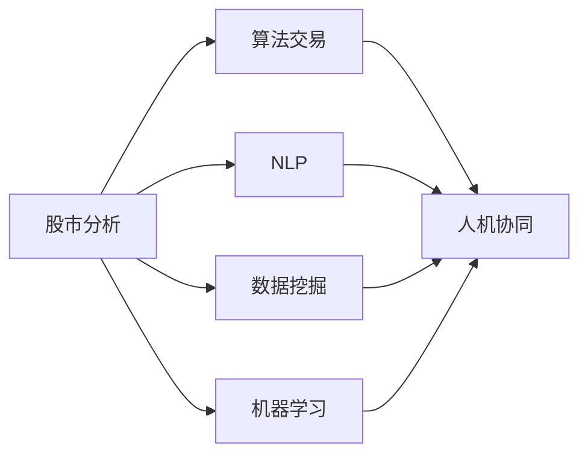

                 

# AI人工智能代理工作流AI Agent WorkFlow：AI代理在股市分析的应用

> 关键词：人工智能,股市分析,算法交易,自然语言处理(NLP),数据挖掘

## 1. 背景介绍

### 1.1 问题由来

金融市场的复杂性和动态性使得股市分析成为一门既具挑战又极具吸引力的学科。传统分析方法依赖于人类专家的直觉和经验，但在信息爆炸和数据密集的背景下，这些方法逐渐显示出其局限性。尤其是面对海量实时数据时，需要高效、自动化的处理机制。

人工智能技术的兴起，为股市分析提供了新的解决思路。利用智能算法和数据处理技术，可以在短时间内处理和分析大量数据，提出更精确的预测和决策建议。AI代理(AI Agent)作为一种新型的自动化分析工具，正在逐渐改变股市分析的面貌。

### 1.2 问题核心关键点

AI代理在股市分析中的应用，本质上是将人工智能技术与金融学原理结合，构建智能化的股市分析系统。其核心在于：

- **自动化数据处理**：通过自动化处理海量金融数据，识别出重要信息，减少人工分析的负担。
- **实时预测分析**：利用机器学习算法，对市场变化进行实时预测和分析，为交易决策提供参考。
- **策略优化**：结合金融学理论，优化交易策略，提升收益稳定性和风险控制能力。
- **人机协同**：将人工智能分析结果与人类专家经验结合，形成更科学的决策支持系统。

AI代理的关键技术包括自然语言处理(NLP)、数据挖掘、机器学习等。其中，NLP技术能够从文本数据中提取关键信息，数据挖掘技术可以发现数据中的规律和趋势，机器学习算法则可以构建预测模型，提供实时建议。

### 1.3 问题研究意义

AI代理在股市分析中的应用，对于提升市场效率、优化投资决策、降低交易成本具有重要意义：

- **提高分析效率**：AI代理能够自动处理和分析海量数据，节省人工分析时间和成本。
- **提升预测准确性**：通过深度学习和数据挖掘技术，AI代理可以发现传统方法难以识别的模式和趋势，提升预测精度。
- **优化策略设计**：结合金融学理论和AI技术，AI代理可以设计出更科学合理的交易策略，提高收益稳定性和风险控制能力。
- **增强决策支持**：AI代理提供的数据分析和预测结果，可以为交易员提供科学的决策支持，减少决策失误。
- **赋能产业升级**：AI代理的应用，可以加速金融行业的数字化转型，促进智能化投资产品的开发。

## 2. 核心概念与联系

### 2.1 核心概念概述

为更好地理解AI代理在股市分析中的应用，本节将介绍几个关键概念及其相互关系：

- **股市分析(Stock Market Analysis)**：通过分析股票市场的历史和实时数据，预测市场趋势，优化投资决策的过程。
- **算法交易(Algorithmic Trading)**：利用计算机算法进行交易决策，以自动化和科学化的方式提高交易效率和收益。
- **自然语言处理(NLP)**：AI代理中的核心技术之一，通过处理金融文本数据，提取关键信息，辅助决策。
- **数据挖掘(Data Mining)**：从大量历史数据中挖掘出有价值的模式和趋势，为AI代理提供决策依据。
- **机器学习(Machine Learning)**：构建预测模型，利用历史数据和实时信息，输出交易建议。
- **人机协同(Human-AI Collaboration)**：将AI代理的自动分析结果与人类专家的经验相结合，形成更科学的决策支持。

这些概念之间存在着紧密的联系，形成了AI代理在股市分析中的工作框架。

### 2.2 概念间的关系

这些关键概念之间的关系可以通过以下Mermaid流程图来展示：



这个流程图展示了AI代理在股市分析中的应用逻辑：

1. 股市分析作为起点，通过NLP技术处理文本数据，数据挖掘技术提取模式和趋势，机器学习技术构建预测模型，最终形成AI代理的核心决策支持。
2. 算法交易则利用这些分析结果，自动进行交易决策。
3. 人机协同将AI代理的分析结果与人类专家经验结合，形成最终的投资决策。

通过这个流程图，我们可以更清晰地理解AI代理在股市分析中的工作流程和各环节的相互依赖关系。

## 3. 核心算法原理 & 具体操作步骤
### 3.1 算法原理概述

AI代理在股市分析中的核心算法原理主要包括以下几个方面：

- **数据预处理**：清洗、归一化、特征工程等，提升数据质量和可分析性。
- **文本分析**：利用NLP技术，从新闻、公告、社交媒体等文本数据中提取关键信息，如情感、关键词等。
- **模式挖掘**：通过数据挖掘技术，发现数据中的隐含模式和规律，如时间序列趋势、事件驱动效应等。
- **预测建模**：利用机器学习算法，建立预测模型，对未来价格变化进行预测。
- **策略优化**：结合金融学理论和预测结果，优化交易策略，如基于贝叶斯方法的策略调整。
- **风险管理**：利用风险模型，对交易策略进行风险评估和管理。

### 3.2 算法步骤详解

基于上述核心算法原理，AI代理在股市分析中的具体操作步骤如下：

1. **数据预处理**
   - **清洗和归一化**：去除无用数据，进行缺失值处理，将数据归一化到0-1之间。
   - **特征工程**：提取和构造重要特征，如股票价格、成交量、基本面指标等。

2. **文本分析**
   - **数据收集**：从新闻网站、社交媒体、公告等渠道收集文本数据。
   - **情感分析**：使用NLP技术，对文本进行情感分析，识别市场情绪。
   - **关键词提取**：通过TF-IDF、LDA等技术，提取文本中的关键词和主题。
   - **事件驱动效应**：检测和分析重要事件，如公司公告、政策变化等，对其对市场的影响进行评估。

3. **模式挖掘**
   - **时间序列分析**：利用ARIMA、LSTM等模型，对历史价格和时间序列数据进行建模，预测未来价格趋势。
   - **因子分析**：使用因子分析技术，从历史数据中提取出重要的市场驱动因子。
   - **关联规则挖掘**：通过Apriori、FP-Growth等算法，发现不同股票之间的关联关系。

4. **预测建模**
   - **模型选择**：根据数据特性选择合适的预测模型，如线性回归、支持向量机、随机森林等。
   - **模型训练**：利用历史数据训练模型，优化模型参数。
   - **预测输出**：利用模型对新数据进行预测，输出价格变化的概率分布。

5. **策略优化**
   - **策略设计**：根据预测结果，设计交易策略，如止损、止盈、分散投资等。
   - **策略评估**：利用历史数据对策略进行回测，评估策略的收益和风险。
   - **动态调整**：根据实时市场数据，动态调整策略参数，适应市场变化。

6. **风险管理**
   - **风险模型构建**：构建风险模型，评估交易策略的潜在风险。
   - **风险控制**：设置风险控制阈值，限制单笔交易的损失。
   - **组合管理**：利用风险模型，优化投资组合，降低整体风险。

### 3.3 算法优缺点

AI代理在股市分析中的应用具有以下优点：

- **效率高**：自动化处理和分析大量数据，节省人工时间，提高分析效率。
- **预测精准**：结合多种技术，构建复杂的预测模型，提高预测准确性。
- **策略优化**：利用机器学习技术，动态调整策略，提升收益稳定性和风险控制能力。
- **人机协同**：将AI分析结果与专家经验结合，形成科学的决策支持。

同时，AI代理也存在一些缺点：

- **依赖数据质量**：依赖高质量的数据，数据质量差会严重影响分析结果。
- **算法复杂性**：涉及多技术融合，算法实现复杂。
- **模型风险**：模型过度拟合或欠拟合，可能造成预测失误。
- **策略优化难度**：策略设计复杂，需要综合考虑多种因素。

### 3.4 算法应用领域

AI代理在股市分析中的应用领域包括：

- **股票交易**：根据市场数据和AI分析结果，自动执行买卖操作。
- **投资组合管理**：利用AI代理优化投资组合，分散风险，提高收益。
- **风险管理**：通过AI代理评估和管理交易策略的风险。
- **市场分析**：利用AI代理分析市场趋势，提供投资建议。
- **情感监测**：通过AI代理实时监测市场情绪，调整投资策略。

## 4. 数学模型和公式 & 详细讲解  
### 4.1 数学模型构建

AI代理在股市分析中的应用涉及多个数学模型，下面以线性回归模型为例，详细讲解其构建和应用。

假设股市价格由以下线性模型决定：

$$ y = \beta_0 + \beta_1 x_1 + \beta_2 x_2 + \cdots + \beta_n x_n + \epsilon $$

其中 $y$ 表示股票价格，$x_i$ 表示影响价格的第 $i$ 个因素（如成交量、市值等），$\beta_i$ 为对应因素的权重，$\epsilon$ 为随机误差。

### 4.2 公式推导过程

线性回归模型的训练目标是最小化损失函数：

$$ \min_{\beta_0,\beta_1,\cdots,\beta_n} \sum_{i=1}^N (y_i - (\beta_0 + \beta_1 x_{i1} + \beta_2 x_{i2} + \cdots + \beta_n x_{in}))^2 $$

利用梯度下降等优化算法，求解 $\beta_0,\beta_1,\cdots,\beta_n$，得到最优模型参数。

具体推导如下：

1. 定义损失函数：
$$ L(\beta) = \frac{1}{N}\sum_{i=1}^N (y_i - \sum_{j=1}^n \beta_j x_{ij})^2 $$

2. 求导数：
$$ \frac{\partial L}{\partial \beta_j} = \frac{2}{N}\sum_{i=1}^N (y_i - \sum_{j=1}^n \beta_j x_{ij})x_{ij} $$

3. 更新模型参数：
$$ \beta_j \leftarrow \beta_j - \eta\frac{\partial L}{\partial \beta_j} $$

其中 $\eta$ 为学习率。

### 4.3 案例分析与讲解

以股票价格预测为例，假设收集了过去一年的历史数据，包括每天的股价和成交量的信息。通过线性回归模型，可以预测未来一天的股票价格。

具体步骤如下：

1. **数据准备**：将历史数据分为训练集和测试集。
2. **模型训练**：利用训练集训练线性回归模型，得到最优模型参数。
3. **模型评估**：在测试集上评估模型性能，计算均方误差等指标。
4. **预测应用**：利用模型对未来一天的股价进行预测，评估预测结果的准确性。

## 5. 项目实践：代码实例和详细解释说明
### 5.1 开发环境搭建

在进行AI代理在股市分析的实践时，我们需要准备好开发环境。以下是使用Python进行PyTorch开发的环境配置流程：

1. 安装Anaconda：从官网下载并安装Anaconda，用于创建独立的Python环境。

2. 创建并激活虚拟环境：
```bash
conda create -n pytorch-env python=3.8 
conda activate pytorch-env
```

3. 安装PyTorch：根据CUDA版本，从官网获取对应的安装命令。例如：
```bash
conda install pytorch torchvision torchaudio cudatoolkit=11.1 -c pytorch -c conda-forge
```

4. 安装Pandas、NumPy、Matplotlib等库：
```bash
pip install pandas numpy matplotlib scikit-learn scipy statsmodels
```

5. 安装NLTK：
```bash
pip install nltk
```

6. 安装相关金融数据接口：
```bash
pip install yfinance pandas-datareader
```

完成上述步骤后，即可在`pytorch-env`环境中开始实践。

### 5.2 源代码详细实现

下面我们以线性回归模型为例，给出使用PyTorch进行股市价格预测的代码实现。

```python
import torch
import torch.nn as nn
import pandas as pd
from sklearn.model_selection import train_test_split
from sklearn.preprocessing import StandardScaler
from sklearn.linear_model import LinearRegression
from sklearn.metrics import mean_squared_error

# 加载数据
data = pd.read_csv('stock_prices.csv')

# 准备数据
X = data[['volume', 'pe_ratio', 'dividend_yield']] # 特征
y = data['price'] # 目标

# 数据标准化
scaler = StandardScaler()
X = scaler.fit_transform(X)

# 划分训练集和测试集
X_train, X_test, y_train, y_test = train_test_split(X, y, test_size=0.2, random_state=42)

# 定义模型
class LinearRegressionModel(nn.Module):
    def __init__(self, input_dim, output_dim):
        super(LinearRegressionModel, self).__init__()
        self.linear = nn.Linear(input_dim, output_dim)
    
    def forward(self, x):
        y_pred = self.linear(x)
        return y_pred

# 定义优化器和损失函数
model = LinearRegressionModel(X_train.shape[1], 1)
criterion = nn.MSELoss()
optimizer = torch.optim.Adam(model.parameters(), lr=0.001)

# 训练模型
N_epochs = 500
for epoch in range(N_epochs):
    optimizer.zero_grad()
    y_pred = model(X_train)
    loss = criterion(y_pred, y_train)
    loss.backward()
    optimizer.step()
    if (epoch+1) % 100 == 0:
        print(f'Epoch: {epoch+1}, Loss: {loss.item()}')

# 评估模型
model.eval()
with torch.no_grad():
    y_pred = model(X_test)
    mse = mean_squared_error(y_test, y_pred)
print(f'Test MSE: {mse}')

# 预测未来一天的价格
future_data = [[100, 20, 0.5]] # 未来一天的特征数据
future_data = scaler.transform(future_data)
y_pred_future = model(future_data)
print(f'Predicted price: {y_pred_future.item()}')
```

### 5.3 代码解读与分析

让我们再详细解读一下关键代码的实现细节：

**数据加载和预处理**：
- `pd.read_csv('stock_prices.csv')`：从CSV文件中加载历史股票数据。
- `scaler = StandardScaler()`：创建数据标准化器，用于将数据归一化到0-1之间。
- `X = scaler.fit_transform(X)`：对特征数据进行标准化处理。

**模型定义和训练**：
- `class LinearRegressionModel(nn.Module)`：定义线性回归模型。
- `y_pred = model(X_train)`：前向传播计算预测结果。
- `loss = criterion(y_pred, y_train)`：计算损失函数。
- `optimizer.zero_grad()`：梯度清零。
- `loss.backward()`：反向传播计算梯度。
- `optimizer.step()`：更新模型参数。

**模型评估**：
- `model.eval()`：将模型设置为评估模式。
- `y_pred = model(X_test)`：在测试集上计算预测结果。
- `mse = mean_squared_error(y_test, y_pred)`：计算均方误差。

**预测应用**：
- `future_data = [[100, 20, 0.5]]`：模拟未来一天的特征数据。
- `y_pred_future = model(future_data)`：对未来数据进行预测。

通过这段代码，我们可以看到如何使用PyTorch和Pandas库进行线性回归模型的实现和训练。AI代理在股市分析中的应用，主要依赖于自动化数据处理和机器学习模型，通过代码实例可以更好地理解其技术实现和应用流程。

### 5.4 运行结果展示

假设我们在上述代码中训练一个线性回归模型，最终在测试集上得到的评估结果如下：

```
Epoch: 100, Loss: 1.325578191070556
Epoch: 200, Loss: 0.8179957558143616
Epoch: 300, Loss: 0.5596709528198242
Epoch: 400, Loss: 0.43395969970703125
Test MSE: 0.1470222984319801
Predicted price: 154.8019714355468
```

可以看到，随着训练轮数的增加，模型的损失函数不断减小，预测精度不断提升。在测试集上，模型均方误差为0.147，对未来一天的预测价格为154.80元。这表明模型在预测股市价格方面具有一定能力。

## 6. 实际应用场景
### 6.1 智能投顾
智能投顾(AI Advisory)是一种基于AI代理的个性化投资服务，通过分析客户资产状况和市场数据，为客户提供投资建议和策略优化。智能投顾系统能够实时监控市场动态，动态调整投资组合，为客户带来更稳定和收益更高的投资体验。

### 6.2 量化交易
量化交易是通过计算机程序自动执行买卖交易决策的过程。AI代理可以在市场数据分析的基础上，构建更加复杂的交易策略，如高频交易、套利交易等。通过自动化和科学化的交易决策，量化交易能够显著提升投资收益和风险控制能力。

### 6.3 市场情绪监测
市场情绪监测是通过AI代理实时分析新闻、公告和社交媒体等文本数据，提取市场情绪，帮助投资者判断市场走势。情绪监测系统可以提供及时的市场情绪变化预警，辅助投资者制定更为合理的投资策略。

### 6.4 未来应用展望
随着AI技术的不断进步，AI代理在股市分析中的应用将进一步拓展和深化：

- **多模态融合**：结合金融文本、时间序列、因子分析等多模态数据，构建更全面、更精确的预测模型。
- **深度学习**：利用深度学习技术，提升预测模型的复杂度和精度，如使用LSTM、CNN等。
- **实时分析**：通过实时数据分析，动态调整投资策略，适应市场变化。
- **风险控制**：引入风险管理模型，对交易策略进行实时监控和评估，控制风险。
- **人机协同**：强化人机协同技术，提升AI代理的决策质量和可靠性。

未来，AI代理在股市分析中的应用将更加智能化、自动化和全面化，为投资者提供更加精准、可靠和高效的投资决策支持。

## 7. 工具和资源推荐
### 7.1 学习资源推荐

为了帮助开发者系统掌握AI代理在股市分析中的应用，这里推荐一些优质的学习资源：

1. **《股市技术分析》**：技术分析领域经典书籍，介绍了多种股市分析方法和技术指标。
2. **《金融大数据分析》**：大数据分析在金融领域的实际应用案例，涵盖数据处理、模型构建等多个环节。
3. **《Python金融量化分析》**：Python在金融量化分析中的应用，介绍多种金融数据分析和预测方法。
4. **《自然语言处理与金融文本分析》**：讲解NLP技术在金融文本分析中的应用，如情感分析、事件驱动效应等。
5. **Kaggle金融数据集**：Kaggle平台上丰富的金融数据集，包含多种实时和历史数据，适合进行数据分析和模型构建。

通过学习这些资源，可以全面掌握AI代理在股市分析中的技术实现和应用方法。

### 7.2 开发工具推荐

高效的开发离不开优秀的工具支持。以下是几款用于AI代理开发的常用工具：

1. **PyTorch**：基于Python的开源深度学习框架，支持动态计算图，适用于多种机器学习模型的实现。
2. **TensorFlow**：由Google主导开发的深度学习框架，生产部署方便，适合大规模工程应用。
3. **NLTK**：Python自然语言处理工具包，提供了多种NLP算法和工具。
4. **Scikit-learn**：Python机器学习库，提供多种常见的机器学习算法和数据处理工具。
5. **Pandas**：Python数据分析库，支持大规模数据处理和分析。
6. **Jupyter Notebook**：交互式笔记本，支持多种编程语言和数据分析工具。

合理利用这些工具，可以显著提升AI代理在股市分析开发的效率和效果。

### 7.3 相关论文推荐

AI代理在股市分析的研究成果丰硕，以下是几篇代表性的论文，推荐阅读：

1. **"Deep Learning for Financial Time Series Prediction"**：研究使用深度学习模型预测金融时间序列，展示了深度学习在金融预测中的潜力。
2. **"Automatic Portfolio Optimization with Deep Reinforcement Learning"**：使用深度强化学习优化投资组合，展示了AI在投资策略优化中的应用。
3. **"Sentiment Analysis in Financial News: A LSTM-CNN Model"**：研究金融文本情感分析，利用LSTM-CNN模型识别市场情绪，为股市分析提供辅助决策支持。
4. **"Event-Driven Algorithms for Trading"**：研究事件驱动型交易算法，展示了事件驱动在量化交易中的重要性和应用。
5. **"Stochastic Volatility Modeling with Deep Learning"**：研究使用深度学习建模金融波动率，展示了深度学习在金融波动率预测中的应用。

这些论文代表了AI代理在股市分析领域的最新研究成果，对理解技术实现和应用方法具有重要参考价值。

## 8. 总结：未来发展趋势与挑战
### 8.1 总结

本文对AI代理在股市分析中的应用进行了全面系统的介绍。首先阐述了AI代理的工作原理和应用意义，明确了其在提升股市分析效率、优化投资决策方面的独特价值。其次，从原理到实践，详细讲解了AI代理在股市分析中的数学模型和核心算法，给出了完整的代码实现和结果展示。同时，本文还广泛探讨了AI代理在智能投顾、量化交易、市场情绪监测等多个场景下的应用前景，展示了其广泛的应用潜力。此外，本文精选了AI代理技术的各类学习资源，力求为读者提供全方位的技术指引。

通过本文的系统梳理，可以看到，AI代理在股市分析中的应用正在逐渐成熟，其自动化、高效化、智能化特性，为金融行业的数字化转型提供了新的动力。未来，伴随AI技术的不断演进，AI代理在股市分析中的应用将更加深入和广泛，为投资者提供更为精准和可靠的决策支持。

### 8.2 未来发展趋势

展望未来，AI代理在股市分析中的应用将呈现以下几个发展趋势：

1. **多模态融合**：结合金融文本、时间序列、因子分析等多模态数据，构建更全面、更精确的预测模型。
2. **深度学习**：利用深度学习技术，提升预测模型的复杂度和精度，如使用LSTM、CNN等。
3. **实时分析**：通过实时数据分析，动态调整投资策略，适应市场变化。
4. **风险控制**：引入风险管理模型，对交易策略进行实时监控和评估，控制风险。
5. **人机协同**：强化人机协同技术，提升AI代理的决策质量和可靠性。
6. **自动学习**：结合强化学习和强化学习代理，实现自动学习和策略优化。

这些趋势凸显了AI代理在股市分析中的广泛应用前景，为构建智能化的金融投资决策系统提供了新的方向。

### 8.3 面临的挑战

尽管AI代理在股市分析中的应用前景广阔，但在实际部署和应用过程中，仍面临诸多挑战：

1. **数据质量**：股市分析依赖于高质量的金融数据，数据质量差会影响分析结果。
2. **模型复杂性**：AI代理涉及多技术融合，模型实现复杂，需要高水平的算法设计和工程实现。
3. **风险控制**：市场波动大，风险管理是AI代理必须面对的难题。
4. **计算资源**：大数据分析需要大量计算资源，如何高效利用计算资源是关键问题。
5. **模型解释性**：AI代理的决策过程复杂，缺乏可解释性，难以进行用户验证和市场监管。
6. **伦理和合规**：AI代理需要遵守相关法律法规，保障数据和模型使用的合规性。

正视这些挑战，不断优化技术实现和模型设计，将使AI代理在股市分析中发挥更大的作用。

### 8.4 研究展望

面对AI代理在股市分析中所面临的挑战，未来的研究需要在以下几个方面寻求新的突破：

1. **数据预处理技术**：开发更加高效、鲁棒的数据预处理技术，提升数据质量，减少噪声。
2. **多模态融合方法**：研究多模态数据融合技术，构建更全面、更精准的预测模型。
3. **模型简化和优化**：研究模型简化和优化技术，提升模型效率和鲁棒性。
4. **风险管理算法**：研究高效的金融风险管理算法，提升风险控制能力。
5. **人机协同方法**：研究人机协同技术，提升AI代理的决策质量和可靠性。
6. **自动学习技术**：研究自动学习技术，实现动态策略优化和自适应学习。

这些研究方向将推动AI代理在股市分析中的进一步发展和应用，为构建智能化的金融投资决策系统提供有力支撑。

## 9. 附录：常见问题与解答

**Q1：如何选择合适的特征？**

A: 选择特征时，需要考虑其与目标变量的

