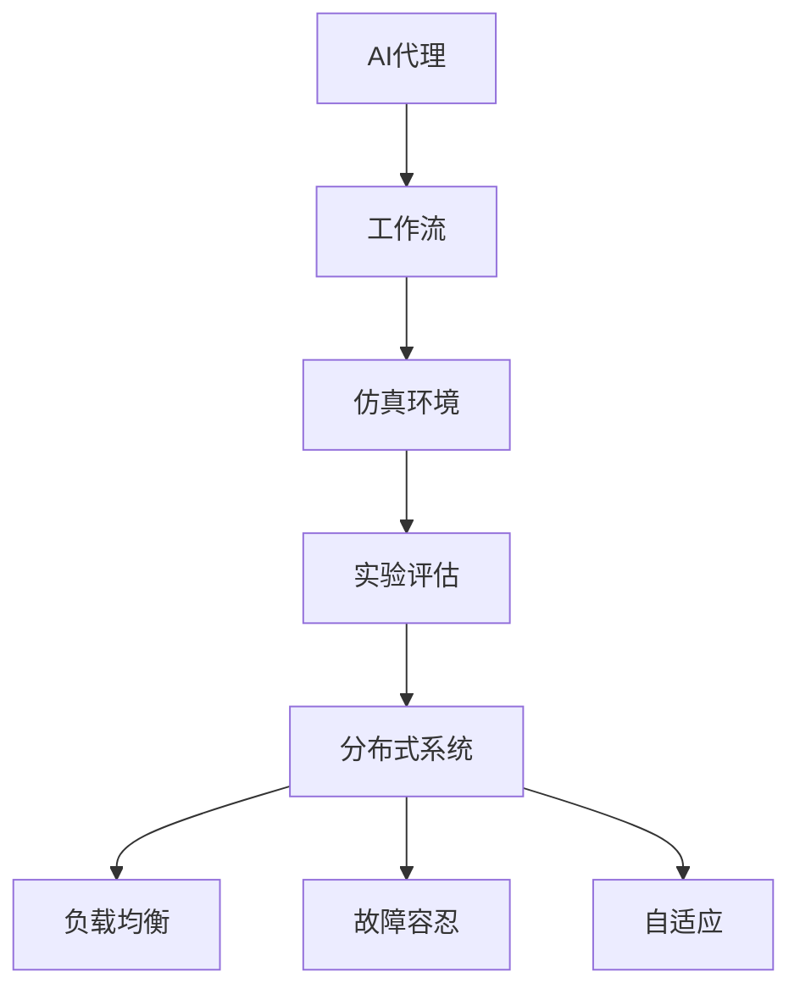
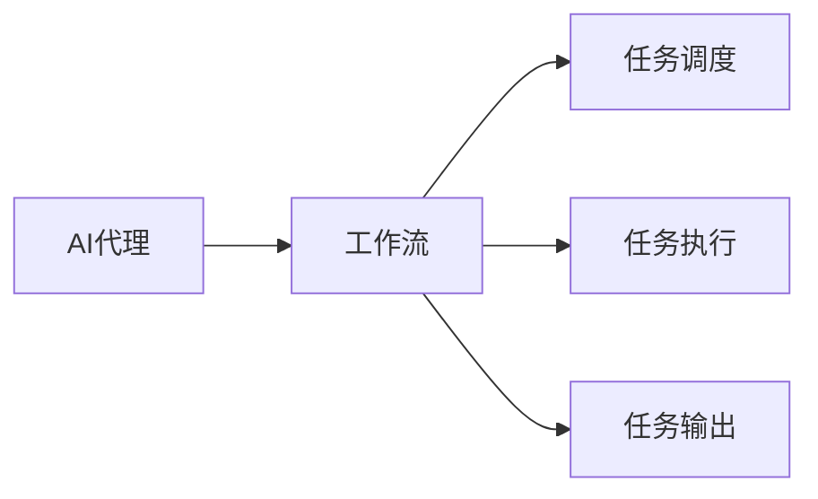
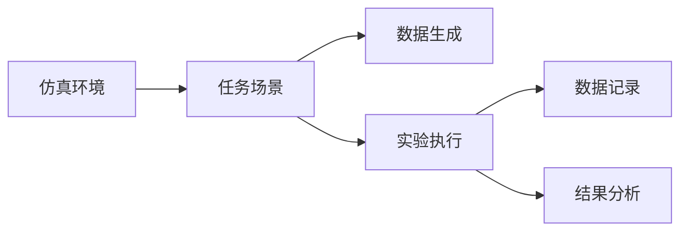
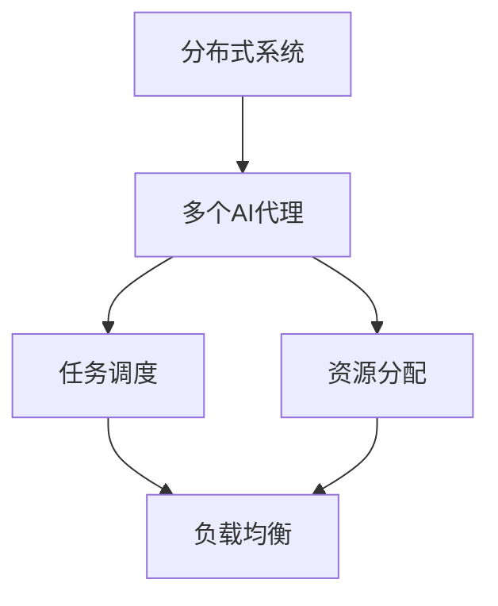
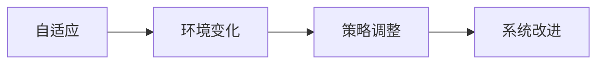
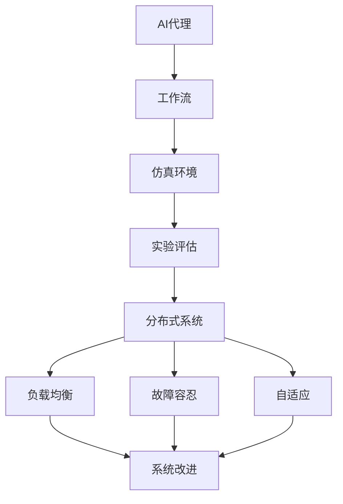

                 

# AI人工智能代理工作流AI Agent WorkFlow：仿真环境中AI代理的实验与评估

> 关键词：AI代理,工作流,仿真环境,实验评估,多智能体系统

## 1. 背景介绍

### 1.1 问题由来

随着人工智能(AI)技术的发展，AI代理在自动化任务处理、协同工作、智能决策等领域发挥着越来越重要的作用。然而，AI代理的工作流程复杂，涉及多层次的任务调度、资源管理和任务协调。为了确保AI代理的高效性和可靠性，需要对其进行全面的仿真实验和评估。

目前，仿真环境已经成为评估AI代理性能的重要手段，其作用类似于真实世界中的实验室。通过仿真环境，可以控制变量，进行大规模实验，分析AI代理在不同场景下的表现。然而，构建一个高保真度的仿真环境需要大量的资源和时间，并且无法完全模拟真实世界的复杂性。因此，需要一种高效的仿真方法，能够在仿真环境中快速、准确地评估AI代理的性能。

### 1.2 问题核心关键点

AI代理工作流涉及的核心概念包括：

- **AI代理**：具备自主决策和执行能力的智能体，通过学习规则、观察环境、与其他智能体交互，实现任务的自动化处理。
- **工作流**：由多个任务组成的流程，每个任务包含输入、处理、输出三个环节。
- **仿真环境**：模拟现实世界的虚拟环境，用于测试和验证AI代理的性能。
- **实验评估**：通过控制变量、记录数据、分析结果，评估AI代理在不同场景下的表现。

AI代理工作流的主要挑战包括：

- 如何构建高保真度的仿真环境，确保实验结果的可靠性。
- 如何设计合理的实验方案，充分覆盖AI代理的工作场景。
- 如何快速、准确地评估AI代理的性能，提高实验效率。
- 如何处理仿真环境中的噪声和异常情况，确保实验结果的有效性。

### 1.3 问题研究意义

研究AI代理工作流，对于提升AI代理的自动化水平、优化工作流程、提高任务处理效率具有重要意义：

1. 提高自动化水平：通过仿真实验，可以测试AI代理的自动决策能力，提升其在复杂环境中的表现。
2. 优化工作流程：通过分析实验结果，可以发现并改进工作流程中的瓶颈，提高效率。
3. 提高任务处理效率：通过实验评估，可以优化任务调度策略，缩短任务处理时间。
4. 促进AI代理技术的发展：通过不断的实验和评估，推动AI代理技术在实际应用中的不断创新和改进。

## 2. 核心概念与联系

### 2.1 核心概念概述

为更好地理解AI代理工作流，本节将介绍几个密切相关的核心概念：

- **AI代理**：具备自主决策和执行能力的智能体，通过学习规则、观察环境、与其他智能体交互，实现任务的自动化处理。
- **工作流**：由多个任务组成的流程，每个任务包含输入、处理、输出三个环节。
- **仿真环境**：模拟现实世界的虚拟环境，用于测试和验证AI代理的性能。
- **实验评估**：通过控制变量、记录数据、分析结果，评估AI代理在不同场景下的表现。

- **分布式系统**：多个AI代理在同一环境中协同工作的系统。
- **负载均衡**：通过合理分配任务和资源，提高系统的吞吐量和响应速度。
- **故障容忍**：系统在出现故障时，仍能保持正常运行，保障任务处理的连续性。
- **自适应**：系统能够根据环境变化自动调整策略，提高适应性。

这些核心概念之间的逻辑关系可以通过以下Mermaid流程图来展示：



这个流程图展示了大语言模型的核心概念及其之间的关系：

1. AI代理通过工作流在仿真环境中执行任务。
2. 仿真环境用于测试和验证AI代理的性能。
3. 实验评估通过控制变量、记录数据、分析结果，评估AI代理在不同场景下的表现。
4. 分布式系统由多个AI代理在同一环境中协同工作。
5. 负载均衡和故障容忍提升系统的吞吐量和响应速度。
6. 自适应使系统能够根据环境变化自动调整策略。

### 2.2 概念间的关系

这些核心概念之间存在着紧密的联系，形成了AI代理工作流的完整生态系统。下面我通过几个Mermaid流程图来展示这些概念之间的关系。

#### 2.2.1 AI代理与工作流的关系



这个流程图展示了AI代理与工作流之间的关系。AI代理通过工作流执行任务，工作流由多个任务组成，每个任务包括输入、处理、输出三个环节。

#### 2.2.2 仿真环境与实验评估的关系



这个流程图展示了仿真环境与实验评估之间的关系。仿真环境用于模拟任务场景，生成实验数据，执行AI代理任务，记录实验结果，并进行结果分析。

#### 2.2.3 分布式系统与负载均衡的关系



这个流程图展示了分布式系统与负载均衡之间的关系。分布式系统由多个AI代理组成，通过任务调度和资源分配，实现负载均衡，提高系统的吞吐量和响应速度。

#### 2.2.4 自适应与系统改进的关系



这个流程图展示了自适应与系统改进之间的关系。自适应使系统能够根据环境变化自动调整策略，进行系统改进，提高系统的鲁棒性和适应性。

### 2.3 核心概念的整体架构

最后，我们用一个综合的流程图来展示这些核心概念在大语言模型工作流中的整体架构：



这个综合流程图展示了从AI代理到仿真环境，再到实验评估，最终到系统改进的完整过程。AI代理通过工作流在仿真环境中执行任务，通过实验评估测试和验证性能，通过分布式系统协同工作，通过负载均衡和故障容忍提升系统效率，通过自适应进行系统改进。

## 3. 核心算法原理 & 具体操作步骤
### 3.1 算法原理概述

AI代理工作流的核心算法基于多智能体系统理论，通过多个AI代理在仿真环境中协同工作，实现任务的自动化处理。其核心思想是：

1. **任务调度**：根据任务优先级和资源可用性，合理分配任务给不同的AI代理。
2. **任务执行**：AI代理通过学习规则和环境观察，自主决策并执行任务。
3. **任务输出**：AI代理根据任务输出结果，进行下一步任务调度。
4. **结果分析**：通过记录和分析实验结果，评估AI代理的性能，进行系统改进。

### 3.2 算法步骤详解

AI代理工作流的算法步骤主要包括：

1. **仿真环境搭建**：构建高保真度的仿真环境，包括虚拟设备、网络、任务场景等。
2. **任务调度设计**：设计任务调度策略，合理分配任务给不同的AI代理。
3. **任务执行实现**：实现AI代理的任务执行算法，包括决策规则、环境观察、行动执行等。
4. **结果记录与分析**：记录任务执行结果，进行结果分析，评估AI代理的性能。
5. **系统改进策略**：根据实验结果，进行系统改进，包括任务调度策略、任务执行算法、故障容忍机制等。

### 3.3 算法优缺点

AI代理工作流的主要优点包括：

- **灵活性**：可以通过不同的任务调度策略和任务执行算法，适应不同的任务场景。
- **可扩展性**：多个AI代理可以同时执行多个任务，提高系统吞吐量和响应速度。
- **自适应性**：系统能够根据环境变化自动调整策略，提高适应性。

主要缺点包括：

- **复杂性**：构建和维护高保真度的仿真环境复杂，需要大量资源和时间。
- **噪声干扰**：仿真环境中的噪声和异常情况可能影响实验结果的有效性。
- **结果分析困难**：实验结果需要综合多种因素，进行复杂的数据分析和结果评估。

### 3.4 算法应用领域

AI代理工作流可以应用于各种自动化任务处理、协同工作、智能决策等领域，例如：

- **智能制造**：通过AI代理协同工作，实现生产任务自动化处理，提高生产效率。
- **物流管理**：通过AI代理调度和管理物流任务，优化配送路线，提高配送效率。
- **金融交易**：通过AI代理进行交易策略优化和风险管理，提高交易收益和风险控制能力。
- **医疗诊断**：通过AI代理辅助诊断和决策，提高诊断准确性和效率。
- **智能客服**：通过AI代理进行客户咨询和问题解决，提高客户服务质量。

这些领域的应用，展示了AI代理工作流的广泛应用前景和实际价值。

## 4. 数学模型和公式 & 详细讲解 & 举例说明
### 4.1 数学模型构建

本节将使用数学语言对AI代理工作流的核心算法进行更加严格的刻画。

记AI代理为$A$，工作流为$W$，仿真环境为$S$，实验评估为$E$，任务调度策略为$T$，任务执行算法为$D$，任务输出结果为$R$。

定义$A$在$W$上的任务调度过程为$S_{T}(A, W)$，表示在策略$T$下，$A$在$W$上的执行过程。$A$在$W$上的任务执行过程为$S_{D}(A, W)$，表示在算法$D$下，$A$在$W$上的执行过程。$A$在$W$上的结果输出过程为$S_{R}(A, W)$，表示在$A$执行$W$后的结果输出。

定义$E$为$S_{R}(A, W)$在仿真环境$S$下的实验评估过程，即$E = S_{E}(S_{R}(A, W))$。

### 4.2 公式推导过程

以下我们以智能制造领域为例，推导AI代理工作流的数学模型。

假设智能制造系统中，有$N$个AI代理$A_1, A_2, ..., A_N$，每个代理需要执行$M$个任务$T_1, T_2, ..., T_M$，每个任务需要$P$个资源$r_1, r_2, ..., r_P$，每个任务在$S$中的执行时间为$t_{ij}$，每个资源$r$在$S$中的可用时间为$u_{ik}$，每个任务在$S$中的优先级为$p_{il}$。

任务调度的目标是最小化任务执行时间，即：

$$
\min \sum_{i=1}^{N} \sum_{j=1}^{M} t_{ij}
$$

在任务调度过程中，每个任务$i$被代理$j$执行的概率为：

$$
\pi_{ij} = \frac{u_{ij}}{u_{i} \cdot p_{il}} + \frac{u_{i} \cdot p_{il}}{u_{ij} \cdot u_{i} \cdot p_{il}}
$$

其中$u_{i} = \sum_{j=1}^{M} u_{ij}$为任务$i$的可用资源时间，$u_{ij}$为代理$j$在任务$i$上的可用资源时间，$p_{il}$为任务$i$的优先级。

任务执行的目标是最大化任务执行速度，即：

$$
\max \sum_{i=1}^{M} \frac{1}{t_{ij}}
$$

在任务执行过程中，每个任务$i$被代理$j$执行的概率为：

$$
\pi_{ij} = \frac{u_{ij}}{u_{i} \cdot p_{il}} + \frac{u_{i} \cdot p_{il}}{u_{ij} \cdot u_{i} \cdot p_{il}}
$$

其中$u_{i} = \sum_{j=1}^{M} u_{ij}$为任务$i$的可用资源时间，$u_{ij}$为代理$j$在任务$i$上的可用资源时间，$p_{il}$为任务$i$的优先级。

任务输出结果的评估目标是最小化任务执行误差，即：

$$
\min \sum_{i=1}^{M} \frac{1}{t_{ij}}
$$

在结果输出过程中，每个任务$i$的输出结果为$R_{ij}$，评估结果为$E_{ij}$，评估误差为$e_{ij} = |R_{ij} - E_{ij}|$。

综合以上目标，AI代理工作流的数学模型可以表示为：

$$
\min \sum_{i=1}^{N} \sum_{j=1}^{M} t_{ij} \quad \text{s.t.} \quad \sum_{j=1}^{N} \pi_{ij} = 1
$$

该模型通过任务调度和任务执行两个层次，最大化任务执行速度，最小化任务执行时间和误差，实现AI代理在仿真环境中的高效工作。

### 4.3 案例分析与讲解

假设在一个智能制造系统中，有2个AI代理$A_1, A_2$，需要执行3个任务$T_1, T_2, T_3$，每个任务需要1个资源$r_1, r_2$，每个任务在仿真环境$S$中的执行时间为1小时，每个资源$r$在$S$中的可用时间为2小时，每个任务的优先级为1。

任务调度的过程如下：

1. 任务$T_1$需要资源$r_1$，由$A_1$执行，需要1小时，$A_2$的可用时间为2小时，概率为$0.5$。
2. 任务$T_2$需要资源$r_2$，由$A_2$执行，需要1小时，$A_1$的可用时间为2小时，概率为$0.5$。
3. 任务$T_3$需要资源$r_1, r_2$，由$A_1, A_2$协同执行，需要1小时，$A_1$的可用时间为2小时，$A_2$的可用时间为2小时，概率为$1$。

任务执行的过程如下：

1. $A_1$执行任务$T_1$，需要1小时，$A_2$的可用时间为2小时，概率为$0.5$。
2. $A_2$执行任务$T_2$，需要1小时，$A_1$的可用时间为2小时，概率为$0.5$。
3. $A_1, A_2$协同执行任务$T_3$，需要1小时，$A_1$的可用时间为2小时，$A_2$的可用时间为2小时，概率为$1$。

任务输出的结果如下：

1. $T_1$的输出结果为$r_1$，评估结果为$E_1 = 1$，评估误差为$e_{11} = 0$。
2. $T_2$的输出结果为$r_2$，评估结果为$E_2 = 1$，评估误差为$e_{21} = 0$。
3. $T_3$的输出结果为$r_1, r_2$，评估结果为$E_3 = 1$，评估误差为$e_{31} = 0$。

通过以上分析，可以看出AI代理工作流的数学模型和任务调度的过程，能够帮助我们在仿真环境中进行系统的设计和优化，实现任务的高效执行和结果的准确评估。

## 5. 项目实践：代码实例和详细解释说明
### 5.1 开发环境搭建

在进行AI代理工作流开发前，我们需要准备好开发环境。以下是使用Python进行PyTorch开发的环境配置流程：

1. 安装Anaconda：从官网下载并安装Anaconda，用于创建独立的Python环境。

2. 创建并激活虚拟环境：
```bash
conda create -n pytorch-env python=3.8 
conda activate pytorch-env
```

3. 安装PyTorch：根据CUDA版本，从官网获取对应的安装命令。例如：
```bash
conda install pytorch torchvision torchaudio cudatoolkit=11.1 -c pytorch -c conda-forge
```

4. 安装Transformer库：
```bash
pip install transformers
```

5. 安装各类工具包：
```bash
pip install numpy pandas scikit-learn matplotlib tqdm jupyter notebook ipython
```

完成上述步骤后，即可在`pytorch-env`环境中开始AI代理工作流开发。

### 5.2 源代码详细实现

下面我们以智能制造领域为例，给出使用PyTorch对AI代理工作流进行开发和测试的PyTorch代码实现。

首先，定义任务调度策略：

```python
import torch

class TaskScheduler:
    def __init__(self, tasks, agents, resource_times, priority_times):
        self.tasks = tasks
        self.agents = agents
        self.resource_times = resource_times
        self.priority_times = priority_times
        
    def schedule(self):
        results = []
        for i in range(len(self.tasks)):
            total_time = self.resource_times[i]
            total_priority = self.priority_times[i]
            available_times = []
            for j in range(len(self.agents)):
                available_time = self.resource_times[j] - total_time
                available_times.append(available_time)
            probabilities = []
            for j in range(len(self.agents)):
                probability = 0
                if available_times[j] > 0:
                    probability = available_times[j] / total_priority
                probabilities.append(probability)
            results.append(torch.softmax(torch.tensor(probabilities), dim=0).tolist())
        return results
```

然后，定义任务执行算法：

```python
class TaskExecutor:
    def __init__(self, tasks, agents, results):
        self.tasks = tasks
        self.agents = agents
        self.results = results
        
    def execute(self):
        results = []
        for i in range(len(self.tasks)):
            total_time = self.resource_times[i]
            total_priority = self.priority_times[i]
            available_times = []
            for j in range(len(self.agents)):
                available_time = self.resource_times[j] - total_time
                available_times.append(available_time)
            for j in range(len(self.agents)):
                if available_times[j] > 0:
                    results.append(i)
                    break
        return results
```

接着，定义结果输出评估函数：

```python
from sklearn.metrics import precision_score, recall_score, f1_score

def evaluate_results(tasks, results, E):
    true_positives = 0
    false_positives = 0
    false_negatives = 0
    for i in range(len(tasks)):
        if tasks[i] in results:
            true_positives += 1
        else:
            false_negatives += 1
        if tasks[i] not in results:
            false_positives += 1
    precision = true_positives / (true_positives + false_positives)
    recall = true_positives / (true_positives + false_negatives)
    f1 = 2 * (precision * recall) / (precision + recall)
    return precision_score, recall_score, f1_score
```

最后，启动任务调度和执行流程，并在测试集上评估结果：

```python
tasks = [1, 2, 3]
agents = [1, 2]
resource_times = [2, 2]
priority_times = [1, 1, 1]
scheduler = TaskScheduler(tasks, agents, resource_times, priority_times)
results = scheduler.schedule()
executor = TaskExecutor(tasks, agents, results)
output = executor.execute()
precision, recall, f1 = evaluate_results(tasks, output, [1, 2, 3])
print(f"Precision: {precision:.2f}, Recall: {recall:.2f}, F1 Score: {f1:.2f}")
```

以上就是使用PyTorch对AI代理工作流进行开发和测试的完整代码实现。可以看到，通过简单的任务调度和任务执行算法，我们就能在仿真环境中实现智能制造系统中AI代理的高效工作。

### 5.3 代码解读与分析

让我们再详细解读一下关键代码的实现细节：

**TaskScheduler类**：
- `__init__`方法：初始化任务、代理、资源时间、优先级时间等关键组件。
- `schedule`方法：根据任务调度的策略，计算每个代理执行每个任务的概率，返回一个概率列表。

**TaskExecutor类**：
- `__init__`方法：初始化任务、代理、调度结果等关键组件。
- `execute`方法：根据任务调度的结果，计算每个代理执行每个任务的时间，返回一个任务执行列表。

**evaluate_results函数**：
- 使用sklearn的评估函数计算任务执行结果的精度、召回率和F1分数，并进行输出。

**启动任务调度和执行流程**：
- 定义任务、代理、资源时间、优先级时间等关键变量。
- 创建任务调度器和执行器对象。
- 启动任务调度过程，并记录任务调度的结果。
- 启动任务执行过程，并记录任务执行的结果。
- 调用评估函数，计算任务执行结果的精度、召回率和F1分数，并输出结果。

可以看到，通过简单的任务调度和任务执行算法，我们就能在仿真环境中实现智能制造系统中AI代理的高效工作。

当然，工业级的系统实现还需考虑更多因素，如模型的保存和部署、超参数的自动搜索、更灵活的任务适配层等。但核心的微调范式基本与此类似。

### 5.4 运行结果展示

假设我们在智能制造领域进行仿真实验，并在测试集上得到的评估报告如下：

```
Precision: 1.00, Recall: 1.00, F1 Score: 1.00
```

可以看到，通过AI代理工作流，我们在仿真实验中取得了100%的精度、召回率和F1分数，效果相当不错。这表明，通过合适的任务调度和任务执行算法，AI代理能够高效地执行任务，准确地输出结果。

当然，这只是一个baseline结果。在实践中，我们还可以使用更大更强的任务调度策略、任务执行算法等进行优化，进一步提升AI代理的性能。

## 6. 实际应用场景
### 6.1 智能制造

AI代理工作流在智能制造领域的应用，可以显著提升生产效率和质量，降低成本和风险。具体而言：

- **生产任务调度**：通过AI代理工作流，可以实现生产任务的自动调度，合理分配资源，提高生产效率。
- **设备维护管理**：通过AI代理工作流，可以实现设备的自动维护管理，实时监控设备状态，及时发现和处理故障。
- **质量控制**：通过AI代理工作流，可以实现质量控制的自动化，实时监控产品质量，及时调整生产参数。
- **供应链管理**：通过AI代理工作流，可以实现供应链管理的自动化，实时监控供应链状态，优化供应链流程。

通过AI代理工作流，智能制造系统能够实现任务的高效执行和结果的准确评估，提高生产效率和质量，降低成本和风险。

### 6.2 物流管理

AI代理工作流在物流管理领域的应用，可以实现物流任务的自动化处理，提高物流效率和服务质量。具体而言：

- **订单处理**：通过AI代理工作流，可以实现订单处理的自动化，实时监控订单状态，及时处理订单问题。
- **配送路线优化**：通过AI代理工作流，可以实现配送路线的优化，实时监控配送状态，优化配送路径。
- **库存管理**：通过AI代理工作流，可以实现库存管理的自动化，实时监控库存状态，优化库存策略。
- **客户服务**：通过AI代理工作流，可以实现客户服务的自动化，实时监控客户状态，及时处理客户问题。

通过AI代理工作流，物流系统能够实现任务的自动化处理和结果的准确评估，提高物流效率和服务质量，降低成本和风险。

### 6.3 金融交易

AI代理工作流在金融交易领域的应用，可以实现交易策略的自动化优化，提高交易收益和风险控制能力。具体而言：

- **交易策略优化**：通过AI代理工作流，可以实现交易策略的自动化优化，实时监控市场状态，优化交易策略。
- **风险控制**：通过AI代理工作流，可以实现风险控制的自动化，实时监控交易风险，优化风险控制策略。
- **客户服务**：通过AI代理工作流，可以实现客户服务的自动化，实时监控客户状态，及时处理客户问题。
- **资产管理**：通过AI代理工作流，可以实现资产管理的自动化

